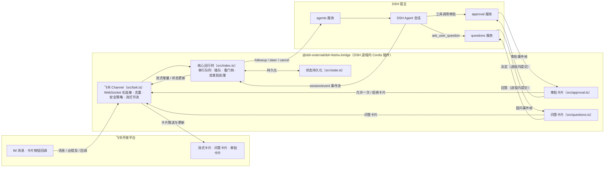

# @dsh-external/dsh-feishu-bridge

> 飞书机器人 ↔ DSH 对话桥：把 DeepSeek Harness（DSH）装进飞书，聊天即算力。

DSH（DeepSeek Harness）的进程内 Cordis 插件：飞书 IM 收发消息，流式卡片实时呈现 DSH 的思考与工具调用进度；问答卡片、工具审批卡片直接在飞书里点按完成；斜杠命令全量遥控会话——无需打开 Web GUI，也能完整使用 DSH。

## ✨ 功能特性

- 🚀 **飞书 IM ↔ DSH 对话桥**：基于 WebSocket 长连接收发消息，私聊即聊即答，群聊 @ 机器人触发。
- 📬 **出站 Outbox 零丢失**：非流式回复与兜底错误通知先进持久化队列再投递（JSONL 分段 + 原子落盘、幂等键防重复），失败按有界指数退避重试，进程崩溃 / 重启后自动续投，at-least-once 不丢消息。
- 📥 **入站 WAL 请求补发**：消息注入 Agent 前先落盘，回复确认送达后记账；进程崩溃 / 重启后启动对账，自动重新触发未送达的纯文本消息（单条最多补发 2 次、30 分钟窗口内），不再静默丢请求。
- 🖼️ **入站多媒体**：图片消息自动下载 → 宿主 attachment 存储（ImageBlock）→ 注入 Agent 供视觉模型看图（宿主未装配 attachment 服务时降级为本地路径注记）；文件消息 → 下载 → 有界文本提取（150KB 字节界 + 8000 字符截断，txt/md/json/csv/log 等文本类）或二进制仅注记文件名 / 大小 / 路径；下载失败或 401/403 无凭据场景安静降级，绝不阻塞主流程；媒体消息不进 WAL 补发（重放不可靠，设计决策）；文件落盘 `~/.dsh/dsh-feishu-bridge/media/`。
- 📤 **出站文件工具 `lark_send_local_file`**：模型主动把本地文件回传到当前飞书会话——会话反查（agent id → chat 映射）+ realpath 白名单（仅当前工作区与插件数据目录，防路径穿越）+ 20MB 上限 + 扩展名白名单（图片 / 文档 / 压缩包等常见格式）；png/jpg/webp/gif 发图片消息，其余发文件消息。
- ⚡ **流式卡片**：DSH 输出逐字实时渲染到飞书卡片，思考过程「看得见」。
- 📑 **Markdown 结构化卡片**：非流式回复自动识别 Markdown 结构（标题 / 列表 / 代码块 / 表格 / 分隔线 / 引用）渲染为结构化飞书卡片；超长（60 行 / 4000 字符）或解析异常自动降级为纯文本卡片；流式卡片保持逐字渲染不变。
- 🔧 **工具调用进度**：agent 调用工具时卡片实时显示「🔧 正在调用工具：xxx…」，多步回合不再干等。
- 🎯 **问答卡片**：agent 的 `ask_user_question` 以交互卡片呈现——按钮单选、勾选多选、聊天自由文本作答，点按即答。
- 🛡️ **工具审批卡片**：agent 请求工具时推送「✅ 允许一次 / 🚫 拒绝」卡片，决策在飞书内完成；10 分钟未响应自动过期撤卡。
- 🔐 **三级权限卡 `/permission`**：🔒 只读（沙箱只读）/ ✏️ 工作区写（工作区可写、工具需审批）/ ⚡ 全放行（同 `/yolo` 免审批）三档单选卡，点击即切；立即生效并持久化（state.json `chatPermissionTiers`），重启 / 新会话自动恢复，设置时同步覆盖 `/yolo` 内存态。
- 😀 **表情回执**：收到消息随机打一个「已收到」表情，回合完成打 DONE ✅；仅使用飞书实测有效的表情全集（防 400 报错）；扫码一键配置自动申请 `im:message.reaction` 权限（旧应用需手动补开）。
- ⚡ **扫码一键配置**：装好插件后发 `/setup`（飞书内）或调用 `feishu_setup` 工具（DSH 内），扫码即自动完成「创建应用 + 获取凭据 + 重连飞书」，免去手动开放平台配置。
- 🧠 **思考强度调节**：`/effort` 查看当前模型支持的思考档位，`/effort <档位>` 切换，下一回合生效、偏好持久化。
- 🎛️ **命令卡片化**：`/model` 无参数升级为单选按钮卡——按供应商分组、点击即切（下一回合生效），原文本列表保留为 `/model list`，`/model <序号>` 直切不变。
- 🏥 **一键诊断包 `/doctor`**：收集当前会话完整 session log（与 WebUI「Session log」下载同源，live 会话先 flush 落盘）+ 脱敏配置（凭据 / 密钥 / token 打码）+ ISSUE.md（插件与 DSH 版本 / 系统 / 状态快照 / 症状模板）→ fflate 打包 ZIP（日志 8MB 截断、ZIP 10MB 超限裁日志）→ 发回飞书；单项收集失败写入 ISSUE.md「收集失败」节，不阻塞出包。
- 🎭 **多模式 Agent 切换 `/mode`**：单选卡枚举宿主 `agentPresets` 实时预设（服务不可达安静降级为内置 standard，不抛异常），点击或 `/mode ` 即切；偏好持久化（state.json `chatModes`，独占写，重启恢复）；切换即重置当前会话（epoch+1，旧会话行保留）；新会话创建自动按 chat 偏好应用预设（回落部署 defaultId → standard）。
- ⌨️ **斜杠命令**：20 个命令覆盖模型切换、多模式 Agent 切换、思考强度、工作区管理、会话恢复、流式开关、免审批模式、权限档位、诊断包、扫码配置等（见下方命令表）。
- 🚦 **命令三级分流**：桥特有命令 → DSH 宿主注册命令（如 `/goal`，原生执行不走模型）→ 未知 `/xxx` 与普通消息原样注入 Agent，三级自动分流，命令与对话互不误伤。
- 🔀 **每会话串行队列 + 插队**：同一聊天内消息按序处理；新消息可打断运行中的慢回合（阈值可配），也可强制排队。
- 🐕 **看门狗**：单回合超过时限自动取消该回合并回复错误卡片，**绝不退出进程**。
- 📦 **消息突发批处理**：短窗口内连发的普通消息合并为一次进入 DSH，省调用、省 token。
- 🚧 **入站防护**：单条消息长度上限（默认 20000 字符，超出截断并提示）+ 每 chat 每分钟消息数上限（默认 30 条，防刷屏烧 LLM 额度），config 可调、`0` = 关闭。
- 💾 **状态持久化**：会话代次、工作区绑定等持久化到本地状态文件，重启后记忆保留。
- 🩹 **可靠性加固**：state.json 原子落盘（tmp + rename + 0600，防写半截丢状态）；问答卡片断流 2 秒退避自动重订阅（防断线后静默失效）。
- 🔁 **断线自愈**：长连接异常自动退避重连；重连后向所有已知会话广

播恢复通知。
- ⛔ **连接配额熔断**：60 分钟窗口内连接失败达阈值（默认 12 次）自动熔断停止重试，防飞书连接配额烧穿；窗口过期自动恢复，失败历史落盘跨重启生效；`/restart` 手动重连即解除熔断。
- 🧠 **会话记忆管理**：`/reset` `/new` 开启新的记忆代次，`/resume` 带摘要恢复历史会话，`/workspace` 绑定工作区。
- 📊 **用量透明**：回复卡片底部显示本会话累计 token 用量（输入 / 输出，K/M 格式化）。

## 📐 架构

本插件是运行在 DSH 进程内的 Cordis 插件（`inject: ['agents']`），通过 **ctx 服务直调**驱动 DSH：

- 消息注入走 `agents` 服务的 `create` / `resume` / `followup` / `steer` / `cancel`，全程进程内直调，不另起进程、不走网络；
- 审批卡片与问答卡片订阅宿主的进程内事件帧，经 `approval` / `questions` 服务交互，点按结果直接提交回宿主；
- 不注册任何 provider / answerer，不与宿主自带实现冲突，卸载即净。



模块一览：

### 模块 · 职责
- **模块**: `src/index.ts` · **职责**: 插件入口与核心运行时：消息入口、每 chat 串行队列与插队、看门狗、流式 / 非流式回复管线、入站媒体分流与附件注入、Outbox / WAL / 配额熔断 / 表情回执接线、agent 预设解析链（chatModes 偏好 → 部署 defaultId → standard）、生命周期
- **模块**: `src/lark.ts` · **职责**: 飞书 Channel：WebSocket 长连接、消息去重、聊天队列、陈旧消息窗口、流式卡片节流
- **模块**: `src/commands.ts` · **职责**: 斜杠命令表与三级分流（Tier 1 桥命令 / Tier 2 宿主注册命令原生执行 / Tier 3 注入 Agent）；卡片化命令：/model 单选卡、/permission 三级权限卡、/doctor 接线、/mode 单选卡与卡片回调路由（cmd\ · model\ · / cmd\ · perm\ · / cmd\ · mode\ · ）
- **模块**: `src/outbox.ts` · **职责**: 出站 Outbox：JSONL 分段 + 原子落盘、幂等键防重复投递、分航道 FIFO、有界指数退避、终态自清理、超长 payload 溢出 blobs/
- **模块**: `src/wal.ts` · **职责**: 入站 WAL：注入前落盘、delivered 记账、启动对账补发（2 次 / 30 分钟窗口上限）
- **模块**: `src/reactions.ts` · **职责**: 表情回执：飞书实测 emoji 白名单过滤、随机「已收到」池、DONE 完成标记
- **模块**: `src/markdown-card.ts` · **职责**: Markdown 结构化渲染：标题 / 列表 / 代码块 / 表格 → CardKit 元素，超限或异常降级为纯文本
- **模块**: `src/quota.ts` · **职责**: 连接配额熔断：60 分钟窗口失败计数、跨重启落盘（0600）、熔断状态查询
- **模块**: `src/approval.ts` · **职责**: 工具审批卡片：订阅审批事件、发卡、按钮回调路由、过期回收、YOLO 自动放行
- **模块**: `src/questions.ts` · **职责**: 问答卡片：单选 / 多选 / 自由文本、答案提交、过期回收、断流自动重订阅
- **模块**: `src/batching.ts` · **职责**: 消息突发批处理：滑动窗口合并普通消息
- **模块**: `src/media.ts` · **职责**: 入站多媒体（P2）：图片下载 → attachment 存储（ImageBlock）/ 本地落盘，文件有界文本提取（150KB + 8000 字符）或元信息注记，401/403 安静降级
- **模块**: `src/send-file.ts` · **职责**: 出站文件工具 `lark_send_local_file`（P2）：会话反查、realpath 白名单目录、20MB / 扩展名白名单、图片走 image 消息其余走 file 消息
- **模块**: `src/doctor.ts` · **职责**: /doctor 诊断包（P2）：session log 收集（live 先 flush）+ 脱敏配置 + ISSUE.md，fflate ZIP 打包发送
- **模块**: `src/state.ts` · **职责**: 状态持久化：会话代次 / 会话列表 / 工作区绑定 / 会话覆盖 / 权限档（chatPermissionTiers）/ /mode 模式偏好（chatModes，saveChatMode 独占写，原子落盘 0600）
- **模块**: `src/text.ts` · **职责**: 文本处理：@ 提及剥离、超长截断、token 数量格式化

## ✅ 测试

正式单元测试（vitest，**193 用例全绿**）：`npm test` 一键运行，测试代码独立 tsc 编译（`test/tsconfig.json`）。覆盖 outbox / wal / state / questions / reactions / markdown-card / quota / command-router / media / send-file / doctor / permission / mode 全部核心模块。

## 🚀 快速开始

从零到用上大约 10 分钟：把插件装进 DSH（方式 A / B / C 任选），扫码一键配置（或手动）拿到应用与凭据，最后在飞书里与机器人对话。

### 前提

- 已部署 **DSH（DeepSeek Harness）** 环境。
- 本插件 `peerDependencies` 依赖 DSH 内部包（`@deepseek-ai/dsh-llm`、`@deepseek-ai/dsh-tools`，不发布于公开 npm）以及 `cordis`、`schemastery`，**必须运行在 DSH 进程内**，无法独立安装或独立部署。
- 一个可登录[飞书开放平台](https://open.feishu.cn/)的账号。

### 第一步：获取飞书应用

本插件使用**长连接模式**与飞书通信：插件主动发起 WebSocket 连接收发消息，**不需要公网回调地址，也不需要配置任何 webhook**。飞书应用有两种获取方式，推荐扫码一键配置。

#### ✅ 首选：扫码一键配置

装好插件后（方式 A / B / C 任一），无需手动去开放平台创建应用。**首次配置（插件还没连上飞书）只能走 DSH 入口**——此时机器人无法收发消息，飞书里的 `/setup` 发不出去；DSH 入口不依赖飞书连接，是唯一的从零路径：

1. **发起配置**（二选一）：
   - **DSH 内（首次配置必选）**：在 DSH 的会话里对 agent 说「**配置飞书**」或「**生成飞书授权链接**」，agent 会自动调用 `feishu_setup` 工具，**返回一个授权链接**（含过期时间，如 3600 秒）。把链接复制到浏览器打开，或用飞书扫码，授权完成后工具自动写入凭据并重连，直接在会话里看到结果——全程无需离开 DSH；
   - 飞书内：给机器人发 `/setup`（需已有凭据连接、桥正常运行），返回同样的授权链接。适合已连接后**换应用 / 刷新凭据**。
2. 打开链接，用飞书 App 扫码确认。应用名预填为「{user} 的 DSH 飞书桥」，权限预填 `im:message` / `im:message:send_as_bot`、消息事件与卡片回调。
3. 授权完成后插件自动获取 App ID / Secret，写入 `~/.dsh/dsh-feishu-bridge/credentials.json`（权限 0600），并自动重连飞书（等价热重载：内存态偏好重置，持久化状态保留），无需重启 DSH。

> ⚠️ 平台灰度可能忽略预填的权限：若扫码授权成功但机器人不回复，按下方排错表到开发者后台补开权限并重新发布版本。
> ⚠️ 每次 `/setup` / `feishu_setup` 都会**创建新应用**（createOnly 设计），重复执行会累积多个应用；介意可在开发者后台删除旧应用。

#### 进阶：手动创建飞书应用（可选）

不想扫码时，也可以手动把应用信息准备好：

1. 打开[飞书开放平台](https://open.feishu.cn/) → 进入「开发者后台」→ 点击**创建企业自建应用**，填写名称与描述后创建。
2. 在应用详情页的「添加应用能力」中启用**机器人**。
3. 在「权限管理」中搜索并开通以下两个权限：
   - `im:message` —— 读取用户发给机器人的消息（含群聊 @ 消息）；
   - `im:message:send_as_bot` —— 以机器人身份发送消息。
4. 在「可用范围」中添加需要使用机器人的成员与群组（默认可能为空，不加则任何人都用不了）。
5. 在「版本管理与发布」中**创建版本并发布**，等待审核通过后应用才真正生效。⚠️ 大量「机器人不回复」的案例都是只保存了配置、忘了发布版本。
6. 在「凭证与基础信息」中记下 **App ID**（形如 `cli_xxxxxxxx`）与 **App Secret**，第三步会用到。

### 第二步：安装插件（三种方式任选其一）

方式 A：标准装配（无注入器）；方式 B：注入器一键安装（已有 dsh-super-injector）；方式 C：命令行一键安装（推荐给熟悉命令行的用户）。三种方式任选其一即可。

#### 方式 C：命令行一键安装（推荐给熟悉命令行的用户）

> 支持 Linux / macOS（bash）。Windows 用户请使用下方「只下载不安装」命令拿到 tgz 后，按方式 A 手动安装。

一条命令自动完成「下载最新 Release → 解压到 `~/dsh-plugins/dsh-feishu-bridge` → 装配进 `web` profile → 建软链」：

```bash
curl -fsSL https://raw.githubusercontent.com/21hbguo/dsh-feishu-bridge-plugin/main/scripts/install.sh | bash
```

或分步执行（建议先下载查看脚本内容再运行）：

```bash
curl -fsSL -o install.sh https://raw.githubusercontent.com/21hbguo/dsh-feishu-bridge-plugin/main/scripts/install.sh
bash install.sh
```

默认装配到 `web` profile；可用参数自定义，例如：

```bash
bash install.sh --profile my-profile --dir ~/dsh-plu