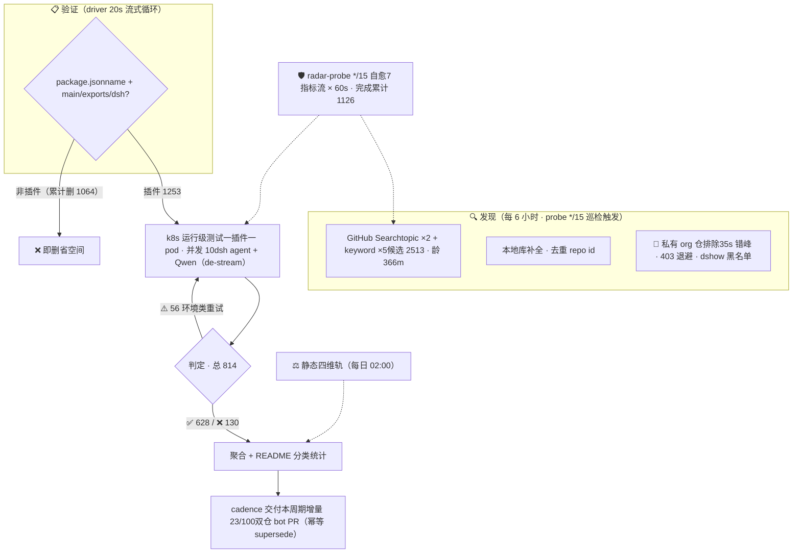

# Awesome DSH Plugins

**自动发现、证据验证的 DeepSeek Harness 插件生态雷达。自动发现 2500+ 候选、逐个 k8s 实测**

安装前就知道哪个能用，不用自己踩坑。

> 收录 1253 个 DSH 插件仓库（索引到2513个repos ，正由专用K8s集群，动态在DSH最新版本下验证可用性，目前高速迭代中）。

## 工作原理

> 📌 数据截至快照 `20260814T213619Z`（2026-08-14T21:36:19+00:00 · 分类器 unified-v1）

## 快速导航

| 你的目标 | 跳转入口 |
|---|---|
| 看热门插件 | [🔥 Star Top 20](#-热门插件star-top-20) |
| 按用途找一个插件 | [📋 分类目录](#分类目录) · [PLUGINS.md](PLUGINS.md) — 9 大功能领域 + 兼容性状态 |
| 浏览自动发现的全部仓库 | [📊 当前生态快照](#当前生态快照) — 日期化兼容矩阵 |
| 了解最近发生了什么 | [📝 CHANGELOG](CHANGELOG.md) |
| 登记或提交插件 | [🔧 给插件开发者](#给插件开发者) · 加 `dsh-plugin` topic → 8h 自动收录 · [PR 模板](.github/PULL_REQUEST_TEMPLATE.md) |
| 维护本雷达 | [⚙️ 自动化 SOP](docs/SOP.md) |
| 给插件使用者指南 | [📖 给插件使用者](#给插件使用者) |
| 本仓库如何判定兼容性 | [🔍 本仓库如何判定](#本仓库如何判定) |
| 加入社群交流 | [💬 DSH 学习社区](#-dsh-学习社区-dshfindcom) · [微信交流群](#微信交流群) |

> [!IMPORTANT]
> **收录不等于兼容，静态检查不等于运行可用，运行可用也不等于安全审计。**
> 本仓库提供可追溯的筛选信号，不代表 DSH 官方背书。安装第三方插件前，请检查插件源码、权限、依赖、许可证及测试日期。

## 🔥 热门插件（Star Top 20）

> 按 GitHub star 数排序，每 20 分钟自动刷新。数据截至 2026-08-15 02:20。

| # | 插件 | ⭐ | 说明 |
|---|---|---|---|
| 1 | [dsh-web-ui](https://github.com/zhu1090093659/dsh-web-ui) | 1994 | Plugin and skin collection for DeepSeek Harness (DSH) W… |
| 2 | [modlens](https://github.com/liustack/modlens) | 1341 | The first vision plugin for DeepSeek Harness, and the v… |
| 3 | [TokenTracker](https://github.com/xiufengsun/TokenTracker) | 1308 | Local-first AI token usage & cost tracker for 31 coding… |
| 4 | [PicGo-Core](https://github.com/PicGo/PicGo-Core) | 969 | :zap:The ultimate image uploading engine. Both CLI & AP… |
| 5 | [dsh-TUI](https://github.com/ccch1mneyyy/dsh-TUI) | 919 | 解决DSH 官方尚无终端 TUI 痛点的补位之作，献给偏爱cli的各位极客：Claude Code 风格全屏交… |
| 6 | [DSH-better-sidebar](https://github.com/omdsh-dev/DSH-better-sidebar) | 803 | 一个侧边栏的完整工作台，支持三方拓展注册新侧边栏页面。内置文件渲染编辑/终端/Git/子代理 |
| 7 | [sandbase-harness](https://github.com/sandbaseai/sandbase-harness) | 576 | Open-source CMA-compatible agent runtime for any model,… |
| 8 | [dsh-ads](https://github.com/Nagi-ovo/dsh-ads) | 345 | 把 DSH 变成 2005 年门户网站｜Parody ads, fake games, and popups … |
| 9 | [dsh-vision-toolkit](https://github.com/Anionex/dsh-vision-toolkit) | 341 | 让纯文本模型更好地做视觉任务的DeepSeek Harness插件：带意图的图片问答、长截图 OCR、UI 还… |
| 10 | [Abu-Cowork](https://github.com/PM-Shawn/Abu-Cowork) | 326 | Open-source alternative to Claude Cowork — a local-firs… |
| 11 | [dsh-agent-teams](https://github.com/NanmiCoder/dsh-agent-teams) | 254 | AgentTeams plugin for DeepSeek Harness |
| 12 | [Bigfish](https://github.com/turtle2209/Bigfish) | 176 | Bigfish —— DeepSeek Harness 的第三方桌面端，内置 Node 运行时，双击即用，附带… |
| 13 | [oh-dsh](https://github.com/hust-open-atom-club/oh-dsh) | 169 | 一站式 DeepSeek Harness 社区发行版：TUI、桌面端与 Web UI 三种形态统一体验，支持分… |
| 14 | [dsh-at-file](https://github.com/omdsh-dev/dsh-at-file) | 140 | Codex-style @file mentions for DeepSeek Harness: search… |
| 15 | [dsh-tianshu-tui](https://github.com/huiliyi37/dsh-tianshu-tui) | 136 | dsh-tianshu-tui — DeepSeek Harness terminal UI +harness… |
| 16 | [whale-girl](https://github.com/vlln/whale-girl) | 132 | DSH Web GUI 桌面宠物插件（QQ 宠物形态）：右下角悬浮、可拖拽/投喂/玩耍的积累型伙伴。官方 re… |
| 17 | [dsh-browser](https://github.com/Lum1104/dsh-browser) | 96 | dsh plugin: Chrome sidebar extension that lets DSH oper… |
| 18 | [modsearch](https://github.com/liustack/modsearch) | 94 | The web plugin for DeepSeek Harness, and the search bri… |
| 19 | [dsh-visualize](https://github.com/Nagi-ovo/dsh-visualize) | 85 | 在 DSH 对话中生成交互式可视化｜Render model-generated interactive ca… |
| 20 | [dsh-genui](https://github.com/omdsh-dev/dsh-genui) | 78 | GenUI for DeepSeek Harness: interactive UI components r… |

## 分类目录

> 按功能领域分类（重分类修正）。点击标题展开，全部条目一次显示。 新收录条目（社区）的兼容性为**运行级跟踪口径**（k8s agent 实测）。 新收录条目（社区）的兼容性为**运行级跟踪口径**（k8s agent 实测）。

### 🔌 Web UI 增强（247）

*界面与交互增强插件：侧边栏、输入框、皮肤主题、面板 dock、消息显示、状态栏与可视化，让 Web 界面更顺手更好看*

| 插件 | 类型 | 兼容性 | 说明 |
|---|---|---|---|
| [dsh-vision](https://github.com/dsh-external/dsh-vision) | 插件 | 关注 | dsh 插件：给纯文本 DeepSeek 加视觉——view_image 工具桥接任意 OpenAI 兼容 VLM（默认智谱免费档，实测 4 厂商 10 模型） |
| [dsh-web-ui](https://github.com/dsh-external/dsh-web-ui) | 合集 | 关注 | Plugin and skin collection for DeepSeek Harness (DSH) Web UI - task board, git g |
| [ex-setting](https://github.com/dsh-external/ex-setting) | 插件 | 关注 | DSH的设置扩展 |
| [web-components](https://github.com/dsh-external/web-components) | 基建 | 关注 | web-components支持 |
| [dsh-split-panes](https://github.com/dsh-external/dsh-split-panes) | 插件 | 需适配 | — |
| [turtle-ui](https://github.com/dsh-external/turtle-ui) | 插件 | 需适配 | as is, no warranty |
| [dsh-ads](https://github.com/dsh-external/dsh-ads) | 插件 | 待调研 | 是兄弟就来蹬我！DSH Web UI 广告：2005 年中文站点风格的侧栏广告 / 对话内信息流 / 角落弹窗 + 一个真实热区比视觉小得多的关闭叉 |
| [dsh-aigc-canvas](https://github.com/dsh-external/dsh-aigc-canvas) | 插件 | 待调研 | — |
| [dsh-annotation](https://github.com/dsh-external/dsh-annotation) | 插件 | 待调研 | DSH Web 选中批注插件：选文字→批注→回车随消息发送；气泡隐藏批注块（零闪烁）；回复按 Annotation N 逐条对照（可悬浮芯片） |
| [dsh-anti-ads](https://github.com/dsh-external/dsh-anti-ads) | 插件 | 待调研 | — |
| [DSH-better-sidebar](https://github.com/dsh-external/DSH-better-sidebar) | 插件 | 待调研 | 一个侧边栏的完整工作台，支持三方拓展注册新Tab页面，内置文件渲染编辑/终端/Git/子代理 |
| [dsh-custom-css](https://github.com/dsh-external/dsh-custom-css) | 插件 | 待调研 | — |
| [dsh-drag-and-drop](https://github.com/dsh-external/dsh-drag-and-drop) | 插件 | 待调研 | 为 DSH Web UI 增加跨平台文件拖拽与原始路径插入能力，无需复制文件 |
| [dsh-message-edit](https://github.com/dsh-external/dsh-message-edit) | 插件 | 待调研 | DSH plugin: branch-based message editing, reroll, retry, version timeline |
| [dsh-side-panel](https://github.com/dsh-external/dsh-side-panel) | 插件 | 待调研 | DSH 侧边栏，集成文件浏览器、终端和 Git 审查，方便预览文件 |
| [dsh-ultra-ui](https://github.com/dsh-external/dsh-ultra-ui) | 插件 | 待调研 | — |
| [ui-status-label](https://github.com/dsh-external/ui-status-label) | 插件 | 待调研 | 把你鲸鱼娘思考时的 deep diving 自定义成任意你想要的样子 |
| [ya-workspace-sidebar](https://github.com/dsh-external/ya-workspace-sidebar) | 插件 | 待调研 | — |
| [awesome-dsh-background-plugin](https://github.com/leavestring/awesome-dsh-background-plugin) | 社区 | ✅ 运行级可用 | DSH Web 背景个性化插件：上传自己的图片（JPG / PNG / WEBP / GIF，浏览器端自动压缩到 1600px 以内）或一键切换极光、余烬、宣纸 |
| [Better_Deepseek_Harkness](https://github.com/silencieuxzero/Better_Deepseek_Harkness) | 社区 | ✅ 运行级可用 | 更好的deepseek harness，为webui进行了一些拓展 |
| [claude-harness-desktop](https://github.com/pingta-guangpingwang/claude-harness-desktop) | 社区 | ✅ 运行级可用 | An Electron-based multi-project AI cockpit that orchestrates multiple Claude Cod |
| [claude-parchment-theme](https://github.com/RayYeung1989/claude-parchment-theme) | 社区 | ✅ 运行级可用 | 一款 Claude 风格的 dsh插件：为 DSH WebUI 打造，暖羊皮纸 Parchment 色板、Terracotta 品牌色与衬线字体 |
| [computer-use-plus](https://github.com/Ethanout/computer-use-plus) | 社区 | ✅ 运行级可用 | Low-token, low-latency Windows computer-use MCP with learned shortcuts, UIA/CDP/ |
| [deepseek-harness-dsh-plugin-hub](https://github.com/LinBuYan/deepseek-harness-dsh-plugin-hub) | 社区 | ✅ 运行级可用 | DSH 插件中心：右下角悬浮面板，聚合 GitHub 生态扫描、社区插件热榜与已装插件管理，内置五维风险检查与一键安装 |
| [deepseek-harness-plugin-from-scratch](https://github.com/Opr4Mp3r/deepseek-harness-plugin-from-scratch) | 社区 | ✅ 运行级可用 | Code-audited, progressive guide to production-grade DeepSeek Harness plugins |
| [deepseek-harness-skin](https://github.com/goodpostidea-tech/deepseek-harness-skin) | 社区 | ✅ 运行级可用 | deepseek-harness-skin |
| [deepseek-harness-tui](https://github.com/boxeryao/deepseek-harness-tui) | 社区 | ✅ 运行级可用 | DSH-TUI: a lightweight and fast terminal plugin connected directly to the DSH ru |
| [deepseek-harness-vscode](https://github.com/urwff/deepseek-harness-vscode) | 社区 | ✅ 运行级可用 | Run DeepSeek Harness in the VS Code sidebar, Claude Code for VS Code style |
| [deepseek_harness_ui_schema_fix](https://github.com/sixsixla/deepseek_harness_ui_schema_fix) | 社区 | ✅ 运行级可用 | — |
| [DeepSeekHarness-DesktopUI](https://github.com/Adnnnnai/DeepSeekHarness-DesktopUI) | 社区 | ✅ 运行级可用 | — |
| [DeepSeekHarnessDesktop](https://github.com/lx67621956-create/DeepSeekHarnessDesktop) | 社区 | ✅ 运行级可用 | DeepSeekHarness桌面版（自用）—— 官方 DeepSeek Harness (dsh) 的 Windows 桌面壳：内置固定版 dsh 运行时，免 |
| [DeepSeekHarnessThirdModelThinkMgr](https://github.com/Lenonss/DeepSeekHarnessThirdModelThinkMgr) | 社区 | ✅ 运行级可用 | 支持DeepSeekHarness上配置第三方模型的思考选择项，在对话界面实时选择 |
| [dhs-theme-plugin](https://github.com/kongxiangyiren/dhs-theme-plugin) | 社区 | ✅ 运行级可用 | dsh 主题管理插件 |
| [ds-web-ui](https://github.com/xing-shuyin/ds-web-ui) | 社区 | ✅ 运行级可用 | My DeepSeek Harness Web UI |
| [dscode](https://github.com/creativedswork/dscode) | 社区 | ✅ 运行级可用 | dscode is a coding agent that empowers digital and knowledge work |
| [dsh-agent-sdk](https://github.com/salathleizhang/dsh-agent-sdk) | 社区 | ✅ 运行级可用 | Embeddable, plugin-based coding-agent runtime built on DeepSeek Harness |
| [dsh-angry](https://github.com/01Virex/dsh-angry) | 社区 | ✅ 运行级可用 | Turns the DeepSeek Harness web UI red and shaky the longer a turn runs — the "re |
| [dsh-attachment-formats](https://github.com/linkingoscar/dsh-attachment-formats) | 社区 | ✅ 运行级可用 | Codex-style attachment formats for the DeepSeek Harness Web GUI: PDF text-layer  |
| [dsh-atuin](https://github.com/search?q=dsh-atuin) | 社区 | ✅ 运行级可用 | — |
| [dsh-auto-continue](https://github.com/HsiangNianian/dsh-auto-continue) | 社区 | ✅ 运行级可用 | DSH Web UI plugin: auto-sends 「继续」 to resume requests interrupted by network err |
| [dsh-auto-memory](https://github.com/Aik358/dsh-auto-memory) | 社区 | ✅ 运行级可用 | DSH 自动记忆插件:三层记忆(用户级/项目笔记/每日日志)自动注入与检索、每日反思、可视化面板与设置页,支持继承其他 AI 工具的历史记忆 |
| [dsh-background-agents](https://github.com/PerryLink/dsh-background-agents) | 社区 | ✅ 运行级可用 | Interactive long-session background agents for DeepSeek Harness: start a durable |
| [dsh-balance-meter](https://github.com/Ghost011118/dsh-balance-meter) | 社区 | ✅ 运行级可用 | DeepSeek account balance and session cost readout for the DeepSeek Harness Web G |
| [dsh-balance-monitor](https://github.com/jelly-000/dsh-balance-monitor) | 社区 | ✅ 运行级可用 | DeepSeek 账户余额、剩余比例条与今日花费，显示在 dsh 侧边栏底部 · DeepSeek balance, remaining-ratio bar a |
| [dsh-better-archive](https://github.com/huahai0202/dsh-better-archive) | 社区 | ✅ 运行级可用 | DeepSeek Harness (DSH) web-GUI plugin: archived-session panel with unarchive & d |
| [dsh-bg-image](https://github.com/lyh9712/dsh-bg-image) | 社区 | ✅ 运行级可用 | DSH (DeepSeek Harness) Web 背景图插件：自定义网页背景壁纸，侧边栏/聊天区半透明磨砂，带设置界面 |
| [dsh-bg-wallpaper](https://github.com/roseplanetb613/dsh-bg-wallpaper) | 社区 | ✅ 运行级可用 | DeepSeek Harness Web GUI wallpaper plugin bundle: serve a local image as the pag |
| [dsh-billing-glass](https://github.com/linkingoscar/dsh-billing-glass) | 社区 | ✅ 运行级可用 | Liquid-glass billing overlay for the DeepSeek Harness Web GUI: provider balances |
| [dsh-black-whale](https://github.com/147228/dsh-black-whale) | 社区 | ✅ 运行级可用 | DeepSeek Harness 黑鲸实验室主题：官网黑鲸 × 夕小瑶 IP，真实 profile 可安装的 Web UI 插件 |
| [dsh-bottom-stats](https://github.com/318197375/dsh-bottom-stats) | 社区 | ✅ 运行级可用 | DSH plugin: full-width conversation stats line (no truncation) + context occupan |
| [dsh-chat-width](https://github.com/chen-001/dsh-chat-width) | 社区 | ✅ 运行级可用 | Adjust the width of dsh's reply. |
| [dsh-client-shortcuts](https://github.com/blue-a11y/dsh-client-shortcuts) | 社区 | ✅ 运行级可用 | Global keyboard shortcuts plugin for the DeepSeek Harness web GUI: ctx.shortcuts |
| [dsh-client-ui-mobile-adapt](https://github.com/Hotsteel2901/dsh-client-ui-mobile-adapt) | 社区 | ✅ 运行级可用 | Your DeepSeek Harness web UI, rebuilt for the phone in your hand |
| [dsh-client-ui-monitor](https://github.com/Auran-Lu/dsh-client-ui-monitor) | 社区 | ✅ 运行级可用 | 用于监控当前会话额度消耗、预估费用及当前API余额/Used to monitor the current session's quota consumptio |
| [dsh-composer-polish](https://github.com/tianji-qingtian/dsh-composer-polish) | 社区 | ✅ 运行级可用 | DeepSeek Harness plugin: one-click ✨ polish for composer drafts — flash rewrite, |
| [dsh-context-doctor](https://github.com/Zhenyu98/dsh-context-doctor) | 社区 | ✅ 运行级可用 | DSH 上下文注入审计插件：统计 AGENTS.md 指令链/技能目录/工具 schema 的 token 成本，检测重复与冲突；Web UI 圆环面板 + c |
| [dsh-deepseek-price-timer](https://github.com/dacs2019/dsh-deepseek-price-timer) | 社区 | ✅ 运行级可用 | ⏱️ DeepSeek peak/off-peak price timer for the DeepSeek Harness Web GUI — live of |
| [dsh-deepseek-usage-dashboard](https://github.com/izz-BLUE/dsh-deepseek-usage-dashboard) | 社区 | ✅ 运行级可用 | DeepSeek Harness Web UI plugin for daily API token usage, cost estimates, and ba |
| [dsh-douyin](https://github.com/AnacondaKC/dsh-douyin) | 社区 | ✅ 运行级可用 | DSH WebUI 侧栏短视频插件：原生播放器、系列导航、直链解析与精确历史回放 |
| [DSH-for-VSC](https://github.com/yauntyour/DSH-for-VSC) | 社区 | ✅ 运行级可用 | 把 DeepSeek Harness（DSH）的 WebUI 搬进 VS Code：编辑器内嵌面板 + 侧边栏控制台，服务离线自动拉起，日志随时可查 |
| [dsh-fs-explorer](https://github.com/LCJ-up/dsh-fs-explorer) | 社区 | ✅ 运行级可用 | File explorer plugin for the dsh Web GUI: non-modal side panel, file preview, ri |
| [dsh-genshin-skin](https://github.com/bupianlizhugui/dsh-genshin-skin) | 社区 | ✅ 运行级可用 | 可以直接给deepseek harness换原神主题 |
| [dsh-genui](https://github.com/omdsh-dev/dsh-genui) | 社区 | ✅ 运行级可用 | GenUI for DeepSeek Harness: interactive UI components rendered inline in assista |
| [dsh-git-graph](https://github.com/1841220388zzzcccxxx-star/dsh-git-graph) | 社区 | ✅ 运行级可用 | Embedded git repository graph visualizer for the DeepSeek Harness Web GUI \| 嵌入式  |
| [dsh-hdc-bridge](https://github.com/1na-ko/dsh-hdc-bridge) | 社区 | ✅ 运行级可用 | DSH 原生鸿蒙开发助手：hdc 设备闭环调试 + 离线官方知识层（Tier-1 随包）+ DevEco CLI 构建通道 / DSH-native Harmo |
| [dsh-hotswap](https://github.com/HongzhongL/dsh-hotswap) | 社区 | ✅ 运行级可用 | Runtime hot-swap for DeepSeek Harness plugins: hot enable/disable/restart and au |
| [dsh-image-theme](https://github.com/Carpon39038/dsh-image-theme) | 社区 | ✅ 运行级可用 | Warp-inspired image-to-theme plugin for DeepSeek Harness: upload a background, e |
| [dsh-input-history](https://github.com/lhh010/dsh-input-history) | 社区 | ✅ 运行级可用 | DSH Web 输入历史插件：Ctrl+Up / Ctrl+Down 像终端一样召回与切换已发送消息，零核心改动 |
| [dsh-k12-lesson-builder](https://github.com/shyboy/dsh-k12-lesson-builder) | 社区 | ✅ 运行级可用 | DeepSeek Harness plugin for generating synchronized K12 English PPTX and DOCX le |
| [dsh-lan](https://github.com/moxisuki/dsh-lan) | 社区 | ✅ 运行级可用 | DeepSeek Harness（dsh）的局域网插件：一条 overlay 把 dsh web 绑定到局域网，并通过 index tap 注入 crypto. |
| [dsh-landscape](https://github.com/cyanseek/dsh-landscape) | 社区 | ✅ 运行级可用 | Agent-first DeepSeek Harness plugin intelligence: verify existing plugins, ident |
| [dsh-lark-link](https://github.com/amlyczz/dsh-lark-link) | 社区 | ✅ 运行级可用 | High-reliability Feishu/Lark bridge for DeepSeek Harness — QR one-click auth, mu |
| [dsh-llm-fallback](https://github.com/Visol-456/dsh-llm-fallback) | 社区 | ✅ 运行级可用 | DeepSeek Harness 回退链插件：主模型失败自动切换备用 provider，带 Web UI 配置面板 \| Provider fallback ch |
| [dsh-local-filetree](https://github.com/Mongfayi/dsh-local-filetree) | 社区 | ✅ 运行级可用 | File tree panel for the DSH Web UI: the right details column shows the current s |
| [dsh-market](https://github.com/2BingLing/dsh-market) | 社区 | ✅ 运行级可用 | DeepSeek Harness 插件市场 · 持续收录 500+ DSH 插件：中文搜索 + 实用五维评分 + 一键安装 |
| [dsh-marketplace-entry](https://github.com/yangyuehan058/dsh-marketplace-entry) | 社区 | ✅ 运行级可用 | A plugin marketplace next to the composer + button in the DeepSeek Harness Web G |
| [dsh-message-navigator](https://github.com/TableRogue/dsh-message-navigator) | 社区 | ✅ 运行级可用 | 消息导航条 Message Navigator: DeepSeek Harness 网页聊天界面右侧的垂直消息索引(动态 Cordis 插件) |
| [dsh-mic-input](https://github.com/QT-Chen/dsh-mic-input) | 社区 | ✅ 运行级可用 | DSH Web ?????????:??? Web Speech API ????,????/??????????????????Microphone voic |
| [dsh-miku-skin](https://github.com/stushansusu/dsh-miku-skin) | 社区 | ✅ 运行级可用 | 初音未来主题皮肤，用于 DeepSeek Harness (DSH) Web GUI —— 蓝紫洋红渐变、毛玻璃面板、可自定义背景图、亮暗双主题 |
| [dsh-mobile-ui](https://github.com/citrusli2026/dsh-mobile-ui) | 社区 | ✅ 运行级可用 | Mobile UI overlay (bottom strip, session drawer) for the DeepSeek Harness web GU |
| [dsh-node-nav](https://github.com/Seryta/dsh-node-nav) | 社区 | ✅ 运行级可用 | 对话节点导航：DSH Web GUI 右侧节点串，hover 预览、点击跳转、active 药丸跟随阅读位置 |
| [dsh-outline](https://github.com/urzeye/dsh-outline) | 社区 | ✅ 运行级可用 | DeepSeek Harness（DSH）Web GUI 的实时大纲插件 |
| [dsh-password-prompt](https://github.com/MagicCrazyMan/dsh-password-prompt) | 社区 | ✅ 运行级可用 | DeepSeek Harness plugin: masked password panel in the Web GUI (password_prompt t |
| [dsh-paste-input](https://github.com/lhh010/dsh-paste-input) | 社区 | ✅ 运行级可用 | DSH WebUI 文件输入增强：Ctrl+V 粘贴（带首次告知弹窗）+ 拖拽 + 选择文件，发送时复制进会话工作区临时目录 |
| [dsh-pet-zhuangfangyi](https://github.com/zealot00/dsh-pet-zhuangfangyi) | 社区 | ✅ 运行级可用 | DeepSeek Harness WebUI desktop pet plugin (chibi pet with idle animation & click |
| [dsh-plugin-background-image](https://github.com/Voyage-He/dsh-plugin-background-image) | 社区 | ✅ 运行级可用 | deepseek harness plugin, built by GPT |
| [dsh-plugin-connection-banner](https://github.com/yinren112/dsh-plugin-connection-banner) | 社区 | ✅ 运行级可用 | Visible reconnecting banner for the DeepSeek Harness Web UI |
| [dsh-plugin-deepeye](https://github.com/Favio8/dsh-plugin-deepeye) | 社区 | ✅ 运行级可用 | DeepEye vision plugin for DeepSeek Harness (DSH): image description, OCR, VQA, U |
| [dsh-plugin-eyecare-theme](https://github.com/Cocowwy/dsh-plugin-eyecare-theme) | 社区 | ✅ 运行级可用 | Customizable eye-care palettes for DeepSeek Harness Web |
| [dsh-plugin-genshin-startup](https://github.com/allen546/dsh-p