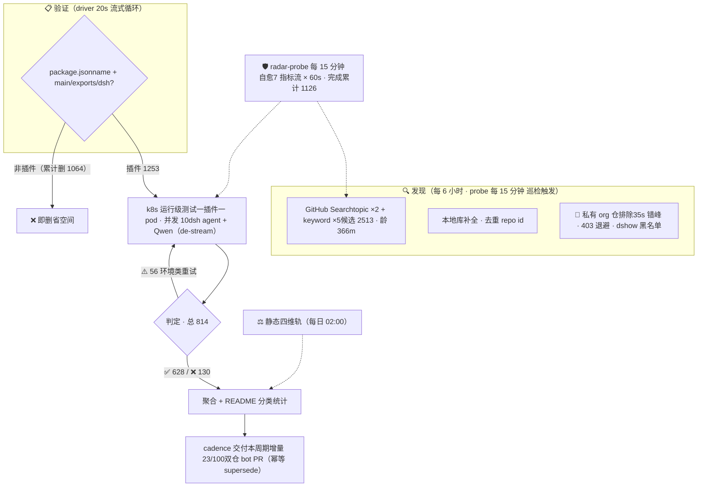

# Awesome DSH Plugins

  
  
  
  
  
  
  

**自动发现、证据验证的 DeepSeek Harness 插件生态雷达。自动发现 2500+ 候选、逐个 k8s 实测**

安装前就知道哪个能用，不用自己踩坑。

> 收录 1253 个 DSH 插件仓库（索引到2513个repos ，正由专用K8s集群，动态在DSH最新版本下验证可用性，目前高速迭代中）。

## 工作原理

> 📌 数据截至快照 `20260814T213619Z`（2026-08-15 05:36:19 UTC+8 · 分类器 unified-v1）

## 快速导航

### 你的目标 · 跳转入口
- **你的目标**: 看热门插件 · **跳转入口**: [🔥 Star Top 20](#-热门插件star-top-20)
- **你的目标**: 按用途找一个插件 · **跳转入口**: [📋 分类目录](#分类目录) · [PLUGINS.md](PLUGINS.md) — 9 大功能领域 + 兼容性状态
- **你的目标**: 浏览自动发现的全部仓库 · **跳转入口**: [📊 当前生态快照](#当前生态快照) — 日期化兼容矩阵
- **你的目标**: 了解最近发生了什么 · **跳转入口**: [📝 CHANGELOG](CHANGELOG.md)
- **你的目标**: 登记或提交插件 · **跳转入口**: [🔧 给插件开发者](#给插件开发者) · 加 `dsh-plugin` topic → 8h 自动收录 · [PR 模板](.github/PULL_REQUEST_TEMPLATE.md)
- **你的目标**: 维护本雷达 · **跳转入口**: [⚙️ 自动化 SOP](docs/SOP.md)
- **你的目标**: 给插件使用者指南 · **跳转入口**: [📖 给插件使用者](#给插件使用者)
- **你的目标**: 本仓库如何判定兼容性 · **跳转入口**: [🔍 本仓库如何判定](#本仓库如何判定)
- **你的目标**: 加入社群交流 · **跳转入口**: [💬 DSH 学习社区](#-dsh-学习社区-dshfindcom) · [社区讨论群](#社区讨论群)

> [!IMPORTANT]
> **收录不等于兼容，静态检查不等于运行可用，运行可用也不等于安全审计。**
> 本仓库提供可追溯的筛选信号，不代表 DSH 官方背书。安装第三方插件前，请检查插件源码、权限、依赖、许可证及测试日期。

## 🔥 热门插件（Star Top 20）

> 按 GitHub star 数排序，每 20 分钟自动刷新。数据截至 2026-08-15 15:09（UTC+8）。

### # · 插件 · ⭐ · 说明
- **#**: 1 · **插件**: [dsh-web-ui](https://github.com/zhu1090093659/dsh-web-ui) · **⭐**: 2177 · **说明**: Plugin and skin collection for DeepSeek Harness (DSH) W…
- **#**: 2 · **插件**: [modlens](https://github.com/liustack/modlens) · **⭐**: 1465 · **说明**: The first vision plugin for DeepSeek Harness, and the v…
- **#**: 3 · **插件**: [TokenTracker](https://github.com/xiufengsun/TokenTracker) · **⭐**: 1313 · **说明**: Local-first AI token usage & cost tracker for 31 coding…
- **#**: 4 · **插件**: [dsh-TUI](https://github.com/ccch1mneyyy/dsh-TUI) · **⭐**: 1004 · **说明**: 解决DSH 官方尚无终端 TUI 痛点的补位之作，献给偏爱cli的各位极客：Claude Code 风格全屏交…
- **#**: 5 · **插件**: [PicGo-Core](https://github.com/PicGo/PicGo-Core) · **⭐**: 971 · **说明**: :zap:The ultimate image uploading engine. Both CLI & AP…
- **#**: 6 · **插件**: [DSH-better-sidebar](https://github.com/omdsh-dev/DSH-better-sidebar) · **⭐**: 872 · **说明**: 一个侧边栏的完整工作台，支持三方拓展注册新侧边栏页面。内置文件渲染编辑/终端/Git/子代理
- **#**: 7 · **插件**: [sandbase-harness](https://github.com/sandbaseai/sandbase-harness) · **⭐**: 580 · **说明**: Open-source CMA-compatible agent runtime for any model,…
- **#**: 8 · **插件**: [dsh-vision-toolkit](https://github.com/Anionex/dsh-vision-toolkit) · **⭐**: 372 · **说明**: 让纯文本模型更好地做视觉任务的DeepSeek Harness插件：带意图的图片问答、长截图 OCR、UI 还…
- **#**: 9 · **插件**: [dsh-ads](https://github.com/Nagi-ovo/dsh-ads) · **⭐**: 366 · **说明**: 把 DSH 变成 2005 年门户网站｜Parody ads, fake games, and popups …
- **#**: 10 · **插件**: [Abu-Cowork](https://github.com/PM-Shawn/Abu-Cowork) · **⭐**: 326 · **说明**: Open-source alternative to Claude Cowork — a local-firs…
- **#**: 11 · **插件**: [dsh-agent-teams](https://github.com/NanmiCoder/dsh-agent-teams) · **⭐**: 278 · **说明**: AgentTeams plugin for DeepSeek Harness
- **#**: 12 · **插件**: [Bigfish](https://github.com/turtle2209/Bigfish) · **⭐**: 188 · **说明**: Bigfish —— DeepSeek Harness 的第三方桌面端，内置 Node 运行时，双击即用，附带…
- **#**: 13 · **插件**: [oh-dsh](https://github.com/hust-open-atom-club/oh-dsh) · **⭐**: 175 · **说明**: 一站式 DeepSeek Harness 社区发行版：TUI、桌面端与 Web UI 三种形态统一体验，支持分…
- **#**: 14 · **插件**: [dsh-at-file](https://github.com/omdsh-dev/dsh-at-file) · **⭐**: 154 · **说明**: Codex-style @file mentions for DeepSeek Harness: search…
- **#**: 15 · **插件**: [whale-girl](https://github.com/vlln/whale-girl) · **⭐**: 147 · **说明**: DSH Web GUI 桌面宠物插件（QQ 宠物形态）：右下角悬浮、可拖拽/投喂/玩耍的积累型伙伴。官方 re…
- **#**: 16 · **插件**: [dsh-tianshu-tui](https://github.com/huiliyi37/dsh-tianshu-tui) · **⭐**: 140 · **说明**: dsh-tianshu-tui — DeepSeek Harness terminal UI +harness…
- **#**: 17 · **插件**: [deepseek-harness-desktop-app](https://github.com/vibeinging/deepseek-harness-desktop-app) · **⭐**: 109 · **说明**: DeepSeek Harness Desktop App: a local AI desktop worksp…
- **#**: 18 · **插件**: [dsh-browser](https://github.com/Lum1104/dsh-browser) · **

⭐**: 107 · **说明**: dsh plugin: Chrome sidebar extension that lets DSH oper…
- **#**: 19 · **插件**: [modsearch](https://github.com/liustack/modsearch) · **⭐**: 98 · **说明**: The web plugin for DeepSeek Harness, and the search bri…
- **#**: 20 · **插件**: [dsh-visualize](https://github.com/Nagi-ovo/dsh-visualize) · **⭐**: 88 · **说明**: 在 DSH 对话中生成交互式可视化｜Render model-generated interactive ca…

## 分类目录

> 按功能领域分类（重分类修正）。点击标题展开，全部条目一次显示。 新收录条目（社区）的兼容性为**运行级跟踪口径**（k8s agent 实测）。 新收录条目（社区）的兼容性为**运行级跟踪口径**（k8s agent 实测）。

### 🔌 Web UI 增强（247）

*界面与交互增强插件：侧边栏、输入框、皮肤主题、面板 dock、消息显示、状态栏与可视化，让 Web 界面更顺手更好看*

### 插件 · 类型 · 兼容性 · 说明
- **插件**: [dsh-vision](https://github.com/dsh-external/dsh-vision) · **类型**: 插件 · **兼容性**: 关注 · **说明**: dsh 插件：给纯文本 DeepSeek 加视觉——view_image 工具桥接任意 OpenAI 兼容 VLM（默认智谱免费档，实测 4 厂商 10 模型）
- **插件**: [dsh-web-ui](https://github.com/dsh-external/dsh-web-ui) · **类型**: 合集 · **兼容性**: 关注 · **说明**: Plugin and skin collection for DeepSeek Harness (DSH) Web UI - task board, git g
- **插件**: [ex-setting](https://github.com/dsh-external/ex-setting) · **类型**: 插件 · **兼容性**: 关注 · **说明**: DSH的设置扩展
- **插件**: [web-components](https://github.com/dsh-external/web-components) · **类型**: 基建 · **兼容性**: 关注 · **说明**: web-components支持
- **插件**: [dsh-split-panes](https://github.com/dsh-external/dsh-split-panes) · **类型**: 插件 · **兼容性**: 需适配 · **说明**: —
- **插件**: [turtle-ui](https://github.com/dsh-external/turtle-ui) · **类型**: 插件 · **兼容性**: 需适配 · **说明**: as is, no warranty
- **插件**: [dsh-ads](https://github.com/dsh-external/dsh-ads) · **类型**: 插件 · **兼容性**: 待调研 · **说明**: 是兄弟就来蹬我！DSH Web UI 广告：2005 年中文站点风格的侧栏广告 / 对话内信息流 / 角落弹窗 + 一个真实热区比视觉小得多的关闭叉
- **插件**: [dsh-aigc-canvas](https://github.com/dsh-external/dsh-aigc-canvas) · **类型**: 插件 · **兼容性**: 待调研 · **说明**: —
- **插件**: [dsh-annotation](https://github.com/dsh-external/dsh-annotation) · **类型**: 插件 · **兼容性**: 待调研 · **说明**: DSH Web 选中批注插件：选文字→批注→回车随消息发送；气泡隐藏批注块（零闪烁）；回复按 Annotation N 逐条对照（可悬浮芯片）
- **插件**: [dsh-anti-ads](https://github.com/dsh-external/dsh-anti-ads) · **类型**: 插件 · **兼容性**: 待调研 · **说明**: —
- **插件**: [DSH-better-sidebar](https://github.com/dsh-external/DSH-better-sidebar) · **类型**: 插件 · **兼容性**: 待调研 · **说明**: 一个侧边栏的完整工作台，支持三方拓展注册新Tab页面，内置文件渲染编辑/终端/Git/子代理
- **插件**: [dsh-custom-css](https://github.com/dsh-external/dsh-custom-css) · **类型**: 插件 · **兼容性**: 待调研 · **说明**: —
- **插件**: [dsh-drag-and-drop](https://github.com/dsh-external/dsh-drag-and-drop) · **类型**: 插件 · **兼容性**: 待调研 · **说明**: 为 DSH Web UI 增加跨平台文件拖拽与原始路径插入能力，无需复制文件
- **插件**: [dsh-message-edit](https://github.com/dsh-external/dsh-message-edit) · **类型**: 插件 · **兼容性**: 待调研 · **说明**: DSH plugin: branch-based message editing, reroll, retry, version timeline
- **插件**: [dsh-side-panel](https://github.com/dsh-external/dsh-side-panel) · **类型**: 插件 · **兼容性**: 待调研 · **说明**: DSH 侧边栏，集成文件浏览器、终端和 Git 审查，方便预览文件
- **插件**: [dsh-ultra-ui](https://github.com/dsh-external/dsh-ultra-ui) · **类型**: 插件 · **兼容性**: 待调研 · **说明**: —
- **插件**: [ui-status-label](https://github.com/dsh-external/ui-status-label) · **类型**: 插件 · **兼容性**: 待调研 · **说明**: 把你鲸鱼娘思考时的 deep diving 自定义成任意你想要的样子
- **插件**: [ya-workspace-sidebar](https://github.com/dsh-external/ya-workspace-sidebar) · **类型**: 插件 · **兼容性**: 待调研 · **说明**: —
- **插件**: [awesome-dsh-background-plugin](https://github.com/leavestring/awesome-dsh-background-plugin) · **类型**: 社区 · **兼容性**: ✅ 运行级可用 · **说明**: DSH Web 背景个性化插件：上传自己的图片（JP

G / PNG / WEBP / GIF，浏览器端自动压缩到 1600px 以内）或一键切换极光、余烬、宣纸
- **插件**: [Better_Deepseek_Harkness](https://github.com/silencieuxzero/Better_Deepseek_Harkness) · **类型**: 社区 · **兼容性**: ✅ 运行级可用 · **说明**: 更好的deepseek harness，为webui进行了一些拓展
- **插件**: [claude-harness-desktop](https://github.com/pingta-guangpingwang/claude-harness-desktop) · **类型**: 社区 · **兼容性**: ✅ 运行级可用 · **说明**: An Electron-based multi-project AI cockpit that orchestrates multiple Claude Cod
- **插件**: [claude-parchment-theme](https://github.co