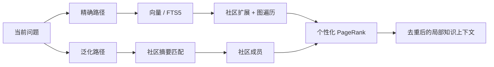
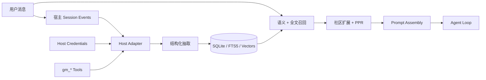
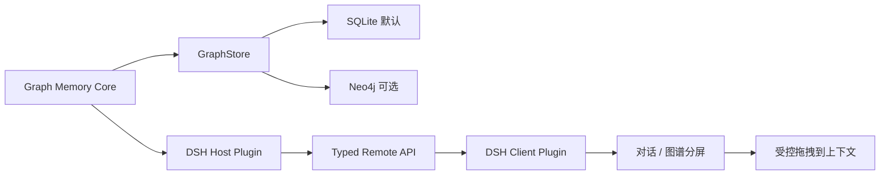

# Graph Memory


  为 AI Agent 提供可检索、可追溯、跨会话的长期记忆
  一个宿主无关的图记忆内核，原生接入 DeepSeek Harness，并继续兼容 OpenClaw。

Graph Memory 不是聊天记录归档器，也不是把所有历史重新塞回上下文。它把对话中的任务、技能、事件和因果关系沉淀为类型化知识图谱，在新问题出现时只召回相关的局部子图。

## 核心优势

### 一套内核，两个原生宿主入口

- **DeepSeek Harness**：通过 Cordis 生命周期接入 Session、Tool、Agent Loop、Prompt Assembly、LLM 与 Credentials；不修改 DSH 核心源码。
- **OpenClaw**：保留原有 Context Engine 插件入口、配置方式和数据能力。
- **共享内核**：抽取、SQLite 存储、FTS5、向量检索、社区发现、PageRank 和上下文组装不绑定单一宿主。

### 把历史变成可复用知识

- 跨 Session 召回，宿主重启后仍然保留。
- `TASK`、`SKILL`、`EVENT` 三类节点表达目标、方法、结果、错误与决策。
- `USED_SKILL`、`SOLVED_BY`、`REQUIRES`、`PATCHES`、`CONFLICTS_WITH` 五类关系保留因果和依赖。
- 节点关联原始会话证据，能够解释“这条记忆从哪里来、为什么被召回”。

### 只把相关知识送进上下文

- 精确路径：向量 / FTS5 → 社区扩展 → 图遍历 → 个性化 PageRank。
- 泛化路径：查询向量 → 社区摘要 → 社区成员 → 图排序。
- 只注入与本轮问题相关的局部图，不回放全部历史。
- 召回内容被标记为不可信参考材料，不能覆盖当前用户指令。

### 本地优先，向量能力可选

- Community 默认使用 SQLite，无需部署独立图数据库。
- 未配置 Embedding 时自动使用 FTS5，不阻断对话。
- 支持 OpenAI-compatible Embedding 接口，可接 DashScope、OpenAI 或本地服务。
- `gm_status` 显示数据库、节点、边、检索模式、向量覆盖率和维度。

### 限定场景下的 Token 实测

旧版 OpenClaw 入口曾在“安装 bilibili-mcp → 登录 → 查询”的 7 轮连续任务中进行对照测试：

  

### 轮次 · 无 Graph Memory · 有 Graph Memory
- **轮次**: R1 · **无 Graph Memory**: 14,957 · **有 Graph Memory**: 14,957
- **轮次**: R4 · **无 Graph Memory**: 81,632 · **有 Graph Memory**: 29,175
- **轮次**: R7 · **无 Graph Memory**: **95,187** · **有 Graph Memory**: **23,977**

该场景第 7 轮减少约 **75%** Token。它是一个特定工作流的对照结果，不代表所有任务都有固定压缩比例；核心机制是用相关知识子图替代无差别历史回放。

## 项目发展

Graph Memory 的方向没有因为新宿主而推倒重来。项目正在从“OpenClaw 上的记忆插件”，发展为“可被不同 Agent Harness 原生加载的图记忆内核”。

### 阶段 · 交付内容 · 状态
- **阶段**: OpenClaw 起点 · **交付内容**: Context Engine、跨会话图记忆、双路径召回 · **状态**: 保持兼容
- **阶段**: Community 图引擎 · **交付内容**: SQLite、FTS5、向量、图排序、溯源 · **状态**: 可使用
- **阶段**: DeepSeek Harness · **交付内容**: Cordis 适配器、原生工具、自动召回、Credentials · **状态**: 已完成并实测
- **阶段**: Graph Memory Pro · **交付内容**: 可视化图工作台、受控拖拽、Neo4j 可选适配器 · **状态**: 架构已审计，DSH Host / Client Plugin 待实现

2026 年 3 月 15 日，项目负责人在清华科技园举办的 CLAW 蜕壳计划活动中分享了 Graph Memory 的架构思路。以下为项目负责人提供的现场材料与[新浪财经活动报道](https://cj.sina.com.cn/articles/view/7984421895/1dbe89c0700101nnpq)。

  
  

- [开源版跨会话记忆演示](https://www.bilibili.com/video/BV1xUcZzfEaB/)
- [Graph Memory Pro 技术分享](https://www.bilibili.com/video/BV1KwwzzGEvD/)

下图是既有 OpenClaw / ClawX 阶段的 Pro 图谱原型，用于说明已经验证过的图交互方向；它不是当前 DSH 版本已经交付的前端。

  

相关名称与现场信息仅用于项目履历记录，不表示清华大学、新浪财经、DeepSeek 或 OpenClaw 对本项目提供官方背书。

## 图记忆架构

### 类型化知识图谱

```text
TASK   ──USED_SKILL──▶ SKILL
TASK   ──SOLVED_BY───▶ EVENT
SKILL  ──REQUIRES────▶ SKILL
EVENT  ──PATCHES─────▶ SKILL
SKILL  ──CONFLICTS_WITH──▶ SKILL
```

- **TASK**：做过什么，包含目标、过程和结果。
- **SKILL**：经过验证、可以复用的方法或能力。
- **EVENT**：错误、修复、决策、变化和关键事实。
- **Episodic provenance**：图节点关联原始 user / assistant 片段，保留形成知识时的语境。

### 双路径召回



同一张图会根据当前问题产生不同排名。查询 Docker 时，Docker 相关技能靠前；查询 Conda 时，环境管理相关技能靠前。对几千节点规模的图，图排序可以在本地完成。

### 宿主数据流



```text
graph-memory/
├── dsh.ts                 # DeepSeek Harness / Cordis 适配器
├── index.ts               # OpenClaw 适配器
├── cordis.patch.yml       # DSH Bundle 安装入口
└── src/
    ├── extractor/         # 对话 → TASK / SKILL / EVENT
    ├── recaller/          # 向量、FTS5、社区扩展与召回
    ├── graph/             # PageRank、社区检测、去重
    ├── store/             # SQLite schema 与查询
    ├── format/            # 安全上下文组装
    └── engine/            # LLM / Embedding provider
```

## DeepSeek Harness 原生适配状态

### 能力 · 状态 · 说明
- **能力**: Cordis 原生加载 · **状态**: **已完成** · **说明**: 使用插件生命周期，无需 fork DSH
- **能力**: 跨会话自动召回 · **状态**: **已完成** · **说明**: 在 Prompt Assembly 阶段注入相关记忆
- **能力**: 显式记录与搜索 · **状态**: **已完成** · **说明**: `gm_record`、`gm_search`
- **能力**: 向量回填与模型迁移 · **状态**: **已完成** · **说明**: 追踪模型、维度与 fingerprint
- **能力**: 插件状态可见 · **状态**: **已完成** · **说明**: 设置页 Plugin Inventory 显示 active
- **能力**: Pro 可视化工作台 · **状态**: **未交付** · **说明**: 需要 DSH Client Plugin

当前 beta：`1.6.0-beta.1`。本机验收宿主为 DeepSeek Harness `0.1.0-rc.5`；DSH 仍处于 Developer Preview，后续版本可能出现破坏性变化。验收已覆盖 tarball 安装、插件 active、1024 维向量回填、跨 Session 语义召回、重启持久化和 FTS5 降级；107 项自动化测试通过。

  插件已启用：graph-memory/dsh 在 DSH 插件列表中处于 active
  

  跨会话语义召回：新 Session 召回上一 Session 的知识
  

## 安装到 DeepSeek Harness

前置条件：Node.js `22.19+` 或 `24+`。当前 beta 尚未发布到 npm，必须先从源码构建 tarball：

```bash
git clone https://github.com/adoresever/graph-memory.git
cd graph-memory
npm ci
npm test
npm run build
npm pack
```

安装到 DSH Web profile：

```bash
npx @deepseek-ai/dsh plugin --profile web add /absolute/path/to/graph-memory-1.6.0-beta.1.tgz
npx @deepseek-ai/dsh --profile web --dump-config
npx @deepseek-ai/dsh web
```

在 DeepSeek Harness 源码仓库内，也可以使用：

```bash
pnpm dsh plugin --profile web add /absolute/path/to/graph-memory-1.6.0-beta.1.tgz
pnpm dsh web
```

安装后，在 **设置 → 插件 → 插件列表 → graph-memory/dsh** 中确认状态为“已启用”。默认数据库路径：

```text
$DSH_HOME/graph-memory/graph-memory.db
# 未设置 DSH_HOME 时通常为：
~/.dsh/graph-memory/graph-memory.db
```

### 配置向量检索

不要把 API key 发送到聊天框。DSH 配置只保存凭据引用，真实密钥由 Credentials 服务解析。DashScope 示例：

```bash
export GRAPH_MEMORY_EMBEDDING_API_KEY='replace-with-your-key'
export GRAPH_MEMORY_EMBEDDING_BASE_URL='https://dashscope.aliyuncs.com/compatible-mode/v1'
export GRAPH_MEMORY_EMBEDDING_MODEL='text-embedding-v4'
export GRAPH_MEMORY_EMBEDDING_DIMENSIONS='1024'
dsh web
```

未配置 Embedding 时会自动使用 FTS5。

  

### DSH 原生工具

### 工具 · 作用
- **工具**: `gm_status` · **作用**: 查看插件、数据库、抽取、召回和向量状态
- **工具**: `gm_search` · **作用**: 主动搜索长期知识图谱
- **工具**: `gm_record` · **作用**: 确定性记录 TASK、SKILL 或 EVENT
- **工具**: `gm_stats` · **作用**: 查看节点、边、类型与社区统计

自动召回不要求模型主动调用 `gm_search`；适配器会在 Prompt Assembly 阶段检索并注入相关记忆。

## Graph Memory Pro：如何作为 DSH 插件集成

### 结论

**可以改造成插件，但现有 Pro 代码今天不能直接安装到 DSH。** 已核查的 `desktop-2.0` 分支是 OpenClaw + Neo4j 实现，绑定 `openclaw/plugin-sdk`、OpenClaw Gateway Route 和旧 ClawX 交互方向。Neo4j、GDS、APOC、向量索引、PageRank、社区分析和 CRUD 后端可以复用；宿主入口与浏览器通信层必须替换。目前没有可直接安装的 DSH Client renderer。

目标不是再做一个独立产品，而是把 Pro 作为 Graph Memory 的可选增强插件：



### 推荐包结构

```text
graph-memory                         # Community：当前原生 Host Plugin
@adoresever/graph-memory-pro-dsh    # Pro：Host + Client Plugin（待实现）
@adoresever/graph-memory-store-neo4j # 可选大图存储适配器（待实现）
```

第一版优先做 **Pro Lite**：继续读取现有 SQLite 图数据，只增加 DSH 图谱工作台。这样用户不需要安装 Neo4j。Neo4j 作为可选适配器，面向更大图谱、GDS 与复杂分析。**这是规划中的目标架构；现有 `desktop-2.0` Pro 仍是 Neo4j-only，尚未实现 SQLite / Neo4j 可切换的 `GraphStore`。**

### 目标安装体验

下面仅说明完成后的目标体验。当前 npm 上的 `graph-memory@1.5.8` 仍是 OpenClaw 包，`@adoresever/graph-memory-pro-dsh` 尚未发布；以下命令现在不可执行：

```bash
# PLANNED — NOT AVAILABLE YET
dsh plugin --profile web add graph-memory
dsh plugin --profile web add @adoresever/graph-memory-pro-dsh
dsh web
```

开发期则从本地 tarball 安装：

```bash
npm run build
npm pack
dsh plugin --profile web add /absolute/path/to/graph-memory-pro-dsh-*.tgz
```

### 必须改造的四层

1. **Core contract**：抽出 `GraphStore`、`GraphSnapshot`、`RecallResult`，让 SQLite 与 Neo4j 使用同一接口。
2. **Host Plugin**：接入 DSH Session、Tools、LLM、System Prompt 与 Credentials；所有数据库凭据只在 Host 端解析。
3. **Client Plugin**：在 DSH 注册侧栏 / Workbench / Tool Card，实现 2D 或 3D 图谱、搜索、筛选和对话分屏。
4. **受控上下文操作**：拖拽只提交节点 ID 与动作意图；Host 校验后把内容写入可见、可撤销的 Session Context。

旧 Pro 的 `/graph-memory-pro/neo4j-config` 会把连接信息返回浏览器，这是必须消除的安全问题。新的 DSH Pro 将由 Host 解析 Credentials，浏览器只能获取经过裁剪的 `GraphSnapshot`，不能接收 Bolt 密码，也不能执行任意 Cypher。这是未来实现必须满足的设计约束。

## OpenClaw 兼容

OpenClaw 用户继续使用原入口：

```bash
openclaw plugins install graph-memory
openclaw plugins enable graph-memory
openclaw gateway restart
```

还必须在 `~/.openclaw/openclaw.json` 激活 Context Engine，否则插件可能显示已安装，但不会进入完整的消息摄取与抽取管线：

```json
{
  "plugins": {
    "slots": {
      "contextEngine": "graph-memory"
    },
    "entries": {
      "graph-memory": {
        "enabled": true
      }
    }
  }
}
```

现有 Context Engine 配置和数据能力继续保留。DSH 是新增的原生宿主入口，不要求 OpenClaw 用户迁移或放弃现有工作流。

## 开发与验证

```bash
npm ci
npm test
npm run build
npm pack
```

发布前必须确认：测试与 TypeScript 构建通过；tarball 包含 `dist/dsh.js` 与 `cordis.patch.yml`；仓库不存在 API key、本地数据库和环境文件；文档不把 Pro 路线图写成已完成功能。

## 当前限制

- 自动抽取依赖辅助模型输出稳定性；关键知识在 beta 阶段建议使用 `gm_record`。
- DSH 版暂未提供 `gm_update` 和 `gm_maintain`，这两个工具目前属于 OpenClaw 入口。
- Pro 的 DSH Client Plugin 尚未实现。
- npm registry 发布尚未完成，当前使用 GitHub 源码 tarball 安装。

## 隐私与安全

- 数据默认保存在本机 SQLite。
- API key 通过宿主凭据或环境变量注入，不写入数据库和 Cordis patch。
- 召回历史只作为参考；当前用户指令始终拥有更高优先级。
- 曾出现在聊天、日志或截图中的密钥应立即轮换。

## 许可证

[MIT](LICENSE) © 2026 adoresever

素材来源、Logo 与商标说明见 [docs/ATTRIBUTIONS.md](docs/ATTRIBUTIONS.md)。