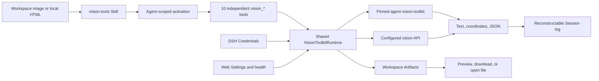

# DSH Vision Toolkit

**Install:** `dsh plugin --profile web add @anionex/dsh-vision-toolkit`

**DSH Vision Toolkit brings [`agent-vision-toolkit`](https://github.com/Anionex/agent-vision-toolkit) into DeepSeek Harness as a native Profile Bundle.**

Give text-only DSH agents eyes—and keep vision in the harness—with intent-aware image Q&A, OCR, original-pixel grounding, UI restoration, pixel verification, managed Artifacts, and Web Settings. Ten independent tools replace shell glue with structured schemas and Agent-scoped progressive exposure.

**Upstream toolkit:** [Anionex/agent-vision-toolkit](https://github.com/Anionex/agent-vision-toolkit) · **Project website:** [agent-vision.anionex.me](https://agent-vision.anionex.me)

## Why this exists

`agent-vision-toolkit` treats vision as an Agent-callable capability rather than a property of the base model. Its method carries the reason for looking into the visual request, moves from the whole image to targeted regions, and verifies coordinates, colors, geometry, and differences with focused tools instead of accepting a generic description as evidence.

DSH Vision Toolkit preserves that method while replacing CLI installation and Bash argument construction with native schemas, DSH Credentials, lifecycle-managed runtime preparation, structured Session-log results, previewable Artifacts, dedicated Web cards, and Settings. The Agent loads one versioned Skill and receives the ten visual schemas only when the current task needs them.

The package delivers the committed P0 and P1 product scope. P2's stable `ctx.visionToolkit` service remains deliberately unpublished until an independent plugin becomes a real consumer; the internal runtime does not pretend that an unvalidated ecosystem API is stable.

## Proven use cases from agent-vision-toolkit

The first two panels are official upstream reference runs from the same pinned `agent-vision-toolkit` lineage packaged by this bundle. The image Q&A and screenshot-guided debugging panel is a live DeepSeek Harness Web session, showing the same workflows through DSH. See the [asset provenance record](assets/upstream/README.md) for the upstream source images.

### Infographic restoration: screenshot to editable HTML/CSS

  
  

*Left: source screenshot. Right: the editable HTML/CSS result from the upstream [infographic-restoration reference](https://github.com/Anionex/agent-vision-toolkit/blob/c27d1a300962b553c0884993c575cd3e819465ce/examples/infographic-restoration/how-is-the-model-trained.html).*

### UI restoration: sketch to working interface

  
  

*Left: hand-drawn input. Right: the upstream reconstructed interface; the complete method lives in the [UI restoration playbook](https://github.com/Anionex/agent-vision-toolkit/blob/c27d1a300962b553c0884993c575cd3e819465ce/skills/vision-tools/references/restore-ui.md).*

### Image Q&A and screenshot-guided debugging

  
  

*Left: intent-aware image Q&A in DSH Web. Right: a DSH Web screenshot-debugging turn that lists the concrete UI differences and continues toward `vision_pixel_diff`. The upstream workflow source is the same [`agent-vision-toolkit` reference](https://github.com/Anionex/agent-vision-toolkit/blob/c27d1a300962b553c0884993c575cd3e819465ce/README.md#real-world-effects).*

DSH Vision Toolkit adds native tool schemas, versioned lifecycle, Credentials, structured Session results, Artifacts, Web presentation, Settings, and progressive exposure around these upstream capabilities. The next section is the reproducible proof executed and checked into this DSH repository.

## DSH-native proof: reference-to-pixel verification

The checked-in UI-restoration workflow renders an intentionally inaccurate HTML implementation, measures a `6.04%` pixel difference across six non-zero regions, iterates, and reaches an exact `0%` difference against the reference at `1200 × 720`.

  
  

### Verified surface · Evidence
- **Verified surface**: Product scope · **Evidence**: 10 independent visual tools, matching `vision-tools` Skill, Artifacts, dedicated Web cards, and live Settings
- **Verified surface**: Automated coverage · **Evidence**: 17 Vitest files / 136 passing tests, plus a dependency-free portable package check
- **Verified surface**: Real profiles · **Evidence**: Clean temporary Web and Headless installation, activation, disable, re-enable, and uninstall
- **Verified surface**: Visual acceptance · **Evidence**: Reproducible HTML screenshot → pixel diff example with a final `0%` difference

## Highlights

- **See images without bloating every prompt:** only `vision_toolkit_activate` is initially visible; loading `vision-tools` mounts ten independent schemas for that Agent and keeps version/health administration out of model context.
- **Act on coordinates instead of parsing prose:** grounding and detection return original-image pixel boxes, while every model-visible result remains structured text or JSON.
- **Deliver files, not temporary output:** crop, trace, OCR, pixel diff, foreground extraction, and HTML rendering produce described Artifacts that the Web client can preview, download, or open locally.
- **Keep runtime and credentials controlled:** DSH Credentials hold API keys, managed mode prepares an exact isolated Python environment, and a failed Settings candidate cannot replace the serving generation.
- **Close the visual verification loop:** local HTML rendering and pixel-diff ranking support reference → implementation → screenshot → measured iteration without a model-native image channel.
- **Use the same bundle in Web and Headless profiles:** Web adds cards, previews, Settings, and health actions; Headless receives the same tool semantics and complete structured results.

## Quick start

Prerequisites: DeepSeek Harness `0.1.0-rc.6` or a compatible later `0.1.x` release, Python 3.11+, and `pnpm` available to `dsh plugin`. Install the published bundle from npm, add it to the profiles you use, and confirm the bundle row:

```sh
dsh plugin --profile web add @anionex/dsh-vision-toolkit
dsh plugin --profile headless add @anionex/dsh-vision-toolkit
dsh --profile web --dump-config | grep vision-toolkit
dsh --profile headless --dump-config | grep vision-toolkit
```

Legacy profiles must use `nodeLinker: hoisted` and `autoInstallPeers: false` in their `pnpm-workspace.yaml`. An updated DSH launcher repairs these owned settings before `dsh plugin` runs; when using an older launcher, set them before installation so pnpm does not assemble a second Harness dependency graph inside the profile.

Restart a running Web profile, open **Settings → Vision Toolkit**, select a DSH Credential for remote tools, and explicitly run **Test connection**. In a conversation, make an image available as a workspace path, invoke `/vision-tools`, and ask the Agent to call a specific `vision_*` tool. Local crop, trace, pixel, color, foreground, and HTML operations do not require a visual API credential.

## How it works



Tool definitions call one runtime; the runtime validates paths, limits, credentials, cancellation, and deadlines before dispatching to the pinned upstream snapshot or configured vision provider endpoint. Web presentation consumes the same structured results and Artifact descriptors, so it does not change Headless behavior. Health, connection testing, and version inspection stay in Settings rather than model tool schemas.

## Tools

### Tool · Execution · Structured result · Artifact delivery
- **Tool**: `vision_glance` · **Execution**: Remote vision API · **Structured result**: Description, targeted answer, OCR, or multi-image comparison · **Artifact delivery**: None
- **Tool**: `vision_ground` · **Execution**: Remote vision API; optional local preview · **Structured result**: Target, original-image dimensions, and pixel boxes · **Artifact delivery**: Optional labeled PNG
- **Tool**: `vision_detect` · **Execution**: Remote vision API; optional local preview · **Structured result**: Numbered element inventory and original-image pixel boxes · **Artifact delivery**: Optional numbered PNG
- **Tool**: `vision_trace` · **Execution**: Local pinned vtracer pipeline · **Structured result**: SVG geometry status, path count, scale, and size · **Artifact delivery**: SVG
- **Tool**: `vision_crop` · **Execution**: Local Pillow pipeline · **Structured result**: Applied pixel box, dimensions, format, and clamp status · **Artifact delivery**: PNG or JPEG
- **Tool**: `vision_pixel_diff` · **Execution**: Local NumPy/Pillow pipeline · **Structured result**: Difference percentage and ranked grid regions · **Artifact delivery**: PNG heatmap and JSON report
- **Tool**: `vision_long_screenshot_ocr` · **Execution**: Local split/audit; remote OCR unless `splitOnly=true` · **Structured result**: Chunk boundaries, reuse state, completion state, and run directory · **Artifact delivery**: Markdown, manifest, boundary audit, chunk PNGs, and OCR sidecars
- **Tool**: `vision_extract_foreground` · **Execution**: Local pinned extraction pipeline · **Structured result**: Selected box, component counts, foreground coverage, and dimensions · **Artifact delivery**: Transparent PNG
- **Tool**: `vision_dominant_colors` · **Execution**: Local pinned color analysis · **Structured result**: Extracted palette or pixel-backed candidate ranking · **Artifact delivery**: None
- **Tool**: `vision_html_screenshot` · **Execution**: Local Chrome/Chromium/Edge adapter · **Structured result**: Authorized source facts, viewport, and rendered dimensions · **Artifact delivery**: PNG

The plugin does not reimplement visual algorithms. Its DSH-owned layer validates paths and limits, resolves credentials, calls the pinned upstream scripts with argv vectors, parses their exact output contracts, classifies failures, describes files, and projects results to the model and Web client.

## Progressive model exposure

Runtime readiness is profile-wide, but the ten visual execution schemas are Agent-scoped. Before an Agent loads `vision-tools`, the plugin contributes only the small `vision_toolkit_activate` bootstrap; the visual tools are absent from that Agent's request schema. A successful call to the standard `skill` tool with `name="vision-tools"` mounts all ten tools automatically for the next model step and hides the bootstrap. A direct `/vision-tools` invocation injects the Skill instructions; if the visual tools are still absent, those instructions require one `vision_toolkit_activate` call. Activation affects only that Agent, restores when the Session contains durable evidence matching the bundled Skill version, and lasts until the Agent or plugin is disposed.

Health checks, connection testing, and plugin/upstream version inspection are administrative Web Settings operations. `vision_toolkit_health` and `vision_toolkit_version` are not model tools and never enter an Agent's schema, including after visual-tool activation.

## Requirements

- DeepSeek Harness with a Web or Headless profile and `pnpm` available to `dsh plugin`.
- Python 3.11 or newer. Managed mode creates an isolated environment, so users do not install the upstream CLI or Python packages manually.
- Network access on the first managed-runtime activation unless the exact packages in `runtime/requirements.lock` are already available in the configured package cache.
- An OpenAI-compatible or Anthropic vision endpoint and DSH Credential for `vision_glance`, `vision_ground`, `vision_detect`, and non-split-only long-screenshot OCR. Local tools remain usable without that credential.
- Chrome, Chromium, or Edge only for `vision_html_screenshot`; all other tools remain available when no supported browser is installed.
- PNG, JPEG, GIF, or WebP inputs inside the session workspace or an explicitly configured `allowedDirs` root.

## Install and lifecycle

### Install

Install the bundle into each profile that should expose it:

```sh
dsh plugin --profile web add @anionex/dsh-vision-toolkit
dsh plugin --profile headless add @anionex/dsh-vision-toolkit
dsh --profile web --dump-config | grep vision-toolkit
dsh --profile headless --dump-config | grep vision-toolkit
```

Restart a long-lived Web profile after installation. The host discovers the built browser bundle from `package.json`'s `dsh.client` declaration at process startup; the legacy top-level `dshClient` field is not scanned.

The first managed start verifies the packaged upstream manifest and atomically prepares an isolated environment under `DSH_HOME/cache/dsh-vision-toolkit`. Only after preparation succeeds does the plugin publish the same-version `vision-tools` Skill and activation bootstrap; each Agent receives the execution tools only after loading that Skill. An initial preparation failure leaves the Web Settings repair surface available but exposes neither model capability nor a misleading Skill.

### Disable and re-enable

Set the bundle row to `disabled: true` in a profile patch or overlay:

```yaml
- id: vision-toolkit
  disabled: true
```

Remove the flag or set it to `false` to re-enable the plugin. Disposal first cancels plugin-owned visual operations, then removes every Agent-scoped tool, the bootstrap, and the Skill; reactivation prepares the configured runtime before any model capability becomes visible. User configuration and completed Artifacts remain intact.

### Upgrade

**Migrating from the retired `@dsh-external/dsh-vision-toolkit`:** the npm package now lives under the `@anionex` scope. If you installed the retired package, do **not** run `update` on it — that account cannot publish this release. Migrate to the new package name and restart the Web profile:

```sh
dsh plugin --profile web remove @dsh-external/dsh-vision-toolkit
dsh plugin --profile web add @anionex/dsh-vision-toolkit
```

After restarting, Settings → Vision should report plugin version **0.1.7**.

For a registry installation, update the dependency through the profile package manager:

```sh
dsh plugin --profile web update @anionex/dsh-vision-toolkit
dsh plugin --profile headless update @anionex/dsh-vision-toolkit
```

For a local path installation, run `add` again against the replacement checkout or tarball. Settings remain in the profile's Settings provider. A candidate runtime is fully validated and prepared before it is persisted and made active; a failed or obsolete concurrent candidate cannot replace the current serving generation.

### Uninstall

```sh
dsh plugin --profile web remove @anionex/dsh-vision-toolkit
dsh plugin --profile headless remove @anionex/dsh-vision-toolkit
```

`dsh plugin remove` removes both the dependency and its bundle layer. The profile no longer exposes the activation bootstrap, Agent-scoped Vision Toolkit tools, or Skill entries. Managed cache data may be deleted separately when no profile uses the package; it is not active configuration and cannot register anything by itself.

## Configure

The bundle defaults to the managed runtime. A profile patch can override the provider and limits:

```yaml
- id: vision-toolkit
  config:
    provider:
      baseUrl: https://api.inferera.com/v1
      credential: VISION_API_KEY
      model: gemini-3.6-flash
      protocol: openai
      anthropicThinking: omit
      userAgent: Mozilla/5.0 (Windows NT 10.0; Win64; x64) AppleWebKit/537.36 (KHTML, like Gecko) Chrome/126.0.0.0 Safari/537.36
    language: zh
    timeoutMs: 60000
    maxImageBytes: 10485760
    maxImagePixels: 40000000
    concurrency: 4
    runtime:
      mode: managed
    allowedDirs: []
```

### Configuration fields

### Field · Default · Contract
- **Field**: `provider.baseUrl` · **Default**: `https://api.inferera.com/v1` · **Contract**: Provider API base URL, normalized without trailing slashes; for Anthropic use a base ending in `/v1`, not the full `/messages` URL
- **Field**: `provider.credential` · **Default**: `VISION_API_KEY` · **Contract**: DSH Credential reference, never a secret value
- **Field**: `provider.model` · **Default**: `gemini-3.6-flash` · **Contract**: Multimodal model name sent to remote tools
- **Field**: `provider.protocol` ·