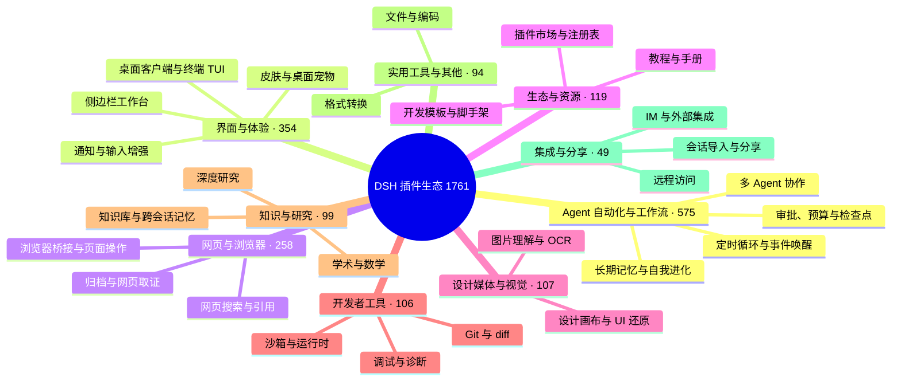

# 🐳 Awesome DSH Plugins

> 用 30 秒为你的 DeepSeek Harness（DSH）找到合适的插件。
> 这不是又一个仓库清单：2000+ 个打着 `dsh-plugin` 标签的仓库里，我们只把「解决真实问题、说得清楚、还在维护」的那部分带到你面前——并告诉你每个插件适合谁、从哪里开始。

[English](./README_EN.md) · [全量目录](./CATALOG.md) · [Star Top 100](./TOP100.md) · [推荐一个插件](./CONTRIBUTING.md) · [机器可读数据](./data/repositories.json)

**如果这个列表帮你找到一个有用的插件，欢迎点一个 Star ⭐。它能帮助更多 DSH 用户发现这个生态。**

## 这个列表怎么用

本仓库分成三层，按你需要的信息深度取用：

### 你想要…… · 直接去哪里
- **你想要……**: 30 秒选出一个插件 · **直接去哪里**: 继续往下读：[场景选型](#-我想让-dsh-做什么) 和 [新手套装](#-新手从这里开始)
- **你想要……**: 按热度或分类翻完整清单 · **直接去哪里**: [TOP100.md](./TOP100.md)（热度榜）· [CATALOG.md](./CATALOG.md)（全量目录）
- **你想要……**: 用程序消费插件数据 · **直接去哪里**: [data/repositories.json](./data/repositories.json)——每日自动快照，含星数、许可证、活跃度等元数据
- **你想要……**: 收录你自己的插件 · **直接去哪里**: 不需要给我们提 PR：仓库加上 `dsh-plugin` Topic 即会自动进入全量目录，详见[文末](#-推荐或修正插件)
- **你想要……**: 你是插件作者，想上首页曝光 · **直接去哪里**: [作者自荐区](#-作者自荐)：按规范提交一条自荐，无需编辑部审核，区满后先进先出

## 🗺️ 生态全景

截至 2026-08-14 共收录 **1761** 个仓库。它们长这样：

按分类浏览每个分类下的全部项目，见 [CATALOG.md](./CATALOG.md)。

## 🎯 我想让 DSH 做什么？

从你的问题出发，而不是从分类出发。找到最接近的一行，点进去就是答案：

### 我想要…… · 推荐从这里开始 · 为什么
- **我想要……**: 想要独立的桌面客户端，而不是浏览器标签页 · **推荐从这里开始**: [dsh-desktop](https://github.com/bruc3van/dsh-desktop) · [deepseek-harness-desktop](https://github.com/anywhere-labs/deepseek-harness-desktop) · **为什么**: dsh-desktop 开箱即用：自动复用本机已运行的实例，或用内置运行时一键启动，无需安装 Node.js/CLI，支持远程连接、托盘常驻与异常恢复；deepseek-harness-desktop 是生态内星数最高的桌面端（1.3k+ Star，macOS/Windows，服务启动与窗口整合）。
- **我想要……**: 更方便地管理和发现插件 · **推荐从这里开始**: [plugin-registry](https://github.com/vlln/plugin-registry) · [dsh-market](https://github.com/dsh-market/dsh-market) · **为什么**: plugin-registry 在浏览器面板中管理 repository 插件并提供开发引导；dsh-market 把插件市场做进 DSH 界面，浏览、搜索、一键安装。
- **我想要……**: 把现有业务代码转成 Agent 可调用能力 · **推荐从这里开始**: [Code2Skill](https://github.com/leechen298/Code2Skill) · **为什么**: 从用户授权的前端、后端或全栈源码生成 Function、MCP Tools、业务 Skills 和离线测试，并可作为 DSH Bundle 安装。
- **我想要……**: 看清后台任务进度 · **推荐从这里开始**: [dsh-task-status](https://github.com/vlln/dsh-task-status) · **为什么**: 在对话页显示任务进度和实时输出 tail。
- **我想要……**: 看清上下文窗口里装了什么 · **推荐从这里开始**: [dsh-context](https://github.com/bowenliang123/dsh-context) · **为什么**: 在 Web UI 增加 Context 面板，展示上下文由什么构成、如何演化，辅助把握 token 控制与裁剪时机。
- **我想要……**: 定时或按事件唤醒 Agent · **推荐从这里开始**: [dsh-loop](https://github.com/vlln/dsh-loop) · [dsh-sentinel](https://github.com/fuhefei/dsh-sentinel) · **为什么**: 覆盖周期任务，以及文件、命令、HTTP、进程和 Webhook 事件。
- **我想要……**: 请求经常因网络波动或超时中断，不想每次手动补一句「继续」 · **推荐从这里开始**: [dsh-auto-continue](https://github.com/HsiangNianian/dsh-auto-continue) · **为什么**: 回合因非人为原因失败后自动补发「继续」：错误分类只恢复临时性故障，自适应退避避免轰炸故障上游，继续文本可模板化，参数在插件设置卡片中调整。
- **我想要……**: 更顺手地阅读和操作长对话 · **推荐从这里开始**: [dsh-navbar](https://github.com/vlln/dsh-navbar) · [dsh-annotation](https://github.com/omdsh-dev/dsh-annotation) · **为什么**: 快速跳转用户消息节点，并像 Codex 一样选中文本批注。
- **我想要……**: 像 Codex 一样用 @ 引用工作区文件 · **推荐从这里开始**: [dsh-at-file](https://github.com/omdsh-dev/dsh-at-file) · **为什么**: 在输入框内按 @ 搜索工作区文件并把内容附进 prompt，免去手动复制粘贴。
- **我想要……**: 在对话中生成交互式界面 · **推荐从这里开始**: [dsh-genui](https://github.com/omdsh-dev/dsh-genui) · **为什么**: 在回复中渲染图表、表单、测验、Mermaid 和 3D 场景。
- **我想要……**: 让 Agent 操作真实设计画布 · **推荐从这里开始**: [dsh-openpencil](https://github.com/ZSeven-W/dsh-openpencil) · **为什么**: 创建、编辑、预览和验证可交互的多页面 OpenPencil 设计稿。
- **我想要……**: 给 DSH 增加视觉理解能力 · **推荐从这里开始**: [modlens](https://github.com/liustack/modlens) · [dsh-vision-toolkit](https://github.com/Anionex/dsh-vision-toolkit) · [dsh-luna-vision-bridge](https://github.com/ycp424c/dsh-luna-vision-bridge) · **为什么**: modlens 把图片转成 OCR/布局/语义结构化证据；dsh-vision-toolkit 覆盖图片问答、长截图 OCR、UI 还原与像素对比；纯文本模型也可经 Luna 转写桥接继续处理图片。
- **我想要……**: 让 Agent 自己搜索网页和 X，答案带引用 · **推荐从这里开始**: [modsearch](https://github.com/liustack/modsearch) · [anysearch-dsh](https://github.com/anysearch-team/anysearch-dsh) · **为什么**: modsearch 在对话中直接搜索、抓取并返回带引用的结构化证据；anysearch-dsh 提供 AnySearch 搜索源与高级搜索工具，可作补充搜索后端。
- **我想要……**: 在开发对话里直接检查和

操作当前网页 · **推荐从这里开始**: [dsh-browser-bridge](https://github.com/ycp424c/dsh-browser-bridge) · **为什么**: 把完整 DSH Web 嵌进 Chrome 侧边栏，按 prompt 显式授权当前标签页，DSH 能在同一对话里读取 DOM、样式、console 报错并操作页面，无需另开浏览器专用对话。
- **我想要……**: 把侧边栏升级成完整工作台 · **推荐从这里开始**: [DSH-better-sidebar](https://github.com/omdsh-dev/DSH-better-sidebar) · **为什么**: 内置文件渲染编辑、终端、Git 与子代理，并支持第三方扩展注册新 Tab。
- **我想要……**: 在终端里用 Claude Code 风格界面 · **推荐从这里开始**: [dsh-TUI](https://github.com/ccch1mneyyy/dsh-TUI) · [dsh-tianshu-tui](https://github.com/huiliyi37/dsh-tianshu-tui) · **为什么**: 全屏交互终端：状态行、思考流展开、上下文/TPS 仪表；tianshu 版本还内置 TDD 与证据门工作流。
- **我想要……**: 给 DSH 加上可审计的跨会话记忆 · **推荐从这里开始**: [dsh-memory-evolve](https://github.com/csyangwen/dsh-memory-evolve) · [dsh-mneme](https://github.com/modusensus/dsh-mneme) · **为什么**: 五轨记忆 + 技能自进化；或 SQLite + 可编辑 Markdown 的记忆镜像，记忆透明可改。
- **我想要……**: 回合结束时收到桌面通知 · **推荐从这里开始**: [dsh-notification](https://github.com/omdsh-dev/dsh-notification) · **为什么**: 按结果类型（成功/失败）控制通知，支持关键词过滤，长时间任务无需盯屏。
- **我想要……**: 回退对话与工作区状态 · **推荐从这里开始**: [dsh-turn-rewind](https://github.com/Anionex/dsh-turn-rewind) · **为什么**: 基于持久化 Change Ledger 回退到任意早期回合，对话与代码状态一起恢复。
- **我想要……**: 给工作区增加一个陪伴型宠物 · **推荐从这里开始**: [whale-girl](https://github.com/vlln/whale-girl) · **为什么**: 可拖拽、投喂和玩耍的积累型鲸鱼娘桌面伙伴。
- **我想要……**: 把其他工具的历史会话搬进 DSH · **推荐从这里开始**: [dsh-chat-import](https://github.com/Nwflower/dsh-chat-import) · **为什么**: 13 源全保真导入（Claude Code/Codex/ChatGPT/Cursor/Gemini/Reasonix/opencode/ZCode/Grok Build/OpenClaw/Pi/Hermes/Kimi）历史会话为可续聊 DSH 会话，并支持反向导出/同步回 Claude Code。
- **我想要……**: 换皮肤、自定义背景 · **推荐从这里开始**: [dsh-skin](https://github.com/KinGao294/dsh-skin) · [dsh-deep-whale](https://github.com/Small-tailqwq/dsh-deep-whale) · **为什么**: dsh-skin 一键切换多套 --dsw-alias-* 配色并支持半透明壁纸（Codex 风格）；dsh-deep-whale 是生态内最受欢迎的鲸鱼娘皮肤系列（CC BY-NC-SA，不可商用）。
- **我想要……**: 查看 Token 用量与费用 · **推荐从这里开始**: [dsh-web-billing](https://github.com/bpc-oss/dsh-web-billing) · [dsh-cost-meter](https://github.com/Han-1413141/dsh-cost-meter) · **为什么**: 按官方政策自动计价（含峰谷时段），逐条消息记账，显示账号余额；界面语言自动切换人民币/美元。
- **我想要……**: 让外部 Agent 驱动 Harness 执行任务 · **推荐从这里开始**: [dsh-harness-mcp-server](https://github.com/chushixixin/dsh-harness-mcp-server) · **为什么**: 在 Harness 内部启动 MCP server，让任意 MCP 客户端（如 Hermes）下发任务给 Harness 执行，实现「大脑 + 胳膊」协作。
- **我想要……**: 从外部设备安全访问本机 Harness · **推荐从这里开始**: [dsh-remote](https://github.com/flymysql/dsh-remote) · **为什么**: 打印当前实例的精确连接命令：SSH 本地转发、autossh 保活、反向隧道（NAT 友好）与带 --trusted-host 的反向代理，设置页一键复制；遵循官方安全设计，不碰 0.0.0.0。

## 🚀 新手从这里开始

不需要一次装很多。先选一个与你当前问题最接近的组合：

### 套装 · 适合 · 组合
- **套装**: 日常体验 · **适合**: 第一次装插件，先解决管理、状态和导航 · **组合**: [plugin-registry](https://github.com/vlln/plugin-registry) · [dsh-task-status](https://github.com/vlln/dsh-task-status) · [dsh-navbar](https://github.com/vlln/dsh-navbar)
- **套装**: 自动化 · **适合**: 定时循环 + 事件驱动唤醒，长时间无人值守任务 · **组合**: [dsh-loop](https://github.com/vlln/dsh-loop) · [dsh-sentinel](https://github.com/fuhefei/dsh-sentinel)
- **套装**: 视觉与搜索 · **适合**: 让纯文本模型看得见、搜得到 · **组合**: [modlens](https://github.com/liustack/modlens) · [modsearch](https://github.com/liustack/modsearch) · [dsh-vision-toolkit](https://github.com/Anionex/dsh-vision-toolkit)
- **套装**: 创作与界面 · **适合**: 生成式 UI、真实设计画布与视觉理解 · **组合**: [dsh-genui](https://github.com/omdsh-dev/dsh-genui) · [dsh-openpencil](https://github.com/ZSeven-W/dsh-openpencil) · [dsh-vision-toolkit](https://github.com/Anionex/dsh-vision-toolkit)
- **套装**: 记忆与持续运行 · **适合**: 跨会话记忆 + 中断自动续跑的无人值守项目 · **组合**: [dsh-memory-evolve](https://github.com/csyangwen/dsh-memory-evolve) · [dsh-mneme](https://github.com/modusensus/dsh-mneme) · [dsh-auto-continue](https://github.com/HsiangNianian/dsh-auto-continue)

## ⭐ 编辑精选

**这里不按星数排名。** 我们优先选择解决明确问题、说明完整、仍在维护且具有代表性的项目——所以你会看到 1.2k Star 的项目，也会看到 4 Star 但无可替代的项目。收录不等于安全或兼容性背书。

### 🖥️ 桌面与终端

- **[dsh-desktop](https://github.com/bruc3van/dsh-desktop)**（⭐ 20）— 社区维护的非官方桌面客户端，直接加载官方 Web UI：自动复用本机已运行的实例，或用内置 dsh 运行时一键启动，无需额外安装 Node.js/CLI；支持智能连接、远程实例、托盘常驻和异常恢复。 `桌面客户端` `开箱即用` `智能连接`
- **[deepseek-harness-desktop](https://github.com/anywhere-labs/deepseek-harness-desktop)**（⭐ 1.3k）— 生态内星数最高的桌面端：服务启动与窗口整合，macOS/Windows 开箱可用。 `桌面客户端` `跨平台`
- **[dsh-TUI](https://github.com/ccch1mneyyy/dsh-TUI)**（⭐ 835）— Claude Code 风格的全屏交互终端：像素鲸鱼顶栏、实时状态行、思考流式展开、双击 Esc 回滚、上下文进度条与 TPS 仪表，npm 一键安装。 `终端 TUI` `全屏交互` `CLI 优先`
- **[dsh-tianshu-tui](https://github.com/huiliyi37/dsh-tianshu-tui)**（⭐ 132）— 终端 UI 之外内置 TDD 与「证据门」工作流，把一次性多 Agent 调度升级为可治理的工程过程。 `终端 TUI` `TDD` `证据门`

### 🧰 界面工作台

- **[DSH-better-sidebar](https://github.com/omdsh-dev/