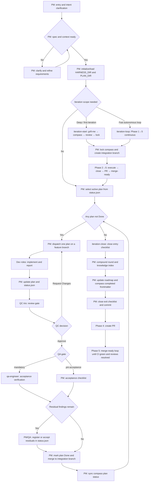

# [Morning Star](https://github.com/btspoony/mstar-harness)

Harness Workflow Engine · Agent Plugin

English / [中文](README_CN.md)

**Morning Star** is an Agent Plugin for harness engineering workflows: a TypeScript **Harness Workflow Engine** (`@mstar-harness/engine`) enforces deterministic workflow gates, while `mstar-*` judgment skills drive multi-agent code delivery.

- **Deterministic gates, enforced by a TS engine** — path/status/lease/dispatch/sdd/iteration/lint gates run in `@mstar-harness/engine`, not as prompt suggestions
- **Judgment stays in `mstar-*` skills** — skills remain the single source of truth (SSOT) for roles, gates, and workflow judgment
- **One engine across hosts** — the same engine + skills power dsh (DeepSeek Harness), omp, OpenCode, Cursor, Kimi Code, ZCode, and Codex
- **Agent Plugin packaging** — one-command install; portable across any Agent Plugins v1.0.0 client
- **Recommended host** (best → usable): **dsh = omp ≥ OpenCode ≥ Cursor > Kimi = ZCode > Codex**

**What ships**

### Component · What it is
- **Component**: Harness Workflow Engine · **What it is**: `@mstar-harness/engine` — TS enforcement of deterministic workflow gates
- **Component**: mstar CLI · **What it is**: `@mstar-harness/cli` — installer bootstrap + `mstar` workflow verbs
- **Component**: `mstar-*` skills · **What it is**: Role, gate, and workflow judgment (single source of truth)
- **Component**: Host adapters · **What it is**: dsh, omp, OpenCode, Cursor, Kimi Code, ZCode, Codex

Release notes: [CHANGELOG.md](CHANGELOG.md) / [CHANGELOG_CN.md](CHANGELOG_CN.md).

## Install

> **dsh installs through its own plugin manager — not the CLI.** `npx @mstar-harness/cli init` has **no dsh target** (it covers omp / OpenCode / Cursor / Kimi / ZCode / Codex only). On dsh (DeepSeek Harness), install the profile bundle with the host's own command: `dsh plugin --profile web add @mstar-harness/dsh`.

```bash
npx @mstar-harness/cli init
# or: bunx @mstar-harness/cli init
```

### Host · Command
- **Host**: dsh (DeepSeek Harness) · **Command**: `dsh plugin --profile web add @mstar-harness/dsh`
- **Host**: omp · **Command**: `npx @mstar-harness/cli init --target omp` (links `~/.mstar/harness`) or `omp plugin install github:btspoony/mstar-harness`
- **Host**: OpenCode · **Command**: `npx @mstar-harness/cli init --target opencode`
- **Host**: Cursor · **Command**: `npx @mstar-harness/cli init --target cursor`
- **Host**: Kimi · **Command**: Kimi TUI: `/plugins install https://github.com/btspoony/mstar-harness` → `/plugins reload`
- **Host**: ZCode · **Command**: `npx @mstar-harness/cli init --target zcode` then install **morning-star-harness** in ZCode → Settings → Plugin Management
- **Host**: Codex · **Command**: `npx @mstar-harness/cli init --target codex` then `codex plugin add morning-star-harness --marketplace personal`
- **Host**: Generic (Agent Plugins v1) · **Command**: point any Agent Plugins v1.0.0 conformant client at this repo root (`plugin.json` + `skills/` are the portable package)

The repo ships a portable **Agent Plugins v1.0.0** manifest (`plugin.json`) at its root; `skills/` is the Agent Skills component. Verify with `npx @mstar-harness/cli plugin validate`.

Verify: `npx @mstar-harness/cli doctor --target <opencode\|cursor\|codex\|zcode\|omp>`.

Manual install / path layout: [`INSTALL.md`](INSTALL.md). CLI flags: [`docs/cli.md`](docs/cli.md).

Reload the host after install (OpenCode restart / Cursor **Developer: Reload Window** / reopen Codex / Kimi `/plugins reload` or `/new` / ZCode reload plugin / omp new session or `/reload-plugins` if available).

## Use

Three entry shapes: **without iteration** (single plan / hotfix), **with iteration** (multi-plan Phase 1–5), or **codebase audit** (discover what to do).

### General (without iteration)

Enter PM, then run the per-plan cycle: `Prepare → Execute → QC → QA gate → Done`.

### Host · Enter PM
- **Host**: dsh (DeepSeek Harness) · **Enter PM**: `pm` skill (via the mstar skill provider; no auto-load)
- **Host**: omp · **Enter PM**: `/skill:pm` each session (no auto-load)
- **Host**: OpenCode · **Enter PM**: `agent.project-manager` (`agents/project-manager.md`)
- **Host**: Cursor · **Enter PM**: `/pm`
- **Host**: Kimi · **Enter PM**: session auto-loads `pm`; or `/skill:pm`
- **Host**: ZCode · **Enter PM**: `/morning-star-harness:pm` each session (no auto-load)
- **Host**: Codex · **Enter PM**: `/pm`

### Iteration

### Path · When
- **Path**: `/iteration-start` · **When**: Phase 1 (interactive grill-me) then auto-continues Phase 2→5; `pause` to stop after Phase 1
- **Path**: `/iteration-drive` · **When**: Resume Phase 2→5 on an already-locked iteration
- **Path**: `/iteration-loop` · **When**: Full Phase 1→5 autonomous (no grill-me; optional `direction`, `scale` S\ · M\ · L\ · XL)

### Codebase audit

### Path · When
- **Path**: `/codebase-audit` · **When**: Survey a repo read-only → prioritized, self-contained improvement plans in `{PLAN_DIR}/audit-<date>/`

Read-only advisory — never edits source. Output feeds iteration-start Research or normal Prepare → Execute. Effort levels: `quick` / `standard` (default) / `deep`; category focus (`security`, `perf`, `tests`, …) or `branch` / `next` variants. SSOT → `mstar-audit`.

### Command loading

### Host · How commands load
- **Host**: dsh (DeepSeek Harness) · **How commands load**: `/iteration-start` · `/iteration-drive` · `/iteration-loop` · `/codebase-audit` (bundled `harness-commands/` via `ctx.commands`)
- **Host**: omp · **How commands load**: `/iteration-start` · `/iteration-drive` · `/iteration-loop` · `/codebase-audit` (filename commands from plugin `commands/`)
- **Host**: OpenCode / Cursor · **How commands load**: Bundled from `commands/` (OpenCode: plugin `harness-commands/`)
- **Host**: Kimi / ZCode · **How commands load**: `/morning-star-harness:iteration-start` · `:codebase-audit` (etc.) via plugin manifest
- **Host**: Codex project · **How commands load**: `.agents/skills/<name>/SKILL.md` (CLI symlinks from `commands/`)
- **Host**: Codex global · **How commands load**: Project-scoped commands **not** installed — use `--scope project`

Phase 2 defaults: per-plan worktree + lease, `Findings cleanup: zero-residual`. Override only with explicit `Worktree mode: waived` / `Findings cleanup: allow-residual`. SSOT → `mstar-iteration`, `mstar-branch-worktree`, `mstar-plan-artifacts`.

Project knowledge bootstrap: `mstar-compound-refresh` → `references/project-knowledge-bootstrap.md`.

## Harness Workflow



Without iteration: same per-plan gates, no `iteration-start` / `iteration-close` wrapper.

## Roles and skills

### Agent ID · Responsibility
- **Agent ID**: `project-manager` · **Responsibility**: Routing, assignment, phase progression
- **Agent ID**: `product-manager` · **Responsibility**: Requirements, product planning, research
- **Agent ID**: `architect` · **Responsibility**: Architecture and technical contracts
- **Agent ID**: `fullstack-dev` / `fullstack-dev-2` · **Responsibility**: Backend-led implement / second parallel track
- **Agent ID**: `frontend-dev` · **Responsibility**: UI, interaction, frontend performance
- **Agent ID**: `qa-engineer` · **Responsibility**: Acceptance when `QA gate: mandatory`
- **Agent ID**: `code-reviewer` · **Responsibility**: SDD per-task review; codebase audit (`audit` category)
- **Agent ID**: `qc-specialist` / `-2` / `-3` · **Responsibility**: QC trio
- **Agent ID**: `ops-engineer` · **Responsibility**: Deploy, monitoring, infrastructure
- **Agent ID**: `writing-specialist` · **Responsibility**: Docs, fiction, copy, scripts
- **Agent ID**: `prompt-engineer` · **Responsibility**: Prompt / skill / rule work

Load **`mstar-harness-core` first**, then topic skills on demand (`mstar-roles`).

### Skill · Purpose
- **Skill**: `mstar-harness-core` · **Purpose**: Entry, state machine, Task category, skill index
- **Skill**: `mstar-phase-gates` · **Purpose**: Prepare/Execute, clarify, hotfix
- **Skill**: `mstar-iteration` · **Purpose**: Phase 1–5 iteration lifecycle
- **Skill**: `mstar-dispatch-gates` · **Purpose**: Dispatch, Delegation, anti-recursion
- **Skill**: `mstar-sdd` · **Purpose**: Subagent-driven development
- **Skill**: `mstar-branch-worktree` · **Purpose**: Branches, worktrees, QC/QA checkout
- **Skill**: `mstar-plan-conventions` · **Purpose**: `{HARNESS_DIR}` discovery / init
- **Skill**: `mstar-plan-artifacts` · **Purpose**: Plans, `status.json`, residuals, Findings cleanup
- **Skill**: `mstar-design-md` · **Purpose**: DESIGN.md gate for UI plans
- **Skill**: `mstar-review-qc` · **Purpose**: PM QC tri orchestration
- **Skill**: `mstar-coding-behavior` · **Purpose**: RCA, test-first, review feedback, evidence
- **Skill**: `mstar-compound` / `mstar-compound-refresh` · **Purpose**: Knowledge crystallize / maintain
- **Skill**: `mstar-strategy` · **Purpose**: `STRATEGY.md` alignment
- **Skill**: `mstar-skill-authoring` · **Purpose**: General skill authoring (SkillsBench gate)
- **Skill**: `mstar-audit` · **Purpose**: Read-only codebase audit → prioritized improvement plans
- **Skill**: `mstar-roles` · **Purpose**: Role prompts + load lists
- **Skill**: `mstar-host` · **Purpose**: Host adapters (dsh / omp / OpenCode / Cursor / Kimi / ZCode / Codex)
- **Skill**: `pm` · **Purpose**: `/pm` / `/skill:pm` / host PM entry

Consumer plans default to **`.mstar/`**. Process artifacts (`plans/`, `iterations/`, `status.json`, `sdd/`, …) are gitignored; tracked results: `{HARNESS_DIR}/AGENTS.md`, `knowledge/`, `specs/`. Specs resolve `.mstar/specs/` → `docs/specs/` → repo-root `specs/`. Details → `mstar-plan-conventions`.

Maintainers: [`AGENTS.md`](AGENTS.md).