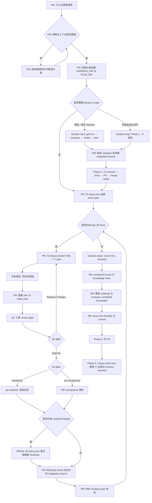

# [Morning Star (启明星)](https://github.com/btspoony/mstar-harness)

Harness Workflow Engine · Agent Plugin

[English](README.md) / 中文

**Morning Star / 启明星** 是面向 harness 工程工作流的 Agent Plugin：TypeScript **Harness Workflow Engine**（`@mstar-harness/engine`）强制执行确定性工作流门禁，`mstar-*` 判断型 skills 驱动多智能体代码交付。

- **确定性门禁，由 TS 引擎强制执行** —— path/status/lease/dispatch/sdd/iteration/lint 门禁运行在 `@mstar-harness/engine` 中，而非仅靠 prompt 建议
- **判断留在 `mstar-*` skills** —— skills 仍是角色、门禁与工作流判断的唯一事实来源（SSOT）
- **一个引擎跨宿主** —— 同一引擎 + skills 驱动 dsh（DeepSeek Harness）、omp、OpenCode、Cursor、Kimi Code、ZCode、Codex
- **Agent Plugin 打包** —— 一条命令安装；可移植到任意 Agent Plugins v1.0.0 客户端
- **推荐宿主**（最佳 → 可用）：**dsh = omp ≥ OpenCode ≥ Cursor > Kimi = ZCode > Codex**

**交付内容**

### 组件 · 说明
- **组件**: Harness Workflow Engine · **说明**: `@mstar-harness/engine` —— 确定性工作流门禁的 TS 强制执行层
- **组件**: mstar CLI · **说明**: `@mstar-harness/cli` —— 安装引导 + `mstar` 工作流动词
- **组件**: `mstar-*` skills · **说明**: 角色、门禁与工作流判断（唯一事实来源）
- **组件**: 宿主适配 · **说明**: dsh、omp、OpenCode、Cursor、Kimi Code、ZCode、Codex

更新说明：[CHANGELOG.md](CHANGELOG.md) / [CHANGELOG_CN.md](CHANGELOG_CN.md)。

## 安装

> **dsh 经自带插件管理器安装，不走 CLI。** `npx @mstar-harness/cli init` **没有 dsh target**（仅覆盖 omp / OpenCode / Cursor / Kimi / ZCode / Codex）。在 dsh（DeepSeek Harness）上，用宿主自带命令安装 profile bundle：`dsh plugin --profile web add @mstar-harness/dsh`。

```bash
npx @mstar-harness/cli init
# 或：bunx @mstar-harness/cli init
```

### 宿主 · 命令
- **宿主**: dsh（DeepSeek Harness） · **命令**: `dsh plugin --profile web add @mstar-harness/dsh`
- **宿主**: omp · **命令**: `npx @mstar-harness/cli init --target omp`（链接 `~/.mstar/harness`）或 `omp plugin install github:btspoony/mstar-harness`
- **宿主**: OpenCode · **命令**: `npx @mstar-harness/cli init --target opencode`
- **宿主**: Cursor · **命令**: `npx @mstar-harness/cli init --target cursor`
- **宿主**: Kimi · **命令**: Kimi TUI：`/plugins install https://github.com/btspoony/mstar-harness` → `/plugins reload`
- **宿主**: ZCode · **命令**: `npx @mstar-harness/cli init --target zcode`，然后在 ZCode → 设置 → 插件管理安装 **morning-star-harness**
- **宿主**: Codex · **命令**: `npx @mstar-harness/cli init --target codex`，然后 `codex plugin add morning-star-harness --marketplace personal`
- **宿主**: Generic（Agent Plugins v1） · **命令**: 任意 Agent Plugins v1.0.0 兼容客户端直接指向本仓库根（`plugin.json` + `skills/` 即便携包）

仓库根提供便携式 **Agent Plugins v1.0.0** manifest（`plugin.json`），`skills/` 为 Agent Skills 组件。可用 `npx @mstar-harness/cli plugin validate` 校验。

校验：`npx @mstar-harness/cli doctor --target <opencode\|cursor\|codex\|zcode\|omp>`。

手动安装 / 路径布局：[`INSTALL.md`](INSTALL.md)。CLI 参数：[`docs/cli.md`](docs/cli.md)。

安装后重载宿主（重启 OpenCode / Cursor **Developer: Reload Window** / 重开 Codex / Kimi `/plugins reload` 或 `/new` / ZCode 重载插件 / omp 新会话或 `/reload-plugins`）。

## 使用

三种入口：**不跑迭代**（单 plan / hotfix）、**跑迭代**（多 plan Phase 1–5）、或 **代码库审计**（发现该做什么）。

### 通用（不跑迭代）

进入 PM，然后走 per-plan 循环：`Prepare → Execute → QC → QA gate → Done`。

### 宿主 · 进入 PM
- **宿主**: dsh（DeepSeek Harness） · **进入 PM**: `pm` skill（经 mstar skill 提供者；无自动加载）
- **宿主**: omp · **进入 PM**: 每会话 `/skill:pm`（无自动加载）
- **宿主**: OpenCode · **进入 PM**: `agent.project-manager`（`agents/project-manager.md`）
- **宿主**: Cursor · **进入 PM**: `/pm`
- **宿主**: Kimi · **进入 PM**: 新会话自动加载 `pm`；或 `/skill:pm`
- **宿主**: ZCode · **进入 PM**: 每会话 `/morning-star-harness:pm`（无自动加载）
- **宿主**: Codex · **进入 PM**: `/pm`

### 迭代

### 路径 · 何时
- **路径**: `/iteration-start` · **何时**: Phase 1（交互式 grill-me）后自动推进 Phase 2→5；`pause` 可止于 Phase 1
- **路径**: `/iteration-drive` · **何时**: 在已锁定的迭代上恢复 / 继续推进 Phase 2→5
- **路径**: `/iteration-loop` · **何时**: Phase 1→5 全自动（无 grill-me；可选 `direction`、`scale` S\ · M\ · L\ · XL）

### 代码库审计

### 路径 · 何时
- **路径**: `/codebase-audit` · **何时**: 只读扫描代码库 → 向 `{PLAN_DIR}/audit-<date>/` 写入优先级排序、自包含的改进计划

只读顾问——**不**改源码。产出可喂给 iteration-start Research 或常规 Prepare → Execute。深度级别：`quick` / `standard`（默认） / `deep`；可按类别聚焦（`security`、`perf`、`tests`、…）或用 `branch` / `next` 变体。SSOT → `mstar-audit`。

### 命令加载

### 宿主 · 命令加载
- **宿主**: dsh（DeepSeek Harness） · **命令加载**: `/iteration-start` · `/iteration-drive` · `/iteration-loop` · `/codebase-audit`（打包的 `harness-commands/`，经 `ctx.commands`）
- **宿主**: omp · **命令加载**: `/iteration-start` · `/iteration-drive` · `/iteration-loop` · `/codebase-audit`（插件 `commands/` 文件名命令）
- **宿主**: OpenCode / Cursor · **命令加载**: 从 `commands/` 打包（OpenCode：插件 `harness-commands/`）
- **宿主**: Kimi / ZCode · **命令加载**: 插件 manifest：`/morning-star-harness:iteration-start` · `:codebase-audit` 等
- **宿主**: Codex project · **命令加载**: `.agents/skills/<name>/SKILL.md`（CLI 从 `commands/` 软链）
- **宿主**: Codex global · **命令加载**: **不**装 project 命令 — 用 `--scope project`

Phase 2 默认：每 plan worktree + lease，`Findings cleanup: zero-residual`。仅显式 `Worktree mode: waived` / `Findings cleanup: allow-residual` 可覆写。SSOT → `mstar-iteration`、`mstar-branch-worktree`、`mstar-plan-artifacts`。

项目知识脚手架：`mstar-compound-refresh` → `references/project-knowledge-bootstrap.md`。

## Harness Workflow（统一流程）



不跑迭代：同一套 per-plan gate，无 `iteration-start` / `iteration-close` 外层。

## 角色与技能

### Agent ID · 职责
- **Agent ID**: `project-manager` · **职责**: 路由、分派、阶段推进
- **Agent ID**: `product-manager` · **职责**: 需求、产品规划、研究
- **Agent ID**: `architect` · **职责**: 架构与技术契约
- **Agent ID**: `fullstack-dev` / `fullstack-dev-2` · **职责**: 后端主导实现 / 第二并行轨
- **Agent ID**: `frontend-dev` · **职责**: UI、交互、前端性能
- **Agent ID**: `qa-engineer` · **职责**: `QA gate: mandatory` 时验收
- **Agent ID**: `code-reviewer` · **职责**: SDD per-task 快速验证；codebase audit（`audit` 类）
- **Agent ID**: `qc-specialist` / `-2` / `-3` · **职责**: QC 三审
- **Agent ID**: `ops-engineer` · **职责**: 部署、监控、基础设施
- **Agent ID**: `writing-specialist` · **职责**: 文档、小说、文案、脚本
- **Agent ID**: `prompt-engineer` · **职责**: prompt / skill / rule

先读 **`mstar-harness-core`**，再按需加载专题 skill（见 `mstar-roles`）。

### Skill · 作用
- **Skill**: `mstar-harness-core` · **作用**: 入口、状态机、Task category、skill 索引
- **Skill**: `mstar-phase-gates` · **作用**: Prepare/Execute、clarify、hotfix
- **Skill**: `mstar-iteration` · **作用**: Phase 1–5 迭代生命周期
- **Skill**: `mstar-dispatch-gates` · **作用**: 派发、Delegation、反递归
- **Skill**: `mstar-sdd` · **作用**: 子代理驱动开发
- **Skill**: `mstar-branch-worktree` · **作用**: 分支、worktree、QC/QA 检出
- **Skill**: `mstar-plan-conventions` · **作用**: `{HARNESS_DIR}` 发现 / 初始化
- **Skill**: `mstar-plan-artifacts` · **作用**: plan、`status.json`、residual、Findings cleanup
- **Skill**: `mstar-design-md` · **作用**: UI plan 的 DESIGN.md 门禁
- **Skill**: `mstar-review-qc` · **作用**: PM QC tri 编排
- **Skill**: `mstar-coding-behavior` · **作用**: RCA、测试优先、审查反馈、证据
- **Skill**: `mstar-compound` / `mstar-compound-refresh` · **作用**: 知识结晶 / 维护
- **Skill**: `mstar-strategy` · **作用**: `STRATEGY.md` 对齐
- **Skill**: `mstar-skill-authoring` · **作用**: 通用 skill 撰写契约（SkillsBench 门控）
- **Skill**: `mstar-audit` · **作用**: 只读代码库审计 → 优先级改进计划
- **Skill**: `mstar-roles` · **作用**: 角色提示词 + 加载清单
- **Skill**: `mstar-host` · **作用**: 宿主适配（dsh / omp / OpenCode / Cursor / Kimi / ZCode / Codex）
- **Skill**: `pm` · **作用**: `/pm` / `/skill:pm` / 宿主 PM 入口

消费方 plan 默认 **`.mstar/`**。进程产物（`plans/`、`iterations/`、`status.json`、`sdd/` 等）gitignored；跟踪结果：`{HARNESS_DIR}/AGENTS.md`、`knowledge/`、`specs/`。Specs 解析：`.mstar/specs/` → `docs/specs/` → 仓库根 `specs/`。细则 → `mstar-plan-conventions`。

维护者：[`AGENTS.md`](AGENTS.md)。

## 许可

MIT，见 [LICENSE](./LICENSE)。