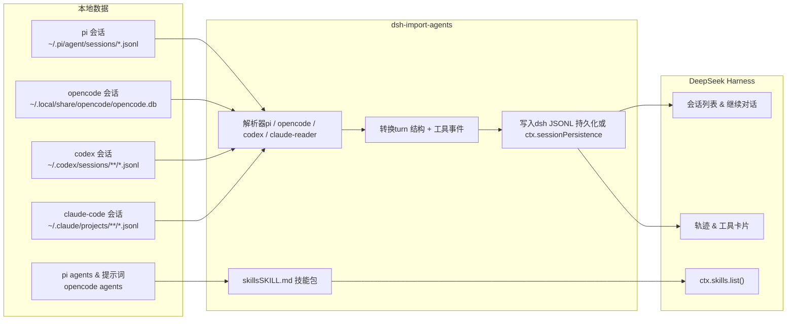

dsh-import-agents — 以 MIT License 发布。
-->
# dsh-import-agents

**dsh-import-agents** 把 **pi**、**opencode**、**codex**、**claude-code** 的会话、聊天记录与 agent 导入 [DeepSeek Harness](https://github.com/deepseek-ai/deepseek-harness)（dsh）。导入的会话出现在会话列表，可携带完整上下文继续对话；自定义 agent 与模式提示词变成可发现的 dsh skills；composer 里的一键 **同步** 按钮即可完成全部导入。

| 资源 | 链接 |
| --- | --- |
| English README | [README.md](README.md) |
| npm 包 | [dsh-import-agents](https://www.npmjs.com/package/dsh-import-agents) |
| 源码 | [github.com/Chang-Tong/dsh-import-agents](https://github.com/Chang-Tong/dsh-import-agents) |

## 特性

- **四种来源，一条命令。** 导入 pi（JSONL）、opencode（SQLite）、codex（JSONL）、claude-code（JSONL）的会话——都是真实、可继续的 dsh 会话。
- **真正可继续。** 可浏览原始完整历史（文本、推理、工具调用），并接着上次继续对话——模型拿到完整上下文。
- **Agents 变成 skills。** pi 的 agent / 模式提示词与 opencode 的 agent 转成 `$DSH_AGENTS_HOME/skills` 下的技能包，frontmatter 记录来源（`metadata.source` / `metadata.kind`）。
- **一键同步按钮。** composer 工具行常驻一个小按钮，点击执行 `/import-all`，结果内联显示。
- **新会话主动询问迁移。** 新顶层会话启动时，若有未导入历史会自动询问是否迁移；按项目记住决定，绝不重复打扰。
- **按工作区分组。** 导入的会话自动挂到与原始 `cwd` 匹配的工作区（没有则创建）；`/attach-workspaces` 可补挂旧导入。
- **幂等。** 会话 id 稳定（`pi-<uuid>` / `oc-` / `codex-` / `claude-`），重复导入自动跳过。
- **零运行时依赖。** 只用 Node 内置模块（`node:zlib` 的 zstd、`node:sqlite`）加 dsh 平台模块。

## 截图

> 截取自干净的 Docker 演示环境（英文界面），内含示例 pi / codex 会话。

带 **同步** 按钮的 dsh web 主界面（composer 工具行）：


点击 **同步** 即执行完整导入，结果内联展示：


导入的会话按原始项目目录挂到对应工作区，标题带来源标签（`[pi]`、`[opencode]`、`[codex]` …）：


导入的会话打开后与原生 dsh 会话一致——文本、推理、工具调用完整保留，还能接着聊：


工具调用完整保留为真实轨迹条目——**Trajectory** 标签页为每次调用渲染卡片（下图是导入的 codex 会话中的一次 `bash` 调用）：


## 安装

插件已发布到 **npm**：`dsh-import-agents`（最新 `0.2.2`）。装进你的 dsh profile（以 `web` profile 为例），三步搞定：安装、配置、重启。

### 第 1 步 · 安装包

```sh
cd ~/.dsh/profiles/web

# npm 安装（推荐）
pnpm add dsh-import-agents
# 或直接用 npm
# npm install dsh-import-agents
```

其他来源：

```sh
# git 安装
pnpm add git+https://github.com/Chang-Tong/dsh-import-agents.git
# 本地目录（开发调试）
pnpm add file:/path/to/dsh-import-agents
```

### 第 2 步 · 在 profile 配置里启用

在 `~/.dsh/profiles/web/cordis.patch.yml` 末尾追加：

```yaml
- insert:
    - id: import-pi-opencode
      name: dsh-import-agents
```

- `name` — 刚安装的 npm 包名。
- `id` — 插件注册 id（保持 `import-pi-opencode` 不变；斜杠命令和同步按钮都绑定它）。

### 第 3 步 · 重启并验证

1. 重启 `dsh web`——主机插件在启动时注册斜杠命令；前端产物（同步按钮）由 dsh web 自动加载。
2. **刷新页面**——重启后旧页面的 RPC 连接已断开。
3. 确认生效：输入框工具行出现 **同步** 按钮，输入 `/import-all` 有响应。

```sh
# 可选的自检命令
npm view dsh-import-agents version     # 查看最新发布版本
pnpm list dsh-import-agents            # 确认已装进 profile
```

> 想关闭「新会话主动询问迁移」：在插入行上写 `config: { offerOnStart: false }`。源路径与默认值同样可在此覆盖，见 [配置](#配置)。

## 使用

### 快速开始

1. **重启后刷新页面**。
2. 点 composer 工具行里的 **同步** 按钮，或直接输入 `/import-all`。
3. 导入的会话出现在会话列表（按工作区分组）；导入的 agent 变成可用的 skills。

一切**幂等**——想跑多少次都行，已导入的会自动跳过。

### 斜杠命令

| 命令 | 作用 |
| --- | --- |
| `/import-pi [选项]` | 导入 pi 会话 |
| `/import-opencode [选项]` | 导入 opencode 会话 |
| `/import-codex [选项]` | 导入 codex 会话 |
| `/import-claude-code [选项]` | 导入 claude-code 会话 |
| `/import-agents` | 把 pi/opencode 的 agent 与模式提示词导入为 skills |
| `/import-all [选项]` | 以上全部（4 个来源 + agents） |
| `/attach-workspaces` | 把已导入会话挂到 cwd 匹配的工作区（补挂旧导入） |

选项：`--limit N` · `--project 子串` · `--since ISO|ms` · `--no-tools` · `--tools-as-text` · `--tool-truncate N`

### CLI（不需要 dsh）

```sh
node import.mjs all                # dry-run 预览（不写任何东西）
node import.mjs all --apply        # 真正写入会话 + skills
node import.mjs sessions codex --apply --limit 20   # 只导入单个来源
node import.mjs agents --apply     # 只导入 agents/提示词 → skills
node export.mjs                    # 把会话导出为 Markdown，供任意 agent 阅读
```

- `import.mjs` 默认 **dry-run**；加 `--apply` 才写入。
- `all` = pi + opencode + agents；codex / claude-code 需要显式指定（如 `sessions codex`、`sessions claude-code`）。
- `export.mjs` 输出到 `$DSH_HOME/exports/<来源>/<会话id>.md`（支持 `--source`、`--project`、`--limit`、`--since`、`--out`、`--no-reasoning`、`--no-tools`）。

## 工作原理



导入器本质是一个纯转换器：`lib/` 把各来源解析成归一化消息流，再输出与 dsh 完全一致的 JSONL 事件布局（带校验和的 zstd 帧、项目目录编码）——dsh 自带的 `list` / `load` / `prepare` 可以逐字节读回。

**会话（聊天记录）。** 每条 user 消息开启一个 turn（`turn/start` + `user/message`），随后的 assistant 消息以递增 step 加入同一 turn，turn 以 `turn/end` 收尾。pi 的 `thinking` → dsh 的 `reasoning` 块；pi `toolCall` / opencode `tool` / claude `tool_use` / codex `tool_use` → `tool-call` 内容块 **并配套写入 `tool/call` + `tool/result` 事件**：轨迹视图渲染工具卡片，占位 `tool/result` 让恢复会话时每个 `tool_calls` 都有应答（OpenAI 兼容 API 会拒绝孤立的 `tool_calls`）。`--tools-as-text` 转成纯文本（无轨迹卡片）；`--no-tools` 完全丢弃。机械记录（`step-start`、`patch`、`compaction` 等）跳过。

**agents / 提示词 → skills。** 写入 `$DSH_AGENTS_HOME/skills/<名称>/SKILL.md`（默认 `~/.agents/skills/`），`ctx.skills.list()` 即可发现。名称冲突自动改名 `<名称>-<来源>`（如 `k3-reviewer-opencode`）；已存在的 bundle 只补 `SKILL.md` 不动其他文件；同名同内容自动跳过；frontmatter 记录 `metadata.source` / `metadata.kind` 溯源。

## 配置

| 键 | 默认值 | 含义 |
| --- | --- | --- |
| `offerOnStart` | `true` | 新顶层会话启动时是否询问迁移 |
| `piRoot` | `~/.pi/agent/sessions` | pi 会话根目录 |
| `piAgentRoot` | `~/.pi/agent` | pi agents / 提示词根目录 |
| `opencodeDb` | `~/.local/share/opencode/opencode.db` | opencode SQLite 路径 |
| `opencodeConfig` | `~/.config/opencode` | opencode agents 根目录 |
| `codexRoot` | `~/.codex/sessions` | codex 会话根目录 |
| `claudeRoot` | `~/.claude/projects` | claude-code 项目根目录 |
| `skillsRoot` | `$DSH_AGENTS_HOME/skills` | skills 输出根目录 |
| `toolTruncate` | `1000` | 工具调用参数截断长度（字符） |

迁移询问只对**全新顶层**会话（startup、非 subagent）且带 `cwd`、存在未导入历史时触发。每个项目的决定与全局 agents 决定记录在 `$DSH_HOME/import-pi-opencode-state.json`；headless 等无 UI provider 的环境自动静默跳过。

## 测试

- `verify.mts` — 在 staging 目录上用**真实** dsh JSONL 后端 + skill provider 读回导入产物（在 dsh 仓库根执行 `node --import tsx/esm ../dsh-import-agents/verify.mts <sessions根> <skills根>`）→ 期望输出 `SESSIONS ALL PASS / SKILLS ALL PASS`。
- `plugin/plugin-test.mts` — 端到端：在真实 cordis 上下文加载插件，跑命令与新会话迁移询问，断言幂等与状态持久化。
- `tests/` — Vitest 组件测试：同步按钮（`sync-button.spec.tsx`、`sync-button-hide.spec.tsx`）、`opencode-reader.spec.ts` 与 `attach-workspaces.spec.ts`。
- CI（GitHub Actions，`macos-latest`，Node 22）：`pnpm install` → `pnpm run build` → `npx vitest run`。

```sh
pnpm install          # devDependencies（esbuild、vitest）
pnpm run build        # 重建 lib/client.js（同步按钮 bundle）
npx vitest run        # 组件测试
```

## 常见问题

**为什么点同步显示「新导入 0，已存在跳过 N」？**
这正是幂等性在工作：这些会话之前已导入，所以跳过，不会产生重复。

**工具调用的结果为什么没有？**
各来源格式本身不保存工具结果，只有调用。导入会保留调用为 `tool-call` 块并配套占位 `tool/result` 事件——轨迹照常渲染卡片，恢复会话时请求也合法。

**会不会一直问我迁移？**
只在存在未导入会话时问，且按项目记忆。选了「不导入」或导入完成后，决定写入 `$DSH_HOME/import-pi-opencode-state.json`，不再打扰。

**为什么 dsh 重启后必须刷新页面？**
重启后旧页面的 RPC 连接已断开，未刷新时点同步或任何命令都会失败。

**Node 版本要求？**
Node ≥ 22.19——与 dsh 一致（`node:sqlite`、`node:zlib` 的 zstd）。