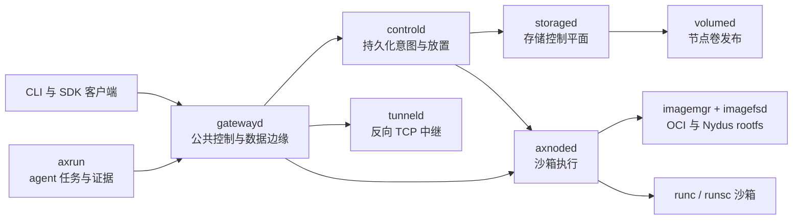

Axern 是一个面向 AI agent 的开源沙箱平台。它用 runsc 隔离运行不可信的 agent 生成的代码，用 runc 运行可信的常驻服务，两者共享同一套资源与生命周期模型。CLI 与 Go、Python、TypeScript SDK 暴露相同的公共 API，覆盖环境、进程、文件、服务、存储、隧道、生命周期状态和任务证据。

> **项目状态：** Axern 处于 pre-1.0 阶段，仍在活跃开发中。它适合评估与贡献；在部署多租户工作负载之前，运维人员应先审阅安全与生产边界。
>
> 本文档为中文译文，内容以 [英文版](./README.md) 为准。

  

## 快速开始

受支持的本地路径通过 Docker Compose 运行完整技术栈，只需要 `axern` CLI 和 Docker Compose v2，不需要源码检出、Make、Helm 或任何语言工具链。

```bash
brew install cofy-x/tap/axern
```

没有 Homebrew 时，使用带校验和的独立安装脚本：

```bash
curl -fsSL https://raw.githubusercontent.com/cofy-x/axern/main/install.sh | sh
```

然后启动 Axern 并运行第一个工作负载：

```bash
axern local up
axern run python:3.12-slim -- python -c 'print("hello from axern")'
```

`local up` 会启动 PostgreSQL、MinIO 以及控制与节点服务，等待就绪，并创建 `local` 上下文：

```bash
axern context current
axern run list
axern local status
axern local down
```

本地环境使用生成的开发凭据和回环监听地址，不要在共享或生产部署中复用它们。

源码开发是独立的贡献者路径。它把当前检出构建为本地 `:dev` 镜像，并验证相同的公共契约：

```bash
make quickstart-source
```

## 可以构建什么

- **Agent 沙箱：** 在 runsc 隔离边界后执行 agent 生成的代码，同时保留进程、文件、终端和输出 API。
- **常驻服务：** 用 runc 运行可信、性能敏感的进程，由控制平面管理副本、健康、存储和发布。
- **可复现的 agent 执行：** 使用 Axrun 编排不可变任务、结果验证、轨迹、用量和类型化产物。

## 为什么选择 Axern

- **沙箱即原语：** run、服务、函数、编码工作区和 agent 任务都组合自同一套执行与生命周期 API。
- **持久化控制平面：** 以 PostgreSQL 为后端的意图、放置、租约、重试、健康、清理和存储状态，在进程或节点重启后依然保持权威。
- **一个模型背后的运行时选择：** runc 和 runsc 工作负载使用相同的公共 API；OCI 与 Nydus 镜像路径在节点运行时汇聚。
- **真实的数据面访问：** 进程流、文件、归档、HTTP 服务、SSH 兼容终端和反向 TCP 隧道都是显式能力。
- **本地到集群的连续性：** Docker Compose、kind 和云中立的 Helm chart 验证相同的服务边界。

## 架构



`controld` 是产品状态的权威。`gatewayd` 解析并转发公共流量，不拥有放置决策。节点服务负责宿主机本地的运行时、镜像、网络和卷操作。详细契约见[运行时架构](./docs/architecture/runtime-architecture.md)和[资源模型](./docs/architecture/resource-model.md)。

### 组件 · 职责
- **组件**: `controld` · **职责**: 持久化控制平面状态、放置、租约、生命周期、发布与调和
- **组件**: `storaged` · **职责**: 存储类、声明、绑定与拓扑感知解析
- **组件**: `gatewayd` · **职责**: 公共 gRPC、HTTP、SSH、终端、隧道、服务和沙箱数据边缘
- **组件**: `axnoded` · **职责**: 节点本地的沙箱生命周期、执行、文件、进程流和清理
- **组件**: `volumed` · **职责**: 节点本地的卷发布、卸载和调和
- **组件**: `imagemgr` / `imagefsd` · **职责**: OCI 与 Nydus 镜像解析、挂载生命周期和只读数据面
- **组件**: `tunneld` · **职责**: 内部反向 TCP 中继和沙箱本地隧道绑定
- **组件**: `axern` · **职责**: 面向平台资源与访问的产品 CLI
- **组件**: `axrun` · **职责**: agent 任务执行器、发布 worker、验证器，以及轨迹、用量和证据采集

公共客户端提供 Go、Python 和 TypeScript 版本，位于 [`sdk/`](./sdk/README.md)。共享的传输契约定义在 [`sdk/proto`](./sdk/proto/README.md)。

## Kubernetes 安装

Axern 以 OCI artifact 形式发布云中立的 chart，以带校验和的归档形式发布 CLI。将 chart 安装到当前 Kubernetes 上下文：

```bash
helm install axern oci://ghcr.io/cofy-x/charts/axern \
  --version "$(cat VERSION)" \
  --namespace axern-system \
  --create-namespace \
  --wait \
  --timeout 15m
```

安装对应操作系统的 CLI 归档后，保持 gateway 端口转发开启，并导入 chart 生成的 mTLS 身份：

```bash
kubectl --namespace axern-system port-forward svc/gatewayd \
  25100:25000 25101:25080 25122:25022

axern context import-kubernetes local \
  --namespace axern-system \
  --current
axern catalog list
```

内置的 PostgreSQL 和单节点默认值面向评估用途。持久化或共享部署必须提供 Helm chart 所描述的持久存储、外置密钥、入口（Ingress）和调度配置。

## 部署

- [Docker Compose 和 kind](./deploy/local/README.md) 是仓库自持的本地基准环境。
- [Axern Helm chart](./deploy/helm/axern/README.md) 是云中立的，接受运维方自持的镜像仓库、证书、存储类和密钥。
- 云厂商账号准备、集群创建、凭据和区域发布自动化有意放在本仓库之外。

Axern 不声称默认的本地或示例部署对不可信多租户环境是安全的。生产使用前请审阅认证、TLS、网络策略、运行时隔离、镜像信任、密钥存储、资源限制和持久存储。报告漏洞请遵循 [SECURITY.md](./SECURITY.md)。

## 参与贡献

欢迎贡献。请阅读 [CONTRIBUTING.md](./CONTRIBUTING.md)，遵循[行为准则](./CODE_OF_CONDUCT.md)，并在[开发者来源证书（DCO）](./DCO)下签署每个 commit。项目决策遵循[治理模型](./GOVERNANCE.md)。

## 许可证

Copyright 2026 cofy-x.

基于 [Apache License, Version 2.0](./LICENSE) 授权。