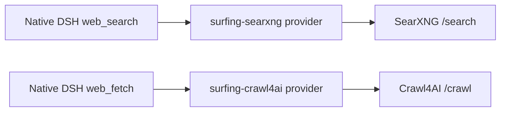

# dsh-surfing-plugin

`dsh-surfing-plugin` adds self-hosted web access to [DeepSeek Harness](https://github.com/deepseek-ai/deepseek-harness): `web_search` uses SearXNG and `web_fetch` uses Crawl4AI. It registers providers with DSH's `ctx.web` service, so the native tool names, arguments, rendering, timeouts, cancellation, and result limits remain unchanged.

## Architecture



The bundled `cordis.patch.yml` mounts this plugin, selects `surfing-searxng` and `surfing-crawl4ai`, and adds a fetch-only native tool consumer. The separate consumer works in both DSH assemblies: headless keeps its host-level `web_search`, while the Web UI keeps the `web_search` mounted by each Agent Preset. The built-in DeepSeek search provider may remain mounted but is not selected.

## Requirements

- Node.js `^22.19.0` or `>=24.0.0`
- DeepSeek Harness `>=0.1.0-rc.6 <0.2.0`
- Reachable SearXNG and Crawl4AI services
- JSON enabled in SearXNG's `search.formats`

## Quick start

The endpoint values may be service roots or complete `/search` and `/crawl` URLs:

```sh
export SEARXNG_URL=http://127.0.0.1:8080
export CRAWL4AI_URL=http://127.0.0.1:11235

# Current Crawl4AI releases enable Bearer authentication by default.
export CRAWL4AI_API_TOKEN=replace-with-your-token
```

Install a local checkout into the `web` profile:

```sh
dsh plugin --profile web add .
dsh --profile web --dump-config
dsh --profile web
```

After npm publication:

```sh
dsh plugin --profile web add dsh-surfing-plugin
```

Remove it with `dsh plugin --profile web remove dsh-surfing-plugin`.

## Configuration

Explicit configuration wins over environment values. Override this plugin's row in `$DSH_HOME/profiles/web/cordis.patch.yml`:

```yaml
- id: surfing-plugin
  config:
    searxng:
      url: https://search.example.com
      apiKeyEnv: MY_SEARXNG_KEY
      authHeader: X-API-Key
      authScheme: ''
      language: en
      categories: general,news
      safeSearch: 1
      timeRange: month
    crawl4ai:
      url: https://crawl.example.com
      apiKeyEnv: CRAWL4AI_API_TOKEN
      authHeader: Authorization
      authScheme: Bearer
      markdownMode: raw
      maxContentChars: 100000
```

| Field | Environment or default | Meaning |
| --- | --- | --- |
| `searxng.url` | `SEARXNG_URL` | Service root or `/search` endpoint |
| `searxng.apiKey` | none | Optional literal key |
| `searxng.apiKeyEnv` | `SEARXNG_API_KEY` | Environment variable containing the optional key |
| `searxng.authHeader` | `Authorization` | Authentication header |
| `searxng.authScheme` | `Bearer` | Authentication prefix; empty sends the key directly |
| `searxng.language` | server default | SearXNG `language` parameter |
| `searxng.categories` | server default | Comma-separated `categories` parameter |
| `searxng.safeSearch` | server default | `0`, `1`, or `2` |
| `searxng.timeRange` | none | `day`, `month`, or `year` |
| `crawl4ai.url` | `CRAWL4AI_URL` | Service root or `/crawl` endpoint |
| `crawl4ai.apiKey` | none | Optional literal key |
| `crawl4ai.apiKeyEnv` | `CRAWL4AI_API_TOKEN` | Environment variable containing the optional key |
| `crawl4ai.authHeader` | `Authorization` | Authentication header |
| `crawl4ai.authScheme` | `Bearer` | Authentication prefix; empty sends the key directly |
| `crawl4ai.markdownMode` | `raw` | Prefer `raw`, `fit`, or `citations` markdown |
| `crawl4ai.maxContentChars` | `100000` | Provider content cap before returning to DSH |

A literal `apiKey` takes precedence over the environment variable named by `apiKeyEnv`. No authentication header is sent when no key is available.

## Provider behavior

The SearXNG provider sends form-encoded `POST /search` requests with `format=json`. It keeps absolute HTTP(S) result URLs, deduplicates by URL, maps `title`, `content`, and `publishedDate` into DSH sources, and exposes non-empty SearXNG `answers` as result content.

The Crawl4AI provider sends the minimal `{ "urls": [url] }` body to `POST /crawl`; model input cannot supply browser or crawler configuration. Only HTTP(S) targets are accepted. Target non-2xx status codes remain successful DSH fetch results, while Crawl4AI API failures become structured `WebError` values.

`fit` and `citations` modes fall back to raw markdown when their preferred field is empty. HTML is returned only when no markdown representation exists.

## Security

- Prefer `apiKeyEnv`; never commit credentials.
- Use HTTPS for non-loopback services.
- Crawl4AI owns browser isolation, target-network access, and SSRF policy. Restrict its network and authentication before exposing it.
- Backend redirects are rejected so credentials are not forwarded to another endpoint.

## GitHub installation

Git installation builds from source through `prepare`. Pin a commit:

```sh
dsh plugin --profile web add github:cyijun/surfing-plugin#COMMIT_SHA
```

pnpm 10 and newer require build-script approval for Git dependencies. If the first install is blocked, copy its exact package key into the profile's `pnpm-workspace.yaml` and retry:

```yaml
allowBuilds:
  dsh-surfing-plugin: true
```

npm packages and `pnpm pack` tarballs already contain `lib/` and do not need this approval.

## Development and publishing

```sh
corepack pnpm install
corepack pnpm run check
corepack pnpm pack
```

CI runs on main and pull requests. Tags matching `v*` trigger the npm Trusted Publishing workflow. Before the first release, configure this repository and `publish.yml` as an npm Trusted Publisher and confirm that the `dsh-surfing-plugin` package name remains available.