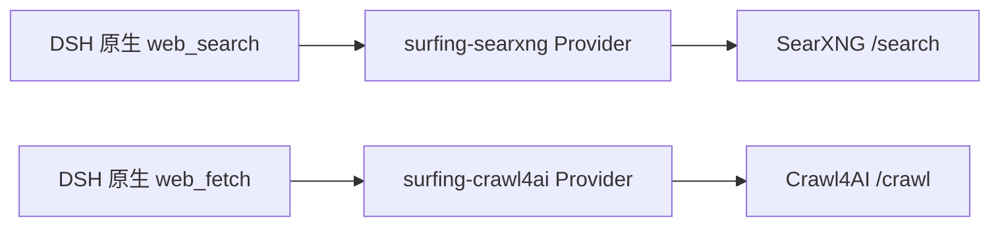

# dsh-surfing-plugin

[English](README.md) | 中文

`dsh-surfing-plugin` 为 [DeepSeek Harness](https://github.com/deepseek-ai/deepseek-harness) 提供自托管网页搜索与抓取：`web_search` 调用 SearXNG，`web_fetch` 调用 Crawl4AI。插件注册到 DSH 的 `ctx.web` Provider 接口，因此工具名称、参数、结果展示、超时与取消仍由 DSH 原生 `web_search` 和 `web_fetch` 实现。

## 工作方式



随包发布的 `cordis.patch.yml` 完成三件事：挂载插件、将 DSH 的搜索与抓取 Provider 分别固定为 `surfing-searxng` 和 `surfing-crawl4ai`、增加一个只注册原生 `web_fetch` 的 Consumer 行。这个独立 Consumer 同时适配两种 DSH 组装：headless 继续使用宿主层 `web_search`，Web UI 继续使用各 Agent Preset 内的 `web_search`。已有的 DeepSeek 搜索 Provider 可以继续挂载，但不会被选中。

## 要求

- Node.js `^22.19.0` 或 `>=24.0.0`
- DeepSeek Harness `>=0.1.0-rc.6 <0.2.0`
- 可访问的 SearXNG 与 Crawl4AI 服务
- SearXNG 必须在 `search.formats` 中启用 `json`；否则 `/search?format=json` 会被拒绝

## 快速开始

先配置服务地址。地址既可以是服务根地址，也可以是完整的 `/search` 或 `/crawl` 端点：

```sh
export SEARXNG_URL=http://127.0.0.1:8080
export CRAWL4AI_URL=http://127.0.0.1:11235

# Crawl4AI 当前版本默认启用 Bearer token；无认证部署可以省略。
export CRAWL4AI_API_TOKEN=replace-with-your-token
```

从本地 checkout 安装到 `web` profile：

```sh
dsh plugin --profile web add .
dsh --profile web --dump-config
dsh --profile web
```

发布到 npm 后安装：

```sh
dsh plugin --profile web add dsh-surfing-plugin
```

卸载：

```sh
dsh plugin --profile web remove dsh-surfing-plugin
```

## 配置

显式配置优先于环境变量。可在 `$DSH_HOME/profiles/web/cordis.patch.yml` 中覆盖本插件的行：

```yaml
- id: surfing-plugin
  config:
    searxng:
      url: https://search.example.com
      apiKeyEnv: MY_SEARXNG_KEY
      authHeader: X-API-Key
      authScheme: ''
      language: zh-CN
      categories: general,news
      safeSearch: 1
      timeRange: month
    crawl4ai:
      url: https://crawl.example.com
      apiKeyEnv: CRAWL4AI_API_TOKEN
      authHeader: Authorization
      authScheme: Bearer
      markdownMode: raw
      maxContentChars: 100000
```

所有字段均可省略：

| 字段 | 环境变量或默认值 | 说明 |
| --- | --- | --- |
| `searxng.url` | `SEARXNG_URL` | 服务根地址或 `/search` 端点 |
| `searxng.apiKey` | 无 | 直接配置的可选密钥 |
| `searxng.apiKeyEnv` | `SEARXNG_API_KEY` | 可选密钥所在的环境变量名 |
| `searxng.authHeader` | `Authorization` | 认证请求头 |
| `searxng.authScheme` | `Bearer` | 认证前缀；空字符串表示直接发送密钥 |
| `searxng.language` | SearXNG 服务默认值 | `language` 参数 |
| `searxng.categories` | SearXNG 服务默认值 | 逗号分隔的 `categories` 参数 |
| `searxng.safeSearch` | SearXNG 服务默认值 | `0`、`1` 或 `2` |
| `searxng.timeRange` | 无 | `day`、`month` 或 `year` |
| `crawl4ai.url` | `CRAWL4AI_URL` | 服务根地址或 `/crawl` 端点 |
| `crawl4ai.apiKey` | 无 | 直接配置的可选密钥 |
| `crawl4ai.apiKeyEnv` | `CRAWL4AI_API_TOKEN` | 可选密钥所在的环境变量名 |
| `crawl4ai.authHeader` | `Authorization` | 认证请求头 |
| `crawl4ai.authScheme` | `Bearer` | 认证前缀；空字符串表示直接发送密钥 |
| `crawl4ai.markdownMode` | `raw` | 优先使用 `raw`、`fit` 或 `citations` markdown |
| `crawl4ai.maxContentChars` | `100000` | Provider 返回给 DSH 前的字符上限 |

配置了 `apiKey` 时，它优先于 `apiKeyEnv` 指向的环境变量。没有密钥时不会发送认证请求头，适合无认证的本地服务。

## Provider 行为

### SearXNG

插件向 `/search` 发送表单编码的 `POST` 请求，并固定请求 `format=json`。它只保留绝对 HTTP(S) 结果 URL，按 URL 去重，将 `title`、`content`、`publishedDate` 映射到 DSH source，并在 SearXNG 返回 `answers` 时生成搜索结果的 `content`。`maxResults` 同时在 Provider 和 DSH web service 中执行。

### Crawl4AI

插件向 `/crawl` 发送最小请求 `{ "urls": [url] }`，不允许模型向 Crawl4AI 注入浏览器或 crawler 配置。仅接受 HTTP(S) 目标。Crawl4AI 返回的目标 HTTP 状态会原样进入 DSH 结果；Crawl4AI API 本身的非 2xx、抓取失败或无法表示的响应会成为结构化 `WebError`。

`raw` 保留完整 markdown；`fit` 与 `citations` 在对应字段为空时回退到 raw markdown。没有 markdown 但存在 `cleaned_html` 或 `html` 时，Provider 返回 HTML body。

## 安全说明

- 优先使用 `apiKeyEnv`，不要把密钥提交到 Git。
- 对非本机服务使用 HTTPS，避免认证头以明文传输。
- Crawl4AI 负责浏览器隔离、目标网络访问与 SSRF 策略；公开部署前应按 Crawl4AI 的安全配置限制网络和认证。
- Provider 请求禁止重定向，避免认证头被转发到另一个后端地址。

## 从 GitHub 安装

Git 安装会从源码运行本包的 `prepare` 构建。建议锁定 commit：

```sh
dsh plugin --profile web add github:cyijun/surfing-plugin#COMMIT_SHA
```

pnpm 10 及更高版本需要先授权 Git 依赖的构建脚本。首次安装提示被阻止时，将提示中的确切包键加入该 profile 的 `pnpm-workspace.yaml`：

```yaml
allowBuilds:
  dsh-surfing-plugin: true
```

然后重新执行安装。npm 包和 `pnpm pack` 生成的 tarball 已包含 `lib/`，不需要此授权。

## 开发与发布

```sh
corepack pnpm install
corepack pnpm run check
corepack pnpm pack
```

`.github/workflows/ci.yml` 在 main 与 pull request 上运行全部检查。`.github/workflows/publish.yml` 在推送 `v*` tag 时使用 npm Trusted Publishing 发布；首次发布前，需要在 npm 包设置中把该 GitHub 仓库和 `publish.yml` 配置为 Trusted Publisher，并确认 `dsh-surfing-plugin` 包名仍可注册。

## 许可证

MIT