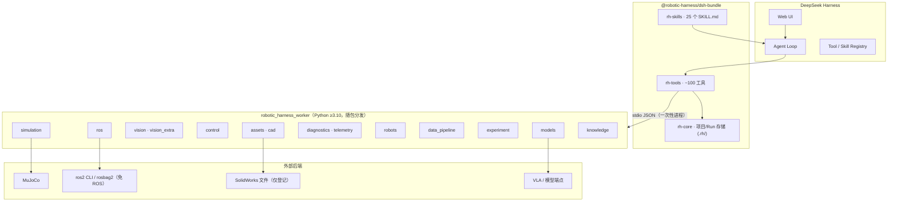

# 🤖 Robotic Harness

**面向具身智能的 [DeepSeek Harness](https://github.com/deepseek-ai/deepseek-harness) 插件套件**

把机器人资产、仿真、能力编排和故障证据放进**同一个 Agent 工作流**——
从 CAD/URDF 检查到 MuJoCo 抓取、故障注入、证据化诊断与可复现实验包。

> 🧪 **致各位测试者与贡献者**：本项目目前处于 **Demo 阶段**，仅在部分本地环境（Windows + Anaconda Python 3.10 + DSH 0.1.0-rc.6）中验证过，ROS 2、CAD、真机以及其它操作系统/硬件环境**尚未充分试验**，使用中如遇问题敬请谅解，欢迎提出 Issue 反馈。
> 我们**欢迎任何人测试、修改、扩展本插件**，也欢迎把你在 ROS 2 / CAD / 视觉 / 控制 / VLA 等方向上的机器人相关插件与本套件组合在一起，**共同做成一个更大的完整机器人插件包** —— 每个独立模块都可以单独发布与贡献，详见 [CONTRIBUTING.md](CONTRIBUTING.md)。

## 📑 目录

- [✨ 特性一览](#-特性一览)
- [📸 演示截图](#-演示截图)
- [🚀 30 秒快速开始](#-30-秒快速开始)
- [🏗️ 架构](#️-架构)
- [📦 安装为 DSH 插件](#-安装为-dsh-插件)
- [🧩 工具与能力面](#-工具与能力面)
- [🎯 Demo（MuJoCo 抓取）](#-demo-mujoco-抓取)
- [⚠️ 已知限制](#️-已知限制)
- [🌊 未来愿景](#-未来愿景)
- [📂 仓库结构](#-仓库结构)
- [📚 文档](#-文档)
- [🤝 贡献](#-贡献)
- [📄 许可证](#-许可证)

## ✨ 特性一览

| | |
|---|---|
| 🔍 **资产 / CAD** | URDF / MJCF / SDF 检查、惯量与拓扑校验、网格统计、SVG 预览、URDF→MJCF 转换、SDF 兼容导出、CAD 清单与版本对比 |
| 🎮 **仿真** | MuJoCo 抓取 + 6 种故障注入、批量基准、只读回放、仿真-真机差距报告 |
| 🧮 **控制** | 跟踪指标（上升/稳定/超调/稳态误差）、轨迹校验、计划-实际对比、PID 模板与配置对比、系统辨识 |
| 👁️ **视觉** | 颜色/通用感知路由、相机健康、标定检查、位姿校验、感知对比、失败帧标注 |
| 🧠 **具身模型** | 模型注册表、内置演示适配器（真实可跑）、诚实后端探测、规则能力路由、策略对比 |
| 📡 **遥测与诊断** | 确定性规则引擎（事实/规则/假设）、异常扫描、失败证据收集、Run 对比 |
| 🧬 **数据处理** | 清单、schema、时间同步、对齐、非破坏转换、episode、防泄漏切分、去标识化、rosbag 转换、LeRobot 导出、数据集版本与数据卡 |
| 🔬 **实验管理** | 定义 → 矩阵 → 基准 → 指标 → 消融 → 报告 |
| 🤖 **真机流程** | preflight 清单 + 实验状态机（无适配器时真机项如实跳过） |
| 📚 **知识检索** | 文档索引/检索、错误码查询、诊断案例检索、项目记忆（检索/记录） |
| 📖 **文献检索** | 公开文献检索（arXiv / Semantic Scholar）+ 任意阶段问题→带证据的候选方案 |
| 🚀 **自主训练** | 服务器探测 → 训练计划 → 补充数据集发现 → 作业准备（默认 dry-run）→ 确认后远程提交 → 状态跟踪 → 报告 |
| 📊 **报告** | 证据包（哈希清单）、Markdown 报告、独立时间线与仪表盘查看器 |

## 📸 演示截图

一次真实 Demo 运行（左→右）：场景渲染 · 关节跟踪 · 轨迹与目标区 · 跟踪误差。

<table>
  <tr>
    <td align="center"><sub>MuJoCo 场景（离屏渲染）</sub></td>
    <td align="center"><sub>关节位置：目标 vs 实际</sub></td>
  </tr>
  <tr>
    <td align="center"><sub>轨迹与目标区</sub></td>
    <td align="center"><sub>随时间变化的跟踪误差</sub></td>
  </tr>
</table>

## 🚀 30 秒快速开始

> 无需 DSH，纯 Python。要求：Python ≥ 3.10，含 `mujoco`、`numpy`、`opencv-python`、`matplotlib`、`pytest`（推荐 Anaconda 的 `python3.10` 环境）。

```sh
git clone https://github.com/dingkaihu63/dsh-robotic-harness.git
cd dsh-robotic-harness

# 1) 运行测试套件（每个测试文件独立进程，规避 mujoco/cv2/pyarrow 原生 DLL 冲突
#    ——与 worker 一次性进程的生产形态一致）
cd python && python run_tests.py && cd ..

# 2) 运行端到端 Demo：正常 Run + 故障 Run + 诊断 + 证据包 + 报告 + 时间线 + 仪表盘
PYTHON=<你的 python3.10> node scripts/demo.mjs
```

输出位于 `examples/demo-output/`：

| 产物 | 说明 |
|---|---|
| `report-run-*.md` | 实验报告（证据 + 假设） |
| `timeline-run-*.html` | 独立时间线查看器（浏览器直接打开，无需服务器） |
| `bundle-run-*/` | 自包含证据包（manifest + sha256 哈希 + 遥测 + 图表） |
| `dashboard.html` | 单文件仪表盘 |
| `.rh/runs/*/artifacts/*.png` | 上面展示的图表 |

## 🏗️ 架构



bundle 内所有工具都通过 stdio 委托给 Python worker（`python -m robotic_harness_worker <command> --input -`）。Run、遥测、图表与报告默认写入 workspace 的 `.rh/` 目录。一次性进程带来崩溃隔离：worker 故障不会拖垮 DSH。

## 📦 安装为 DSH 插件

要求：DSH CLI（`@deepseek-ai/dsh` ≥ 0.1.0-rc.6）、pnpm、Python 3.10 环境。

```sh
# 0) 环境准备（示例：把一切放在 F 盘，DSH_HOME 指向 F 盘目录）
export DSH_HOME=/f/dsh/.dsh-home
export PATH="/f/dsh/.tools:$PATH"            # pnpm 所在目录

# 1) 创建 profile 并安装 bundle
dsh plugin --profile rh-demo add ./packages/dsh-bundle

# 2) 启用 Web UI
#    注意：上游 npm 发布的 @deepseek-ai/dsh-web-app 依赖私有包
#    @deepseek-ai/dsh-frontend（registry 404），`pnpm add` 会失败。
#    内置 bundle 从 dsh 安装目录解析，因此改为编辑
#    $DSH_HOME/profiles/rh-demo/package.json：
#      dsh.profile.bundles = ["@deepseek-ai/dsh-base", "@deepseek-ai/dsh-web-app",
#                             "@robotic-harness/dsh-bundle"]
#    （保存为 UTF-8 无 BOM）

# 3) 在 profile 的 cordis.patch.yml 中把 rh-tools.pythonPath 指向你的
#    Python 3.10 解释器（patch 会整体替换 config，需重述全部键）

# 4) 启动 Web UI（端口任选空闲端口；用 3090 避免与 DSH 默认端口 3080
#    或其他应用冲突）
dsh --profile rh-demo --port 3090
```

然后直接对 Agent 说：

> “运行 Robotic Harness 的 pick-place demo：检查 demo 机械臂，跑一次正常仿真和一次带故障的仿真，诊断失败原因，导出证据包并生成报告。”

Agent 会一步步驱动 `rh_*` 工具并把每一步结果留作证据。

## 🧩 工具与能力面

**约 110 个 `rh_*` 工具 + 27 个 Skill，覆盖十四个领域。** 完整对照表（工具 → worker 命令 → 风险分级）见 [docs/tool-inventory.md](docs/tool-inventory.md)。速览：

| 领域 | 代表工具 |
|---|---|
| 资产 / CAD | `rh_robot_asset_inspect` · `rh_urdf_validate` · `rh_urdf_to_mjcf` · `rh_sdf_validate` · `rh_cad_inventory` · `rh_mesh_inspect` · `rh_inertia_validate` · `rh_robot_topology_validate` · `rh_urdf_preview` · `rh_export_sim_asset` |
| ROS 2 | `rh_ros_graph_snapshot` · `rh_ros_topic_profile` · `rh_ros_qos_check` · `rh_ros_tf_audit` · `rh_rosbag_inspect` *（免 ROS）* · `rh_rosbag_start/stop` · `rh_ros_call_whitelisted_action` |
| 控制 | `rh_control_trace_analyze` · `rh_trajectory_validate` · `rh_planned_actual_compare` · `rh_pid_experiment_prepare` · `rh_controller_config_compare` · `rh_system_identification_job` |
| 视觉 | `rh_camera_health_check` · `rh_calibration_inspect` · `rh_perception_run` · `rh_perception_compare` · `rh_pose_transform_validate` · `rh_annotate_failure_frame` |
| 模型 | `rh_model_inventory` · `rh_model_health` · `rh_model_infer_job` · `rh_model_benchmark` · `rh_capability_route_explain` · `rh_policy_rollout_compare` |
| 仿真 | `rh_sim_run` · `rh_sim_fault_inject` · `rh_sim_batch_benchmark` · `rh_sim_replay` · `rh_sim_real_gap_report` · `rh_sim_validate_scenario` |
| 实机 | `rh_robot_preflight` · `rh_experiment_prepare` · `rh_experiment_request_approval` · `rh_experiment_start` · `rh_experiment_pause` · `rh_experiment_safe_cancel` · `rh_experiment_status` · `rh_experiment_finalize` |
| 遥测 | `rh_telemetry_channels` · `rh_telemetry_window` · `rh_anomaly_scan` · `rh_failure_evidence_collect` · `rh_run_compare` · `rh_diagnose_run` · `rh_timeline_export` |
| 数据 | `rh_data_inventory` · `rh_data_time_sync_estimate` · `rh_data_align_streams` · `rh_data_transform_apply` · `rh_data_split_create` · `rh_data_leakage_check` · `rh_data_deidentify` · `rh_data_convert_rosbag` · `rh_data_export_lerobot` · `rh_dataset_version_create` · `rh_dataset_card_generate` |
| 实验 | `rh_experiment_spec_create` · `rh_experiment_matrix_expand` · `rh_benchmark_start` · `rh_metrics_compute` · `rh_ablation_compare` · `rh_benchmark_report` |
| 知识/记忆 | `rh_docs_index` · `rh_manual_search` · `rh_error_code_lookup` · `rh_case_search` · `rh_memory_retrieve` · `rh_memory_ingest` |
| 文献检索 | `rh_literature_search` · `rh_problem_solutions` —— 针对当前遇到的问题（任意阶段）检索公开文献，得到带证据的候选方案供你选择 |
| 自主训练 | `rh_train_server_check` · `rh_train_plan_create` · `rh_train_data_discovery` · `rh_train_job_prepare` · `rh_train_job_status` · `rh_train_report` —— 规划训练、检索补充数据集、本地准备作业，且只有在你明确确认后才提交到已配置的服务器 |
| 报告 | `rh_evidence_export` · `rh_report_generate` · `rh_dashboard_generate` |

### 实现状态

方案中的工具/Skill 面已按 **Demo 级适配器** 全部实现：

- ✅ **纯软件模块**——完整且有测试（资产、CAD、仿真、控制、视觉、模型、诊断、遥测、数据、实验、知识、记忆、文献、训练）。
- 🔌 **后端依赖模块**——ROS 2 实机探测、SolidWorks 解析、真机适配器、重型 VLA 模型以诚实适配器形式存在：后端缺失时返回结构化 `backend:"unavailable"` 诊断并附安装指引，**绝不假装通过**。rosbag2 的检查与转换无需 ROS。

## 🎯 Demo（MuJoCo 抓取）

- **场景**：平面 3 自由度机械臂 + 吸盘，桌上红色方块抓取 → 目标区放置（MuJoCo，纯基元构建，无外部网格）。
- **感知路由**：颜色分割（低延迟）→ 失败/遮挡时通用分割（边缘显著度），记录路由原因。
- **故障注入**（确定性，seed 可控）：`perception_offset_px`、`gripper_slip`、`tf_offset`、`sensor_noise`、`model_timeout_s`、`occlusion`。
- **遥测**：关节目标/实际/误差、吸盘状态、物体位姿、感知估计 vs 真值；图表与场景渲染图。
- **诊断**：规则引擎产出分层证据 —— 事实（时间戳与数值）、规则判定（阈值/状态机）、候选根因（按感知/标定/机械/控制/系统分层，标注可能性与缺失证据）。**最终结论留给人。**
- **证据**：自包含证据包（哈希清单 + 全部记录）+ Markdown 报告 + timeline.html。

## ⚠️ 已知限制

> 如实说明，让测试者不会被意外惊到。

- 吸盘抓取为**运动学实现**（吸附后物体位姿跟随吸盘）——已在 run 配置与报告中注明。
- 感知在渲染器可用时使用真实离屏渲染；不可用时退化为“真值+噪声”的模拟感知（记录在遥测中）。若 OpenCV 原生崩溃（如极端环境下的 DLL 冲突），感知同样降级到该回退路径，而不是让 Run 失败。无头 Linux 需要软件 GL（`sudo apt install libosmesa6 libgl1` + `MUJOCO_GL=osmesa`）才能离屏渲染；CI 即以此方式运行。
- ROS 2 实机工具需要 `ros2` CLI；缺失时返回结构化 `backend:"unavailable"` 诊断。rosbag2 的检查与转换无需 ROS。
- 真机工具是状态机 + preflight：无硬件适配器时真机项如实标记 `skip`（绝不假装通过）。仿真结果不是真机证据；不提供任意 Topic 发布、真机写操作或急停解除能力。
- SolidWorks 文件只登记不解析（商业软件）；FreeCAD 深度集成可选。
- RLDS 导出为 manifest 骨架（完整 TFDS 导出需 tensorflow）；LeRobot 导出在 pyarrow 可用时用 parquet，否则降级 CSV。
- 文献检索与数据集发现是尽力而为的网络调用：API 不可达时返回结构化 `backend:"unavailable"` 结果，绝不伪造论文或数据集。
- 训练工具是工作流脚手架：生成的训练脚本是确定性模板占位（非真实模型代码）；远程提交要求显式配置的服务器 + 你的确认，且只执行白名单命令。

## 🌊 未来愿景

Robotic Harness 目前只是一个人能力、资源有限的尝试。它还很粗糙，许多模块等待真实环境的检验，也一定藏着不少错误。正因为如此，**社区的参与比什么都重要**：

- **使用它** —— 真实使用是最好的测试，也是最有说服力的方向证据；
- **修正它** —— 报告 bug、补齐边界、更正文档，每一次修复都会让后来者的路更平顺；
- **扩展它** —— 新的 Skill、场景、Failure Case、数据适配器、ROS 2 实机验证、新的领域……

我们期望的终点不是"一个人的插件"，而是：**以开源的 DeepSeek Harness 为地基，经过一代代社区成员的共同打磨，长成一个更适配机器人、具身智能研发场景的开放平台**——让模型负责统筹、专用能力各司其职、每次实验都有完整证据、每份贡献都被记录与复用。

> **正因有涓涓细流，才铸就了大江大河。**

**Every contribution is welcome. —— 每一份贡献都受欢迎。** 🌊

## 📂 仓库结构

```text
packages/dsh-bundle/   可安装 DSH bundle（TS 插件、skills/、worker 副本、fixtures、scenarios）
python/                robotic_harness_worker Python 包 + 测试（run_tests.py）
fixtures/              URDF/SDF 测试资产 + 演示 rosbag2（无需 ROS）
scenarios/             MuJoCo 场景定义（JSON）
scripts/               sync-worker / demo / smoke-worker
docs/                  架构、安全边界、路线图、Demo 说明、工具清单、worker 契约
examples/demo-output/  一键 Demo 的输出示例
```

## 📚 文档

- [架构与领域模型](docs/architecture.md)
- [安全边界](docs/safety-boundary.md)
- [路线图](docs/roadmap.md)
- [Demo 说明](docs/demo.md)
- [工具清单](docs/tool-inventory.md)
- [Worker 模块契约](docs/worker-module-contract.md) —— 为新增领域的贡献者准备
- [贡献指南](CONTRIBUTING.md) · [安全策略](SECURITY.md) · [第三方声明](THIRD_PARTY_NOTICES.md)
- English: [README.md](README.md)

## 🤝 贡献

欢迎测试、报 Issue 与贡献代码 —— 详见 [CONTRIBUTING.md](CONTRIBUTING.md)（模块契约、测试流程、贡献指南）。好的第一个贡献：一个新 Skill、一个新场景、一个新 Failure Case、一个数据导入/导出器，或在真实硬件上验证 ROS 2 实机后端。

## 📄 许可证

[MIT](LICENSE)。第三方组件与资产遵循各自许可（见 [THIRD_PARTY_NOTICES.md](THIRD_PARTY_NOTICES.md)）。
本仓库与 DeepSeek 官方无隶属关系；DSH 是独立项目（MIT，[deepseek-harness](https://github.com/deepseek-ai/deepseek-harness)）。