<h1 align="center">
  
    
    
  
</h1>

  
  

  Latest release · v4.0.0

  
    
    
    
  

<code>pwsh ./check.ps1</code> reports the current local runtime state.

  
    
    
    
    
    ![Skills are excellent local assets of reusable experience. After downloading and installing many Skills, it is easy to sometimes forget which Skills have already been installed and not know which Skills to invoke. Further, when a complex task involves the combined organization and invocation of multiple Skills from different domains, planning becomes complicated for people: they must explain to the AI in detail which Skills each module should use, while the AI may forget these designs during execution. Many current harness frameworks do not actively plan how to make good use of local Skill resources, and may even fall into an either-or scheduling conflict between the harness framework and domain Skill resources. The core of this project is to follow harness frameworks similar to Superpower and GSD. Based on modular decomposition by the planning state machine, it uses different Skills to assist different modules, fully schedules existing local resources, reduces users](./docs/assets/readme-preface-v2-en-light.svg)
  

<h2 align="center">
  
    
    
  
</h2>

> **Task**
>
> *Use public data to complete a reproducible classification experiment and deliver a data audit, statistical review, 4 result figures, a scientific report, and a 7-slide group-meeting deck.*

The diagram shows what happened after the requirement and plan were approved:
how the task was executed, what it produced, and how the result was checked.

The task used the `L` workflow and proceeded in order. During publication
preparation, the configured folders on the same host contained more than 100
Skills. VibeSkills reviewed the candidates and their `SKILL.md` files, selected
7 for this task, and arranged the work into 5 groups and 10 work units. Those
units covered environment setup, data audit, modeling, statistical review,
figures, the report, and the slide deck.

After the work finished, VibeSkills ran 17 checks across the data, experiment
results, figures, report, and slides. The task passed final acceptance after the
required files, cross-deliverable consistency, and core reproduction all passed.

7 Skills selected · 5 work groups · 10 / 10 work units completed · 17 / 17 checks passed

```mermaid
%%{init: {"flowchart": {"curve": "monotoneX", "nodeSpacing": 18, "rankSpacing": 36}}}%%
flowchart LR
    subgraph DISC["Skill discovery"]
        direction TB
        A["Configured Skill folders100+ Skills"]
        B["Shortlist candidatesRead SKILL.md"]
        SEL["Skill selection7 Skills assigned"]
        A --> B
        B --> SEL
    end

    subgraph EXEC["Execution · 5 work groups · 10 work units"]
        direction TB

        subgraph G1["G1 · 01 Environment and data"]
            direction LR
            u01["U01Environment setup"]
            u02["U02Data audit"]
            u01 --> u02
        end

        subgraph G2["G2 · 02 Modeling and reproduction"]
            direction LR
            u03["U03Baseline experiment"]
        end

        subgraph G3["G3 · 03 Statistics and scientific review"]
            direction LR
            u04["U04Statistical analysis"]
            u05["U05Scientific review"]
            u04 --> u05
        end

        subgraph G4["G4 · 04 Figures and report"]
            direction LR
            u06["U06Result figures"]
            u07["U07Report draft"]
            u08["U08Report review"]
            u06 --> u07
            u07 --> u08
        end

        subgraph G5["G5 · 05 Slides and acceptance"]
            direction LR
            u09["U09Group-meeting slides"]
            u10["U10Case package and consistency"]
            u09 --> u10
        end

        G1 --> G2
        G2 --> G3
        G3 --> G4
        G4 --> G5
    end

    subgraph MID["Run and outputs"]
        direction TB
        S(["Run status10 / 10 completed0 failed · 0 blocked"])
        D["Real outputs4 figures · Scientific report7-slide deck"]
        S --> D
    end

    subgraph VERIFY["Verification · 17 checks"]
        direction TB

        subgraph V1["V1 · Foundation and plan"]
            direction LR
            t01["T01required-files"]
            t02["T02 module-output-patterns"]
            t03["T03 runtime-plan-binding"]
            t04["T04 environment-contract"]
            t01 --> t02
            t02 --> t03
            t03 --> t04
        end

        subgraph V2["V2 · Data, model, and reproduction"]
            direction LR
            t05["T05dataset-contract"]
            t06["T06 split-and-model-contract"]
            t07["T07baseline-results"]
            t08["T08 exact-reproduction"]
            t05 --> t06
            t06 --> t07
            t07 --> t08
        end

        subgraph V3["V3 · Statistics and deliverables"]
            direction LR
            t09["T09 uncertainty-consistency"]
            t10["T10 statistics-write-protection"]
            t11["T11 figure-traceability"]
            t12["T12 report-consistency"]
            t13["T13 slides-consistency"]
            t09 --> t10
            t10 --> t11
            t11 --> t12
            t12 --> t13
        end

        subgraph V4["V4 · Publication and boundaries"]
            direction LR
            t14["T14 bilingual-summary-consistency"]
            t15["T15 visual-material-guidance"]
            t16["T16 manifest-boundary"]
            t17["T17 artifact-path-boundary"]
            t14 --> t15
            t15 --> t16
            t16 --> t17
        end

        V1 --> V2
        V2 --> V3
        V3 --> V4
    end

    E(["Final acceptance17 / 17 checks passedPASS"])

    DISC --> EXEC
    EXEC --> MID
    MID --> VERIFY
    VERIFY --> E

    classDef source fill:#EAF3F3,stroke:#2B6F73,color:#182026;
    classDef selected fill:#F5EBEE,stroke:#8A5363,color:#182026;
    classDef unit fill:#FFFFFF,stroke:#5B7F83,color:#182026;
    classDef status fill:#F7EEF1,stroke:#8A5363,color:#182026,stroke-width:2px;
    classDef output fill:#E8F2F0,stroke:#2D7F75,color:#182026;
    classDef check fill:#FFFFFF,stroke:#8A9AA7,color:#182026;
    classDef result fill:#EAF4EE,stroke:#2F7A4B,color:#182026,stroke-width:2px;
    class A,B source;
    class SEL selected;
    class u01,u02,u03,u04,u05,u06,u07,u08,u09,u10 unit;
    class S status;
    class D output;
    class t01,t02,t03,t04,t05,t06,t07,t08,t09,t10,t11,t12,t13,t14,t15,t16,t17 check;
    class E result;

    style DISC fill:transparent,stroke:#AAB7C4,stroke-width:1px,stroke-dasharray:4 3;
    style EXEC fill:transparent,stroke:#AAB7C4,stroke-width:1px,stroke-dasharray:4 3;
    style MID fill:transparent,stroke:#AAB7C4,stroke-width:1px,stroke-dasharray:4 3;
    style VERIFY fill:transparent,stroke:#AAB7C4,stroke-width:1px,stroke-dasharray:4 3;
    style G1 fill:#FFFFFF,stroke:#DCE4EA,stroke-width:1px;
    style G2 fill:#FFFFFF,stroke:#DCE4EA,stroke-width:1px;
    style G3 fill:#FFFFFF,stroke:#DCE4EA,stroke-width:1px;
    style G4 fill:#FFFFFF,stroke:#DCE4EA,stroke-width:1px;
    style G5 fill:#FFFFFF,stroke:#DCE4EA,stroke-width:1px;
    style V1 fill:#FFFFFF,stroke:#DCE4EA,stroke-width:1px;
    style V2 fill:#FFFFFF,stroke:#DCE4EA,stroke-width:1px;
    style V3 fill:#FFFFFF,stroke:#DCE4EA,stroke-width:1px;
    style V4 fill:#FFFFFF,stroke:#DCE4EA,stroke-width:1px;
    linkStyle default stroke:#6D878B,stroke-width:1px;
```

<h2 align="center">
  
    
    
  
</h2>

*VibeSkills gives an Agent one process from receiving a task to checking the delivery.*

Each stage answers a concrete question: what needs to be done, how the
work should proceed, which Skills should take part, what actually happened, and
whether the result is ready to deliver.

  

<ol type="I">
  <li>Confirms the requirement. Before work begins, it confirms the goal, constraints, available material, and expected delivery. The process stops here until the requirement is approved, giving the plan and final check a clear basis.</li>
  <li>Recommends a level. VibeSkills recommends <code>L</code> or <code>XL</code> from the task's scope, steps, dependencies, and opportunities for parallel work. You then confirm the level. Manageable work proceeds in order; larger work is split more finely.</li>
  <li>Organizes Skills. VibeSkills reviews the local Skill folders, selects the methods that fit each part, and states what each Skill owns, what it should deliver, and how completion will be checked.</li>
  <li>Executes and records. After plan approval, the current Agent completes the work. Code tasks can use test-driven development (TDD) when appropriate: show the problem with a failing test, make the change, and run the tests again. Completed, failed, and blocked states are recorded so a later session can continue.</li>
  <li>Checks the result. VibeSkills compares the actual result with every planned item. Required work that is incomplete, failed, or blocked prevents final acceptance.</li>
</ol>

When to use L or XL

| Level | Best for | How it works |
|:---|:---|:---|
| `L` | Multi-step work of manageable size | Splits the task, then works through the parts in order with less time and context overhead |
| `XL` | Larger work with several relatively independent parts | Uses a more detailed breakdown and can run up to two non-conflicting parts at the same time, with additional coordination and result collection |

<h2 align="center">
  
    
    
  
</h2>

*Local Skills can store tool usage, working steps, decision rules, and checking methods.*

VibeSkills reviews the local Skill folders you configure, then
shortlists the Skills that fit the work required by each part of the task.

  

The left side shows the different kinds of work in the task, VibeSkills makes
the assignment in the middle, and the local Skill folders are on the right. A
selected Skill is tied to concrete work, expected delivery, and a check. The
current Agent then follows the shared plan.

<table align="center" width="94%">
  <thead>
    <tr>
      <th width="50%" align="center">Passive Skill triggering</th>
      <th width="50%" align="center">With VibeSkills</th>
    </tr>
  </thead>
  <tbody>
    <tr>
      <td>The AI reacts to a few obvious words</td>
      <td>It splits the whole task first</td>
    </tr>
    <tr>
      <td>The same familiar Skills are used repeatedly</td>
      <td>Each part is checked for a better-fitting Skill</td>
    </tr>
    <tr>
      <td>Unmatched work is handled on the spot</td>
      <td>A useful Skill is assigned to specific work with a stated result</td>
    </tr>
    <tr>
      <td>Separate calls are left disconnected</td>
      <td>All results are brought together and checked at the end</td>
    </tr>
  </tbody>
</table>

VibeSkills does something straightforward: **it first makes the whole task
clear, then assigns the right Skills to the relevant parts**. It coordinates
the work and checks the combined result at the end. The task uses the Skills it
needs; the rest of the local library stays available without entering the plan.

You can keep adding your own Skills, team Skills, and third-party Skills.
VibeSkills does not call every installed Skill automatically; it selects the
Skills that fit the current task. The size of the library defines the available
choices, not a list that every task must use.

Will a large Skill library use a lot of tokens?

VibeSkills checks the Skill folders you configure, but finding files locally
and placing their full contents in the model context are different operations.

Discovery and index generation happen locally. VibeSkills first extracts compact
information such as each Skill's name, description, intended use, and boundaries,
then uses that information to shortlist candidates for each part of the task.

Only retained candidates are then read as complete `SKILL.md` files. Execution
uses only the Skills written into the plan. Token usage therefore depends mainly
on how many candidates the task retains, how long those documents are, and how
complex the task is. It is not the same as reading the full local Skill library
into the model context.

This overhead is not zero. More candidates, longer Skill documents, or a more
finely divided task will use more context. The current design bounds that cost
with a local index, candidate shortlisting, and on-demand reading.

Local folders and selection records

Alongside the shared Skills directory, more local folders can be listed in
`~/.vibeskills/skill-roots.json` or
`<workspace>/.vibeskills/skill-roots.json`.

A Skill needs a readable `SKILL.md`, a name that does not conflict with another
Skill, and a clear fit for the current work before it can be selected. Adding a
local folder makes those Skills available to later tasks without waiting for the
VibeSkills repository to include them.

During planning, `agent_skill_organization` stores which Skills are intended for
each part of the task. During execution, `module_assignments` stores the actual
assignment. Finding a Skill means it can be considered; it does not mean the
Skill has already taken part in the work.

<h2 align="center">
  
    
    
  
</h2>

*A public example lets readers follow the requirement, plan, actual result, and final check.*

VibeSkills keeps the approved requirement, plan, execution progress, and final
check in the same task record. A later session can continue from the saved
progress, and a review can compare the original plan with the actual result.
Installation state is recorded separately so it is not confused with task
completion.

View the record files

| File or directory | What it is for |
|:---|:---|
| `install-receipt.json` | Records the files written by the installer so `check` can find missing or changed files |
| `session_root` | Stores the input, progress, important decisions, and summary for one task |
| `module-work-plan.json` | Stores the approved work plan, including responsibility, expected output, and checks |
| `module-execution.json` | Stores what each part actually produced and whether it completed, failed, or was blocked |
| `delivery-acceptance-report.json` or `.md` | Stores the final check and shows which items passed |

Maintainers can use the
the checks in that list and run wider audits only when there is a reason.

A successful installation does not mean the task ran, and a task record does
not mean the final result passed its checks.

<h2 align="center">
  
    
    
  
</h2>

<ol type="I">
  <li>Invoke. In any AI application that supports local Skills, invoke VibeSkills through the application's Skills entry, using <code>$vibe</code>, <code>/vibe</code>, or the syntax it provides.</li>
  <li>Discover. VibeSkills scans the Skills installation directory and any additional local Skill folders you configure to find the Skills currently available.</li>
  <li>Organize. It selects suitable Skills for the task, assigns them to the relevant work, and coordinates the result. You do not need to remember which Skill should be used when.</li>
</ol>

  
    
    
  

## More Documentation

<table align="center" width="90%">
  <thead>
    <tr>
      <th width="50%" align="center">Need</th>
      <th width="50%" align="center">Start here</th>
    </tr>
  </thead>
  <tbody>
    <tr><td align="center">See a complete real run</td><td align="center"><a href="./docs/cases/ml-experiment/README.md">Machine-learning experiment case</a></td></tr>
    <tr><td align="center">First use</td><td align="center"><a href="./docs/quick-start.en.md">Quick start</a></td></tr>
    <tr><td align="center">Current release</td><td align="center"><a href="https://github.com/foryourhealth111-pixel/Vibe-Skills/releases/latest">GitHub release metadata</a></td></tr>
    <tr><td align="center">How it works</td><td align="center"><a href="./docs/README.md">Documentation index</a></td></tr>
    <tr><td align="center">Troubleshooting</td><td align="center"><a href="./docs/troubleshooting.md">Troubleshooting guide</a></td></tr>
    <tr><td align="center">Contributing</td><td align="center"><a href="./CONTRIBUTING.md">Contribution guide</a></td></tr>
  </tbody>
</table>

  
    
    
  

## Community and Credits

Questions, corrections, and well-scoped contributions are welcome through
[GitHub Issues](https://github.com/foryourhealth111-pixel/Vibe-Skills/issues)
and pull requests.

VibeSkills discussions and community practice can also continue on
[LINUX DO](https://linux.do/). It is a place to exchange technical questions,
AI practice, and experience. Thank you to the LINUX DO community for supporting
this project.

The [VibeSkills 3.1.0 community practice cases](https://linux.do/t/topic/2061161)
collect several examples that were shared with the community.

Commu