<h1 align="center">
  
    
    
  
</h1>

  
  

  最新版本 · v4.0.0

  
    
    
    
  

<code>pwsh ./check.ps1</code> 可查看当前本地运行时状态。

  
    
    
    
    
    
  

<h2 align="center">
  
    
    
  
</h2>

> **任务**
>
> *使用公开数据完成一个可复现的分类实验，并交付数据审计、统计复核、4 张结果图、科学报告和 7 页组会 Slides。*

这张图展示的是需求和计划确认之后，这次任务怎样实际执行并完成检查。

这次任务按 `L` 级计划顺序推进。发布准备时，同一台主机的已配置
目录中统计到 100 多个 Skills；VibeSkills 查看候选并读取相关的 `SKILL.md`，最后
选出适合这次任务的 7 个 Skills，再把工作安排成 5 个工作组和 10 个工作单元。
这些工作依次完成环境准备、数据审计、建模、统计复核、图表、报告和 Slides。

所有工作完成后，VibeSkills 对数据、实验结果、图表、报告和 Slides 做了 17 项检查。
文件齐全、内容一致、核心实验可以复现后，这次任务通过最终验收。

选用 7 个 Skills · 拆分为 5 个工作组 · 完成 10 / 10 个工作单元 · 通过 17 / 17 项检查

```mermaid
%%{init: {"flowchart": {"curve": "monotoneX", "nodeSpacing": 18, "rankSpacing": 36}}}%%
flowchart LR
    subgraph DISC["Skill 发现"]
        direction TB
        A["本地 Skill 目录100+ Skills"]
        B["筛选候选读取 SKILL.md"]
        SEL["Skill 选择7 个 Skills 已分配"]
        A --> B
        B --> SEL
    end

    subgraph EXEC["执行 · 5 个工作组 · 10 个工作单元"]
        direction TB

        subgraph G1["G1 · 01 环境与数据"]
            direction LR
            u01["U01环境准备"]
            u02["U02数据审计"]
            u01 --> u02
        end

        subgraph G2["G2 · 02 建模与复现"]
            direction LR
            u03["U03基线实验"]
        end

        subgraph G3["G3 · 03 统计与科学复核"]
            direction LR
            u04["U04统计分析"]
            u05["U05科学复核"]
            u04 --> u05
        end

        subgraph G4["G4 · 04 图表与报告"]
            direction LR
            u06["U06结果图"]
            u07["U07报告初稿"]
            u08["U08报告复核"]
            u06 --> u07
            u07 --> u08
        end

        subgraph G5["G5 · 05 Slides 与验收"]
            direction LR
            u09["U09组会 Slides"]
            u10["U10案例打包与一致性检查"]
            u09 --> u10
        end

        G1 --> G2
        G2 --> G3
        G3 --> G4
        G4 --> G5
    end

    subgraph MID["运行与产物"]
        direction TB
        S(["运行状态10 / 10 完成0 失败 · 0 阻塞"])
        D["实际产物4 张图 · 科学报告7 页 Slides"]
        S --> D
    end

    subgraph VERIFY["验证 · 17 项检查"]
        direction TB

        subgraph V1["V1 · 基础与计划"]
            direction LR
            t01["T01必需文件"]
            t02["T02模块输出匹配"]
            t03["T03运行与计划绑定"]
            t04["T04环境合同"]
            t01 --> t02
            t02 --> t03
            t03 --> t04
        end

        subgraph V2["V2 · 数据、模型与复现"]
            direction LR
            t05["T05数据集合同"]
            t06["T06数据拆分与模型合同"]
            t07["T07基线结果"]
            t08["T08精确复现"]
            t05 --> t06
            t06 --> t07
            t07 --> t08
        end

        subgraph V3["V3 · 统计与交付物"]
            direction LR
            t09["T09不确定性一致性"]
            t10["T10统计文件写入保护"]
            t11["T11图表可追溯性"]
            t12["T12报告一致性"]
            t13["T13Slides 一致性"]
            t09 --> t10
            t10 --> t11
            t11 --> t12
            t12 --> t13
        end

        subgraph V4["V4 · 发布与边界"]
            direction LR
            t14["T14中英文摘要一致性"]
            t15["T15可视材料指引"]
            t16["T16Manifest 边界"]
            t17["T17产物路径边界"]
            t14 --> t15
            t15 --> t16
            t16 --> t17
        end

        V1 --> V2
        V2 --> V3
        V3 --> V4
    end

    E(["最终验收17 / 17 检查通过PASS"])

    DISC --> EXEC
    EXEC --> MID
    MID --> VERIFY
    VERIFY --> E

    classDef source fill:#EAF3F3,stroke:#2B6F73,color:#182026;
    classDef selected fill:#F5EBEE,stroke:#8A5363,color:#182026;
    classDef unit fill:#FFFFFF,stroke:#5B7F83,color:#182026;
    classDef status fill:#F7EEF1,stroke:#8A5363,color:#182026,stroke-width:2px;
    classDef output fill:#E8F2F0,stroke:#2D7F75,color:#182026;
    classDef check fill:#FFFFFF,stroke:#8A9AA7,color:#182026;
    classDef result fill:#EAF4EE,stroke:#2F7A4B,color:#182026,stroke-width:2px;
    class A,B source;
    class SEL selected;
    class u01,u02,u03,u04,u05,u06,u07,u08,u09,u10 unit;
    class S status;
    class D output;
    class t01,t02,t03,t04,t05,t06,t07,t08,t09,t10,t11,t12,t13,t14,t15,t16,t17 check;
    class E result;

    style DISC fill:transparent,stroke:#AAB7C4,stroke-width:1px,stroke-dasharray:4 3;
    style EXEC fill:transparent,stroke:#AAB7C4,stroke-width:1px,stroke-dasharray:4 3;
    style MID fill:transparent,stroke:#AAB7C4,stroke-width:1px,stroke-dasharray:4 3;
    style VERIFY fill:transparent,stroke:#AAB7C4,stroke-width:1px,stroke-dasharray:4 3;
    style G1 fill:#FFFFFF,stroke:#DCE4EA,stroke-width:1px;
    style G2 fill:#FFFFFF,stroke:#DCE4EA,stroke-width:1px;
    style G3 fill:#FFFFFF,stroke:#DCE4EA,stroke-width:1px;
    style G4 fill:#FFFFFF,stroke:#DCE4EA,stroke-width:1px;
    style G5 fill:#FFFFFF,stroke:#DCE4EA,stroke-width:1px;
    style V1 fill:#FFFFFF,stroke:#DCE4EA,stroke-width:1px;
    style V2 fill:#FFFFFF,stroke:#DCE4EA,stroke-width:1px;
    style V3 fill:#FFFFFF,stroke:#DCE4EA,stroke-width:1px;
    style V4 fill:#FFFFFF,stroke:#DCE4EA,stroke-width:1px;
    linkStyle default stroke:#6D878B,stroke-width:1px;
```

<h2 align="center">
  
    
    
  
</h2>

*VibeSkills 为 Agent 提供一套从接收任务到检查交付的完整流程。*

每个阶段都回答一个具体问题：要做什么、怎样推进、哪些 Skills 参与、实际完成了什么，
以及最终能否交付。

  

<ol type="I">
  <li>确认需求。 开始工作前，先确认任务目标、限制条件、已有材料和最后要交付的内容。需求没有确认时，流程会停在这里，后面的计划和检查都有明确依据。</li>
  <li>推荐级别。 VibeSkills 根据任务范围、步骤、依赖关系和可并行的工作推荐 <code>L</code> 或 <code>XL</code>，再由你确认。规模可控的任务按顺序推进，较大的任务拆得更细。</li>
  <li>组织 Skills。 VibeSkills 查看本地 Skill 目录，为任务各部分选择合适的方法，并写清每个 Skill 负责什么、需要交付什么、怎样确认完成。</li>
  <li>执行并记录。 计划确认后，当前 Agent 按计划完成工作。代码任务可以在适合时使用测试驱动开发（TDD），先用失败测试确认问题，再修改并重新测试。完成、失败和阻塞都会记录，中断后也可以从已有进度继续。</li>
  <li>检查结果。 工作结束后，VibeSkills 把实际结果和计划逐项对照。必做内容没有完成、执行失败或仍然被卡住时，任务不会通过最终检查。</li>
</ol>

L 和 XL 分别适合什么任务

| 级别 | 适合的任务 | 处理方式 |
|:---|:---|:---|
| `L` | 步骤较多，但规模仍然可控 | 拆分后按顺序推进，处理过程较简单，使用的时间和上下文较少 |
| `XL` | 包含多个相对独立部分的大任务 | 拆得更细，互不影响时最多同时推进两项工作，并增加协调和结果汇总 |

<h2 align="center">
  
    
    
  
</h2>

*本地 Skills 可以保存工具用法、工作步骤、判断标准和检查方法。*

VibeSkills 会从你配置的本地 Skill 目录中查看可用 Skills，再根据任务每一部分需要
完成的工作筛选候选。

  

图中左边是任务包含的不同工作，中间是 VibeSkills 做出的安排，右边是本地 Skill
目录。被选中的 Skill 会对应到具体工作、交付内容和检查方式，最后由当前 Agent
按照同一份计划完成。

<table align="center" width="94%">
  <thead>
    <tr>
      <th width="50%" align="center">只靠被动触发</th>
      <th width="50%" align="center">使用 VibeSkills</th>
    </tr>
  </thead>
  <tbody>
    <tr>
      <td>AI 临时根据几个关键词决定用什么</td>
      <td>先把整个任务完整拆开</td>
    </tr>
    <tr>
      <td>容易反复使用最熟悉的一两个 Skills</td>
      <td>每一部分都看看有没有更合适的 Skill</td>
    </tr>
    <tr>
      <td>没匹配到的部分继续临场处理</td>
      <td>把合适的 Skill 安排到具体工作上，并写清要做出什么</td>
    </tr>
    <tr>
      <td>各次调用互不衔接</td>
      <td>最后把所有结果汇总起来一起检查</td>
    </tr>
  </tbody>
</table>

VibeSkills 做的事情很直接：**先把任务拆清楚，再把合适的 Skills 安排到对应部分**。
它负责协调这些工作，并在最后汇总检查。任务需要哪些 Skills 就使用哪些，不会把
本地的 Skills 全部调用一遍。

你可以继续添加自己编写的 Skill、团队内部 Skill 和第三方 Skill。VibeSkills 不会自动调用你安装的所有 Skills，
只会选择当前任务真正用得上的部分。安装数量代表
可选范围，不会变成每次任务都要使用的清单。

Skill 很多时，会不会消耗很多 token？

VibeSkills 会检查你配置的 Skill 目录，但在本机发现文件和把文件全文放进模型上下文
是两件事。

目录发现和索引生成在本机完成。VibeSkills 先提取 Skill 的名称、说明、适用场景和
边界等紧凑信息，用这些信息为任务的不同部分筛选候选。

只有保留下来的候选才会由 Agent 继续阅读完整的 `SKILL.md`。执行时也只使用已经写进
计划的 Skills。因此，token 开销主要取决于这次任务保留了多少候选、这些文档有多长，
以及任务本身的复杂度，不会等同于把整个 Skill 库全文读一遍。

这部分开销仍然存在。候选较多、Skill 文档较长或任务拆分较细时，会使用更多上下文。
当前设计通过本地索引、候选筛选和按需阅读控制范围。

本地目录和选择记录

除了共享 Skills 目录，还可以通过 `~/.vibeskills/skill-roots.json` 或工作区中的
`<workspace>/.vibeskills/skill-roots.json` 增加其他本地目录。

一个 Skill 需要有可读取的 `SKILL.md`，名称不能与另一个 Skill 冲突，并且用途适合
当前工作，才会进入选择范围。新增本地目录后，其中的 Skills 就可以参与后续任务，
不需要等待 VibeSkills 项目收录。

计划阶段，`agent_skill_organization` 保存每一部分准备使用哪些 Skills。开始执行后，
`module_assignments` 保存实际分配。发现一个 Skill 只说明它可以考虑，不代表它
已经参与了工作。

<h2 align="center">
  
    
    
  
</h2>

*公开案例会让人能顺着需求、计划、实际结果和最终检查一路看下来。*

VibeSkills 会把确认过的需求、计划、执行进度和最终检查保存在同一次任务记录中。
任务中断后，Agent 可以从已有进度继续；复查时，也能对照原来的计划和实际结果。
安装状态单独记录，避免把“已经安装”和“任务已经完成”混在一起。

查看记录文件

| 文件或目录 | 用来做什么 |
|:---|:---|
| `install-receipt.json` | 记录安装器写入的文件，供 `check` 检查安装是否完整、文件有没有被改动 |
| `session_root` | 保存一次任务的输入、进度、重要决定和运行摘要 |
| `module-work-plan.json` | 保存已经确认的任务安排，包括各部分由谁负责、需要交付什么、怎样检查 |
| `module-execution.json` | 保存各部分实际完成的结果，以及完成、失败或被卡住的状态 |
| `delivery-acceptance-report.json` 或 `.md` | 保存最终检查结果，说明哪些项目已经通过 |

一般先完成清单里的基础检查；只有发现风险时，再扩大检查范围。

这些记录不能互相代替。安装成功，不代表任务已经跑完；有运行记录，也不代表
最终结果已经通过检查。

<h2 align="center">
  
    
    
  
</h2>

<ol type="I">
  <li>调用。 在任何支持本地 Skills 的 AI 应用中，通过应用自己的 Skills 入口调用 VibeSkills，可使用 <code>$vibe</code>、<code>/vibe</code> 或该应用提供的入口语法。</li>
  <li>发现。 VibeSkills 会扫描 Skills 安装目录，以及你配置的其他本地 Skill 目录，找到当前可用的 Skills。</li>
  <li>组织。 它会根据任务选择合适的 Skills，安排到对应工作中，再统一推进和检查结果。你不需要自己记住每个 Skill 应该在什么时候使用。</li>
</ol>

  
    
    
  

## 更多文档

<table align="center" width="90%">
  <thead>
    <tr>
      <th width="50%" align="center">你想做什么</th>
      <th width="50%" align="center">从这里开始</th>
    </tr>
  </thead>
  <tbody>
    <tr><td align="center">安装、更新、卸载</td><td align="center"><a href="./docs/install/README.md">简明安装指南</a></td></tr>
    <tr><td align="center">第一次使用</td><td align="center"><a href="./docs/quick-start.md">快速开始</a></td></tr>
    <tr><td align="center">当前发布版本</td><td align="center"><a href="https://github.com/foryourhealth111-pixel/Vibe-Skills/releases/latest">GitHub Release 元数据</a></td></tr>
    <tr><td align="center">了解它怎么工作</td><td align="center"><a href="./docs/README.md">文档索引</a></td></tr>
    <tr><td align="center">排查问题</td><td align="center"><a href="./docs/troubleshooting.md">故障排查</a></td></tr>
    <tr><td align="center">参与贡献</td><td align="center"><a href="./CONTRIBUTING.md">贡献指南</a></td></tr>
  </tbody>
</table>

  
    
    
  

## 社区与致谢

问题、纠错和范围清晰的贡献都可以通过
[GitHub Issues](https://github.com/foryourhealth111-pixel/Vibe-Skills/issues)
与 Pull Request 提交。

VibeSkills 的使用讨论和社区实践也可以在 [LINUX DO](https://linux.do/) 继续交流。
那里有技术讨论、AI 实践和使用经验分享。感谢 LINUX DO 社区一直以来对这个项目
的支持。

想看已经公开分享过的实践，可以从
[VibeSkills 3.1.0 社区实践案例](https://linux.do/t/topic/2061161) 开始。

社区贡献者包括
[xiaozhongyaonvli](https://github.com/xiaozhongyaonvli) 和
[ruirui2345](https://github.com/ruirui2345)。

第三方软件的归属和许可证信息见 [NOTICE](./NOTICE) 与
[第三方许可证](./THIRD_PARTY_LICENSES.md)。

  
    
    
  

## Star History

    
      
      
      