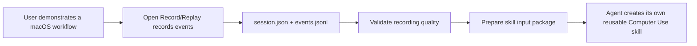
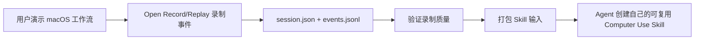

# 打开录音/重放

  通过演示教授计算机使用代理。

  记录一次 macOS 工作流程，保存证据，然后让客服人员将其转变为可重复使用的技能。

  英语 | [简体中文](#简体中文)

Open Record/Replay 是一款本地优先的 macOS 录制器，其工作流程更容易展示而不是书写。它将用户的真实桌面操作捕获到结构化工件（例如 `session.json` 和 `events.jsonl`）中，验证录制质量，并将证据打包为客服人员的技能创建流程。

目标很简单：如果用户可以演示一次桌面工作流程，那么代理应该有足够的证据来学习它。



## 为什么会存在

有些工作流程很难用提示来描述：

- 它们依赖于可见的桌面用户界面。
- 它们涉及文件选择器、菜单、模式或拖放。
- 它们跨越多个应用程序。
- 它们取决于个人工作空间布局或特定于团队的约定。
- 通过演示比通过书面操作手册更容易学习。

开放记录/重放为代理提供了具体的证据流，而不是要求他们从模糊的描述中推断出工作流程。

## 您可以记录什么

Open Record/Replay 可以捕获工作流程的操作级证据，例如：

- 通过桌面聊天应用程序发送文件或图像。
- 创建文档并共享其链接。
- 打开浏览器页面，搜索并启动正确的媒体。
- 在浏览器和桌面应用程序之间移动。
- 重复干净的 API 或连接器未涵盖的 UI 流程。

记录仪可以捕获：

- `window.changed`
- `mouse.click`
- `mouse.drag`
- `keyboard.text_input`
- `keyboard.submit`
- `selection.changed`
- 应用程序/窗口归因
- 用户界面目标
- 选定的项目
- 辅助功能树或差异上下文

`events.jsonl`为主要证据。屏幕截图不是当前核心记录路径的一部分。

## 快速演示

这是向客服人员传授新的桌面工作流程的典型流程。

```bash
git clone https://github.com/humblebanana/open-record-replay.git
cd open-record-replay
npm install
npm run check
```

检查 macOS 权限：

```bash
node bin/orr.js permissions check
```

请求缺少的权限：

```bash
node bin/orr.js permissions request
```

开始录音：

```bash
node bin/orr.js record start --name send-file-demo --out runs --request-permissions
```

现在在您的 Mac 上演示工作流程。例如：

1. 打开桌面聊天应用程序。
2. 选择收件人或渠道。
3. 附加本地文件。
4. 确认上传。
5. 发送简短的后续消息。

完成后，停止录制：

```bash
node bin/orr.js record stop latest
```

验证证据：

```bash
node bin/orr.js session validate-recording latest
```

准备技能输入包：

```bash
node bin/orr.js skill prepare latest --runs runs --out skill-inputs
```

该包将被写入：

```text
skill-inputs/<session-id>/
├── README.md
├── events.jsonl
└── session.json
```

将此目录提供给当前代理的技能创建流程。

## 输出工件

录音输出：

```text
runs/sessions/<session-id>/
├── session.json
├── events.jsonl
├── orr_session.json
└── recording_manifest.json
```

技能输入包：

```text
skill-inputs/<session-id>/
├── README.md
├── events.jsonl
└── session.json
```

`session.json`记录记录边界、时间和事件路径。 `events.jsonl` 是演示期间发生的事情的真相来源。

## 代理集成

该存储库包含主机指令技能：

[技能/open-record-replay/SKILL.md](./skills/open-record-replay/SKILL.md)

特工应该使用它来了解何时开始记录、何时停止、如何检查 `events.jsonl` 以及如何将证据包交给自己的技能创建流程。

预计代理流量：

1. 检查或请求所需的 macOS 权限。
2. 仅当用户准备好时才开始录制。
3. 录音开始后，停止当前回合，等待用户演示完毕。
4. 当用户说演示完成时停止录音机。
5.读取`session.json`和`events.jsonl`。
6. 验证录音。
7. 准备技能输入包。
8. 使用代理自己的技能创建系统来创建并验证最终技能。

## CLI 参考

```bash
node bin/orr.js permissions check
node bin/orr.js permissions request
node bin/orr.js record start --name my-workflow --out runs --request-permissions
node bin/orr.js record stop latest
node bin/orr.js session list
node bin/orr.js session inspect latest
node bin/orr.js session events latest
node bin/orr.js session validate-recording latest
node bin/orr.js skill prepare latest --runs runs --out skill-inputs
```

稳定的公共路径是记录、验证和技能输入打包。

## 要求

- macOS。
- Node.js 18+。
- Swift 工具链/Xcode 命令行工具。
- 辅助功能许可。
- 输入监控权限。

核心记录器不需要屏幕记录。

## 隐私

默认情况下录音是本地的，但 `events.jsonl` 可以包含敏感数据：

- 窗口标题。
- 网址。
- 输入的文本。
- 选定的文本。
- 文件名。
- 本地路径。
- 来自应用程序和网页的辅助功能树文本。

Review recordings before sharing them. Do not publish raw recordings that contain secrets, private documents, customer data, internal URLs, or personal information.

See [Privacy](./docs/privacy.md).

## Status

Open Record/Replay is alpha software.

Current public scope:

```text
macOS native recorder
+ CLI
+ session.json / events.jsonl
+ recording validation
+ skill input package
+ host-agent skill creation handoff
```

Future work may include richer adapters or optional visual evidence. They are not part of the current stable public path.

## Documentation

- [Installation](./docs/install.md)
- [Agent Usage](./docs/agent-integration.md)
- [Recording Data Contract](./docs/recording-data-contract.md)
- [Privacy](./docs/privacy.md)
- [Release Checklist](./docs/release-checklist.md)
- [Contributing](./CONTRIBUTING.md)

# 简体中文

Open Record/Replay 用来通过一次真实演示，让 Computer Use Agent 学会一个 macOS 桌面工作流。

它会把用户在 Mac 上的真实操作录制成 `session.json` 和 `events.jsonl`，检查录制质量，并打包成 Agent 可以读取的 Skill 输入包。最终 Skill 不由 Open Record/Replay 直接生成，而是交给当前 Agent 使用自己的 Skill 创建流程完成。

核心目标很简单：如果用户可以演示一次工作流，Agent 就应该有足够的证据去学习它。



## 为什么需要它

有些工作流很难直接写成提示词：

- 它依赖真实桌面 UI。
- 它涉及文件选择器、菜单、弹窗或拖拽。
- 它横跨多个 App。
- 它依赖个人工作区布局或团队内部习惯。
- 用户演示一次，比写一份很长的操作说明更清楚。

Open Record/Replay 给 Agent 的不是模糊描述，而是一份真实事件证据流。

## 可以录制什么

典型场景包括：

- 在桌面聊天 App 里发送文件或图片。
- 创建文档并分享链接。
- 打开网页、搜索内容并播放指定媒体。
- 在浏览器和桌面 App 之间切换操作。
- 复现一个没有稳定 API 或 connector 的 UI 流程。

录制器可以捕捉：

- `window.changed`
- `mouse.click`
- `mouse.drag`
- `keyboard.text_input`
- `keyboard.submit`
- `selection.changed`
- App / 窗口归属
- UI target
- 选中文件或文本
- Accessibility tree / diff 上下文

`events.jsonl` 是最关键的证据。截图不是当前核心录制链路的一部分。

## 快速演示

安装并检查项目：

```bash
git clone https://github.com/humblebanana/open-record-replay.git
cd open-record-replay
npm install
npm run check
```

检查 macOS 权限：

```bash
node bin/orr.js permissions check
```

请求缺失权限：

```bash
node bin/orr.js permissions request
```

开始录制：

```bash
node bin/orr.js record start --name send-file-demo --out runs --request-permissions
```

然后在 Mac 上演示你的工作流。比如：

1. 打开一个桌面聊天 App。
2. 选择联系人或群聊。
3. 附加一个本地文件。
4. 确认上传。
5. 发送一条补充消息。

完成后停止录制：

```bash
node bin/orr.js record stop latest
```

验证录制质量：

```bash
node bin/orr.js session validate-recording latest
```

准备 Skill 输入包：

```bash
node bin/orr.js skill prepare latest --runs runs --out skill-inputs
```

产物会写入：

```text
skill-inputs/<session-id>/
├── README.md
├── events.jsonl
└── session.json
```

把这个目录交给当前 Agent 的 Skill 创建流程即可。

## 产物结构

录制输出：

```text
runs/sessions/<session-id>/
├── session.json
├── events.jsonl
├── orr_session.json
└── recording_manifest.json
```

Skill 输入包：

```text
skill-inputs/<session-id>/
├── README.md
├── events.jsonl
└── session.json
```

`session.json` 记录录制边界、时间和事件路径。`events.jsonl` 是判断用户到底做了什么的 source of truth。

## Agent 如何接入

仓库里包含一个给 Agent 使用的说明 Skill：

[skills/open-record-replay/SKILL.md](./skills/open-record-replay/SKILL.md)

Agent 应该通过它理解什么时候开始录制、什么时候停止、如何读取 `events.jsonl`，以及如何把证据包交给自己的 Skill 创建流程。

推荐流程：

1. 检查或请求必要的 macOS 权限。
2. 只在用户准备好时开始录制。
3. 录制开始后，Agent 停止当前回合，等待用户演示完成。
4. 用户说完成后，Agent 停止录制。
5. 读取 `session.json` 和 `events.jsonl`。
6. 验证录制质量。
7. 准备 Skill 输入包。
8. 使用当前 Agent 自己的 Skill 创建系统生成并验证最终 Skill。

## CLI 命令

```bash
node bin/orr.js permissions check
node bin/orr.js permissions requ