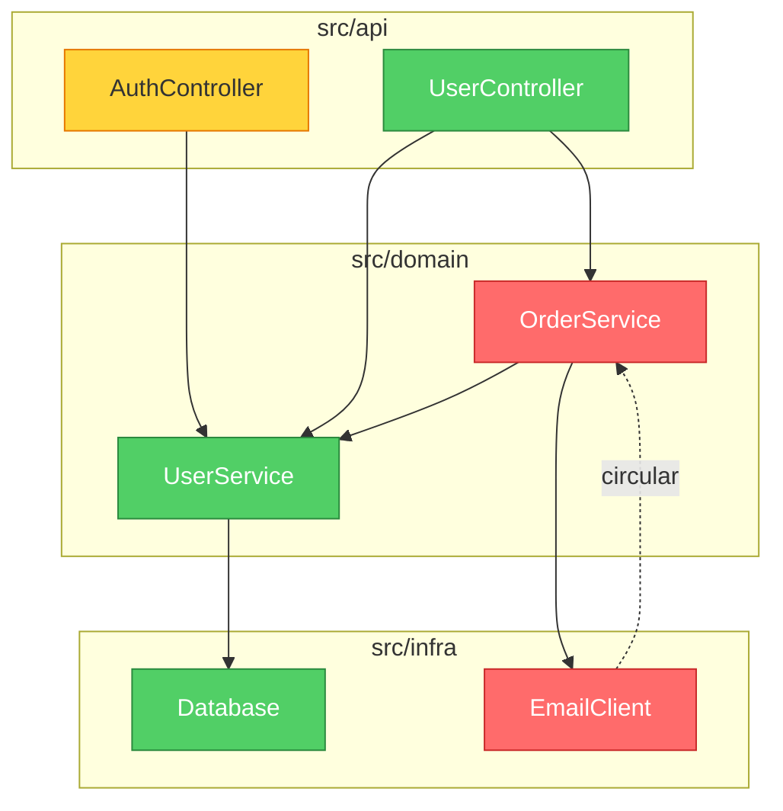

# brooks-lint

  AI code reviews grounded in twelve classic engineering books.
  Consistent. Traceable. Actionable.

  English ·

  

  [→ Visit the website](https://hyhmrright.github.io/brooks-lint/)

> *"The bearing of a child takes nine months, no matter how many women are assigned."*
> — Frederick Brooks, *The Mythical Man-Month* (1975)

**50 years later, Brooks was still right — and so were McConnell, Fowler, Martin, Hunt & Thomas, Evans, Ousterhout, Winters, Meszaros, Osherove, Feathers, and the Google Testing team.**

Most code quality tools count lines and cyclomatic complexity. **brooks-lint** goes deeper — it diagnoses your code against six decay risk dimensions synthesized from twelve classic engineering books, producing structured findings with book citations, severity labels, and concrete remedies every time.

For the full source-to-skill mapping, including exceptions and false-positive guards, see
[`skills/_shared/source-coverage.md`](skills/_shared/source-coverage.md).

## Quick Start

```bash
# Claude Code
/plugin marketplace add hyhmrright/brooks-lint
/plugin install brooks-lint@brooks-lint-marketplace

# Any other Agent Skills platform — Cursor · Codex · Gemini · Copilot · Windsurf · OpenCode · Kiro · …
curl -fsSL https://raw.githubusercontent.com/hyhmrright/brooks-lint/main/scripts/install.sh | bash -s -- 
```

Then just ask ("review this PR", "audit the architecture"), or run one of the six commands —
`/brooks-review`, `/brooks-audit`, `/brooks-debt`, `/brooks-test`, `/brooks-health`, `/brooks-sweep`
([what each one does](#slash-commands)).

Every finding comes back as **Symptom → Source → Consequence → Remedy** with a book citation and a
0–100 Health Score. Full install options (9 more platforms) and CI/CD setup are [below](#installation).

## The Twelve Books

### Book · Author · Contributes to
- **Book**: *The Mythical Man-Month* (1975) · **Author**: Frederick P. Brooks Jr. · **Contributes to**: R2, R4, R5
- **Book**: *Code Complete* (1993, 2nd ed. 2004) · **Author**: Steve McConnell · **Contributes to**: R1, R4
- **Book**: *Refactoring* (1999, 2nd ed. 2018) · **Author**: Martin Fowler · **Contributes to**: R1, R2, R3, R4, R6
- **Book**: *Clean Architecture* (2017) · **Author**: Robert C. Martin · **Contributes to**: R2, R5
- **Book**: *The Pragmatic Programmer* (1999, 20th Anniv. 2019) · **Author**: Andrew Hunt & David Thomas · **Contributes to**: R2, R3, R4, R5, T2, T3
- **Book**: *Domain-Driven Design* (2003) · **Author**: Eric Evans · **Contributes to**: R1, R3, R6
- **Book**: *A Philosophy of Software Design* (2018) · **Author**: John Ousterhout · **Contributes to**: R1, R4
- **Book**: *Software Engineering at Google* (2020) · **Author**: Winters, Manshreck & Wright · **Contributes to**: R2, R5
- **Book**: *The Art of Unit Testing* (2009, 3rd ed. 2023) · **Author**: Roy Osherove · **Contributes to**: T1, T2, T4, T5
- **Book**: *How Google Tests Software* (2012) · **Author**: Whittaker, Arbon & Carollo · **Contributes to**: T5, T6
- **Book**: *Working Effectively with Legacy Code* (2004) · **Author**: Michael Feathers · **Contributes to**: T4, T5, T6
- **Book**: *xUnit Test Patterns* (2007) · **Author**: Gerard Meszaros · **Contributes to**: T1, T2, T3, T4

## The Six Decay Risks

brooks-lint evaluates your code across **six production-code decay risks** and **six test-suite decay risks** synthesized from twelve classic engineering books:

### Decay Risk · Diagnostic Question · Sources
- **Decay Risk**: 🧠 Cognitive Overload · **Diagnostic Question**: How much mental effort to understand this? · **Sources**: Code Complete, Refactoring, DDD, Philosophy of SD
- **Decay Risk**: 🔗 Change Propagation · **Diagnostic Question**: How many unrelated things break on one change? · **Sources**: Refactoring, Clean Architecture, Pragmatic, SE@Google
- **Decay Risk**: 📋 Knowledge Duplication · **Diagnostic Question**: Is the same decision expressed in multiple places? · **Sources**: Pragmatic, Refactoring, DDD
- **Decay Risk**: 🌀 Accidental Complexity · **Diagnostic Question**: Is the code more complex than the problem? · **Sources**: Refactoring, Code Complete, Brooks, Philosophy of SD
- **Decay Risk**: 🏗️ Dependency Disorder · **Diagnostic Question**: Do dependencies flow in a consistent direction? · **Sources**: Clean Architecture, Brooks, Pragmatic, SE@Google
- **Decay Risk**: 🗺️ Domain Model Distortion · **Diagnostic Question**: Does the code faithfully represent the domain? · **Sources**: DDD, Refactoring

> Philosophy of SD = *A Philosophy of Software Design* (Ousterhout) · SE@Google = *Software Engineering at Google* (Winters et al.)

## What It Looks Like

Given this code:

```python
class UserService:
    def update_profile(self, user_id, name, email, avatar_url):
        user = self.db.query(f"SELECT * FROM users WHERE id = {user_id}")
        user['email'] = email
        ...
        if user['email'] != email:   # always False — silent bug
            self.smtp.send(...)
        points = user['login_count'] * 10 + 500
        self.db.execute(f"UPDATE loyalty SET points={points} WHERE user_id={user_id}")
```

brooks-lint produces:

**Health Score: 28/100**

*This method concentrates four unrelated business responsibilities into a single function, contains a logic bug that silently suppresses email change notifications, and is wide open to SQL injection.*

### 🔴 Change Propagation — Single Method Changes for Four Unrelated Business Reasons
**Symptom:** `update_profile` performs profile field updates, email change notifications, loyalty points recalculation, and cache invalidation all in one method body.
**Source:** Fowler — *Refactoring* — Divergent Change; Hunt & Thomas — *The Pragmatic Programmer* — Orthogonality
**Consequence:** Any change to the loyalty formula risks breaking email notifications and vice versa. Every edit carries regression risk across four unrelated domains simultaneously.
**Remedy:** Extract `NotificationService`, `LoyaltyService`, and `UserCacheInvalidator`. `UserService.update_profile` should orchestrate by calling each — it should hold no implementation logic itself.

### 🔴 Domain Model Distortion — Silent Logic Bug: Email Notification Never Fires
**Symptom:** `user['email'] = email` overwrites the old value before `if user['email'] != email` — the condition is always `False`. The notification is dead code.
**Source:** McConnell — *Code Complete* — Ch. 17: Unusual Control Structures
**Consequence:** Users are never notified when their email address changes. Silent data integrity failure — the system appears functional while violating a business rule.
**Remedy:** Capture `old_email = user['email']` before any mutation. Compare against `old_email`, not `user['email']`.

*(+ 6 more findings including SQL injection, dependency disorder, magic numbers)*

### Architecture Audit with Dependency Graph

In Mode 2 (Architecture Audit), brooks-lint generates a **Mermaid dependency graph** at the top of the report. Modules are color-coded by severity: red = Critical findings, yellow = Warning, green = clean.



The graph renders natively in GitHub, Notion, and other Markdown environments — no extra tools needed.

## See More Examples

The [Full Gallery](docs/gallery.md) has real brooks-lint output across Python, TypeScript, Go, and Java — including PR reviews, architecture audits with Mermaid dependency graphs, tech debt assessments, and test quality reviews.

New to the decay risks? The [**Decay Risk Field Guide**](https://hyhmrright.github.io/brooks-lint/guide.html) explains all six — diagnostic question, signature symptoms, source books, and remedy for each.

## Benchmark

Tested across 3 real-world scenarios (PR review, architecture audit, tech debt assessment):

### Criterion · brooks-lint · Claude alone
- **Criterion**: Structured findings (Symptom → Source → Consequence → Remedy) · **brooks-lint**: ✅ 100% · **Claude alone**: ❌ 0%
- **Criterion**: Book citations per finding · **brooks-lint**: ✅ 100% · **Claude alone**: ❌ 0%
- **Criterion**: Severity labels (🔴/🟡/🟢) · **brooks-lint**: ✅ 100% · **Claude alone**: ❌ 0%
- **Criterion**: Health Score (0–100) · **brooks-lint**: ✅ 100% · **Claude alone**: ❌ 0%
- **Criterion**: Detects Change Propagation · **brooks-lint**: ✅ 100% · **Claude alone**: ✅ 100%
- **Criterion**: **Overall pass rate** · **brooks-lint**: **94%** · **Claude alone**: **16%**

The gap isn't what Claude *can* find — it's what it *consistently* finds, with traceable evidence and actionable remedies every time.

### Reproducible benchmarks

The table above is illustrative. These numbers are **deterministic and you can reproduce them locally**:

**Parser fidelity** — SARIF export and the CI gates depend on parsing the model's Markdown report correctly. Against a **frozen corpus of 30 real, model-generated reports** spanning all six modes (`evals/benchmark-corpus.json`), each paired with an **independently graded** finding inventory (a separate model pass, spot-checked by hand), the shipped parser scores — run `npm run benchmark`:

### Metric (n = 30, frozen corpus) · Result
- **Metric (n = 30, frozen corpus)**: Exact severity-count match (parser vs. graded truth) · **Result**: 30 / 30
- **Metric (n = 30, frozen corpus)**: Risk-code precision / recall · **Result**: 100% / 100% (56 finding-level codes, 0 FP / 0 FN)
- **Metric (n = 30, frozen corpus)**: Valid SARIF 2.1.0 emitted · **Result**: 30 / 30

Because the parser is deterministic and the corpus is frozen, `npm run benchmark` gives everyone the same result, and `npm test` guards it as a regression. The corpus deliberately includes 9 false-positive / tradeoff reports (e.g. a ports-and-adapters design that *looks* like a dependency cycle) that must stay clean.

**Scoring determinism** — for a fixed finding set (2 Critical / 3 Warning / 1 Suggestion), the strictness presets produce exactly the scores their `common.md` table predicts: strict **34**, balanced **54**, legacy-friendly **74** — and only `legacy-friendly` leads with the top-three fixes.

**Model quality** — whether the model finds the *right* risks on real code is measured by the **57-scenario eval suite** (`evals/evals.json`): `npm run evals` (structural) and `npm run evals:live` (live, needs `ANTHROPIC_API_KEY`).

> Scope & honesty: the parser numbers are deterministic and exactly reproducible. The strictness and eval-suite figures are single-run live measurements against the model and vary slightly run to run. The parser benchmark measures report-parsing fidelity (does the tooling read every finding the report states?), not whether a given finding is "correct." The severity-count match is the fully independent signal; risk-code agreement also reflects the shared canonical name→code legend.

## How It Compares

###  · brooks-lint · ESLint / Pylint · GitHub Copilot Review · Plain Claude
- Detects syntax & style issues · **brooks-lint**: — · **ESLint / Pylint**: ✅ · **GitHub Copilot Review**: ✅ · **Plain Claude**: ~
- Structured diagnosis chain · **brooks-lint**: ✅ · **ESLint / Pylint**: ❌ · **GitHub Copilot Review**: ❌ · **Plain Claude**: ❌
- Traces findings to classic books · **brooks-lint**: ✅ · **ESLint / Pylint**: ❌ · **GitHub Copilot Review**: ❌ · **Plain Claude**: ❌
- Consistent severity labels · **brooks-lint**: ✅ · **ESLint / Pylint**: ✅ · **GitHub Copilot Review**: ~ · **Plain Claude**: ❌
- Architecture-level insights · **brooks-lint**: ✅ · **ESLint / Pylint**: ❌ · **GitHub Copilot Review**: ~ · **Plain Claude**: ~
- Domain model analysis · **brooks-lint**: ✅ · **ESLint / Pylint**: ❌ · **GitHub Copilot Review**: ❌ · **Plain Claude**: ~
- Zero config, no plugins to install · **brooks-lint**: ✅ · **ESLint / Pylint**: ❌ · **GitHub Copilot Review**: ✅ · **Plain Claude**: ✅
- Works with any language · **brooks-lint**: ✅ · **ESLint / Pylint**: ❌ · **GitHub Copilot Review**: ✅ · **Plain Claude**: ✅

> `~` = occasionally / inconsistently

**brooks-lint doesn't replace your linter.** It catches what linters can't: architectural drift, knowledge silos, and domain model distortion — the problems that slow teams down for months before anyone notices.

## Installation

### Claude Code (recommended)

```bash
/plugin marketplace add hyhmrright/brooks-lint
/plugin install brooks-lint@brooks-lint-marketplace
```

Short-form commands (`/brooks-review`) are auto-installed on first session start — or run
`bash hooks/session-start` yourself. To skip the marketplace:
`mkdir -p ~/.claude/skills/brooks-lint && cp -r skills/* ~/.claude/skills/brooks-lint/`.

### Gemini CLI · Codex CLI

```bash
/extensions install https://github.com/hyhmrright/brooks-lint   # Gemini CLI
```
```
Install the brooks-lint skill from hyhmrright/brooks-lint       # ask inside a Codex session
```

Or use the installer below: `./scripts/install.sh gemini` / `./scripts/install.sh codex`.

### Every other platform — OpenCode · Cursor · Windsurf · Antigravity · pi · Copilot · Kiro · Factory Droid · DeepSeek Harness

brooks-lint ships as standard [Agent Skills](https://agentskills.io). **Any agent that loads Agent
Skills runs all six modes with no conversion** — one command installs them:

```bash
# pick your platform; --project installs into the current repo instead of your global config
curl -fsSL https://raw.githubusercontent.com/hyhmrright/brooks-lint/main/scripts/install.sh | bash -s -- 
#    = opencode · cursor · windsurf · antigravity · pi · kiro · copilot · droid · dsh · gemini · codex · agents
```

The installer copies the skills **flat** into the right folder, so the shared framework
(`../_shared/`) always resolves — you can't get the layout wrong. Then just ask ("review this PR",
"audit the architecture") and the matching skill auto-triggers from its `description`.

### Platform · Installs into · Also reads · Guide
- **Platform**: OpenCode · **Installs into**: `~/.config/opencode/skills` · **Also reads**: `~/.claude/skills`, `AGENTS.md` · **Guide**: [setup](docs/opencode-setup.md)
- **Platform**: Cursor (2.4+) · **Installs into**: `~/.cursor/skills` · **Also reads**: `.agents/skills`, `AGENTS.md` · **Guide**: [setup](docs/cursor-setup.md)
- **Platform**: Windsurf (Cascade) · **Installs into**: `~/.codeium/windsurf/skills` · **Also reads**: `AGENTS.md` · **Guide**: [setup](docs/windsurf-setup.md)
- **Platform**: Antigravity (Google) · **Installs into**: `.agent/skills` (`--project`) · **Also reads**: `AGENTS.md`, `GEMINI.md` · **Guide**: [setup](docs/antigravity-setup.md)
- **Platform**: pi (earendil-works) · **Installs into**: `~/.pi/agent/skills` · **Also reads**: — · **Guide**: [setup](docs/pi-setup.md)
- **Platform**: GitHub Copilot · **Installs into**: `.github/skills` (`--project`) · **Also reads**: `.claude/skills`, `AGENTS.md` · **Guide**: [setup](docs/copilot-setup.md)
- **Platform**: Kiro (AWS) · **Installs into**: `~/.kiro/skills` · **Also reads**: `AGENTS.md` · **Guide**: [setup](docs/kiro-setup.md)
- **Platform**: Factory Droid · **Installs into**: `~/.factory/skills` · **Also reads**: `AGENTS.md` · **Guide**: [setup](docs/factory-droid-setup.md)
- **Platform**: DeepSeek Harness (`dsh`) · **Installs into**: `~/.dsh/skills` · **Also reads**: `~/.agents/skills`, `AGENTS.md` · **Guide**: [setup](docs/dsh-setup.md)

Kiro, Factory Droid, and DeepSeek Harness also auto-register `/brooks-review`. New to skills, or
using an agent not listed? See **[docs/getting-started.md](docs/getting-started.md)**.

> **🧪 Verification status.** Claude Code, Gemini CLI, and Codex CLI are maintainer-verified. The
> nine platforms above are documented from each tool's official skill spec and verified at the
> file-layout level (the installer is tested), but not yet run end-to-end by the maintainer on every
> platform. Tried one — working **or** broken?
> [Open an issue](https://github.com/hyhmrright/brooks-lint/issues/new) with the platform, version,
> and what you saw. Another Agent-Skills agent? It almost certainly works the same way — tell us and
> we'll add it.

## Slash Commands

### Command · What it does
- **Command**: `/brooks-review` · **What it does**: Paste a diff or point the AI at changed files. Diagnoses each of the six decay risks in Symptom → Source → Consequence → Remedy format.
- **Command**: `/brooks-audit` · **What it does**: Maps module dependencies (with a Mermaid graph), identifies circular dependencies, and checks Conway's Law alignment.
- **Command**: `/brooks-debt` · **What it does**: Classifies debt across the six decay risks, scores each finding by Pain × Spread, and produces a repayment roadmap with Critical / Scheduled / Monitored tiers.
- **Command**: `/brooks-test` · **What it does**: Audits the suite against six test-space decay risks — Test Obscurity, Test Brittleness, Test Duplication, Mock Abuse, Coverage Illusion, Architecture Mismatch.
- **Command**: `/brooks-health` · **What it does**: Abbreviated scans across all four quality dimensions → one weighted composite Health Score. Use it before a release or when onboarding a team.
- **Command**: `/brooks-sweep` · **What it does**: Unified scan across R1–R6, T1–T6