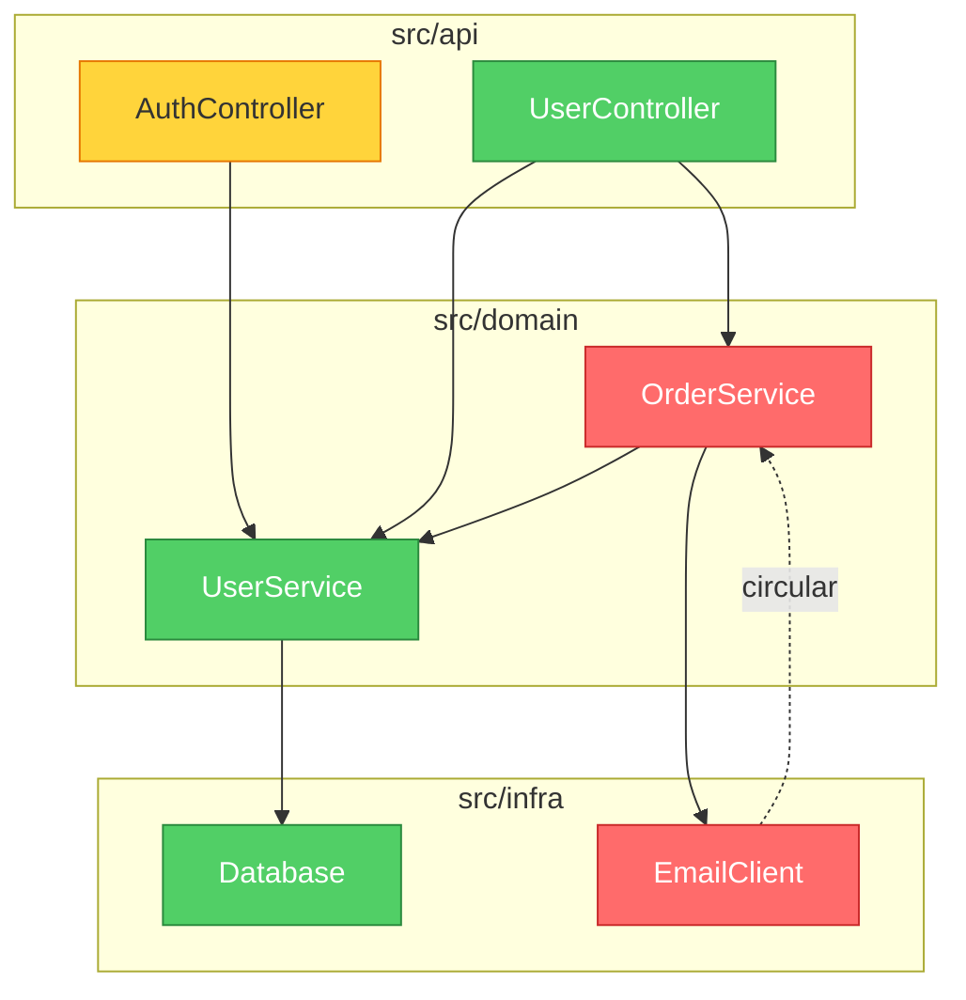

# brooks-lint

  植根于十二本经典工程著作的 AI 代码审查。
  一致、可溯源、可落地。

  简体中文 ·

  

  [→ 访问官网](https://hyhmrright.github.io/brooks-lint/)

> *"一个孩子要十月怀胎，无论派多少人去都一样。"*
> —— Frederick Brooks，《人月神话》（1975）

**五十年过去，Brooks 依然正确——McConnell、Fowler、Martin、Hunt & Thomas、Evans、Ousterhout、Winters、Meszaros、Osherove、Feathers 以及 Google 测试团队同样如此。**

大多数代码质量工具只数行数和圈复杂度。**brooks-lint** 更进一步——它对照六个衰退风险维度（综合自十二本经典工程著作）诊断你的代码，每一次都产出带书目出处、严重度标签和具体对策的结构化诊断。

完整的"书目—技能"映射（含例外与误报防护），见
[`skills/_shared/source-coverage.md`](skills/_shared/source-coverage.md)。

## 快速上手

```bash
# Claude Code
/plugin marketplace add hyhmrright/brooks-lint
/plugin install brooks-lint@brooks-lint-marketplace

# 其他任意 Agent Skills 平台 —— Cursor · Codex · Gemini · Copilot · Windsurf · OpenCode · Kiro · …
curl -fsSL https://raw.githubusercontent.com/hyhmrright/brooks-lint/main/scripts/install.sh | bash -s -- <平台>
```

装好后直接开口（"审查这个 PR""审计架构"），或运行六个命令之一——`/brooks-review`、`/brooks-audit`、
`/brooks-debt`、`/brooks-test`、`/brooks-health`、`/brooks-sweep`（[各自的作用](#斜杠命令)）。

每条诊断都以 **症状 → 根源 → 后果 → 对策** 返回，附书目出处和 0–100 健康分。完整安装方式（另外 9 个
平台）和 CI/CD 配置见[下文](#安装)。

## 十二本书

### 书名 · 作者 · 贡献于
- **书名**: *The Mythical Man-Month*（人月神话，1975） · **作者**: Frederick P. Brooks Jr. · **贡献于**: R2、R4、R5
- **书名**: *Code Complete*（代码大全，1993，第 2 版 2004） · **作者**: Steve McConnell · **贡献于**: R1、R4
- **书名**: *Refactoring*（重构，1999，第 2 版 2018） · **作者**: Martin Fowler · **贡献于**: R1、R2、R3、R4、R6
- **书名**: *Clean Architecture*（架构整洁之道，2017） · **作者**: Robert C. Martin · **贡献于**: R2、R5
- **书名**: *The Pragmatic Programmer*（程序员修炼之道，1999，20 周年版 2019） · **作者**: Andrew Hunt & David Thomas · **贡献于**: R2、R3、R4、R5、T2、T3
- **书名**: *Domain-Driven Design*（领域驱动设计，2003） · **作者**: Eric Evans · **贡献于**: R1、R3、R6
- **书名**: *A Philosophy of Software Design*（软件设计的哲学，2018） · **作者**: John Ousterhout · **贡献于**: R1、R4
- **书名**: *Software Engineering at Google*（Google 软件工程，2020） · **作者**: Winters, Manshreck & Wright · **贡献于**: R2、R5
- **书名**: *The Art of Unit Testing*（单元测试的艺术，2009，第 3 版 2023） · **作者**: Roy Osherove · **贡献于**: T1、T2、T4、T5
- **书名**: *How Google Tests Software*（Google 测试之道，2012） · **作者**: Whittaker, Arbon & Carollo · **贡献于**: T5、T6
- **书名**: *Working Effectively with Legacy Code*（修改代码的艺术，2004） · **作者**: Michael Feathers · **贡献于**: T4、T5、T6
- **书名**: *xUnit Test Patterns*（xUnit 测试模式，2007） · **作者**: Gerard Meszaros · **贡献于**: T1、T2、T3、T4

## 六类衰退风险

brooks-lint 从**六类生产代码衰退风险**和**六类测试代码衰退风险**两个角度评估你的代码，这些维度综合自十二本经典工程著作：

### 衰退风险 · 诊断问题 · 出处
- **衰退风险**: 🧠 认知过载 · **诊断问题**: 理解这段代码要花多少脑力？ · **出处**: Code Complete、Refactoring、DDD、Philosophy of SD
- **衰退风险**: 🔗 变更扩散 · **诊断问题**: 改一处会牵连多少不相干的东西？ · **出处**: Refactoring、Clean Architecture、Pragmatic、SE@Google
- **衰退风险**: 📋 知识重复 · **诊断问题**: 同一个决策是否在多处被表达？ · **出处**: Pragmatic、Refactoring、DDD
- **衰退风险**: 🌀 偶发复杂度 · **诊断问题**: 代码是否比问题本身更复杂？ · **出处**: Refactoring、Code Complete、Brooks、Philosophy of SD
- **衰退风险**: 🏗️ 依赖失序 · **诊断问题**: 依赖是否朝一致的方向流动？ · **出处**: Clean Architecture、Brooks、Pragmatic、SE@Google
- **衰退风险**: 🗺️ 领域模型失真 · **诊断问题**: 代码是否忠实地表达了业务领域？ · **出处**: DDD、Refactoring

> Philosophy of SD = *A Philosophy of Software Design*（Ousterhout） · SE@Google = *Software Engineering at Google*（Winters 等）

## 实际效果

给定这段代码：

```python
class UserService:
    def update_profile(self, user_id, name, email, avatar_url):
        user = self.db.query(f"SELECT * FROM users WHERE id = {user_id}")
        user['email'] = email
        ...
        if user['email'] != email:   # 永远为 False —— 隐性 bug
            self.smtp.send(...)
        points = user['login_count'] * 10 + 500
        self.db.execute(f"UPDATE loyalty SET points={points} WHERE user_id={user_id}")
```

brooks-lint 产出：

**健康分：28/100**

*这个方法把四个不相干的业务职责塞进同一个函数，含有一个会静默吞掉"邮箱变更通知"的逻辑 bug，并且对 SQL 注入门户大开。*

### 🔴 变更扩散 —— 单个方法因四个不相干的业务原因而改动
**症状：** `update_profile` 在同一个方法体里完成资料字段更新、邮箱变更通知、积分重算和缓存失效。
**根源：** Fowler — *Refactoring* — 发散式变更（Divergent Change）；Hunt & Thomas — *The Pragmatic Programmer* — 正交性（Orthogonality）
**后果：** 任何对积分公式的改动都可能破坏邮件通知，反之亦然。每次修改都同时背负着四个不相干领域的回归风险。
**对策：** 抽出 `NotificationService`、`LoyaltyService` 和 `UserCacheInvalidator`。`UserService.update_profile` 应只做编排、逐一调用它们——本身不持有任何实现逻辑。

### 🔴 领域模型失真 —— 隐性逻辑 bug：邮箱通知永不触发
**症状：** `user['email'] = email` 在 `if user['email'] != email` 之前就覆盖了旧值——条件恒为 `False`，通知是死代码。
**根源：** McConnell — *Code Complete* — 第 17 章：非常规控制结构
**后果：** 用户改邮箱时永远收不到通知。这是静默的数据完整性失效——系统看似正常运转，实则违反了业务规则。
**对策：** 在任何修改之前先捕获 `old_email = user['email']`，拿它（而非 `user['email']`）做比较。

*（另有 6 条诊断，含 SQL 注入、依赖失序、魔法数字）*

### 带依赖图的架构审查

在模式 2（架构审查）中，brooks-lint 会在报告顶部生成一张 **Mermaid 依赖图**。模块按严重度着色：红=Critical，黄=Warning，绿=干净。



该图在 GitHub、Notion 等 Markdown 环境中原生渲染——无需额外工具。

## 更多示例

[完整画廊](docs/gallery.md) 收录了 brooks-lint 在 Python、TypeScript、Go、Java 上的真实输出——涵盖 PR 审查、带 Mermaid 依赖图的架构审查、技术债评估和测试质量审查。

初次接触这些衰退风险？[**衰退风险实战指南**](https://hyhmrright.github.io/brooks-lint/guide.html) 逐一讲解全部六类——每类的诊断问题、代表症状、出处书目与对策。

## 基准测试

在 3 个真实场景（PR 审查、架构审查、技术债评估）上测试：

### 评估项 · brooks-lint · 仅用 Claude
- **评估项**: 结构化诊断（症状 → 根源 → 后果 → 对策） · **brooks-lint**: ✅ 100% · **仅用 Claude**: ❌ 0%
- **评估项**: 每条诊断带书目出处 · **brooks-lint**: ✅ 100% · **仅用 Claude**: ❌ 0%
- **评估项**: 严重度标签（🔴/🟡/🟢） · **brooks-lint**: ✅ 100% · **仅用 Claude**: ❌ 0%
- **评估项**: 健康分（0–100） · **brooks-lint**: ✅ 100% · **仅用 Claude**: ❌ 0%
- **评估项**: 识别"变更扩散" · **brooks-lint**: ✅ 100% · **仅用 Claude**: ✅ 100%
- **评估项**: **整体通过率** · **brooks-lint**: **94%** · **仅用 Claude**: **16%**

差距不在于 Claude *能不能*发现问题——而在于它能否*每一次都稳定地*发现，并附上可溯源的证据和可落地的对策。

### 可复现基准

上表是示意性的。下面这些数字**确定、可在本地复算**：

**parser 保真度** —— SARIF 输出与 CI 闸门都依赖于正确解析模型的 Markdown 报告。在一个**冻结的 30 份真实模型报告语料**上（覆盖全部六种 mode，`evals/benchmark-corpus.json`），每份都配有**独立评分**的发现清单（由另一遍模型评分、并经人工抽查），实际发布的 parser 跑分如下——执行 `npm run benchmark`：

### 指标（n = 30，冻结语料） · 结果
- **指标（n = 30，冻结语料）**: 严重度计数精确吻合（parser vs 人工标注真值） · **结果**: 30 / 30
- **指标（n = 30，冻结语料）**: 风险码 precision / recall · **结果**: 100% / 100%（56 个 finding-level 码，0 假阳 / 0 假阴）
- **指标（n = 30，冻结语料）**: 产出合法 SARIF 2.1.0 · **结果**: 30 / 30

由于 parser 是确定性的、语料是冻结的，`npm run benchmark` 对任何人都给出相同结果，`npm test` 也将其作为回归守卫。该语料**有意**包含 9 份假阳性 / tradeoff 报告（例如一个*看起来像*循环依赖、实则是端口与适配器的设计），它们必须保持干净。

**打分确定性** —— 给定一组固定发现（2 Critical / 3 Warning / 1 Suggestion），三个 strictness 预设产出的分数与其 `common.md` 表的预测分毫不差：strict **34**、balanced **54**、legacy-friendly **74**——且只有 `legacy-friendly` 会优先列出前三高杠杆修复。

**模型质量** —— 模型能否在真实代码上找到*正确的*风险，由 **57 场景 eval 套件**（`evals/evals.json`）衡量：`npm run evals`（结构校验）与 `npm run evals:live`（实测，需 `ANTHROPIC_API_KEY`）。

> 范围与诚实说明：parser 数字是确定性的、可精确复算；strictness 与 eval 套件的数字是对模型的单次实测，会有轻微跑动差异。parser 基准衡量的是报告解析保真度（工具是否读出了报告里写的每条发现），而非某条发现"是否正确"。严重度计数吻合是完全独立的信号；风险码一致性还反映了 parser 与 grader 共用同一套权威 name→code 映射。

## 横向对比

###  · brooks-lint · ESLint / Pylint · GitHub Copilot Review · 原生 Claude
- 检测语法与风格问题 · **brooks-lint**: — · **ESLint / Pylint**: ✅ · **GitHub Copilot Review**: ✅ · **原生 Claude**: ~
- 结构化诊断链 · **brooks-lint**: ✅ · **ESLint / Pylint**: ❌ · **GitHub Copilot Review**: ❌ · **原生 Claude**: ❌
- 将诊断溯源到经典著作 · **brooks-lint**: ✅ · **ESLint / Pylint**: ❌ · **GitHub Copilot Review**: ❌ · **原生 Claude**: ❌
- 一致的严重度标签 · **brooks-lint**: ✅ · **ESLint / Pylint**: ✅ · **GitHub Copilot Review**: ~ · **原生 Claude**: ❌
- 架构层面的洞察 · **brooks-lint**: ✅ · **ESLint / Pylint**: ❌ · **GitHub Copilot Review**: ~ · **原生 Claude**: ~
- 领域模型分析 · **brooks-lint**: ✅ · **ESLint / Pylint**: ❌ · **GitHub Copilot Review**: ❌ · **原生 Claude**: ~
- 零配置、无需安装插件 · **brooks-lint**: ✅ · **ESLint / Pylint**: ❌ · **GitHub Copilot Review**: ✅ · **原生 Claude**: ✅
- 适用于任何语言 · **brooks-lint**: ✅ · **ESLint / Pylint**: ❌ · **GitHub Copilot Review**: ✅ · **原生 Claude**: ✅

> `~` = 偶尔 / 不稳定

**brooks-lint 不是要取代你的 linter。** 它捕捉的是 linter 抓不到的东西：架构漂移、知识孤岛、领域模型失真——这些问题往往在无人察觉的几个月里持续拖慢团队。

## 安装

### Claude Code（推荐）

```bash
/plugin marketplace add hyhmrright/brooks-lint
/plugin install brooks-lint@brooks-lint-marketplace
```

短命令（`/brooks-review`）会在首次会话启动时自动安装——也可以自己跑 `bash hooks/session-start`。
不想走市场：`mkdir -p ~/.claude/skills/brooks-lint && cp -r skills/* ~/.claude/skills/brooks-lint/`。

### Gemini CLI · Codex CLI

```bash
/extensions install https://github.com/hyhmrright/brooks-lint   # Gemini CLI
```
```
Install the brooks-lint skill from hyhmrright/brooks-lint       # 在 Codex 会话中直接说
```

或使用下面的安装器：`./scripts/install.sh gemini` / `./scripts/install.sh codex`。

### 其它所有平台——OpenCode · Cursor · Windsurf · Antigravity · pi · Copilot · Kiro · Factory Droid · DeepSeek Harness

brooks-lint 以标准 [Agent Skills](https://agentskills.io) 形式分发。**任何加载 Agent Skills 的 agent
都能无需任何转换运行全部六种模式**——一条命令即可安装：

```bash
# 选择你的平台；加 --project 装进当前仓库而非全局配置
curl -fsSL https://raw.githubusercontent.com/hyhmrright/brooks-lint/main/scripts/install.sh | bash -s -- <平台>
#   <平台> = opencode · cursor · windsurf · antigravity · pi · kiro · copilot · droid · dsh · gemini · codex · agents
```

安装器会把技能**扁平**拷进该平台对应的文件夹，让共享框架（`../_shared/`）始终正确解析——你不可能装错布局。
装好后直接提问（"审查这个 PR"、"审查架构"），对应技能就会依据 `description` 自动触发。

### 平台 · 安装到 · 同时读取 · 指南
- **平台**: OpenCode · **安装到**: `~/.config/opencode/skills` · **同时读取**: `~/.claude/skills`、`AGENTS.md` · **指南**: [配置](docs/opencode-setup.md)
- **平台**: Cursor（2.4+） · **安装到**: `~/.cursor/skills` · **同时读取**: `.agents/skills`、`AGENTS.md` · **指南**: [配置](docs/cursor-setup.md)
- **平台**: Windsurf（Cascade） · **安装到**: `~/.codeium/windsurf/skills` · **同时读取**: `AGENTS.md` · **指南**: [配置](docs/windsurf-setup.md)
- **平台**: Antigravity（Google） · **安装到**: `.agent/skills`（`--project`） · **同时读取**: `AGENTS.md`、`GEMINI.md` · **指南**: [配置](docs/antigravity-setup.md)
- **平台**: pi（earendil-works） · **安装到**: `~/.pi/agent/skills` · **同时读取**: — · **指南**: [配置](docs/pi-setup.md)
- **平台**: GitHub Copilot · **安装到**: `.github/skills`（`--project`） · **同时读取**: `.claude/skills`、`AGENTS.md` · **指南**: [配置](docs/copilot-setup.md)
- **平台**: Kiro（AWS） · **安装到**: `~/.kiro/skills` · **同时读取**: `AGENTS.md` · **指南**: [配置](docs/kiro-setup.md)
- **平台**: Factory Droid · **安装到**: `~/.factory/skills` · **同时读取**: `AGENTS.md` · **指南**: [配置](docs/factory-droid-setup.md)
- **平台**: DeepSeek Harness（`dsh`） · **安装到**: `~/.dsh/skills` · **同时读取**: `~/.agents/skills`、`AGENTS.md` · **指南**: [配置](docs/dsh-setup.md)

Kiro、Factory Droid 与 DeepSeek Harness 还会自动注册 `/brooks-review`。不熟悉 skills、或用的是上面
没列出的 agent？见 **[docs/getting-started.md](docs/getting-started.md)**。

> **🧪 验证状态。** Claude Code、Gemini CLI、Codex CLI 已由维护者验证。上面九个平台依据各工具官方技能规范编写，
> 并已在文件布局层面验证（安装器经过测试），但维护者尚未在每个平台端到端实跑。在某平台试过了——无论成功**还是**失败？
> 请[提一个 issue](https://github.com/hyhmrright/brooks-lint/issues/new)，附上平台、版本和你看到的结果。
> 用的是其它兼容 Agent Skills 的 agent？它几乎肯定以同样方式工作——告诉我们，我们会补上。

## 斜杠命令

### 命令 · 作用
- **命令**: `/brooks-review` · **作用**: 粘贴一段 diff，或让 AI 指向改动的文件。以 症状 → 根源 → 后果 → 对策 的格式逐一诊断六类衰退风险。
- **命令**: `/brooks-audit` · **作用**: 梳理模块依赖（附 Mermaid 依赖图）、识别循环依赖，并检查是否符合康威定律。
- **命令**: `/brooks-debt` · **作用**: 按六类衰退风险对技术债分类，以 痛感 × 扩散面 打优先级，产出带 Critical / Scheduled / Monitored 分级的偿还路线图。
- **命令**: `/brooks-test` · **作用**: 对照六类测试空间衰退风险审查测试套件——测试晦涩、测试脆弱、测试重复、Mock 滥用、覆盖率幻觉、架构错配。
- **命令**: `/brooks-health` · **作用**: 对全部四个质量维度做精简扫描，产出一个加权综合健康分。适合发版前或新团队上手时使用。
- **命令**: `/brooks-sweep` · **作用**: 一次性扫描 R1–R6、T1–T6 与架构，然后施加修复：安全改动自动应用，跨文件改动需确认，架构决策标记为人工处理项。输出修复日志与健康分变化。

**各平台语法。** Claude Code 也接受带命名空间的完整形式 `/brooks-lint:brooks-review`——短命令由
session-start 钩子在首次会话启动时自动安装。Codex CLI 用 `$brooks-review`。Gemini CLI 直接用上表。
OpenCode、Cursor、Antigravity、pi、DeepSeek Harness 依据每个技能的 `description` 自动调用 Agent
Skills，直接提问即可（"审查这个 PR"、"我们最糟的技术债在哪"）；需要显式调用时用各平台自己的语法
（pi 把每个技能注册为 `/skill:brooks-review`；dsh 直接用上表，可从 `/` 菜单选或手打）。在所有平台上，
当你讨论代码质量、架构或测试健康时，这些技能也会自动触发。

> PR 审查会自动包含一个轻量的第 7 步快速测试检查（对纯文档 diff 会跳过）。需要完整的测试审查请用
> `/brooks-test`；需要某个维度的深度诊断时，请用该维度的专项技能，而不是 `/brooks-health`。

## 配置

在项目根目录放一个 `.brooks-lint.yaml` 来定制审查行为：

```yaml
version: 1

strictness: balanced   # strict | balanced（默认）| legacy-friendly——对遗留代码更宽松的打分

disable:
  - T5   # 跳过覆盖率指标检查——我们不强制覆盖率

severity:
  R1: suggestion   # 在该领域下调"认知过载"诊断的严重度

ignore:
  - "**/*.generated.*"
  - "**/vendor/**"

# custom_risks:   # 定义项目专属 Cx 风险码——见 skills/_shared/custom-risks-guide.md
# suppress:       # 按风险码 + 路径下调特定诊断（如已接受的遗留债务）
```

可复制 [`.brooks-lint.example.yaml`](.brooks-lint.example.yaml) 作为起点。
所有设置均为可选——完全省略该文件即使用默认行为。

### 设置 · 说明
- **设置**: `strictness` · **说明**: 打分预设：`strict`、`balanced`（默认）或 `legacy-friendly`（更轻的扣分，并优先列出高杠杆修复项）
- **设置**: `disable` · **说明**: 要跳过的风险码（`R1`–`R6`、`T1`–`T6`）
- **设置**: `severity` · **说明**: 覆盖严重度等级（`critical` / `warning` / `suggestion`）
- **设置**: `ignore` · **说明**: 要排除的文件 glob 模式
- **设置**: `focus` · **说明**: 只评估这些风险码（不能与 `disable` 同时使用）
- **设置**: `custom_risks` · **说明**: 定义项目专属风险码（`C1`、`C2`……）——见 [`custom-risks-guide.md`](skills/_shared/custom-risks-guide.md)
- **设置**: `suppress` · **说明**: 按风险码 + 路径下调特定诊断的严重度（可带 `expires:` 过期日期）

## 为什么是这些书，为什么是现在？

> *"软件的复杂性是本质属性，而非偶然属性。"*
> —— Frederick Brooks

AI 能帮你更快地写代码，却无法告诉你正在建造的是大教堂还是焦油坑——而生成越廉价，这些作者识别出的
衰退风险就越尖锐。接入 AI 助手并不能修复认知过载或领域模型失真；生成更多代码会加剧变更扩散和知识重复；
跑得更快让偶发复杂度和依赖失序更加危险。

## 项目结构

每个技能都是一个 `SKILL.md`（触发条件 + 流程骨架）加上它自己的指南：

```
brooks-lint/
├── .claude-plugin/ · .codex-plugin/  # 各平台插件元数据
├── skills/
│   ├── _shared/          # common.md（铁律、配置、报告模板、健康分）
│   │                     # source-coverage.md · decay-risks.md（R1–R6）
│   │                     # test-decay-risks.md（T1–T6）· remedy-guide.md · custom-risks-guide.md
│   ├── brooks-review/    # 模式 1：PR 审查      → pr-review-guide.md
│   ├── brooks-audit/     # 模式 2：架构审查     → architecture-guide.md、onboarding-guide.md
│   ├── brooks-debt/      # 模式 3：技术债       → debt-guide.md
│   ├── brooks-test/      # 模式 4：测试质量     → test-guide.md
│   ├── brooks-health/    # 模式 5：健康仪表盘   → health-guide.md
│   └── brooks-sweep/     # 模式 6：全面扫描     → sweep-guide.md
├── hooks/                # SessionStart 钩子
├── commands/             # 短命令包装（由钩子自动安装）
├── evals/                # 57 场景评测套件 + 冻结的 parser 保真度语料
└── assets/               # logo、banner、demo
```

## CI/CD 集成

用 GitHub Action 在每个 PR 上自动运行 brooks-lint：

```yaml
# .github/workflows/brooks-lint.yml
name: Brooks-Lint PR Review
on:
  pull_request:
    types: [opened, synchronize, reopened]

jobs:
  brooks-lint:
    runs-on: ubuntu-latest
    permissions:
      pull-requests: write
    steps:
      - uses: actions/checkout@v4
        with:
          fetch-depth: 0
      - uses: hyhmrright/brooks-lint/.github/actions/brooks-lint@v1.4.3
        with:
          mode: review
          anthropic-api-key: ${{ secrets.ANTHROPIC_API_KEY }}
          fail-below: 70
```

完整模板见 [`docs/github-action-example.yml`](docs/github-action-example.yml)。

该 Action 会把审查结果作为 PR 评论发布，并可在健康分跌破阈值时让检查失败。若仓库中提交了 `.brooks-lint-history.json`，评论还会包含趋势变化（如 "85 → 82（−3），近 3 次运行"）。

**质量闸门与 Code Scanning。** 除 `fail-below` 外，该 Action 还提供：

```yaml
        with:
          mode: review
          anthropic-api-key: ${{ secrets.ANTHROPIC_API_KEY }}
          fail-on: critical            # 出现任何 Critical 即失败（none | warning | critical）
          fail-on-regression: true     # 健康分较上次运行下降则失败
          sarif-file: brooks-lint.sarif  # 同时把诊断上传到 GitHub Code Scanning
```

`fail-on-regression` 读取 `.brooks-lint-history.json`，因此提交该文件即可强制"无新增回归"。设置 `sarif-file` 会让诊断直接显示在 PR 的 **Files changed** 标签页，并需要 job 具备 `security-events: write` 权限。

**成本：** 每次 PR 运行约 $0.05–0.15，取决于 diff 大小和模型。建议仅在 `pull_request` 事件上运行。

## 路线图

**当前状态（v1.4）：** 12 本书地基，6 类生产衰退风险（R1–R6）+ 6 类测试衰退风险（T1–T6），6 个技能，
CI 质量闸门、面向 GitHub Code Scanning 的 SARIF 输出、严格度预设，以及一个可复现的 parser 保真度基准。

里程碑 v0.2 → v1.4

- **v0.2–v0.4**：插件基础设施、六本书框架、衰退风险维度、基准套件
- **v0.5–v0.7**：测试质量审查、Mermaid 依赖图、`.brooks-lint.yaml`、扩展到 10 本书
- **v0.8–v0.9**：独立技能架构；步骤校验、自动 diff 范围、`/brooks-health`、趋势追踪、分诊模式、`--fix` 对策、GitHub Action
- **v1.0–v1.2**：评测自动化、自定义 `Cx` 风险码、全量扫描技能、`npm run bump` 版本传播
- **v1.3**：Codex 市场元数据、多平台一键安装脚本、多语言 README + 落地页
- **v1.4**：SARIF 输出、CI severity + 回归闸门、严格度预设、57 场景 eval 套件、`npm run benchmark`

## 贡献

见 [CONTRIBUTING.md](CONTRIBUTING.md)。现在最有价值的贡献是新的评测用例和更好的衰退风险症状模式。
在你自己的 PR 上跑一遍 `/brooks-review`——我们用正在打造的工具来审查贡献。

## 许可证

MIT License——详见 [LICENSE](LICENSE)。

## 致谢

本项目站在十二位巨人的肩膀上——完整书单与版本见上面的[十二本书](#十二本书)。本工具中编码的衰退风险，
是我们对他们思想的综合，并应用于现代代码质量评估。

## Star 历史

[](https://star-history.com/#hyhmrright/brooks-lint&Date)

  ⭐ 如果这个工具让你以不同的眼光看待自己的代码库，请给它点个 star！