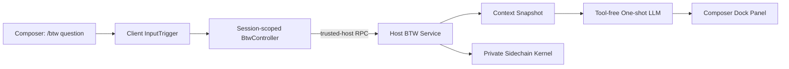

# dsh-btw

为 [DeepSeek Harness](https://github.com/deepseek-ai/deepseek-harness) 复刻的 `/btw` 旁路提问插件。

> 个人很喜欢 Claude Code 里的 `/btw` 指令，于是为 DeepSeek Harness（DSH）做了一个复刻插件。

`/btw` 用来在不打断主 Agent 的情况下快速问一个与当前上下文有关的问题。问题由独立的一次性模型请求回答，结果显示在输入框上方的临时面板中；它不会成为主对话消息，也不会写入 DSH 的普通会话目录。

本项目是非官方社区插件，与 Anthropic、Claude Code 或 DeepSeek AI 没有关联。

## `/btw` 是做什么的？

`/btw` 可以理解成在主会话旁边“顺手问一句”。当 Agent 正在执行一个较长任务时，你经常会临时想确认一个细节：刚才提到的配置文件叫什么、某段已经读过的代码为什么这样写、之前决定采用哪个方案。直接发送普通消息会改变主会话的走向并增加后续上下文，而另开会话又会失去当前任务已经积累的信息。

BTW 解决的正是这个夹缝问题：它读取截至提交时父会话可安全复用的上下文，独立生成一次回答，然后把结果放进可关闭的临时面板。主 Agent 继续原来的任务，问题和回答也不会进入普通会话历史。

它的核心价值是：

- **不打断主任务**：主 Agent 正在思考或调用工具时仍可提问，BTW 在旁路独立运行。
- **不污染主上下文**：临时问题不会改变主任务方向，也不会占用后续对话历史。
- **不用重新交代背景**：它知道父会话已经讨论过的代码、结论和决策。
- **快速确认细节**：适合答案已经存在于当前上下文中的短问题。

典型用法：

```text
/btw 刚才说的配置文件叫什么？
/btw 为什么这里选择队列而不是直接执行？
/btw 我们最终决定使用哪种缓存策略？
/btw 这个报错和刚才修改的代码有关吗？
```

### 什么时候不该用 `/btw`？

### 需求 · 应该选择
- **需求**: 询问当前会话已经知道的内容，只需要一次快速回答 · **应该选择**: `/btw`
- **需求**: 需要读取尚未看过的文件、执行命令或联网搜索 · **应该选择**: 普通消息或 subagent
- **需求**: 需要连续追问、共同讨论或改变实现方案 · **应该选择**: 普通消息
- **需求**: 需要真正修改文件或执行操作 · **应该选择**: 普通消息或带工具的 subagent

BTW 没有工具权限，也没有后续轮次。它不是免费的本地查询，而是额外的一次模型请求；插件会尽可能复用父请求的共享 prompt/cache 前缀，以降低重复上下文的成本。

这一交互定位参考了 [Claude Code 官方 `/btw` 文档](https://code.claude.com/docs/en/interactive-mode#side-questions-with-btw)，DSH 版本的底层实现、私有 sidechain 和缓存兼容层均为本项目独立实现。

## 功能

### 能力 · 行为
- **能力**: 主任务并行 · **行为**: 主 Agent 忙碌时也可以提交 `/btw`，主任务不会被暂停
- **能力**: 共享上下文 · **行为**: 复用父会话当前的模型配置、系统提示词、工具 schema 和安全消息前缀
- **能力**: 一次性回答 · **行为**: 只进行一轮模型生成，不执行工具，也不会继续追问
- **能力**: 会话隔离 · **行为**: 不向主 SessionStore 写入用户消息、回答或隐藏 Session
- **能力**: 临时界面 · **行为**: Markdown 回答显示在 composer 上方，不遮挡输入框
- **能力**: 隐私存档 · **行为**: 可选择私有 JSONL、仅内存或完全不保存三种 sidechain 模式
- **能力**: 缓存保护 · **行为**: Anthropic/pi-ai 路由把缓存边界移回共享前缀；其他路由交给 provider 管理
- **能力**: 可取消 · **行为**: 关闭面板会中止请求，并支持独立超时控制

## 使用效果

先在主会话发送至少一条消息，然后在输入框中输入：

```text
/btw 这个错误最可能是什么原因？
```

DSH 会立即释放输入框，主 Agent 可以继续工作。BTW 回答完成后会显示在输入框正上方。

- `↑` / `↓`：滚动长回答
- `Enter` / `Space` / `Esc`：关闭回答
- 请求尚未完成时点击 `Cancel`：中止本次 BTW

面板关闭后，BTW 不会出现在主对话历史、会话侧栏或普通 Session log 中。

## 实现架构



### 1. Client 输入拦截

Client 通过 DSH 的 input-trigger 管线认领 `/btw`。提交后不会走普通消息发送流程，因此问题不会进入主会话事件流。每个父 Session 都有独立的 `BtwController`，负责请求状态、取消和 UI 生命周期。

### 2. Trusted Host RPC

浏览器通过受信 Host RPC 把 `sessionId`、`requestId` 和问题发送给 Host。Host 只接受结构合法、仍有 live Agent 的会话请求，并把浏览器取消信号与插件超时合并。

### 3. 上下文快照

Host 从父 Agent 中快照：

- 当前 provider、model、reasoning、sampling 等请求配置
- 当前 system prompt
- 当前 tool schemas
- 最长的工具调用平衡消息前缀
- 正在处理的当前用户消息（如果已经进入父 Session）

工具调用平衡算法不会留下“只有 tool call、没有 tool result”的残缺历史。

### 4. 一次性模型调用

BTW 使用独立的 `sidechainId` 发起一次生成。工具 schema 会保留，以尽量维持与父请求相同的 prompt/cache 前缀，但插件不会注册工具执行器，也不会进行第二轮模型调用。如果模型只返回工具调用，界面会显示可读的降级说明。

### 5. 隐藏 sidechain

BTW 不创建普通 DSH Session。可选的审计记录由插件自己的 sidechain kernel 管理：

- `private-jsonl`：默认模式，写入 `$DSH_HOME/btw-sidechains/v1`
- `memory`：只保留在当前进程内存中
- `none`：完全不保存

`private-jsonl` 目录权限为 `0700`，文件权限为 `0600`，并按天数和最大数量自动清理。记录中包含问题、上下文快照和回答；共享机器上请根据隐私要求选择合适模式。

### 6. `skipCacheWrite` 等价处理

DSH rc.6 没有公开的 `skipCacheWrite` 平台开关。本插件对 pi-ai 的 Anthropic Messages 路由使用每次请求独立的 adapter，并通过 `onPayload` 把一次性 BTW 尾部上的 `cache_control` 标记移动到最后一个共享前缀块，避免为不会复用的尾部写缓存。

原生 DeepSeek 自动服务端缓存没有对应的 wire-level 关闭参数，因此保持 provider-managed，不伪造客户端能力。

## 安装

### 环境要求

- Node.js 22.19+（或 DSH 当前支持的更高版本）
- pnpm / Corepack
- DeepSeek Harness `0.1.0-rc.6`
- 已经可以正常启动的 `web` profile

> DeepSeek Harness 仍处于 developer preview。本插件固定依赖 rc.6 的 API；DSH 升级后如果出现不兼容，请先查看“兼容性”一节。

### 方法一：直接从 GitHub 安装

```bash
dsh plugin --profile web add github:iyllyt/dsh-btw
dsh --profile web --dump-config
dsh --profile web
```

如果没有全局 `dsh` 命令，可以把上面的 `dsh` 替换为 `npx @deepseek-ai/dsh`。

仓库提交了预构建的 `lib/`，因此从 GitHub 安装时不需要授权执行 `prepare` 构建脚本。生产环境建议锁定 commit：

```bash
dsh plugin --profile web add github:iyllyt/dsh-btw#<commit-sha>
```

### 方法二：从本地源码安装

```bash
git clone https://github.com/iyllyt/dsh-btw.git
cd dsh-btw
corepack enable
pnpm install
pnpm test
pnpm run typecheck
pnpm run build

cd ..
dsh plugin --profile web add ./dsh-btw
dsh --profile web --dump-config
dsh --profile web
```

`--dump-config` 输出中应当出现 `# == dsh-btw` 配置层和 `id: btw` 插件行。

### 卸载

```bash
dsh plugin --profile web remove dsh-btw
```

卸载插件不会自动删除已经写入 `$DSH_HOME/btw-sidechains/v1` 的私有审计记录。

## 配置

bundle 自带以下默认配置：

```yaml
- insert:
    - id: btw
      name: dsh-btw
      config:
        timeoutMs: 120000
        sidechain:
          mode: private-jsonl
          retentionDays: 7
          maxSessions: 500
```

如需覆盖默认值，在 `$DSH_HOME/profiles/web/cordis.patch.yml` 中追加同一个 `id: btw` 的完整插件行。例如完全禁用 BTW 存档：

```yaml
- insert:
    - id: btw
      name: dsh-btw
      config:
        timeoutMs: 120000
        sidechain:
          mode: none
          retentionDays: 7
          maxSessions: 500
```

可配置项：

### 字段 · 默认值 · 说明
- **字段**: `timeoutMs` · **默认值**: `120000` · **说明**: Host 侧单次 BTW 超时，单位毫秒
- **字段**: `sidechain.mode` · **默认值**: `private-jsonl` · **说明**: `private-jsonl`、`memory` 或 `none`
- **字段**: `sidechain.root` · **默认值**: `$DSH_HOME/btw-sidechains/v1` · **说明**: 私有 JSONL 的自定义绝对路径
- **字段**: `sidechain.retentionDays` · **默认值**: `7` · **说明**: 文件保留天数
- **字段**: `sidechain.maxSessions` · **默认值**: `500` · **说明**: 最多保留的 sidechain 数量

DSH 的 patch 会替换同一插件行的整个 `config`，而不是递归合并，所以覆盖时请写出希望保留的全部配置字段。

## 源码结构

```text
src/
├── client/
│   ├── input-source.ts       # /btw 命令识别与输入管线接管
│   ├── controller.ts         # 每个 Session 的异步状态与取消
│   ├── overlay.tsx           # Dock 面板、Markdown 与键盘交互
│   └── index.tsx             # Client 插件注册
├── host/
│   ├── service.ts            # trusted RPC、校验、超时与编排
│   ├── context-snapshot.ts   # 父会话请求头与平衡上下文快照
│   ├── one-shot.ts           # 无工具的一次性模型生成
│   ├── cache-boundary.ts     # Anthropic 缓存边界迁移
│   ├── btw-pi-ai-adapter.ts  # rc.6 pi-ai 请求级 adapter
│   └── sidechain-kernel.ts   # 隐藏 JSONL / memory / none 存储
└── shared/
    └── protocol.ts           # Client/Host RPC 协议与运行时校验
```

Host 和 Client 是同一个 DSH bundle 的两个运行面：`cordis.patch.yml` 加载 Host 插件，`package.json` 的 `dsh.client` 元数据加载浏览器端插件。

## 开发

```bash
pnpm install
pnpm test
pnpm run typecheck
pnpm run build
```

当前测试覆盖上下文平衡、缓存边界、输入接管、一次性生成、sidechain 隔离以及 Controller 生命周期。

## 兼容性

- 当前版本：`0.2.0`
- 目标 DSH：`0.1.0-rc.6`
- Node.js：`>=22`
- pi-ai 缓存桥接会在预期的 rc.6 adapter internals 改变时 fail closed；其他 provider 仍走 DSH 公共 `LlmRuntime.prepareCall()` 路径