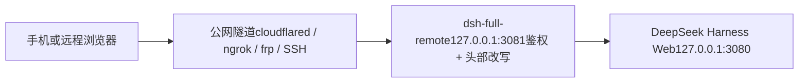

# dsh-full-remote

[](https://github.com/awesome-dsh-plugin/awesome-dsh-plugin)

**已收录进 [awesome-dsh-plugin](https://github.com/awesome-dsh-plugin/awesome-dsh-plugin)** · DeepSeek Harness 插件

[English](./README.md) | **中文**

`dsh-full-remote` 是 [DeepSeek Harness](https://github.com/deepseek-ai/deepseek-harness) 的一个插件：它在 Harness Web 服务前放置一层带鉴权的反向代理，使 Web 界面可以通过公网隧道或局域网设备访问，同时保持设置、凭据、目录浏览等特权接口可用。

## 问题

DeepSeek Harness 的 Web 服务只绑定回环地址，且仅当请求的 `Host`、`Origin` 头指向回环地址时才放行特权接口。经通用隧道访问时，这两个头携带的是公网域名，无法通过信任校验。页面可以加载，但以下接口返回 403：

- `settings.*`
- `credentials.*`
- `host.listDirectory`

### 已有做法 · 结果
- **已有做法**: 通用隧道（SSH 端口转发、Caddy、绑定 `0.0.0.0`） · **结果**: 页面可加载；`settings.*` / `credentials.*` / `host.listDirectory` 返回 403
- **已有做法**: 仅限局域网的插件，无鉴权 · **结果**: 局域网内可用，不适合公网暴露
- **已有做法**: 只有密码校验，不改写请求头 · **结果**: 请求通过了鉴权，但特权接口仍然被拦截

## 解决方案

插件在隧道与 Harness Web 服务之间插入一层反向代理：

- 转发前将 `Host`、`Origin` 改写为 `127.0.0.1`，使特权接口通过 Harness 的信任校验；
- 任何请求都须先通过访问令牌或设备会话校验；
- 转发 HTTP、SSE、WebSocket 流量；
- 提供设置页（**设置 → 反向代理**），用于启停代理、修改监听地址、轮换令牌、管理设备会话。

改写使 Harness 原本对远程客户端的信任校验失效，因此插件提供自己的访问控制层作为替代，见[安全模型](#安全模型)。

插件不负责隧道本身。cloudflared、ngrok、frp、SSH、Tailscale 等隧道均可指向插件发布的本地地址。

## 工作原理



1. 远程浏览器连接公网隧道，流量转发到插件的监听地址（默认 `127.0.0.1:3081`）。
2. 请求只有携带访问令牌、有效的一次性邀请或已有的设备会话才会被接受；未通过鉴权的请求不会到达后端。
3. 代理将 `Host`/`Origin` 改写为回环地址，移除不可信头部，再转发到 `127.0.0.1:3080` 上的 Harness Web 服务。

## 功能

### 特权接口

- `settings.describe` / `update` / `replace` / `mutate`
- `credentials.describe` / `set` / `unset`
- `host.listDirectory` / `pickDirectory` / `openPath`
- `agentPreset.*`、`llm.discoverModels`

### 访问控制

- 192 位访问令牌，状态文件权限 `0600`，在本地面板查看与轮换
- 按设备会话：每次登录生成独立的设备凭据，持久化时只保存其哈希；可在面板中重命名或撤销设备
- 可选首访审批：新设备停留在等待页，直至本机批准
- 手机邀请：二维码或一次性链接（单次有效，15 分钟过期），链接中不含长期令牌
- 登录失败计入固定延时，并按 IP 累计锁定
- 可选 CIDR 白名单，限制远程 IP

### 运维

- 栅栏自检：使用与代理相同的 Host/Origin 改写探测 `settings.describe`
- 结构化 JSONL 审计日志（登录、审批、撤销、令牌轮换、启动、停止）
- 监听地址可在运行时修改，绑定失败自动回滚
- 可选本地 TLS（`tlsCertFile` / `tlsKeyFile`）
- 健康检查接口 `/_dsh_reverse_proxy/healthz`
- 请求体大小在流层面受限；剥离逐跳与可伪造头部；清除上游 `set-cookie`

### 移动端

- 通过隧道域名打开设置页时，改动正常持久化
- 「添加工作区」使用应用内目录浏览，不会在宿主机显示器上弹出系统对话框

## 环境要求

- Node.js `^22.19.0 || >=24`
- DeepSeek Harness 的 **web** profile。插件依赖 `webServer`，不适用于 headless profile。

## 安装

```sh
dsh plugin --profile web add dsh-full-remote
dsh --profile web
```

1. 打开 `http://127.0.0.1:3080`。
2. 打开 **设置 → 反向代理**（左侧导航最后一项）。
3. 点击 **启动代理**，复制本地目标地址。
4. 将隧道指向该地址：

```sh
# 仅为示例，插件不会执行这些命令
cloudflared tunnel --url http://127.0.0.1:3081
ngrok http 3081
```

同一网络内的设备无需隧道，把监听地址设为局域网 IP 即可。

本包原名 `dsh-reverse-proxy`，现已改名为 `dsh-full-remote`。

## 使用

### 启动与停止

在设置页点击 **启动代理** 开始监听，点击 **停止代理** 停止。

### 监听地址

### 绑定 · 用途
- **绑定**: `127.0.0.1`（默认） · **用途**: 隧道与 Harness 在同一台机器
- **绑定**: `192.168.x.x` · **用途**: 同一网络内的设备直连，不走隧道
- **绑定**: `0.0.0.0` / `::` · **用途**: 绑定全部网卡。这不是要打开的地址，面板会另外给出可达地址。

监听地址可在运行时修改，并在重启后保持。新地址绑定失败时，代理自动回滚到上一个可用地址。

`backendHost` 是代理连接的后端地址，不是监听地址，保持 `127.0.0.1`。

### 手机邀请

在面板的 **手机邀请** 区域填写公网 Origin（局域网直连可留空），点击 **生成邀请**。面板显示二维码和一次性链接，扫码后登录页自动提交。链接单次有效、15 分钟过期，且不含长期令牌。

### 升级

```sh
dsh plugin --profile web update dsh-full-remote
```

之后重启 `dsh web`。再次执行 `add` 不一定会更新已锁定的版本。

## 截图

###  · 
- 控制面板 · 
- 监听地址 · 
- 访问令牌 · 
- 登录页（桌面） · 
- 登录页（手机） · 
- 手机添加工作区 · 

## 常用配置

```yaml
- id: reverse-proxy
  name: dsh-full-remote
  config:
    listenHost: 127.0.0.1
    listenPort: 3081
    approvalMode: false          # true：新设备需要本机批准
    allowedCidrs: []             # 例如 ["192.168.1.0/24"]；留空 = 登录后不限 IP
    sessionIdleSeconds: 0        # 0 = 关闭；否则按空闲秒数过期
    auditLog: true
    allowTokenRead: true         # false：令牌只在轮换时返回
    tlsCertFile: ""              # 可选本地 HTTPS
    tlsKeyFile: ""
```

完整选项、默认值与校验规则定义在包内 `Config` schema（`src/index.ts`）。

两点说明：

- 安装插件会钉住应用内目录选择器，使手机可以添加工作区。同一 profile 中不要重新启用官方 `directory-picker` 行。
- `backendHost` 必须是回环地址，通配地址或非回环地址在加载时会被拒绝。

## 安全模型

Host/Origin 改写恢复了特权接口，同时也使 Harness 对远程客户端原有的保护失效。插件提供的访问控制层包括：

- 192 位访问令牌，本地存储，文件权限 `0600`；
- 按设备的 `HttpOnly`、`SameSite=Strict` 会话 Cookie，携带按设备秘密，存储时只保存其哈希；
- 登录失败计入固定延时，并按 IP 返回 `429` 锁定；
- 控制接口（`/dsh-reverse-proxy/*`）仅限回环地址访问，需要控制头，且永远不会被公网代理转发；
- 剥离可伪造的转发头与逐跳头，代理自身的 Cookie 不会到达后端。

访问令牌须按机密保管。公网侧应终止 TLS。局域网直连可配置 `tlsCertFile` / `tlsKeyFile`（例如用 [mkcert](https://github.com/FiloSottile/mkcert) 生成）。

## 局限

- 控制操作（启动、停止、查看令牌、修改监听地址）仅可在本机 Harness 窗口执行，隧道地址下无效。
- 远程页面上的设置持久化依赖临时的信任注入，待 Harness 提供正式的部署信任字段后可以移除。手机上的「在宿主机打开」作用于运行 Harness 的机器。
- 默认 `allowTokenRead: true` 时，`GET /token` 通过回环 HTTP 提供，任何能发送控制头的本机进程均可读取。设为 `false` 后，令牌仅在轮换时返回。
- 插件以自身的访问控制层替代 Harness 的远程信任校验，该层若存在缺陷，影响严重。若 Harness 未来提供官方远程访问能力，应重新评估本插件的定位。

## 开发

### 从源码构建

```sh
pnpm pack
dsh plugin --profile web add ./dsh-full-remote-0.2.3.tgz
```

git 安装会执行 `prepare` 构建，pnpm ≥ 10 需要放行：

```yaml
allowBuilds:
  dsh-full-remote: true
```

### 检查与 CI

```sh
pnpm install
pnpm run check:ci
```

`check:ci` 包含 lint、类型检查、单元与客户端测试、构建；CI 另含一次针对真实 Harness 组合的 `dsh plugin add` 冒烟测试。`.github/workflows/canary.yml` 每周针对 harness 默认分支 tip 运行一次冒烟测试。

本机控制面 API 位于 `/dsh-reverse-proxy/*`，不会被公网代理转发。设置页是预期入口，一般无需直接调用这些接口。

## 贡献 · 安全 · 许可证

- [CONTRIBUTING.md](./CONTRIBUTING.md)
- [SECURITY.md](./SECURITY.md)
- [MIT](./LICENSE) © 2026 [JUANWANG-BUAA](https://github.com/JUANWANG-BUAA)