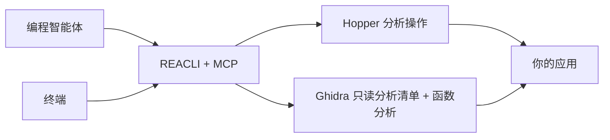

[English](README.md) · **简体中文** · [日本語](README_ja.md) · [한국어](README_ko.md) · [العربية](README_ar.md)

# REA：逆向工程一切

### 一个 CLI 与 MCP 服务器，让编程智能体逆向工程任何程序

**看到喜欢的功能。理解它的原理。按照你的方式实现。**

[快速开始](#快速开始) · [从二进制到行为](#从二进制到行为) · [工具目录](#调查工具目录) · [工作原理](#工作原理) · [常见问题](#常见问题)

`curl -fsSL https://raw.githubusercontent.com/morluto/rea/main/install.sh | bash`

看到某个应用中想加入自己产品的功能？即使没有源代码，也可以把应用交给编程智能体。借助 REA，智能体能够调查该功能、理解其工作原理，并按照你的技术栈、设计和需求构建适合你产品的版本。

REA 通过一个 CLI 与 MCP 服务器实现这套流程。智能体可以检查编译后的应用、追踪功能的工作方式，并把了解到的内容用于日常编码。REA 在一个接口背后处理复杂的逆向工程工具。

## 直接询问智能体

```bash
npx rea-agents setup
```

然后说：

```text
逆向工程“备忘录”应用。解释搜索功能的工作方式，
说明你是如何得出结论的，然后为我的项目构建类似功能。
```

“备忘录”只是示例。你可以说出任何想了解的应用，也可以让智能体先从概览开始。

## 从二进制到行为

### 反编译 · 理解 · 重建
- **反编译**: 打开原生应用或可执行文件，恢复过程、伪代码、汇编、字符串、符号、段和元数据。 · **理解**: 沿调用者、被调用者、交叉引用和调用图追踪，直到智能体能够解释功能或算法的实际工作方式。 · **重建**: 将智能体学到的内容变成适合你的技术栈、界面和需求的产品功能。

REA 让调查始终以二进制证据为依据。它不会声称能恢复原始源代码，也不会自动克隆整个应用。

## 为什么选择 REA

###  · 
- **为智能体设计** · 直接询问编译后应用的行为，让智能体搜集证据，而不是猜测。
- **CLI 与 MCP** · 在终端或编程智能体中使用同一套逆向工程能力。
- **处理复杂流程** · REA 负责工具设置、打开应用、维持调查过程，并在完成后清理资源。
- **完整工作流** · 从初步概览推进到伪代码、调用关系、类型和实现线索。
- **本地运行** · 分析在你的 Mac 上运行；REA 不会把二进制上传到托管式分析服务。
- **保留上下文** · 连续调查多个二进制文件，无需为每个问题重新开始整个分析过程。

## 快速开始

### 使用编程智能体（推荐）

```bash
npx --yes rea-agents@latest setup
```

让智能体设置 REA。它会检查你的 Mac，说明需要安装的内容，先征得同意，并引导你处理系统提示。如果智能体要求重启以加载完整工具，请在设置后重启。

### 开始之前

- macOS 12 或更高版本
- Ubuntu 24.04+、Fedora 41+ 或 64 位 Arch Linux
- Node.js 22.19+ 或 24.11+，以及随 Node 安装的 npm

`rea setup` 会先显示完整变更计划并请求确认。它不会安装或更新 Homebrew、Node.js 或 npm。缺少 [Hopper](https://www.hopperapp.com/) 时，Setup 会提议安装官方软件包；Hopper 是需要单独许可证的独立软件。

如果你已在 64 位 Linux 上安装 Ghidra 12.1.2 PUBLIC 和完整的 64 位 JDK 21，Setup 也可以在批准后登记 `GHIDRA_INSTALL_DIR` 和可选的 `JAVA_HOME`。REA 不会下载、安装或修改 Ghidra 或 Java。Ghidra provider 在隔离的只读 headless 会话中提供清单、反编译、汇编、调用关系、带类型的引用、xref、CFG 与函数 dossier；GUI 状态和修改操作仍不可用。

#### Linux 安装与故障排除

在 Ubuntu 24.04+、Fedora 41+ 和 64 位 Arch Linux 上，REA 会下载 Hopper 官方的 DEB、RPM 或 Arch 软件包，验证发布方提供的大小和校验和，然后通过 `apt-get`、`dnf` 或 `pacman` 安装依赖。非 root 运行时，`pkexec` 会显示系统授权提示；REA 不调用 `sudo`。

默认启动器是 `/opt/hopper/bin/Hopper`。自定义安装可设置 `HOPPER_LAUNCHER_PATH`。如果 Doctor 报告缺少分析引擎，请运行 `ldd /opt/hopper/bin/Hopper | grep 'not found'`，安装缺少的系统库后重新运行 `rea setup`。REA 会在私有 Xvfb 显示器上运行受支持的 Hopper 演示版，并为每个分析会话选择 Hopper 提供的演示模式；无需桌面 `DISPLAY` 或付费许可证，但演示版受厂商限制。Linux 上还应确保 `~/.local/bin` 位于 `PATH` 中。

```bash
# 1. 安装和配置 REA
curl -fsSL https://raw.githubusercontent.com/morluto/rea/main/install.sh | bash
npx --yes rea-agents@latest setup
```

如果 macOS 或安装程序要求确认，请完成提示，然后再次运行同一命令。

### 2. 重启编程智能体

Setup 会检测 Claude Code、Claude Desktop、Codex、Cursor、Gemini CLI、Windsurf 和 Devin。它会自动配置检测到的前六种客户端；由于目前没有明确的本地 MCP 配置边界，检测到 Devin 时只会报告而不会修改。重启已配置的客户端，让它加载 REA。

### 3. 直接询问智能体

你可以直接说出应用名称。编程智能体会找到应用，并把 REA 所需的程序文件交给它。

```text
使用 REA 逆向工程“备忘录”应用。解释搜索功能的工作方式，展示证据，
然后使用 SQLite 为我的项目构建一个类似功能。
```

如果遇到问题，请运行：

```bash
npx -y rea-agents@latest doctor
rea uninstall
rea uninstall --purge-data
```

## 一个提示词，完成一次完整调查

```text
逆向工程“备忘录”应用，找到离线搜索功能的工作方式，解释其控制流，
并使用 TypeScript 和 SQLite 为我的项目构建一个版本。
```

### 步骤 · 智能体的操作 · REA 工具
- **步骤**: 1 · **智能体的操作**: 打开并识别二进制文件 · **REA 工具**: `open_binary`, `binary_overview`
- **步骤**: 2 · **智能体的操作**: 搜索可能的离线搜索线索 · **REA 工具**: `search_strings`, `search_procedures`, `list_names`
- **步骤**: 3 · **智能体的操作**: 将线索连接到可执行代码 · **REA 工具**: `find_xrefs_to_name`, `xrefs`, `procedure_callers`
- **步骤**: 4 · **智能体的操作**: 重建相关控制流 · **REA 工具**: `get_call_graph`, `procedure_callees`, `procedure_info`
- **步骤**: 5 · **智能体的操作**: 反编译相关程序 · **REA 工具**: `procedure_pseudo_code`, `procedure_assembly`, `batch_decompile`
- **步骤**: 6 · **智能体的操作**: 在你的项目中构建该功能 · **REA 工具**: 适合你的技术栈、产品和需求的代码

REA 负责第 1–5 步中的二进制分析。第 6 步由智能体使用其常规文件编辑与测试工具完成。

## 智能体可以完成什么

- 在没有源代码时解释某项功能的实现方式。
- 重建应用的身份验证、存储、更新或网络流程。
- 恢复足够的结构，以记录未公开的格式或接口。
- 从字符串或符号追踪到实现可疑行为的代码。
- 在一个会话中切换两个应用版本并比较实现路径。
- 调查你喜欢的功能，并为自己的产品构建量身定制的版本。
- 将恢复的行为转换为产品功能、测试、迁移说明、移植代码或互操作替代品。
- 分析 Swift 和 Objective-C 元数据。
- 在 Hopper 中留下名称、注释与书签，使人与智能体的分析互相增强。

## 调查工具目录

### 工具类别 · 数量 · 示例
- **工具类别**: 二进制检查 · **数量**: 36 · **示例**: 过程、伪代码、汇编、字符串、名称、段、调用者、被调用者、交叉引用、注释
- **工具类别**: 组合分析 · **数量**: 13 · **示例**: `binary_overview`, `analyze_function`, `inspect_native_api`, `batch_decompile`, `get_call_graph`, `find_xrefs_to_name`、Swift 与 ObjC 发现
- **工具类别**: macOS 原生工具 · **数量**: 5 · **示例**: Mach-O 元数据、代码签名、plist、架构与 Swift 符号还原，无需启动 Hopper
- **工具类别**: 制品图谱 · **数量**: 3 · **示例**: 确定性目录、ZIP/APK/IPA 与 ASAR 清单，以及显式选择的事务式提取
- **工具类别**: Managed PE/CLI · **数量**: 8 · **示例**: PE/CLI 身份、元数据成员、CIL 哈希、P/Invoke/原生边界声明与验证、应用图谱投影、反编译重建导入、结构化 token 重映射、运行时关联计划与跨版本比较
- **工具类别**: 浏览器观察 · **数量**: 9 · **示例**: 精确来源 CDP 抓取、bundle/source map 分析、WebMCP 发现、会话时间线、capture diff 与视觉证据
- **工具类别**: Electron 分析 · **数量**: 5 · **示例**: 限定 canonical 文件根的被动观察、有界静态应用映射，以及基于 Evidence 的静态/运行时对账
- **工具类别**: JavaScript 运行时 · **数量**: 2 · **示例**: 经批准的只附加 Node/Electron Inspector 目标发现，以及不执行求值或插桩的有界脚本和执行上下文观察
- **工具类别**: 应用工作流 · **数量**: 12 · **示例**: 有界跨层追踪、唯一匹配跨版本图比较、静态导出返回形状比较、经批准的 Linux 隔离 extracted-module replay、托管运行时表征、重建覆盖闭合、确定性义务账本和端到端就绪性一致性验证
- **工具类别**: 二进制会话 · **数量**: 23 · **示例**: `open_binary`、`binary_session`、证据包、保留包释放、有限重放状态机、进程、制品与函数比较、残余未知项注册表

## 与其他编程智能体一起使用

Setup 会检测 Claude Code、Claude Desktop、Codex、Cursor、Gemini CLI、Windsurf 和 Devin，并自动配置检测到的前六种客户端；检测到 Devin 时只会报告而不会修改。任何支持本地 MCP 服务器的编程智能体都可以使用以下配置连接 REA。

```json
{
  "mcpServers": {
    "rea": {
      "command": "npx",
      "args": ["-y", "rea-agents@3.1.0", "mcp"]
    }
  }
}
```

## 工作原理



CLI 与 MCP 服务器使用相同的分析引擎。终端命令完成后会关闭应用；智能体会话则会在调查期间保持应用打开。

## CLI

上面的智能体工作流是使用 REA 最简单的方式。如果只想在终端中快速了解一个应用：

```bash
npx -y rea-agents@latest analyze /Applications/Notes.app
```

运行 `npx -y rea-agents@latest --help` 查看直接反编译和其他选项。

也可以全局安装 `rea` 命令：

```bash
npm install --global rea-agents
rea --help
rea mcp
```

REA 可以直接打开 Mac 的 `.app` 文件夹。如果智能体找不到应用，请告诉它应用安装在哪里。

## Hopper 应用行为

REA 会在需要时启动 Hopper，无需预先运行。Hopper 启动器内部会激活应用，因此打开目标时 Hopper 可能出现在其他窗口前。REA 会请求 macOS 在后台启动 Hopper，但无法保证窗口始终位于后台。

REA 会推导明确的格式和架构参数，以避免常见的 FAT 与 ARM 选择对话框。其他 Hopper 或 macOS 对话框仍可能需要人工响应。关闭 REA 会话会终止桥并删除私有套接字目录，但不会退出用户正在使用的 Hopper 应用。

## 安全模型

每个桥会话都使用随机能力令牌和仅限当前用户的 Unix 套接字。协议消息有大小限制，面向调用者的错误不会暴露启动器 stderr 或内部异常原因。Ghidra 会话还使用隔离的临时项目，不会打开或修改用户自己的 Ghidra 项目。

这不是沙箱，也无法防御以同一操作系统用户身份运行的恶意进程。打开不可信二进制文件会让所选本地提供商以当前用户权限进行解析和分析。请按照 [SECURITY.md](SECURITY.md) 中的私密流程报告漏洞。

## 常见问题

Hopper 是否需要提前运行？

不需要。REA 会在操作需要时启动 Hopper，也支持已经运行的 Hopper。

REA 是否包含 Hopper？

不包含。Setup 可以为你安装 Hopper，但 Hopper 仍是需要单独授权的软件。REA 提供 CLI、MCP 服务器和面向智能体的工作流。

REA 会上传我的二进制文件吗？

REA 不提供托管分析服务，而是通过本地 Unix 套接字把操作交给 Hopper。你的智能体或模型服务商可能有自己的数据政策，请单独核查。

REA 能恢复原始源代码吗？

不能保证。REA 提供伪代码、汇编、符号、字符串、元数据和关系，智能体可据此解释或兼容地重建观察到的行为。

## 开发

开发环境、架构、测试和发布说明请参阅 [CONTRIBUTING.md](CONTRIBUTING.md)。

## 许可证

[MIT](LICENSE)