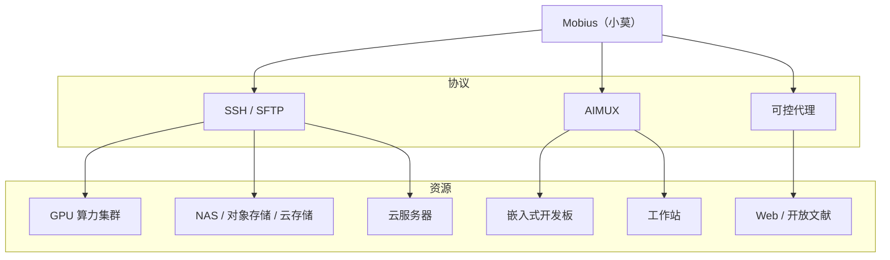

·

#  Mobius

<h3>
首个自进化的开源 Agent OS
一个系统，连接你的团队、AI 智能体、设备与算力
</h3>

  

> **模型飞速进步的时代，试图打造适合所有人的完美的 AI 系统，就像寻找莫比乌斯环的尽头，终究徒劳无功。**
>
> Mobius 是全球首个**自进化**的开源 Agent OS，一个持续生长的生产力系统，把项目、团队、模型、设备、算力和应用连成一个可追溯的工作空间。

## 最新动态

**2026-08-09**
- **Windows 一键安装**：单条 PowerShell 命令即可在全新 Windows 机器上安装Mobius TUI。

**2026-08-02**
- **简易模式上线**：可选的无干扰布局（跨项目近期会话 + JSONL + 悬浮输入框）。首次进入需在简易/常规模式间二选一，随时可从主题菜单切换。
- **TUI发布**：使用TUI在任意终端连接到Mobius，像使用Codex一样使用Mobius。

**2026-07-26**
- **搜索优化**：结果经 SSE 流式返回、支持大小写/全字匹配，点击结果直接跳转到对应 JSONL 卡片。

**2026-07-14**
- **代码对话 v2**工作空间模式：三栏布局（文件浏览器 + 内置 CodeMirror 编辑器，支持语法高亮与就地保存 + 对话。

## 自进化

Mobius 会根据你的输入改写自身。发一个**修改需求**、一张**截图**，或一个**参考链接**——Mobius 把它们变成真实的代码、界面、插件或流程更新，全程不打断你的工作。每一次迭代，都在后台悄悄替换"忒修斯之船"上的一块木板。

  

[查看自进化示例](https://nutshellai-tech.github.io/mobius/self-evo-demo/)

## 自动科研

Mobius 把多个智能体编排成一条自主科研流水线——读论文、抽取方法、跑实验、汇总结果。一个科研目标变成一个多智能体系统，而不是一次单轮问答。

  

## 小莫（XiaoMo）

小莫是整个系统的自然语言入口。直接对它说：创建项目、拆分任务、启动智能体、追踪进度。界面上能点的，小莫都能做；界面做不到的，小莫也能处理。支持语音输入、多端（Web、PC、移动端）和可配置的提醒。

  

**在网页上。** 零安装——任意设备打开浏览器，完整工作台即刻就绪。

  

**在手机上。** 小莫随身同行——随时和智能体对话、追踪进度、审批决策。iOS 与 Android 端现已完全可用。

  

**在桌面上。** 原生桌面客户端，把你的 PC 变成 Mobius 工作站——直接读写本地项目文件、把本机接入为一个可控节点、多标签工作区。Windows、macOS、Linux 现已可用。

> 本页的演示素材均由小莫自己制作，录制过程零人工参与。

## 任意模型，任意智能体

Mobius 与具体模型解耦。GPT、Claude、**GLM-5.2**、Codex——都可以作为同一个项目里的执行引擎。按任务类型、成本或性能自由选择。

## 连接一切

Mobius 在同一个任务网络里调度浏览器、终端、GPU 集群、嵌入式开发板、云服务器和工作站。

通过 SSH、AIMUX 和可控代理访问你的资源：



## 团队协作

成员、智能体、任务和交付物集中在同一个视图。负责人一眼看到谁在做什么、每个智能体在哪、哪些需要确认、风险在哪里——不再有碎片化的沟通。

  

## 自孵化拓展

Mobius 自带内置拓展，并按你的需求生长出新的——金融看板、PPT 生成器、科研工作台、实时门户。每个拓展都自带前端、后端 handler、数据目录和调用入口，可持续进化。

  

  
    
      沉浸式 Web 体验
      <sub>把视觉创意变成可运行的拓展应用。</sub>
      
    
    
      金融新闻墙
      <sub>追踪实时市场叙事。</sub>
      
    
  
  
    
      世界杯门户
      <sub>数据丰富的体育门户。</sub>
      
    
    
      PPT 生成器
      <sub>从主题和素材生成演示文稿。</sub>
      
    
  

## 快速开始

完整部署指南见[文档](https://nutshellai-tech.github.io/mobius/)。

### 容器（推荐）

```bash
# 1. 克隆仓库（建议先 fork 再 clone，这样自进化后可以直接提交到自己的仓库）
git clone https://github.com/nutshellai-tech/mobius.git && cd mobius

# 2. 生成配置（随机密钥/密码；也可手动配置以跳过此步）
python3 conf_prepare.py --docker && python3 conf_check.py --docker

# 3. 构建镜像（base 镜像仅含环境，不含代码）
docker build -t mobius-system-base:latest -f deploy/Dockerfile .
docker build -t mobius-system-exe:latest .

# 4. 启动
docker compose up
```

### 直接部署（Linux / macOS）

```bash
# 1. 安装前置依赖（tmux、git 等）
sudo apt install tmux python3 git curl proxychains openssh-server build-essential

# 2. 安装编码 Agent（任选其一，建议两者都装）
npm install -g @anthropic-ai/claude-code @openai/codex

# 3. 克隆仓库（建议先 fork 再 clone，这样自进化后可以直接提交到自己的仓库）
git clone https://github.com/nutshellai-tech/mobius.git && cd mobius

# 4. 生成并校验配置（会把 .env.default 复制为 .env 并生成随机密码）
python3 conf_prepare.py && python3 conf_check.py

# 5. 安装依赖（前端 + 后端）
cd ./mobius && npm install && cd ./frontend && npm install && cd ../..

# 6. 运行
python3 start.py
```

## 路线图

我们正在构建的下一步：

- **移动端 App** — 在 iOS 和 Android 上带来小莫与完整的 Agent 控制
- **桌面端 App** — 一个原生连接器，把 PC 设备（Windows、macOS、Linux）接入 Mobius
- **拓展市场** — 发现、分享和安装社区拓展
- **多语言与本地化** — 把界面和文档本地化为更多语言

### 参与贡献

Issue、插件、文档、Bug 报告、使用案例——皆欢迎。如果你认同 AI 系统应当持续进化、而非静态工具，欢迎加入我们。

  ·
  ·