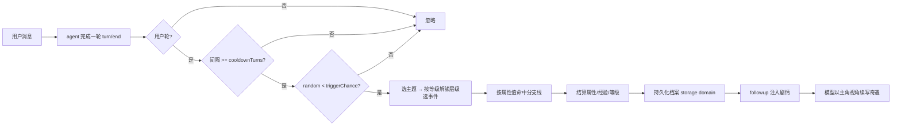
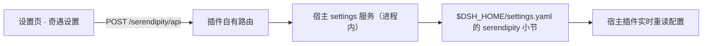

# 工作奇遇（@pocket30/dsh-serendipity）

一个 DeepSeek Harness（dsh）插件：把**用户本人当作主角**来养成，在每次对话后的闲暇之余看一个让你会心一笑的简短剧情。

每次你完成一轮对话，插件都有一定概率触发一次**随机奇遇**。奇遇来自不同主题
（科幻、玄幻、远古、动漫、小说、武侠、都市…），每个主题下都有大量事件，
每个事件会对主角的**力量 / 智力 / 敏捷 / 魅力 / 幸运 / 体魄**等属性产生
不同程度的影响（有增益、有代价、有权衡），并积累经验、升级等级。

- **等级解锁宏大事件**：事件按层级划分（日常 → 冒险 → 史诗 → 传奇），
  等级越高，越能解锁并更常遇到更宏大的奇遇。
- **属性分支线**：带分支的事件会根据你当前的属性值走向不同的剧情线
  （力量流 / 智力流 / 魅力流……），同样的奇遇在不同角色身上会有不同的结局。
- **奇遇联动**：随着奇遇数量增加，前文的奇遇经历会在后续剧情中提前，产生联动

属性会持久化，跨会话、跨重启持续养成，并反过来影响你与模型的后续对话走向。

插件还会在 dsh 设置页注册一个**“奇遇设置”页**（参照 DSH-better-sidebar 的
“侧边卡片”交互）：通用参数开关行 + 主题小卡片网格（点击即开关，齿轮弹窗调
二级设置），修改即时生效（写回 `$DSH_HOME/settings.yaml` 的 `serendipity:` 小节）。

## ✨ 功能概览

- 🚀 **自动触发**  
  监听 `turn/end` 事件，仅统计**由你主动发起**的对话轮次，插件自身注入的剧情轮不会重复触发，避免无限循环。

- 🎲 **概率与冷却**  
  支持自定义触发概率，以及两次奇遇之间的最少用户对话轮数间隔。

- 📚 **主题与事件库**  
  内置 7 大主题、50+ 事件，支持动态追加事件/主题，也可禁用指定主题。题材为**单选**模式（在设置页点选后，奇遇将仅在该主题范围内触发，不会跨主题跳转）。

- 🏆 **等级解锁机制**  
  事件划分为 **日常 / 冒险 / 史诗 / 传奇** 四个等级，随角色等级提升逐步解锁。等级越高，抽中宏大事件的概率越大，同时获得的经验与收益也更丰厚。

- 🌿 **属性分支系统**  
  支持 `branches` 的事件会根据主角**当前属性值**自动匹配对应分支（例如力量最高触发「以力破局」，智力最高触发「以智取胜」），每个分支拥有独立的标题、剧情文本和属性结算逻辑。

- 📈 **属性与经验成长**  
  属性变化在 0~100 区间内自动裁剪，经验值累积后自动提升角色等级。

- ✍️ **剧情注入方式**  
  默认采用 `followup` 模式，触发后由模型以主角视角将奇遇续写成完整故事，并在对话中自然交代属性变动。

- 👤 **状态可视化**  
  在设置页的「角色档案」分组中，可直接查看等级、经验、六维属性及最近奇遇记录（支持手动刷新）。同时，模型端可通过 `serendipity_status` 和 `serendipity_reset` 工具查询或重置角色档案。

- ⚙️ **设置页实时配置**  
  通过 dsh 设置 → "奇遇设置" 进行可视化编辑，修改后即时生效。

- 💾 **跨会话持久化**  
  优先使用 storage domain（web 组合自带），重启后角色数据不丢失；若当前组合不支持 storage，则自动降级为进程内内存存储，并给出告警提示。

## 演示效果

### 奇遇设置页 · 主题卡片


> dsh 设置页 → “奇遇设置”：通用参数开关行 + 主题小卡片网格（单选，点击即
> 切换题材），修改即时生效并写回 `$DSH_HOME/settings.yaml` 的 `serendipity:` 小节。

### 触发示例（对话实录）

第一次

```
【工作奇遇】日常奇遇触发 · 玄幻
传承石碑：断崖下立着一块布满裂纹的石碑，碑文记载着一门失传的功法。你凝神参悟，识海深处传来一声轻叹。
属性变化：智力 +5 · 体魄 +2 · 经验 +14
当前状态：等级 2 · 经验 32/40 · 力量 10 · 智力 24 · 敏捷 10 · 魅力 10 · 幸运 20 · 体魄 14
累计奇遇：4 次
请以主角的视角把这次奇遇自然地融入当前对话，并在合适的位置交代属性变化；不要跳出角色。
```

```
主页背景的活儿刚收尾——样式文件保存、验证通过、测试服务停掉。我正盯着屏幕想着要不要再调一调圆环装饰的透明度，识海深处却毫无征兆地一沉。

视野里代码消失了。断崖，风从谷底往上灌，一块布满裂纹的石碑立在碎石间，碑面苔痕斑驳，却有一行行古篆隐隐泛着微光。像是某种失传的功法——笔画残缺，但足够我读出脉络。

我凝神参悟。起初只觉得头痛欲裂，裂纹里涌出的文字像活物一样钻进识海，逐行拼合、验证、推演……不知过了多久，碑文最后一笔在意识中落定，识海深处传来一声极轻的叹息，仿佛那位不知名的传承者隔了千百年确认了传人。

随之而来的是体内一阵暖流：识海豁然开阔，五感也更沉稳了几分——智力 +5，体魄 +2，经验 +14。

我睁开眼，屏幕还在，光标停在 style.css 最后一行。
```

第二次

```text
验证脚本删掉、测试服务停掉，我正盯着终端里最后一行 ALL PASS 的绿色输出，琢磨着要不要把标签筛选的验证逻辑写进文档里。

一抬头，一个邋遢老道不知什么时候蹲在了屏幕边上，破蒲扇有一下没一下地扇着，眯眼打量我半天，忽然开口："道友，你上辈子欠我三枚灵石，这账，该还了吧？"

我愣了一下，随即苦笑——写代码的人上辈子大概是欠了全世界的债。正想掏兜，却觉得丹田深处一缕灵力微微震动，像见了故人。老道也怔了怔，蒲扇一收："咦？你体内……罢了罢了，这缕气息认得我，算你有缘，账一笔勾销。"

话落，他袖袍一拂，人已在原地消失。只留下那缕灵力在我识海里温养打转——比先前更凝实了一分。

我摇摇头，把注意力拉回现实。灵石没欠出去，倒是莫名其妙又被这个世界薅走了一点运气：幸运 -3，智力 +4，经验 +11。

等级 3 · 经验 3/60（2 级 → 3 级，终于升段了）
力量 10 · 智力 28 · 敏捷 10 · 魅力 10 · 幸运 17 · 体魄 14
累计奇遇：第 5 次
灵力见涨，灵台更清。回到正事——标签筛选这边已经收尾了：4 篇文章都补上了标签，/blog 刷新后就能看到筛选按钮，点"设计模式"筛出 3 篇、点"Agent"筛出 1 篇，逻辑用真实前端代码端到端验证过。你那边刷新页面看看效果，要是标签想换措辞、或者想加个"标签+分类"组合筛选，说一声就行。
```

## 安装

### 环境要求

- dsh CLI **0.1.0-rc.6**（或与之兼容的版本，见下方「已知限制」）。
- 推荐 profile：`web`（自带 storage domain 与设置页容器）。

### 方式一：npm 包（推荐，含设置页卡片）

```sh
npx @deepseek-ai/dsh plugin --profile web add @pocket30/dsh-serendipity@0.6.0
```

> 如果你的 profile 不是 `web`，把命令里的 `web` 换成你的 profile 名即可。

### 安装后

1. **重启 dsh web**：杀掉监听 3080 的进程，重新执行 `dsh web`，浏览器硬刷新。
2. 打开 dsh 设置页，导航里应出现 **“奇遇设置”** 页。
3. 完成几轮对话触发第一次奇遇后，「角色档案」会展示等级/属性/最近奇遇；
   模型也可调用 `serendipity_status` 查看养成状态。

### 卸载

```sh
dsh plugin --profile web remove @pocket30/dsh-serendipity
```

## 奇遇设置（设置页）

安装后打开 dsh 设置页，导航里会出现 **“奇遇设置”** 页（参照 DSH-better-sidebar
的“侧边卡片”交互）：

- **角色档案** 分组：主角的等级、经验进度、六维属性条与最近奇遇记录（新→旧，
  含层级标记如「史诗·科幻」），右上角「刷新」按钮重新拉取（奇遇在对话中触发，
  页面不会自动刷新）。
- **通用** 分组：逐项开关/输入行 —— 开启奇遇（总开关）、触发概率（百分比）、
  冷却轮数、剧情模式、档案 ID、角色名、奇遇记录条数。
- **主题** 分组：每个主题一张小卡片（科幻 🚀 / 玄幻 🐉 / 远古 🏺 / 动漫 ⭐ /
  小说 📖 / 武侠 ⚔️ / 都市 🏙️ 等），**单选**——点击卡片即选定该题材，其余题材
  自动关闭（避免多题材间跳转、破坏沉浸感）。末尾预留一张「自定义题材」占位卡片
  （敬请期待，后续经 `extraThemes` / `extraEvents` 配置添加）。

所有修改乐观更新并即时写入用户设置层（`$DSH_HOME/settings.yaml` 的
`serendipity:` 小节），带修订号守卫；失败自动回滚并内联报错。

> 实现说明：dsh 官方设置 RPC 只把白名单命名空间暴露给浏览器，第三方命名
> 空间不会下发。因此本插件的设置页走**插件自有路由**（`/serendipity/api`，
> 带与 /api 一致的信任围栏），宿主在进程内调用 settings 服务读写。
> 「角色档案」分组同样走该自有路由（`profile.get`），宿主从 storage domain
> 读取档案后返回等级/属性/最近奇遇视图。

> 主题事件目录（`extraThemes` / `extraEvents`）属于编排级配置，仍在
> `cordis.patch.yml` 的 `config` 里维护，见下文。

## 配置项

在 profile 的 `cordis.patch.yml` 里按行覆盖：

```yaml
- insert:
    - id: serendipity
      name: '@pocket30/dsh-serendipity'
      config:
        enabled: true            # 奇遇总开关
        triggerChance: 0.25      # 每次完成一轮用户对话的触发概率（0~1）
        cooldownTurns: 3         # 两次奇遇之间最少间隔的用户对话轮数（>=1）
        narrateMode: followup    # followup | inject | none
        theme: ''                # 单选主题：非空时只从该主题抽事件（'' = 按 disabledThemes 多选）
        profileId: default       # 档案 id，不同 id = 不同角色
        characterName: 无名主角  # 新角色的默认名字
        enableTools: true        # 是否注册 serendipity_* 工具（组合层配置）
        maxAdventureLog: 20      # 档案中保留的奇遇记录条数
```

设置页可改的字段会覆盖入口配置（设置层 > 组合层 > schema 默认值）。

### 自定义主题 / 事件示例

```yaml
config:
  extraThemes:
    detective:
      name: 侦探
      description: 谜案、线索与推理。
      events:
        - id: locked-room
          title: 密室谜案
          description: 一桩看似不可能的密室案件摆在你面前，唯一的钥匙孔上留着淡淡的蜡痕。
          effects:
            intelligence: 6
            luck: -1
          exp: 15
          minLevel: 2           # 可选：最低等级（也决定事件层级）
          branches:             # 可选：属性分支线
            - id: sharp-mind
              title: 一眼看破
              description: 你凭着过人的洞察力，一眼看出密室钥匙孔上的蜡痕是伪装。
              effects:
                intelligence: 8
              exp: 18
              when:
                attribute: intelligence
                min: 50
            - id: silver-tongue
              title: 巧舌如簧
              description: 你与唯一的嫌疑人周旋，三言两语便让他自己露出了马脚。
              effects:
                charisma: 7
                luck: 2
              exp: 18
              when:
                attribute: charisma
                highest: true
            - id: stroke-of-luck
              title: 灵光一现
              description: 你毫无头绪，却在整理证物时无意中碰倒了书架，滚出一封关键的信。
              effects:
                luck: 5
                intelligence: 3
              exp: 16
              when:
                always: true
  extraEvents:
    xianxia:
      - id: my-custom-event
        title: 自定义事件
        description: 你自己的奇遇。
        effects:
          strength: 3
        exp: 10
  disabledThemes:
    - urban
```

事件字段：`id`、`title`、`description`、`effects`（属性 id → 增减值）、
`exp`（经验）、`minLevel`（可选，最低等级，兼作层级门槛）。
属性 id：`strength` / `intelligence` / `agility` / `charisma` / `luck` / `vitality`。

事件层级（由 `minLevel` 决定，无需单独配置）：

### 层级 · minLevel · 解锁条件
- **层级**: 日常 · **minLevel**: 1 · **解锁条件**: 初始可用
- **层级**: 冒险 · **minLevel**: 2 · **解锁条件**: 2 级解锁
- **层级**: 史诗 · **minLevel**: 4 · **解锁条件**: 4 级解锁
- **层级**: 传奇 · **minLevel**: 7 · **解锁条件**: 7 级解锁

分支条件（`when`）支持五种写法，按声明顺序匹配第一条命中：

- `{ attribute, min }`：该属性 ≥ min 时命中；
- `{ attribute, max }`：该属性 ≤ max 时命中；
- `{ attribute, highest: true }`：该属性为六维最高（并列也算）时命中；
- `{ attribute, lowest: true }`：该属性为六维最低（并列也算）时命中；
- `{ always: true }`：无条件兜底，建议放在最后。

分支字段：`id`、`title`、`description`、`effects`、`exp`（可选，缺省用事件
`exp`）、`when`（命中条件）。未命中任何分支时按事件本体的标题/描述/属性结算。

## 模型可用工具

- `serendipity_status`：查看角色档案（等级、经验、六维属性、最近奇遇，含层级标记）。
- `serendipity_reset(confirm: true, name?)`：开启一份全新角色档案（需显式确认）。

## 工作原理



触发判定完全由**会话日志推导**（`source.kind === 'user'` 的轮次才算用户轮，
插件注入轮次的 `source.kind === 'plugin'` 不算），因此不会自我循环触发。

选事件的层级偏置：事件按 `minLevel` 分四档，未达等级门槛的事件不会入选；
解锁后抽中概率随等级线性提升（层级越高、上限越高），因此**等级越高，
越容易遇到更宏大的奇遇**。

设置链路：



## 已知限制

- 依赖 `@deepseek-ai/*` 的 0.1.0-rc.6 家族版本，与 dsh CLI 0.1.0-rc.6 对齐；
  若宿主版本差异过大，请同步升级本插件依赖后重新构建。
- 设置页 UI 依赖 package 安装（npm 包安装）。
- `narrateMode: none` 时，冷却标记只存在于进程内存中，重启后可能立刻再触发一次。
- 跨会话持久化依赖 storage domain（`dsh web` 自带）；纯 headless/TUI 组合会降级为
  内存存储并打印一条告警。