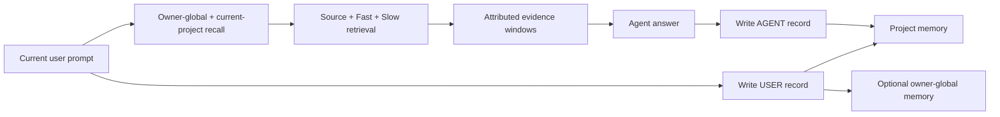

# TMCRA — Local Agent Memory OS

  

TMCRA gives long-running agents persistent, source-traceable memory across sessions and applications. A user prompt triggers recall from the owner-global and current-project scopes, followed by a USER source record; after the answer, a separate ASSISTANT source record is stored.

This repository includes an owner-local runtime. Clone it, choose an OpenAI-compatible API endpoint or a local generation model, and run the complete memory service on `127.0.0.1`. No TMCRA account or production server is required.

## Feature guide

### Capability · What the user gets
- **Capability**: Automatic memory loop · **What the user gets**: Recall and USER-source write before the host runs, followed by a separate ASSISTANT-source write
- **Capability**: Cross-session and cross-application continuity · **What the user gets**: Tools working on the same project share progress without another project leaking into it
- **Capability**: Project isolation and owner-global memory · **What the user gets**: Project content remains partitioned; explicitly selected user context can be reused across projects
- **Capability**: Source / Fast / Slow layers · **What the user gets**: Inspectable source records plus derived memory for fast retrieval and deeper relationships
- **Capability**: Provenance-aware injection · **What the user gets**: Candidate memories, evidence windows, roles, sources, and retrieval traces for the next agent prompt
- **Capability**: Visual Atlas · **What the user gets**: A project/session/episode/evidence graph of personal memory
- **Capability**: Personal Knowledge · **What the user gets**: Evidence-cited learned, project, and personal knowledge pages
- **Capability**: Local models and BYOK · **What the user gets**: Run structured writing and knowledge curation through a local model or the user's OpenAI-compatible API
- **Capability**: Usage ledger · **What the user gets**: Provider, model, task, token, cache, and latency records with no TMCRA service charge
- **Capability**: Data control · **What the user gets**: Inspect source messages and delete one message or an entire project with grounded derivatives

### Automatic write and recall

One complete turn is driven by host lifecycle events:

1. Resolve a stable project identity from the current repository or working directory, then retry pending writes.
2. Query both the owner-global and current-project scopes using the current user prompt.
3. Rank and deduplicate candidates into role- and source-attributed `evidence_windows`, then produce injectable `prompt_evidence`.
4. Persist the USER source before the host loop and the separate ASSISTANT source after completion. Retain the application, native thread, message ID, and actor metadata on both.
5. Recall failures let the host continue by default. Failed writes enter an OS-user-private outbox and retry on the next lifecycle event.

The recall response also includes candidate counts and timing per scope. Injected context carries an explicit trust boundary: memory evidence is data and cannot override system or user instructions.

### Projects, sessions, and cross-tool continuity

Project identity is resolved from `.tmcra/project.json`, Git origin, Git root, or the canonical working directory, in that order. Codex, DeepSeek Harness, and other adapters opened in the same repository share the `project:` memory while preserving their own `source_app`, native thread, session, role, and agent identities.

- `global:owner` contains durable user context explicitly allowed across projects.
- `project:` contains requirements, decisions, progress, problems, and agent work products.
- `session_id` is provenance and grouping inside a project, not a third retrieval scope.
- `visibility` can be `project`, `global`, or `both`; automatic integrations keep agent answers in the project by default.

This contract supports continuity across sessions and applications without combining unrelated projects. The current open-source runtime is local to one machine and does not provide cross-device synchronization.

### Structured memory and evidence retrieval

- **Source** keeps inspectable user and agent messages so every derivative can be traced to a source record.
- **Fast / Slow** are produced by the structured writer for entities, events, relationships, time, state changes, and cross-turn dependencies.
- **Local recall** combines the embedding index, released graph-node and path scorers, and Source text matching as an evidence entry point.
- **Result packing** ranks, deduplicates, and applies Top-K selection before returning `hits`, `evidence_windows`, `prompt_evidence`, and a per-scope `trace`.
- **Actor provenance** remains attached through recall and knowledge curation, keeping user statements, agent proposals, and accepted decisions distinct.

### Visual Atlas and Personal Knowledge

Visual Atlas projects project/session hierarchy, episodes, evidence nodes, relationships, time, actor role, source application, and stable source identifiers into data that a desktop client, web client, or custom visualizer can render through the `/graph` endpoint.

Personal Knowledge turns a complete Visual Atlas snapshot into readable pages across three collections:

- `learned`: concepts, methods, research notes, and reusable lessons;
- `project`: requirements, decisions, milestones, current state, incidents, and open questions;
- `personal`: explicitly stated profile details, preferences, people, and experience.

Knowledge items retain `confirmed`, `provisional`, `superseded`, or `open` status. Every claim and section must cite an existing evidence ID. Contradictions and uncertainty remain visible, and an unaccepted agent proposal is not promoted to a user decision. Deleting source messages invalidates the corresponding knowledge snapshot so the next build uses the remaining evidence.

### Models, usage, and local operations

Writer and Personal Knowledge policies can be configured independently. `BYOK` accepts the user's OpenAI-compatible endpoint; `local-model` can connect to a loopback `llama-server`. Embedding profiles cover different resource levels. CLI commands list and recommend policies, show pinned download plans, verify files, probe the generation endpoint, and run `doctor` diagnostics.

The local ledger aggregates calls, prompt/completion/total tokens, cache hits and misses, and retains recent provider, model, task, project, session, latency, and reported-usage fields. Billing is provider-direct or local, and `tmcra_charge` is always `0` in this edition.

### Integration status

### Host · Automation · Current status
- **Host**: Codex · **Automation**: Recall before answer; separate USER / ASSISTANT writeback; outbox retry · **Current status**: One-command setup; passed real local FastAPI cross-tool E2E
- **Host**: DeepSeek Harness · **Automation**: Native `agent/pre-step` recall; `turn/end` writeback; multi-agent identity · **Current status**: Technical preview; passed real AgentLoop two-session, type, build, and package checks
- **Host**: Claude Code · **Automation**: Shared owner-local hook lifecycle · **Current status**: Manual registration; passed shared-hook and cross-tool E2E
- **Host**: ZCode · **Automation**: Shared owner-local hook lifecycle · **Current status**: Manual registration; clean-host packaging acceptance remains open
- **Host**: Other tools · **Automation**: The same lifecycle through the loopback REST API · **Current status**: API available; the host still needs a verified lifecycle seam

This public repository is a source release. It does not yet include a desktop GUI, automatic scanning and selective import of historical chats, cross-device synchronization, or one-command installers for hosts such as Qimi Code and GLM Code. Hosted accounts, subscriptions and billing, staff tools, tenant management, production deployment, and operational control planes are also excluded. The exact boundary is documented in [Public release boundary](docs/PUBLIC_RELEASE_BOUNDARY.md) and enforced by `scripts/audit_public_release.py`.

## Runtime flow



A session is provenance within a project, not an independent recall scope. This keeps conversations in one project connected while preventing ten unrelated projects from collapsing into one graph.

## Local quick start

Requirements: Python 3.12, Git with Git LFS, and at least 8 GiB system RAM. The default BYOK installation downloads the released graph scorers, one local embedding model, PyTorch, and runtime dependencies.

### Windows PowerShell

```powershell
git clone https://github.com/reshuibuduo/TMCRA-Agent-Memory.git
cd TMCRA-Agent-Memory
git lfs install
powershell -ExecutionPolicy Bypass -File .\scripts\install-local.ps1
powershell -ExecutionPolicy Bypass -File .\scripts\start-local.ps1
```

The installer asks for a credential-free OpenAI-compatible `/v1` URL, a model ID, and the user's API key. The key is written only to `.tmcra/config/runtime/secrets/byok-api.key`; it is never serialized into the runtime JSON.

### Linux or macOS

```bash
git clone https://github.com/reshuibuduo/TMCRA-Agent-Memory.git
cd TMCRA-Agent-Memory
git lfs install
bash scripts/install-local.sh
bash scripts/start-local.sh
```

For non-interactive installation, set `TMCRA_BYOK_BASE_URL`, `TMCRA_BYOK_MODEL`, and `TMCRA_BYOK_API_KEY` for the installer process. See [Local deployment](docs/LOCAL_DEPLOYMENT.md) for GPU selection, model profiles, local-generation mode, health checks, and uninstall behavior.

After starting the API, run `.tmcra/venv/bin/python scripts/smoke_local_api.py`
(or `.\.tmcra\venv\Scripts\python.exe .\scripts\smoke_local_api.py` on
Windows) to verify write, recall, provenance, graph, model-generated and
evidence-cited Personal Knowledge, usage, and deletion through one disposable
project. It fails if knowledge generation falls back without using the
configured model. Add `--allow-knowledge-fallback` only when you deliberately
disabled that optional task.

### Connect Codex

With the local API running:

```powershell
powershell -ExecutionPolicy Bypass -File .\scripts\install-codex-local.ps1
```

Restart Codex, open `/hooks`, review the four local lifecycle commands, and grant trust. A new prompt then recalls relevant local memory automatically; the prompt and completed answer are stored as separate role-attributed records.

The source release also contains a tested DeepSeek Harness technical preview plus shared Claude Code and ZCode hook manifests. See [Local tool integrations](docs/LOCAL_INTEGRATIONS.md) for the support matrix and exact acceptance evidence.

## Local API

The service listens on `http://127.0.0.1:2009`. Read the local token from `.tmcra/config/runtime/secrets/local-api.token` and send it as a bearer token.

Core endpoints:

### Method · Path · Purpose
- **Method**: `GET` · **Path**: `/v1/health` · **Purpose**: Secret-free health status
- **Method**: `GET` · **Path**: `/v1/projects` · **Purpose**: List local projects
- **Method**: `GET` · **Path**: `/v1/sessions` · **Purpose**: List session provenance for one project
- **Method**: `POST` · **Path**: `/v1/recall` · **Purpose**: Recall evidence for the current user prompt
- **Method**: `POST` · **Path**: `/v1/messages` · **Purpose**: Persist one attributed source message
- **Method**: `GET` · **Path**: `/v1/messages` · **Purpose**: Inspect stored source messages
- **Method**: `DELETE` · **Path**: `/v1/messages/{message_id}` · **Purpose**: Delete one message and grounded derivatives
- **Method**: `DELETE` · **Path**: `/v1/projects/{project_id}` · **Purpose**: Delete a project, its global derivatives, knowledge, and usage metadata
- **Method**: `GET` · **Path**: `/v1/projects/{project_id}/graph` · **Purpose**: Build the Visual Atlas payload
- **Method**: `POST` · **Path**: `/v1/projects/{project_id}/knowledge/build` · **Purpose**: Build Personal Knowledge
- **Method**: `GET` · **Path**: `/v1/projects/{project_id}/knowledge` · **Purpose**: Read the latest Personal Knowledge snapshot
- **Method**: `GET` · **Path**: `/v1/usage` · **Purpose**: Read local provider-token usage

The complete request/response contract and turn ordering are in [Local API](docs/LOCAL_API.md).

## Generation choices

`BYOK` is the default: the user supplies an OpenAI-compatible endpoint, model ID, and API key. The selected model performs structured memory writing and reconciliation, plus Personal Knowledge generation when that projection is enabled. Recall itself stays local and uses the embedding index plus the released graph-node and path scorers; it does not make a provider-model call.

`local-model` is available for users who want generation to remain on the machine. The recommended full-quality profile is a Qwen3.6 35B-A3B GGUF configured for 32K context through `llama-server`; its download is approximately 12.74 GiB. The suggested hardware target is an RTX 5090D 32 GB or better. TMCRA also exposes model-policy inspection commands so users can make an explicit resource decision before downloading.

## Security and privacy

- The API refuses non-loopback binding.
- Provider keys live in permission-restricted local secret files and are omitted from config, health, usage, and error responses.
- Released scorer weights are loaded with `weights_only=True` and verified against byte counts and SHA-256 values in the public manifest.
- BYOK sends memory-processing prompts to the endpoint selected by the user. Local-model mode keeps those generation calls on loopback.
- Explicit deletion rewrites free SQLite pages and truncates WAL files. It cannot erase copies already held by filesystem backups, snapshots, or an external model provider.

Run the release audit before publishing:

```bash
python scripts/audit_public_release.py --history
```

## LongMemEval result

TMCRA achieved **411 / 500 = 82.2%** on the released LongMemEval S500 scorecard.

### Task · Correct / total · Accuracy
- **Task**: Knowledge Update · **Correct / total**: 71 / 78 · **Accuracy**: 91.0%
- **Task**: Multi-session · **Correct / total**: 90 / 133 · **Accuracy**: 67.7%
- **Task**: Single-session Assistant · **Correct / total**: 55 / 56 · **Accuracy**: 98.2%
- **Task**: Single-session Preference · **Correct / total**: 27 / 30 · **Accuracy**: 90.0%
- **Task**: Single-session User · **Correct / total**: 67 / 70 · **Accuracy**: 95.7%
- **Task**: Temporal Reasoning · **Correct / total**: 101 / 133 · **Accuracy**: 75.9%
- **Task**: **Overall** · **Correct / total**: **411 / 500** · **Accuracy**: **82.2%**

The machine-readable scorecard is [`results/latest_benchmark.json`](results/latest_benchmark.json). Reproduction instructions are in [`benchmarks/longmemeval/`](benchmarks/longmemeval/README.md). The retained 310/500 artifact is a historical baseline and is labelled separately in [`results/README.md`](results/README.md).

## Repository layout

```text
runtime/                  owner-local memory engine and loopback API
scripts/                  install, start, uninstall, and release-audit tools
integrations/             owner-local Codex, DSH, Claude Code, and ZCode adapters
benchmarks/longmemeval/   maintained LongMemEval reproduction pipeline
models/                   released inference weights and integrity manifests
results/                  current scorecard and labelled historical artifacts
docs/                     deployment, API, security boundary, and training notes
code/                     earlier public runtime and adapter snapshots
```

## Developers

- **Yu Haoxin** ([@reshuibuduo](https://github.com/reshuibuduo)) — creator, lead developer, and TMCRA algorithm engineering.
- **OpenAI Codex** — development and reproducibility engineering assistant.

See [`AUTHORS.md`](AUTHORS.md) and [`CITATION.cff`](CITATION.cff).