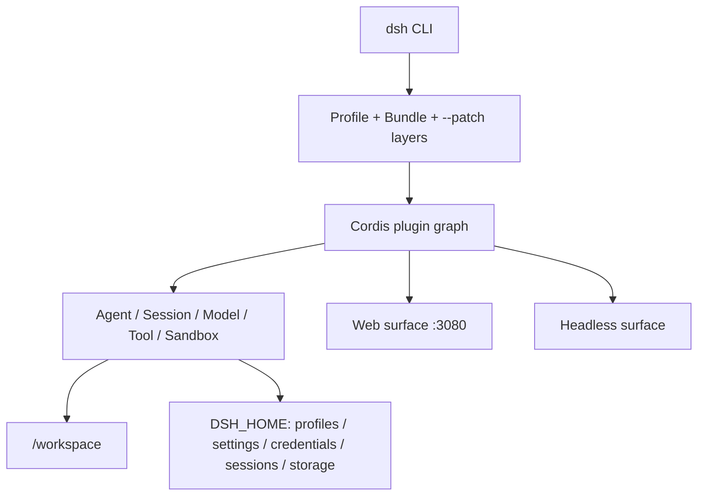

# DeepSeek Harness Docker

这是一个可直接构建的 DeepSeek Harness 社区容器方案，默认运行官方 `@deepseek-ai/dsh` 的 Web UI。它不构建或修改 DeepSeek Harness 源码，只把官方 npm 发行物装入一个精简、非 root 的 Node.js 24 运行时。

> 当前基线：`@deepseek-ai/dsh@0.1.0-rc.6`。DeepSeek Harness 仍处于 RC 阶段；升级前应重新完成本文的构建和 Smoke Test。

`0.1.0-rc.6` 直接对应构建时官方 npm Registry 的 `@deepseek-ai/dsh` 最新发行物，并非本项目自定义版本。上游公开 `master` 当时仍标记 `rc.5`；本项目封装 npm 成品而不从源码构建，因此以可安装的官方发行物为基线，并故意不发布漂移的 Docker `latest` 标签。

📖 延伸阅读：[DeepSeek Harness GitHub 仓库深度解析](https://aik8s.run/ai-k8s/rag-agent/deepseek-harness-repository-analysis/) · [Docker、Compose 与 Helm 部署实战](https://aik8s.run/ai-k8s/rag-agent/deepseek-harness-runtime-containerization/)


## 项目状态

### 能力 · 状态 · 验证结果
- **能力**: Dockerfile · **状态**: 可用 · **验证结果**: `linux/arm64`、`linux/amd64` 构建与原生 PTY 实际启动均已验证
- **能力**: Docker Compose · **状态**: 可用 · **验证结果**: Web 200、healthy、回环端口、重启持久化已验证
- **能力**: Helm · **状态**: 可用 · **验证结果**: 单副本 StatefulSet、PVC、Headless Service、NetworkPolicy；`helm lint --strict` 通过
- **能力**: Web UI · **状态**: 本机单用户 · **验证结果**: 无认证；禁止直接暴露到局域网或公网
- **能力**: Headless · **状态**: 可用 · **验证结果**: 运行时注入 provider Secret；需在目标环境验证实际模型调用和沙箱

## DeepSeek Harness 深入分析

本节是配套技术文章的精简版。Cordis 架构、Agent 轮次和事件溯源持久化见 [GitHub 仓库深度解析](https://aik8s.run/ai-k8s/rag-agent/deepseek-harness-repository-analysis/)；镜像设计、安全模型和容器验证矩阵见 [Docker、Compose 与 Helm 部署实战](https://aik8s.run/ai-k8s/rag-agent/deepseek-harness-runtime-containerization/)。

### 它是什么，不是什么

[DeepSeek Harness](https://github.com/deepseek-ai/deepseek-harness) 不是 DeepSeek 模型权重或推理引擎，而是一套 TypeScript AI Agent Runtime。它把模型适配、会话、工具、权限、工作区、插件、Web UI 与 Headless 入口装配在一起，最终发布为 [`@deepseek-ai/dsh`](https://www.npmjs.com/package/@deepseek-ai/dsh) CLI。更合适的专题归类是“AI Agent Runtime 的云原生化”，而不是“LLM 推理部署”。

截至 2026-08-13，上游仓库还没有 Dockerfile、Compose 或 Kubernetes 清单；同时 [`CONTRIBUTING.md`](https://github.com/deepseek-ai/deepseek-harness/blob/master/CONTRIBUTING.md) 明确表示暂不接受外部 Pull Request，并鼓励社区创建生态项目和教程。因此本项目采用独立社区实现，而不冒充官方镜像。

### 运行时分层



1. **CLI 与 Profile。** `dsh web` 是 Web profile 的快捷入口，`dsh --profile headless` 则走一次性或自动化场景。Profile 不是一份封闭配置，而是基础 bundle、界面 bundle、用户 patch 和命令行 `--patch` 按顺序叠加的结果。
2. **Cordis 组合层。** Harness 通过 Cordis Loader 把模型、会话、工具、Web Server、目录选择器等能力装成插件图；依赖注入决定激活顺序，配置 patch 通过稳定 `id` 覆盖目标行。本项目没有 fork 源码，而是复用这条官方扩展缝隙覆盖容器监听地址。
3. **Agent 核心。** 模型路由、系统提示词、会话持久化、工具调用、目标/计划、子 Agent 与工作区都在 Host 侧组合。Web 只是浏览器客户端，不是另一个 Agent 实现。
4. **Surface。** Web surface 提供浏览器交互，Headless surface 适合 CLI、CI 和批处理。二者共享核心插件与 `$DSH_HOME` 数据模型。

### 数据与持久化边界

`DSH_HOME` 是容器化的关键边界。本项目显式设为 `/home/node/.dsh`，其中会出现：

- `profiles/`：profile 的包清单、Cordis 配置和用户 patch；
- `settings.yaml` 与凭据文件：模型设置及 Secret 引用/托管凭据；
- `sessions/`：会话日志；
- `storages/`：Workspace 等领域状态。

工作代码位于 `/workspace`，与内部状态卷分离。Compose 使用 `dsh-home` 命名卷加工作区 bind mount；Helm 使用 `dsh-home` PVC，并允许通过 `workspace.existingClaim` 挂载另一块工作区 PVC。这个分离让镜像可以重建，而会话与配置不会随容器消失。

### 为什么容器化并不只是 `npx`

### 难点 · 上游行为 · 本项目决策
- **难点**: Node 版本 · **上游行为**: 要求 Node 22.19+ 或 24+ · **本项目决策**: 固定 Node 24 slim
- **难点**: 原生依赖 · **上游行为**: `node-pty` 在部分架构没有 prebuild · **本项目决策**: 多阶段构建，builder 带 `node-gyp` 工具链，runtime 不带编译器
- **难点**: Web 监听 · **上游行为**: CLI 主动拒绝 `--host 0.0.0.0` · **本项目决策**: 使用 Cordis overlay；宿主端口只能绑定 `127.0.0.1`
- **难点**: Web 安全 · **上游行为**: 当前无 TLS、认证和 Origin 策略，可触发代码执行 · **本项目决策**: 不提供 Ingress/LoadBalancer；Compose 回环发布；Helm 默认拒绝 Pod 入站
- **难点**: HMR · **上游行为**: 启动后挂载配置 watcher，需要 Node internals · **本项目决策**: 仅给 DSH 主进程传 `--expose-internals`，不通过 `NODE_OPTIONS` 传播给 Agent 子进程
- **难点**: 目录选择器 · **上游行为**: 浏览模式以 `os.homedir()` 为首页 · **本项目决策**: 将 `HOME` 指向可写 `/workspace`，避免只读 `/home/node` 的 EROFS
- **难点**: 信号和子进程 · **上游行为**: Agent 会创建 shell/PTY 子进程 · **本项目决策**: 使用 `tini` 转发信号和回收孤儿进程
- **难点**: 权限 · **上游行为**: 工具需要工作区写入，但不应获得宿主权限 · **本项目决策**: UID 1000、只读根文件系统、drop ALL、no-new-privileges、最小挂载

这里最需要强调的是 Web 监听：Docker bridge 端口转发要求容器进程监听非 loopback 地址，但 Harness 的 CLI 正是为了防止未认证 RCE 被误暴露而禁止 `--host 0.0.0.0`。本项目只在容器内部用官方 patch 机制改监听地址，并把安全责任收回到部署边界：Compose 只发布 `127.0.0.1`，Kubernetes 只建议 `kubectl port-forward`。如果把它改成 `-p 3080:3080`、NodePort、LoadBalancer 或公开 Ingress，就破坏了这个安全模型。

### 容器与 Harness 沙箱的关系

容器不是 Harness 内部权限系统的替代品，两层保护的对象不同：

- Docker/Kubernetes 限制进程能看到哪些宿主目录、Linux capabilities 和资源；
- Harness 沙箱限制 Agent 工具在已进入容器的文件系统中能够执行什么。

Linux Landlock、用户命名空间和原生 helper 的可用性会受宿主内核与容器运行时影响。本项目不会用 `--privileged`、Docker socket 或额外 capabilities 掩盖沙箱失败。发布前除“页面能打开”外，还必须在目标平台验证一次真实 bash/文件工具调用。

### 为什么 Kubernetes 使用 StatefulSet

Harness 的 profile、模型设置、凭据、会话和 Workspace 索引都具有状态。单用户 Web 又不适合在没有会话协调的情况下横向扩容。因此 Helm Chart 固定一个 StatefulSet 副本：稳定地挂载 `dsh-home` PVC，升级时保留状态，卸载时保留 PVC，并明确拒绝把“加 replicas”伪装成高可用。未来只有在上游提供认证、多租户隔离和共享/并发安全的状态后端后，才适合讨论多副本服务化。

## 为什么不只是写 `FROM node` + `npx`

这个镜像处理了最容易漏掉的四个容器边界：

- 固定 DSH 版本，并在构建时校验实际 CLI 版本；
- 固定 pnpm 版本，使 `dsh plugin add` 能在运行时管理社区插件；
- 使用非 root 用户和 `tini`，正确处理 Agent 启动的子进程与退出信号；
- 把配置、凭据、会话和存储统一持久化到 `/home/node/.dsh`；
- 把容器用户的交互主目录指向 `/workspace`，让 Web 目录选择器的新建操作落在可写工作区；
- 通过容器专用 Cordis overlay 监听容器网络，同时只把宿主端口发布到 `127.0.0.1`。

DeepSeek Harness Web 当前没有 TLS、认证或 Origin 策略，Web API 还可以执行代码。因此本方案是**本机单用户开发环境**，不是可直接暴露到局域网或公网的服务。

## 快速开始

在本目录执行：

```bash
docker compose pull
DSH_WORKSPACE=/absolute/path/to/your/project docker compose up -d --no-build
docker compose ps
```

浏览器打开 <http://127.0.0.1:3080>，在设置页配置模型和凭据。侧边栏的“浏览器”按钮会在 Harness WebUI 内直接打开可交互的容器 Chromium；配置和浏览器 Profile 写入命名卷 `dsh-home`，重建容器后仍会保留。

默认镜像为 Docker Hub 上的 [`runzhliu/deepseek-harness:0.1.0-rc.6`](https://hub.docker.com/r/runzhliu/deepseek-harness)。Compose 同时保留 `build` 配置，方便审查并从本目录复现镜像；如需本地构建，执行 `docker compose build --pull` 后再启动。

### WebUI 内置浏览器

镜像内置 Debian Chromium、中文字体、Xvfb/Openbox 桌面和 noVNC。公开插件 `@runzhliu/dsh-browser-desktop` 通过 Harness 的 `sidebar.footer.action` 与 `shell.overlay` 扩展点提供始终可见的“打开浏览器”入口，点击后直接在 WebUI 内嵌可交互桌面，也可以选择新窗口打开 <http://127.0.0.1:6080/vnc.html?autoconnect=1>。内嵌面板默认占页面约 68%，可拖动标题栏移动、拖动右下角缩放，并支持最大化/还原。插件同时注册 `browser_open` Agent 工具；在对话中说“用浏览器打开 https://example.com”会创建并激活 Chromium 标签页，然后自动展开内嵌面板。浏览器意外退出或关闭后会自动重启，Profile 持久化到 `/home/node/.dsh/chrome-profile`。


_实际运行效果：浏览器浮窗位于 Harness WebUI 内，图中打开的是 DeepSeek Harness 的公开 GitHub 仓库。_

该实现参考了 [`docker-antigravity`](https://github.com/runzhliu/docker-antigravity) 的可视桌面思路，但没有采用其 `amd64` 基础镜像和 Selkies，而是使用 Debian 原生架构软件包，因此 Apple Silicon 与 x86 Linux 均可运行。6080 与 3080 一样只绑定宿主机回环地址；noVNC 当前没有认证，不能暴露到局域网或公网。

```bash
docker compose exec deepseek-harness chromium-docker --version
docker compose exec deepseek-harness \
  chromium-docker --headless=new --dump-dom https://example.com
```

Compose 为 Chromium 配置了 1GB `/dev/shm`。启动器只对浏览器进程附加 `--no-sandbox`，以适配容器现有的 `cap_drop: ALL` 和 `no-new-privileges` 策略，不会放宽整个容器的权限。Agent 与脚本仍可通过 `chromium-docker --headless=new` 做无头渲染。

### 独立安装浏览器插件

插件已经按 DSH bundle 规范拆到 [`plugins/dsh-browser-desktop`](plugins/dsh-browser-desktop/README.md)，可独立打包：

```bash
npm pack ./plugins/dsh-browser-desktop --pack-destination /tmp
dsh plugin --profile web add /tmp/runzhliu-dsh-browser-desktop-0.1.0.tgz
```

发布到 npm 后可直接执行 `dsh plugin --profile web add @runzhliu/dsh-browser-desktop`。该 npm 包只负责 Harness Host/WebUI 集成，不会自行安装 Chromium、Xvfb 或 noVNC；本仓库 Docker 镜像是完整的参考运行时。DeepSeek Harness 当前通过 npm/GitHub 和 `dsh-plugin` GitHub topic 发现社区插件，并没有单独的审核型插件市场提交流程。

本公开分支不打包任何公司内部模型、凭据、Skill 或个人工作区挂载。模型在 Harness 设置页配置；额外凭据和私有扩展应放在运行时 Secret、被忽略的 `.env` 或本机 `compose.local.yaml` 中。

查看日志和停止服务：

```bash
docker compose logs -f deepseek-harness
docker compose down
```

`docker compose down` 不删除命名卷。只有明确执行 `docker compose down --volumes` 才会删除持久化的配置、凭据和会话。

## 直接使用 Docker

构建镜像：

```bash
docker build -t runzhliu/deepseek-harness:0.1.0-rc.6 .
```

启动 Web UI：

```bash
docker volume create dsh-home
docker run --rm \
  --name deepseek-harness \
  --publish 127.0.0.1:3080:3080 \
  --publish 127.0.0.1:6080:6080 \
  --shm-size 1g \
  --mount type=volume,src=dsh-home,dst=/home/node/.dsh \
  --mount type=bind,src="$PWD",dst=/workspace \
  runzhliu/deepseek-harness:0.1.0-rc.6
```

不要把端口参数改成 `-p 3080:3080`，也不要把它部署到公开 Ingress。那会把一个没有认证、具备代码执行能力的接口暴露给网络。

## Headless 模式

镜像的入口等价于执行 `dsh`，因此可以用运行参数覆盖默认 Web 命令：

```bash
docker run --rm \
  --env DEEPSEEK_API_KEY \
  --mount type=volume,src=dsh-home,dst=/home/node/.dsh \
  --mount type=bind,src="$PWD",dst=/workspace \
  runzhliu/deepseek-harness:0.1.0-rc.6 \
  --profile headless "summarize this repository"
```

API Key 只应在运行时通过环境变量、Secret 或 Web 设置传入，不能写进 Dockerfile、镜像层或构建参数。

## Kubernetes / Helm

`charts/deepseek-harness` 使用单副本 StatefulSet。`/home/node/.dsh` 由 PVC 持久化，工作区可以使用独立的现有 PVC；Chart 不创建 Ingre