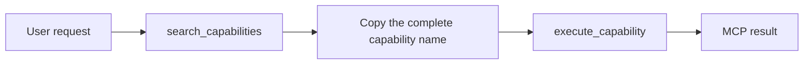
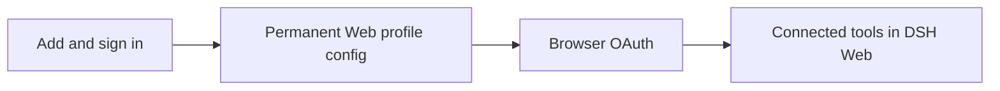

# dsh-oauth-mcp-client

An OAuth 2.1 Streamable HTTP MCP client plugin for
[DeepSeek Harness](https://github.com/deepseek-ai/DeepSeek-Harness).

It extends the native `dsh-mcp-client` connection flow with PKCE, dynamic
client registration, browser authorization, a loopback callback, persistent
token storage, reconnect handling, and MCP tool registration. The bundled
configuration connects to the Springbrand production MCP Gateway.

This plugin is maintained by [SpringBrand](https://springbrand.ai), an
AI-assisted marketplace for business services. See the
[SpringBrand DeepSeek Harness page](https://springbrand.ai/deepseek-harness)
for product information.

## Features

- OAuth 2.1 authorization code flow with PKCE
- Dynamic OAuth client registration
- Browser login with a loopback callback
- Token and client metadata storage through the DSH credential service
- Streamable HTTP transport with automatic reconnects
- MCP tool discovery, registration, and execution
- DSH Web connection management with live status and capability discovery
- One-click persistent connection setup followed by browser OAuth

## Requirements

- Node.js 22.19 or later
- Git
- A browser for the first OAuth login

## Install

Clone and build the plugin:

```sh
git clone https://github.com/springbrand-lab/dsh-oauth-mcp-client.git
cd dsh-oauth-mcp-client
corepack enable
pnpm install
pnpm build
```

Install the built checkout into a DSH profile and start DSH:

```sh
PLUGIN_DIR="$PWD"
npx --yes @deepseek-ai/dsh@latest plugin --profile web add "$PLUGIN_DIR"
npx --yes @deepseek-ai/dsh@latest web
```

This repository is not published to npm, so installation currently uses the
local checkout. Adding the bundle to the profile also adds the bundled
Springbrand MCP connection; there is no separate MCP registration step.

The first startup opens a browser for Springbrand login and consent. After
authorization, open **Settings → Plugins → MCP Connections** to see the live
connection status and registered capabilities. You can also use these tools to
verify the bundled connection:

- `mcp__springbrand__search_capabilities`
- `mcp__springbrand__execute_capability`

## Use

Ask the agent to search the Springbrand capability catalog, for example:

```text
Search the Springbrand marketplace for resources and list the first 10.
```

The expected call flow is:



When calling `execute_capability`, use the complete `name` returned by
`search_capabilities`, such as
`platform:springbrand@0:springbrand.resources.list`. Do not replace it with
the shorter `action_id`, such as `springbrand.resources.list`.

The plugin adds this tool-selection guidance to the agent automatically, so a
normal user request is sufficient; manual tool invocation is not required.

## Manage connections in DSH Web

Open **Settings → Plugins → MCP Connections**, enter a unique server name and
the server's HTTPS MCP URL, then select **Add and sign in**. Complete the OAuth
flow in the browser that opens. DSH loads the new connection and the page shows
its live status and actual registered tools. Select **Remove** on a connection
to unload its tools and remove or disable it in the permanent profile.

The button writes the connection permanently to
`~/.dsh/profiles/web/cordis.patch.yml`. Restarting DSH keeps the connection;
there is no temporary `--patch` command.



## Configuration

The bundled defaults are defined in
[`springbrand.cordis.yml`](./springbrand.cordis.yml):

### Field · Description · Default
- **Field**: `serverName` · **Description**: Namespace used in registered DSH tool names · **Default**: `springbrand`
- **Field**: `url` · **Description**: HTTPS Streamable HTTP MCP endpoint · **Default**: `https://connector.springbrand.ai/mcp`
- **Field**: `credentialRef` · **Description**: DSH credential reference · **Default**: `SPRINGBRAND_MCP_OAUTH_PRODUCTION`
- **Field**: `scope` · **Description**: Optional OAuth scope · **Default**: Discovered from the server
- **Field**: `callbackPort` · **Description**: Loopback callback port; `0` selects a free port · **Default**: `0`
- **Field**: `authorizationTimeoutMs` · **Description**: Browser authorization timeout · **Default**: `300000`
- **Field**: `toolCallTimeoutMs` · **Description**: Timeout for one MCP tool call · **Default**: `60000`
- **Field**: `failOnStartupError` · **Description**: Fail activation when the first connection fails · **Default**: `true`
- **Field**: `reconnect` · **Description**: Exponential reconnect policy · **Default**: Enabled

## Manual configuration

The Web page is the default setup path. To configure a connection manually,
add it to the same permanent Web profile file at
`~/.dsh/profiles/web/cordis.patch.yml`:

```yaml
- insert:
    - id: my-oauth-mcp
      name: '@dsh-external/dsh-oauth-mcp-client'
      config:
        serverName: my-mcp
        url: https://mcp.example.com/mcp
        credentialRef: MY_MCP_OAUTH
        failOnStartupError: true
```

The server must support OAuth and MCP Streamable HTTP. Its first connection
opens the browser authorization flow. `serverName` must be unique within the
DSH process and becomes part of the registered tool names, for example
`mcp__my-mcp__search`.

## Security notes

- OAuth state is stored through the DSH credential service, not in this
  repository.
- The callback listener binds to the local loopback interface.
- Do not configure an `Authorization` header; the OAuth client owns it.
- Never commit access tokens, refresh tokens, or exported credential data.

## Development and self-check

```sh
pnpm test
pnpm typecheck
pnpm build
pnpm pack --dry-run
```

For a DSH load-level check, install the checkout into a profile and start it.
Complete the OAuth login when prompted:

```sh
PLUGIN_DIR="$PWD"
npx --yes @deepseek-ai/dsh@latest plugin --profile headless add "$PLUGIN_DIR"
npx --yes @deepseek-ai/dsh@latest --profile headless "hi"
```

## Ecosystem metadata

- Package name: `@dsh-external/dsh-oauth-mcp-client`
- Discovery topic: `dsh-plugin`
- Directory: [Awesome DSH Plugins](https://github.com/AdamPlatin123/awesome-dsh-plugins)