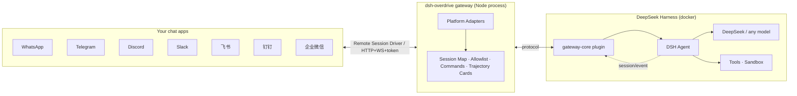

# ⚡ dsh-overdrive

> **The OpenClaw of DeepSeek Harness — turn DSH into the chat agent you can see thinking, ready in one command.**

`dsh-overdrive` is the **Hermes Agent / OpenClaw alternative built on DeepSeek Harness** — bridging into **WhatsApp · Telegram · Discord · Slack · 飞书 · 钉钉 · 企业微信**, with the difference they don't have: **every thought and tool call is visible inside the chat**, and dangerous operations always wait for your tap.

## Why not just OpenClaw?

Hermes / OpenClaw give you a terminal agent behind 20+ chat channels — but it's a **black box**. You see the answer, not the work.

DSH's append-only session log is the one thing they can't copy. `dsh-overdrive` makes that power **chat-native**:

- 🧠 **See it think** — `/trace` replays the agent's full reasoning & tool-call trajectory as a summary card, right in the chat
- 🤖 **Command a team** — `/task` spawns parallel subagents, `/cron 0 9 * * * …` schedules recurring jobs on a built-in scheduler
- 🔒 **You approve the dangerous stuff** — a risky tool call pauses until you tap **✅ Approve / 🚫 Reject** (native buttons on Telegram / Discord / Slack / WhatsApp)
- 🚀 **One command to deploy** — `docker compose up`, scan a QR, start chatting. No public URL needed for most platforms.

## What it looks like

  

As plain text / 纯文本版

```
You:  帮我看看这个项目有多少个包
Agent:
       📋 Trajectory (2 steps)
       🧠 Analyzing message
       🛠️ mock.tool: echo
       ✅ Mock agent received: 帮我看看这个项目有多少个包

You:  /task 写一句营销口号
Agent:
       🤖 Subagent spawned
       ✅ Task done 5c399346…

You:  /cron 0 9 * * * 每天给我一条技术新闻
Agent:
       ⏰ Cron job registered

You:  dangerous rm -rf /
Agent:
       ⚠️ Approval required: run dangerous operation (valid 120s)
       [✅ Approve] [🚫 Reject]   ← one tap, the agent continues or stops
```

🎬 Full demo script → docs/demo.md

Follow the 3-minute script in [docs/demo.md](docs/demo.md): chat → `/trace` replay → `/task` subagent → `/cron` schedule → approval tap → wrap-up.

## Supported platforms

### Platform · Integration · Status
- **Platform**: **Telegram** · **Integration**: Bot API (long-polling) · **Status**: ✅ verified on real DSH (2026-08-16)
- **Platform**: **WhatsApp** · **Integration**: Baileys + QR pairing, native interactive buttons · **Status**: ✅
- **Platform**: **Discord** · **Integration**: Bot token, native buttons · **Status**: ✅
- **Platform**: **Slack** · **Integration**: Socket Mode (no public URL) · **Status**: ✅
- **Platform**: **飞书 Feishu** · **Integration**: Official SDK, WS long-connection · **Status**: ✅
- **Platform**: **钉钉 DingTalk** · **Integration**: Stream mode (WebSocket, no public URL) · **Status**: ✅
- **Platform**: **企业微信 WeCom** · **Integration**: Callback API (AES) · **Status**: ✅
- **Platform**: CLI · **Integration**: stdin/stdout (dev & E2E) · **Status**: ✅

## Quick start

**Docker — one command (recommended):**

```bash
git clone https://github.com/temotee2103/dsh-overdrive && cd dsh-overdrive
cp deploy/.env.example .env        # fill DEEPSEEK_API_KEY + TELEGRAM_BOT_TOKEN
docker compose -f deploy/docker-compose.yml up -d --build
# Console http://localhost:3190/   DSH Web UI http://localhost:3080/
```

**Already running DSH? One line:**

```bash
npx dsh-overdrive-setup        # guided setup: API key + platform tokens (verified live)
dsh plugin --profile web add @dsh-overdrive/gateway-core   # plugin
npx dsh-overdrive-gateway                                   # gateway
```

First message to your bot? Run `/help` inside the chat. Full options: [docs/quickstart.md](docs/quickstart.md)

## Don't code? Do this.

No terminal skills needed. dsh-overdrive is designed to be **installed by one person, used by everyone**.

1. Ask a tech-savvy friend for **10 minutes**
2. Send them this:

   **macOS / Linux:**
   ```bash
   curl -fsSL https://raw.githubusercontent.com/temotee2103/dsh-overdrive/main/install.sh | bash
   ```
   **Windows:** download [install.ps1](https://raw.githubusercontent.com/temotee2103/dsh-overdrive/main/install.ps1), right-click → "Run with PowerShell" (or double-click)

3. The installer asks 3 questions (API key → platform → bot token) and starts everything for you
4. From then on **you** just chat: send messages, `/help` for commands, tap **✅ Approve / 🚫 Reject** for dangerous actions

> 中文：不需要会写代码。找懂行的朋友花 10 分钟装好，之后你只需要聊天：发消息、`/help`、危险操作点【同意/拒绝】。

## Chat commands

### Command · What it does
- **Command**: `/help` · **What it does**: List commands
- **Command**: `/trace` · **What it does**: Replay the latest turn's trajectory (thoughts + tool calls)
- **Command**: `/task ` · **What it does**: Spawn a subagent
- **Command**: `/cron <min hour dom mon dow> ` · **What it does**: Schedule a recurring job (built-in 5-field scheduler)
- **Command**: `/agents` · **What it does**: Subagent status (simplified)
- **Command**: `/new` · **What it does**: Reset the conversation

## Architecture



`packages/gateway-core` is a **DSH plugin** (`dsh.bundle.patch` ready) exposing a Remote Session Driver API; `packages/gateway` is a standalone multi-platform gateway. The "soul" — trajectory, approval, multi-agent — lives in the plugin, so the narrative survives plugin-API churn.

## Development

```bash
npm install
npm run build
npx vitest run     # 128+ unit tests
npm run e2e        # full-stack mock E2E (message / approval / allowlist)
```

## Docs

- 📦 [Quick start](docs/quickstart.md) · 🎬 [Demo script](docs/demo.md) · 📣 [Launch plan](docs/launch.md) · 📤 [npm publishing](docs/publish.md)
- 🧪 [Platform acceptance checklist](docs/smoke-platforms.md)
- 📐 [Design spec](docs/superpowers/specs/2026-08-16-dsh-overdrive-design.md) · 🔭 [DSH interface research](docs/interface-report.md)

## Roadmap

- [x] M1–M2b: protocol, real DSH bridge, international platforms
- [x] M3: 飞书 / 钉钉 / 企业微信
- [x] M4: trajectory cards, `/task` `/cron`, streaming typing, media, WhatsApp native buttons
- [x] M5: docker-compose, web console, MIT + CI, npm distribution
- [ ] v0.2: personal WeChat (experimental), ASR voice transcription, Feishu/DingTalk native cards