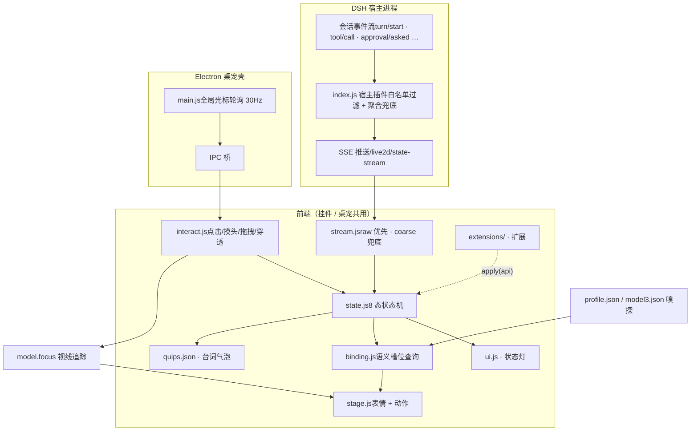

# Live2D 监控面板・看板娘桌宠（dsh-live2d-companion）

[DeepSeek Harness](https://github.com/deepseek-ai/dsh)（下称 DSH）的 Live2D 状态监控面板：让一只 Live2D 小人住进你的 DSH Web GUI，实时反映 AI 的工作状态——思考时歪头、工作时兴奋、等你确认时招手、闲着没事会打瞌睡。

**双形态**：网页右下角挂件 / Windows 桌面桌宠（Electron 透明置顶窗口），同一份前端内核驱动。

另提供 [`standalone/`](standalone/) 独立运行入口：不启动 DSH 也能使用同一套桌宠渲染、模型面板和 Codex/OpenCode 状态联动。独立版仍不包含模型、Cubism Core、Electron 二进制或第三方角色 Prompt，详细许可边界与安装步骤见 [`standalone/README.md`](standalone/README.md)。

## 特性

- 🎭 **AI 状态同步**：订阅 DSH 会话事件流，7 态状态机（空闲/思考/工作/等待确认/报错/完成/睡眠）+ 左上角**状态灯**（8 色小灯+文字常显，含离线检测）；**多任务并行时每会话一枚独立任务灯**（任务1·工作 / 任务2·待确认…），聚合主灯 + 分工小灯一目了然；任务完成后 6 秒转闲置、闲置 5 分钟自动收灯回收编号，会话复活自动重新上牌
- 🖱️ **丰富交互**：点击反应、双击卖萌、摸头害羞、拖拽搬家、缩放（挂件滚轮 / 桌宠 Ctrl+滚轮，拖拽期间自动锁定）、**全局视线跟随**（OS 层轮询光标，整屏追踪不限窗口）
- 💬 **气泡台词**：15 个台词池 70+ 条，状态轮播、时段问候、加班焦虑、深夜关怀
- ⚙️ **全配置化**：台词/节奏/行为阈值都在 `quips.json`（官方默认）；台词支持**多预设可视化编辑**（「词」按钮：另存为多份人设台词集、一键切换、池级恢复默认，保存即生效）
- 🐾 **桌面桌宠**：透明无边框置顶、鼠标穿透（不挡操作）、位置记忆、随 DSH 启停（心跳看门狗）、面板内双击确认主动退出
- 🧩 **多模型**：任何 Cubism 4/5 模型丢进 `model/` 目录即可接入；语义槽位 + 自动嗅探 + profile.json 绑定层，情绪表现零配置自适应
- 🖼️ **模型面板**：挂件旁静置自动隐藏的齿轮入口，扫描/切换/导入/预览模型，选择持久化，恢复默认无需改配置
- 🔌 **零侵入**：对 DSH 本体零修改，纯用户级 cordis patch 层挂载，DSH 升级免疫

## 架构

```
dsh 宿主进程
 └─ cordis patch 层（cordis.patch.yml insert 行）
     └─ index.js（宿主插件）
         ├─ prefix 路由 /live2d/*        → 静态资源（前端/模型/vendor）
         ├─ SSE  /live2d/state-stream    → session/event 白名单转发 + 聚合状态兜底
         ├─ exact /live2d/state|config   → 状态快照 / 模型配置
         ├─ exact /live2d/models         → 扫描 model/ 下全部模型（GET）
         ├─ exact /live2d/model          → 切换/恢复模型并持久化（POST）
         ├─ exact /live2d/import         → 上传模型文件（POST）
         ├─ exact /live2d/profile        → 绑定档案写/删（POST，白名单清洗）
         ├─ exact /live2d/quips          → 台词预设存/切/删（POST，写 quips-presets/）
         ├─ exact /live2d/quips-config   → 预设清单与生效指针（GET）
         ├─ tapIndex 注入 <script>       → 网页挂件（widget: false 可关）
         └─ spawn Electron 桌宠          → 随宿主启停（pet: false 可关）

浏览器挂件 / Electron 桌宠
 └─ boot.js（ES Module 入口装配）+ src/ 职能模块：
     ├─ config.js    → 环境常量 / localStorage / 台词库加载
     ├─ binding.js   → 语义槽位绑定（profile 覆盖 + model3.json 嗅探）
     ├─ ui.js        → 容器 / 气泡 / 状态灯
     ├─ stage.js     → PIXI 渲染 / 模型加载 / 布局收身 / 缩放
     ├─ state.js     → 8 态状态机（灯 + 表情 + 动作 + 台词轮播）
     ├─ interact.js  → 点击/摸头/拖拽/缩放/穿透/全局视线
     ├─ stream.js    → SSE 客户端（raw 优先 / coarse 兜底 / 离线检测）
     ├─ panel.js     → 模型面板（入口/列表/切换/查看/导入/绑定编辑器）
         └─ pixi.js + pixi-live2d-display + Live2D Cubism Core
```

宿主只转发白名单原始事件（`turn/start`、`tool/call`、`approval/asked`……），状态判定全在前端——调行为不需要重启宿主。前端模块间不互相 import，经共享上下文 `ctx` 在运行期取用彼此能力，依赖方向即 `boot.js` 的初始化顺序。

### 工作流程



## 安装

> 需要：已安装 DSH（`dsh web` 可用）、Node.js ≥ 18。

**1. 一键安装（官方插件通道）**

```powershell
dsh plugin --profile web add github:Tisitan/dsh-live2d-companion
```

本插件声明了 `dsh.bundle` 清单，`dsh plugin add` 会自动登记为 profile 组合层，无需手动接线。

**2.（可选）调整开关**

默认网页挂件开、桌宠关。要改就在 `$env:USERPROFILE\.dsh\profiles\web\cordis.patch.yml` 追加同 id 覆盖行：

```yaml
- insert:
    - id: live2d-companion
      name: 'dsh-live2d-companion'
      config:
        widget: false  # 关闭网页挂件
        pet: true      # 桌面桌宠随 DSH 自启
```

patch 文件热重载，保存即生效。

**开发者路径**：`git clone` 后 junction 到 `<DSH_HOME>\profiles\web\node_modules\dsh-live2d-companion`，再按上方注册 patch 行。

**3. 放入模型**

```
public/model/<模型名>/xxx.model3.json   ← 连同贴图、 motions、expressions 整目录放入
```

然后在 patch config 里指认：`model: '<模型名>/xxx.model3.json'`（默认 `nori/ARGNori.model3.json`）。

> 📦 **模型获取**：本仓库不分发任何模型文件。默认适配的 Nori 模型请前往 **I_NORI 群（1041616195）** 群文件自行获取；其他任何 Cubism 4/5 模型也可直接放入使用。

**4. 下载 Cubism Core（许可要求，仓库不含）**

从 Live2D 官方下载并放入：

```
public/vendor/live2dcubismcore.min.js
# 官方地址：https://cubism.live2d.com/sdk-web/cubismcore/live2dcubismcore.min.js
```

**5.（桌宠）安装 Electron**

```powershell
cd pet
npm.cmd install
```

重启 DSH Web（或下次启动时），桌宠自动出现。

## 配置

### patch config（`cordis.patch.yml`）

### 键 · 默认 · 说明
- **键**: `model` · **默认**: `nori/ARGNori.model3.json` · **说明**: 模型路径（相对 `public/model/`）
- **键**: `widget` · **默认**: `true` · **说明**: 是否向 DSH 页面注入网页挂件
- **键**: `pet` · **默认**: `false` · **说明**: 是否随 DSH 自动拉起桌面桌宠
- **键**: `petDir` · **默认**: `./pet` · **说明**: Electron 壳目录

### quips.json（官方默认）+ 台词预设（用户自定义）

台词分两层，**官方默认永远只读**，用户自定义永不与上游更新冲突：

### 文件 · git · 说明
- **文件**: `public/quips.json` · **git**: ✅ 跟踪 · **说明**: 官方默认台词库（`pools` + `rotation` + `behavior`）
- **文件**: `public/quips.local.json` · **git**: ❌ 忽略 · **说明**: 活跃指针 `{ "active": "预设名" }`，决定哪份预设生效
- **文件**: `public/quips-presets/<名>.json` · **git**: ❌ 忽略 · **说明**: 用户台词集，可「另存为」任意多份（如不同模型各一份人设）

运行时合并：官方默认 ← 生效预设**逐池胜出**；预设未覆盖的池继续跟随上游默认（上游润色台词你照收）。

「词」按钮（齿轮与「?」之间）打开台词池编辑器：预设下拉切换生效集、逐池编辑（每行一句）、`·自定义` 标记与官方不同的池、「恢复默认」让单池回落官方、「另存为」冻结当前内容为新预设。保存写入预设文件并**立即生效**（不等 30 秒轮询）。

### 区 · 说明
- **区**: `rotation` · **说明**: 台词节奏：`holdMs`（单句停留）/ `intervalMs`（轮换间隔）/ `doneHoldMs`
- **区**: `behavior` · **说明**: 行为阈值：`sleepAfterMs`（闲置入睡）/ `seriousAfterMs`（加班严肃脸）/ `overtimeAfterMs`（加班焦虑）
- **区**: `pools` · **说明**: 15 个台词池：`thinking`/`working`/`done`/`waiting`/`error`/`overtime`/`sleeping`/`click`/`pat`/`drag`/`greet`/`greet_morning`/`greet_night`/`idle`/`busy`

模型切换也可以不改配置：URL 加 `?model=<模型名>/xxx.model3.json` 临时指定。

## 自带模型与绑定层

本插件**与模型解耦**：状态机驱动的是「语义槽位」，模型素材通过两级机制绑定到槽位上——

### 第一级：自动嗅探（零配置）

启动时前端会拉取模型的 `.model3.json`，解析 `FileReferences` 里的表情/动作清单，按关键词模糊匹配槽位（如文件名含 `shy`/`害羞` → 害羞位，含 `nod` → 点头位）。任何命名规范的 Cubism 模型丢进来即可获得完整情绪表现；匹配不到的槽位**静默跳过**，不会报错。

> 🌐 **生态惯例兼容**：自动呼吸依赖官方示例框架的 `Idle` 组惯例（绝大多数模型遵守）；点击反应池优先取官方示例惯例的 `Tap*` / `Reaction` / `Touch` 组并自动剔除生气动作。Live2D 官方并不规定动作组/表情的语义命名，故无标配模型一律可用下方编辑器手动绑定。

### 第二级：profile.json 精确覆盖（可选）

在模型目录放 `profile.json`（`model/<模型名>/profile.json`，随模型一起走），逐槽位钉死映射；写了的槽位覆盖嗅探结果，没写的继续走嗅探。

**表情槽位**（值为模型里的表情名）：

### 槽位 · 用途
- **槽位**: `default` / `happy` / `excited` · **用途**: 常态 / 完成 / 工作兴奋
- **槽位**: `shy` · **用途**: 摸头、被拖动
- **槽位**: `doubt` · **用途**: 思考、待确认
- **槽位**: `troubled` / `serious` · **用途**: 报错、加班焦虑 / 加班严肃
- **槽位**: `surprised` · **用途**: 睡醒惊醒
- **槽位**: `dark` / `sleep` · **用途**: 离线 / 打瞌睡

**动作槽位**（值为 `[动作组名, 组内序号]`）：

### 槽位 · 用途
- **槽位**: `think` / `excited` / `shake` · **用途**: 思考姿势 / 工作动作 / 摇头求确认
- **槽位**: `dizzy` / `nod` · **用途**: 报错转圈 / 完成点头
- **槽位**: `sleep` / `glitch` · **用途**: 打瞌睡循环 / 报错特效
- **槽位**: `clickPool` · **用途**: 点击反应随机池，二维数组

示例（Nori 模型的实际 profile）：

```json
{
  "expressions": {
    "default": "00_Default", "happy": "13_Happy", "excited": "01_KiraKira",
    "shy": "04_Shy", "doubt": "10_Doubt", "troubled": "09_Troubled",
    "serious": "12_Serious", "surprised": "14_Surprised",
    "dark": "05_Dark", "sleep": "Sleep"
  },
  "motions": {
    "think": ["Poses", 1], "excited": ["Reactions", 2], "shake": ["Reactions", 1],
    "dizzy": ["Reactions", 5], "nod": ["Reactions", 0],
    "sleep": ["Idle", 1], "glitch": ["Effects", 0],
    "clickPool": [["Reactions", 0], ["Reactions", 1], ["Reactions", 2]]
  }
}
```

调试时可在控制台看解析结果：`window.__l2d.binding`。

## 模型面板

挂件/桌宠右上角有一个悬浮齿轮按钮，鼠标不悬停时约 1.2 秒后自动隐藏；悬停模型区域或打开面板时重新出现。齿轮下方依次是「词」台词编辑器（自定义每个状态的随机台词，保存即生效）和「?」说明按钮（同显隐节奏，点开是基本操作速查卡）：

- 自动扫描 `public/model/` 下全部 `*.model3.json`
- 点击列表项即时切换当前挂件模型，无需刷新页面
- 每个模型右侧「查看」按钮，弹窗内嵌 Live2D 预览（隔离实例：不接 SSE/交互，状态由按钮手动驱动，8 态点哪个看哪个）
- 预览弹窗顶部「绑定」打开**状态直通绑定编辑器**：点上方状态按钮选目标（工作/闲置…），下方列出全部表情/动作素材按钮——点素材即在预览里试穿并记入草稿（角标「→ 工作」标出素材服役状态），「保存绑定」才写入模型目录 `profile.json` 并热生效到主窗；「恢复自动嗅探」删除档案回退。闲置/离线无动作位、共享脸槽（思考/等待）等情况界面会明确提示
- 「导入模型」选择模型文件夹（Chrome/Edge 支持目录选择；其他浏览器可多选文件后输入模型名），按文件逐个上传并自动切到导入后的 `.model3.json`
- 「恢复默认」清除面板选择，回到 `cordis.patch.yml` 里的 `model`
- 面板底部「帧率」下拉：满血（60/30/12）/ 均衡（30/12/6，默认）/ 省电（15/8/4）三档预设，常态/睡眠/离线帧率联动切换，立即生效并持久化到本机
- 面板选择保存在仓库根目录 `model-selection.json`（已 gitignore），下次启动 DSH 仍生效；该文件优先于 patch 默认值

面板和选择接口：

- `GET /live2d/models`：`{ current, defaultModel, models: [{ path, dir, file }] }`
- `POST /live2d/model`：body `{ "model": "<相对 model/ 的 .model3.json 路径>" }`
- `POST /live2d/model`：body `{ "reset": true }` 恢复 patch 默认模型
- `POST /live2d/import?model=<文件夹名>&path=<相对文件路径>`：body 为原始文件字节，单文件上限 128 MiB；路径经过校验，无法写出 `model/` 目录
- `POST /live2d/profile`：body `{ "dir": "<模型文件夹>", "profile": {...} }` 写绑定档案；`{ "dir": "...", "reset": true }` 删除档案恢复自动嗅探。档案经白名单形状清洗，写入范围锁死在 `model/<dir>/profile.json`
- `POST /live2d/quips`：台词预设三动作——`{ "save": "<预设名>", "data": {pools…} }` 新建/覆盖预设并设为生效；`{ "activate": "<预设名>" | null }` 仅切换生效预设；`{ "delete": "<预设名>" }` 删除预设。池数据逐池白名单校验，写入