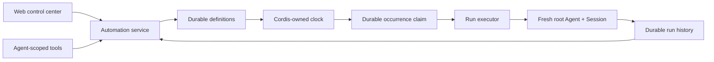

# ⏱️ dsh-automation

### *Run coding tasks on schedule. Manage them from Web or Agent.*

🕒 &nbsp;Need recurring or one-shot coding work to run later without relying on an old chat?
🧭 &nbsp;Need each unattended run to stay inside an explicit workspace and permission boundary?
🧾 &nbsp;Need to inspect what ran, which revision it used, and how it ended?

### ✨ dsh-automation turns all three requirements into one workflow.

Create and manage schedules from DSH Web or any eligible root Agent. Every
dispatched occurrence starts in a fresh root Agent and Session, then leaves an
auditable record.

**Self-contained task + schedule + permission boundary → fresh root Agent + fresh Session + durable run history**

[Why automation](#why-automation) · [Features](#features) · [Install](#install) · [Quick start](#quick-start) · [Safety](#a-schedule-is-not-permission) · [Technical details](#technical-details)


## 🎯 Why automation

DSH Core Schedule is the right tool for reminders in the current conversation: “come back to this Session in ten minutes.” `dsh-automation` handles a different job: “run this complete task independently every weekday and leave me a result I can inspect.”

###  · DSH Core Schedule · dsh-automation
- Execution context · **DSH Core Schedule**: Returns to the same live Agent · **dsh-automation**: Starts a fresh root Agent and Session
- Input · **DSH Core Schedule**: A follow-up inside existing context · **dsh-automation**: A saved, self-contained task
- Scope · **DSH Core Schedule**: Current Session Log · **dsh-automation**: One canonical DSH workspace
- History · **DSH Core Schedule**: Conversation events · **dsh-automation**: Definition revisions and durable run records
- Best for · **DSH Core Schedule**: Reminders and same-chat follow-ups · **dsh-automation**: Repeated or one-shot standalone coding work

If a task depends on unstated chat history, needs an interactive approval halfway through, or should react to a file, HTTP, or process condition rather than time, it is not a good automation yet.

## ✨ Features

### 🕹️ One control plane, two ways in

- **DSH Web:** use the **Automations** conversation tab to create a rule, pause or resume it, run it now, delete it, and inspect recent runs.
- **Any eligible root Agent:** ask in natural language. Six scoped tools let the Agent manage automations only for its exact workspace.

There is no separate bot, daemon UI, or third-party scheduler to operate.

### 📅 Schedules people can read

Create a one-shot, fixed-interval, daily, or weekly rule. Daily and weekly schedules use an IANA time zone; the friendly form is normalized into a validated RFC 5545 RRULE for persistence and inspection.


### 🧼 A clean execution boundary every time

Each dispatched occurrence receives:

- a new Session ID and fresh root Agent;
- the saved prompt, not the source conversation history;
- the captured workspace, cwd, Agent preset, model target, and permission preset;
- an explicit `automation` message source containing the automation ID, run ID, and scheduled time;
- a terminal result derived from the actual DSH turn end, not merely “message delivered.”

### 🧾 History that explains failure as well as success

Runs progress through `queued`, `running`, and a terminal state such as `succeeded`, `failed`, `skipped`, or `cancelled`. Each record keeps its definition revision, prompt and target snapshot, scheduled time, result Session ID, bounded summary, and structured error.


Updating a definition increments its revision, so each retained run still identifies what it executed. Deleting the definition does not immediately erase those run records. Retention removes only the oldest terminal records; queued and running records are never pruned.

## ⚡ Install

Install the GitHub bundle into the DSH Web profile, then restart `dsh web`:

```bash
dsh plugin --profile web add github:titanwings/dsh-automation#v0.1.5
```

The version tag keeps the install reproducible; a reviewed commit SHA is equally valid. If you run DSH from its source checkout, use `pnpm dsh` in place of `dsh`.

Install from a local checkout

Node.js 22.19 or newer is required.

```bash
git clone https://github.com/titanwings/dsh-automation.git
cd dsh-automation
pnpm install
pnpm check

cd /path/to/deepseek-harness
pnpm dsh plugin --profile web add /absolute/path/to/dsh-automation
```

The repository ships its built Host and Web bundles. Git installation runs no
package build script and needs no `allowBuilds` entry.

## 🚀 Quick start

### 🖥️ From DSH Web

1. Open a Session attached to the workspace you want to automate.
2. Select **Automations** next to Chat and Trajectory.
3. Enter a self-contained task, schedule, IANA time zone, and permission boundary.
4. Use **Run now** once before relying on the schedule; inspect the resulting Session and run record.

### 💬 Ask an Agent

Once installed, eligible root Agents receive the management tools. For example:

```text
Create a read-only automation called "Weekday regression triage" for this workspace.
Run it Monday through Friday at 09:30 in Asia/Shanghai. Inspect the latest local test
evidence, identify regressions, and return a short report. Do not modify files.
```

### Tool · Purpose
- **Tool**: `automation_create` · **Purpose**: Create a workspace-bound standalone rule.
- **Tool**: `automation_list` · **Purpose**: Read rules, next occurrences, and recent history.
- **Tool**: `automation_update` · **Purpose**: Change name, prompt, cadence, permission, or active/paused state.
- **Tool**: `automation_run_now` · **Purpose**: Queue one manual occurrence with the same boundary.
- **Tool**: `automation_runs` · **Purpose**: Read bounded run history, errors, summaries, and Session IDs.
- **Tool**: `automation_delete` · **Purpose**: Delete the definition while retaining durable run records.

Plugin-level approval asks for human confirmation when an Agent creates or expands unattended future work. Read operations and a pause-only update do not add that extra approval step.

## 🧰 Good automation candidates

The best automations are repeatable, bounded, and easy to verify.

### Automation · Suggested boundary · Why it is useful
- **Automation**: Weekday regression triage · **Suggested boundary**: `read-only` · **Why it is useful**: Inspect local test evidence, group failures, and leave a concise diagnosis in a new Session.
- **Automation**: Weekly repository health report · **Suggested boundary**: `read-only` · **Why it is useful**: Review stale TODOs, dependency manifests, ignored failures, and test gaps without changing the tree.
- **Automation**: One-shot verification · **Suggested boundary**: `read-only` · **Why it is useful**: Recheck a flaky failure later and preserve evidence outside the current chat.
- **Automation**: Generated-code refresh · **Suggested boundary**: `workspace-write` · **Why it is useful**: Rebuild a known generated artifact, run focused checks, and report the exact diff.
- **Automation**: Maintenance fix window · **Suggested boundary**: `workspace-write` · **Why it is useful**: Reproduce one bounded issue, make the smallest verified fix, and stop when acceptance checks pass.

A strong task states the goal, evidence to inspect, allowed changes, verification, and stopping condition. Avoid prompts such as “continue what we discussed” or “fix everything”: scheduled runs do not inherit the conversation that created them.

## 🛡️ A schedule is not permission

Unattended coding needs a smaller trust boundary than an interactive chat. `dsh-automation` makes these constraints explicit:

- **No inherited authority.** A run receives no source-chat history, inbox, grant, or past approval.
- **Two permission modes only.** Rules may use `read-only` or `workspace-write`; unattended `danger-full-access` is not accepted.
- **Fail closed.** Each fresh Session uses approval policy `never`. A tool that still requires interactive approval fails instead of waiting forever or silently escalating.
- **Exact workspace scope.** Agent tools bind to the caller's canonical registered workspace; callers cannot supply an arbitrary target path.
- **Explicit capability allowlist.** The fresh Agent admits a small coding-tool set. Interactive questions, plans, goals, nested Agents, runtime plugin mounting, terminal/background jobs, recursive automation management, and unknown third-party tools are denied by an Agent-scoped final guard.
- **Loopback Web control.** The management RPC channel accepts loopback authority only.
- **Traceable origin.** The task enters the Session with `source.kind = automation`, plus the automation/run identity and scheduled time. It never impersonates a human message.
- **No blind retries.** Once an Agent may have produced side effects, the plugin does not automatically retry it.

These boundaries do not turn every third-party DSH tool into a sandbox. Foreground shell and network behavior still depends on the selected Agent preset, tool set, and DSH guards. Review a task with **Run now** before enabling unattended writes.

## 🔧 Technical details

### ⏱️ Scheduling and recovery semantics

### Situation · Behavior
- **Situation**: Interval · **Behavior**: Minimum five minutes; the first run occurs after one full interval, not immediately.
- **Situation**: Daily / weekly · **Behavior**: Evaluated at local `HH:mm` in an explicit IANA zone; nonexistent DST wall times are skipped rather than shifted.
- **Situation**: Overlap · **Behavior**: One active run per automation. A due occurrence is recorded as `skipped(overlap)` if its previous run is queued or running.
- **Situation**: Host restarts late · **Behavior**: Within the grace window (15 minutes by default), only the latest due occurrence can catch up. Older work is not replayed as a write backlog.
- **Situation**: Run timeout · **Behavior**: The Agent is cancelled after 60 minutes by default and the run is recorded as failed.
- **Situation**: Host crash · **Behavior**: Persisted `queued` or `running` records become `failed(host_interrupted)` on recovery; they are not secretly re-executed.
- **Situation**: Retry · **Behavior**: Manual **Run now** only. There is no automatic side-effect retry.

A deterministic occurrence key prevents the scheduler from dispatching the same recorded occurrence twice. This is an **at-most-once dispatch policy**, not a claim that external side effects are exactly once.

The DSH Host must be running for a task to start. Version 0.1 is not an operating-system daemon and does not coordinate multiple Hosts over one storage directory.

🏗️ Architecture

The product model is inspired by Codex [Scheduled tasks](https://learn.chatgpt.com/docs/automations), especially the distinction between returning to a chat and starting a standalone run. The implementation is native to DSH and Cordis; it does not copy Codex internals or patch DSH Core.



### Layer · Owns · Does not own
- **Layer**: Definition/run store · **Owns**: Durable facts and revision snapshots · **Does not own**: Timers or Agents
- **Layer**: Clock · **Owns**: Finding the next due occurrence · **Does not own**: Prompts, permissions, or execution
- **Layer**: Executor · **Owns**: One already-claimed fresh Agent run · **Does not own**: Schedule mutation
- **Layer**: Agent tools / Web RPC · **Owns**: Validated service calls · **Does not own**: Tables, timers, or direct Agent construction
- **Layer**: Web client · **Owns**: Native `conversation.view` presentation · **Does not own**: Authoritative due state

Cordis disposal stops the clock, cancels plugin-owned live handles, removes tools/RPC/UI, and closes storage without inventing a successful run. The full rationale and data model are in the [design document](docs/DESIGN.zh-CN.md).

### ⚙️ Configuration

The included `cordis.patch.yml` uses conservative defaults:

### Option · Default · Meaning
- **Option**: `maxConcurrentRuns` · **Default**: `2` · **Meaning**: Global execution capacity for this Host. Per-automation overlap is still disabled.
- **Option**: `runTimeoutMinutes` · **Default**: `60` · **Meaning**: Maximum wall-clock time for one fresh Agent run.
- **Option**: `misfireGraceMinutes` · **Default**: `15` · **Meaning**: How late the latest due occurrence may catch up after downtime.
- **Option**: `historyLimit` · **Default**: `200` · **Meaning**: Durable terminal-run retention per automation; active records are always kept.

Edit the plugin row in the deployment profile if you need different values. Increasing concurrency or timeout expands the amount of unattended work; treat those changes as policy decisions.

### 🚧 Current limits

Version 0.1 deliberately does not provide:

- same-chat heartbeats — use DSH Core Schedule;
- raw cron or arbitrary shell actions;
- unattended full access;
- automatic retry of a run that may have side effects;
- Git worktree creation or cleanup;
- multi-workspace targets, DAGs, or hidden cross-run memory;
- external email, SMS, or push delivery;
- a guarantee of exactly-once external side effects.

Only local execution is implemented. A stable DSH worktree lifecycle service should exist before a UI toggle claims worktree isolation.

### 🧪 Development

```bash
pnpm typecheck
pnpm test
pnpm build
# or all three
pnpm check
```

The package builds a Host ESM bundle and a Web client bundle for DSH's `window.__ModuleLoader__` contract. Tests cover recurrence and DST behavior, durable-domain invariants, Agent capability guards, scheduler overlap/recovery/retention, and client schedule/localization helpers.

## 📄 License

[MIT](LICENSE). This is an independent community plugin for DeepSeek Harness. “Codex” is referenced only to describe the product pattern that informed the design.