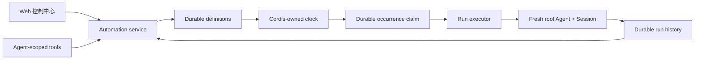

# ⏱️ dsh-automation

### *让 Coding 任务按计划在全新 Agent Session 中运行，并随时管理定时任务。*

🕒 &nbsp;想让重复或单次 Coding 任务稍后运行，又不依赖一段旧对话？
🧭 &nbsp;想让每次无人值守运行都守在明确的工作区与权限边界内？
🧾 &nbsp;想随时查清运行了什么、使用哪个 revision、最终如何结束？

### ✨ dsh-automation 把三项要求收进同一条工作流。

用户和 Agent 都可以在 DSH 中创建、管理、暂停、恢复和查看定时任务；每个真正
dispatch 的 occurrence 都会在全新 root Agent 与 Session 中启动，并留下可审计记录。

**完整任务 + 运行计划 + 权限边界 → 全新 root Agent + 全新 Session + 持久运行历史**

[为什么需要 Automation](#为什么需要-automation) · [核心能力](#核心能力) · [安装](#安装) · [快速开始](#快速开始) · [安全边界](#schedule-不是授权) · [技术细节](#技术细节)

[English](README.md) · **简体中文**


## 🎯 为什么需要 Automation

DSH Core Schedule 适合当前对话里的 reminder，例如“十分钟后回到这个 Session 继续检查”。`dsh-automation` 解决的是另一类问题：“每个工作日独立运行这份完整任务，并留下一条我可以检查的结果。”

###  · DSH Core Schedule · dsh-automation
- 执行上下文 · **DSH Core Schedule**: 回到同一个 live Agent · **dsh-automation**: 创建全新的 root Agent 与 Session
- 输入 · **DSH Core Schedule**: 已有上下文中的 follow-up · **dsh-automation**: 已保存、可独立理解的完整任务
- Scope · **DSH Core Schedule**: 当前 Session Log · **dsh-automation**: 一个 canonical DSH workspace
- 历史 · **DSH Core Schedule**: 对话事件 · **dsh-automation**: Definition revision 与 durable run record
- 最适合 · **DSH Core Schedule**: Reminder、同对话继续处理 · **dsh-automation**: 重复或单次的独立 Coding 任务

如果任务依赖没有写出来的历史对话、运行中途必须等待人工批准，或者应该由文件、HTTP、进程状态而不是时间触发，它现在还不适合做 automation。

## ✨ 核心能力

### 🕹️ 一个控制面，两种入口

- **DSH Web：**使用对话里的**自动化** Tab 创建规则、暂停或恢复、立即运行、删除，并检查最近运行。
- **任意符合条件的 root Agent：**直接用自然语言提出要求。六个 scoped tools 让 Agent 只能管理自己准确工作区内的 automation。

不需要再维护一个独立 bot、daemon UI 或第三方 scheduler。

### 📅 人能读懂的运行计划

支持单次、固定间隔、每天和每周。每天与每周规则使用 IANA timezone；友好表单会规范化成经过校验的 RFC 5545 RRULE，用于持久化与检查。


### 🧼 每次都有干净的执行边界

每个真正 dispatch 的 occurrence 都会获得：

- 一个新的 Session ID 和 fresh root Agent；
- 保存的 prompt，而不是来源对话的历史；
- 创建时捕获的 workspace、cwd、Agent preset、model target 与 permission preset；
- 明确的 `automation` message source，包含 automation ID、run ID 与 scheduled time；
- 从真实 DSH turn end 派生的最终结果，而不是把“消息已经送达”误报成成功。

### 🧾 失败和成功一样可解释

Run 会经历 `queued`、`running`，最终进入 `succeeded`、`failed`、`skipped` 或 `cancelled`。每条记录保留 definition revision、prompt 与 target snapshot、计划时间、结果 Session ID、有限长度的 summary 和结构化 error。


修改 definition 会递增 revision，因此每条保留的 run 仍能说明自己执行了什么。删除 definition 不会立刻抹掉这些 run records。Retention 只会清理最旧的 terminal records；queued/running 永远不会被裁掉。

## ⚡ 安装

把 GitHub bundle 安装进 DSH Web profile，然后重启 `dsh web`：

```bash
dsh plugin --profile web add github:titanwings/dsh-automation#v0.1.5
```

版本 tag 可以保证可重复部署；使用已经审阅的 commit SHA 也可以。如果你从 DSH 源码目录运行，请用 `pnpm dsh` 代替 `dsh`。

从本地 checkout 安装

需要 Node.js 22.19 或更高版本。

```bash
git clone https://github.com/titanwings/dsh-automation.git
cd dsh-automation
pnpm install
pnpm check

cd /path/to/deepseek-harness
pnpm dsh plugin --profile web add /absolute/path/to/dsh-automation
```

仓库已随附构建完成的 Host 与 Web bundle。通过 Git 安装时不会运行包构建脚本，
也不需要添加 `allowBuilds`。

## 🚀 快速开始

### 🖥️ 从 DSH Web

1. 打开一个已经连接目标 workspace 的 Session。
2. 在 Chat 和 Trajectory 旁选择**自动化**。
3. 填写可以独立理解的任务、schedule、IANA timezone 和 permission boundary。
4. 正式依赖定时运行前，先点一次**立即运行**，检查结果 Session 和 run record。

### 💬 让 Agent 设置

安装完成后，符合条件的 root Agent 会获得管理工具。例如：

```text
给当前工作区创建一个只读 automation，名字是“工作日回归分诊”。
每周一到周五 09:30 在 Asia/Shanghai 运行。检查最新本地测试证据，
识别回归并返回简短报告。不要修改文件。
```

### Tool · 用途
- **Tool**: `automation_create` · **用途**: 创建绑定当前 workspace 的 standalone rule。
- **Tool**: `automation_list` · **用途**: 读取规则、下次 occurrence 和最近历史。
- **Tool**: `automation_update` · **用途**: 修改名称、prompt、cadence、permission 或 active/paused 状态。
- **Tool**: `automation_run_now` · **用途**: 使用相同边界排队一次 manual occurrence。
- **Tool**: `automation_runs` · **用途**: 读取有限数量的 run history、error、summary 与 Session ID。
- **Tool**: `automation_delete` · **用途**: 删除 definition，同时保留 durable run records。

当 Agent 创建或扩大未来无人值守工作时，插件会额外要求人工确认。只读查询和仅暂停规则的更新不会增加这一步批准。

## 🧰 值得定时的场景

最好的 automation 可重复、有明确边界，而且容易验证。

### Automation · 建议边界 · 为什么有用
- **Automation**: 工作日回归分诊 · **建议边界**: `read-only` · **为什么有用**: 检查本地测试证据、归类失败，并在新 Session 中留下简洁诊断。
- **Automation**: 每周仓库健康报告 · **建议边界**: `read-only` · **为什么有用**: 检查陈旧 TODO、依赖清单、被忽略的失败和测试缺口，不修改代码树。
- **Automation**: 单次延迟验证 · **建议边界**: `read-only` · **为什么有用**: 稍后重查一次 flaky failure，保留与当前对话无关的证据。
- **Automation**: 生成代码刷新 · **建议边界**: `workspace-write` · **为什么有用**: 重建范围明确的生成产物，运行聚焦检查，并报告准确 diff。
- **Automation**: 维护修复窗口 · **建议边界**: `workspace-write` · **为什么有用**: 复现一个有边界的问题，完成经过验证的最小修复，满足验收条件后停止。

一条高质量任务应该写清目标、要检查的证据、允许的修改、验证方式和停止条件。不要写“继续我们刚才讨论的内容”或“把所有问题都修好”：定时运行不会继承创建它的那段对话。

## 🛡️ Schedule 不是授权

无人值守 Coding 需要比交互式聊天更小的信任边界。`dsh-automation` 明确做出以下约束：

- **不继承权力。**Run 不会得到来源对话的 history、inbox、grant 或历史 approval。
- **只有两种权限模式。**规则只能使用 `read-only` 或 `workspace-write`，不接受无人值守 `danger-full-access`。
- **Fail closed。**每个 fresh Session 的 approval policy 都是 `never`。仍需要交互式批准的工具会直接失败，而不是永远等待或静默提权。
- **准确工作区 scope。**Agent tools 绑定调用者的 canonical registered workspace，调用者不能传任意 target path 越界。
- **显式 capability allowlist。**Fresh Agent 只允许一组精简的 Coding tools。交互式问答、计划、目标、嵌套 Agent、运行时插件挂载、终端/后台任务、递归 automation 管理和未知第三方工具，都会被 Agent-scoped final guard 拒绝。
- **仅 loopback Web 控制。**管理 RPC channel 只接受 loopback authority。
- **来源可追溯。**任务以 `source.kind = automation` 进入 Session，同时携带 automation/run identity 与 scheduled time，永远不会伪装成人类消息。
- **没有盲目重试。**Agent 一旦可能产生副作用，插件就不会自动重试。

这些边界并不会把所有第三方 DSH tool 自动变成 sandbox。前台 Shell 与 network 行为仍取决于所选 Agent preset、tool set 与 DSH guards。启用无人值守写入前，务必先用**立即运行**审阅一次真实行为。

## 🔧 技术细节

### ⏱️ 调度与恢复语义

### 情况 · 行为
- **情况**: Interval · **行为**: 最短五分钟；第一次运行发生在一个完整 interval 之后，不会创建后立即触发。
- **情况**: Daily / weekly · **行为**: 使用明确 IANA zone 的本地 `HH:mm`；DST 中不存在的本地时间会跳过，而不是被平移。
- **情况**: Overlap · **行为**: 每条 automation 同时最多一个 active run。如果前一个仍在 queued/running，到期 occurrence 会记录为 `skipped(overlap)`。
- **情况**: Host 延迟重启 · **行为**: 在 grace window 内（默认 15 分钟）最多 catch up 最新一次，不会把旧任务重放成写入 backlog。
- **情况**: Run timeout · **行为**: 默认 60 分钟后取消 Agent，并把 run 记录为失败。
- **情况**: Host crash · **行为**: 重启恢复时，持久化的 `queued`/`running` 会变成 `failed(host_interrupted)`，不会偷偷重新执行。
- **情况**: Retry · **行为**: 只能手动点**立即运行**；没有可能重复副作用的自动重试。

确定性的 occurrence key 会阻止 scheduler 对同一条已记录 occurrence dispatch 两次。这是 **at-most-once dispatch policy**，不是“外部副作用 exactly once”的承诺。

任务启动时 DSH Host 必须正在运行。0.1 版本不是操作系统 daemon，也不会协调多个 Host 争抢同一个 storage directory。

🏗️ 架构

产品模型受到 Codex [Scheduled tasks](https://learn.chatgpt.com/docs/automations) 启发，尤其是“回到原 chat”和“创建 standalone run”之间的区别。实现完全基于 DSH 与 Cordis；它没有复制 Codex 内部代码，也没有 patch DSH Core。



### Layer · 拥有什么 · 不拥有什么
- **Layer**: Definition/run store · **拥有什么**: Durable facts 与 revision snapshots · **不拥有什么**: Timer 或 Agent
- **Layer**: Clock · **拥有什么**: 找到下一个到期 occurrence · **不拥有什么**: Prompt、permission 或执行
- **Layer**: Executor · **拥有什么**: 一次已经 claim 的 fresh Agent run · **不拥有什么**: Schedule mutation
- **Layer**: Agent tools / Web RPC · **拥有什么**: 经过验证的 service calls · **不拥有什么**: Table、timer 或直接创建 Agent
- **Layer**: Web client · **拥有什么**: 原生 `conversation.view` 展示 · **不拥有什么**: 权威 due state

Cordis dispose 会停止 clock、取消插件拥有的 live handle、移除 tools/RPC/UI 并关闭 storage，但不会凭空制造一次成功运行。完整设计取舍和数据模型见[设计文档](docs/DESIGN.zh-CN.md)。

### ⚙️ 配置

仓库内的 `cordis.patch.yml` 使用保守默认值：

### Option · 默认值 · 含义
- **Option**: `maxConcurrentRuns` · **默认值**: `2` · **含义**: 当前 Host 的全局执行容量；每条 automation 仍禁止 overlap。
- **Option**: `runTimeoutMinutes` · **默认值**: `60` · **含义**: 一次 fresh Agent run 的最大 wall-clock 时间。
- **Option**: `misfireGraceMinutes` · **默认值**: `15` · **含义**: Host 停机后，最新到期 occurrence 允许 catch up 的最大延迟。
- **Option**: `historyLimit` · **默认值**: `200` · **含义**: 每条 automation 持久保留的 terminal runs；active records 始终保留。

需要不同数值时，请修改 deployment profile 中的 plugin row。提高 concurrency 或 timeout 会扩大无人值守工作量，应把它当成 policy decision，而不是纯性能参数。

### 🚧 当前边界

0.1 版本刻意不提供：

- 同 chat heartbeat——请使用 DSH Core Schedule；
- raw cron 或任意 shell action；
- 无人值守 full access；
- 对可能已有副作用的 run 自动重试；
- Git worktree 创建与清理；
- 多 workspace target、DAG 或隐藏的跨 run memory；
- 外部 email、SMS 或 push delivery；
- 外部副作用 exactly-once 保证。

当前只实现 local execution。在 DSH 提供稳定的 worktree lifecycle service 之前，不应该用一个 UI 开关声称提供 worktree isolation。

### 🧪 开发

```bash
pnpm typecheck
pnpm test
pnpm build
# 或一次执行全部
pnpm check
```

该包会构建 Host ESM bundle，以及遵循 DSH `window.__ModuleLoader__` contract 的 Web client bundle。测试覆盖 recurrence/DST、durable-domain invariant、Agent capability guard、scheduler overlap/recovery/retention，以及 Client schedule/locale helpers。

## 📄 许可

[MIT](LICENSE)。这是 DeepSeek Harness 的独立社区插件；文中提到“Codex”仅用于说明影响本项目设计的产品模式。