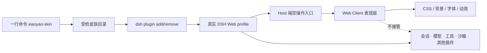

# 夕小瑶 × DeepSeek Harness 皮肤工坊

一套面向真实 DeepSeek Harness Web profile 的社区皮肤合集表现层插件。每套皮肤都是一个可安装、可卸载、可测试的 DSH，不替换会话、模型、工具、沙箱或插件系统；

[](https://github.com/147228/dsh-xiaoyao-skins/actions/workflows/ci.yml)
[](https://147228.github.io/dsh-xiaoyao-skins/)
[](https://www.npmjs.com/package/@deepseek-ai/dsh)

> [!IMPORTANT]
> **本仓库不是“所有内容统一 MIT”。代码、衍生构建支持与美术素材适用不同许可。**
> 使用、修改或再分发前，请保留适用的版权声明，并确认你的使用场景符合下表。

## 版权与使用边界

| 内容 | 适用许可与来源 | 可以做什么 | 必须注意 |
| --- | --- | --- | --- |
| 本项目原创源代码 | [MIT](LICENSE) · Copyright © 2026 Xiaoyao AI / 夕小瑶科技说及贡献者 | 使用、修改、合并 | 副本或重要部分须保留 MIT 版权与许可声明 |
| `shared/tsdown.client.ts`、`shared/web-platform.ts` 等衍生构建支持 | 衍生自 [`zhu1090093659/dsh-web-ui`](https://github.com/zhu1090093659/dsh-web-ui)，原作者代码为 BSD-3-Clause · Copyright © 2026 zhu1090093659 | 在遵守 BSD-3-Clause 的前提下使用、修改和再分发 | 源码和二进制分发均须保留原作者版权、许可条件和免责声明；不得暗示原作者背书 |
| 夕小瑶角色、美术、皮肤背景和预览图 | [CC BY-NC 4.0](ASSET_LICENSE.md)，除非具体文件另有声明 | 署名后的个人使用、研究、展示和其他非商业使用 | **不得直接用于商业用途**；付费分发、商品、广告植入及商业图像模型训练需另行取得书面授权 |
| DeepSeek Harness 代码与构建约定 | 来自 [`deepseek-ai/deepseek-harness`](https://github.com/deepseek-ai/deepseek-harness)，按其 MIT 许可使用 | 按原项目许可使用 | DeepSeek 名称、鲸鱼标识及其他商标权利不因本仓库而获得授权 |

> [!WARNING]
> **独立社区项目声明：** 本项目与 DeepSeek 及 `zhu1090093659/dsh-web-ui`
> 原作者不存在隶属、赞助、认证或背书关系。转载截图、发布整合包或迁入代码时，不能只保留
> 本仓库的 MIT 文件；还必须一并保留对应的素材许可与第三方声明。

完整文本与逐项来源见 [LICENSE](LICENSE)、[ASSET_LICENSE.md](ASSET_LICENSE.md) 和
[THIRD_PARTY_NOTICES.md](THIRD_PARTY_NOTICES.md)。如计划将小瑶角色或美术用于商业项目，
请先联系权利人取得单独书面授权。

## 一行换肤

需要 Node.js 20+（推荐 24 LTS），并已安装、初始化 DeepSeek Harness。命令默认操作
`web` profile。**不需要预先安装 pnpm**：安装器会优先复用可用版本；没有时通过
Corepack 或 npx 为本次操作临时提供兼容版本，不修改全局 pnpm 配置。

```bash
npx --yes --package=https://github.com/147228/dsh-xiaoyao-skins/releases/latest/download/xiaoyao-skin-kit.tgz xiaoyao-skin use black-whale
```

切换另一套皮肤：

```bash
npx --yes --package=https://github.com/147228/dsh-xiaoyao-skins/releases/latest/download/xiaoyao-skin-kit.tgz xiaoyao-skin use ocean
```

恢复官方界面：

```bash
npx --yes --package=https://github.com/147228/dsh-xiaoyao-skins/releases/latest/download/xiaoyao-skin-kit.tgz xiaoyao-skin use official
```

可用 `--profile <name>` 指定其他 profile，用 `--dry-run` 只查看将执行的 DSH 命令。

### 安装兼容性与排错

| 环境 | 安装器行为 |
| --- | --- |
| Node.js 24 / 22.13+ | 复用可用 pnpm，或临时使用 pnpm 11.19 |
| Node.js 20 / 22.0–22.12 | 复用可用 pnpm，或临时使用 pnpm 10.34，避开 pnpm 11 的 Node 版本限制 |
| 未安装全局 pnpm | 自动走 Corepack；Corepack 也不可用时自动走随 Node 提供的 npx |
| `--dry-run` | 只打印 DSH 命令，不检查、不下载、不写入 profile |

如果看到 `dsh: pnpm not found on PATH`，说明使用的是旧版工具包；重新执行上面同一条
`releases/latest` 命令即可获取修复版。若自动兜底因网络或代理失败，安装器会给出与当前
Node.js 匹配的手动 `npm install -g pnpm@...` 命令。安装目标失败时不会移除当前皮肤。

## 六套真实效果

以下均为皮肤接入**真实 DeepSeek Harness Web profile** 后的界面截图，不是静态概念图。
点击图片可进入对应皮肤目录；完整安装命令也可在
[在线皮肤展厅](https://147228.github.io/dsh-xiaoyao-skins/) 一键复制。

| [夕小瑶 · 黑鲸实验室](packages/skins/black-whale) | [夕小瑶 · 探索之境](packages/skins/ocean) |
| :---: | :---: |
| [](packages/skins/black-whale) | [](packages/skins/ocean) |
| 官网黑鲸 × 石墨黑 × 小瑶粉<br>`use black-whale` | 深海蓝 × 猫娘粉 × 鲸鱼光效<br>`use ocean` |

| [蓝粉双子 · 晴空研究所](packages/skins/sky-lab) | [夕小瑶 · 烽火夜长城](packages/skins/great-wall-beacon) |
| :---: | :---: |
| [](packages/skins/sky-lab) | [](packages/skins/great-wall-beacon) |
| 云端白昼 × 双主角协作<br>`use sky-lab` | 炭黑长城 × 中国红 × 古金<br>`use great-wall-beacon` |

| [夕小瑶 · 山河朝霞](packages/skins/great-wall-sunrise) | [夕小瑶 · 雪岭长城](packages/skins/great-wall-snow) |
| :---: | :---: |
| [](packages/skins/great-wall-sunrise) | [](packages/skins/great-wall-snow) |
| 米白宣纸 × 朱红 × 朝霞金<br>`use great-wall-sunrise` | 雪白 × 墨灰 × 正红披风<br>`use great-wall-snow` |

## 为什么不影响 DSH 其他功能



安装器遵守三个边界：

1. 先通过官方 `dsh plugin add` 安装目标皮肤；
2. 切换时只移除本仓库登记过的其他皮肤包；
3. 不改 DSH 源码，不清空 profile，不读取或迁移会话数据。

皮肤本身必须只做表现层工作，运行时禁止发起网络请求，也禁止导入功能型 DSH
服务。具体约束见 [皮肤规范](docs/SKIN_SPEC.md) 和 [技术架构](docs/ARCHITECTURE.md)。

## 做一套自己的皮肤

```bash
npx --yes --package=https://github.com/147228/dsh-xiaoyao-skins/releases/latest/download/xiaoyao-skin-kit.tgz xiaoyao-skin create moon-rabbit
cd dsh-skin-moon-rabbit
pnpm install
pnpm check
```

模板已经带好官方 DSH bundle 接线、Web client 入口、可逆卸载、CSS 隔离、测试和
授权文件。做好后运行合集医生：

```bash
npx --yes --package=https://github.com/147228/dsh-xiaoyao-skins/releases/latest/download/xiaoyao-skin-kit.tgz xiaoyao-skin doctor ./dsh-skin-moon-rabbit
```

然后从 [皮肤提案](https://github.com/147228/dsh-xiaoyao-skins/issues/new?template=skin_proposal.yml)
开始，或直接阅读 [贡献指南](CONTRIBUTING.md)。

## 本地开发

完整开发、构建与发布使用 Node.js 24。

```bash
corepack enable
pnpm install --frozen-lockfile
pnpm check
pnpm pack:release
```

`pnpm check` 会校验目录元数据、官方 DSH 接线、表现层权限边界、生命周期清理、
六套皮肤单测、安装器单测、构建结果与展厅。合并请求还会在 Linux、macOS、Windows
三套环境中重跑。

## 许可文件索引

- [LICENSE](LICENSE)：本项目原创源代码的 MIT 许可；
- [ASSET_LICENSE.md](ASSET_LICENSE.md)：夕小瑶角色、美术与预览素材的 CC BY-NC 4.0
  条款及商业授权边界；
- [THIRD_PARTY_NOTICES.md](THIRD_PARTY_NOTICES.md)：DeepSeek Harness、
  `zhu1090093659/dsh-web-ui` 等第三方来源、版权和完整许可文本。

许可摘要只用于帮助理解，不替代上述许可文件的完整条款。
