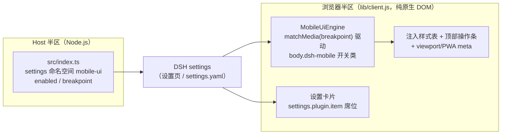

# dsh-mobile-ui — DSH Web GUI 手机端 UI 适配插件

窄屏（默认视口宽度 ≤ 860px，可配置）下把 DeepSeek Harness Web GUI 从桌面三栏布局重构为**全屏聊天布局**：侧栏与右侧面板变为抽屉、顶部悬浮操作条 + 全屏按钮、返回键退栈，桌面宽度下零影响。

[](LICENSE)
[](package.json)
[](package.json)

## ✨ 功能特性

- 📱 **全屏聊天布局**：三栏 + 右侧面板列脱离文档流，聊天区占满整屏。
- 🗂️ **侧栏 → 左侧抽屉**：点顶部 ☰ 滑出；点遮罩、收起按钮、或在侧栏里点了会话/「新会话」自动收起。
- 📄 **右侧面板 → 抽屉**：详情列与 aionui 的「资源列 / 预览列」变为右侧抽屉（点顶部面板按钮或 aionui 浮出按钮打开）。
- 🎛️ **顶部悬浮操作条**：☰ 侧栏 · 面板 · ⟳ 刷新 · ⛶ 全屏（Fullscreen API）。
- ⏎ **返回键退栈 + 全屏锁定**（全屏 / PWA standalone 内）：系统返回键按「最上层优先」逐层关闭 —— aionui 对话框 → 模态对话框 → 侧栏抽屉 → 右侧面板；层全关完后再按返回也只是吞掉，**退出全屏唯一途径是 ⛶ 按钮**。
- 🔄 **Android 返回键防退出**：系统返回先退全屏时，插件关掉当前层并立即恢复全屏（粗指针设备生效）。
- 📵 **会话切换抑制键盘**：切换 session 后不自动聚焦 composer（键盘不弹出，可先滑动浏览；手动点输入区不受影响）。
- 📲 **移动端细节**：`viewport-fit=cover` 安全区适配（刘海/底部横条）、16px 输入框字号防 iOS 聚焦缩放、双击缩放禁用、PWA meta（可「添加到主屏幕」全屏运行）。
- 🖥️ **桌面零影响**：所有规则挂在 `body.dsh-mobile` 开关类下，离开窄屏即恢复桌面三栏布局与原始 viewport meta。

## 📐 架构

两个半区，通过 DSH 设置系统连接：



- **Host 半区**只声明配置命名空间 `mobile-ui`（无路由、无副作用），设置经 DSH settings 系统读写。
- **浏览器半区**是纯 DOM 适配层，无 react 运行时依赖（react 由 web 宿主提供），client bundle gzip 约 16KB。
- **布局状态全部取自 frame 自身稳定钩子**：侧栏 = `data-sidebar-collapsed` 属性；aionui 两列 = 解析 frame 内联 grid 轨道（MutationObserver 镜像为 `dsh-mobile-explorer-open` / `dsh-mobile-preview-open` 类），不与内部框架耦合。
- 断点取值优先级：settingsScope 就绪 → 其 `breakpoint`；否则退回装配配置的默认值。

## 🚀 快速开始

### 前提

- 已安装 DeepSeek Harness（DSH）并运行 Web GUI（本文以 `web` profile 为例）。
- 构建需要 DSH 源码 checkout（用于提供 tsc / tsdown / 内部类型包），见下方[构建](#构建)。

### 安装

```bash
# 1) 克隆本仓库
git clone https://github.com/21hbguo/dsh-mobile-ui.git
cd dsh-mobile-ui

# 2) 构建（产出 lib/）
bash scripts/build.sh
```

> 内部 peer 依赖（`@deepseek-ai/*`）已在 `peerDependenciesMeta` 中标为 optional，外部环境 `npm install` 不会因它们失败。

#### 方式 A：热装配（推荐，免重启）

在 DSH 会话中使用注入工具：

```
dev_install_package <dsh-mobile-ui 目录绝对路径>
```

#### 方式 B：手动装配（重启后生效）

在 `~/.dsh/profiles/web/cordis.patch.yml` 中追加一行（与仓库内 `cordis.patch.yml` 一致）：

```yaml
- insert:
    - id: mobile-ui
      name: '@dsh-external/dsh-mobile-ui'
```

重启 DSH 后由 bundles 装配生效。

### 构建

`scripts/build.sh` 需要定位 DSH 源码 checkout：

- 优先读 `DSH_CHECKOUT` 环境变量：`DSH_CHECKOUT=/path/to/deepseek-harness bash scripts/build.sh`
- 未设置时自动探测：`$HOME/dsh-harness`、`$HOME/dsh`、`$HOME/.dsh/dsh-harness`、`$HOME/project/other/deepseek-harness`

构建产物：`lib/index.js`（host 半区）+ `lib/client.js`（浏览器半区，tsdown 打包）。

### 配置

两种方式等效（设置页优先）：

1. **设置页**：设置 → 插件 → 「手机端 UI 适配」卡片，直接读写。
2. **settings.yaml**：编辑 `~/.dsh/settings.yaml`：

```yaml
mobile-ui:
  enabled: true
  breakpoint: 860
```

### 验证

1. 手机浏览器（或桌面 DevTools 设备模式）打开 DSH Web GUI，视口宽度 ≤ 断点值。
2. 预期：聊天区占满整屏、顶部出现悬浮操作条（☰ 面板 ⟳ ⛶）、侧栏/右侧面板变成抽屉。
3. 点击 ⛶ 进入全屏，按系统返回键：应逐层关闭抽屉/对话框，**不应退出全屏**；再按 ⛶ 退出。
4. 拉宽视口（> 断点值）：立即恢复桌面三栏布局，与未安装插件时一致。

### 排错表

| 现象 | 原因 | 解决 |
|---|---|---|
| 窄屏下仍是桌面三栏 | `enabled: false` 或断点小于视口宽度 | 设置页/`settings.yaml` 检查 `mobile-ui.enabled` 与 `breakpoint`（范围 400–1280，步长 20） |
| 顶部操作条不出现 | 移动布局未激活，或 frame 尚未被观察器挂载 | 确认视口 ≤ 断点；刷新页面让 frame 重新挂载；看控制台是否有 `[mobile-ui] mount failed` |
| 面板按钮不显示 | 未检测到 aionui 资源列/预览列 | 该按钮只在 frame 内存在 `.aionui-explorer-col` / `.aionui-preview-col` 时显示；未安装 aionui 时属正常 |
| 点 ⛶ 提示「添加到主屏幕」 | iOS Safari 无网页 Fullscreen API | 浏览器菜单 →「添加到主屏幕」，以 standalone 模式全屏运行 |
| 返回键没反应/直接离开页面 | 只在「移动布局 +（全屏 或 standalone）」时拦截返回 | 先点 ⛶ 进全屏，或添加到主屏幕后运行；桌面浏览器 Esc 只关层 |
| Android 返回键退出全屏又自动回来 | 设计如此：关当前层后立即恢复全屏 | 想退出全屏请点 ⛶ 按钮 |
| 设置卡片提示「未暴露」 | 当前 DSH 版本未向设置页暴露该命名空间 | 直接编辑 `~/.dsh/settings.yaml` 配置；或为 dsh-host-apiproxy 的 `WEB_SETTINGS_NAMESPACES` 白名单补充 `mobile-ui` 后重启 |
| 构建失败 `cannot locate the dsh checkout` | 自动探测未命中 | 设置 `DSH_CHECKOUT` 环境变量指向 DSH 源码目录后重试 |

## ⚙️ 配置项

命名空间 `mobile-ui`（设置页卡片「手机端 UI 适配」，已声明 `web: true` 暴露）：

| 字段 | 类型 | 默认 | 说明 |
|---|---|---|---|
| `enabled` | boolean | `true` | 总开关；关闭即卸载全部适配（样式/操作条/观察器） |
| `breakpoint` | number | `860` | 视口宽度 ≤ 该值（px）时启用移动布局；范围 400–1280，步长 20 |

引擎内部将断点 clamp 到 320–1600px（防御异常配置）。

## ⌨️ 命令表

| 命令 | 作用 |
|---|---|
| `git clone https://github.com/21hbguo/dsh-mobile-ui.git` | 获取源码 |
| `bash scripts/build.sh` | 构建 host + client 产物到 `lib/`（需 DSH checkout） |
| `npm run typecheck` | TypeScript 类型检查（`tsc --noEmit`） |
| `dev_install_package <目录>` | DSH 内热装配插件（免重启） |
| `gh release download` / Releases 页 tgz | 获取已构建的 npm 包产物 |

## 🔐 安全说明

- **无遥测**：插件不发起任何网络请求，不收集、不上传任何数据。
- **纯前端 DOM 适配**：浏览器半区只操作当前页面 DOM/meta；host 半区仅声明 settings 命名空间，无路由、无文件系统访问。
- **配置本地存储**：所有配置经 DSH settings 系统保存在本机（`~/.dsh/settings.yaml`）。
- **无第三方运行时依赖**：react 等由 web 宿主提供，插件自身零依赖注入面。

## ❓ FAQ

**Q：桌面端会受影响吗？**
不会。所有样式规则挂在 `body.dsh-mobile` 类下，由 `matchMedia(max-width: 断点)` 驱动；离开窄屏立即恢复桌面三栏布局与原始 viewport meta，且适配层被禁用时不注入任何样式。

**Q：支持哪些浏览器？**
现代浏览器（需要 `matchMedia`、`MutationObserver`、Fullscreen API 按能力降级）。iOS Safari 无网页 Fullscreen API，使用「添加到主屏幕」以 standalone 全屏运行，返回键退栈同样生效。

**Q：和 aionui 右侧面板冲突吗？**
不冲突。aionui 的资源列/预览列在移动端镜像为右侧抽屉，开合状态实时同步；激活移动布局的瞬间还会自动收起已展开的列（聊天优先），8 秒兜底保证视觉上不弹抽屉。

**Q：返回键会不会误退全屏？**
不会。全屏（或 standalone）下系统返回键只按「aionui 对话框 → 模态对话框 → 侧栏抽屉 → 右侧面板」逐层关闭；层全关完后再按也只会吞掉并提示用 ⛶ 退出。Android 返回键先退全屏时，插件会立即恢复全屏（粗指针设备）。

**Q：peerDependencies 里的 `@deepseek-ai/*` 是什么？**
它们是 DSH 内部的运行时/类型包（npm 上不公开），宿主环境自带；已全部标记 optional，外部安装不会报错。

## 📄 License

[BSD-3-Clause](LICENSE) © 2026 [21hbguo](https://github.com/21hbguo)
