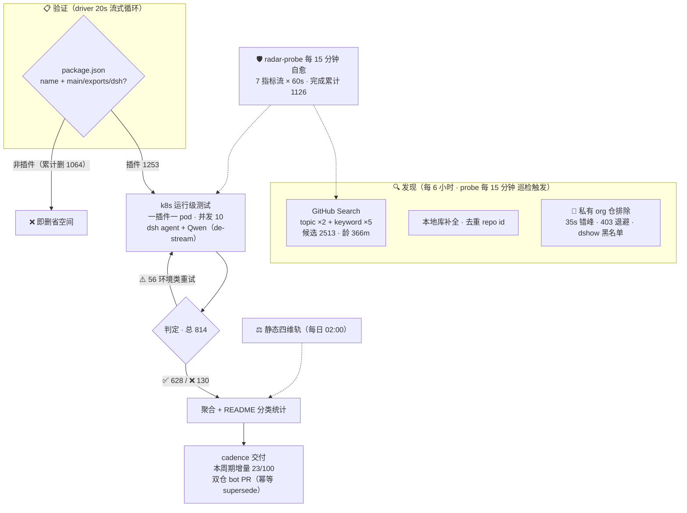

# Awesome DSH Plugins

   
  
  
  
  
  
  

**自动发现、证据验证的 DeepSeek Harness 插件生态雷达。自动发现 2500+ 候选、逐个 k8s 实测**

安装前就知道哪个能用，不用自己踩坑。

   

简体中文 | [English](README.en-US.md)

---

> 收录 1253 个 DSH 插件仓库（索引到2513个repos ，正由专用K8s集群，动态在DSH最新版本下验证可用性，目前高速迭代中）。

## 工作原理

> 📌 数据截至快照 `20260814T213619Z`（2026-08-15 05:36:19 UTC+8 · 分类器 unified-v1）

<!-- AUTO:pipeline:START -->

<!-- AUTO:pipeline:END -->

## 快速导航

| 你的目标 | 跳转入口 |
|---|---|
| 看热门插件 | [🔥 Star Top 20](#-热门插件star-top-20) |
| 按用途找一个插件 | [📋 分类目录](#分类目录) · [PLUGINS.md](PLUGINS.md) — 9 大功能领域 + 兼容性状态 |
| 浏览自动发现的全部仓库 | [📊 当前生态快照](#当前生态快照) — 日期化兼容矩阵 |
| 了解最近发生了什么 | [📝 CHANGELOG](CHANGELOG.md) |
| 登记或提交插件 | [🔧 给插件开发者](#给插件开发者) · 加 `dsh-plugin` topic → 8h 自动收录 · [PR 模板](.github/PULL_REQUEST_TEMPLATE.md) |
| 维护本雷达 | [⚙️ 自动化 SOP](docs/SOP.md) |
| 给插件使用者指南 | [📖 给插件使用者](#给插件使用者) |
| 本仓库如何判定兼容性 | [🔍 本仓库如何判定](#本仓库如何判定) |
| 加入社群交流 | [💬 DSH 学习社区](#-dsh-学习社区-dshfindcom) · [社区讨论群](#社区讨论群) |

> [!IMPORTANT]
> **收录不等于兼容，静态检查不等于运行可用，运行可用也不等于安全审计。**
> 本仓库提供可追溯的筛选信号，不代表 DSH 官方背书。安装第三方插件前，请检查插件源码、权限、依赖、许可证及测试日期。

## 🔥 热门插件（Star Top 20）

<!-- AUTO:featured:START -->

> 按 GitHub star 数排序，每 20 分钟自动刷新。数据截至 2026-08-15 15:09（UTC+8）。

| # | 插件 | ⭐ | 说明 |
|---|---|---|---|
| 1 | [dsh-web-ui](https://github.com/zhu1090093659/dsh-web-ui) | 2177 | Plugin and skin collection for DeepSeek Harness (DSH) W… |
| 2 | [modlens](https://github.com/liustack/modlens) | 1465 | The first vision plugin for DeepSeek Harness, and the v… |
| 3 | [TokenTracker](https://github.com/xiufengsun/TokenTracker) | 1313 | Local-first AI token usage & cost tracker for 31 coding… |
| 4 | [dsh-TUI](https://github.com/ccch1mneyyy/dsh-TUI) | 1004 | 解决DSH 官方尚无终端 TUI 痛点的补位之作，献给偏爱cli的各位极客：Claude Code 风格全屏交… |
| 5 | [PicGo-Core](https://github.com/PicGo/PicGo-Core) | 971 | :zap:The ultimate image uploading engine. Both CLI & AP… |
| 6 | [DSH-better-sidebar](https://github.com/omdsh-dev/DSH-better-sidebar) | 872 | 一个侧边栏的完整工作台，支持三方拓展注册新侧边栏页面。内置文件渲染编辑/终端/Git/子代理 |
| 7 | [sandbase-harness](https://github.com/sandbaseai/sandbase-harness) | 580 | Open-source CMA-compatible agent runtime for any model,… |
| 8 | [dsh-vision-toolkit](https://github.com/Anionex/dsh-vision-toolkit) | 372 | 让纯文本模型更好地做视觉任务的DeepSeek Harness插件：带意图的图片问答、长截图 OCR、UI 还… |
| 9 | [dsh-ads](https://github.com/Nagi-ovo/dsh-ads) | 366 | 把 DSH 变成 2005 年门户网站｜Parody ads, fake games, and popups … |
| 10 | [Abu-Cowork](https://github.com/PM-Shawn/Abu-Cowork) | 326 | Open-source alternative to Claude Cowork — a local-firs… |
| 11 | [dsh-agent-teams](https://github.com/NanmiCoder/dsh-agent-teams) | 278 | AgentTeams plugin for DeepSeek Harness |
| 12 | [Bigfish](https://github.com/turtle2209/Bigfish) | 188 | Bigfish —— DeepSeek Harness 的第三方桌面端，内置 Node 运行时，双击即用，附带… |
| 13 | [oh-dsh](https://github.com/hust-open-atom-club/oh-dsh) | 175 | 一站式 DeepSeek Harness 社区发行版：TUI、桌面端与 Web UI 三种形态统一体验，支持分… |
| 14 | [dsh-at-file](https://github.com/omdsh-dev/dsh-at-file) | 154 | Codex-style @file mentions for DeepSeek Harness: search… |
| 15 | [whale-girl](https://github.com/vlln/whale-girl) | 147 | DSH Web GUI 桌面宠物插件（QQ 宠物形态）：右下角悬浮、可拖拽/投喂/玩耍的积累型伙伴。官方 re… |
| 16 | [dsh-tianshu-tui](https://github.com/huiliyi37/dsh-tianshu-tui) | 140 | dsh-tianshu-tui — DeepSeek Harness terminal UI +harness… |
| 17 | [deepseek-harness-desktop-app](https://github.com/vibeinging/deepseek-harness-desktop-app) | 109 | DeepSeek Harness Desktop App: a local AI desktop worksp… |
| 18 | [dsh-browser](https://github.com/Lum1104/dsh-browser) | 107 | dsh plugin: Chrome sidebar extension that lets DSH oper… |
| 19 | [modsearch](https://github.com/liustack/modsearch) | 98 | The web plugin for DeepSeek Harness, and the search bri… |
| 20 | [dsh-visualize](https://github.com/Nagi-ovo/dsh-visualize) | 88 | 在 DSH 对话中生成交互式可视化｜Render model-generated interactive ca… |

<!-- AUTO:featured:END -->

## 分类目录

<!-- AUTO:catalog:START -->

> 按功能领域分类（重分类修正）。点击标题展开，全部条目一次显示。 新收录条目（社区）的兼容性为**运行级跟踪口径**（k8s agent 实测）。 新收录条目（社区）的兼容性为**运行级跟踪口径**（k8s agent 实测）。

<h3>🔌 Web UI 增强（247）</h3>

*界面与交互增强插件：侧边栏、输入框、皮肤主题、面板 dock、消息显示、状态栏与可视化，让 Web 界面更顺手更好看*

| 插件 | 类型 | 兼容性 | 说明 |
|---|---|---|---|
| [dsh-vision](https://github.com/dsh-external/dsh-vision) | 插件 | 关注 | dsh 插件：给纯文本 DeepSeek 加视觉——view_image 工具桥接任意 OpenAI 兼容 VLM（默认智谱免费档，实测 4 厂商 10 模型） |
| [dsh-web-ui](https://github.com/dsh-external/dsh-web-ui) | 合集 | 关注 | Plugin and skin collection for DeepSeek Harness (DSH) Web UI - task board, git g |
| [ex-setting](https://github.com/dsh-external/ex-setting) | 插件 | 关注 | DSH的设置扩展 |
| [web-components](https://github.com/dsh-external/web-components) | 基建 | 关注 | web-components支持 |
| [dsh-split-panes](https://github.com/dsh-external/dsh-split-panes) | 插件 | 需适配 | — |
| [turtle-ui](https://github.com/dsh-external/turtle-ui) | 插件 | 需适配 | as is, no warranty |
| [dsh-ads](https://github.com/dsh-external/dsh-ads) | 插件 | 待调研 | 是兄弟就来蹬我！DSH Web UI 广告：2005 年中文站点风格的侧栏广告 / 对话内信息流 / 角落弹窗 + 一个真实热区比视觉小得多的关闭叉 |
| [dsh-aigc-canvas](https://github.com/dsh-external/dsh-aigc-canvas) | 插件 | 待调研 | — |
| [dsh-annotation](https://github.com/dsh-external/dsh-annotation) | 插件 | 待调研 | DSH Web 选中批注插件：选文字→批注→回车随消息发送；气泡隐藏批注块（零闪烁）；回复按 Annotation N 逐条对照（可悬浮芯片） |
| [dsh-anti-ads](https://github.com/dsh-external/dsh-anti-ads) | 插件 | 待调研 | — |
| [DSH-better-sidebar](https://github.com/dsh-external/DSH-better-sidebar) | 插件 | 待调研 | 一个侧边栏的完整工作台，支持三方拓展注册新Tab页面，内置文件渲染编辑/终端/Git/子代理 |
| [dsh-custom-css](https://github.com/dsh-external/dsh-custom-css) | 插件 | 待调研 | — |
| [dsh-drag-and-drop](https://github.com/dsh-external/dsh-drag-and-drop) | 插件 | 待调研 | 为 DSH Web UI 增加跨平台文件拖拽与原始路径插入能力，无需复制文件 |
| [dsh-message-edit](https://github.com/dsh-external/dsh-message-edit) | 插件 | 待调研 | DSH plugin: branch-based message editing, reroll, retry, version timeline |
| [dsh-side-panel](https://github.com/dsh-external/dsh-side-panel) | 插件 | 待调研 | DSH 侧边栏，集成文件浏览器、终端和 Git 审查，方便预览文件 |
| [dsh-ultra-ui](https://github.com/dsh-external/dsh-ultra-ui) | 插件 | 待调研 | — |
| [ui-status-label](https://github.com/dsh-external/ui-status-label) | 插件 | 待调研 | 把你鲸鱼娘思考时的 deep diving 自定义成任意你想要的样子 |
| [ya-workspace-sidebar](https://github.com/dsh-external/ya-workspace-sidebar) | 插件 | 待调研 | — |
| [awesome-dsh-background-plugin](https://github.com/leavestring/awesome-dsh-background-plugin) | 社区 | ✅ 运行级可用 | DSH Web 背景个性化插件：上传自己的图片（JPG / PNG / WEBP / GIF，浏览器端自动压缩到 1600px 以内）或一键切换极光、余烬、宣纸 |
| [Better_Deepseek_Harkness](https://github.com/silencieuxzero/Better_Deepseek_Harkness) | 社区 | ✅ 运行级可用 | 更好的deepseek harness，为webui进行了一些拓展 |
| [claude-harness-desktop](https://github.com/pingta-guangpingwang/claude-harness-desktop) | 社区 | ✅ 运行级可用 | An Electron-based multi-project AI cockpit that orchestrates multiple Claude Cod |
| [claude-parchment-theme](https://github.com/RayYeung1989/claude-parchment-theme) | 社区 | ✅ 运行级可用 | 一款 Claude 风格的 dsh插件：为 DSH WebUI 打造，暖羊皮纸 Parchment 色板、Terracotta 品牌色与衬线字体 |
| [computer-use-plus](https://github.com/Ethanout/computer-use-plus) | 社区 | ✅ 运行级可用 | Low-token, low-latency Windows computer-use MCP with learned shortcuts, UIA/CDP/ |
| [deepseek-harness-dsh-plugin-hub](https://github.com/LinBuYan/deepseek-harness-dsh-plugin-hub) | 社区 | ✅ 运行级可用 | DSH 插件中心：右下角悬浮面板，聚合 GitHub 生态扫描、社区插件热榜与已装插件管理，内置五维风险检查与一键安装 |
| [deepseek-harness-plugin-from-scratch](https://github.com/Opr4Mp3r/deepseek-harness-plugin-from-scratch) | 社区 | ✅ 运行级可用 | Code-audited, progressive guide to production-grade DeepSeek Harness plugins |
| [deepseek-harness-skin](https://github.com/goodpostidea-tech/deepseek-harness-skin) | 社区 | ✅ 运行级可用 | deepseek-harness-skin |
| [deepseek-harness-tui](https://github.com/boxeryao/deepseek-harness-tui) | 社区 | ✅ 运行级可用 | DSH-TUI: a lightweight and fast terminal plugin connected directly to the DSH ru |
| [deepseek-harness-vscode](https://github.com/urwff/deepseek-harness-vscode) | 社区 | ✅ 运行级可用 | Run DeepSeek Harness in the VS Code sidebar, Claude Code for VS Code style |
| [deepseek_harness_ui_schema_fix](https://github.com/sixsixla/deepseek_harness_ui_schema_fix) | 社区 | ✅ 运行级可用 | — |
| [DeepSeekHarness-DesktopUI](https://github.com/Adnnnnai/DeepSeekHarness-DesktopUI) | 社区 | ✅ 运行级可用 | — |
| [DeepSeekHarnessDesktop](https://github.com/lx67621956-create/DeepSeekHarnessDesktop) | 社区 | ✅ 运行级可用 | DeepSeekHarness桌面版（自用）—— 官方 DeepSeek Harness (dsh) 的 Windows 桌面壳：内置固定版 dsh 运行时，免 |
| [DeepSeekHarnessThirdModelThinkMgr](https://github.com/Lenonss/DeepSeekHarnessThirdModelThinkMgr) | 社区 | ✅ 运行级可用 | 支持DeepSeekHarness上配置第三方模型的思考选择项，在对话界面实时选择 |
| [dhs-theme-plugin](https://github.com/kongxiangyiren/dhs-theme-plugin) | 社区 | ✅ 运行级可用 | dsh 主题管理插件 |
| [ds-web-ui](https://github.com/xing-shuyin/ds-web-ui) | 社区 | ✅ 运行级可用 | My DeepSeek Harness Web UI |
| [dscode](https://github.com/creativedswork/dscode) | 社区 | ✅ 运行级可用 | dscode is a coding agent that empowers digital and knowledge work |
| [dsh-agent-sdk](https://github.com/salathleizhang/dsh-agent-sdk) | 社区 | ✅ 运行级可用 | Embeddable, plugin-based coding-agent runtime built on DeepSeek Harness |
| [dsh-angry](https://github.com/01Virex/dsh-angry) | 社区 | ✅ 运行级可用 | Turns the DeepSeek Harness web UI red and shaky the longer a turn runs — the "re |
| [dsh-attachment-formats](https://github.com/linkingoscar/dsh-attachment-formats) | 社区 | ✅ 运行级可用 | Codex-style attachment formats for the DeepSeek Harness Web GUI: PDF text-layer  |
| [dsh-atuin](https://github.com/search?q=dsh-atuin) | 社区 | ✅ 运行级可用 | — |
| [dsh-auto-continue](https://github.com/HsiangNianian/dsh-auto-continue) | 社区 | ✅ 运行级可用 | DSH Web UI plugin: auto-sends 「继续」 to resume requests interrupted by network err |
| [dsh-auto-memory](https://github.com/Aik358/dsh-auto-memory) | 社区 | ✅ 运行级可用 | DSH 自动记忆插件:三层记忆(用户级/项目笔记/每日日志)自动注入与检索、每日反思、可视化面板与设置页,支持继承其他 AI 工具的历史记忆 |
| [dsh-background-agents](https://github.com/PerryLink/dsh-background-agents) | 社区 | ✅ 运行级可用 | Interactive long-session background agents for DeepSeek Harness: start a durable |
| [dsh-balance-meter](https://github.com/Ghost011118/dsh-balance-meter) | 社区 | ✅ 运行级可用 | DeepSeek account balance and session cost readout for the DeepSeek Harness Web G |
| [dsh-balance-monitor](https://github.com/jelly-000/dsh-balance-monitor) | 社区 | ✅ 运行级可用 | DeepSeek 账户余额、剩余比例条与今日花费，显示在 dsh 侧边栏底部 · DeepSeek balance, remaining-ratio bar a |
| [dsh-better-archive](https://github.com/huahai0202/dsh-better-archive) | 社区 | ✅ 运行级可用 | DeepSeek Harness (DSH) web-GUI plugin: archived-session panel with unarchive & d |
| [dsh-bg-image](https://github.com/lyh9712/dsh-bg-image) | 社区 | ✅ 运行级可用 | DSH (DeepSeek Harness) Web 背景图插件：自定义网页背景壁纸，侧边栏/聊天区半透明磨砂，带设置界面 |
| [dsh-bg-wallpaper](https://github.com/roseplanetb613/dsh-bg-wallpaper) | 社区 | ✅ 运行级可用 | DeepSeek Harness Web GUI wallpaper plugin bundle: serve a local image as the pag |
| [dsh-billing-glass](https://github.com/linkingoscar/dsh-billing-glass) | 社区 | ✅ 运行级可用 | Liquid-glass billing overlay for the DeepSeek Harness Web GUI: provider balances |
| [dsh-black-whale](https://github.com/147228/dsh-black-whale) | 社区 | ✅ 运行级可用 | DeepSeek Harness 黑鲸实验室主题：官网黑鲸 × 夕小瑶 IP，真实 profile 可安装的 Web UI 插件 |
| [dsh-bottom-stats](https://github.com/318197375/dsh-bottom-stats) | 社区 | ✅ 运行级可用 | DSH plugin: full-width conversation stats line (no truncation) + context occupan |
| [dsh-chat-width](https://github.com/chen-001/dsh-chat-width) | 社区 | ✅ 运行级可用 | Adjust the width of dsh's reply. |
| [dsh-client-shortcuts](https://github.com/blue-a11y/dsh-client-shortcuts) | 社区 | ✅ 运行级可用 | Global keyboard shortcuts plugin for the DeepSeek Harness web GUI: ctx.shortcuts |
| [dsh-client-ui-mobile-adapt](https://github.com/Hotsteel2901/dsh-client-ui-mobile-adapt) | 社区 | ✅ 运行级可用 | Your DeepSeek Harness web UI, rebuilt for the phone in your hand |
| [dsh-client-ui-monitor](https://github.com/Auran-Lu/dsh-client-ui-monitor) | 社区 | ✅ 运行级可用 | 用于监控当前会话额度消耗、预估费用及当前API余额/Used to monitor the current session's quota consumptio |
| [dsh-composer-polish](https://github.com/tianji-qingtian/dsh-composer-polish) | 社区 | ✅ 运行级可用 | DeepSeek Harness plugin: one-click ✨ polish for composer drafts — flash rewrite, |
| [dsh-context-doctor](https://github.com/Zhenyu98/dsh-context-doctor) | 社区 | ✅ 运行级可用 | DSH 上下文注入审计插件：统计 AGENTS.md 指令链/技能目录/工具 schema 的 token 成本，检测重复与冲突；Web UI 圆环面板 + c |
| [dsh-deepseek-price-timer](https://github.com/dacs2019/dsh-deepseek-price-timer) | 社区 | ✅ 运行级可用 | ⏱️ DeepSeek peak/off-peak price timer for the DeepSeek Harness Web GUI — live of |
| [dsh-deepseek-usage-dashboard](https://github.com/izz-BLUE/dsh-deepseek-usage-dashboard) | 社区 | ✅ 运行级可用 | DeepSeek Harness Web UI plugin for daily API token usage, cost estimates, and ba |
| [dsh-douyin](https://github.com/AnacondaKC/dsh-douyin) | 社区 | ✅ 运行级可用 | DSH WebUI 侧栏短视频插件：原生播放器、系列导航、直链解析与精确历史回放 |
| [DSH-for-VSC](https://github.com/yauntyour/DSH-for-VSC) | 社区 | ✅ 运行级可用 | 把 DeepSeek Harness（DSH）的 WebUI 搬进 VS Code：编辑器内嵌面板 + 侧边栏控制台，服务离线自动拉起，日志随时可查 |
| [dsh-fs-explorer](https://github.com/LCJ-up/dsh-fs-explorer) | 社区 | ✅ 运行级可用 | File explorer plugin for the dsh Web GUI: non-modal side panel, file preview, ri |
| [dsh-genshin-skin](https://github.com/bupianlizhugui/dsh-genshin-skin) | 社区 | ✅ 运行级可用 | 可以直接给deepseek harness换原神主题 |
| [dsh-genui](https://github.com/omdsh-dev/dsh-genui) | 社区 | ✅ 运行级可用 | GenUI for DeepSeek Harness: interactive UI components rendered inline in assista |
| [dsh-git-graph](https://github.com/1841220388zzzcccxxx-star/dsh-git-graph) | 社区 | ✅ 运行级可用 | Embedded git repository graph visualizer for the DeepSeek Harness Web GUI \| 嵌入式  |
| [dsh-hdc-bridge](https://github.com/1na-ko/dsh-hdc-bridge) | 社区 | ✅ 运行级可用 | DSH 原生鸿蒙开发助手：hdc 设备闭环调试 + 离线官方知识层（Tier-1 随包）+ DevEco CLI 构建通道 / DSH-native Harmo |
| [dsh-hotswap](https://github.com/HongzhongL/dsh-hotswap) | 社区 | ✅ 运行级可用 | Runtime hot-swap for DeepSeek Harness plugins: hot enable/disable/restart and au |
| [dsh-image-theme](https://github.com/Carpon39038/dsh-image-theme) | 社区 | ✅ 运行级可用 | Warp-inspired image-to-theme plugin for DeepSeek Harness: upload a background, e |
| [dsh-input-history](https://github.com/lhh010/dsh-input-history) | 社区 | ✅ 运行级可用 | DSH Web 输入历史插件：Ctrl+Up / Ctrl+Down 像终端一样召回与切换已发送消息，零核心改动 |
| [dsh-k12-lesson-builder](https://github.com/shyboy/dsh-k12-lesson-builder) | 社区 | ✅ 运行级可用 | DeepSeek Harness plugin for generating synchronized K12 English PPTX and DOCX le |
| [dsh-lan](https://github.com/moxisuki/dsh-lan) | 社区 | ✅ 运行级可用 | DeepSeek Harness（dsh）的局域网插件：一条 overlay 把 dsh web 绑定到局域网，并通过 index tap 注入 crypto. |
| [dsh-landscape](https://github.com/cyanseek/dsh-landscape) | 社区 | ✅ 运行级可用 | Agent-first DeepSeek Harness plugin intelligence: verify existing plugins, ident |
| [dsh-lark-link](https://github.com/amlyczz/dsh-lark-link) | 社区 | ✅ 运行级可用 | High-reliability Feishu/Lark bridge for DeepSeek Harness — QR one-click auth, mu |
| [dsh-llm-fallback](https://github.com/Visol-456/dsh-llm-fallback) | 社区 | ✅ 运行级可用 | DeepSeek Harness 回退链插件：主模型失败自动切换备用 provider，带 Web UI 配置面板 \| Provider fallback ch |
| [dsh-local-filetree](https://github.com/Mongfayi/dsh-local-filetree) | 社区 | ✅ 运行级可用 | File tree panel for the DSH Web UI: the right details column shows the current s |
| [dsh-market](https://github.com/2BingLing/dsh-market) | 社区 | ✅ 运行级可用 | DeepSeek Harness 插件市场 · 持续收录 500+ DSH 插件：中文搜索 + 实用五维评分 + 一键安装 |
| [dsh-marketplace-entry](https://github.com/yangyuehan058/dsh-marketplace-entry) | 社区 | ✅ 运行级可用 | A plugin marketplace next to the composer + button in the DeepSeek Harness Web G |
| [dsh-message-navigator](https://github.com/TableRogue/dsh-message-navigator) | 社区 | ✅ 运行级可用 | 消息导航条 Message Navigator: DeepSeek Harness 网页聊天界面右侧的垂直消息索引(动态 Cordis 插件) |
| [dsh-mic-input](https://github.com/QT-Chen/dsh-mic-input) | 社区 | ✅ 运行级可用 | DSH Web ?????????:??? Web Speech API ????,????/??????????????????Microphone voic |
| [dsh-miku-skin](https://github.com/stushansusu/dsh-miku-skin) | 社区 | ✅ 运行级可用 | 初音未来主题皮肤，用于 DeepSeek Harness (DSH) Web GUI —— 蓝紫洋红渐变、毛玻璃面板、可自定义背景图、亮暗双主题 |
| [dsh-mobile-ui](https://github.com/citrusli2026/dsh-mobile-ui) | 社区 | ✅ 运行级可用 | Mobile UI overlay (bottom strip, session drawer) for the DeepSeek Harness web GU |
| [dsh-node-nav](https://github.com/Seryta/dsh-node-nav) | 社区 | ✅ 运行级可用 | 对话节点导航：DSH Web GUI 右侧节点串，hover 预览、点击跳转、active 药丸跟随阅读位置 |
| [dsh-outline](https://github.com/urzeye/dsh-outline) | 社区 | ✅ 运行级可用 | DeepSeek Harness（DSH）Web GUI 的实时大纲插件 |
| [dsh-password-prompt](https://github.com/MagicCrazyMan/dsh-password-prompt) | 社区 | ✅ 运行级可用 | DeepSeek Harness plugin: masked password panel in the Web GUI (password_prompt t |
| [dsh-paste-input](https://github.com/lhh010/dsh-paste-input) | 社区 | ✅ 运行级可用 | DSH WebUI 文件输入增强：Ctrl+V 粘贴（带首次告知弹窗）+ 拖拽 + 选择文件，发送时复制进会话工作区临时目录 |
| [dsh-pet-zhuangfangyi](https://github.com/zealot00/dsh-pet-zhuangfangyi) | 社区 | ✅ 运行级可用 | DeepSeek Harness WebUI desktop pet plugin (chibi pet with idle animation & click |
| [dsh-plugin-background-image](https://github.com/Voyage-He/dsh-plugin-background-image) | 社区 | ✅ 运行级可用 | deepseek harness plugin, built by GPT |
| [dsh-plugin-connection-banner](https://github.com/yinren112/dsh-plugin-connection-banner) | 社区 | ✅ 运行级可用 | Visible reconnecting banner for the DeepSeek Harness Web UI |
| [dsh-plugin-deepeye](https://github.com/Favio8/dsh-plugin-deepeye) | 社区 | ✅ 运行级可用 | DeepEye vision plugin for DeepSeek Harness (DSH): image description, OCR, VQA, U |
| [dsh-plugin-eyecare-theme](https://github.com/Cocowwy/dsh-plugin-eyecare-theme) | 社区 | ✅ 运行级可用 | Customizable eye-care palettes for DeepSeek Harness Web |
| [dsh-plugin-genshin-startup](https://github.com/allen546/dsh-plugin-genshin-startup) | 社区 | ✅ 运行级可用 | DeepSeek Harness (dsh) plugin: Plays the Genshin Impact launch video centered wi |
| [dsh-plugin-installer](https://github.com/Toukaiteio/dsh-plugin-installer) | 社区 | ✅ 运行级可用 | A marketplace plugin to quickly integrate your DeepSeek Harness into the GitHub  |
| [dsh-plugin-peak-pricing](https://github.com/c-ling/dsh-plugin-peak-pricing) | 社区 | ✅ 运行级可用 | DeepSeek 峰谷定价时段徽章（DSH 双面插件，纯 UI、无状态、无网络请求） |
| [dsh-plugin-provider-quota](https://github.com/jasper-zsh/dsh-plugin-provider-quota) | 社区 | ✅ 运行级可用 | DeepSeek Harness（DSH） 的 Web 插件：在对话输入框底部展示模型 Provider 的订阅额度与限流窗口，点击徽标即可查看详情 |
| [dsh-plugin-qr-connect](https://github.com/mervyn-teo/dsh-plugin-qr-connect) | 社区 | ✅ 运行级可用 | DeepSeek Harness dynamic plugin: QR-code sidebar button for connecting mobile de |
| [dsh-plugin-shady-relay](https://github.com/jasper-zsh/dsh-plugin-shady-relay) | 社区 | ✅ 运行级可用 | DeepSeek Harness 静态插件：通过 GUI 创建虚拟模型 |
| [dsh-plugin-terminal](https://github.com/siberiah2o/dsh-plugin-terminal) | 社区 | ✅ 运行级可用 | Bottom terminal panel plugin for DeepSeek Harness (DSH Web GUI) |
| [dsh-plugin-tokenmeter](https://github.com/pythonshiyi/dsh-plugin-tokenmeter) | 社区 | ✅ 运行级可用 | 词元消耗显示插件（DeepSeek Harness 网页端）：每条回复的实时词元用量 \| Per-message token usage chips for D |
| [dsh-plugin-ui-turnav](https://github.com/AuraxM/dsh-plugin-ui-turnav) | 社区 | ✅ 运行级可用 | — |
| [dsh-plugin-web-notify](https://github.com/vilicvane/dsh-plugin-web-notify) | 社区 | ✅ 运行级可用 | Browser notifications for the DeepSeek Harness Web GUI. |
| [dsh-plugin-workshop](https://github.com/yyyyukari/dsh-plugin-workshop) | 社区 | ✅ 运行级可用 | Steam Workshop-style plugin browser for the DeepSeek Harness (DSH) Web UI - zero |
| [dsh-plugin-ya-workspace-sidebar](https://github.com/HuanLinOTO/dsh-plugin-ya-workspace-sidebar) | 社区 | ✅ 运行级可用 | DSH Web 工作区侧栏替代，顶部全局最近会话 + Workspace→Session 二级菜单 + 面包屑 \| DSH Web workspace side |
| [DSH-Plugins-Marketplace](https://github.com/bradeGithub/DSH-Plugins-Marketplace) | 社区 | ✅ 运行级可用 | DSH插件市场 / DSH Plugin Marketplace: 在 DeepSeek Harness Web GUI 中一键浏览、安装与更新 GitHub  |
| [dsh-portable-tavern](https://github.com/XCNXNXNX/dsh-portable-tavern) | 社区 | ✅ 运行级可用 | DeepSeek Harness 的「便携酒馆」插件：RPG 式 SillyTavern V2/V3 角色卡生成器 + 酒馆角色扮演聊天 |
| [dsh-precise-cache](https://github.com/Townrain/dsh-precise-cache) | 社区 | ✅ 运行级可用 | Five-decimal cache-hit readout beside the chat stats line for the DeepSeek Harne |
| [dsh-science](https://github.com/omdsh-dev/dsh-science) | 社区 | ✅ 运行级可用 | Reproducible Python and R work on DeepSeek Harness, built as plugins. |
| [dsh-security-suite](https://github.com/Zenquiem/dsh-security-suite) | 社区 | ✅ 运行级可用 | Security assessment workflows for DeepSeek Harness |
| [dsh-sentinel](https://github.com/fuhefei/dsh-sentinel) | 社区 | ✅ 运行级可用 | Condition-driven wakeup for DeepSeek Harness: durable file/command/http/process/ |
| [dsh-session-cost](https://github.com/ChengChe106/dsh-session-cost) | 社区 | ✅ 运行级可用 | DSH plugin: estimated DeepSeek API cost per session in the web GUI stats strip |
| [dsh-skin](https://github.com/KinGao294/dsh-skin) | 社区 | ✅ 运行级可用 | Skin switcher + custom wallpaper for DeepSeek Harness (dsh): curated --dsw-alias |
| [dsh-skin-amis](https://github.com/wanzhiwei5/dsh-skin-amis) | 社区 | ✅ 运行级可用 | 鸣潮爱弥斯主题皮肤: 粉白配色+赛博霓虹装饰的 DeepSeek Harness Web GUI 皮肤 / Amis-inspired pink-white s |
| [dsh-skin-claude-code](https://github.com/LucasN0820/dsh-skin-claude-code) | 社区 | ✅ 运行级可用 | Claude Code-inspired skin for the DeepSeek Harness web GUI |
| [dsh-skin-switcher](https://github.com/zhtx2024/dsh-skin-switcher) | 社区 | ✅ 运行级可用 | DeepSeek Harness Web GUI 皮肤切换插件：设置界面一键切换已安装皮肤 |
| [dsh-skins](https://github.com/Moeblack/dsh-skins) | 社区 | ✅ 运行级可用 | Mirror of dsh-external/dsh-skins + feat: harbor (夕港) dusk-harbor skin |
| [dsh-system-control](https://github.com/FrankZhangIronly/dsh-system-control) | 社区 | ✅ 运行级可用 | DSH web plugin: System menu (Restart / Shutdown) in the sidebar footer |
| [dsh-task-notify](https://github.com/kaotusi/dsh-task-notify) | 社区 | ✅ 运行级可用 | DeepSeek Harness (DSH) system-level task notifications: approval required / awai |
| [dsh-theme](https://github.com/oil-oil/dsh-theme) | 社区 | ✅ 运行级可用 | Live theme editor for DeepSeek Harness with curated palettes and typography cont |
| [dsh-theme-blackgold](https://github.com/frostgao/dsh-theme-blackgold) | 社区 | ✅ 运行级可用 | A black-gold theme plugin for DeepSeek Harness |
| [dsh-theme-ti](https://github.com/search?q=dsh-theme-ti) | 社区 | ✅ 运行级可用 | — |
| [dsh-tianshu-tui](https://github.com/huiliyi37/dsh-tianshu-tui) | 社区 | ✅ 运行级可用 | dsh-tianshu-tui — DeepSeek Harness terminal UI +harness workflow |
| [dsh-turn-index](https://github.com/Simon314620/dsh-turn-index) | 社区 | ✅ 运行级可用 | deepseek harness的侧边栏对话轮次索引插件 |
| [dsh-ui-background](https://github.com/Junt184/dsh-ui-background) | 社区 | ✅ 运行级可用 | DSH Web GUI 外观插件：背景图片 / 透明背景 / 背景不透明度（DeepSeek Harness plugin） |
| [dsh-ui-quote-selection](https://github.com/nekogpt/dsh-ui-quote-selection) | 社区 | ✅ 运行级可用 | Codex-style select-to-quote for DeepSeek Harness Web: quote any chat text into t |
| [dsh-ui-topbar-compact](https://github.com/maque2333/dsh-ui-topbar-compact) | 社区 | ✅ 运行级可用 | 缩窄DeepSeek Harness原生webUI顶栏 |
| [dsh-undo-plugin](https://github.com/lire1131/dsh-undo-plugin) | 社区 | ✅ 运行级可用 | DSH plugin: snapshot & rollback your plugin/skin/settings configs |
| [dsh-updater-ui](https://github.com/xingyingyuzhui/dsh-updater-ui) | 社区 | ✅ 运行级可用 | — |
| [dsh-ux](https://github.com/jiangnanquan/dsh-ux) | 社区 | ✅ 运行级可用 | DSH web UI 增强插件 + 无边框 Electron 桌面壳 |
| [dsh-vision-android](https://github.com/superclaude1/dsh-vision-android) | 社区 | ✅ 运行级可用 | DeepSeek Harness plugin: multimodal vision (OpenAI-compatible) + Android adb UI  |
| [dsh-vision-router](https://github.com/ysr666/dsh-vision-router) | 社区 | ✅ 运行级可用 | Eyes for text-only DeepSeek Harness agents: built-in free vision chain (no key)  |
| [dsh-vqa-agent](https://github.com/jypjypjypjyp/dsh-vqa-agent) | 社区 | ✅ 运行级可用 | DSH 插件:vqa_ask 双模型视觉问答 —— 主模型提问 → 视觉模型看图回答,UI 实时展示 QA 过程,支持多模态视觉模型选择 |
| [dsh-waterball-pet](https://github.com/sundusk/dsh-waterball-pet) | 社区 | ✅ 运行级可用 | A floating water-ball pet plugin for the DeepSeek Harness Web UI. |
| [dsh-web-attention-badge](https://github.com/Luaphes/dsh-web-attention-badge) | 社区 | ✅ 运行级可用 | Attention reminders for the DeepSeek Harness Web UI: frame badge, (N) tab title  |
| [dsh-web-background](https://github.com/BruceWu1126/dsh-web-background) | 社区 | ✅ 运行级可用 | DeepSeek Harness Web UI background customization plugin |
| [dsh-web-plugin-manager](https://github.com/LX2000WASD/dsh-web-plugin-manager) | 社区 | ✅ 运行级可用 | 在 Web UI 中一键管理 DeepSeek Harness (DSH) 插件：查看、实时启停、安装/卸载、环境管理、插件市场 |
| [dsh-web-search-tavily](https://github.com/crayonlu/dsh-web-search-tavily) | 社区 | ✅ 运行级可用 | Tavily-backed web search provider for DeepSeek Harness (ctx.web) — no DeepSeek A |
| [dsh-web-ui-approval-notify](https://github.com/search?q=dsh-web-ui-approval-notify) | 社区 | ✅ 运行级可用 | — |
| [dsh-webui-auth](https://github.com/Yuuz12/dsh-webui-auth) | 社区 | ✅ 运行级可用 | WebUI 身份认证：HTTP/传输层强制登录（资源、插件 bundle、/api、WebSocket 四层防护），服务端会话 + HttpOnly Cooki |
| [dsh-webUI-Glass-Theme](https://github.com/makuralymi/dsh-webUI-Glass-Theme) | 社区 | ✅ 运行级可用 | — |
| [dsh-webui-market-plugin](https://github.com/Sanqi-normal/dsh-webui-market-plugin) | 社区 | ✅ 运行级可用 | dsh Web GUI 社区插件市场：浏览 awesome-dsh-plugin.com 插件目录，一键安装/卸载到 profile |
| [dsh-whale-pet](https://github.com/Er1c0v0/dsh-whale-pet) | 社区 | ✅ 运行级可用 | Unofficial whale-girl pet plugin for the DeepSeek Harness Web UI |
| [dsh-wordbox](https://github.com/arcmosin/dsh-wordbox) | 社区 | ✅ 运行级可用 | DSH Web GUI常用词箱子，方便项目常用词的存储和粘贴 \| DSH Web GUI Common Words Box – for storing and  |
| [DSHDesktop](https://github.com/CCMu04/DSHDesktop) | 社区 | ✅ 运行级可用 | Unofficial Windows desktop client for the unmodified DeepSeek Harness Web UI |
| [modlens](https://github.com/liustack/modlens) | 社区 | ✅ 运行级可用 | The first vision plugin for DeepSeek Harness, and the vision bridge for every te |
| [paste-to-workspace](https://github.com/LQ-1123/paste-to-workspace) | 社区 | ✅ 运行级可用 | DSH 插件：把粘贴/拖入聊天框的图片与任意文件保存为会话工作区文件 |
| [uiopt](https://github.com/search?q=uiopt) | 社区 | ✅ 运行级可用 | — |
| [vocaloid-mcp](https://github.com/N0zoM1z0/vocaloid-mcp) | 社区 | ✅ 运行级可用 | An agent-native MCP for composing, tuning, rendering, mixing, and auditing nativ |
| [deep-flow](https://github.com/hunterxxn/deep-flow) | 社区 | ⏳ 未测 | deepseek-harness tui |
| [deepseek-harness-auth](https://github.com/Reyeraz/deepseek-harness-auth) | 社区 | ⏳ 未测 | Sign-in / sign-up window plugin for DeepSeek Harness Web UI, with a built-in dem |
| [deepseek-harness-external-migration](https://github.com/buguoshixc/deepseek-harness-external-migration) | 社区 | ⏳ 未测 | **DeepSeek-Harness Migration Plugin** 是一款专为 [DeepSeek-Harness](https://github.co |
| [deepseek-harness-for-vscode-unofficial](https://github.com/Mu-X-Yun/deepseek-harness-for-vscode-unofficial) | 社区 | ⏳ 未测 | 非官方 DeepSeek Harness VS Code 客户端：侧边栏嵌入官方 Web UI |
| [DeepSeek-Harness-GUI](https://github.com/H2O-MERO/DeepSeek-Harness-GUI) | 社区 | ⏳ 未测 | DeepSeek Harness Web UI 的便携式 Electron 封装：免安装、数据保存在应用目录 |
| [DeepSeek-Harness-VSCode-Extension](https://github.com/jotarozaku-jpg/DeepSeek-Harness-VSCode-Extension) | 社区 | ⏳ 未测 | Unofficial source-only Visual Studio Code client for DeepSeek Harness over ACP. |
| [deepseekharness-claude-theme](https://github.com/search?q=deepseekharness-claude-theme) | 社区 | ⏳ 未测 | — |
| [DeepSeekHarness-Tui](https://github.com/Viveksssss/DeepSeekHarness-Tui) | 社区 | ⏳ 未测 | A desktop version of deepseek-harness in a linux environment. |
| [dsh-annotate](https://github.com/BrambleXu/dsh-annotate) | 社区 | ⏳ 未测 | Visual browser element annotation for DeepSeek Harness, capturing DOM, styles, a |
| [dsh-auth](https://github.com/cestbon0309/dsh-auth) | 社区 | ⏳ 未测 | A plugin that allows you to configure access password for dsh webui, and access  |
| [dsh-builtin-toggles](https://github.com/Starfie1d1272/dsh-builtin-toggles) | 社区 | ⏳ 未测 | Built-in plugin catalog and safe GUI toggles for DeepSeek Harness Web. |
| [dsh-catnap-studio](https://github.com/luoyan96/dsh-catnap-studio) | 社区 | ⏳ 未测 | DeepSeek Harness Web UI 的三合一猫咪主题皮肤插件，内置暖纸猫窝、月夜守护与猫咪工坊 |
| [dsh-chat-skin](https://github.com/1m01m0/dsh-chat-skin) | 社区 | ⏳ 未测 | DeepSeek Harness client plugin: chat wallpaper & skins for the Web GUI — 6 prese |
| [dsh-claude-tui](https://github.com/cogine-ai/dsh-claude-tui) | 社区 | ⏳ 未测 | Claude Code TUI for DeepSeek Harness |
| [dsh-client-ui-peak-valley](https://github.com/liuyun847/dsh-client-ui-peak-valley) | 社区 | ⏳ 未测 | DSH Web 客户端插件:模型选择按钮左侧显示 DeepSeek API 峰/谷价状态(绿=谷,橙=峰) |
| [dsh-client-ui-side-chat](https://github.com/Rookiecom/dsh-client-ui-side-chat) | 社区 | ⏳ 未测 | Side Chat branching client plugin for DeepSeek Harness |
| [dsh-cost-chip](https://github.com/boNeXY226/dsh-cost-chip) | 社区 | ⏳ 未测 | DeepSeek Harness (dsh) 插件：/cost 查看每个会话花费 + 可拖拽的悬浮费用胶囊 |
| [dsh-deepseek-balance](https://github.com/wangxiang0605qvq/dsh-deepseek-balance) | 社区 | ⏳ 未测 | DeepSeek 余额插件：模型工具 + 侧边栏余额胶囊 \| DeepSeek balance plugin for DSH: model tool + sid |
| [DSH-Desktop](https://github.com/functy23/DSH-Desktop) | 社区 | ⏳ 未测 | Native Tauri v2 desktop shell for the DeepSeek Harness web GUI · 基于 Tauri v2 的 D |
| [dsh-desktop-window](https://github.com/hxwi1/dsh-desktop-window) | 社区 | ⏳ 未测 | Desktop window for the DeepSeek Harness WebUI (Cordis plugin) |
| [dsh-download-monitor](https://github.com/keepermttl/dsh-download-monitor) | 社区 | ⏳ 未测 | DSH Web GUI download monitor plugin |
| [dsh-dynamic-island](https://github.com/YLifeOnlyOnce/dsh-dynamic-island) | 社区 | ⏳ 未测 | A tiny glass companion for DeepSeek Harness — it breathes while the agent thinks |
| [dsh-effort-tweak](https://github.com/Toukaiteio/dsh-effort-tweak) | 社区 | ⏳ 未测 | A DeepSeek Harness plugin that allows you to change the reasoning effort of cust |
| [dsh-ergonomics](https://github.com/hisaniwo/dsh-ergonomics) | 社区 | ⏳ 未测 | DSH 会话人体工学：/new 一键新会话 + 输入历史 ↑↓ 回溯 |
| [dsh-fun-weather](https://github.com/omdsh-dev/dsh-fun-weather) | 社区 | ⏳ 未测 | DSH weather tab and weather-following themes powered by Open-Meteo |
| [dsh-fusion](https://github.com/omdsh-dev/dsh-fusion) | 社区 | ⏳ 未测 | 将多个 DeepSeek Harness 对话融合为一个可继续的会话，支持 Agent 智能剪枝、话题分组、内容排序和界面操作 |
| [dsh-gui](https://github.com/Caxson/dsh-gui) | 社区 | ⏳ 未测 | deepseek harness mac desktop GUI |
| [dsh-home-ui](https://github.com/lehhair/dsh-home-ui) | 社区 | ⏳ 未测 | PiUI-inspired home feed visual refinement plugin for DeepSeek Harness web client |
| [dsh-kanban](https://github.com/Ericwong5021/dsh-kanban) | 社区 | ⏳ 未测 | Task board plugin for the DeepSeek Harness Web UI |
| [dsh-left-sidebar-collapse](https://github.com/condaThinker/dsh-left-sidebar-collapse) | 社区 | ⏳ 未测 | Auto-collapse / fully-collapse the DSH left sidebar on session select (standalon |
| [dsh-mc-launcher](https://github.com/hellosky983/dsh-mc-launcher) | 社区 | ⏳ 未测 | Minecraft launcher built on DeepSeek Harness: full-screen launcher UI (root slot |
| [dsh-mobile-gui-agent](https://github.com/kunjinkao-os/dsh-mobile-gui-agent) | 社区 | ⏳ 未测 | Android Mobile GUI Agent plugin for DeepSeek Harness with ADB control, iterative |
| [dsh-model-router](https://github.com/tianji-qingtian/dsh-model-router) | 社区 | ⏳ 未测 | 模型路由与成本优化器：简单问题 flash 直答、故障自动降级、会话 token/缓存/成本实时面板 \| Model router & cost optimiz |
| [dsh-nachoneko-theme](https://github.com/TheMyceliumOfAntan/dsh-nachoneko-theme) | 社区 | ⏳ 未测 | DeepSeek Harness Nachoneko Theme |
| [dsh-narrative-ledger](https://github.com/dongsheng123132/dsh-narrative-ledger) | 社区 | ⏳ 未测 | Verifiable narrative state, continuity and character-knowledge ledger for DeepSe |
| [dsh-native-playbook](https://github.com/cyanseek/dsh-native-playbook) | 社区 | ⏳ 未测 | Native capability guide for DeepSeek Harness — installable DSH runtime plugin, A |
| [dsh-note-sidebar](https://github.com/liliuCourier/dsh-note-sidebar) | 社区 | ⏳ 未测 | ?????:?????????????????,?????????,???????????(DeepSeek Harness ??) |
| [dsh-open-in-ide](https://github.com/LJninse/dsh-open-in-ide) | 社区 | ⏳ 未测 | DeepSeek Harness Web UI plugin: add an IDE button that auto-detects local IDEs a |
| [dsh-opencode-go-quota](https://github.com/Easy19613/dsh-opencode-go-quota) | 社区 | ⏳ 未测 | OpenCode Go (Zen Go) quota display plugin for the DeepSeek Harness web UI |
| [dsh-PaddleOCR-Skills](https://github.com/Aidenwu0209/dsh-PaddleOCR-Skills) | 社区 | ⏳ 未测 | PaddleOCR skills for DeepSeek Harness with native tools and GUI configuration |
| [dsh-plugin-balance](https://github.com/pythonshiyi/dsh-plugin-balance) | 社区 | ⏳ 未测 | 余额显示插件（DeepSeek Harness 网页端）：会话头部实时账户余额 \| Live account balance for DeepSeek Harn |
| [dsh-plugin-better-sidebar-plugin-office](https://github.com/HuanLinOTO/dsh-plugin-better-sidebar-plugin-office) | 社区 | ⏳ 未测 | 为 better-sidebar 提供 Office 三件套预览（.docx/.xlsx/.pptx），独立 bundle 瘦身主体 \| Provides Of |
| [dsh-plugin-devecocli](https://github.com/frankq007/dsh-plugin-devecocli) | 社区 | ⏳ 未测 | HarmonyOS development tools for DeepSeek Harness: device/emulator management, UI |
| [dsh-plugin-file-manager](https://github.com/jasper-zsh/dsh-plugin-file-manager) | 社区 | ⏳ 未测 | 面向 DeepSeek Harness（DSH） Web 界面的会话文件管理器插件 |
| [dsh-plugin-skill-panel](https://github.com/jasper-zsh/dsh-plugin-skill-panel) | 社区 | ⏳ 未测 | DeepSeek Harness（DSH）的只读技能清单插件，在 Web GUI 中展示全局技能和当前会话可见的技能，并从会话日志推导技能加载状态 |
| [dsh-plugin-subscriptions](https://github.com/V1ki/dsh-plugin-subscriptions) | 社区 | ⏳ 未测 | Use ChatGPT (Codex), Claude, and Grok (X Premium) subscriptions as DeepSeek Harn |
| [dsh-polling](https://github.com/cnyac/dsh-polling) | 社区 | ⏳ 未测 | dsh-polling — 轮询任务/定时任务 plugin for DeepSeek Harness: cron scheduled tasks as rea |
| [dsh-question-anchors](https://github.com/snakeUni/dsh-question-anchors) | 社区 | ⏳ 未测 | DeepSeek Harness 右侧提问锚点面板 |
| [dsh-randomuuid-polyfill](https://github.com/Lehmaning/dsh-randomuuid-polyfill) | 社区 | ⏳ 未测 | dsh client plugin that installs crypto.randomUUID on insecure origins (plain HTT |
| [dsh-session-pin](https://github.com/PerryLink/dsh-session-pin) | 社区 | ⏳ 未测 | Pin sessions in the DeepSeek Harness (DSH) web sidebar - dual-face plugin with a |
| [dsh-show-image](https://github.com/MKibera/dsh-show-image) | 社区 | ⏳ 未测 | Display local images to users from text-only LLMs in DeepSeek Harness WebUI — sh |
| [dsh-skill-viewer](https://github.com/Fishquito7/dsh-skill-viewer) | 社区 | ⏳ 未测 | DSH Web UI plugin: Skills settings section with hot enable/disable, delete and a |
| [dsh-SkillsManagePlugins](https://github.com/z-col/dsh-SkillsManagePlugins) | 社区 | ⏳ 未测 | DSH Skills 可视化管理器：在 DSH Web 界面可视化查看、编辑、创建、删除 Skills（用户级 ~/.dsh/skills 与项目级 .dsh/ |
| [dsh-skin20260814](https://github.com/ManuSpurs/dsh-skin20260814) | 社区 | ⏳ 未测 | dsh-skin 增强版：为 DeepSeek Harness 提供皮肤切换与自定义背景壁纸 |
| [dsh-snapshot](https://github.com/DfsyJian/dsh-snapshot) | 社区 | ⏳ 未测 | DeepSeek Harness plugin: automatic file snapshots with a sidebar timeline and se |
| [dsh-tailscale-console](https://github.com/evanfang0054/dsh-tailscale-console) | 社区 | ⏳ 未测 | 为 DeepSeek Harness 提供基于 Tailscale 的安全远程访问运营面板：一键健康检查、HTTPS 入口开关、macOS 代理绕过、中继服务器 |
| [dsh-theme-neko](https://github.com/drfccv/dsh-theme-neko) | 社区 | ⏳ 未测 | A Nachoneko (甘城猫猫) themed skin for the DeepSeek Harness web GUI. |
| [dsh-theme-palettes](https://github.com/RainbowDashy/dsh-theme-palettes) | 社区 | ⏳ 未测 | — |
| [dsh-theme-plugin](https://github.com/nevertoday/dsh-theme-plugin) | 社区 | ⏳ 未测 | — |
| [dsh-theme-taffy](https://github.com/Misaki14987/dsh-theme-taffy) | 社区 | ⏳ 未测 | 我不是雏草姬 |
| [dsh-token-dashboard](https://github.com/apodemakeles/dsh-token-dashboard) | 社区 | ⏳ 未测 | DSH web GUI plugin: daily/weekly token-consumption heatmap for the DeepSeek Harn |
| [dsh-token-viewer](https://github.com/qwert702/dsh-token-viewer) | 社区 | ⏳ 未测 | DSH web GUI plugin: live token consumption surfaces (composer dock strip + sideb |
| [dsh-tool-hackernews](https://github.com/tanf1ng/dsh-tool-hackernews) | 社区 | ⏳ 未测 | Hacker News tool suite (hn_top_stories, hn_search, hn_item) for DeepSeek Harness |
| [Dsh-UI-Enhance](https://github.com/search?q=Dsh-UI-Enhance) | 社区 | ⏳ 未测 | — |
| [dsh-ui-spec](https://github.com/yumimanji/dsh-ui-spec) | 社区 | ⏳ 未测 | DeepSeek Harness plugin: turn UI screenshots into structured, implementation-gra |
| [dsh-ui-workbench](https://github.com/LoftyTao/dsh-ui-workbench) | 社区 | ⏳ 未测 | DeepSeek Harness WebUI 的右侧边文件管理以及变更审查界面插件 |
| [dsh-usage-stats](https://github.com/lanlandeli/dsh-usage-stats) | 社区 | ⏳ 未测 | DeepSeek Harness 精美 Token 数据面板：趋势图、活跃热力图、模型用量分析与 CSV/JSON 导出 |
| [dsh-voice-input](https://github.com/forrestahha/dsh-voice-input) | 社区 | ⏳ 未测 | Voice-to-text input plugin for the DeepSeek Harness Web UI |
| [dsh-wikilink](https://github.com/zhaoscsc/dsh-wikilink) | 社区 | ⏳ 未测 | Obsidian-style [[wikilink]] mentions for the DeepSeek Harness web GUI: fuzzy-sea |
| [dsh-workshop](https://github.com/loguhan/dsh-workshop) | 社区 | ⏳ 未测 | Steam Workshop style plugin store for DeepSeek Harness Web UI: browse 850+ commu |
| [dsh-yolo-mode](https://github.com/SeverusZh/dsh-yolo-mode) | 社区 | ⏳ 未测 | dsh-yolo-mode - an LLM-powered auto-approval plugin for DeepSeek Harness sandbox |
| [dsh-zotero](https://github.com/yuzh2001/dsh-zotero) | 社区 | ⏳ 未测 | 在 DeepSeek Harness 中浏览、搜索并引用你的 Zotero 文献库（侧边栏文件树 + & 与 /zotero 快速引用） |
| [dshtui-by-woodwhite](https://github.com/woodwhite0ets/dshtui-by-woodwhite) | 社区 | ⏳ 未测 | deepseek harness tui by woodwhite |
| [dskin](https://github.com/dancingmemory/dskin) | 社区 | ⏳ 未测 | DSKIN · DeepSeek Harness（DSH）卡通像素皮肤插件 / Cartoon pixel skin plugin for DSH Web GU |
| [freestyle-dsh-theme](https://github.com/suzike/freestyle-dsh-theme) | 社区 | ⏳ 未测 | DeepSeek Harness 主题体验插件：OKLCH 主题提案 + 主题设计器（跨重启持久化） |
| [oh-dsh](https://github.com/hust-open-atom-club/oh-dsh) | 社区 | ⏳ 未测 | 一站式 DeepSeek Harness 社区发行版：TUI、桌面端与 Web UI 三种形态统一体验，支持分层安装、一步到位，免去手工整合打包 |
| [sidesight](https://github.com/ZhuXinAI/sidesight) | 社区 | ⏳ 未测 | CLI-first vision sidecar for text-only coding agents |
| [silk-background](https://github.com/z21for99/silk-background) | 社区 | ⏳ 未测 | DSH Web GUI 客户端插件：WebGL Silk 丝绸动态背景 + 全站玻璃化皮肤（官方主题 token 覆盖，零依赖） \| WebGL silk sh |
| [dsh-visualize](https://github.com/Nagi-ovo/dsh-visualize) | 社区 | ⚠️ 待定 | DSH 对话内生成式 UI 插件：模型把交互式 HTML 卡片直接画进会话流——visualize 工具 + 配套 skill + 沙箱渲染卡，带流式预览、组件 |
| [7d7d](https://github.com/omdsh-dev/7d7d) | 社区 | ❌ 运行级不兼容 | — |
| [Deepseek-Harness-Desktop](https://github.com/ChisaAlter/Deepseek-Harness-Desktop) | 社区 | ❌ 运行级不兼容 | DSH桌面端，支持主题和背景图等多种个性化配置 |
| [deepseek-harness-flow](https://github.com/alison-xx/deepseek-harness-flow) | 社区 | ❌ 运行级不兼容 | Visual workflows and multi-model evaluation for DeepSeek Harness |
| [DeepSeek-Harness-linux-](https://github.com/MoneShadow/DeepSeek-Harness-linux-) | 社区 | ❌ 运行级不兼容 | 一个基于官方WebUI二改的Linux桌面端，内置了一个外挂视觉插件(需手动接入API Key)，已经迭代了四个版本，可能还是有些小毛病，不过目前用下来暂时没有 |
| [dsh-ark-quota](https://github.com/lordqyxz/dsh-ark-quota) | 社区 | ❌ 运行级不兼容 | 火山方舟订阅套餐剩余额度 DSH 侧边栏小组件（宿主代理 GetCodingPlanUsage + 浏览器 widget + 免重启 cookie 刷新工具） |
| [dsh-claude-theme](https://github.com/chajiuqqq/dsh-claude-theme) | 社区 | ❌ 运行级不兼容 | dsh的claude风格界面 |
| [dsh-git-branch-switcher](https://github.com/mixin-ai/dsh-git-branch-switcher) | 社区 | ❌ 运行级不兼容 | DeepSeek Harness web plugin: git branch pill in the session header with UI branc |
| [dsh-her-eyes](https://github.com/huashenglian/dsh-her-eyes) | 社区 | ❌ 运行级不兼容 | 一个可以让ai自动调用VLM(多模态模型)进行视觉分析的dsh插件 |
| [dsh-live-stats](https://github.com/Proton1917/dsh-live-stats) | 社区 | ❌ 运行级不兼容 | Live token estimates and true streaming TPS for DeepSeek Harness Web |
| [dsh-open-in-vscode](https://github.com/omdsh-dev/dsh-open-in-vscode) | 社区 | ❌ 运行级不兼容 | Open DeepSeek Harness workspace directories in VS Code directly from the web GUI |
| [dsh-openbiliclaw](https://github.com/whiteguo233/dsh-openbiliclaw) | 社区 | ❌ 运行级不兼容 | OpenBiliClaw 是本地运行的跨平台个性化内容推荐 Agent，持续理解你的兴趣并主动找内容 |
| [dsh-plugin-session-delete](https://github.com/lsz-asd/dsh-plugin-session-delete) | 社区 | ❌ 运行级不兼容 | Delete DeepSeek Harness sessions from the UI: header danger button + sidebar ses |
| [dsh-plugin-yet-another-subagent](https://github.com/HuanLinOTO/dsh-plugin-yet-another-subagent) | 社区 | ❌ 运行级不兼容 | 可配置子代理 profile 系统，单一 subagent 工具 + profile 参数，含 Web UI 设置/实时进度/子代理树 \| Configurab |
| [dsh-provider-model-configurator](https://github.com/LiangYin233/dsh-provider-model-configurator) | 社区 | ❌ 运行级不兼容 | DSH 模型 Pro:为 DSH WebUI 提供将 pi-ai 预设或任意已配置提供商的模型上下文、输出上限、推理档位与兼容开关一键应用到目标提供商,并集中查 |
| [dsh-remote-web-ui](https://github.com/search?q=dsh-remote-web-ui) | 社区 | ❌ 运行级不兼容 | — |
| [dsh-review-loop](https://github.com/wuxiangru915/dsh-review-loop) | 社区 | ❌ 运行级不兼容 | Incremental diff reviewer for DeepSeek Harness — Web UI review panel + /review c |
| [dsh-search-mcp](https://github.com/gxpppp/dsh-search-mcp) | 社区 | ❌ 运行级不兼容 | Replace dsh's built-in web search with search MCP servers (Tavily/Brave/Exa/Perp |
| [dsh-terminal-panel](https://github.com/wuwuzhige-sudo/dsh-terminal-panel) | 社区 | ❌ 运行级不兼容 | A manual Terminal tab for the DeepSeek Harness (dsh) web UI — run commands on th |
| [dsh-tui-app](https://github.com/kouyichi/dsh-tui-app) | 社区 | ❌ 运行级不兼容 | DeepSeek Harness terminal UI plugin (Ink/React) |
| [zat-dsh-engine](https://github.com/mishibeikejie/zat-dsh-engine) | 社区 | ❌ 运行级不兼容 | Visual plugin marketplace for DeepSeek Harness — browse, search and install comm |
| [dsh-TUI](https://github.com/ccch1mneyyy/dsh-TUI) | 社区 | 792 | ⏳ 未测 | 解决DSH 官方尚无终端 TUI 痛点的补位之作，献给偏爱cli的各位极客：Claude Code 风格全屏交互终端插件——像素鲸鱼顶栏、实时工作状态行、思考流 |
| [dsh-sidechain](https://github.com/omdsh-dev/dsh-sidechain) | 社区 | 4 | ❌ 运行级不兼容 | DSH 侧会话插件：/side 持续性侧会话（Codex 风格）与 /btw 一次性侧问（Claude 风格）——在临时 fork 中运行、不写入主会话历史；W |
| [dsh-Solarized](https://github.com/zhijun-dai/dsh-Solarized) | 社区 | 0 | ⚠️ 待定 | Solarized + Selenized themes for DeepSeek Harness (dsh): four faithful palettes  |

*界面与交互增强插件：侧边栏、输入框、皮肤主题、面板 dock、消息显示、状态栏与可视化，让 Web 界面更顺手更好看*

<h3>🤖 Agent 能力（200）</h3>

*增强 agent 本身的能力：子代理管理、记忆与上下文、会话控制、规划执行、唤醒/睡眠、提示词与技能注入*

| 插件 | 类型 | 兼容性 | 说明 |
|---|---|---|---|
| [dsh-prompt-studio](https://github.com/dsh-external/dsh-prompt-studio) | 插件 | 兼容 | DSH plugin: edit user and built-in system-prompt sections with live preview (Pro |
| [dsh-track](https://github.com/dsh-external/dsh-track) | 插件 | 兼容 | DSH Track Bridge 插件：嵌入式任务管理引擎——决策点协议、念头捕获墙、Linear 形 issue 存储（bundle），AI 与人之间的任务轨 |
| [distill](https://github.com/dsh-external/distill) | 插件 | 关注 | 自动对话蒸馏：后台 subagent 反省 + 技能 create/update |
| [dsh-slice-agent-loop](https://github.com/dsh-external/dsh-slice-agent-loop) | 插件 | 关注 | A drop-in DeepSeek Harness agent loop whose context engine is a bounded slice in |
| [Qwen-MM-Plugins](https://github.com/dsh-external/Qwen-MM-Plugins) | 合集 | 关注 | Qwen-MM-Plugins支持 |
| [dsh_workflow](https://github.com/dsh-external/dsh_workflow) | 插件 | 待调研 | 把Claude Code的UltraCode模式带给DSH，把 DSH 的一次性多 Agent 调度，升级为可生成、可保存、可治理、可观察、可恢复的 Workf |
| [dsh-a2a](https://github.com/dsh-external/dsh-a2a) | 插件 | 待调研 | Agent2Agent mesh for the Harness |
| [dsh-agent-budget](https://github.com/dsh-external/dsh-agent-budget) | 插件 | 待调研 | Native Harness agent-tree token budget plugin |
| [dsh-auto-approval](https://github.com/dsh-external/dsh-auto-approval) | 插件 | 待调研 | — |
| [dsh-checkpoint](https://github.com/dsh-external/dsh-checkpoint) | 插件 | 待调研 | Mark an exploration start in the session; pairs with rewind to fold the explorat |
| [dsh-evolve](https://github.com/dsh-external/dsh-evolve) | 插件 | 待调研 | 自进化插件：agent 在 session 内随对话给自己长出/剪掉能力 —— evolve_add 热挂载持久化 cordis 插件（下一 step 工具即可 |
| [dsh-explain](https://github.com/dsh-external/dsh-explain) | 插件 | 待调研 | DSH 本地优先学习模式插件：跨会话全局学习线程、按来源讲解、ExplainContext、压缩与可诊断设置界面 |
| [dsh-focus-chat](https://github.com/dsh-external/dsh-focus-chat) | 插件 | 待调研 | 为 dsh 提供新的「聚焦会话」精简会话视图，更轻松易于阅读，只关注最终产出结果 |
| [dsh-inspect](https://github.com/dsh-external/dsh-inspect) | 插件 | 待调研 | 发现问题(checkup) → 修复交付(fix) → 质量复查(review) 的对抗式闭环插件：基于官方 workflow 引擎的检查/修复/复查工具集 |
| [dsh-llm-fallbacks](https://github.com/dsh-external/dsh-llm-fallbacks) | 插件 | 待调研 | An dsh plugin for role-based LLM retry&fallback strategy. 基于角色的模型重试备用策略插件 |
| [dsh-mnemon](https://github.com/dsh-external/dsh-mnemon) | 插件 | 待调研 | Mnemon 与 DSH 的深度集成插件，为 DSH 提供完备的本地记忆系统：运行时记忆、可检索档案与受监督记忆体 |
| [dsh-rewind](https://github.com/dsh-external/dsh-rewind) | 插件 | 待调研 | Fold everything since the last checkpoint mark into an auto-generated report, re |
| [dsh-scout](https://github.com/dsh-external/dsh-scout) | 插件 | 待调研 | 面向 DeepSeek Harness 的只读环境探测插件，为智能体提供运行环境、软件版本、系统资源、端口、服务、硬件及工作区信息 |
| [dsh-session-health](https://github.com/dsh-external/dsh-session-health) | 插件 | 待调研 | DSH 会话健康检查插件：多帧 zstd 会话文件的帧级扫描诊断（torn/损坏/空会话检测），零依赖只读，注册 session_health 工具 |
| [dsh-sleep](https://github.com/dsh-external/dsh-sleep) | 插件 | 待调研 | — |
| [dsh-turn-navigator](https://github.com/dsh-external/dsh-turn-navigator) | 插件 | 待调研 | Private DSH Web turn navigation plugin |
| [mstar-workflow](https://github.com/dsh-external/mstar-workflow) | 插件 | 待调研 | A Skill-driven Harness/Loop Engineering Workflow Agent Plugin |
| [yet-another-subagent](https://github.com/dsh-external/yet-another-subagent) | 插件 | 待调研 | — |
| [dsh-oauth-mcp-client](https://github.com/springbrand-lab/dsh-oauth-mcp-client) | 插件 | 待调研 | OAuth 2.1 Streamable HTTP MCP client plugin for DeepSeek Harness. |
| [falsify-dsh](https://github.com/shi275773124/falsify-dsh) | 插件 | 待调研 | DeepSeek Harness adapter for the public Falsify CLI. Adjudicator receipt, not a  |
| [billion-context-dsh](https://github.com/Tyan66666/billion-context-dsh) | 插件 | 待调研 | Model-driven context management (Active Context Pruning / ACP) for the DeepSeek  |
| [A_memorix-deepseek-harness](https://github.com/A-Dawn/A_memorix-deepseek-harness) | 社区 | ✅ 运行级可用 | 面向 DeepSeek Harness 的 A_memorix 记忆集成适配器 |
| [agent-loop-workflow](https://github.com/LeslieWylie/agent-loop-workflow) | 社区 | ✅ 运行级可用 | agent-loop-workflow: 通用多 agent 协作工作流骨架 skill 插件 — Loop Guard/Handoff/Review→Clos |
| [deepseek-harness-plugin-mcp](https://github.com/bobleer/deepseek-harness-plugin-mcp) | 社区 | ✅ 运行级可用 | MCP server that lets any agent discover, install, and run DeepSeek Harness plugi |
| [deepseek-harness-skillx](https://github.com/drowned-fish1/deepseek-harness-skillx) | 社区 | ✅ 运行级可用 | DeepSeek Harness plugin for safely discovering, auditing, and adopting external  |
| [ds-balance-card](https://github.com/jasonsun29/ds-balance-card) | 社区 | ✅ 运行级可用 | DeepSeek Harness 常驻额度卡片插件:自动识别已配置的平台 API Key,显示余额与 Coding Plan 额度 |
| [ds-forge](https://github.com/liubf21/ds-forge) | 社区 | ✅ 运行级可用 | Lightweight agent harness for DeepSeek V4. |
| [dsh-acp-plugin](https://github.com/agentic-control-plane/dsh-acp-plugin) | 社区 | ✅ 运行级可用 | Agentic Control Plane for DeepSeek Harness — policy-check every tool call before |
| [dsh-agent-arcade](https://github.com/search?q=dsh-agent-arcade) | 社区 | ✅ 运行级可用 | — |
| [dsh-agent-messaging](https://github.com/happyren/dsh-agent-messaging) | 社区 | ✅ 运行级可用 | Cross-session agent-to-agent messaging for DeepSeek Harness — address another se |
| [dsh-balance-stats](https://github.com/pangzi499/dsh-balance-stats) | 社区 | ✅ 运行级可用 | Balance, session cost, token usage, and invoice summaries for DeepSeek Harness W |
| [dsh-better-chat-history](https://github.com/echo-xianyu/dsh-better-chat-history) | 社区 | ✅ 运行级可用 | A plugin for DSH to optimize session loading speed and reduce disk read/write co |
| [dsh-capability-receipt](https://github.com/dongsheng123132/dsh-capability-receipt) | 社区 | ✅ 运行级可用 | Content-addressed receipts for skills actually loaded by DeepSeek Harness |
| [DSH-Chrome-devtools](https://github.com/yuzi-ska/DSH-Chrome-devtools) | 社区 | ✅ 运行级可用 | Real Chrome browser control for DeepSeek Harness agents, powered by Chrome DevTo |
| [dsh-client-pricing](https://github.com/Miyazawai/dsh-client-pricing) | 社区 | ✅ 运行级可用 | 会话顶栏实时显示 DeepSeek API 价格（峰谷定价 / 现行一口价，flash / pro 自动切换） \| DeepSeek Harness clien |
| [dsh-client-usage](https://github.com/jLeon-account/dsh-client-usage) | 社区 | ✅ 运行级可用 | DeepSeek Harness（DSH）网页客户端插件：实时展示会话级 API token 用量与估算费用，支持缓存命中/未命中分桶、上下文占用，自动适配 D |
| [dsh-context-lens](https://github.com/gordonlu/dsh-context-lens) | 社区 | ✅ 运行级可用 | Request Context Profiler for DeepSeek Harness — see what changed between model r |
| [dsh-cue-plugin](https://github.com/unnnnoooo/dsh-cue-plugin) | 社区 | ✅ 运行级可用 | DeepSeek Harness 的跨会话引用(cue)插件 |
| [dsh-data-ledger](https://github.com/Niuniu-Sir/dsh-data-ledger) | 社区 | ✅ 运行级可用 | 数据台账：DeepSeek Harness 本地数据统一看板——对话/账本/技能/记忆/日志的来源、位置与内容摘要，回收站删除、浏览器存储清理（dsh-plug |
| [dsh-deeplink](https://github.com/qyw233/dsh-deeplink) | 社区 | ✅ 运行级可用 | DSH WebUI 深链插件：?session=/?workspace= 直接打开指定项目对话 |
| [dsh-governance](https://github.com/tappass/dsh-governance) | 社区 | ✅ 运行级可用 | The authority layer for agentic AI, as a DeepSeek Harness plugin |
| [dsh-harness-mcp-server](https://github.com/chushixixin/dsh-harness-mcp-server) | 社区 | ✅ 运行级可用 | Expose DeepSeek Harness agent capabilities as an MCP server (brain=Hermes, arms= |
| [dsh-history](https://github.com/xuender/dsh-history) | 社区 | ✅ 运行级可用 | Recall and re-run the current session's command history with ↑/↓ keys in the DSH |
| [dsh-im-gateway](https://github.com/jelech/dsh-im-gateway) | 社区 | ✅ 运行级可用 | An IM gateway for the DeepSeek Harness: bridge messengers into harness agent ses |
| [dsh-image-subagent](https://github.com/yuqingsh/dsh-image-subagent) | 社区 | ✅ 运行级可用 | — |
| [dsh-mattpocock-skills](https://github.com/xiaoxiaosrm/dsh-mattpocock-skills) | 社区 | ✅ 运行级可用 | Unofficial DSH port of mattpocock/skills — Engineering (18) + Productivity (7) s |
| [dsh-mcp-adapter](https://github.com/NexusAgentX/dsh-mcp-adapter) | 社区 | ✅ 运行级可用 | MCP adapter for DeepSeek Harness — one proxy tool instead of dumping every MCP s |
| [dsh-media-skills](https://github.com/search?q=dsh-media-skills) | 社区 | ✅ 运行级可用 | — |
| [dsh-nocturne-memory](https://github.com/RealAlexandreAI/dsh-nocturne-memory) | 社区 | ✅ 运行级可用 | dsh memory: Nocturne Memory client for DeepSeek Harness |
| [dsh-open-in-finder](https://github.com/moduqishi/dsh-open-in-finder) | 社区 | ✅ 运行级可用 | DeepSeek Harness (dsh web) plugin: one-click open-in-Finder icon in the session  |
| [dsh-patchouli](https://github.com/memorax-agent/dsh-patchouli) | 社区 | ✅ 运行级可用 | Agent knowledge hub and deepseek-harness plugin |
| [dsh-personalize](https://github.com/Zephyr-vibe/dsh-personalize) | 社区 | ✅ 运行级可用 | Per-host personalization for DSH: custom instructions, local long-term memory, a |
| [dsh-plan-first-dev](https://github.com/asd176916847/dsh-plan-first-dev) | 社区 | ✅ 运行级可用 | DSH 插件：开发前自动进入 plan mode（plan-first development workflow） |
| [dsh-plannotator](https://github.com/titanwings/dsh-plannotator) | 社区 | ✅ 运行级可用 | DSH 计划批注插件：选中计划原文、逐条批注，并把结构化反馈送回 Agent |
| [dsh-plugin-acn](https://github.com/acnlabs/dsh-plugin-acn) | 社区 | ✅ 运行级可用 | DeepSeek Harness plugin: join ACN so this agent can discover, message, and colla |
| [dsh-plugin-cas-kb](https://github.com/niuniu-869/dsh-plugin-cas-kb) | 社区 | ✅ 运行级可用 | DeepSeek Harness bundle: article-level Chinese accounting standards (CAS / ASSE) |
| [dsh-plugin-context-compressor](https://github.com/YYTbit/dsh-plugin-context-compressor) | 社区 | ✅ 运行级可用 | Context compression skill for DeepSeek Harness |
| [dsh-plugin-greeter](https://github.com/YohtHill/dsh-plugin-greeter) | 社区 | ✅ 运行级可用 | A DeepSeek Harness (dsh) plugin that greets you at the start of every session wi |
| [dsh-plugin-pi-bridge](https://github.com/YYTbit/dsh-plugin-pi-bridge) | 社区 | ✅ 运行级可用 | Bridge pi skills and config into DeepSeek Harness |
| [dsh-plugin-ptc-context](https://github.com/FanetheDivine/dsh-plugin-ptc-context) | 社区 | ✅ 运行级可用 | DSH插件，增强PTC模式的上下文管理 |
| [dsh-plugin-release](https://github.com/LeslieWylie/dsh-plugin-release) | 社区 | ✅ 运行级可用 | Portable package contract, release checklist, and installation hygiene skills fo |
| [dsh-plugin-skill-tree](https://github.com/nfz/dsh-plugin-skill-tree) | 社区 | ✅ 运行级可用 | — |
| [dsh-plugin-task-notification](https://github.com/Cocowwy/dsh-plugin-task-notification) | 社区 | ✅ 运行级可用 | Desktop notifications when a DeepSeek Harness agent session finishes |
| [dsh-plugin-vision-toolkit](https://github.com/YYTbit/dsh-plugin-vision-toolkit) | 社区 | ✅ 运行级可用 | Vision toolkit for DeepSeek Harness -- give text-only agents eyes |
| [dsh-plugin-wepre](https://github.com/shujiTech/dsh-plugin-wepre) | 社区 | ✅ 运行级可用 | DeepSeek Harness plugin: publish single-screen content cards to WePre Next from  |
| [dsh-plugins-plan-usage](https://github.com/chendefine/dsh-plugins-plan-usage) | 社区 | ✅ 运行级可用 | deepseek harness plugins plan-usage |
| [dsh-postmortem](https://github.com/zzh-newlearner/dsh-postmortem) | 社区 | ✅ 运行级可用 | Local-first failure postmortems for DeepSeek Harness sessions. |
| [dsh-prompt-optimizer](https://github.com/jetheaven/dsh-prompt-optimizer) | 社区 | ✅ 运行级可用 | DeepSeek Harness plugin |
| [dsh-prompt-profile](https://github.com/BrambleXu/dsh-prompt-profile) | 社区 | ✅ 运行级可用 | Reusable Markdown prompt profiles for DeepSeek Harness with per-turn model selec |
| [dsh-quote-annotate](https://github.com/wangwei-wade/dsh-quote-annotate) | 社区 | ✅ 运行级可用 | DSH 会话选区引用与锚点批注插件：选中文字 → 批注 → 引用锚点 chip（点击跳回原文、悬停显示原文） |
| [dsh-reasoning-settings](https://github.com/JuneLearn/dsh-reasoning-settings) | 社区 | ✅ 运行级可用 | 让 DeepSeek Harness 的第三方 API 支持低、中、高等推理强度，并可为每次子 Agent 调用选择模型｜Add Low, Medium, Hi |
| [dsh-recall](https://github.com/fengshenx/dsh-recall) | 社区 | ✅ 运行级可用 | DSH 插件：recall 工具——模型可搜索并读取自己会话的完整事件日志，包括被压缩（compaction）遮蔽的内容；dsh plugin add 一条命令 |
| [dsh-reverse-skill](https://github.com/dhicoc/dsh-reverse-skill) | 社区 | ✅ 运行级可用 | Complete reverse-skill (85 SKILL.md) as a DeepSeek Harness (dsh) Cordis plugin — |
| [dsh-science-workbench](https://github.com/poplarity/dsh-science-workbench) | 社区 | ✅ 运行级可用 | A reproducible science workbench plugin for the DeepSeek Harness: agent-driven c |
| [dsh-self-control-guard](https://github.com/pandashere/dsh-self-control-guard) | 社区 | ✅ 运行级可用 | Self-control guard plugin for DeepSeek Harness host exit and restart workflows. |
| [dsh-session-audit](https://github.com/bwndlct/dsh-session-audit) | 社区 | ✅ 运行级可用 | Session execution analytics and audit reports for DeepSeek Harness — see how you |
| [dsh-session-deeplink](https://github.com/R3alloc/dsh-session-deeplink) | 社区 | ✅ 运行级可用 | DeepSeek Harness plugin for shareable session deep links |
| [dsh-session-html-export](https://github.com/search?q=dsh-session-html-export) | 社区 | ✅ 运行级可用 | — |
| [dsh-session-index](https://github.com/search?q=dsh-session-index) | 社区 | ✅ 运行级可用 | — |
| [dsh-session-management](https://github.com/cokiscarazo-rgb/dsh-session-management) | 社区 | ✅ 运行级可用 | — |
| [dsh-session-manager](https://github.com/Vim0x3c/dsh-session-manager) | 社区 | ✅ 运行级可用 | — |
| [dsh-session-report](https://github.com/yangyongzhen/dsh-session-report) | 社区 | ✅ 运行级可用 | Session cost/usage report cards for DeepSeek Harness: tokens, cache-hit rate, pe |
| [dsh-skill-loader](https://github.com/kezboardpj/dsh-skill-loader) | 社区 | ✅ 运行级可用 | — |
| [dsh-skill-lord-serf](https://github.com/search?q=dsh-skill-lord-serf) | 社区 | ✅ 运行级可用 | — |
| [dsh-skill-manager](https://github.com/ZBCs-StudioCr-CN/dsh-skill-manager) | 社区 | ✅ 运行级可用 | — |
| [dsh-skillport](https://github.com/search?q=dsh-skillport) | 社区 | ✅ 运行级可用 | — |
| [dsh-skillradar](https://github.com/hellosky983/dsh-skillradar) | 社区 | ✅ 运行级可用 | DSH plugin: scans session-visible skills and ranks them by relevance to the rece |
| [dsh-subagent-model](https://github.com/Momojie-S/dsh-subagent-model) | 社区 | ✅ 运行级可用 | DSH plugin: subagent_model tool — delegate to a subagent with a per-call selecte |
| [dsh-task-relay](https://github.com/LeslieWylie/dsh-task-relay) | 社区 | ✅ 运行级可用 | DSH 跨会话任务接力板：task_push/list/claim/done + handoff_write/read |
| [dsh-token-usage](https://github.com/samecorner/dsh-token-usage) | 社区 | ✅ 运行级可用 | DSH (DeepSeek Harness) web plugin — Token usage analytics tab for the conversati |
| [dsh-tool-user-memory](https://github.com/search?q=dsh-tool-user-memory) | 社区 | ✅ 运行级可用 | — |
| [dsh-turn-rewind](https://github.com/Anionex/dsh-turn-rewind) | 社区 | ✅ 运行级可用 | deepseek harness对话和代码状态回退插件 \| DSH — rewind conversation and workspace state, pow |
| [dsh-ui-progress](https://github.com/lhh010/dsh-ui-progress) | 社区 | ✅ 运行级可用 | DSH Web UI 会话进度插件：输入框停靠区常驻会话进度条（todos 真实进度 / 实时 token 生成速率 / 中断橘红态 / 待办提醒），零核心改动 |
| [dsh-undo](https://github.com/LingLambda/dsh-undo) | 社区 | ✅ 运行级可用 | Context undo/redo plugin for DeepSeek Harness (dsh): roll the model context back |
| [dsh-vlm-bridge](https://github.com/me9rez/dsh-vlm-bridge) | 社区 | ✅ 运行级可用 | DeepSeek Harness (dsh) bundle plugin: vision_analyze tool lets text-only LLM age |
| [dsh-voice](https://github.com/Jesse-njx/dsh-voice) | 社区 | ✅ 运行级可用 | Voice notes in, spoken answers out — dictate audio that becomes user messages (t |
| [forkprobe](https://github.com/Jayden-X-L/forkprobe) | 社区 | ✅ 运行级可用 | Compare multiple skills on the same task and pick the winner. |
| [free-vision-skill](https://github.com/niyongsheng/free-vision-skill) | 社区 | ✅ 运行级可用 | Local‑only vision skill for macOS 本地化识图技能 |
| [moon-lovers-skill](https://github.com/search?q=moon-lovers-skill) | 社区 | ✅ 运行级可用 | — |
| [prompt-polish](https://github.com/search?q=prompt-polish) | 社区 | ✅ 运行级可用 | — |
| [reSanity](https://github.com/Thhoho/reSanity) | 社区 | ✅ 运行级可用 | reSanity 散修 — 散户的认知组合管理：查证、避坑、记忆、复盘 |
| [sandbase-harness](https://github.com/sandbaseai/sandbase-harness) | 社区 | ✅ 运行级可用 | Open-source CMA-compatible agent runtime for any model, with MCP tools, sandboxe |
| [superpowers-dsh](https://github.com/LayneChai/superpowers-dsh) | 社区 | ✅ 运行级可用 | Superpowers skills for DeepSeek Harness: TDD, debugging, planning, and collabora |
| [timem-dsh-memory](https://github.com/search?q=timem-dsh-memory) | 社区 | ✅ 运行级可用 | — |
| [timemspace-dsh-memory](https://github.com/search?q=timemspace-dsh-memory) | 社区 | ✅ 运行级可用 | — |
| [Abu-Cowork](https://github.com/PM-Shawn/Abu-Cowork) | 社区 | ⏳ 未测 | Open-source alternative to Claude Cowork — a local-first AI agent desktop app ·  |
| [agent-jit](https://github.com/search?q=agent-jit) | 社区 | ⏳ 未测 | — |
| [agent-plaza](https://github.com/search?q=agent-plaza) | 社区 | ⏳ 未测 | — |
| [agentvest](https://github.com/search?q=agentvest) | 社区 | ⏳ 未测 | — |
| [chat2skill](https://github.com/rxa3c/chat2skill) | 社区 | ⏳ 未测 | Extracting and iterating skills from daily conversations with AI |
| [dash](https://github.com/songqikong/dash) | 社区 | ⏳ 未测 | DASH — Deepseek Agentic Service Harness |
| [deepseek-channel-octo](https://github.com/quanming1/deepseek-channel-octo) | 社区 | ⏳ 未测 | Bridge DeepSeek Harness (dsh) agents into Octo IM |
| [deepseek-harness-evolving-memory](https://github.com/Aloneswork/deepseek-harness-evolving-memory) | 社区 | ⏳ 未测 | DeepSeek Harness 本地语义演化式长期记忆插件｜Local semantic evolving memory for DSH |
| [deepseek-harness-memory](https://github.com/2303572348/deepseek-harness-memory) | 社区 | ⏳ 未测 | — |
| [deepseek-harness-wallet](https://github.com/feibi-mochi/deepseek-harness-wallet) | 社区 | ⏳ 未测 | Balance monitoring, per-session spend & token tracking, low-balance alerts, and  |
| [dsh-agentfuse-plugin](https://github.com/MkaliezZ/dsh-agentfuse-plugin) | 社区 | ⏳ 未测 | — |
| [dsh-better-browser](https://github.com/titanwings/dsh-better-browser) | 社区 | ⏳ 未测 | DSH 真实浏览器插件：通过 Kimi WebBridge 让 Agent 操作用户已登录的浏览器，并提供 13 个 webbridge_* 工具 |
| [dsh-book2skill](https://github.com/omdsh-dev/dsh-book2skill) | 社区 | ⏳ 未测 | DSH book-to-skill plugin: a 5-stage long task (fetch → parse → understand → gene |
| [dsh-claude-mem](https://github.com/Bleed00/dsh-claude-mem) | 社区 | ⏳ 未测 | DeepSeek Harness plugin integrating claude-mem (memory for dsh) |
| [dsh-cmd-starter](https://github.com/PandaColour/dsh-cmd-starter) | 社区 | ⏳ 未测 | 为deepseek-harness提供一个命令行启动工具，让它 --append-prompt  --resume 等类claude命令 |
| [dsh-cost-meter](https://github.com/Han-1413141/dsh-cost-meter) | 社区 | ⏳ 未测 | DeepSeek Harness 会话费用统计插件:本会话费用、当日费用、历史记录与官方价格同步 |
| [dsh-find-skill](https://github.com/Moximxxx/dsh-find-skill) | 社区 | ⏳ 未测 | dsh plugin bridging the vercel-labs/skills ecosystem: LLM-driven skill search, i |
| [dsh-fork](https://github.com/cestbon0309/dsh-fork) | 社区 | ⏳ 未测 | A plugin that allows you to fork your session in DSH (Deepseek Harness). |
| [dsh-goal-mode-enhance](https://github.com/KarlOfLaw/dsh-goal-mode-enhance) | 社区 | ⏳ 未测 | 为 DeepSeek Harness 提供可视化 goal 模式：Goal 栏 / 头部入口 / 设置页（历史+多会话总览）/ goal_overview 模型 |
| [dsh-memory-director](https://github.com/ljsysfurryACE/dsh-memory-director) | 社区 | ⏳ 未测 | MemoryDirector plugin for DeepSeek Harness: LLM-driven remember/forget (official |
| [dsh-memsearch](https://github.com/clouwer/dsh-memsearch) | 社区 | ⏳ 未测 | Automatic semantic memory plugin for DeepSeek Harness (DSH) via memsearch |
| [dsh-meta-orchestrator](https://github.com/jiruidai/dsh-meta-orchestrator) | 社区 | ⏳ 未测 | A model-native meta-agent plugin for DeepSeek Harness that uses the underlying m |
| [dsh-mimo-agent-tools](https://github.com/search?q=dsh-mimo-agent-tools) | 社区 | ⏳ 未测 | — |
| [dsh-multi-cot](https://github.com/AprilWizard/dsh-multi-cot) | 社区 | ⏳ 未测 | Multi-CoT plugin for DeepSeek Harness: multi-sampled test-time compute, internal |
| [dsh-openmaic](https://github.com/THU-MAIC/dsh-openmaic) | 社区 | ⏳ 未测 | OpenMAIC for DeepSeek Harness: classrooms, slides, interactive widgets, and Socr |
| [dsh-playwright-cli](https://github.com/mitao-su/dsh-playwright-cli) | 社区 | ⏳ 未测 | DeepSeek Harness (DSH) host plugin wrapping the Playwright CLI: install browsers |
| [DSH-plugin](https://github.com/kbtime/DSH-plugin) | 社区 | ⏳ 未测 | DeepSeek Harness 插件：用量统计、费用计算（含峰谷计价）、缓存命中与上下文监控 |
| [dsh-plugin-agent-dashboard](https://github.com/YYTbit/dsh-plugin-agent-dashboard) | 社区 | ⏳ 未测 | Multi-agent dashboard skill for DeepSeek Harness |
| [dsh-plugin-asmemory](https://github.com/Xplore-LAB/dsh-plugin-asmemory) | 社区 | ⏳ 未测 | Action-State Memory Engine: typed time-series memory (states + actions) with tre |
| [dsh-plugin-audiolib](https://github.com/yangyue1974/dsh-plugin-audiolib) | 社区 | ⏳ 未测 | Ambient soundtrack for DeepSeek Harness, driven by agent state |
| [dsh-plugin-auto-docs](https://github.com/YYTbit/dsh-plugin-auto-docs) | 社区 | ⏳ 未测 | Auto documentation generation skill for DeepSeek Harness |
| [dsh-plugin-balance-panel](https://github.com/alonelypigeon/dsh-plugin-balance-panel) | 社区 | ⏳ 未测 | DeepSeek Harness cordis plugin: API balance + Coding Plan usage panel (/balance  |
| [dsh-plugin-call-me](https://github.com/radres/dsh-plugin-call-me) | 社区 | ⏳ 未测 | Your DeepSeek Harness agent rings your actual phone: it asks out loud, you answe |
| [dsh-plugin-device-info](https://github.com/lsz-asd/dsh-plugin-device-info) | 社区 | ⏳ 未测 | Read-only Windows device info tools for DeepSeek Harness: 12 win_* tools (time,  |
| [dsh-plugin-langfuse](https://github.com/linyp/dsh-plugin-langfuse) | 社区 | ⏳ 未测 | Langfuse observability for DeepSeek Harness (dsh): exports agent sessions as Ope |
| [dsh-plugin-longgraph](https://github.com/levi-qiao/dsh-plugin-longgraph) | 社区 | ⏳ 未测 | DeepSeek Harness community plugin: longgraph / loop-graph / loop-converge author |
| [dsh-plugin-meta-memory](https://github.com/YYTbit/dsh-plugin-meta-memory) | 社区 | ⏳ 未测 | Structured long-term memory system for DeepSeek Harness |
| [dsh-plugin-reme](https://github.com/lovedheart/dsh-plugin-reme) | 社区 | ⏳ 未测 | DeepSeek Harness plugin for ReMe long-term memory integration |
| [dsh-plugin-verify](https://github.com/qing3a/dsh-plugin-verify) | 社区 | ⏳ 未测 | 验证 DSH 插件的 CLI：一条命令跑 mock-llm 完整 agent 循环，检查 waterfall 链与零副作用，产出验证报告 |
| [dsh-prompt-persona](https://github.com/Xilin3/dsh-prompt-persona) | 社区 | ⏳ 未测 | DSH plugin: edit the system prompt (deployment persona) from the Settings page,  |
| [dsh-prompt-presets](https://github.com/search?q=dsh-prompt-presets) | 社区 | ⏳ 未测 | — |
| [dsh-prompt-stash](https://github.com/Wine-Red/dsh-prompt-stash) | 社区 | ⏳ 未测 | Local, per-session prompt stash for DeepSeek Harness Web \| 本地、分对话的提示词输入暂存工具 |
| [dsh-record-replay](https://github.com/humblebanana/dsh-record-replay) | 社区 | ⏳ 未测 | DeepSeek Harness record macOS desktop workflows by demonstration and turn them i |
| [dsh-repro](https://github.com/EvilIrving/dsh-repro) | 社区 | ⏳ 未测 | Minimal, secret-scrubbed, replayable problem bundles for DeepSeek Harness sessio |
| [dsh-revive](https://github.com/omdsh-dev/dsh-revive) | 社区 | ⏳ 未测 | DSH 一键复活：重启后给所有被打断的会话自动发送「继续」指令（/revive 命令 + revive_sessions 工具 + 浏览器一键按钮） |
| [dsh-role-router](https://github.com/SnowAmberX/dsh-role-router) | 社区 | ⏳ 未测 | Role-based model routing plugin for DeepSeek Harness: planner/subagent roles plu |
| [dsh-schedule](https://github.com/csiroqa/dsh-schedule) | 社区 | ⏳ 未测 | DeepSeek Harness（DSH）定时任务 + 状态监控插件：按 cron 时间表自动触发 Agent 执行任务，/status 与设置页仪表盘查看系统 |
| [dsh-seismicx](https://github.com/MOLAaaaaaaa/dsh-seismicx) | 社区 | ⏳ 未测 | DeepSeek Harness plugin for the SeismicX earthquake-catalog skill |
| [dsh-session-supervisor](https://github.com/acosmi/dsh-session-supervisor) | 社区 | ⏳ 未测 | Durable, bounded lifecycle supervisor with scheduled evaluation for live DeepSee |
| [dsh-skill-importer](https://github.com/saitamahang/dsh-skill-importer) | 社区 | ⏳ 未测 | deepSeek Harness plugin: import and manage skills from files or URLs, with a com |
| [dsh-smarthome](https://github.com/YLifeOnlyOnce/dsh-smarthome) | 社区 | ⏳ 未测 | Home Assistant control for DeepSeek Harness agents — approval-gated lights, swit |
| [dsh-subagent-cwd](https://github.com/lynx-gt/dsh-subagent-cwd) | 社区 | ⏳ 未测 | DeepSeek Harness subagent delegation enhancement |
| [dsh-subagent-status](https://github.com/search?q=dsh-subagent-status) | 社区 | ⏳ 未测 | — |
| [dsh-subagent-tools](https://github.com/lynx-gt/dsh-subagent-tools) | 社区 | ⏳ 未测 | DeepSeek Harness subagent delegation enhancement |
| [dsh-super-injector](https://github.com/yjh051108/dsh-super-injector) | 社区 | ⏳ 未测 | — |
| [dsh-tdai-memory](https://github.com/Scorp1o117/dsh-tdai-memory) | 社区 | ⏳ 未测 | Agent memory for DeepSeek Harness \| DeepSeek Harness 记忆插件 |
| [dsh-telemetry-redactor](https://github.com/030611/dsh-telemetry-redactor) | 社区 | ⏳ 未测 | Fail-closed export-copy redaction for DeepSeek Harness session telemetry |
| [dsh-think-any-lang](https://github.com/lco117/dsh-think-any-lang) | 社区 | ⏳ 未测 | DeepSeek Harness (DSH) plugin: a "Thinking Language" selector under Settings → G |
| [dsh-tmcra-memory](https://github.com/reshuibuduo/dsh-tmcra-memory) | 社区 | ⏳ 未测 | TMCRA × DeepSeek Harness：跨软件、跨会话召回与更新项目记忆，切换工具无需重新介绍项目 |
| [dsh-tmuxctl](https://github.com/Jesse-njx/dsh-tmuxctl) | 社区 | ⏳ 未测 | dsh-tmuxctl — the control plane for tmux: list, drive, capture, split, swap, run |
| [dsh-tool-memory](https://github.com/sikwoxy/dsh-tool-memory) | 社区 | ⏳ 未测 | DeepSeek Harness 插件：跨会话持久记忆（Hermes 式） |
| [dsh-toolbelt](https://github.com/cking000bigdemon/dsh-toolbelt) | 社区 | ⏳ 未测 | Eight DeepSeek Harness plugins: persona, language guard, per-request vision fall |
| [dsh-usage-widget](https://github.com/xinmo114514/dsh-usage-widget) | 社区 | ⏳ 未测 | DSH (DeepSeek Harness) 持久化 Web 插件：Token 用量统计悬浮窗 —— 可拖动窗口/圆点、曲线/热力图、总 tokens 大数字； |
| [dsh-vision-bridge](https://github.com/GXX182/dsh-vision-bridge) | 社区 | ⏳ 未测 | DeepSeek Harness plugin that bridges session images to pluggable vision APIs whi |
| [dsh-whale-report](https://github.com/SenmuuuuW/dsh-whale-report) | 社区 | ⏳ 未测 | 🐋 鲸鱼记事本 — 你的 Agent 年度报告：从会话事件日志生成日报/周报/月报/年报，任意区间、只读不改写 |
| [dsh-work](https://github.com/vibeinging/dsh-work) | 社区 | ⏳ 未测 | Local-first AI workbench for DSH Plugins, combining Agent sessions, project file |
| [dsh-youmind-plugin](https://github.com/seamas0825-lab/dsh-youmind-plugin) | 社区 | ⏳ 未测 | YouMind OpenAPI tools and skill bundle for DeepSeek Harness |
| [dsh-yuzuha-prompts-manager](https://github.com/Airrcat/dsh-yuzuha-prompts-manager) | 社区 | ⏳ 未测 | a plugin for manage prompts in deepseek harness. |
| [evo-memory](https://github.com/search?q=evo-memory) | 社区 | ⏳ 未测 | — |
| [mstar-harness](https://github.com/btspoony/mstar-harness) | 社区 | ⏳ 未测 | A Skill-driven Harness/Loop Engineering Workflow Agent Plugin |
| [openclaw-plugin-dsh](https://github.com/ZRui-C/openclaw-plugin-dsh) | 社区 | ⏳ 未测 | OpenClaw plugin that runs agent turns through an embedded DeepSeek Harness (DSH) |
| [pack-agent](https://github.com/sakikoTGW/pack-agent) | 社区 | ⏳ 未测 | Agent Modpack — 像装 MC 整合包一样，装你的 agent |
| [powercontext-dsh](https://github.com/knqiufan/powercontext-dsh) | 社区 | ⏳ 未测 | DeepSeek Harness plugin that connects to a PowerContext Server over HTTP for rec |
| [session-teleport](https://github.com/omdsh-dev/session-teleport) | 社区 | ⏳ 未测 | — |
| [shopline-ai-toolkit-dsh](https://github.com/lunw/shopline-ai-toolkit-dsh) | 社区 | ⏳ 未测 | SHOPLINE AI Toolkit for DeepSeek Harness (dsh-plugin): official SHOPLINE Develop |
| [dsh-adaptive-subagent-report](https://github.com/search?q=dsh-adaptive-subagent-report) | 社区 | ❌ 运行级不兼容 | — |
| [dsh-agent-teams](https://github.com/NanmiCoder/dsh-agent-teams) | 社区 | ❌ 运行级不兼容 | AgentTeams plugin for DeepSeek Harness |
| [dsh-automation](https://github.com/titanwings/dsh-automation) | 社区 | ❌ 运行级不兼容 | DSH 自动化插件：让 Coding 任务按计划在全新 Agent Session 中运行，并由用户或 Agent 创建和管理定时任务 |
| [dsh-capability-inspector](https://github.com/tree201/dsh-capability-inspector) | 社区 | ❌ 运行级不兼容 | DeepSeek Harness Doctor and DSH runtime diagnostics for tools, models, skills, w |
| [dsh-context-viewer](https://github.com/shiningsprk-arch/dsh-context-viewer) | 社区 | ❌ 运行级不兼容 | — |
| [dsh-kimi-bridge](https://github.com/pandashere/dsh-kimi-bridge) | 社区 | ❌ 运行级不兼容 | Kimi CLI bridge plugin for DeepSeek Harness with review-only mode and a Web conv |
| [dsh-plugin-consult](https://github.com/biuboomc/dsh-plugin-consult) | 社区 | ❌ 运行级不兼容 | DeepSeek Harness peer-consult plugin: talk to a fork of another session without  |
| [dsh-plugin-token-billing](https://github.com/yzgwowcn/dsh-plugin-token-billing) | 社区 | ❌ 运行级不兼容 | DeepSeek Harness Token 计费插件：会话/全账户 token 用量与费用、账户余额、右侧用量仪表盘（时段消费、模型花费、热力图、余额曲线） |
| [dsh-qq2006](https://github.com/LaplaceYoung/dsh-qq2006) | 社区 | ❌ 运行级不兼容 | DSH (DeepSeek Harness) 的 QQ2006 皮肤插件：注册 qq2006 主题、镜像 body[data-ds-skin]、全局皮肤表与完整 |
| [Liltloom](https://github.com/Adkid-Zephyr/Liltloom) | 社区 | ❌ 运行级不兼容 | 语织：中文优先、用户可控的 AI 写作风格记忆层，让 AI 学会你的表达，需要时再调用 |
| [mindspace-dsh-session-memory](https://github.com/search?q=mindspace-dsh-session-memory) | 社区 | ❌ 运行级不兼容 | — |
| [project-blueprint](https://github.com/shuguang1994/project-blueprint) | 社区 | ❌ 运行级不兼容 | Make any project AI-agent-ready in one command |
| [dsh-review-skills](https://github.com/ben7am1n/dsh-review-skills) | 社区 | 2 | ⏳ 未测 | — |
| [dsh-gpu](https://github.com/zytsyj/dsh-gpu) | 社区 | 1 | ⚠️ 待定 | GPU-aware execution layer for DeepSeek Harness: gpu_status / gpu_exec / gpu_run_ |
| [dsh-noema](https://github.com/ZSeven-W/dsh-noema) | 社区 | 0 | ⚠️ 待定 | Noema long-term memory plugin for DSH: durable, inspectable agent memory with re |

*增强 agent 本身的能力：子代理管理、记忆与上下文、会话控制、规划执行、唤醒/睡眠、提示词与技能注入*

<h3>💻 编码开发（233）</h3>

*面向编程场景的工具：代码操作、git 集成、终端、diff 与编辑器、文档生成、语言支持与构建辅助*

| 插件 | 类型 | 兼容性 | 说明 |
|---|---|---|---|
| [dsh-memory-evolve](https://github.com/dsh-external/dsh-memory-evolve) | 插件 | 兼容 | 为 DeepSeek Harness 带来「跨会话长期记忆 + 后台自我进化」能力的纯插件实现：五轨记忆 · git 分支感知 · 回合内自我审查 · 技能自我 |
| [dsh-tool-calculator](https://github.com/dsh-external/dsh-tool-calculator) | 插件 | 关注 | DSH 计算器工具插件：安全的数学表达式求值器，零依赖递归下降解析器 |
| [dsh-tool-time](https://github.com/dsh-external/dsh-tool-time) | 插件 | 关注 | DSH 时间工具插件：严格 ISO 8601 解析、IANA 时区转换、UTC 日历运算、固定时长差，零依赖 |
| [dsh-auto-blame](https://github.com/dsh-external/dsh-auto-blame) | 插件 | 待调研 | — |
| [dsh-better-sidebar-plugin-office](https://github.com/dsh-external/dsh-better-sidebar-plugin-office) | 插件 | 待调研 | — |
| [dsh-cc-connect](https://github.com/dsh-external/dsh-cc-connect) | 插件 | 待调研 | 通过cc connect远程使用dsh |
| [dsh-code](https://github.com/dsh-external/dsh-code) | 插件 | 待调研 | dsh-tianshu-tui — DeepSeek Harness terminal UI |
| [dsh-git-identity](https://github.com/dsh-external/dsh-git-identity) | 插件 | 待调研 | DSH 插件：git 提交固定使用环境自身作者身份（优先 gh CLI 登录账号，GitHub noreply 邮箱），GIT_AUTHOR_*/GIT_COM |
| [dsh-interpreters](https://github.com/dsh-external/dsh-interpreters) | 插件 | 待调研 | — |
| [dsh-tool-search](https://github.com/dsh-external/dsh-tool-search) | 插件 | 待调研 | Per-agent on-demand tool discovery and progressive schema disclosure for DeepSee |
| [dsh-tool-stat](https://github.com/dsh-external/dsh-tool-stat) | 插件 | 待调研 | DSH 统计工具插件：描述统计/百分位数/频数分布/相关性，零依赖纯函数确定性 |
| [dsh-trace](https://github.com/dsh-external/dsh-trace) | 基建 | 待调研 | DeepSeek Harness telemetry backend that exports turns, model steps, and tool cal |
| [zotero-wave-rag](https://github.com/dsh-external/zotero-wave-rag) | 插件 | 待调研 | 面向 Zotero 论文库的浪潮式 RAG 细节检索系统 —— DSH 外部插件 |
| [dsh-claude-move](https://github.com/PerryLink/dsh-claude-move) | 插件 | 待调研 | DeepSeek Harness (dsh) plugin: migrate Claude Code sessions, memory, skills and  |
| [dsh-TUI](https://github.com/ccch1mneyyy/dsh-TUI) | 插件 | 待调研 | Claude Code 风格全屏交互终端插件：像素鲸鱼顶栏、实时工作状态行、思考流式展开、双击 Esc 回滚 |
| [anysearch-dsh](https://github.com/anysearch-team/anysearch-dsh) | 社区 | ✅ 运行级可用 | AnySearch web search provider and advanced search tools for DeepSeek Harness (DS |
| [AuroraCoder](https://github.com/1001WillsStudio/AuroraCoder) | 社区 | ✅ 运行级可用 | An autonomous AI coding agent with novel innovations in tool state management an |
| [better-model-provider](https://github.com/sanshanya/better-model-provider) | 社区 | ✅ 运行级可用 | Per-model capability declaration for DeepSeek Harness: reasoning-effort levels ( |
| [codex-plugin-dsh](https://github.com/wingoo/codex-plugin-dsh) | 社区 | ✅ 运行级可用 | Use local Codex App Server as a model provider in DeepSeek Harness |
| [context-vista](https://github.com/GooodWei/context-vista) | 社区 | ✅ 运行级可用 | 为 DeepSeek Harness 提供右侧悬浮栏以及 /context 命令，用环形图实时展示当前上下文 token 用量与分配，compact指令效果，同 |
| [deepseek-harness-for-vscode](https://github.com/skymecode/deepseek-harness-for-vscode) | 社区 | ✅ 运行级可用 | deepseek-harness for vscode |
| [deepseek-harness-vsc-extension](https://github.com/weinibuliu/deepseek-harness-vsc-extension) | 社区 | ✅ 运行级可用 | DeepSeek Harness for VS Code as extension |
| [deepseek-harness.dsh-agent-vscode](https://github.com/091635Aa/deepseek-harness.dsh-agent-vscode) | 社区 | ✅ 运行级可用 | deepseek-harness.dsh-agent-vscode |
| [Digital-Sweet-Heart](https://github.com/search?q=Digital-Sweet-Heart) | 社区 | ✅ 运行级可用 | — |
| [dsh-all-search](https://github.com/RealAlexandreAI/dsh-all-search) | 社区 | ✅ 运行级可用 | dsh search: AnySearch web search provider for DeepSeek Harness (ctx.web) |
| [dsh-auto-review](https://github.com/PerryLink/dsh-auto-review) | 社区 | ✅ 运行级可用 | Second-model AI auto-review for DeepSeek Harness approval requests: a read-only  |
| [dsh-aux-vision](https://github.com/XyTT2N2bTc/dsh-aux-vision) | 社区 | ✅ 运行级可用 | DeepSeek Harness 辅助视觉插件：任意纯文本主模型 + 任意视觉模型（默认 opencode-go/mimo-v2.5） |
| [dsh-balance-tide](https://github.com/huanyuLv/dsh-balance-tide) | 社区 | ✅ 运行级可用 | DeepSeek Harness (DSH) Web 插件: 余额 + 峰谷计价潮汐提示 |
| [dsh-benchmark](https://github.com/dongsheng123132/dsh-benchmark) | 社区 | ✅ 运行级可用 | Deterministic revision-pinned benchmarks and regression evidence for DeepSeek Ha |
| [dsh-bisect-debug](https://github.com/PangYiMing/dsh-bisect-debug) | 社区 | ✅ 运行级可用 | DSH plugin: bisect bugs (code / boundary / commit) — 二分法定位 bug 根因 |
| [dsh-cache-stabilizer](https://github.com/dongsheng123132/dsh-cache-stabilizer) | 社区 | ✅ 运行级可用 | Cache-prefix stabilization and evidence-based cache metrics for DeepSeek Harness |
| [dsh-claude-marketplace](https://github.com/ben7am1n/dsh-claude-marketplace) | 社区 | ✅ 运行级可用 | Claude Code marketplace compatibility for DeepSeek Harness |
| [dsh-codex-canvas](https://github.com/mindcarver/dsh-codex-canvas) | 社区 | ✅ 运行级可用 | DeepSeek Harness plugin: image_gen tool backed by Codex CLI (gpt-image-2) |
| [dsh-codex-import](https://github.com/search?q=dsh-codex-import) | 社区 | ✅ 运行级可用 | — |
| [dsh-codex-provider](https://github.com/search?q=dsh-codex-provider) | 社区 | ✅ 运行级可用 | — |
| [dsh-commandcode-provider](https://github.com/Kristin130/dsh-commandcode-provider) | 社区 | ✅ 运行级可用 | dsh LLM provider plugin for Command Code — every plan incl |
| [dsh-composer-enter](https://github.com/FrankZhangIronly/dsh-composer-enter) | 社区 | ✅ 运行级可用 | DSH web plugin: remap how Enter behaves in the chat composer (send / newline / i |
| [dsh-context-provenance](https://github.com/030611/dsh-context-provenance) | 社区 | ✅ 运行级可用 | Observe-only provenance ledger over public DeepSeek Harness runtime evidence |
| [dsh-continual-evolve](https://github.com/ZK-Andy/dsh-continual-evolve) | 社区 | ✅ 运行级可用 | Continual self-evolution plugin for DeepSeek Harness: versioned, auditable, roll |
| [dsh-cost](https://github.com/dongsheng123132/dsh-cost) | 社区 | ✅ 运行级可用 | Evidence-first token cost ledger and budget checks for DeepSeek Harness |
| [dsh-crosstalk](https://github.com/Jesse-njx/dsh-crosstalk) | 社区 | ✅ 运行级可用 | Cross-session messaging for DSH — any session on the machine can list and messag |
| [dsh-desktop-codex](https://github.com/search?q=dsh-desktop-codex) | 社区 | ✅ 运行级可用 | — |
| [dsh-fail-logger](https://github.com/Areium/dsh-fail-logger) | 社区 | ✅ 运行级可用 | DeepSeek Harness（DSH）插件：自动记录所有执行模式（原生工具 / PTC run_code / 代码内嵌工具调用）的工具失败错因，去重、计数、 |
| [dsh-file-changes](https://github.com/mixin-ai/dsh-file-changes) | 社区 | ✅ 运行级可用 | DeepSeek Harness web plugin: per-turn file-change panel with diff viewing and fi |
| [dsh-file-claim](https://github.com/Nwflower/dsh-file-claim) | 社区 | ✅ 运行级可用 | File claim / protection for concurrent DeepSeek Harness (DSH) sessions working t |
| [dsh-file-explorer](https://github.com/joejojoking-cloud/dsh-file-explorer) | 社区 | ✅ 运行级可用 | File explorer plugin for DeepSeek Harness: file tree, preview, markdown, syntax  |
| [dsh-find-plugin](https://github.com/awesome-dsh-plugin/dsh-find-plugin) | 社区 | ✅ 运行级可用 | Find DSH plugins inside the agent — live GitHub dsh-plugin topic search, star-ra |
| [dsh-fleet-audit](https://github.com/LeslieWylie/dsh-fleet-audit) | 社区 | ✅ 运行级可用 | DSH agent-fleet hygiene audit plugin: credential-file permissions, embedded git- |
| [dsh-gateway-provider](https://github.com/search?q=dsh-gateway-provider) | 社区 | ✅ 运行级可用 | — |
| [dsh-git-status](https://github.com/weiyuou-chowbus/dsh-git-status) | 社区 | ✅ 运行级可用 | DeepSeek Harness (DSH) web plugin — live git branch indicator with branch switch |
| [dsh-github](https://github.com/PerryLink/dsh-github) | 社区 | ✅ 运行级可用 | GitHub integration for DeepSeek Harness: create PRs, review PRs in background jo |
| [dsh-go-rotator](https://github.com/echo-xianyu/dsh-go-rotator) | 社区 | ✅ 运行级可用 | A plugin for DSH to swich opencode Go subscription |
| [dsh-hud](https://github.com/a903067276-rgb/dsh-hud) | 社区 | ✅ 运行级可用 | HUD status panel plugin for DeepSeek Harness (dsh) web: git status, MCP servers, |
| [dsh-imggenerate](https://github.com/Bald0Wang/dsh-imggenerate) | 社区 | ✅ 运行级可用 | DeepSeek Harness plugin: image_generate tool with qwen-image-3.0 (Aliyun MaaS) a |
| [dsh-latex-tools](https://github.com/liuup/dsh-latex-tools) | 社区 | ✅ 运行级可用 | ♾️ Copy and export the LaTeX in DeepSeek Harness 悬停任意 LaTeX 公式即可复制 TeX 源码或导出为独立的 |
| [dsh-llm-codebuddy](https://github.com/Axiaohungry/dsh-llm-codebuddy) | 社区 | ✅ 运行级可用 | 在deepseek harness中使用workbuddy api，因为公司只提供workbuddy积分 |
| [dsh-mcpguard](https://github.com/ChenLaoshiYF/dsh-mcpguard) | 社区 | ✅ 运行级可用 | ?? for DeepSeek Harness: first security plugin for dsh |
| [dsh-memory-evidence](https://github.com/LeslieWylie/dsh-memory-evidence) | 社区 | ✅ 运行级可用 | Git-first memory navigation and bounded evidence tools for DeepSeek Harness. |
| [dsh-metaplugin](https://github.com/Feng-orz/dsh-metaplugin) | 社区 | ✅ 运行级可用 | A native DeepSeek Harness metaplugin for generating, adding, and managing plugin |
| [dsh-model-provider-label](https://github.com/haiyoucuv/dsh-model-provider-label) | 社区 | ✅ 运行级可用 | DeepSeek Harness plugin that disambiguates same-named models by showing their pr |
| [dsh-nanobananapro](https://github.com/synmindai/dsh-nanobananapro) | 社区 | ✅ 运行级可用 | DeepSeek Harness plugin for NanoBananaPro image and video generation |
| [dsh-oauth-api](https://github.com/hahaha-taotao/dsh-oauth-api) | 社区 | ✅ 运行级可用 | DeepSeek Harness (dsh) out-of-tree OAuth plugin for Grok/xAI, Codex, and Claude  |
| [dsh-observer](https://github.com/lfc162874/dsh-observer) | 社区 | ✅ 运行级可用 | Evidence-based diagnostics plugin for DeepSeek Harness agents. |
| [dsh-openai-codex](https://github.com/search?q=dsh-openai-codex) | 社区 | ✅ 运行级可用 | — |
| [dsh-opencode-go-usage](https://github.com/LTctfer/dsh-opencode-go-usage) | 社区 | ✅ 运行级可用 | DSH plugin: OpenCode Go plan usage quota query (opencode_usage tool + web side p |
| [dsh-ops-kit-legacy](https://github.com/LeslieWylie/dsh-ops-kit-legacy) | 社区 | ✅ 运行级可用 | Archived: evidence-driven memory, multi-agent orchestration, benchmark, and plug |
| [dsh-permission-rules](https://github.com/PerryLink/dsh-permission-rules) | 社区 | ✅ 运行级可用 | Claude Code-style declarative permission rules for DeepSeek Harness: ordered all |
| [dsh-pi-adapter](https://github.com/cyzlmh/dsh-pi-adapter) | 社区 | ✅ 运行级可用 | Run pi coding-agent extensions (ExtensionAPI) inside DeepSeek Harness via a cord |
| [dsh-plugin-codex-import](https://github.com/Gordonynh/dsh-plugin-codex-import) | 社区 | ✅ 运行级可用 | DeepSeek Harness plugin: import OpenAI Codex conversation history into DSH sessi |
| [dsh-plugin-git-inspect](https://github.com/Wanbinyu/dsh-plugin-git-inspect) | 社区 | ✅ 运行级可用 | Read-only Git inspection tools for DeepSeek Harness |
| [dsh-plugin-git-workflow](https://github.com/truelove-dreamer/dsh-plugin-git-workflow) | 社区 | ✅ 运行级可用 | DeepSeek Harness plugin: first-class Git workflow tools for the model — repo sta |
| [dsh-plugin-github-market](https://github.com/w1661884010-jpg/dsh-plugin-github-market) | 社区 | ✅ 运行级可用 | DSH web client plugin: browse GitHub dsh-plugin topic repositories (fuzzy search |
| [dsh-plugin-hooks](https://github.com/truelove-dreamer/dsh-plugin-hooks) | 社区 | ✅ 运行级可用 | DeepSeek Harness plugin: Claude-Code-style lifecycle hooks for DSH |
| [dsh-plugin-jinji](https://github.com/quan2005/dsh-plugin-jinji) | 社区 | ✅ 运行级可用 | 把「记忆」带进 DeepSeek Harness：极简文本记忆系统，双轨记忆（流水日志 + 人物/产品实体画像），大模型为核心驱动 |
| [dsh-plugin-manager-installer](https://github.com/Jesse-njx/dsh-plugin-manager-installer) | 社区 | ✅ 运行级可用 | @dsh-pm/installer — install, update, remove, and list dsh plugins: a thin, hones |
| [dsh-plugin-marketplace](https://github.com/AwesomeHou/dsh-plugin-marketplace) | 社区 | ✅ 运行级可用 | Plugin marketplace for DeepSeek Harness — live-syncs the GitHub dsh-plugin topic |
| [dsh-plugin-mermaid](https://github.com/lj970926/dsh-plugin-mermaid) | 社区 | ✅ 运行级可用 | DeepSeek Harness web client plugin: render mermaid code blocks with a chart/sour |
| [dsh-plugin-mineru](https://github.com/HuanLinOTO/dsh-plugin-mineru) | 社区 | ✅ 运行级可用 | 向模型暴露 MinerU 文档解析工具，将 PDF/图片/DOCX/PPTX/XLSX 转为结构化 Markdown/JSON \| Exposes MinerU |
| [dsh-plugin-model-provider-readout](https://github.com/jxdang/dsh-plugin-model-provider-readout) | 社区 | ✅ 运行级可用 | dsh provider 显示插件 |
| [dsh-plugin-open-editor](https://github.com/Civitasv/dsh-plugin-open-editor) | 社区 | ✅ 运行级可用 | Editor Plugin for Deepseek Harness |
| [dsh-plugin-opencode-bridge](https://github.com/YYTbit/dsh-plugin-opencode-bridge) | 社区 | ✅ 运行级可用 | Bridge opencode skills and config into DeepSeek Harness |
| [dsh-plugin-product-subagents](https://github.com/shaokeyibb/dsh-plugin-product-subagents) | 社区 | ✅ 运行级可用 | Role-based Codex / Claude Code / ACP subagent providers for the DeepSeek Harness |
| [dsh-plugin-session-import](https://github.com/huguangyu666/dsh-plugin-session-import) | 社区 | ✅ 运行级可用 | DeepSeek Harness plugin: import claude-code / codex / reasonix / zcode sessions |
| [dsh-plugin-session-outline](https://github.com/alonelypigeon/dsh-plugin-session-outline) | 社区 | ✅ 运行级可用 | DeepSeek Harness cordis plugin: session outline navigator in the right-side over |
| [DSH-plugin-switch](https://github.com/Nexus-Aethra/DSH-plugin-switch) | 社区 | ✅ 运行级可用 | DSH Plugin Switch is a marketplace for DeepSeek Harness plugins and skills |
| [dsh-policy-drift-proof](https://github.com/dongsheng123132/dsh-policy-drift-proof) | 社区 | ✅ 运行级可用 | Content-addressed, value-redacted policy drift evidence for DeepSeek Harness |
| [dsh-project-file-explorer](https://github.com/BillionSeniors/dsh-project-file-explorer) | 社区 | ✅ 运行级可用 | DeepSeek Harness 项目文件浏览器插件：右侧停靠文件树 + 一键预览（代码/文本/图片/音视频/PDF），新增工作区自动停靠，窄屏响应式抽屉 |
| [dsh-prompt-polish](https://github.com/JoukoPuro/dsh-prompt-polish) | 社区 | ✅ 运行级可用 | A DeepSeek Harness plugin: icon-only composer button that rewrites your prompt v |
| [dsh-quota-panel](https://github.com/brittanistrehlowll-oss/dsh-quota-panel) | 社区 | ✅ 运行级可用 | Provider quota/balance corner panel for the dsh web surface (DeepSeek Harness pl |
| [dsh-read-history](https://github.com/Slowdownnn/dsh-read-history) | 社区 | ✅ 运行级可用 | 迁移claude/codex的对话历史到dsh |
| [dsh-resume-plugin](https://github.com/Demogorgon314/dsh-resume-plugin) | 社区 | ✅ 运行级可用 | 让 DeepSeek Harness 安全读取并继续 Codex 与 Claude Code 的历史会话 |
| [dsh-safe-web-fetch](https://github.com/MostlyHarmlessxyz/dsh-safe-web-fetch) | 社区 | ✅ 运行级可用 | SSRF-resistant public-only HTTP(S) WebFetchProvider plugin for DeepSeek Harness |
| [dsh-see-image](https://github.com/tiefeiyu/dsh-see-image) | 社区 | ✅ 运行级可用 | A see_image vision tool plugin for DeepSeek Harness — describe images through an |
| [dsh-seedance2](https://github.com/synmindai/dsh-seedance2) | 社区 | ✅ 运行级可用 | DeepSeek Harness plugin for Seedance 2 image and video generation |
| [dsh-spend](https://github.com/nonewind/dsh-spend) | 社区 | ✅ 运行级可用 | Token usage & cost monitor for DeepSeek Harness — floating widget with multi-dim |
| [dsh-token-monitor](https://github.com/zhangzheng25/dsh-token-monitor) | 社区 | ✅ 运行级可用 | DeepSeek Harness plugin: token usage & conversation stats as a native settings p |
| [dsh-update-radar](https://github.com/Equinox7379/dsh-update-radar) | 社区 | ✅ 运行级可用 | Update radar for DSH: checks installed plugins against git upstreams. |
| [dsh-upstream-watch](https://github.com/t479842598/dsh-upstream-watch) | 社区 | ✅ 运行级可用 | DSH plugin: watch GitHub upstream repos for new commits on default branch, live  |
| [dsh-usage-cost](https://github.com/Dino6021/dsh-usage-cost) | 社区 | ✅ 运行级可用 | DSH plugin: per-step timestamped DeepSeek API usage timeline + peak/off-peak cos |
| [dsh-user-experience](https://github.com/DietCokewithSugar/dsh-user-experience) | 社区 | ✅ 运行级可用 | Persona-driven UX walkthrough plugin for DeepSeek Harness (DSH) - scans React +  |
| [dsh-vision-opencode](https://github.com/poiuyjie/dsh-vision-opencode) | 社区 | ✅ 运行级可用 | — |
| [dsh-vision-provider](https://github.com/libinyam/dsh-vision-provider) | 社区 | ✅ 运行级可用 | Config-only DeepSeek Harness bundle for OpenAI-compatible vision models. |
| [dsh-vision-sidecar](https://github.com/121103qwq/dsh-vision-sidecar) | 社区 | ✅ 运行级可用 | Hosted free vision sidecar for DeepSeek Harness with durable session evidence |
| [dsh-vsc-integration](https://github.com/HarcoChen/dsh-vsc-integration) | 社区 | ✅ 运行级可用 | Deepseek-Harness Vscode Integration |
| [dsh-web-search-brave](https://github.com/LTctfer/dsh-web-search-brave) | 社区 | ✅ 运行级可用 | Brave Search API web search provider plugin for DeepSeek Harness (ctx.web seam) |
| [dsh-web-search-pro](https://github.com/anweat/dsh-web-search-pro) | 社区 | ✅ 运行级可用 | Enhanced, persistent web search plugin for DeepSeek Harness (multi-engine search |
| [dsh-web-terminal](https://github.com/search?q=dsh-web-terminal) | 社区 | ✅ 运行级可用 | — |
| [dsh-worktrees](https://github.com/Alexis-fish/dsh-worktrees) | 社区 | ✅ 运行级可用 | Git worktree isolation for parallel DeepSeek Harness sessions |
| [dshbase-catalog](https://github.com/ylwl1997/dshbase-catalog) | 社区 | ✅ 运行级可用 | Search the dshbase plugin directory from inside DeepSeek Harness |
| [harness-code](https://github.com/search?q=harness-code) | 社区 | ✅ 运行级可用 | — |
| [harnessproof](https://github.com/fieldnote-ops/harnessproof) | 社区 | ✅ 运行级可用 | Independent clean-profile boot evidence for DeepSeek Harness plugins. |
| [modsearch](https://github.com/liustack/modsearch) | 社区 | ✅ 运行级可用 | The web plugin for DeepSeek Harness, and the search bridge for every model witho |
| [opencode-usage](https://github.com/AmaTsumeAkira/opencode-usage) | 社区 | ✅ 运行级可用 | OpenCode Go 订阅额度徽章插件（dsh bundle） \| OpenCode Go quota badge plugin for dsh |
| [task-passport](https://github.com/dongsheng123132/task-passport) | 社区 | ✅ 运行级可用 | Open task handoff protocol for DeepSeek Harness, WorkBuddy, Claude Code and Code |
| [ai-sdk-provider-dsh](https://github.com/krislavten/ai-sdk-provider-dsh) | 社区 | ⏳ 未测 | AI SDK provider that drives a DeepSeek Harness (dsh) runtime as a LanguageModelV |
| [Deepseek-Harness-for-VS-Code](https://github.com/Vithrive/Deepseek-Harness-for-VS-Code) | 社区 | ⏳ 未测 | Deepseek Harness for VS Code |
| [DeepSeek-Harness-VSCode-Plugin](https://github.com/TheLibraryMasyaf/DeepSeek-Harness-VSCode-Plugin) | 社区 | ⏳ 未测 | — |
| [deepseek-reaxcode](https://github.com/lrxzl/deepseek-reaxcode) | 社区 | ⏳ 未测 | deepseek-harness reaxcode |
| [delivery-review-dsh-plugin](https://github.com/xiaoxiao-svg/delivery-review-dsh-plugin) | 社区 | ⏳ 未测 | delivery-review-plugin（Claude Code 双 Agent 交付协作工作流插件）的 DeepSeek Harness 移植版 |
| [dsh-2origin](https://github.com/dongsheng123132/dsh-2origin) | 社区 | ⏳ 未测 | Evidence-first 2Origin state projection, diff and immutable freeze for DeepSeek  |
| [dsh-academic-research](https://github.com/userInner/dsh-academic-research) | 社区 | ⏳ 未测 | Evidence-grounded bilingual academic research plugin for DeepSeek Harness and On |
| [dsh-action-parity](https://github.com/dongsheng123132/dsh-action-parity) | 社区 | ⏳ 未测 | Cross-surface action binding and replay parity evidence for DeepSeek Harness |
| [dsh-agent-board](https://github.com/MiloMMIN/dsh-agent-board) | 社区 | ⏳ 未测 | 跨 Agent 工作台:dsh persistent plugin that watches Claude Code / Codex / Kimi Code / |
| [dsh-audio-dub](https://github.com/pinch-eng/dsh-audio-dub) | 社区 | ⏳ 未测 | Dub video and audio into 10 languages with voice cloning, from a DeepSeek Harnes |
| [dsh-audit-bundle](https://github.com/dongsheng123132/dsh-audit-bundle) | 社区 | ⏳ 未测 | Content-addressed audit indexes across independent DeepSeek Harness evidence pro |
| [dsh-bash-terminal](https://github.com/MAXeaglet/dsh-bash-terminal) | 社区 | ⏳ 未测 | — |
| [dsh-byok](https://github.com/raccoonBK/dsh-byok) | 社区 | ⏳ 未测 | DeepSeek Harness plugin: use any OpenAI-compatible provider with your own key, p |
| [dsh-cad-review](https://github.com/dongsheng123132/dsh-cad-review) | 社区 | ⏳ 未测 | Evidence-first ASCII DXF inspection and deterministic CAD rule review for DeepSe |
| [dsh-ci-doctor](https://github.com/jkrandom-sudo/dsh-ci-doctor) | 社区 | ⏳ 未测 | CI failure, diagnosed before you open the logs — DeepSeek Harness plugin that wa |
| [dsh-claude-compat](https://github.com/biedongbin/dsh-claude-compat) | 社区 | ⏳ 未测 | DSH plugin: bridge Claude Code's .claude/ directory (skills, commands, rules) in |
| [dsh-co-authored-by](https://github.com/shelken/dsh-co-authored-by) | 社区 | ⏳ 未测 | dsh plugin: auto-inject Co-Authored-By and Generated-By trailers on git commit |
| [dsh-code-check](https://github.com/a179-sanae/dsh-code-check) | 社区 | ⏳ 未测 | — |
| [dsh-code-impact](https://github.com/search?q=dsh-code-impact) | 社区 | ⏳ 未测 | — |
| [dsh-code-intel](https://github.com/search?q=dsh-code-intel) | 社区 | ⏳ 未测 | — |
| [dsh-code-reviewer](https://github.com/jetheaven/dsh-code-reviewer) | 社区 | ⏳ 未测 | DeepSeek Harness plugin |
| [dsh-code-server](https://github.com/IceSparrow1/dsh-code-server) | 社区 | ⏳ 未测 | deepseek-harness code-server plugin |
| [dsh-codetime](https://github.com/codetime-dev/dsh-codetime) | 社区 | ⏳ 未测 | CodeTime for DeepSeek Harness |
| [dsh-codex-oauth](https://github.com/Babulubobo/dsh-codex-oauth) | 社区 | ⏳ 未测 | use your codex subscription in deepseek harness |
| [dsh-compat](https://github.com/Simidas/dsh-compat) | 社区 | ⏳ 未测 | Inspect and compile Claude Code and Codex plugins into auditable DeepSeek Harnes |
| [dsh-custom-tool](https://github.com/omdsh-dev/dsh-custom-tool) | 社区 | ⏳ 未测 | Create and manage sandboxed JavaScript tools for DeepSeek Harness with a Monaco  |
| [dsh-director-toolkit](https://github.com/lhmd/dsh-director-toolkit) | 社区 | ⏳ 未测 | DSH Director Toolkit is a DeepSeek Harness plugin for 3D artists, technical desi |
| [dsh-document-parser](https://github.com/miaobuao/dsh-document-parser) | 社区 | ⏳ 未测 | A DeepSeek Harness document parsing tool powered by LiteParse |
| [dsh-evidence-memory](https://github.com/LeslieWylie/dsh-evidence-memory) | 社区 | ⏳ 未测 | DSH plugin: Git-backed project memory with line-addressable evidence, freshness  |
| [dsh-file-mentions](https://github.com/a903067276-rgb/dsh-file-mentions) | 社区 | ⏳ 未测 | Clickable file paths in DSH replies: Codex-style inline open, 📂 reveal in file m |
| [dsh-file-review](https://github.com/left0ver/dsh-file-review) | 社区 | ⏳ 未测 | a dsh plugin - review  files that an agent just changed,you can see the diff |
| [dsh-git](https://github.com/search?q=dsh-git) | 社区 | ⏳ 未测 | — |
| [dsh-git-plugin](https://github.com/MashedPotato817/dsh-git-plugin) | 社区 | ⏳ 未测 | Git workflow plugin for DeepSeek Harness: slash commands and read-only git tools |
| [dsh-gitflow](https://github.com/lonelymoon87/dsh-gitflow) | 社区 | ⏳ 未测 | Git status, diff, commit, pull request, and worktree workflows for DeepSeek Harn |
| [dsh-grok-tui](https://github.com/chen-001/dsh-grok-tui) | 社区 | ⏳ 未测 | Use dsh via grok-build's TUI. |
| [dsh-llm-oauth](https://github.com/ziyou979/dsh-llm-oauth) | 社区 | ⏳ 未测 | DeepSeek Harness plugin: OAuth / subscription-plan LLM providers (Grok, GitHub C |
| [dsh-milestone](https://github.com/SnowCrescenter-tech/dsh-milestone) | 社区 | ⏳ 未测 | Git-style milestone timeline for DeepSeek Harness - hover for metadata, click to |
| [dsh-multi-tenant](https://github.com/GuoMonth/dsh-multi-tenant) | 社区 | ⏳ 未测 | Multi-tenant SaaS extension for DeepSeek Harness (DSH): tenant identity, session |
| [dsh-np-ppt](https://github.com/z953218350/dsh-np-ppt) | 社区 | ⏳ 未测 | 原生 DSH (DeepSeek Harness) 插件：PPT 演示文稿专家，内置 PPTD DSL 引擎、55173 所见即所得可视化编辑器、Python- |
| [dsh-openai-codex-auth](https://github.com/yoke233/dsh-openai-codex-auth) | 社区 | ⏳ 未测 | OpenAI Codex OAuth login and usage card plugin for DeepSeek Harness |
| [dsh-opencode-usage](https://github.com/moduqishi/dsh-opencode-usage) | 社区 | ⏳ 未测 | DeepSeek Harness (dsh web) plugin: opencode.ai 5h/week/month quota usage progres |
| [dsh-opencodex-vision-bridge](https://github.com/search?q=dsh-opencodex-vision-bridge) | 社区 | ⏳ 未测 | — |
| [dsh-opencodex-vision-toolkit](https://github.com/search?q=dsh-opencodex-vision-toolkit) | 社区 | ⏳ 未测 | — |
| [dsh-plugin-aigc-canvas](https://github.com/HuanLinOTO/dsh-plugin-aigc-canvas) | 社区 | ⏳ 未测 | provider-agnostic AIGC HTTP 桥 + 无限画布 + ffmpeg 后处理，13 个工具含画布连边/reroll/媒体编辑 \| Prov |
| [dsh-plugin-anydoc](https://github.com/beancookie/dsh-plugin-anydoc) | 社区 | ⏳ 未测 | DSH 插件：基于 @firecrawl/anydoc 将 Word、PPT、Excel、PDF、EPUB、CSV 等文档转换为 GitHub-Flavored |
| [dsh-plugin-claude-bridge](https://github.com/YYTbit/dsh-plugin-claude-bridge) | 社区 | ⏳ 未测 | Bridge Claude Code memory, skills, and config into DeepSeek Harness |
| [dsh-plugin-code-review](https://github.com/YYTbit/dsh-plugin-code-review) | 社区 | ⏳ 未测 | Structured code review skill for DeepSeek Harness |
| [dsh-plugin-codex-bridge](https://github.com/YYTbit/dsh-plugin-codex-bridge) | 社区 | ⏳ 未测 | Bridge codex skills and config into DeepSeek Harness |
| [dsh-plugin-commandcode-provider](https://github.com/mitian233/dsh-plugin-commandcode-provider) | 社区 | ⏳ 未测 | — |
| [dsh-plugin-diff-review](https://github.com/Civitasv/dsh-plugin-diff-review) | 社区 | ⏳ 未测 | Diff Review Plugin for DeepSeek Harness |
| [dsh-plugin-interpreters](https://github.com/HuanLinOTO/dsh-plugin-interpreters) | 社区 | ⏳ 未测 | 暴露 run_python/run_node 工具，通过 stdin 执行代码返回 stdout/stderr/exit，含解释器路径配置卡 \| Exposes |
| [dsh-plugin-manager](https://github.com/Jesse-njx/dsh-plugin-manager) | 社区 | ⏳ 未测 | dsh pm — discover, install, update, and manage dsh plugins from the CLI: multi-s |
| [dsh-plugin-manager-registry](https://github.com/Jesse-njx/dsh-plugin-manager-registry) | 社区 | ⏳ 未测 | @dsh-pm/registry — discover dsh plugins by merging the awesome-dsh-plugin list,  |
| [dsh-plugin-market](https://github.com/6kongbai/dsh-plugin-market) | 社区 | ⏳ 未测 | A dsh plugin marketplace CLI: browse, install, and uninstall community plugins f |
| [dsh-plugin-publisher](https://github.com/akira399/dsh-plugin-publisher) | 社区 | ⏳ 未测 | DSH 插件开发与 GitHub 发布工作流技能插件 (consent-gated) — develop, verify, publish & marketpl |
| [dsh-plugin-review](https://github.com/Mingxi2077/dsh-plugin-review) | 社区 | ⏳ 未测 | DSH Review Mode plugin: multi-dimension code health scoring + radar chart + revi |
| [dsh-plugin-workspace-rules](https://github.com/youjiaqi421/dsh-plugin-workspace-rules) | 社区 | ⏳ 未测 | Load Cursor, Gemini CLI, and GitHub Copilot workspace instructions into DeepSeek |
| [dsh-plugins-raincode](https://github.com/rainforest888/dsh-plugins-raincode) | 社区 | ⏳ 未测 | dsh plugin: DeepSeek Harness 的模型层 = raincode(模型池/缓存/重试) + /skills 浏览 |
| [dsh-prime-agent](https://github.com/yoke233/dsh-prime-agent) | 社区 | ⏳ 未测 | Prime Agent-inspired persistent RLM control plane for DeepSeek Harness Code Mode |
| [dsh-projects](https://github.com/Alexis-fish/dsh-projects) | 社区 | ⏳ 未测 | Codex-style projects for DeepSeek Harness |
| [dsh-promotion-toolkit](https://github.com/lhmd/dsh-promotion-toolkit) | 社区 | ⏳ 未测 | 把你的任何想法，变成每个平台原生的宣发内容 \| Turn any idea into platform-native publicity |
| [dsh-provider-billing](https://github.com/ZeroingIn/dsh-provider-billing) | 社区 | ⏳ 未测 | DeepSeek Harness plugin: provider account balance inside each Models settings ro |
| [dsh-qrcode](https://github.com/hellosky983/dsh-qrcode) | 社区 | ⏳ 未测 | DSH plugin: offline QR code (SVG/PNG/ASCII) and barcode (Code128/EAN-13) generat |
| [dsh-recovery-proof](https://github.com/dongsheng123132/dsh-recovery-proof) | 社区 | ⏳ 未测 | Read-only recovery drill evidence for DeepSeek Harness |
| [dsh-release-proof](https://github.com/dongsheng123132/dsh-release-proof) | 社区 | ⏳ 未测 | Reproducible multi-source release evidence for DeepSeek Harness artifacts and mi |
| [dsh-revdiff](https://github.com/search?q=dsh-revdiff) | 社区 | ⏳ 未测 | — |
| [dsh-screenshot-diff](https://github.com/PangYiMing/dsh-screenshot-diff) | 社区 | ⏳ 未测 | DSH plugin: pixel-diff two screenshots into diff.png + triptych (pixelmatch) — 像 |
| [dsh-session-pins](https://github.com/alooshxl/dsh-session-pins) | 社区 | ⏳ 未测 | Persistent pinned-session menu for DeepSeek Harness |
| [dsh-side-chat](https://github.com/2031814001yuyue-tech/dsh-side-chat) | 社区 | ⏳ 未测 | dsh-plugin |
| [dsh-sidechat](https://github.com/Mintcolour/dsh-sidechat) | 社区 | ⏳ 未测 | A DeepSeek Harness Web plugin that adds a Codex-style split-screen side chat wit |
| [dsh-ssh](https://github.com/UynajGI/dsh-ssh) | 社区 | ⏳ 未测 | SSH remote-execution plugin for DeepSeek Harness: ProxyJump chain, SFTP filesyst |
| [dsh-stats-dashboard](https://github.com/1HelloMan1/dsh-stats-dashboard) | 社区 | ⏳ 未测 | DSH plugin: provider/model usage stats dashboard with response speed, call log,  |
| [dsh-stream-rules](https://github.com/jiesou/dsh-stream-rules) | 社区 | ⏳ 未测 | 模式匹配自动注入 steering rules，不占系统上下文 - Inject rules when needed, without wasting cont |
| [dsh-switch](https://github.com/Degurechaff57/dsh-switch) | 社区 | ⏳ 未测 | Desktop provider and model switcher for DeepSeek Harness |
| [dsh-system-proxy](https://github.com/khiqwq/dsh-system-proxy) | 社区 | ⏳ 未测 | DSH host plugin - smart outbound HTTP(S) routing: named proxies (http/https/sock |
| [dsh-tavily-search](https://github.com/ouones/dsh-tavily-search) | 社区 | ⏳ 未测 | Tavily-backed search provider plugin for DeepSeek Harness (DSH) web seam - direc |
| [dsh-tavily-web-search](https://github.com/paul-yangmy/dsh-tavily-web-search) | 社区 | ⏳ 未测 | Tavily-backed web search provider plugin (bundle) for DeepSeek Harness (dsh) |
| [dsh-terminal](https://github.com/dongsheng123132/dsh-terminal) | 社区 | ⏳ 未测 | Persistent interactive terminal mode for DeepSeek Harness |
| [dsh-text-diff](https://github.com/jetheaven/dsh-text-diff) | 社区 | ⏳ 未测 | DeepSeek Harness plugin |
| [dsh-tiered-approval](https://github.com/Elaina-real/dsh-tiered-approval) | 社区 | ⏳ 未测 | Tiered auto-review for DeepSeek Harness: static-rule safety net + LLM reviewer + |
| [dsh-tool-git](https://github.com/search?q=dsh-tool-git) | 社区 | ⏳ 未测 | — |
| [dsh-tool-github](https://github.com/LJH-snow/dsh-tool-github) | 社区 | ⏳ 未测 | — |
| [dsh-wanghong-handwritten-ppt](https://github.com/tjxj/dsh-wanghong-handwritten-ppt) | 社区 | ⏳ 未测 | 王虹学术手写风 PPT Skill for DeepSeek Harness · Notability-style HTML slides and PNG ex |
| [dsh-worktree](https://github.com/Eleven-is-cool/dsh-worktree) | 社区 | ⏳ 未测 | Git worktree plugin for DeepSeek Harness web: browse/create worktrees from the w |
| [dsh-zen-proxy](https://github.com/Yee-h/dsh-zen-proxy) | 社区 | ⏳ 未测 | dsh plugin: in-process proxy that injects official OpenCode Zen client headers,  |
| [dshx](https://github.com/dongsheng123132/dshx) | 社区 | ⏳ 未测 | Machine-friendly DeepSeek Harness adapter with cwd, stdin, timeout, stable JSON  |
| [dshx-terminal](https://github.com/Maydaytyh/dshx-terminal) | 社区 | ⏳ 未测 | Unofficial native interactive terminal frontend for DeepSeek Harness |
| [governed-workflow-for-dsh](https://github.com/zcx369658780/governed-workflow-for-dsh) | 社区 | ⏳ 未测 | Policy-enforced, evidence-first governed workflows for DeepSeek Harness agents. |
| [kevix-coding-harness](https://github.com/xxxbozzz/kevix-coding-harness) | 社区 | ⏳ 未测 | DeepSeek-native coding agent harness |
| [knowlp-rag](https://github.com/wly8691-jpg/knowlp-rag) | 社区 | ⏳ 未测 | KnowLP-RAG: dual knowledge-graph RAG for Markdown notes — dsh plugin add @eqman0 |
| [Liang-Saint-Slider](https://github.com/BruzWJ/Liang-Saint-Slider) | 社区 | ⏳ 未测 | Liang Saint Slider as the DeepSeek Harness model + thinking-effort selector. |
| [matlab-modelsim-vivado-plugin](https://github.com/sjscy05/matlab-modelsim-vivado-plugin) | 社区 | ⏳ 未测 | DeepSeek Harness plugin: MATLAB + ModelSim + Vivado full-flow tools for digital  |
| [mcp-server](https://github.com/AtlasCloudAI/mcp-server) | 社区 | ⏳ 未测 | MCP server for Atlas Cloud - AI API aggregation platform for image/video generat |
| [mini-code-agent](https://github.com/search?q=mini-code-agent) | 社区 | ⏳ 未测 | — |
| [qiushi-dsh-evidence-audit](https://github.com/030611/qiushi-dsh-evidence-audit) | 社区 | ⏳ 未测 | Observe-only hash-chained evidence receipts for DeepSeek Harness |
| [sealos-skills](https://github.com/labring/sealos-skills) | 社区 | ⏳ 未测 | AI agent skills for Sealos — deploy any project, provision databases, object sto |
| [skills](https://github.com/creght-dev/skills) | 社区 | ⏳ 未测 | Codex and agent skills for Cregh. |
| [smokinggun](https://github.com/morluto/smokinggun) | 社区 | ⏳ 未测 | Help your agents find the smoking gun they're looking for |
| [surfing-plugin](https://github.com/cyijun/surfing-plugin) | 社区 | ⏳ 未测 | SearXNG search and Crawl4AI fetch providers for DeepSeek Harness |
| [TokenTracker](https://github.com/xiufengsun/TokenTracker) | 社区 | ⏳ 未测 | Local-first AI token usage & cost tracker for 31 coding tools incl |
| [trae-dsh-plugin](https://github.com/DaoFaZiran2010/trae-dsh-plugin) | 社区 | ⏳ 未测 | TRAE IDE插件，集成DeepSeek Harness Agent框架 |
| [DCode](https://github.com/search?q=DCode) | 社区 | ❌ 运行级不兼容 | — |
| [deepseek-harness-cli](https://github.com/Richard-Yang0130/deepseek-harness-cli) | 社区 | ❌ 运行级不兼容 | Claude Code-style terminal interface for DeepSeek Harness |
| [dsh-apple-mode](https://github.com/jihongboo/dsh-apple-mode) | 社区 | ❌ 运行级不兼容 | Xcode AI integration mode for DeepSeek Harness (dsh) — an agent preset + install |
| [dsh-at-file](https://github.com/omdsh-dev/dsh-at-file) | 社区 | ❌ 运行级不兼容 | Codex-style @file mentions for DeepSeek Harness: search workspace files in the c |
| [dsh-codex-bridge](https://github.com/pandashere/dsh-codex-bridge) | 社区 | ❌ 运行级不兼容 | Codex CLI bridge plugin for DeepSeek Harness with host tools and a Web conversat |
| [dsh-git-credentials](https://github.com/revive/dsh-git-credentials) | 社区 | ❌ 运行级不兼容 | DeepSeek Harness plugin: GitLab and GitHub API tokens stay out of the model cont |
| [dsh-import-agents](https://github.com/Chang-Tong/dsh-import-agents) | 社区 | ❌ 运行级不兼容 | Import pi / opencode / codex / claude-code sessions, chat history, and agents in |
| [dsh-ops-kit](https://github.com/LeslieWylie/dsh-ops-kit) | 社区 | ❌ 运行级不兼容 | A reusable DeepSeek Harness bundle for evidence-driven memory, orchestration, be |
| [dsh-plugin-clawrouters](https://github.com/ropon/dsh-plugin-clawrouters) | 社区 | ❌ 运行级不兼容 | One-key ClawRouters plugin for DeepSeek Harness: chat, image, video, and web sea |
| [dsh-plugin-subagent-director](https://github.com/SeverusZh/dsh-plugin-subagent-director) | 社区 | ❌ 运行级不兼容 | Subagent Director: per-subagent LLM provider/model selection with role templates |
| [dsh-session-memory](https://github.com/astral-0619/dsh-session-memory) | 社区 | ❌ 运行级不兼容 | astral-code session-memory system ported to DeepSeek Harness (dsh): sidechain su |
| [dsh-web-search-exa](https://github.com/TonyDua/dsh-web-search-exa) | 社区 | ❌ 运行级不兼容 | Zero-config Exa web search provider for DeepSeek Harness (dsh): keyless anonymou |
| [dsh-win-terminal-inspector](https://github.com/clearkurt/dsh-win-terminal-inspector) | 社区 | ❌ 运行级不兼容 | Windows (win32) terminal inspection for DSH persistent/PTY shells |
| [dsh4vscode](https://github.com/DoggyHU/dsh4vscode) | 社区 | ❌ 运行级不兼容 | DSH Chat for VS Code — DeepSeek Harness chat windows inside VS Code (OpenCode-st |
| [billion-context-dsh](https://github.com/Tyan66666/billion-context-dsh) | 社区 | 7 | ✅ 运行级可用 | Model-driven context management (Active Context Pruning / ACP) for the DeepSeek  |
| [dsh-web-search-firecrawl](https://github.com/yangzhe1003/dsh-web-search-firecrawl) | 社区 | 2 | ❌ 运行级不兼容 | Firecrawl-backed search provider plugin for the DeepSeek Harness web capability  |
| [dsh-session-tree](https://github.com/ZhengQingJing/dsh-session-tree) | 社区 | 2 | ⚠️ 待定 | Git-like immutable session branching for DeepSeek Harness |
| [dsh-task-planner](https://github.com/ztl34245881-commits/dsh-task-planner) | 社区 | 1 | ⚠️ 待定 | Task planning with experience muscle-memory for DeepSeek Harness: condition-refl |

*面向编程场景的工具：代码操作、git 集成、终端、diff 与编辑器、文档生成、语言支持与构建辅助*

<h3>📡 消息通讯（78）</h3>

*把 dsh 接入各类沟通渠道：微信/QQ/Telegram/飞书机器人、桌面通知、消息分享与跨端回复*

| 插件 | 类型 | 兼容性 | 说明 |
|---|---|---|---|
| [telegram](https://github.com/dsh-external/telegram) | 渠道 | 关注 | Telegram Bot API 桥接插件：长轮询、per-chat 会话、HTML 格式化 |
| [dsh-deep-research](https://github.com/dsh-external/dsh-deep-research) | 插件 | 待调研 | Adaptive deep-research orchestrator plugin for DeepSeek Harness (official workfl |
| [dsh-share](https://github.com/dsh-external/dsh-share) | 插件 | 待调研 | dsh对话分享插件，一键分享你的对话 |
| [dsh-web-ui-notify](https://github.com/dsh-external/dsh-web-ui-notify) | 插件 | 待调研 | 为 DSH 增加桌面通知提醒 |
| [dsh-webbridge](https://github.com/dsh-external/dsh-webbridge) | 插件 | 待调研 | DSH 结合 Kimi WebBridge |
| [dsh-telegram](https://github.com/ben7am1n/dsh-telegram) | 插件 | 待调研 | Telegram 远程渠道 |
| [ChatCCC](https://github.com/wzj998/ChatCCC) | 社区 | ✅ 运行级可用 | 飞书（Lark）或微信（WeChat）聊天控制 DeepSeek Harness / Claude Code / Cursor / Codex / CCC Ag |
| [ContextGate](https://github.com/search?q=ContextGate) | 社区 | ✅ 运行级可用 | — |
| [DeepSeek-harness-dingtalk](https://github.com/sliverp/DeepSeek-harness-dingtalk) | 社区 | ✅ 运行级可用 | DingTalk Stream text and image channel plugin for DeepSeek Harness |
| [DeepSeek-Harness-for-VS-Code](https://github.com/NEXTINDIE/DeepSeek-Harness-for-VS-Code) | 社区 | ✅ 运行级可用 | Use DeepSeek Harness in VS Code like ChatGPT/Copilot: @dsh in native chat, stand |
| [DeepSeek-harness-lark](https://github.com/sliverp/DeepSeek-harness-lark) | 社区 | ✅ 运行级可用 | Feishu and Lark text and image channel plugin for DeepSeek Harness |
| [DeepSeek-harness-wecom](https://github.com/sliverp/DeepSeek-harness-wecom) | 社区 | ✅ 运行级可用 | WeCom AI Bot text and image bridge for DeepSeek Harness |
| [dsh-bottom-bar](https://github.com/kc0ed/dsh-bottom-bar) | 社区 | ✅ 运行级可用 | 用于提供更丰富的DeepSeek Harness底栏信息显示插件 |
| [dsh-chat-import](https://github.com/Nwflower/dsh-chat-import) | 社区 | ✅ 运行级可用 | 从Claude Code、Codex、Reasonix等Agent工具导入迁移历史消息，并在DeepSeek Harness(DSH)中继续对话 |
| [dsh-chatnode-wechat](https://github.com/search?q=dsh-chatnode-wechat) | 社区 | ✅ 运行级可用 | — |
| [dsh-codex-agent-bridge](https://github.com/je00/dsh-codex-agent-bridge) | 社区 | ✅ 运行级可用 | Use the Codex models included with your ChatGPT subscription directly in DeepSee |
| [dsh-codex-auth](https://github.com/nzfern/dsh-codex-auth) | 社区 | ✅ 运行级可用 | DeepSeek Harness plugin: run models on your ChatGPT (Codex) quota — one-click Ch |
| [dsh-codex-subs-plugin](https://github.com/FernanDAlumin/dsh-codex-subs-plugin) | 社区 | ✅ 运行级可用 | An experimental DeepSeek Harness adapter that uses ChatGPT OAuth to access a Cod |
| [dsh-codex-subscription](https://github.com/WSL043/dsh-codex-subscription) | 社区 | ✅ 运行级可用 | 在 DeepSeek Harness 中使用 ChatGPT/Codex 订阅，支持 OAuth 登录、额度与重置时间 \| ChatGPT/Codex subs |
| [dsh-dingtalk](https://github.com/STARDUSTLC666/dsh-dingtalk) | 社区 | ✅ 运行级可用 | — |
| [dsh-feishu-plugin](https://github.com/yangzhaofeng496/dsh-feishu-plugin) | 社区 | ✅ 运行级可用 | Feishu bot bridge plugin for DeepSeek Harness |
| [dsh-im-hub](https://github.com/ThreeBody6666/dsh-im-hub) | 社区 | ✅ 运行级可用 | Multi-platform IM gateway for DeepSeek Harness: Feishu (Lark), WeCom (WeChat Wor |
| [dsh-lark](https://github.com/omdsh-dev/dsh-lark) | 社区 | ✅ 运行级可用 | Lark/Feishu IM bot channel for DeepSeek Harness \| 飞书 DeepSeek Harness 插件 |
| [dsh-lark-bot](https://github.com/PlutoKeating/dsh-lark-bot) | 社区 | ✅ 运行级可用 | dsh-lark-bot：把 DeepSeek Harness (dsh) 桥接进飞书/Lark 的 bot — 标准 dsh profile bundle（`dsh plugin add` 一行安装），桥接引擎在 dsh 进程内运行；流式卡片、git worktree 项目隔离、scope 并行任务、多角色 Agent、会话归档、lark_notify 跨会话通知（0.7.0） |
| [dsh-lark-meeting-notifier](https://github.com/yeruizhi/dsh-lark-meeting-notifier) | 社区 | ✅ 运行级可用 | — |
| [dsh-llm-codex-oauth](https://github.com/Player-MINEPIG/dsh-llm-codex-oauth) | 社区 | ✅ 运行级可用 | 在 dsh（DeepSeek Harness）里使用你的 ChatGPT / Codex 订阅 |
| [dsh-llm-proxy](https://github.com/Ye-Yu-Mo/dsh-llm-proxy) | 社区 | ✅ 运行级可用 | DeepSeek Harness (dsh) 全局 HTTP 代理插件：undici setGlobalDispatcher + EnvHttpProxyAge |
| [dsh-notification-center](https://github.com/610la/dsh-notification-center) | 社区 | ✅ 运行级可用 | DSH 通知中心插件：对话/任务完成、报错、等待批准等事件触发浏览器通知 + 21 种匹配音效 |
| [dsh-notify](https://github.com/haytham818/dsh-notify) | 社区 | ✅ 运行级可用 | DSH system notification plugin: desktop notifications when an agent finishes a t |
| [dsh-notify-plugin](https://github.com/orange1926/dsh-notify-plugin) | 社区 | ✅ 运行级可用 | — |
| [dsh-notify-windows](https://github.com/SeverusZh/dsh-notify-windows) | 社区 | ✅ 运行级可用 | — |
| [dsh-plugin-approval-alert](https://github.com/doncelee229-cmyk/dsh-plugin-approval-alert) | 社区 | ✅ 运行级可用 | DeepSeek Harness 审批/选择方案系统级通知提醒，显示工作区名、点击跳转、多语言 |
| [dsh-plugin-browser-notify](https://github.com/Caxson/dsh-plugin-browser-notify) | 社区 | ✅ 运行级可用 | deepseek harness web notify plugin |
| [dsh-plugin-llm-codex](https://github.com/jasper-zsh/dsh-plugin-llm-codex) | 社区 | ✅ 运行级可用 | 让 DeepSeek Harness（DSH） 通过 ChatGPT/Codex 订阅调用 openai-codex 模型，无需配置 OpenAI API Ke |
| [dsh-plugin-notify](https://github.com/c-ling/dsh-plugin-notify) | 社区 | ✅ 运行级可用 | DeepSeek Harness 消息提醒插件：回合结束或等待确认时向浏览器、系统、飞书/钉钉/企业微信/通用 Webhook 发送通知 |
| [dsh-plugin-spur](https://github.com/HuanLinOTO/dsh-plugin-spur) | 社区 | ✅ 运行级可用 | 聊天流中悬挂皮鞭，甩动鞭梢（>2.0 px/ms）即向 agent 发送 go work 消息 \| A whip hanging in the chat str |
| [dsh-plugin-sysmon](https://github.com/hnmrxz/dsh-plugin-sysmon) | 社区 | ✅ 运行级可用 | Local system resource monitor (CPU / memory / disk / load / uptime) for the Deep |
| [dsh-plugin-wechat](https://github.com/gnulife/dsh-plugin-wechat) | 社区 | ✅ 运行级可用 | — |
| [dsh-qq-bridge](https://github.com/banana770/dsh-qq-bridge) | 社区 | ✅ 运行级可用 | QQ ????? <-> DeepSeek Harness ??: ? QQ ?????? Harness ????? (???, Node.js ? 22) |
| [dsh-qq-brige](https://github.com/search?q=dsh-qq-brige) | 社区 | ✅ 运行级可用 | — |
| [dsh-session-import](https://github.com/kinyokun/dsh-session-import) | 社区 | ✅ 运行级可用 | DSH 会话日志导入插件:解析 /export 的 zip/jsonl,结构真实性验证 + SHA-256 指纹校验,同步模型/预设/权限等状态,导入/删除实时 |
| [dsh-session-notification](https://github.com/dingyi222666/dsh-session-notification) | 社区 | ✅ 运行级可用 | 提供会话完成等四种状态的通知响应，支持浏览器提示和提示词 |
| [dsh-session-timeline](https://github.com/XiLuovo/dsh-session-timeline) | 社区 | ✅ 运行级可用 | DeepSeek Harness 会话时间轴插件：横短横线波浪、当前消息定位、点击跳转、圆角预览 tooltip、可收起/展开 |
| [dsh-telegram-channel](https://github.com/hi-wenw/dsh-telegram-channel) | 社区 | ✅ 运行级可用 | DeepSeek Harness Telegram mobile remote: bind live Web sessions (Codex-style) |
| [dsh-turn-done-notify](https://github.com/Roject-CN/dsh-turn-done-notify) | 社区 | ✅ 运行级可用 | DeepSeek Harness plugin: Windows tray-balloon + sound notification when a conver |
| [dsh-wecom](https://github.com/TtTRz/dsh-wecom) | 社区 | ✅ 运行级可用 | WeCom AI Bot channel for DeepSeek Harness — every chat runs a persistent, preset |
| [dsh2wechat](https://github.com/wuyuanjiang1/dsh2wechat) | 社区 | ✅ 运行级可用 | DeepSeek Harness 微信 ClawBot 消息桥插件 |
| [feishu-local-agent-bridge-windows](https://github.com/search?q=feishu-local-agent-bridge-windows) | 社区 | ✅ 运行级可用 | — |
| [DeepSeek-harness-qqbot](https://github.com/sliverp/DeepSeek-harness-qqbot) | 社区 | ⏳ 未测 | QQ Bot text and image channel plugin for DeepSeek Harness |
| [DeepSeek-harness-weixin](https://github.com/sliverp/DeepSeek-harness-weixin) | 社区 | ⏳ 未测 | Weixin ClawBot channel plugin for DeepSeek Harness with QR login and text/image  |
| [dsh-codex](https://github.com/Yan-Zero/dsh-codex) | 社区 | ⏳ 未测 | Use your ChatGPT subscription in DeepSeek Harness through OpenAI's Codex sign-in |
| [dsh-codex-provider-plugin](https://github.com/DamonBao/dsh-codex-provider-plugin) | 社区 | ⏳ 未测 | OpenAI Codex provider plugin for DeepSeek Harness with ChatGPT OAuth and native  |
| [dsh-email](https://github.com/STARDUSTLC666/dsh-email) | 社区 | ⏳ 未测 | DeepSeek Harness 邮件插件：email_list/read/search/send/folders/attachment 六工具，内置 QQ/1 |
| [dsh-expression](https://github.com/yyh-001/dsh-expression) | 社区 | ⏳ 未测 | 找得到、发得出 —— DSH 表情包插件：语义搜图，只发真实文件，走 companion QQ 通道 |
| [dsh-feishu](https://github.com/itr-del/dsh-feishu) | 社区 | ⏳ 未测 | Feishu (Lark) IM bridge for DeepSeek Harness (dsh) — a cordis plugin |
| [dsh-lark-bridge](https://github.com/imetn/dsh-lark-bridge) | 社区 | ⏳ 未测 | Bidirectional Lark/Feishu controller for DeepSeek Harness |
| [dsh-llm-wechat](https://github.com/sulfide2085/dsh-llm-wechat) | 社区 | ⏳ 未测 | DeepSeek Harness 微信网关适配插件：复用 DeepSeekAdapter + 流式 think 标签转译 |
| [dsh-messager](https://github.com/ly6170/dsh-messager) | 社区 | ⏳ 未测 | 基于Deepseek Harness+DeepSeek开发的适用于Deepseek Harness的消息提醒信使，可使用第三方通道（暂时飞书webhook）进行 |
| [dsh-notify-sound](https://github.com/xxxxxxxyu/dsh-notify-sound) | 社区 | ⏳ 未测 | DSH (DeepSeek Harness) web plugin: plays a sound when the agent finishes replyin |
| [dsh-oai-oauth](https://github.com/werifu/dsh-oai-oauth) | 社区 | ⏳ 未测 | A plugin allowing you to use ChatGPT via OpenAI subscription without API Key in  |
| [dsh-omnibridge](https://github.com/One1turn/dsh-omnibridge) | 社区 | ⏳ 未测 | AstrBot-style multi-platform bridge for DeepSeek Harness: QQ(OneBot)/Telegram/Di |
| [dsh-onlyne](https://github.com/dbydd/dsh-onlyne) | 社区 | ⏳ 未测 | IM gateway for DeepSeek Harness agents — send and receive QQ, WeChat, Feishu and |
| [dsh-plugin-adapter-qq](https://github.com/FireGuo1145/dsh-plugin-adapter-qq) | 社区 | ⏳ 未测 | — |
| [dsh-plugin-notify-sound](https://github.com/ldchaowin/dsh-plugin-notify-sound) | 社区 | ⏳ 未测 | notify sound for DeepSeek harness |
| [dsh-plugin-qqbot](https://github.com/Yunqingqingxi/dsh-plugin-qqbot) | 社区 | ⏳ 未测 | QQ Bot transport adapter for DeepSeek Harness: drive agents from QQ chat, stream |
| [dsh-plugin-telegram](https://github.com/lovedheart/dsh-plugin-telegram) | 社区 | ⏳ 未测 | DSH plugin for Telegram bot integration |
| [dsh-plugin-usage-dashboard](https://github.com/hnmrxz/dsh-plugin-usage-dashboard) | 社区 | ⏳ 未测 | DeepSeek usage & cost dashboard for the DSH bottom status bar: per-session token |
| [dsh-qq-bot](https://github.com/sindo-s/dsh-qq-bot) | 社区 | ⏳ 未测 | DeepSeek Harness plugin bridging QQ official Bot API to dsh agents (no third-par |
| [DSH-telegram](https://github.com/yuko0331/DSH-telegram) | 社区 | ⏳ 未测 | 通过 Telegram 私聊远程使用和查看 DeepSeek Harness |
| [DSH-Telegram-Relay](https://github.com/congchuanling-dot/DSH-Telegram-Relay) | 社区 | ⏳ 未测 | DSH Relay 让你可以通过 Telegram 远程与 DeepSeek Harness 对话，并接收通知 |
| [dsh-testgen](https://github.com/bujue600-arch/dsh-testgen) | 社区 | ⏳ 未测 | Automated unit-test generation for DeepSeek Harness: /testgen command + generate |
| [dsh-tool-notify](https://github.com/rizkirmdhnnn/dsh-tool-notify) | 社区 | ⏳ 未测 | DSH plugin: model-facing notify tool for DeepSeek Harness — send notifications t |
| [dsh-wechat-bridge](https://github.com/gtaifu/dsh-wechat-bridge) | 社区 | ⏳ 未测 | DeepSeek Harness (dsh) transport plugin: chat with your agents on WeChat via off |
| [dsh-win-notify](https://github.com/MuziIsabel/dsh-win-notify) | 社区 | ⏳ 未测 | DSH 插件：代理任务完成时弹出带声音的 Windows Toast 通知，点击通知即可直接切回并前台显示 DSH 标签页 |
| [PicGo-Core](https://github.com/PicGo/PicGo-Core) | 社区 | ⏳ 未测 | :zap:The ultimate image uploading engine |
| [dsh-feishu-bridge](https://github.com/wz-heng/dsh-feishu-bridge) | 社区 | ❌ 运行级不兼容 | Feishu (Lark) channel bridge for DeepSeek Harness (dsh) — message a Feishu bot,  |
| [dsh-feishu-gateway](https://github.com/kriskwok/dsh-feishu-gateway) | 社区 | ❌ 运行级不兼容 | DeepSeek Harness Feishu gateway plugin: chat with your DSH agent from Feishu (pe |
| [dsh-suggested-replies](https://github.com/Anionex/dsh-suggested-replies) | 社区 | ❌ 运行级不兼容 | DSH Web 预测回复插件：AI 回复后在输入框上方生成可点击填入草稿的下一步消息候选 |

*把 dsh 接入各类沟通渠道：微信/QQ/Telegram/飞书机器人、桌面通知、消息分享与跨端回复*

<h3>🗂 文件数据（68）</h3>

*文件与数据处理：读写与格式转换、爬取抓取、数据库、编码识别、文档解析与知识库*

| 插件 | 类型 | 兼容性 | 说明 |
|---|---|---|---|
| [dsh-diff-viewer](https://github.com/dsh-external/dsh-diff-viewer) | 插件 | 兼容 | DSH Web GUI PiUI-style diff viewer plugin: replaces the stock DiffBlock for writ |
| [session-persistence-rdb](https://github.com/dsh-external/session-persistence-rdb) | 插件 | 兼容 | session 关系型数据库持久化 |
| [dsh-artifact](https://github.com/dsh-external/dsh-artifact) | 插件 | 关注 | dsh 插件：文件交付协议——send_artifact 工具经 tool/result meta 携带结构化描述子，任意客户端可渲染 |
| [dsh-tool-encoding](https://github.com/dsh-external/dsh-tool-encoding) | 插件 | 关注 | DSH 编码/哈希工具插件：base64/base64url/url/hex 编解码、md5/sha1/sha256/sha512 哈希、UUID 生成，零依赖 |
| [dsh-tool-json](https://github.com/dsh-external/dsh-tool-json) | 插件 | 关注 | DSH JSON 查询工具插件：JMESPath 子集查询，零依赖递归下降解析器 |
| [context-doctor](https://github.com/dsh-external/context-doctor) | 插件 | 待调研 | DSH 上下文注入审计插件：统计 AGENTS.md 指令链/技能目录/工具 schema 的 token 成本，检测重复与冲突；Web UI 圆环面板 + c |
| [dsh-advisor](https://github.com/dsh-external/dsh-advisor) | 插件 | 待调研 | Advisor - Pair a second model that passively reviews each turn and injects notes |
| [dsh-data-agent](https://github.com/dsh-external/dsh-data-agent) | 插件 | 待调研 | 让AI帮你连数据库、写SQL的DSH插件 |
| [dsh-kb-sieve](https://github.com/dsh-external/dsh-kb-sieve) | 插件 | 待调研 | DSH knowledge-base plugin: build audit-able KB packs (references + SQLite FTS5)  |
| [dsh-loop](https://github.com/dsh-external/dsh-loop) | 插件 | 待调研 | DSH 插件：定时循环（/loop 命令 + loop 工具 + 活动状态条） |
| [dsh-mineru](https://github.com/dsh-external/dsh-mineru) | 插件 | 待调研 | DSH plugin exposing MineRU document parsing tools to the model |
| [dsh-navbar](https://github.com/dsh-external/dsh-navbar) | 插件 | 待调研 | DSH 插件：对话节点导航条（右缘节点串快速跳转 user 消息） |
| [dsh-notebooks](https://github.com/dsh-external/dsh-notebooks) | 插件 | 待调研 | — |
| [dsh-openpencil](https://github.com/dsh-external/dsh-openpencil) | 插件 | 待调研 | OpenPencil design preview and editing plugin for DSH |
| [dsh-stock-market](https://github.com/dsh-external/dsh-stock-market) | 插件 | 待调研 | 有效解决了写代码的时候账户不能同时亏钱的BUG |
| [dsh-task-status](https://github.com/dsh-external/dsh-task-status) | 插件 | 待调研 | DSH 插件：后台任务状态条（对话页任务进度 + 实时输出 tail） |
| [dsh-tool-csv](https://github.com/dsh-external/dsh-tool-csv) | 插件 | 待调研 | DSH CSV 数据工具插件：解析/查询/统计/转换 CSV 文本（RFC 4180），零依赖状态机解析器，注册 csv 工具 |
| [dsh-tool-diff](https://github.com/dsh-external/dsh-tool-diff) | 插件 | 待调研 | DSH Diff 工具插件：文本/JSON/CSV/Markdown 结构化比较与 unified diff，零依赖只读，注册 diff 工具 |
| [dsh-tool-markdown](https://github.com/dsh-external/dsh-tool-markdown) | 插件 | 待调研 | DSH Markdown 工具插件：HTML↔Markdown 转换、GFM 表格规范化、目录生成，零依赖轻量解析器，注册 markdown 工具 |
| [dsh-tool-regex](https://github.com/dsh-external/dsh-tool-regex) | 插件 | 待调研 | DSH 正则工具插件：测试匹配/提取捕获组/安全替换/静态解释正则（不执行代码），零依赖，注册 regex 工具 |
| [dsh-tool-schema](https://github.com/dsh-external/dsh-tool-schema) | 插件 | 待调研 | DSH JSON Schema 验证工具插件：validate/paths/explain/normalize，零网络零动态执行 |
| [dsh-toolkit](https://github.com/dsh-external/dsh-toolkit) | 合集 | 待调研 | DSH 零依赖工具包 collection —— time / encoding / json / calculator / csv / regex / mar |
| [dsh-web-archive](https://github.com/dsh-external/dsh-web-archive) | 插件 | 待调研 | 折叠对话当中众多的“无用消息”，例如Think、Bash等 |
| [dsh-balance](https://github.com/TwotwoPiggy/dsh-balance) | 插件 | 待调研 | A DeepSeek Harness plugin for real-time token tracking and highly accurate sessi |
| [dsh-web-search-firecrawl](https://github.com/yangzhe1003/dsh-web-search-firecrawl) | 插件 | 待调研 | Firecrawl-backed search provider plugin for the DeepSeek Harness web capability  |
| [deepseek-harness-typescript-sdk](https://github.com/openma-ai/deepseek-harness-typescript-sdk) | 社区 | ✅ 运行级可用 | TypeScript SDK for DeepSeek Harness (dsh) — drive AI agent turns in a runtime su |
| [ds-vision-plugin](https://github.com/Sorwcyra/ds-vision-plugin) | 社区 | ✅ 运行级可用 | Paste images into DeepSeek Harness with a four-model vision race, OCR, and an au |
| [dsh-archive-manager](https://github.com/zimixvx/dsh-archive-manager) | 社区 | ✅ 运行级可用 | — |
| [dsh-archive-viewer](https://github.com/keepermttl/dsh-archive-viewer) | 社区 | ✅ 运行级可用 | DeepSeek Harness 归档会话管理插件：查看/恢复已归档会话（回到原工作区分组）+ 右上角一键关闭 dsh |
| [dsh-archived-sessions](https://github.com/Zephyr-vibe/dsh-archived-sessions) | 社区 | ✅ 运行级可用 | DSH Session Manager: manage conversations, archive/restore, delete safely, open  |
| [dsh-figma-to-lottie](https://github.com/zimai233/dsh-figma-to-lottie) | 社区 | ✅ 运行级可用 | Figma/SVG to Lottie animation compiler for DeepSeek Harness |
| [dsh-files](https://github.com/taxueseek/dsh-files) | 社区 | ✅ 运行级可用 | DeepSeek Harness dual-face plugin: session-isolated file upload with colorful co |
| [dsh-pdf](https://github.com/sunshine-lang/dsh-pdf) | 社区 | ✅ 运行级可用 | PDF toolbox for DeepSeek Harness: extract text, metadata, and page ranges via pd |
| [dsh-plugin-dated-folders](https://github.com/Aeanfx/dsh-plugin-dated-folders) | 社区 | ✅ 运行级可用 | 本插件由 DeepSeek Harness AI 完全制作，人工仅辅助操作（账号/上传/2FA 发布） |
| [dsh-plugin-rag](https://github.com/YYTbit/dsh-plugin-rag) | 社区 | ✅ 运行级可用 | Local knowledge base RAG for DeepSeek Harness |
| [dsh-plugin-recall](https://github.com/truelove-dreamer/dsh-plugin-recall) | 社区 | ✅ 运行级可用 | DeepSeek Harness plugin: cross-session memory for the model |
| [dsh-project-mcp-bridge](https://github.com/KYinCode/dsh-project-mcp-bridge) | 社区 | ✅ 运行级可用 | Per-project MCP loading for DeepSeek Harness: drop a .dsh/mcp.json into a projec |
| [dsh-session-export](https://github.com/bwndlct/dsh-session-export) | 社区 | ✅ 运行级可用 | Export DeepSeek Harness (DSH) sessions to portable Markdown and JSON — dsh plugi |
| [dsh-status-rotator](https://github.com/01Virex/dsh-status-rotator) | 社区 | ✅ 运行级可用 | A DeepSeek Harness (dsh) web plugin that replaces the "Deep diving…" turn-status |
| [dsh-sticky-note](https://github.com/Meredith2328/dsh-sticky-note) | 社区 | ✅ 运行级可用 | 左下角便签：随手记点子/感想/TODO，实时保存到归档目录，清单+悬浮归档 |
| [dsh-token-stats](https://github.com/H1a3x/dsh-token-stats) | 社区 | ✅ 运行级可用 | Floating draggable token usage statistics panel for DeepSeek Harness |
| [jina-web-search-dsh-plugin](https://github.com/minatoAI/jina-web-search-dsh-plugin) | 社区 | ✅ 运行级可用 | Jina AI tools for DeepSeek Harness: 12 model tools (web / arXiv / SSRN search, r |
| [mindspace-dsh-local-rag](https://github.com/Spirtxiaoqi7/mindspace-dsh-local-rag) | 社区 | ✅ 运行级可用 | ARPM-derived local hybrid RAG plugin for DeepSeek Harness |
| [noatmark-dsh-plugin](https://github.com/ylwl1997/noatmark-dsh-plugin) | 社区 | ✅ 运行级可用 | NoAtMark text hygiene as a DeepSeek Harness (dsh) plugin — sanitize untrusted te |
| [securstack-dsh-plugin](https://github.com/securstack/securstack-dsh-plugin) | 社区 | ✅ 运行级可用 | SecurStack adapter for DeepSeek Harness: run repository security scans, policy g |
| [deepseek-harness-file-upload-ocr-plugin](https://github.com/BYYY-eng/deepseek-harness-file-upload-ocr-plugin) | 社区 | ⏳ 未测 | DeepSeek Harness 文件上传与本地 OCR 插件 \| File upload and local OCR plugin for PDF, Word |
| [dsh-deeptutor](https://github.com/TecFancy/dsh-deeptutor) | 社区 | ⏳ 未测 | DeepTutor bridge bundle for DeepSeek Harness (dsh): learning capabilities, knowl |
| [dsh-mac-vision](https://github.com/Kevoyuan/dsh-mac-vision) | 社区 | ⏳ 未测 | On-device macOS OCR and Apple Vision for DeepSeek Harness — one native plugin wi |
| [dsh-mediacrawler](https://github.com/xwh-01/dsh-mediacrawler) | 社区 | ⏳ 未测 | Installable DeepSeek Harness profile bundle and bounded MCP adapter for MediaCra |
| [dsh-mindmap](https://github.com/chenw2759-wq/dsh-mindmap) | 社区 | ⏳ 未测 | DSH 思维导图模式插件：课件(PPT/PDF/Word)+电子书 → 打印级复习思维导图 HTML（A3 横向、每主干一页、大括号式横向、宋体、右栏笔记区、封 |
| [dsh-paddle-ocr](https://github.com/omdsh-dev/dsh-paddle-ocr) | 社区 | ⏳ 未测 | — |
| [dsh-plugin-archive-recovery](https://github.com/hisaniwo/dsh-plugin-archive-recovery) | 社区 | ⏳ 未测 | DSH (DeepSeek Harness) plugin: restore archived sessions from an icon in the wor |
| [dsh-plugin-drone](https://github.com/initialencounter/dsh-plugin-drone) | 社区 | ⏳ 未测 | Drag files or floders from explorer into dsh smoothly |
| [dsh-plugin-miliastra-toolbox](https://github.com/1475505/dsh-plugin-miliastra-toolbox) | 社区 | ⏳ 未测 | 将千星沙箱（原神千星奇域）知识库接入 Deepseek Harness 的插件 |
| [dsh-plugin-vision](https://github.com/tdf1995/dsh-plugin-vision) | 社区 | ⏳ 未测 | Vision for text-only LLMs in DeepSeek Harness (DSH): describe images / OCR / VQA |
| [dsh-recommend](https://github.com/zp-home/dsh-recommend) | 社区 | ⏳ 未测 | DSH 插件生态透明排行与推荐：每日自动抓取 dsh-plugin 话题 + 公开评分模型 + 排行/推荐插件与静态站 |
| [dsh-rich-file-reader](https://github.com/shixiliya1/dsh-rich-file-reader) | 社区 | ⏳ 未测 | Local image, Office, and PDF reader plugin for DeepSeek Harness |
| [dsh-science-plugin](https://github.com/SPYfighting/dsh-science-plugin) | 社区 | ⏳ 未测 | 本地文件化、证据可审查的 DSH 科研工作区插件 |
| [dsh-silly-plugin](https://github.com/xiagaogaozi/dsh-silly-plugin) | 社区 | ⏳ 未测 | DSH 酒馆模式：导入 SillyTavern 角色卡（PNG/JSON），自动拆分世界书/正则/脚本并创建同名工作区（#dsh-plugin） |
| [dsh-spec-loop](https://github.com/tianji-qingtian/dsh-spec-loop) | 社区 | ⏳ 未测 | Spec-driven 开发闭环（OpenSpec 兼容）：/spec 命令族驱动 生成规格 → 批准 → 实现 → 逐条验收 → 归档 \| Spec-driv |
| [dsh-surface-contract-proof](https://github.com/dongsheng123132/dsh-surface-contract-proof) | 社区 | ⏳ 未测 | Content-addressed conformance proof across recorded DSH ToolRuntime, MCP JSON-RP |
| [dsh-Unlimited-OCR-Skill](https://github.com/search?q=dsh-Unlimited-OCR-Skill) | 社区 | ⏳ 未测 | — |
| [dsh-web-plugin-explain](https://github.com/2710165659/dsh-web-plugin-explain) | 社区 | ⏳ 未测 | dsh Web 插件：在 设置→插件 的「插件列表」里展示每个插件的 package.json 描述，第三方插件带「第三方」标签，支持按描述搜索 |
| [dsh-workspace-enhance](https://github.com/yuanzehui313/dsh-workspace-enhance) | 社区 | ⏳ 未测 | DeepSeek Harness workspace & session enhancement plugin: recycle bin, cross-work |
| [widget-dock](https://github.com/MorGogh/widget-dock) | 社区 | ⏳ 未测 | DSH plugin: draggable widget panel (balance, tokens, stats, commands, goal, cost |
| [dsh-archived-conversations](https://github.com/hxyz486/dsh-archived-conversations) | 社区 | ❌ 运行级不兼容 | 归档对话查看 (archived-conversation-viewer)：在 DSH 设置页查看、恢复与删除归档会话的 Cordis 插件 |
| [dsh-vision-fix](https://github.com/zhouwumu2-lab/dsh-vision-fix) | 社区 | ❌ 运行级不兼容 | Temporary fork for PR: fix dsh.plugin.json in files |
| [dsh-vision-toolkit](https://github.com/Anionex/dsh-vision-toolkit) | 社区 | ❌ 运行级不兼容 | 让纯文本模型更好地做视觉任务的DeepSeek Harness插件：带意图的图片问答、长截图 OCR、UI 还原等｜DeepSeek Harness-nativ |

*文件与数据处理：读写与格式转换、爬取抓取、数据库、编码识别、文档解析与知识库*

<h3>🎮 娱乐生活（34）</h3>

*摸鱼与趣味：小游戏、桌面宠物、表情包、音乐、股票行情与旅行*

| 插件 | 类型 | 兼容性 | 说明 |
|---|---|---|---|
| [dsh-auto-chess](https://github.com/dsh-external/dsh-auto-chess) | 插件 | 待调研 | DSH Web里的自走棋插件：人机对战或双AI对弈 |
| [dsh-d399](https://github.com/dsh-external/dsh-d399) | 插件 | 待调研 | 深夜寂寞？来玩 D399 — 当模型生成时弹出小游戏菜单（wordle / 消消乐，可拓展游戏注册表） |
| [dsh-emoji](https://github.com/dsh-external/dsh-emoji) | 插件 | 待调研 | 为AI回复自动添加表情的插件 |
| [dsh-gomoku](https://github.com/dsh-external/dsh-gomoku) | 插件 | 待调研 | 在DSH中与AI下五子棋，也可以让AI对局，看哪个AI棋力更强 |
| [dsh-pet-rs](https://github.com/dsh-external/dsh-pet-rs) | 基建 | 待调研 | — |
| [dsh-stickers](https://github.com/dsh-external/dsh-stickers) | 插件 | 待调研 | DSH WebUI sticker plugin for bidirectional user and agent reactions |
| [whale-girl](https://github.com/dsh-external/whale-girl) | 插件 | 待调研 | DSH Web GUI 桌面宠物插件（QQ 宠物形态）：右下角悬浮、可拖拽/投喂/玩耍的积累型伙伴 |
| [DeepSeek-Harness-Pet](https://github.com/minybear/DeepSeek-Harness-Pet) | 社区 | ✅ 运行级可用 | Codex-style desktop pet plugin for DeepSeek Harness |
| [deepseek-pet](https://github.com/keleus/deepseek-pet) | 社区 | ✅ 运行级可用 | 在你的deepseek-harness上养一只吃白饭的大蓝鲸 |
| [dsh-answer-pet](https://github.com/Nanki-nn/dsh-answer-pet) | 社区 | ✅ 运行级可用 | — |
| [dsh-blue-whale-maid](https://github.com/yuxino/dsh-blue-whale-maid) | 社区 | ✅ 运行级可用 | dsh web 的桌面宠物插件，本质是一个任务完成提醒器 |
| [dsh-deepseek-girl-pet](https://github.com/f0909172434/dsh-deepseek-girl-pet) | 社区 | ✅ 运行级可用 | Animated deepseek girl desktop pet plugin for DeepSeek Harness |
| [dsh-godot-skill](https://github.com/akira399/dsh-godot-skill) | 社区 | ✅ 运行级可用 | Godot Engine 4.x 全栈游戏开发技能插件 for DeepSeek Harness (DSH) — registers the godot-4-d |
| [dsh-live2d-pets](https://github.com/cyanfish-x/dsh-live2d-pets) | 社区 | ✅ 运行级可用 | Live2D 桌宠插件 for DeepSeek Harness：Agent 状态镜像 + 互动陪伴，内置宽松许可预设模型 / Live2D pet plugi |
| [dsh-memento](https://github.com/search?q=dsh-memento) | 社区 | ✅ 运行级可用 | — |
| [dsh-minigames](https://github.com/lhh010/dsh-minigames) | 社区 | ✅ 运行级可用 | DSH Web UI 右侧小游戏面板：18 款离线小游戏（恐龙跳一跳 / 俄罗斯方块 / 坦克大战 / 扫雷 / 2048 / 数独 / 吃豆人 / 跟枪练习等 |
| [dsh-pet-web](https://github.com/search?q=dsh-pet-web) | 社区 | ✅ 运行级可用 | — |
| [dsh-pets](https://github.com/hellosz/dsh-pets) | 社区 | ✅ 运行级可用 | — |
| [dsh-plugin-d399](https://github.com/HuanLinOTO/dsh-plugin-d399) | 社区 | ✅ 运行级可用 | 模型生成时右下角弹出小游戏菜单（Wordle/消消乐/192 款参数化小游戏，可拓展注册表） \| Pops up a mini-game menu while  |
| [dsh-plugin-gomoku](https://github.com/Intelligent-GuoXin/dsh-plugin-gomoku) | 社区 | ✅ 运行级可用 | — |
| [dsh-plugin-pet](https://github.com/c-ling/dsh-plugin-pet) | 社区 | ✅ 运行级可用 | DeepSeek Harness 桌面电子宠物插件：跟随 agent 状态变换心情的内置/自定义/Codex 精灵图伙伴 |
| [dsh-sfw](https://github.com/search?q=dsh-sfw) | 社区 | ✅ 运行级可用 | — |
| [dsh-ui-whale](https://github.com/lhh010/dsh-ui-whale) | 社区 | ✅ 运行级可用 | 【求⭐】🐋DSH Web UI 全手绘像素鲸鱼伙伴插件：会话标题栏常驻，平时眨眼/偶尔摆尾/动胸鳍，思考运行时持续动起来，回合完成头顶喷水，点击还会冒爱心，不工 |
| [galgame-dsh-plugin](https://github.com/mchenziyi/galgame-dsh-plugin) | 社区 | ✅ 运行级可用 | A customizable text-based galgame and otome world engine plugin for DeepSeek Har |
| [deepseek-harness-whale-pet](https://github.com/Vinsenz0122/deepseek-harness-whale-pet) | 社区 | ⏳ 未测 | DeepSeek Harness Web 的可拖动鲸鱼女仆状态宠物插件 |
| [dsh-desktop-pet](https://github.com/2002yxy/dsh-desktop-pet) | 社区 | ⏳ 未测 | Unofficial customizable desktop-pet plugin for DeepSeek Harness |
| [dsh-fun-ticker](https://github.com/omdsh-dev/dsh-fun-ticker) | 社区 | ⏳ 未测 | DSH 行情跑马灯插件：可自选标的的加密/汇率/A股/指数/港美股跑马灯，免 key 数据源，宿主代理+缓存 |
| [dsh-music-plugin](https://github.com/syy-shark/dsh-music-plugin) | 社区 | ⏳ 未测 | DeepSeek Harness music plugin (dsh-plugin) |
| [dsh-pet](https://github.com/FlytoMAYDAY80/dsh-pet) | 社区 | ⏳ 未测 | 🐋 DSH 有声桌宠：悬浮桌面的 DeepSeek 小鲸鱼，不打开 DSH 也能实时感知会话状态（需要确认/工作中/完成/空闲/离线），支持音效提醒与零代码定制 |
| [dsh-pet-corner](https://github.com/omdsh-dev/dsh-pet-corner) | 社区 | ⏳ 未测 | DSH Pet Corner: a floating pet, keyless pet-image proxy, favorites, and plugin-o |
| [dsh-sound-effects-plugin](https://github.com/JasonJin2006/dsh-sound-effects-plugin) | 社区 | ⏳ 未测 | Sound effects plugin for DeepSeek Harness: ambient work music, success chime, an |
| [harness-pet](https://github.com/cakeni/harness-pet) | 社区 | ⏳ 未测 | Harness Pet — an unofficial community pet for DeepSeek Harness |
| [remielle-dsh-plugin](https://github.com/jackuh105/remielle-dsh-plugin) | 社区 | ⏳ 未测 | Remielle desktop pet for DeepSeek Harness — session events drive the pet's anima |
| [dsh-plugin-text-translation](https://github.com/1738348785/dsh-plugin-text-translation) | 社区 | ❌ 运行级不兼容 | DSH plugin: text & document localization with tag-protected extraction, batch sl |

*摸鱼与趣味：小游戏、桌面宠物、表情包、音乐、股票行情与旅行*

<h3>🛠 基建部署（67）</h3>

*运行环境与分发：桌面/移动客户端、远程主机、浏览器桥、沙箱隔离、插件管理、更新与监控*

| 插件 | 类型 | 兼容性 | 说明 |
|---|---|---|---|
| [deepseek-harness-desktop](https://github.com/dsh-external/deepseek-harness-desktop) | 基建 | 兼容 | DeepSeek Harness desktop shell: 1:1 replica of the official web UI as a Windows  |
| [dsh-desktop-electron](https://github.com/dsh-external/dsh-desktop-electron) | 基建 | 兼容 | Cross-platform Electron desktop shell for the DSH Web GUI: tray-resident standal |
| [dsh-harness-ops](https://github.com/dsh-external/dsh-harness-ops) | 合集 | 兼容 | DSH 运维工具箱：升级、重启、故障都不用操心 |
| [plugin-registry](https://github.com/dsh-external/plugin-registry) | 基建 | 兼容 | DSH 插件生态基建：薄控制台（浏览器面板管理官方 repository 插件，0 patch）+ make-dsh-plugin skill 官方插件开发引导 |
| [plugin-template](https://github.com/dsh-external/plugin-template) | 基建 | 兼容 | 基于原turtle ui官方仓库创建的plugin模板仓库 |
| [deepseek-harness-desktop](https://github.com/chyra-moon/deepseek-harness-desktop) | 插件 | 兼容 | DeepSeek Harness desktop shell: 1:1 replica of the official web UI as a Windows  |
| [dsh-companion](https://github.com/dsh-external/dsh-companion) | 基建 | 关注 | DeepSeek Harness 的常驻桌面助手：全局唤起、定时自动化、快捷回复、插件市场 |
| [sandbox-mxc](https://github.com/dsh-external/sandbox-mxc) | 基建 | 关注 | 微软跨平台沙盒支持 |
| [dsh-ohos-patch](https://github.com/dsh-external/dsh-ohos-patch) | 基建 | 需适配 | 让deepseek harness能在 ohos上跑！ |
| [fabric](https://github.com/dsh-external/fabric) | 基建 | 需适配 | 一种类似MC Fabric的hook处理器 |
| [dsh-browser](https://github.com/dsh-external/dsh-browser) | 基建 | 待调研 | dsh plugin: Chrome sidebar extension that lets DSH operate your browser directly |
| [dsh-browser-bridge](https://github.com/dsh-external/dsh-browser-bridge) | 插件 | 待调研 | Prompt-scoped bridge between DSH and explicitly attached Chrome tabs |
| [dsh-mobile](https://github.com/dsh-external/dsh-mobile) | 插件 | 待调研 | — |
| [dsh-multica-runtime](https://github.com/dsh-external/dsh-multica-runtime) | 插件 | 待调研 | Support dsh runtime on Multica. |
| [dsh-paseo](https://github.com/dsh-external/dsh-paseo) | 插件 | 待调研 | DSH 的paseo插件扩展支持 |
| [dsh-plugin-check](https://github.com/dsh-external/dsh-plugin-check) | 插件 | 待调研 | DSH 插件健康检查工具：扫描插件仓库的清单协议 / patch 格式 / 构建陷阱 / hub 收录状态，零依赖只读，注册 plugin_check 工具 |
| [dsh-remote](https://github.com/flymysql/dsh-remote) | 插件 | 已发布 | 远程工作区：SSH（密码或密钥）连接远程主机，选取远程工作区目录，用 rw_pick_workspace/rw_list_dir/rw_read_file/rw_exec 工具在远程上直接操作（npm: dsh-remote，v0.2） |
| [dsh-security-audit](https://github.com/dsh-external/dsh-security-audit) | 插件 | 待调研 | DSH 本机安全审计插件：配置/插件来源/会话/网络暴露面，只读脱敏风险报告 |
| [ego-browser](https://github.com/dsh-external/ego-browser) | 插件 | 待调研 | DSH（DeepSeek Harness）插件：把 ego-lite 浏览器（给 AI Agent 用的 Chromium）接入 HARNESS——13 个结构 |
| [oh-dsh-desktop](https://github.com/dsh-external/oh-dsh-desktop) | 基建 | 待调研 | 一站式 DeepSeek Harness 社区发行版：TUI、桌面端与 Web UI 三种形态统一体验，支持分层安装、一步到位，免去手工整合打包 |
| [sandbox-micro](https://github.com/dsh-external/sandbox-micro) | 基建 | 待调研 | microsandbox支持 |
| [sandbox-nono](https://github.com/dsh-external/sandbox-nono) | 基建 | 待调研 | nono沙盒支持 |
| [dsh-security-scan](https://github.com/ben7am1n/dsh-security-scan) | 插件 | 待调研 | 安全扫描插件 |
| [DeepSeek-harness-desktop-plugin](https://github.com/search?q=DeepSeek-harness-desktop-plugin) | 社区 | ✅ 运行级可用 | — |
| [DeepSeekHarness-Desktop](https://github.com/NoWint/DeepSeekHarness-Desktop) | 社区 | ✅ 运行级可用 | Cross-platform Electron desktop shell for DeepSeek Harness |
| [dsh-auto-approve](https://github.com/Jiao-XXX/dsh-auto-approve) | 社区 | ✅ 运行级可用 | Conservative auto-approval preset for DeepSeek Harness sandbox escalations |
| [dsh-browser-control](https://github.com/PangYiMing/dsh-browser-control) | 社区 | ✅ 运行级可用 | DSH plugin for controlling browsers (CDP/Playwright) — DeepSeek Harness 操控浏览器插件 |
| [dsh-cloudflare-browser-run](https://github.com/search?q=dsh-cloudflare-browser-run) | 社区 | ✅ 运行级可用 | — |
| [dsh-host-web-compat](https://github.com/kelai141/dsh-host-web-compat) | 社区 | ✅ 运行级可用 | dsh 宿主插件——经 webserver 钩子向页面注入旧内核浏览器 polyfill |
| [dsh-hub](https://github.com/coderPerseus/dsh-hub) | 社区 | ✅ 运行级可用 | Discover The Best DSH plugins |
| [dsh-mobile-control](https://github.com/PangYiMing/dsh-mobile-control) | 社区 | ✅ 运行级可用 | DSH plugin for controlling mobile devices (ADB/iOS) — DeepSeek Harness 操控手机插件 |
| [dsh-notification](https://github.com/omdsh-dev/dsh-notification) | 社区 | ✅ 运行级可用 | Desktop notifications for DeepSeek Harness turn completions, with per-outcome co |
| [dsh-playwright-browser](https://github.com/Clizo1209/dsh-playwright-browser) | 社区 | ✅ 运行级可用 | Playwright browser automation for DeepSeek Harness｜面向 DeepSeek Harness 的 Playwri |
| [dsh-playwright-native](https://github.com/mitao-su/dsh-playwright-native) | 社区 | ✅ 运行级可用 | 把原生 Playwright CLI 注册为 DeepSeek Harness 透传工具（dsh-plugin） |
| [dsh-plugin-browser](https://github.com/xu1132/dsh-plugin-browser) | 社区 | ✅ 运行级可用 | A DeepSeek Harness community plugin that drives a headless Playwright browser: r |
| [dsh-plugins-hub](https://github.com/TYEclipse/dsh-plugins-hub) | 社区 | ✅ 运行级可用 | Independent plugin index for DeepSeek Harness (dsh) — curated directory of commu |
| [dsh-same-mode-sandbox-noop](https://github.com/zhangzujian/dsh-same-mode-sandbox-noop) | 社区 | ✅ 运行级可用 | DSH compatibility plugin for redundant same-mode sandbox escalation requests |
| [dsh-session-search](https://github.com/Tieboyh/dsh-session-search) | 社区 | ✅ 运行级可用 | Index-free cross-agent session search for DeepSeek Harness |
| [dsh-update-checker](https://github.com/KeLearns/dsh-update-checker) | 社区 | ✅ 运行级可用 | DeepSeek Harness official runtime update checker plugin |
| [dsh-vision-proxy](https://github.com/Flyvhidbwo/dsh-vision-proxy) | 社区 | ✅ 运行级可用 | DeepSeek Harness 插件：DeepSeek 大脑 + 自动识图 |
| [dsh-web-speech-input](https://github.com/Richard-Yang0130/dsh-web-speech-input) | 社区 | ✅ 运行级可用 | Voice input plugin for DeepSeek Harness using the browser Web Speech API |
| [Bigfish](https://github.com/turtle2209/Bigfish) | 社区 | ⏳ 未测 | Bigfish —— DeepSeek Harness 的第三方桌面端，内置 Node 运行时，双击即用，附带桌面萌宠 |
| [Deepseek-harness-desktop](https://github.com/otakutang/Deepseek-harness-desktop) | 社区 | ⏳ 未测 | Deepseek harness桌面版 |
| [deepseek-harness-desktop-electron](https://github.com/SuMuxi66/deepseek-harness-desktop-electron) | 社区 | ⏳ 未测 | deepseek的harness桌面端 |
| [deepseek-harness-desktop-macos](https://github.com/BITnxm/deepseek-harness-desktop-macos) | 社区 | ⏳ 未测 | DeepSeek Harness macOS desktop app |
| [deepseek-harness-desktop-unofficial](https://github.com/kroos10229-cyber/deepseek-harness-desktop-unofficial) | 社区 | ⏳ 未测 | — |
| [deepseek_harness_desktop](https://github.com/zfx2012/deepseek_harness_desktop) | 社区 | ⏳ 未测 | — |
| [deepseekex](https://github.com/ianfog/deepseekex) | 社区 | ⏳ 未测 | DeepSeek Harness desktop client (Electron shell) |
| [dsh-client-plugin-approve-for-me](https://github.com/ZhuRuoLing/dsh-client-plugin-approve-for-me) | 社区 | ⏳ 未测 | Frontend browser plugin that renders approval-review status in DSH conversations |
| [dsh-computer-use](https://github.com/Anionex/dsh-computer-use) | 社区 | ⏳ 未测 | 为 DeepSeek Harness 提供电脑控制插件：新鲜 Accessibility 观测、过期状态拒绝、作用域权限与安全输入（目前支持macos）｜Acc |
| [dsh-LAN](https://github.com/MrMu666/dsh-LAN) | 社区 | ⏳ 未测 | 为DeepSeek  harness开启局域网访问及移动端页面的插件 |
| [dsh-mac-desktop](https://github.com/search?q=dsh-mac-desktop) | 社区 | ⏳ 未测 | — |
| [dsh-melody-launcher](https://github.com/rirko/dsh-melody-launcher) | 社区 | ⏳ 未测 | dsh-旋律启动器：DeepSeek Harness 桌面启动器与插件管理器 |
| [dsh-open-browser](https://github.com/peach0x33a/dsh-open-browser) | 社区 | ⏳ 未测 | — |
| [dsh-plugin-auditor](https://github.com/HYY-King/dsh-plugin-auditor) | 社区 | ⏳ 未测 | DSH plugin auditor: pre-flight compatibility check for profile plugin combinatio |
| [dsh-plugin-desktop-control](https://github.com/alonelypigeon/dsh-plugin-desktop-control) | 社区 | ⏳ 未测 | DeepSeek Harness cordis plugin: /desktop commands to open and control the deskto |
| [dsh-plugin-doctor](https://github.com/lin-cheng-lab/dsh-plugin-doctor) | 社区 | ⏳ 未测 | DSH 插件体检：安装前检查 peer 版本兼容性，防止 rc 不匹配崩溃 🩺 |
| [dsh-ssh-remote](https://github.com/CrazyShout/dsh-ssh-remote) | 社区 | ⏳ 未测 | SSH remote workspaces for DeepSeek Harness: browse/read/write remote files, run  |
| [dsh-tensorlake-sandbox](https://github.com/tensorlakeai/dsh-tensorlake-sandbox) | 社区 | ⏳ 未测 | A deepseek harness plugin for tensorlake sandbox |
| [dsh-tool-monitor](https://github.com/search?q=dsh-tool-monitor) | 社区 | ⏳ 未测 | — |
| [dsh-web-auto-open](https://github.com/ChengChe106/dsh-web-auto-open) | 社区 | ⏳ 未测 | DSH plugin: auto-open the default browser when `dsh web` starts — cross-platform |
| [turn-deepseek-into-desktop](https://github.com/Eddie0521/turn-deepseek-into-desktop) | 社区 | ⏳ 未测 | Turn DeepSeek Harness into a native macOS desktop app |
| [deepseek-harness-desktop-windows](https://github.com/XiaChiandXuce/deepseek-harness-desktop-windows) | 社区 | ❌ 运行级不兼容 | Unofficial Windows desktop wrapper for DeepSeek Harness with bundled runtime and |
| [deepseek-harness-shell](https://github.com/1816586742-stack/deepseek-harness-shell) | 社区 | ❌ 运行级不兼容 | Community desktop shell for DeepSeek Harness — Electron, cross-platform, tray, a |
| [desktop](https://github.com/search?q=desktop) | 社区 | ❌ 运行级不兼容 | — |
| [dsh-kimi-browser](https://github.com/search?q=dsh-kimi-browser) | 社区 | ❌ 运行级不兼容 | — |
| [dsh-plugin-ssh-remotes](https://github.com/zsmx233/dsh-plugin-ssh-remotes) | 社区 | 0 | ⚠️ 待定 | — |

*运行环境与分发：桌面/移动客户端、远程主机、浏览器桥、沙箱隔离、插件管理、更新与监控*

<h3>📚 学习研究（9）</h3>

*学习与探索：技能包、插件开发指南、文档导航、评测基准与社区 onboarding*

| 插件 | 类型 | 兼容性 | 说明 |
|---|---|---|---|
| [deepseek-manners](https://github.com/dsh-external/deepseek-manners) | 插件 | 待调研 | DSH 插件：给每次消息后注入感谢语（deepseek-manners） |
| [dsh-101](https://github.com/dsh-external/dsh-101) | 插件 | 待调研 | DSH 文档阅读模式 |
| [dsh-deepresearch](https://github.com/dsh-external/dsh-deepresearch) | 插件 | 待调研 | — |
| [dsh-humanize](https://github.com/dsh-external/dsh-humanize) | 技能 | 待调研 | — |
| [dsh-plugin-dev](https://github.com/dsh-external/dsh-plugin-dev) | 技能 | 待调研 | DSH 插件开发踩坑与做法档案（skill + 文档）：cordis 双副本、tsconfig 三件套、Windows junction、多帧 zstd 等实测 |
| [dsh-plugin-skills](https://github.com/dsh-external/dsh-plugin-skills) | 技能 | 待调研 | Agent skills for building and testing DeepSeek Harness plugins — from scaffoldin |
| [zotero-harvest](https://github.com/dsh-external/zotero-harvest) | 插件 | 待调研 | Zotero 文献采集入库插件（DSH external plugin）：多源检索（OpenAlex/arXiv/Crossref/Europe PMC/Sem |
| [dsh-review-skills](https://github.com/ben7am1n/dsh-review-skills) | 插件 | 待调研 | 代码评审技能集 |
| [dsh-scholar](https://github.com/202411130091-coder/dsh-scholar) | 社区 | ✅ 运行级可用 | Research tools for DeepSeek Harness: arXiv search, HTML/PDF text extraction with |

*学习与探索：技能包、插件开发指南、文档导航、评测基准与社区 onboarding*

<h3>❓ 其他（343）</h3>

*描述缺失或暂未归类的仓库，补充信息后将细分*

| 插件 | 类型 | 兼容性 | 说明 |
|---|---|---|---|
| [dsh-mygo](https://github.com/dsh-external/dsh-mygo) | 基建 | 待调研 | — |
| [dsh-sidechain](https://github.com/dsh-external/dsh-sidechain) | 插件 | 待调研 | DSH 侧会话插件：/side 持续性侧会话（Codex 风格）与 /btw 一次性侧问（Claude 风格）——在临时 fork 中运行、不写入主会话历史；W |
| [dsh-spur](https://github.com/dsh-external/dsh-spur) | 插件 | 待调研 | — |
| [Angelina-dsh-plugin](https://github.com/FlowerWater1019/Angelina-dsh-plugin) | 社区 | ✅ 运行级可用 | — |
| [aureways](https://github.com/search?q=aureways) | 社区 | ✅ 运行级可用 | — |
| [blender](https://github.com/CheshireJCat/blender) | 社区 | ✅ 运行级可用 | DeepSeek Harness plugin for complete Blender 3D modeling, reconstruction, render |
| [cascade](https://github.com/search?q=cascade) | 社区 | ✅ 运行级可用 | — |
| [DeepJIT](https://github.com/search?q=DeepJIT) | 社区 | ✅ 运行级可用 | — |
| [deepseek-harness-acp](https://github.com/openma-ai/deepseek-harness-acp) | 社区 | ✅ 运行级可用 | ACP server implementation for DeepSeek harness |
| [deepseek-harness-huggingface](https://github.com/emredeveloper/deepseek-harness-huggingface) | 社区 | ✅ 运行级可用 | A community DeepSeek Harness plugin for read-only Hugging Face Hub model discove |
| [Deepseek-Harness-plug](https://github.com/Bxfjjb/Deepseek-Harness-plug) | 社区 | ✅ 运行级可用 | 我的dsh插件 |
| [deepseek-harness-plugin-manager](https://github.com/hrhgit/deepseek-harness-plugin-manager) | 社区 | ✅ 运行级可用 | Web plugin manager for DeepSeek Harness (DSH): inspect, search, group, enable, a |
| [deepseek-harness-ppt](https://github.com/zackzhangkai/deepseek-harness-ppt) | 社区 | ✅ 运行级可用 | — |
| [deepseek-harness-release](https://github.com/RichieChoo/deepseek-harness-release) | 社区 | ✅ 运行级可用 | — |
| [Deepseek-harness-routing-layer-](https://github.com/4060415/Deepseek-harness-routing-layer-) | 社区 | ✅ 运行级可用 | DeepSeek Harness 智能模型自动路由插件，根据任务需求自动选择最合适的模型 |
| [deepseek-harness-vision-plugin](https://github.com/edison-land/deepseek-harness-vision-plugin) | 社区 | ✅ 运行级可用 | Vision input and automatic routing plugin for DeepSeek Harness and OpenAI-compat |
| [Dive](https://github.com/search?q=Dive) | 社区 | ✅ 运行级可用 | — |
| [DIzzy-DSH](https://github.com/Acidmoon/DIzzy-DSH) | 社区 | ✅ 运行级可用 | My DSH plugins |
| [ds-api-usage](https://github.com/Sev7een/ds-api-usage) | 社区 | ✅ 运行级可用 | — |
| [dsh-acp-for-bitfun](https://github.com/bobleer/dsh-acp-for-bitfun) | 社区 | ✅ 运行级可用 | BitFun 与 DSH ACP 交互对接 插件 |
| [dsh-article-publish](https://github.com/yangyongzhen/dsh-article-publish) | 社区 | ✅ 运行级可用 | Publish articles from DeepSeek Harness to CSDN / Juejin / CNBlog |
| [dsh-auto-compact](https://github.com/search?q=dsh-auto-compact) | 社区 | ✅ 运行级可用 | — |
| [dsh-balance-display](https://github.com/Liu-ty/dsh-balance-display) | 社区 | ✅ 运行级可用 | DeepSeek API balance overlay for DeepSeek Harness |
| [dsh-batch-regression](https://github.com/PangYiMing/dsh-batch-regression) | 社区 | ✅ 运行级可用 | DSH plugin: run a command N rounds, judge by median/distribution — 批量回归取统计结论 |
| [dsh-change-ledger](https://github.com/search?q=dsh-change-ledger) | 社区 | ✅ 运行级可用 | — |
| [dsh-chrome](https://github.com/gemone/dsh-chrome) | 社区 | ✅ 运行级可用 | DeepSeek Harness plugin: model-facing Chrome DevTools Protocol (CDP) tools — nav |
| [dsh-command-opt](https://github.com/search?q=dsh-command-opt) | 社区 | ✅ 运行级可用 | — |
| [dsh-compaction-instant](https://github.com/KitDoesIt/dsh-compaction-instant) | 社区 | ✅ 运行级可用 | LLM-free lossless* compaction engine for DeepSeek Harness |
| [dsh-console-web-search](https://github.com/shixiliya1/dsh-console-web-search) | 社区 | ✅ 运行级可用 | DSH web search plugin with a Console Go-safe tool name. |
| [dsh-content-rewriter](https://github.com/jetheaven/dsh-content-rewriter) | 社区 | ✅ 运行级可用 | DeepSeek Harness plugin |
| [dsh-conv-search](https://github.com/beijingwahw/dsh-conv-search) | 社区 | ✅ 运行级可用 | dsh-conv-search（对话内文本搜索）— in-conversation text search plugin for DeepSeek Harnes |
| [dsh-conversation-indicator](https://github.com/search?q=dsh-conversation-indicator) | 社区 | ✅ 运行级可用 | — |
| [dsh-conversation-share](https://github.com/bill9109/dsh-conversation-share) | 社区 | ✅ 运行级可用 | 分享任意段落的 DSH 对话 |
| [dsh-cost-ledger](https://github.com/search?q=dsh-cost-ledger) | 社区 | ✅ 运行级可用 | — |
| [dsh-credentials-system](https://github.com/search?q=dsh-credentials-system) | 社区 | ✅ 运行级可用 | — |
| [dsh-custom-workspace](https://github.com/JeremyGuo/dsh-custom-workspace) | 社区 | ✅ 运行级可用 | Per-workspace appearance settings for DeepSeek Harness Web |
| [dsh-data-extractor](https://github.com/jetheaven/dsh-data-extractor) | 社区 | ✅ 运行级可用 | DeepSeek Harness plugin |
| [dsh-deepseek-usage](https://github.com/ben7am1n/dsh-deepseek-usage) | 社区 | ✅ 运行级可用 | DeepSeek balance and token usage tools for DeepSeek Harness |
| [dsh-delayed-task](https://github.com/search?q=dsh-delayed-task) | 社区 | ✅ 运行级可用 | — |
| [dsh-desk](https://github.com/search?q=dsh-desk) | 社区 | ✅ 运行级可用 | — |
| [dsh-effort-config](https://github.com/search?q=dsh-effort-config) | 社区 | ✅ 运行级可用 | — |
| [dsh-eyecare](https://github.com/search?q=dsh-eyecare) | 社区 | ✅ 运行级可用 | — |
| [dsh-eyes-upload](https://github.com/ala-Lisa/dsh-eyes-upload) | 社区 | ✅ 运行级可用 | DSH plugin: invisible image upload for text-only models via deepseek-eyes |
| [dsh-failure-capsule](https://github.com/search?q=dsh-failure-capsule) | 社区 | ✅ 运行级可用 | — |
| [dsh-file-preview](https://github.com/search?q=dsh-file-preview) | 社区 | ✅ 运行级可用 | — |
| [dsh-filexplore](https://github.com/darker2016/dsh-filexplore) | 社区 | ✅ 运行级可用 | — |
| [dsh-funpack](https://github.com/lvyuchuiyi/dsh-funpack) | 社区 | ✅ 运行级可用 | DeepSeek Harness的一些有趣插件 |
| [dsh-gateway-presets](https://github.com/search?q=dsh-gateway-presets) | 社区 | ✅ 运行级可用 | — |
| [dsh-huadongbianzuqi](https://github.com/zjl88858/dsh-huadongbianzuqi) | 社区 | ✅ 运行级可用 | DeepSeek Harness的滑动变祖器插件 |
| [dsh-humanizer](https://github.com/DEEP-IOS/dsh-humanizer) | 社区 | ✅ 运行级可用 | DeepSeek Harness原生中文文本人工智能痕迹消除与多重审核对抗工作流 |
| [dsh-interconnect](https://github.com/Chinesezjc/dsh-interconnect) | 社区 | ✅ 运行级可用 | Cross-instance message/event handoff plugins for DSH (interconnect service + too |
| [dsh-involute](https://github.com/search?q=dsh-involute) | 社区 | ✅ 运行级可用 | — |
| [dsh-jingle](https://github.com/search?q=dsh-jingle) | 社区 | ✅ 运行级可用 | — |
| [dsh-lan-access](https://github.com/Leon0555/dsh-lan-access) | 社区 | ✅ 运行级可用 | — |
| [dsh-launcher-lifetime](https://github.com/Ruler4396/dsh-launcher-lifetime) | 社区 | ✅ 运行级可用 | DeepSeek Harness (dsh) plugin: control the dsh service lifetime (always-on / tra |
| [dsh-lazy-tools](https://github.com/studyzy/dsh-lazy-tools) | 社区 | ✅ 运行级可用 | — |
| [dsh-lineage](https://github.com/dongsheng123132/dsh-lineage) | 社区 | ✅ 运行级可用 | Content-addressed artifact, fact, action and report lineage for DeepSeek Harness |
| [dsh-mcp-manager](https://github.com/hyqhyq3/dsh-mcp-manager) | 社区 | ✅ 运行级可用 | MCP server manager plugin for DeepSeek Harness: Settings → MCP page, OAuth (PKCE |
| [dsh-mcp-settings](https://github.com/xluomo/dsh-mcp-settings) | 社区 | ✅ 运行级可用 | dsh mcp服务器配置管理 |
| [dsh-mod-manager](https://github.com/HamSamMike/dsh-mod-manager) | 社区 | ✅ 运行级可用 | A mod-style plugin manager for DeepSeek Harness web profiles. |
| [dsh-model-selector](https://github.com/search?q=dsh-model-selector) | 社区 | ✅ 运行级可用 | — |
| [dsh-model-thinking](https://github.com/cyberlieflife/dsh-model-thinking) | 社区 | ✅ 运行级可用 | DSH (DeepSeek Harness) web plugin: thinking intensity / reasoning effort setting |
| [dsh-multimodal](https://github.com/search?q=dsh-multimodal) | 社区 | ✅ 运行级可用 | — |
| [dsh-nebulagraph-v5](https://github.com/xiajingchun/dsh-nebulagraph-v5) | 社区 | ✅ 运行级可用 | nebula v5 plugin for deepseek harness |
| [dsh-netdoctor](https://github.com/search?q=dsh-netdoctor) | 社区 | ✅ 运行级可用 | — |
| [dsh-obsidian-export](https://github.com/xiaomiba0904/dsh-obsidian-export) | 社区 | ✅ 运行级可用 | DeepSeek Harness (DSH) plugin: export conversations to an Obsidian vault, plus r |
| [dsh-open-auth-plugin](https://github.com/jianghuife/dsh-open-auth-plugin) | 社区 | ✅ 运行级可用 | — |
| [dsh-openapi](https://github.com/Degurechaff57/dsh-openapi) | 社区 | ✅ 运行级可用 | Safe OpenAPI 3.x discovery and API calling tools for DeepSeek Harness |
| [dsh-passwords](https://github.com/search?q=dsh-passwords) | 社区 | ✅ 运行级可用 | — |
| [dsh-peer-link](https://github.com/czm15053/dsh-peer-link) | 社区 | ✅ 运行级可用 | — |
| [dsh-pin-recall](https://github.com/kerwin2046/dsh-pin-recall) | 社区 | ✅ 运行级可用 | DeepSeek Harness plugin: pin assistant replies and recall them into the model tu |
| [DSH-Plugin-Account-HUD](https://github.com/namesColin/DSH-Plugin-Account-HUD) | 社区 | ✅ 运行级可用 | 一个deepseek harness的插件，用于实时显示api-key的余额和api服务状态 |
| [dsh-plugin-anti-ads](https://github.com/HuanLinOTO/dsh-plugin-anti-ads) | 社区 | ✅ 运行级可用 | DSH Web 广告拦截器，四层独立防御拦截 dsh-ads 插件的所有广告位 \| DSH Web ad blocker with four independe |
| [dsh-plugin-background](https://github.com/gameswu/dsh-plugin-background) | 社区 | ✅ 运行级可用 | dsh壁纸插件 |
| [dsh-plugin-center](https://github.com/cpp285/dsh-plugin-center) | 社区 | ✅ 运行级可用 | A compact discovery and lifecycle console for DeepSeek Harness plugins. |
| [dsh-plugin-colorscheme](https://github.com/Civitasv/dsh-plugin-colorscheme) | 社区 | ✅ 运行级可用 | Colorscheme Plugin For DeepSeek Harness |
| [dsh-plugin-confirm-check](https://github.com/AuraxM/dsh-plugin-confirm-check) | 社区 | ✅ 运行级可用 | — |
| [dsh-plugin-console](https://github.com/search?q=dsh-plugin-console) | 社区 | ✅ 运行级可用 | — |
| [dsh-plugin-cost](https://github.com/yweilai77-dev/dsh-plugin-cost) | 社区 | ✅ 运行级可用 | — |
| [dsh-plugin-cost-tracker](https://github.com/YYTbit/dsh-plugin-cost-tracker) | 社区 | ✅ 运行级可用 | Token cost tracker for DeepSeek Harness |
| [dsh-plugin-dedup](https://github.com/lordship12138-crypto/dsh-plugin-dedup) | 社区 | ✅ 运行级可用 | — |
| [dsh-plugin-deepseek-balance](https://github.com/fishxcode/dsh-plugin-deepseek-balance) | 社区 | ✅ 运行级可用 | DeepSeek Harness Web client plugin that displays real-time DeepSeek API balance. |
| [dsh-plugin-description](https://github.com/MysaDC/dsh-plugin-description) | 社区 | ✅ 运行级可用 | mount one row in the composition and every plugin card on the Web Settings plugi |
| [dsh-plugin-eval](https://github.com/xiaoboren0-hub/dsh-plugin-eval) | 社区 | ✅ 运行级可用 | dream-plugin bundle: plugin self-healing loop (seek/eval/pair/evolve) |
| [dsh-plugin-grok2api-media-tool](https://github.com/lsjspl/dsh-plugin-grok2api-media-tool) | 社区 | ✅ 运行级可用 | — |
| [dsh-plugin-reload](https://github.com/reina4xa/dsh-plugin-reload) | 社区 | ✅ 运行级可用 | Deepseek harness plugin for reloading your deepseek harness plugin (e.g |
| [dsh-plugin-scaffold](https://github.com/skyzhao1223/dsh-plugin-scaffold) | 社区 | ✅ 运行级可用 | Minimal runnable DeepSeek Harness (dsh) plugin scaffold: one model-facing tool v |
| [dsh-plugin-security-audit](https://github.com/truelove-dreamer/dsh-plugin-security-audit) | 社区 | ✅ 运行级可用 | DeepSeek Harness plugin: run a live security health check on the deployment |
| [dsh-plugin-slashx-gateway](https://github.com/superslash-rico/dsh-plugin-slashx-gateway) | 社区 | ✅ 运行级可用 | DeepSeek Harness host bundle for SlashX request, response, rich media, async cal |
| [dsh-plugin-starter](https://github.com/ookami-change/dsh-plugin-starter) | 社区 | ✅ 运行级可用 | Minimal installable plugin starter for DeepSeek Harness. |
| [dsh-plugin-template](https://github.com/bugmaker2/dsh-plugin-template) | 社区 | ✅ 运行级可用 | Template for deepseek-harness plugin development. |
| [dsh-plugin-usage](https://github.com/bennett-dsh/dsh-plugin-usage) | 社区 | ✅ 运行级可用 | — |
| [dsh-plugin-voice-input](https://github.com/tangbut1/dsh-plugin-voice-input) | 社区 | ✅ 运行级可用 | DeepSeek Harness Web 语音输入插件 |
| [dsh-plugins-market](https://github.com/Luaphes/dsh-plugins-market) | 社区 | ✅ 运行级可用 | — |
| [dsh-product-delivery-workflow](https://github.com/search?q=dsh-product-delivery-workflow) | 社区 | ✅ 运行级可用 | — |
| [dsh-qwen-mm](https://github.com/search?q=dsh-qwen-mm) | 社区 | ✅ 运行级可用 | — |
| [dsh-reasoning-translator](https://github.com/pinkllo/dsh-reasoning-translator) | 社区 | ✅ 运行级可用 | DeepSeek Harness plugin: make the model write its chain-of-thought in your langu |
| [dsh-routines](https://github.com/search?q=dsh-routines) | 社区 | ✅ 运行级可用 | — |
| [dsh-search-endpoint-guard](https://github.com/search?q=dsh-search-endpoint-guard) | 社区 | ✅ 运行级可用 | — |
| [dsh-search-free](https://github.com/search?q=dsh-search-free) | 社区 | ✅ 运行级可用 | — |
| [dsh-seo-writer](https://github.com/jetheaven/dsh-seo-writer) | 社区 | ✅ 运行级可用 | DeepSeek Harness plugin |
| [dsh-specflow](https://github.com/search?q=dsh-specflow) | 社区 | ✅ 运行级可用 | — |
| [dsh-status-plugin](https://github.com/woshi-Tom/dsh-status-plugin) | 社区 | ✅ 运行级可用 | dsh status plugin；可以方便的查看宿主机的运行状态，故障时方便排查 |
| [dsh-subprocess-inherit-environment](https://github.com/zhangzujian/dsh-subprocess-inherit-environment) | 社区 | ✅ 运行级可用 | DSH plugin that forwards the complete Harness environment through ctx.subprocess |
| [dsh-task-board](https://github.com/search?q=dsh-task-board) | 社区 | ✅ 运行级可用 | — |
| [dsh-task-console](https://github.com/search?q=dsh-task-console) | 社区 | ✅ 运行级可用 | — |
| [dsh-task-models](https://github.com/TTTPOB/dsh-task-models) | 社区 | ✅ 运行级可用 | DeepSeek Harness plugin with per-task model and reasoning-effort selection |
| [dsh-taskboard-plugin](https://github.com/maochiy/dsh-taskboard-plugin) | 社区 | ✅ 运行级可用 | — |
| [dsh-tavern](https://github.com/Player-MINEPIG/dsh-tavern) | 社区 | ✅ 运行级可用 | A plugin which makes dsh compatible with SillyTavern artifacts. |
| [dsh-think-chinese](https://github.com/lingtima/dsh-think-chinese) | 社区 | ✅ 运行级可用 | DSH 插件：让模型始终用中文进行内部推理与思考（think in Chinese） |
| [dsh-think-flow-flow](https://github.com/lynkas/dsh-think-flow-flow) | 社区 | ✅ 运行级可用 | DeepSeek Harness client plugin: constant-rate typewriter reveal for assistant ou |
| [dsh-thinking-status-customizer](https://github.com/Dbi-Eshuh/dsh-thinking-status-customizer) | 社区 | ✅ 运行级可用 | Customize the visible DSH Web thinking status with lifecycle-safe CSS. |
| [dsh-tool-todo-tree](https://github.com/Chinesezjc/dsh-tool-todo-tree) | 社区 | ✅ 运行级可用 | Nested (tree-shaped) todo_write tool plugin for DeepSeek Harness (DSH) — the mut |
| [dsh-tool-turbo](https://github.com/Electricitysheep/dsh-tool-turbo) | 社区 | ✅ 运行级可用 | Per-round reasoning_effort optimizer for DeepSeek Harness (dsh): auto-downgrades |
| [dsh-tool-underseal](https://github.com/Hyperionjust/dsh-tool-underseal) | 社区 | ✅ 运行级可用 | — |
| [dsh-tool-vision](https://github.com/Scorp1o117/dsh-tool-vision) | 社区 | ✅ 运行级可用 | Vision model for DeepSeek Harness \| DeepSeek Harness 外置视觉模型插件 |
| [dsh-toy](https://github.com/c3ll256/dsh-toy) | 社区 | ✅ 运行级可用 | Toy Control Protocol for DSH |
| [dsh-translate-pro](https://github.com/jetheaven/dsh-translate-pro) | 社区 | ✅ 运行级可用 | DeepSeek Harness plugin |
| [dsh-tray](https://github.com/ouyinai/dsh-tray) | 社区 | ✅ 运行级可用 | A simple system tray application for DeepSeek Harness (DSH) |
| [dsh-turn-approval](https://github.com/arrow949/dsh-turn-approval) | 社区 | ✅ 运行级可用 | Turn-scoped "Allow for this task" approvals for DeepSeek Harness. |
| [dsh-usage-chart](https://github.com/Max-Samson/dsh-usage-chart) | 社区 | ✅ 运行级可用 | A DeepSeek Harness Web plugin for real-time Token usage, cost estimates, per-rou |
| [dsh-usage-dashboard](https://github.com/1690834643/dsh-usage-dashboard) | 社区 | ✅ 运行级可用 | — |
| [DSH-user-plugin-list](https://github.com/95384/DSH-user-plugin-list) | 社区 | ✅ 运行级可用 | — |
| [dsh-vision-adapter](https://github.com/motongv/dsh-vision-adapter) | 社区 | ✅ 运行级可用 | ? DeepSeek Harness ?????:???? Kimi????? DeepSeek ? DSH ?? |
| [dsh-vision-helper](https://github.com/Yuuz12/dsh-vision-helper) | 社区 | ✅ 运行级可用 | DeepSeek Harness Vision Helper/DeepSeek Harness 视觉辅助方案 |
| [dsh-vision-paste](https://github.com/Hel10o/dsh-vision-paste) | 社区 | ✅ 运行级可用 | DSH plugin: paste an image into the chat and it becomes a file path the model ha |
| [dsh-vision-tool](https://github.com/re-ITRT/dsh-vision-tool) | 社区 | ✅ 运行级可用 | DeepSeek Harness vision plugin: vision_analyze tool with a Models-style settings |
| [dsh-wallpaper](https://github.com/search?q=dsh-wallpaper) | 社区 | ✅ 运行级可用 | — |
| [dsh-webfetch](https://github.com/TYEclipse/dsh-webfetch) | 社区 | ✅ 运行级可用 | Web page reader for DeepSeek Harness (dsh): fetch any URL and extract clean Mark |
| [dsh-webhook-bridge](https://github.com/search?q=dsh-webhook-bridge) | 社区 | ✅ 运行级可用 | — |
| [dsh-whale-girl-tauri](https://github.com/search?q=dsh-whale-girl-tauri) | 社区 | ✅ 运行级可用 | — |
| [dsh-width-tiers](https://github.com/search?q=dsh-width-tiers) | 社区 | ✅ 运行级可用 | — |
| [dsh-yali-image-generator](https://github.com/search?q=dsh-yali-image-generator) | 社区 | ✅ 运行级可用 | — |
| [embedded-workbench](https://github.com/search?q=embedded-workbench) | 社区 | ✅ 运行级可用 | — |
| [flomo-dsh-plugin](https://github.com/Richardcoder849/flomo-dsh-plugin) | 社区 | ✅ 运行级可用 | 仿 flomo 便签 + 知识图谱 的 DeepSeek Harness (DSH) 动态 Cordis 插件 / flomo-style memo plugi |
| [focal-dsh](https://github.com/search?q=focal-dsh) | 社区 | ✅ 运行级可用 | — |
| [function-testing](https://github.com/search?q=function-testing) | 社区 | ✅ 运行级可用 | — |
| [harness-doctor](https://github.com/search?q=harness-doctor) | 社区 | ✅ 运行级可用 | — |
| [long-draft-input](https://github.com/Heyflyingpig/long-draft-input) | 社区 | ✅ 运行级可用 | Deepseek Harness 插件：用于聚合发送框长文本 |
| [omdp](https://github.com/XJungit/omdp) | 社区 | ✅ 运行级可用 | only my DSH plugins — monorepo of DeepSeek Harness plugin bundles |
| [omdsh-runtime](https://github.com/search?q=omdsh-runtime) | 社区 | ✅ 运行级可用 | — |
| [OpenFlowFrames](https://github.com/ZeroHackz/OpenFlowFrames) | 社区 | ✅ 运行级可用 | — |
| [pi2dsh](https://github.com/weijiafu14/pi2dsh) | 社区 | ✅ 运行级可用 | Bridge the Pi and DeepSeek Harness ecosystems: one Pi Host ABI runs unmodified P |
| [quantum-practices](https://github.com/unitarylab/quantum-practices) | 社区 | ✅ 运行级可用 | Quantum Algorithms Best Practices |
| [trio](https://github.com/search?q=trio) | 社区 | ✅ 运行级可用 | — |
| [upstream-radar](https://github.com/search?q=upstream-radar) | 社区 | ✅ 运行级可用 | — |
| [visionDS](https://github.com/search?q=visionDS) | 社区 | ✅ 运行级可用 | — |
| [VoiceLens](https://github.com/search?q=VoiceLens) | 社区 | ✅ 运行级可用 | — |
| [weshop-dsh-plugin](https://github.com/weshopai/weshop-dsh-plugin) | 社区 | ✅ 运行级可用 | Native WeShop Cordis plugin for DeepSeek Harness |
| [wps-dsh-plugin](https://github.com/CatNebulaaaa/wps-dsh-plugin) | 社区 | ✅ 运行级可用 | — |
| [A-persona-plugin-for-DeepSeek-Harness](https://github.com/chenjunda0018-sketch/A-persona-plugin-for-DeepSeek-Harness) | 社区 | ⏳ 未测 | switch DSH between a Classical Chinese scholar, a Northeastern buddy, and a talk |
| [chiral-pulse](https://github.com/MoonShadow1976/chiral-pulse) | 社区 | ⏳ 未测 | — |
| [deepseek-](https://github.com/20450150414/deepseek-) | 社区 | ⏳ 未测 | deepseek-harness客户端模式 |
| [Deepseek-Harness-](https://github.com/Links2008/Deepseek-Harness-) | 社区 | ⏳ 未测 | — |
| [DeepSeek-Harness-Breathing-BG](https://github.com/CharserHH/DeepSeek-Harness-Breathing-BG) | 社区 | ⏳ 未测 | 一个DeepSeek背景呼吸灯，随工作状态而改变 |
| [deepseek-harness-evolver](https://github.com/shinjiyu/deepseek-harness-evolver) | 社区 | ⏳ 未测 | — |
| [deepseek-harness-web-vsix](https://github.com/JasperJiangCS/deepseek-harness-web-vsix) | 社区 | ⏳ 未测 | — |
| [deepseek-harness.js](https://github.com/HologramSteve/deepseek-harness.js) | 社区 | ⏳ 未测 | A javascript port of my famous deepseek harness |
| [deepseek-work](https://github.com/search?q=deepseek-work) | 社区 | ⏳ 未测 | — |
| [dsh-agy](https://github.com/chaos-03x/dsh-agy) | 社区 | ⏳ 未测 | Google Antigravity (agy) OAuth auth + model access plugin for DeepSeek Harness:  |
| [dsh-approval-ai](https://github.com/ang-XWBWZ/dsh-approval-ai) | 社区 | ⏳ 未测 | AI approval answerer for DeepSeek Harness (DSH) using the unified LLM route with |
| [dsh-approval-llm](https://github.com/search?q=dsh-approval-llm) | 社区 | ⏳ 未测 | — |
| [dsh-at-picker](https://github.com/mulitime/dsh-at-picker) | 社区 | ⏳ 未测 | DSH web composer plugin: type @ to deep-search workspace files & folders and ins |
| [dsh-backup-sync](https://github.com/search?q=dsh-backup-sync) | 社区 | ⏳ 未测 | — |
| [dsh-bilibili](https://github.com/CZX2244/dsh-bilibili) | 社区 | ⏳ 未测 | — |
| [dsh-billing-plugin](https://github.com/imeepos/dsh-billing-plugin) | 社区 | ⏳ 未测 | deepseek harness 账单插件 |
| [dsh-calendar](https://github.com/STARDUSTLC666/dsh-calendar) | 社区 | ⏳ 未测 | — |
| [dsh-chat-link](https://github.com/search?q=dsh-chat-link) | 社区 | ⏳ 未测 | — |
| [dsh-chat-outline](https://github.com/liliuCourier/dsh-chat-outline) | 社区 | ⏳ 未测 | 对话栏左侧常驻大纲：快速定位每次 user 提问与最后 assistant 回复（DeepSeek Harness 插件） |
| [dsh-checkpoint-rewind](https://github.com/search?q=dsh-checkpoint-rewind) | 社区 | ⏳ 未测 | — |
| [dsh-conversation-rewind](https://github.com/DTSFO/dsh-conversation-rewind) | 社区 | ⏳ 未测 | — |
| [dsh-daily-fortune](https://github.com/omdsh-dev/dsh-daily-fortune) | 社区 | ⏳ 未测 | DSH daily fortune plugin with Guan Yin lots, Tarot spreads, and daily quotes |
| [dsh-daily-progress](https://github.com/omdsh-dev/dsh-daily-progress) | 社区 | ⏳ 未测 | — |
| [DSH-Decktop](https://github.com/search?q=DSH-Decktop) | 社区 | ⏳ 未测 | — |
| [dsh-deepseek-vision-router](https://github.com/mochgolf/dsh-deepseek-vision-router) | 社区 | ⏳ 未测 | Transparent image preprocessing route for DeepSeek Harness |
| [dsh-dev-actions](https://github.com/search?q=dsh-dev-actions) | 社区 | ⏳ 未测 | — |
| [dsh-dev-toolbox](https://github.com/Qingzhou-Joshua/dsh-dev-toolbox) | 社区 | ⏳ 未测 | DeepSeek Harness plugin—a simple toolkit for developers. |
| [dsh-doctor-windows](https://github.com/search?q=dsh-doctor-windows) | 社区 | ⏳ 未测 | — |
| [dsh-dynamic-plugins-manager](https://github.com/wacly/dsh-dynamic-plugins-manager) | 社区 | ⏳ 未测 | deepseek harness 动态插件管理 |
| [dsh-dynplugin-manager](https://github.com/Thomas-key/dsh-dynplugin-manager) | 社区 | ⏳ 未测 | Manage DeepSeek Harness dynamic plugins: scan local directories, browse, and loa |
| [dsh-eco-router](https://github.com/search?q=dsh-eco-router) | 社区 | ⏳ 未测 | — |
| [dsh-enter-send](https://github.com/Nalleyer/dsh-enter-send) | 社区 | ⏳ 未测 | dsh plugin: switch the chat composer between Enter-send and Ctrl+Enter-send from |
| [dsh-ernie-image](https://github.com/omdsh-dev/dsh-ernie-image) | 社区 | ⏳ 未测 | — |
| [dsh-esc-stop](https://github.com/ClausYang/dsh-esc-stop) | 社区 | ⏳ 未测 | DeepSeek Harness Web plugin: press Escape in the composer to stop the active tas |
| [dsh-eval-harness](https://github.com/search?q=dsh-eval-harness) | 社区 | ⏳ 未测 | — |
| [dsh-eval-regression](https://github.com/search?q=dsh-eval-regression) | 社区 | ⏳ 未测 | — |
| [dsh-event-auditor](https://github.com/search?q=dsh-event-auditor) | 社区 | ⏳ 未测 | — |
| [dsh-everything-oauth](https://github.com/search?q=dsh-everything-oauth) | 社区 | ⏳ 未测 | — |
| [dsh-experience-plugin](https://github.com/SouleyMoni1/dsh-experience-plugin) | 社区 | ⏳ 未测 | — |
| [dsh-eye-care](https://github.com/search?q=dsh-eye-care) | 社区 | ⏳ 未测 | — |
| [dsh-file-checksum](https://github.com/yan9651688/dsh-file-checksum) | 社区 | ⏳ 未测 | Raw-file SHA-256 and SHA-512 verification plugin for DeepSeek Harness |
| [dsh-file-mount](https://github.com/acefun29/dsh-file-mount) | 社区 | ⏳ 未测 | — |
| [dsh-fun-typewriter](https://github.com/omdsh-dev/dsh-fun-typewriter) | 社区 | ⏳ 未测 | DSH Typewriter: WebAudio typing ambience with a plugin-owned settings API and ze |
| [dsh-guardian](https://github.com/search?q=dsh-guardian) | 社区 | ⏳ 未测 | — |
| [dsh-hotplug-engine](https://github.com/AnothetLoice/dsh-hotplug-engine) | 社区 | ⏳ 未测 | Plugin install, rollback, and audit as a service for DSH. |
| [dsh-learn-everything](https://github.com/cendaifeng/dsh-learn-everything) | 社区 | ⏳ 未测 | — |
| [dsh-lens-lite](https://github.com/ben7am1n/dsh-lens-lite) | 社区 | ⏳ 未测 | Post-edit diagnostics for DeepSeek Harness |
| [dsh-llm-wiki](https://github.com/detpecca/dsh-llm-wiki) | 社区 | ⏳ 未测 | — |
| [dsh-llmwiki](https://github.com/search?q=dsh-llmwiki) | 社区 | ⏳ 未测 | — |
| [dsh-longbridge](https://github.com/omdsh-dev/dsh-longbridge) | 社区 | ⏳ 未测 | — |
| [dsh-lsp-actions](https://github.com/search?q=dsh-lsp-actions) | 社区 | ⏳ 未测 | — |
| [dsh-luna-vision-bridge](https://github.com/search?q=dsh-luna-vision-bridge) | 社区 | ⏳ 未测 | — |
| [dsh-manager](https://github.com/KYZHXL/dsh-manager) | 社区 | ⏳ 未测 | DeepSeek Harness plugin marketplace |
| [dsh-marketplace](https://github.com/ouyangyipeng/dsh-marketplace) | 社区 | ⏳ 未测 | A safe, live plugin marketplace for DeepSeek Harness |
| [dsh-matlab-mcp-plugin](https://github.com/lovedheart/dsh-matlab-mcp-plugin) | 社区 | ⏳ 未测 | — |
| [dsh-mcp-panel](https://github.com/PerryLink/dsh-mcp-panel) | 社区 | ⏳ 未测 | Read-only runtime management panel for the official DeepSeek Harness MCP client: |
| [dsh-mcp-proxy](https://github.com/search?q=dsh-mcp-proxy) | 社区 | ⏳ 未测 | — |
| [dsh-mdbox](https://github.com/search?q=dsh-mdbox) | 社区 | ⏳ 未测 | — |
| [dsh-meeting-notes](https://github.com/jetheaven/dsh-meeting-notes) | 社区 | ⏳ 未测 | DeepSeek Harness plugin |
| [dsh-model-config-sync](https://github.com/search?q=dsh-model-config-sync) | 社区 | ⏳ 未测 | — |
| [dsh-model-modes](https://github.com/DTSFO/dsh-model-modes) | 社区 | ⏳ 未测 | Capability-aware reasoning controls and Fast model routing for DeepSeek Harness |
| [dsh-news-plugin](https://github.com/canghai666x/dsh-news-plugin) | 社区 | ⏳ 未测 | — |
| [dsh-openclaw-acp](https://github.com/search?q=dsh-openclaw-acp) | 社区 | ⏳ 未测 | — |
| [dsh-output-styles](https://github.com/search?q=dsh-output-styles) | 社区 | ⏳ 未测 | — |
| [dsh-overleaf](https://github.com/fly233338/dsh-overleaf) | 社区 | ⏳ 未测 | Connect Overleaf projects to DeepSeek Harness (DSH) through OverleafMCP and MCP  |
| [dsh-pain-point-check](https://github.com/ICCuse/dsh-pain-point-check) | 社区 | ⏳ 未测 | Enforced pain-point-check guard plugin for DeepSeek Harness: after two non-conve |
| [dsh-payload-capture](https://github.com/search?q=dsh-payload-capture) | 社区 | ⏳ 未测 | — |
| [dsh-phone-control](https://github.com/search?q=dsh-phone-control) | 社区 | ⏳ 未测 | — |
| [dsh-pixel-whale](https://github.com/yoke233/dsh-pixel-whale) | 社区 | ⏳ 未测 | A lively pixel-whale running-state companion for DeepSeek Harness Web. |
| [dsh-pixluna](https://github.com/PixLunaLab/dsh-pixluna) | 社区 | ⏳ 未测 | dsh-plugin-pixluna \| 让 DSH 自己看涩图！ |
| [dsh-plugin](https://github.com/acosmi/dsh-plugin) | 社区 | ⏳ 未测 | Community plugin collection for DeepSeek Harness (DSH) |
| [dsh-plugin-auto-blame](https://github.com/HuanLinOTO/dsh-plugin-auto-blame) | 社区 | ⏳ 未测 | 模型回合结束后用 LLM 生成 3 条批判性跟进建议，点击即发送 \| After a model turn, an LLM generates 3 critic |
| [dsh-plugin-auto-review](https://github.com/bingps/dsh-plugin-auto-review) | 社区 | ⏳ 未测 | — |
| [dsh-plugin-automations](https://github.com/Sev7een/dsh-plugin-automations) | 社区 | ⏳ 未测 | Scheduled tasks plugin for DeepSeek Harness Web Profile |
| [dsh-plugin-control](https://github.com/chenluyao680/dsh-plugin-control) | 社区 | ⏳ 未测 | Enable and disable third-party plugins from the DeepSeek Harness Web settings pa |
| [dsh-plugin-conversation-outline](https://github.com/XavierMarquis93/dsh-plugin-conversation-outline) | 社区 | ⏳ 未测 | DeepSeek Harness conversation outline plugin (对话目录) |
| [dsh-plugin-doc-present](https://github.com/AuraxM/dsh-plugin-doc-present) | 社区 | ⏳ 未测 | — |
| [DSH-Plugin-Doctor](https://github.com/Xrainsmile/DSH-Plugin-Doctor) | 社区 | ⏳ 未测 | Compatibility, security, isolated install, and rollback doctor for DeepSeek Harn |
| [dsh-plugin-finder](https://github.com/ihuajiu/dsh-plugin-finder) | 社区 | ⏳ 未测 | Natural-language plugin search for DeepSeek Harness — ask what you need, get mat |
| [dsh-plugin-graph](https://github.com/erduotong/dsh-plugin-graph) | 社区 | ⏳ 未测 | 一个Deepseek Harness的插件关系图谱可视化插件 |
| [dsh-plugin-healthcheck](https://github.com/chenw2759-wq/dsh-plugin-healthcheck) | 社区 | ⏳ 未测 | 害怕插件装了就崩溃？用这个插件帮你检测插件是否正常/是否含木马！ |
| [dsh-plugin-hello](https://github.com/xu1132/dsh-plugin-hello) | 社区 | ⏳ 未测 | A minimal DeepSeek Harness community plugin that registers a callable hello tool |
| [dsh-plugin-local-utilities](https://github.com/Hjjj0918/dsh-plugin-local-utilities) | 社区 | ⏳ 未测 | — |
| [dsh-plugin-medhub](https://github.com/KevinShao1991/dsh-plugin-medhub) | 社区 | ⏳ 未测 | — |
| [dsh-plugin-pixluna](https://github.com/search?q=dsh-plugin-pixluna) | 社区 | ⏳ 未测 | — |
| [dsh-plugin-quote-reply](https://github.com/yangYzc/dsh-plugin-quote-reply) | 社区 | ⏳ 未测 | DSH plugin: select text in a conversation, then quote it into the composer or re |
| [dsh-plugin-read-image-free](https://github.com/xcodebuild/dsh-plugin-read-image-free) | 社区 | ⏳ 未测 | — |
| [dsh-plugin-sleep](https://github.com/HuanLinOTO/dsh-plugin-sleep) | 社区 | ⏳ 未测 | 向模型暴露 sleep 工具，按指定毫秒暂停执行后返回，支持取消/clamp \| Exposes a sleep tool that pauses for sp |
| [dsh-plugin-verified-search](https://github.com/f0909172434/dsh-plugin-verified-search) | 社区 | ⏳ 未测 | Verified current-source search workflow for DeepSeek Harness |
| [dsh-plugin-wallpaper](https://github.com/Tree-Summer/dsh-plugin-wallpaper) | 社区 | ⏳ 未测 | 可以在deepseek harness网页端自定义背景图片的插件 |
| [dsh-plugin-warroom-garak](https://github.com/lukethecat/dsh-plugin-warroom-garak) | 社区 | ⏳ 未测 | — |
| [dsh-polyglot](https://github.com/search?q=dsh-polyglot) | 社区 | ⏳ 未测 | — |
| [dsh-port-guard](https://github.com/PangYiMing/dsh-port-guard) | 社区 | ⏳ 未测 | DSH plugin: triage port conflicts (reuse / switch / precise kill) — 端口占用处置 |
| [dsh-premise-guard](https://github.com/search?q=dsh-premise-guard) | 社区 | ⏳ 未测 | — |
| [dsh-proof](https://github.com/search?q=dsh-proof) | 社区 | ⏳ 未测 | — |
| [dsh-push](https://github.com/search?q=dsh-push) | 社区 | ⏳ 未测 | — |
| [dsh-quant-workspace](https://github.com/AllenCX/dsh-quant-workspace) | 社区 | ⏳ 未测 | DSH plugin bridging a local low-frequent-quant engine: single-ticker signal card |
| [dsh-ramify](https://github.com/yanglongyun/dsh-ramify) | 社区 | ⏳ 未测 | Ramify 是 DeepSeek Harness 的创意分支画布插件，用树状工作区生成、对比和迭代多个可交互方案 |
| [dsh-refined](https://github.com/search?q=dsh-refined) | 社区 | ⏳ 未测 | — |
| [dsh-report-html](https://github.com/hccccc01333/dsh-report-html) | 社区 | ⏳ 未测 | Generate self-contained interactive HTML reports from Markdown, tables, charts,  |
| [dsh-research-notes](https://github.com/fff122/dsh-research-notes) | 社区 | ⏳ 未测 | A lightweight research notes plugin for DeepSeek Harness |
| [dsh-restart](https://github.com/anweat/dsh-restart) | 社区 | ⏳ 未测 | — |
| [dsh-restart-web](https://github.com/search?q=dsh-restart-web) | 社区 | ⏳ 未测 | — |
| [dsh-safe-delete](https://github.com/Qintsg/dsh-safe-delete) | 社区 | ⏳ 未测 | Safe delete plugin for DeepSeek Harness (DSH): move files to trash / staging are |
| [dsh-self-evolution](https://github.com/search?q=dsh-self-evolution) | 社区 | ⏳ 未测 | — |
| [dsh-serenity-plugin](https://github.com/tellmewhattodo/dsh-serenity-plugin) | 社区 | ⏳ 未测 | dsh-serenity-plugin |
| [dsh-simple-CLI](https://github.com/search?q=dsh-simple-CLI) | 社区 | ⏳ 未测 | — |
| [dsh-slack](https://github.com/STARDUSTLC666/dsh-slack) | 社区 | ⏳ 未测 | — |
| [dsh-soul-md](https://github.com/Scorp1o117/dsh-soul-md) | 社区 | ⏳ 未测 | Soul.md persona for DeepSeek Harness \| DeepSeek Harness 人设卡插件 |
| [dsh-soundscape](https://github.com/search?q=dsh-soundscape) | 社区 | ⏳ 未测 | — |
| [dsh-spotlight](https://github.com/0xsline/dsh-spotlight) | 社区 | ⏳ 未测 | Keyboard-first command palette for DeepSeek Harness Web |
| [dsh-ssh-plugin](https://github.com/YOLO-LZL/dsh-ssh-plugin) | 社区 | ⏳ 未测 | — |
| [dsh-sticky-disclosure](https://github.com/Han-1413141/dsh-sticky-disclosure) | 社区 | ⏳ 未测 | DSH Web client plugin: collapse every expanded section (Think / tool cards) in t |
| [dsh-supervisor](https://github.com/search?q=dsh-supervisor) | 社区 | ⏳ 未测 | — |
| [dsh-survey](https://github.com/search?q=dsh-survey) | 社区 | ⏳ 未测 | — |
| [dsh-task-checklist](https://github.com/fff122/dsh-task-checklist) | 社区 | ⏳ 未测 | Local task checklist plugin for DeepSeek Harness. |
| [dsh-task-progress-notifier](https://github.com/sjscy05/dsh-task-progress-notifier) | 社区 | ⏳ 未测 | — |
| [dsh-test-runner](https://github.com/suimi8/dsh-test-runner) | 社区 | ⏳ 未测 | DSH plugin: structured test runner tool (test_run) — auto-detect vitest/jest/pyt |
| [dsh-todo-freshness-guard](https://github.com/lamost423/dsh-todo-freshness-guard) | 社区 | ⏳ 未测 | Out-of-tree DeepSeek Harness guard that prevents stale todo_write state |
| [dsh-tool-approval](https://github.com/search?q=dsh-tool-approval) | 社区 | ⏳ 未测 | — |
| [dsh-tool-chaos](https://github.com/search?q=dsh-tool-chaos) | 社区 | ⏳ 未测 | — |
| [dsh-tool-describe-image](https://github.com/search?q=dsh-tool-describe-image) | 社区 | ⏳ 未测 | — |
| [dsh-tool-hashline](https://github.com/InklingYoshi584/dsh-tool-hashline) | 社区 | ⏳ 未测 | Hash-anchored read/edit/grep tools for DeepSeek Harness: every line carries a co |
| [dsh-tool-obsidian-vault](https://github.com/Elervi/dsh-tool-obsidian-vault) | 社区 | ⏳ 未测 | DSH tool plugin for Obsidian vault operations |
| [dsh-tool-policy](https://github.com/Drifter-yh/dsh-tool-policy) | 社区 | ⏳ 未测 | Declarative deny-by-default tool policy plugin for DeepSeek Harness |
| [dsh-tool-somark](https://github.com/saurtone/dsh-tool-somark) | 社区 | ⏳ 未测 | SoMark document parser tool (somark_parse) plugin for DeepSeek Harness |
| [dsh-tool-stats](https://github.com/search?q=dsh-tool-stats) | 社区 | ⏳ 未测 | — |
| [dsh-tool-tdd](https://github.com/Xiaooooo434680/dsh-tool-tdd) | 社区 | ⏳ 未测 | TDD test-runner tool plugin for DeepSeek Harness: run test commands, parse struc |
| [dsh-translator](https://github.com/search?q=dsh-translator) | 社区 | ⏳ 未测 | — |
| [dsh-trellis](https://github.com/Beants/dsh-trellis) | 社区 | ⏳ 未测 | — |
| [dsh-turn-budget](https://github.com/randerous/dsh-turn-budget) | 社区 | ⏳ 未测 | Advisory turn step-budget reminders for DeepSeek Harness — loop convergence guar |
| [dsh-turn-meta](https://github.com/randerous/dsh-turn-meta) | 社区 | ⏳ 未测 | Opt-in per-step turn metadata for DeepSeek Harness — a minimal first-plugin temp |
| [dsh-verification-receipt](https://github.com/030611/dsh-verification-receipt) | 社区 | ⏳ 未测 | Privacy-minimal heuristic per-turn verification summaries for DeepSeek Harness |
| [dsh-view-modes](https://github.com/NigelYao/dsh-view-modes) | 社区 | ⏳ 未测 | view modes for deepseek harness, including Verbose, Normal, Summary Mode |
| [dsh-virtual-workspace](https://github.com/search?q=dsh-virtual-workspace) | 社区 | ⏳ 未测 | — |
| [dsh-vision-no-vision](https://github.com/wdwind/dsh-vision-no-vision) | 社区 | ⏳ 未测 | DeepSeek Harness native vision plugin! |
| [dsh-vision-plugin](https://github.com/JasonJin2006/dsh-vision-plugin) | 社区 | ⏳ 未测 | Personal DeepSeek Harness vision plugin |
| [dsh-vision-relay](https://github.com/Zhishui666/dsh-vision-relay) | 社区 | ⏳ 未测 | Vision relay plugin for DeepSeek Harness text-only models |
| [dsh-voice-funasr](https://github.com/omdsh-dev/dsh-voice-funasr) | 社区 | ⏳ 未测 | — |
| [dsh-weather](https://github.com/sunshine-lang/dsh-weather) | 社区 | ⏳ 未测 | Weather tool for DeepSeek Harness: current conditions and multi-day forecasts vi |
| [dsh-web-billing](https://github.com/bpc-oss/dsh-web-billing) | 社区 | ⏳ 未测 | RMB/USD token-billing plugin for DeepSeek Harness (dsh web): official-policy aut |
| [dsh-web-search-bocha](https://github.com/bocha-ai/dsh-web-search-bocha) | 社区 | ⏳ 未测 | DeepSeek Harness Web Search Plugin |
| [dsh-weixin](https://github.com/xiaoshihou514/dsh-weixin) | 社区 | ⏳ 未测 | DeepSeek Harness: Weixin |
| [dsh-windows-readiness-proof](https://github.com/dongsheng123132/dsh-windows-readiness-proof) | 社区 | ⏳ 未测 | Content-addressed readiness proof for sanitized DeepSeek Harness observations on |
| [dsh-workspace-env](https://github.com/Momojie-S/dsh-workspace-env) | 社区 | ⏳ 未测 | DSH plugin: per-workspace .env injection for shell subprocesses |
| [dsh-xai](https://github.com/MirDie/dsh-xai) | 社区 | ⏳ 未测 | xAI Grok SuperGrok / X Premium OAuth for DeepSeek Harness |
| [dsh-xiaohei](https://github.com/opensetk/dsh-xiaohei) | 社区 | ⏳ 未测 | dsh的罗小黑插件 |
| [dsh-xiapan-media](https://github.com/dongsheng123132/dsh-xiapan-media) | 社区 | ⏳ 未测 | Native vision, gpt-image-2 and Seedance plugins for DeepSeek Harness via Xiapan  |
| [dsh-zenmux-oauth](https://github.com/ilimei/dsh-zenmux-oauth) | 社区 | ⏳ 未测 | ZenMux OAuth 2.0 PKCE plugin for DeepSeek Harness |
| [dsh-zh-output](https://github.com/YKennen/dsh-zh-output) | 社区 | ⏳ 未测 | DeepSeek Harness 中文输出插件：强制中文思考与输出的中文预设 |
| [DSHelperPlugin](https://github.com/snak10/DSHelperPlugin) | 社区 | ⏳ 未测 | — |
| [DshViewModes](https://github.com/search?q=DshViewModes) | 社区 | ⏳ 未测 | — |
| [jumpserver-dsh](https://github.com/jumpserver-east/jumpserver-dsh) | 社区 | ⏳ 未测 | DeepSeek Harness plugin: manage JumpServer assets and operate on them through Ko |
| [koishi-plugin-adapter-harness](https://github.com/search?q=koishi-plugin-adapter-harness) | 社区 | ⏳ 未测 | — |
| [LanternDesk](https://github.com/search?q=LanternDesk) | 社区 | ⏳ 未测 | — |
| [llm-adaptive](https://github.com/dylan121322/llm-adaptive) | 社区 | ⏳ 未测 | — |
| [math-lean](https://github.com/Fisfzy/math-lean) | 社区 | ⏳ 未测 | dsh-lean-prover: Lean kernel-verified math reasoning plugin (DSH Cordis) |
| [nowledge-mem-deepseek-harness](https://github.com/nowledge-co/nowledge-mem-deepseek-harness) | 社区 | ⏳ 未测 | Nowledge Mem community plugin bundle for DeepSeek Harness |
| [obsidian-dsh](https://github.com/chenzhexii/obsidian-dsh) | 社区 | ⏳ 未测 | Obsidian 右侧栏原生 DeepSeek Harness 对话插件 |
| [remio-harness-plugin](https://github.com/ShakeLv/remio-harness-plugin) | 社区 | ⏳ 未测 | Native DeepSeek Harness and MCP bridge for remio. |
| [sage-mem](https://github.com/gezi-wen/sage-mem) | 社区 | ⏳ 未测 | — |
| [silly-harness](https://github.com/search?q=silly-harness) | 社区 | ⏳ 未测 | — |
| [slcatwujian-dsh-vision-plugin](https://github.com/yan5236/slcatwujian-dsh-vision-plugin) | 社区 | ⏳ 未测 | 让不支持图片输入的主模型通过已配置的视觉模型理解图片的 DSH 插件：自动桥接、像素坐标描述、vision_ask 追问工具与设置页 |
| [token-statistics](https://github.com/YlLVTECH/token-statistics) | 社区 | ⏳ 未测 | a token statistics plugin for dsh (deepseek-harness) |
| [vpshub](https://github.com/search?q=vpshub) | 社区 | ⏳ 未测 | — |
| [adhd-one](https://github.com/search?q=adhd-one) | 社区 | ❌ 运行级不兼容 | — |
| [dsh-assembler](https://github.com/search?q=dsh-assembler) | 社区 | ❌ 运行级不兼容 | — |
| [dsh-bash-rtk](https://github.com/DeepTrial/dsh-bash-rtk) | 社区 | ❌ 运行级不兼容 | DeepSeek Harness bash executor plugin that routes eligible commands through rtk  |
| [dsh-config-watch](https://github.com/Equinox7379/dsh-config-watch) | 社区 | ❌ 运行级不兼容 | Config drift detective for DSH: snapshots profile/plugin state, records changes. |
| [dsh-cost-display](https://github.com/search?q=dsh-cost-display) | 社区 | ❌ 运行级不兼容 | — |
| [dsh-cost-tracker](https://github.com/search?q=dsh-cost-tracker) | 社区 | ❌ 运行级不兼容 | — |
| [dsh-delegate](https://github.com/search?q=dsh-delegate) | 社区 | ❌ 运行级不兼容 | — |
| [dsh-gateway-config](https://github.com/iceprosurface/dsh-gateway-config) | 社区 | ❌ 运行级不兼容 | DSH web profile and TapSVC model configuration plugin |
| [dsh-hotkeys](https://github.com/search?q=dsh-hotkeys) | 社区 | ❌ 运行级不兼容 | — |
| [dsh-http-probe](https://github.com/TwistedRiCen/dsh-http-probe) | 社区 | ❌ 运行级不兼容 | A bounded HTTP probe tool plugin for DeepSeek Harness. |
| [dsh-image-to-path](https://github.com/search?q=dsh-image-to-path) | 社区 | ❌ 运行级不兼容 | — |
| [dsh-Kimi-WebBridge](https://github.com/search?q=dsh-Kimi-WebBridge) | 社区 | ❌ 运行级不兼容 | — |
| [dsh-literature](https://github.com/search?q=dsh-literature) | 社区 | ❌ 运行级不兼容 | — |
| [dsh-llm-kiro](https://github.com/caopu16/dsh-llm-kiro) | 社区 | ❌ 运行级不兼容 | deepseek-harness 的插件，可以使用kiro的模型（claude系列）和账号 |
| [dsh-plugin-overview](https://github.com/liliuCourier/dsh-plugin-overview) | 社区 | ❌ 运行级不兼容 | 插件全景（DSH 插件清单）：区分 DSH 自带插件与用户自装插件，展示每个插件的功能描述、版本与运行状态 |
| [dsh-project-wiki](https://github.com/search?q=dsh-project-wiki) | 社区 | ❌ 运行级不兼容 | — |
| [dsh-reloader](https://github.com/lin-cheng-lab/dsh-reloader) | 社区 | ❌ 运行级不兼容 | DSH 一键重启：装完插件说一句 reload 就自动重启生效，不用手动 Ctrl+C 🔄 |
| [dsh-visionary](https://github.com/search?q=dsh-visionary) | 社区 | ❌ 运行级不兼容 | — |
| [dsh-whale-diving](https://github.com/ZeroCode321/dsh-whale-diving) | 社区 | ❌ 运行级不兼容 | A decorative whale-diving activity icon for the DeepSeek Harness Web chat flow:  |
| [dsh-workspace-digest](https://github.com/search?q=dsh-workspace-digest) | 社区 | ❌ 运行级不兼容 | — |
| [localharness](https://github.com/search?q=localharness) | 社区 | ❌ 运行级不兼容 | — |
| [logicprobe](https://github.com/search?q=logicprobe) | 社区 | ❌ 运行级不兼容 | — |
| [mimo-vision](https://github.com/search?q=mimo-vision) | 社区 | ❌ 运行级不兼容 | — |
| [dsh-balance](https://github.com/crazywoola/dsh-balance) | 社区 | 5 | ✅ 运行级可用 | DeepSeek Harness balance plugin for the Settings page |
| [dsh-security-scan](https://github.com/search?q=dsh-security-scan) | 社区 | 0 | ✅ 运行级可用 | — |
| [dsh-oauth-mcp-client](https://github.com/springbrand-lab/dsh-oauth-mcp-client) | 社区 | 6 | ⏳ 未测 | OAuth 2.1 Streamable HTTP MCP client plugin for DeepSeek Harness. |
| [falsify-dsh](https://github.com/shi275773124/falsify-dsh) | 社区 | 1 | ⏳ 未测 | DeepSeek Harness adapter for the public Falsify CLI |
| [TokenLedger](https://github.com/zh667/TokenLedger) | 社区 | 1 | ⚠️ 待定 | Token usage accounting for DeepSeek Harness, reconciled against New API and Sub2 |

*描述缺失或暂未归类的仓库，补充信息后将细分*

<!-- AUTO:catalog:END -->

## 🌐 DSH 学习社区 dshfind.com

[dshfind.com](https://dshfind.com) — DSH 原理学习、插件市场与最佳实践社区：从 Cordis 论文逐章精读到插件自动聚合市场。

[🌐 dshfind.com](https://dshfind.com) · [GitHub](https://github.com/hikariming/dshfind)

## 社区讨论群

DSH 插件社区讨论群（微信群）：插件作者、维护者与使用者都在这里，讨论插件开发、兼容性问题与新插件发布。

> 二维码 7 天内有效（2026-08-21 前）。

## 给插件使用者

### 1. 找到候选插件

- 优先从 [PLUGINS.md](PLUGINS.md) 选择已有人工分类和说明的插件。
- 若分类目录没有，再从[当前生态快照](#当前生态快照)进入当日完整索引，搜索仓库名或关键词。
- 仓库无法公开访问、没有 README、没有许可证或长期无维护时，把它视为高风险候选，而不是“已验证插件”。

### 2. 看懂状态

| 状态 | 它说明什么 | 它不说明什么 |
|---|---|---|
| 已收录 | 发现流程找到了仓库及插件入口信号 | 未证明能安装、能运行或安全 |
| 兼容（静态） | 在指定 mainline 快照上未发现当前规则定义的阻断信号 | 未经过真实加载时，不能等同于“可用” |
| 关注 | 存在版本、扩展点或元数据变化，需要人工确认 | 不一定已经损坏 |
| 需适配 | 已发现补丁冲突、接口漂移或其他明确阻断信号 | 不代表插件永远不可用；作者可能已在其他分支修复 |
| 运行可用 | 在报告记录的环境、插件提交和 mainline 快照上完成了加载或任务测试 | 不是完整功能测试、性能测试或安全审计 |
| 未知 / 待调研 | 当前证据不足 | 不应推断为兼容或不兼容 |

每个结论都应同时看四项：**插件 commit、mainline commit、测试日期、测试层级**。缺少其中任一项时，降低对结果的信任等级。

### 3. 安装、验证和回滚

本目录不是包管理器，也没有被本仓库验证过的统一安装命令。请以插件自身 README 的安装方式为准，并建议按以下顺序操作：

1. 阅读插件的安装、配置、权限和卸载说明。
2. 固定插件版本或 commit，不直接依赖会漂移的默认分支。
3. 先在隔离 profile 或测试环境加载，不提供生产密钥和敏感数据。
4. 执行一个最小功能任务，记录 DSH 版本、插件版本和日志。
5. 保留原配置与锁文件；失败时能移除插件并恢复环境。

若插件安装或功能本身出错，请优先在插件仓库反馈；若目录链接、分类或状态证据有误，请在本仓库提交 issue 或 PR。

## 给插件开发者

### 最低收录条件

公开目录建议只列出普通访问者能够打开的仓库。自动发现候选至少应满足：

- 仓库公开可访问，并添加 `dsh-plugin` topic；
- 根目录存在合法的 `package.json` 和非空 `name`；
- 提供 `main`、`exports` 或明确的 `dsh` 集成入口；
- README 说明插件做什么、如何安装、如何卸载以及最小使用示例；
- 所有运行时依赖在 `dependencies` / `peerDependencies` 中显式声明；
- 声明支持的 DSH 版本、快照或已验证 commit；
- 提供许可证，并避免把密钥、个人信息或私有仓库内容提交到公开目录。

包名应使用你有权控制的命名空间。只有获得 `dsh-external` 维护权限的项目才应使用 `@dsh-external/*`；不要占用不属于你的组织或官方保留命名空间。

### 一个合格的插件 README 至少包含

| 章节 | 应回答的问题 |
|---|---|
| Overview | 插件解决什么问题？适合谁？ |
| Compatibility | 支持哪些 DSH 版本或 mainline commit？最后验证日期是什么？ |
| Install / Uninstall | 如何安装、升级、禁用和彻底移除？ |
| Quick start | 最小配置和一个可复现示例是什么？ |
| Configuration | 配置项、默认值、环境变量和敏感项有哪些？ |
| Permissions & data | 会访问哪些文件、网络、凭据或用户数据？ |
| Troubleshooting | 常见错误、日志位置和回滚方式是什么？ |
| Development | 如何构建、测试和贡献？ |
| License & security | 使用什么许可证？安全问题如何私下报告？ |

### 提交插件

1. 给插件仓库添加 `dsh-plugin` topic，等待下一次扫描。
2. 在 [PLUGINS.md](PLUGINS.md) 的合适分类追加插件名、仓库链接和一句话说明。
3. 对照上面的最低条件完成自检。
4. 使用 [PR 模板](.github/PULL_REQUEST_TEMPLATE.md) 提交变更，并附上测试环境与结果。

仅修正链接、分类、描述或状态证据时，也欢迎直接提交小型 PR。请不要在目录 PR 中复制私有 issue、密钥、成员信息或大段第三方内容。

## 本仓库如何判定

| 层级 | 当前检查 | 合理结论 |
|---|---|---|
| L0 发现 | topic、仓库可见性、基本元数据 | 这是一个候选仓库 |
| L1 清单 | `package.json`、名称、入口字段 | 它“看起来可安装”，但还未证明能加载 |
| L2 静态兼容 | 补丁、扩展点（seam）、依赖版本范围 | 发现已知漂移信号，或暂未发现阻断信号 |
| L3 编译实验 | 在指定 workspace 中执行类型或语法检查 | 仅对该构建环境有效；缺依赖和环境问题需与真实 API 漂移分开 |
| L4 运行实测 | 安装、加载、最小任务或工具调用 | 在记录的环境和 commit 上观察到成功或失败 |

> [!NOTE]
> 首页不把以上层级合并成一个模糊的“兼容率”。静态通过、编译通过和运行通过使用不同字段与分母；完整证据保留在日期化报告中。

### 已知边界

- mainline 和插件都在快速变化，旧结论可能很快失效。
- 静态未发现问题不代表真实运行一定成功。
- 编译失败可能来自测试环境、缺失依赖或配置错误，不应自动等同于 API 不兼容。
- 运行成功只覆盖报告中的最小任务，不代表全部功能、平台和配置。
- 自动生成的 LLM 摘要只用于导航，不能替代原始矩阵和日志。

## 仓库结构

| 路径 | 内容 |
|---|---|
| `PLUGINS.md` | 人工分类和登记的精选入口 |
| `reports/<YYYY-MM-DD>/index.md` | 指定日期的完整扫描索引 |
| `reports/<YYYY-MM-DD>/mainline-compat.md` | 指定日期的静态兼容性矩阵 |
| `reports/<YYYY-MM-DD>/compile-compat.md` | 指定日期的编译与语法实验结果 |
| `reports/<YYYY-MM-DD>/runtime-test.md` | 指定日期的运行级测试结果 |
| `CHANGELOG.md` | 日期化生态变更摘要 |
| `docs/SOP.md` | 自动化、构建与报告维护说明 |
| `scripts/` | 发现、检查、测试和渲染脚本 |

维护者：README 自动生成约定

- 人工内容放在自动标记块之外；生成器只替换 `AUTO:ecosystem` 块。
- 首页只输出汇总和报告链接，不输出完整仓库表。
- 新增/修改项最多显示 10 条，其余链接到 `CHANGELOG.md`。
- 仓库链接必须使用扫描结果中的完整 `owner/name`，不得硬编码组织名。
- 自动块使用真实日期路径；另生成普通文件 `reports/LATEST.md` 作为可验证的稳定入口，不依赖目录符号链接。
- 报告缺失、为空或数字校验失败时显示“数据暂不可用”，不得沿用旧值或生成强结论。
- 运行结果与静态结果使用不同字段、不同分母，并展示测试覆盖数。

## 当前生态快照

<!-- AUTO:ecosystem:START -->
> 渲染于快照 20260814T213619Z（2026-08-15 05:36 UTC+8）· 数据源 data/snapshots/（渲染即对齐）

| 证据层 | 当前结果 |
|---|---:|
| 自动收录 | 1253 个仓库 |
| 静态综合判定 | 277 / 286 兼容，9 需适配（静态轨 2026-08-13 · 经快照入仓） |
| 证据不足 | 94 待调研 |
| 其他 | 0 占位 · 0 不适用 · 0 已删除 |
| 运行级实测 | ✅628 可用 · 130 不兼容 · 56 待定（共 814 个，k8s agent 口径）|
| 正在跟踪的 PR | 2（快照 deliver 口径） |

[完整索引](reports/2026-08-15/index.md) · [静态矩阵](reports/2026-08-15/mainline-compat.md) · [编译实验](reports/2026-08-15/compile-compat.md) · [运行实测](reports/2026-08-15/agent-test.md)

插件状态明细（按判定分群 · 与上方分类目录互补 · 默认折叠）

**🐙 正在跟踪的 open PR**

| 仓库 | PR | 标题 | 更新 |
|---|---|---|---|
| （暂无公开可访问的 open PR） | | | |

<!-- AUTO:ecosystem:END -->

## 项目边界与致谢

本仓库维护目录、检测规则和证据报告，不托管第三方插件代码。感谢所有提交插件、复现问题、修正元数据和维护测试链路的贡献者。

当前仓库尚未声明许可证；在复制、修改或再分发目录内容与脚本前，请先向维护者确认授权。维护者应在公开推广前补充明确的 `LICENSE`。

非常感谢各位一起参与内测的小伙伴们（合照仅为部分名单，还有更多朋友一起在内测中贡献力量）！

Let's keep deep diving！
