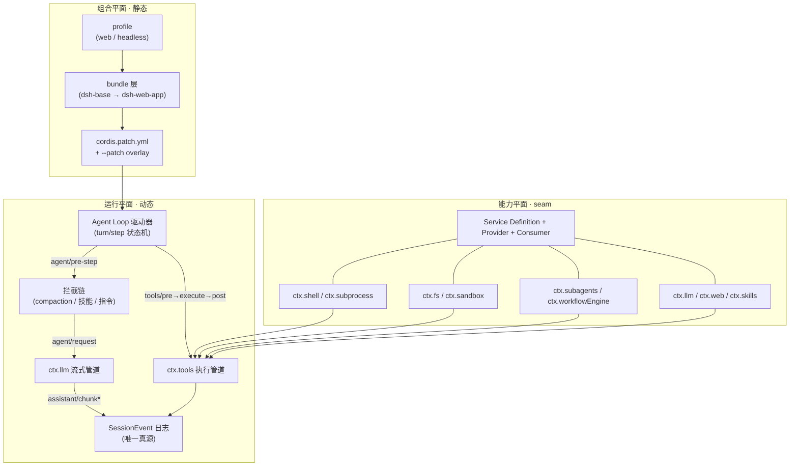

<div align="center">


# DSH 深度拆解

### Deep Dive into DeepSeek Harness · 源码级中文学习资料

<a href="https://github.com/Bin-hy/dsh/stargazers"></a>
<a href="https://github.com/Bin-hy/dsh/blob/main/LICENSE"></a>
<a href="https://vitepress.dev"></a>
<a href="https://github.com/deepseek-ai/DeepSeek-Harness"></a>

**在线阅读 → [deepseek-docs.pages.dev](https://deepseek-docs.pages.dev/)**

</div>

---

## 一句话介绍

> 一份**源码级**的 DeepSeek Harness 中文学习资料：从 Cordis 插件框架到 Agent Loop 状态机，从工具执行管道到多代理编排，把 219 个包的 monorepo 拆成 15 篇可读文章、12 个可迁移设计模式、28 道面试题。

**DeepSeek Harness** 是 DeepSeek 开源的生产级 Agent Harness（Claude Code / Codex CLI 同类产品的底层引擎）。它的设计哲学浓缩为一句话：

```
事件流 + 可逆副作用 = 全部控制流。
循环本身没有特权——策略以监听器身份挂在事件上，能力以提供方身份挂在服务 seam 上。
```

**An English abstract**: A source-level deep dive into [DeepSeek Harness](https://github.com/deepseek-ai/DeepSeek-Harness), the plugin-based agent harness from DeepSeek. 15 in-depth articles explain its event-sourced session log, turn/step state machine, tool execution pipeline, sandbox (Landlock), context engineering (compaction/spill), multi-agent orchestration (subagent/workflow/goal), streaming LLM layer, and plugin-based web GUI — with real type definitions, code paths, design tradeoffs, and interview questions for agent engineering roles. Content is in Chinese.

## ✨ 为什么值得 Star

| | |
|---|---|
| 🧩 **源码级证据** | 每一篇都标注 `文件路径:行号`，可直接回溯到 deepseek-harness 仓库对应代码 |
| 🏗️ **系统化拆解** | 15 篇文章覆盖从插件框架到 Web GUI 的完整架构，不是零散笔记 |
| ⚖️ **讲权衡，不讲名词** | 每个设计都回答"为什么这样设计 + 放弃了什么"，面试官最想听的正是这个 |
| 🎯 **面向求职** | 12 个可迁移设计模式（每条带面试话术）+ 28 道高频题 + 扩展实战 |
| 🎨 **在线可读** | VitePress 站点部署于 Cloudflare Pages，全文搜索 + 代码高亮 + 目录导航 |

## 📖 内容地图

### 导读（3 篇）

- [为什么研究 DSH](https://deepseek-docs.pages.dev/guide/why-dsh) — 项目定位与学习它的四个理由
- [核心概念速览](https://deepseek-docs.pages.dev/guide/concepts) — Cordis、事件、seam、scope、turn/step 术语表
- [架构总览](https://deepseek-docs.pages.dev/guide/architecture) — profile/bundle 组装、40+ 服务地图、轮次流程

### 深度拆解（8 篇）

| # | 章节 | 核心内容 |
|---|---|---|
| 01 | [核心循环：Agent Loop](https://deepseek-docs.pages.dev/deep-dive/agent-loop) | turn/step 状态机、inbox 队列、waterfall 拦截、工具调度 barrier/滚动池 |
| 02 | [工具系统与执行管道](https://deepseek-docs.pages.dev/deep-dive/tools) | 九段流水线、双轨策略（瀑布+单调守卫）、类型安全 schema DSL |
| 03 | [沙箱与权限](https://deepseek-docs.pages.dev/deep-dive/sandbox) | Landlock 自限制 launcher、审批升级、权限预设 |
| 04 | [上下文工程](https://deepseek-docs.pages.dev/deep-dive/context) | prompt 组装、compaction（日志事件即锁）、spill、token 计量、技能系统 |
| 05 | [多代理编排](https://deepseek-docs.pages.dev/deep-dive/orchestration) | subagent 六种 Provider、受限 JS workflow、jobs、goal 循环 |
| 06 | [LLM 层与流式管道](https://deepseek-docs.pages.dev/deep-dive/llm) | StreamChunk 协议、BlockAssembler、重试持久化、凭据只存引用 |
| 07 | [Web GUI 与 API 层](https://deepseek-docs.pages.dev/deep-dive/web) | 插件化浏览器 Cordis、双 WS 流、增量折叠、Typert RPC |
| 08 | [持久化与工程化](https://deepseek-docs.pages.dev/deep-dive/engineering) | 219 包 monorepo、双 face 构建、vendored 框架修改日志 |

### 面试冲刺（2 篇）

- [设计模式手册](https://deepseek-docs.pages.dev/interview/patterns) — 12 个可迁移模式：事件溯源日志、能力 seam、失败类型化、有界委托……
- [高频面试题](https://deepseek-docs.pages.dev/interview/qa) — 概念/源码/系统设计/场景四类共 28 题

### 实战（1 篇）

- [扩展 DSH：加一个工具](https://deepseek-docs.pages.dev/practice/extend) — 五步验证流程 + 技能编写 + 进阶路线图

## 🏗️ 架构全景图



## 🔬 Roadmap

深度拆解持续更新中。全部待深挖项整理在 [research/backlog.md](research/backlog.md)（56 条存疑项 → 12 个文章聚类）：

| 状态 | 计划 |
|---|---|
| ✅ 已发布 | 01~16 + 五篇补遗，共 26 篇；12 个主聚类全部消化 |
| 🔬 研究中 | 第二轮存疑项（消化过程中新发现的 20 条，见 backlog） |

## 🚀 快速开始

```bash
git clone https://github.com/Bin-hy/dsh.git
cd dsh
npm install
npm run dev        # http://localhost:5173/
npm run build      # 输出 docs/.vitepress/dist
```

## ☁️ 部署（Cloudflare Pages）

本站在 [Cloudflare Pages](https://pages.cloudflare.com/) 上部署（https://deepseek-docs.pages.dev）：

```text
构建命令   npm run build
输出目录   docs/.vitepress/dist
环境变量   NODE_VERSION: 22
```

无需任何自定义配置——仓库 push 到 main 后 Pages 自动构建发布。

## 🗺️ 学习路线建议

```text
第 1 天  导读 3 篇          —— 建立心智模型（Cordis、事件、seam）
第 2 天  核心循环 + 工具系统 —— 理解 Agent 的"心跳"
第 3 天  上下文 + 多代理编排 —— 理解 agent 的"记忆"与"协作"
第 4 天  LLM 层 + Web GUI   —— 理解数据如何流动
第 5 天  面试冲刺 + 实战扩展  —— 输出自己的理解
```

## 📚 研究底稿

`research/` 目录保存了 6 份原始研究笔记（约 4,000 行），是博客文章的素材底稿：

```
research/
├── 01-core-loop.md       核心循环与运行时
├── 02-tools-sandbox.md   工具系统与沙箱
├── 03-context-skills.md  上下文工程与技能系统
├── 04-orchestration.md   多代理编排
├── 05-llm-streaming.md   LLM 层与流式管道
└── 06-web-gui.md         Web GUI 与 API 层
```

每份笔记都包含：概念地图、模块与文件地图、真实类型定义（带 `文件:行号`）、执行流程、设计权衡、面试要点与诚实标注的存疑项。

## 🤝 贡献

欢迎以任何形式贡献：

- **纠错**：任何与源码不符的表述，直接提 Issue 或 PR
- **补全**：研究笔记中的 50+ 条存疑项是现成的深挖清单（如 E2B 远程沙箱、ACP 进程外传输）
- **翻译**：英文版的翻译贡献非常欢迎

## 📄 License

本仓库中**原创内容**（博客文章、研究笔记、代码）采用 [MIT License](./LICENSE) 开源。

本项目是对 [DeepSeek Harness](https://github.com/deepseek-ai/DeepSeek-Harness) 的独立学习笔记，非官方文档；DSH 本身遵循其自身的 [MIT License](https://github.com/deepseek-ai/DeepSeek-Harness/blob/main/LICENSE)，文中引用均以学习研究为目的。

## 🙏 致谢

感谢 [DeepSeek](https://www.deepseek.com/) 开源 [DeepSeek Harness](https://github.com/deepseek-ai/DeepSeek-Harness)——它把 agent 工程的共识最佳实践以生产级质量落地，是绝佳的学习范本。

---

<div align="center">

**如果这份资料帮到了你，请点个 Star ⭐，让更多人看到它。**

</div>
