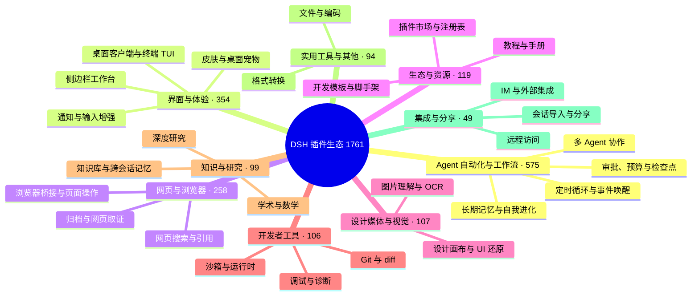

# 🐳 Awesome DSH Plugins

> 用 30 秒为你的 DeepSeek Harness（DSH）找到合适的插件。
> 这不是又一个仓库清单：2000+ 个打着 `dsh-plugin` 标签的仓库里，我们只把「解决真实问题、说得清楚、还在维护」的那部分带到你面前——并告诉你每个插件适合谁、从哪里开始。

[English](./README_EN.md) · [全量目录](./CATALOG.md) · [Star Top 100](./TOP100.md) · [推荐一个插件](./CONTRIBUTING.md) · [机器可读数据](./data/repositories.json)

**如果这个列表帮你找到一个有用的插件，欢迎点一个 Star ⭐。它能帮助更多 DSH 用户发现这个生态。**

## 这个列表怎么用

本仓库分成三层，按你需要的信息深度取用：

| 你想要…… | 直接去哪里 |
| --- | --- |
| 30 秒选出一个插件 | 继续往下读：[场景选型](#-我想让-dsh-做什么) 和 [新手套装](#-新手从这里开始) |
| 按热度或分类翻完整清单 | [TOP100.md](./TOP100.md)（热度榜）· [CATALOG.md](./CATALOG.md)（全量目录） |
| 用程序消费插件数据 | [data/repositories.json](./data/repositories.json)——每日自动快照，含星数、许可证、活跃度等元数据 |
| 收录你自己的插件 | 不需要给我们提 PR：仓库加上 `dsh-plugin` Topic 即会自动进入全量目录，详见[文末](#-推荐或修正插件) |
| 你是插件作者，想上首页曝光 | [作者自荐区](#-作者自荐)：按规范提交一条自荐，无需编辑部审核，区满后先进先出 |

## 🗺️ 生态全景

截至 2026-08-14 共收录 **1761** 个仓库。它们长这样：

按分类浏览每个分类下的全部项目，见 [CATALOG.md](./CATALOG.md)。

## 🎯 我想让 DSH 做什么？

从你的问题出发，而不是从分类出发。找到最接近的一行，点进去就是答案：

| 我想要…… | 推荐从这里开始 | 为什么 |
| --- | --- | --- |
| 想要独立的桌面客户端，而不是浏览器标签页 | [dsh-desktop](https://github.com/bruc3van/dsh-desktop) · [deepseek-harness-desktop](https://github.com/anywhere-labs/deepseek-harness-desktop) | dsh-desktop 开箱即用：自动复用本机已运行的实例，或用内置运行时一键启动，无需安装 Node.js/CLI，支持远程连接、托盘常驻与异常恢复；deepseek-harness-desktop 是生态内星数最高的桌面端（1.3k+ Star，macOS/Windows，服务启动与窗口整合）。 |
| 更方便地管理和发现插件 | [plugin-registry](https://github.com/vlln/plugin-registry) · [dsh-market](https://github.com/dsh-market/dsh-market) | plugin-registry 在浏览器面板中管理 repository 插件并提供开发引导；dsh-market 把插件市场做进 DSH 界面，浏览、搜索、一键安装。 |
| 把现有业务代码转成 Agent 可调用能力 | [Code2Skill](https://github.com/leechen298/Code2Skill) | 从用户授权的前端、后端或全栈源码生成 Function、MCP Tools、业务 Skills 和离线测试，并可作为 DSH Bundle 安装。 |
| 看清后台任务进度 | [dsh-task-status](https://github.com/vlln/dsh-task-status) | 在对话页显示任务进度和实时输出 tail。 |
| 看清上下文窗口里装了什么 | [dsh-context](https://github.com/bowenliang123/dsh-context) | 在 Web UI 增加 Context 面板，展示上下文由什么构成、如何演化，辅助把握 token 控制与裁剪时机。 |
| 定时或按事件唤醒 Agent | [dsh-loop](https://github.com/vlln/dsh-loop) · [dsh-sentinel](https://github.com/fuhefei/dsh-sentinel) | 覆盖周期任务，以及文件、命令、HTTP、进程和 Webhook 事件。 |
| 请求经常因网络波动或超时中断，不想每次手动补一句「继续」 | [dsh-auto-continue](https://github.com/HsiangNianian/dsh-auto-continue) | 回合因非人为原因失败后自动补发「继续」：错误分类只恢复临时性故障，自适应退避避免轰炸故障上游，继续文本可模板化，参数在插件设置卡片中调整。 |
| 更顺手地阅读和操作长对话 | [dsh-navbar](https://github.com/vlln/dsh-navbar) · [dsh-annotation](https://github.com/omdsh-dev/dsh-annotation) | 快速跳转用户消息节点，并像 Codex 一样选中文本批注。 |
| 像 Codex 一样用 @ 引用工作区文件 | [dsh-at-file](https://github.com/omdsh-dev/dsh-at-file) | 在输入框内按 @ 搜索工作区文件并把内容附进 prompt，免去手动复制粘贴。 |
| 在对话中生成交互式界面 | [dsh-genui](https://github.com/omdsh-dev/dsh-genui) | 在回复中渲染图表、表单、测验、Mermaid 和 3D 场景。 |
| 让 Agent 操作真实设计画布 | [dsh-openpencil](https://github.com/ZSeven-W/dsh-openpencil) | 创建、编辑、预览和验证可交互的多页面 OpenPencil 设计稿。 |
| 给 DSH 增加视觉理解能力 | [modlens](https://github.com/liustack/modlens) · [dsh-vision-toolkit](https://github.com/Anionex/dsh-vision-toolkit) · [dsh-luna-vision-bridge](https://github.com/ycp424c/dsh-luna-vision-bridge) | modlens 把图片转成 OCR/布局/语义结构化证据；dsh-vision-toolkit 覆盖图片问答、长截图 OCR、UI 还原与像素对比；纯文本模型也可经 Luna 转写桥接继续处理图片。 |
| 让 Agent 自己搜索网页和 X，答案带引用 | [modsearch](https://github.com/liustack/modsearch) · [anysearch-dsh](https://github.com/anysearch-team/anysearch-dsh) | modsearch 在对话中直接搜索、抓取并返回带引用的结构化证据；anysearch-dsh 提供 AnySearch 搜索源与高级搜索工具，可作补充搜索后端。 |
| 在开发对话里直接检查和操作当前网页 | [dsh-browser-bridge](https://github.com/ycp424c/dsh-browser-bridge) | 把完整 DSH Web 嵌进 Chrome 侧边栏，按 prompt 显式授权当前标签页，DSH 能在同一对话里读取 DOM、样式、console 报错并操作页面，无需另开浏览器专用对话。 |
| 把侧边栏升级成完整工作台 | [DSH-better-sidebar](https://github.com/omdsh-dev/DSH-better-sidebar) | 内置文件渲染编辑、终端、Git 与子代理，并支持第三方扩展注册新 Tab。 |
| 在终端里用 Claude Code 风格界面 | [dsh-TUI](https://github.com/ccch1mneyyy/dsh-TUI) · [dsh-tianshu-tui](https://github.com/huiliyi37/dsh-tianshu-tui) | 全屏交互终端：状态行、思考流展开、上下文/TPS 仪表；tianshu 版本还内置 TDD 与证据门工作流。 |
| 给 DSH 加上可审计的跨会话记忆 | [dsh-memory-evolve](https://github.com/csyangwen/dsh-memory-evolve) · [dsh-mneme](https://github.com/modusensus/dsh-mneme) | 五轨记忆 + 技能自进化；或 SQLite + 可编辑 Markdown 的记忆镜像，记忆透明可改。 |
| 回合结束时收到桌面通知 | [dsh-notification](https://github.com/omdsh-dev/dsh-notification) | 按结果类型（成功/失败）控制通知，支持关键词过滤，长时间任务无需盯屏。 |
| 回退对话与工作区状态 | [dsh-turn-rewind](https://github.com/Anionex/dsh-turn-rewind) | 基于持久化 Change Ledger 回退到任意早期回合，对话与代码状态一起恢复。 |
| 给工作区增加一个陪伴型宠物 | [whale-girl](https://github.com/vlln/whale-girl) | 可拖拽、投喂和玩耍的积累型鲸鱼娘桌面伙伴。 |
| 把其他工具的历史会话搬进 DSH | [dsh-chat-import](https://github.com/Nwflower/dsh-chat-import) | 13 源全保真导入（Claude Code/Codex/ChatGPT/Cursor/Gemini/Reasonix/opencode/ZCode/Grok Build/OpenClaw/Pi/Hermes/Kimi）历史会话为可续聊 DSH 会话，并支持反向导出/同步回 Claude Code。 |
| 换皮肤、自定义背景 | [dsh-skin](https://github.com/KinGao294/dsh-skin) · [dsh-deep-whale](https://github.com/Small-tailqwq/dsh-deep-whale) | dsh-skin 一键切换多套 --dsw-alias-* 配色并支持半透明壁纸（Codex 风格）；dsh-deep-whale 是生态内最受欢迎的鲸鱼娘皮肤系列（CC BY-NC-SA，不可商用）。 |
| 查看 Token 用量与费用 | [dsh-web-billing](https://github.com/bpc-oss/dsh-web-billing) · [dsh-cost-meter](https://github.com/Han-1413141/dsh-cost-meter) | 按官方政策自动计价（含峰谷时段），逐条消息记账，显示账号余额；界面语言自动切换人民币/美元。 |
| 让外部 Agent 驱动 Harness 执行任务 | [dsh-harness-mcp-server](https://github.com/chushixixin/dsh-harness-mcp-server) | 在 Harness 内部启动 MCP server，让任意 MCP 客户端（如 Hermes）下发任务给 Harness 执行，实现「大脑 + 胳膊」协作。 |
| 从外部设备安全访问本机 Harness | [dsh-remote](https://github.com/flymysql/dsh-remote) | 打印当前实例的精确连接命令：SSH 本地转发、autossh 保活、反向隧道（NAT 友好）与带 --trusted-host 的反向代理，设置页一键复制；遵循官方安全设计，不碰 0.0.0.0。 |

## 🚀 新手从这里开始

不需要一次装很多。先选一个与你当前问题最接近的组合：

| 套装 | 适合 | 组合 |
| --- | --- | --- |
| 日常体验 | 第一次装插件，先解决管理、状态和导航 | [plugin-registry](https://github.com/vlln/plugin-registry) · [dsh-task-status](https://github.com/vlln/dsh-task-status) · [dsh-navbar](https://github.com/vlln/dsh-navbar) |
| 自动化 | 定时循环 + 事件驱动唤醒，长时间无人值守任务 | [dsh-loop](https://github.com/vlln/dsh-loop) · [dsh-sentinel](https://github.com/fuhefei/dsh-sentinel) |
| 视觉与搜索 | 让纯文本模型看得见、搜得到 | [modlens](https://github.com/liustack/modlens) · [modsearch](https://github.com/liustack/modsearch) · [dsh-vision-toolkit](https://github.com/Anionex/dsh-vision-toolkit) |
| 创作与界面 | 生成式 UI、真实设计画布与视觉理解 | [dsh-genui](https://github.com/omdsh-dev/dsh-genui) · [dsh-openpencil](https://github.com/ZSeven-W/dsh-openpencil) · [dsh-vision-toolkit](https://github.com/Anionex/dsh-vision-toolkit) |
| 记忆与持续运行 | 跨会话记忆 + 中断自动续跑的无人值守项目 | [dsh-memory-evolve](https://github.com/csyangwen/dsh-memory-evolve) · [dsh-mneme](https://github.com/modusensus/dsh-mneme) · [dsh-auto-continue](https://github.com/HsiangNianian/dsh-auto-continue) |

## ⭐ 编辑精选

**这里不按星数排名。** 我们优先选择解决明确问题、说明完整、仍在维护且具有代表性的项目——所以你会看到 1.2k Star 的项目，也会看到 4 Star 但无可替代的项目。收录不等于安全或兼容性背书。

### 🖥️ 桌面与终端

- **[dsh-desktop](https://github.com/bruc3van/dsh-desktop)**（⭐ 20）— 社区维护的非官方桌面客户端，直接加载官方 Web UI：自动复用本机已运行的实例，或用内置 dsh 运行时一键启动，无需额外安装 Node.js/CLI；支持智能连接、远程实例、托盘常驻和异常恢复。 `桌面客户端` `开箱即用` `智能连接`
- **[deepseek-harness-desktop](https://github.com/anywhere-labs/deepseek-harness-desktop)**（⭐ 1.3k）— 生态内星数最高的桌面端：服务启动与窗口整合，macOS/Windows 开箱可用。 `桌面客户端` `跨平台`
- **[dsh-TUI](https://github.com/ccch1mneyyy/dsh-TUI)**（⭐ 835）— Claude Code 风格的全屏交互终端：像素鲸鱼顶栏、实时状态行、思考流式展开、双击 Esc 回滚、上下文进度条与 TPS 仪表，npm 一键安装。 `终端 TUI` `全屏交互` `CLI 优先`
- **[dsh-tianshu-tui](https://github.com/huiliyi37/dsh-tianshu-tui)**（⭐ 132）— 终端 UI 之外内置 TDD 与「证据门」工作流，把一次性多 Agent 调度升级为可治理的工程过程。 `终端 TUI` `TDD` `证据门`

### 🧰 界面工作台

- **[DSH-better-sidebar](https://github.com/omdsh-dev/DSH-better-sidebar)**（⭐ 709）— 目前最受欢迎的侧边栏增强：内置文件渲染编辑、终端、Git 与子代理，并支持第三方扩展注册新 Tab，把侧边栏变成日常开发主界面。 `侧边栏` `工作台` `可扩展`
- **[dsh-web-ui](https://github.com/zhu1090093659/dsh-web-ui)**（⭐ 1.8k）— 一站式功能合集：任务看板、Git 关系图、侧边面板、远程移动端界面、桌面宠物、实时 Token 用量统计与皮肤中心，一次安装覆盖多个常见界面诉求。 `功能合集` `皮肤中心` `移动端`

### 👀 让模型看得见、搜得到

- **[modlens](https://github.com/liustack/modlens)**（⭐ 1.2k）— 生态内 Star 最高的第三方插件（MIT）：粘贴图片即可得到带 OCR、布局与语义的结构化 JSON 证据，让纯文本模型也能可靠地看图；配套 Web UI。 `视觉` `OCR` `结构化证据`
- **[modsearch](https://github.com/liustack/modsearch)**（⭐ 86）— 让 DSH 直接搜索网页和 X，返回带引用的结构化 JSON 证据（搜索/抓取/引用），纯文本模型也能基于证据回答；与 modlens 组成「看」+「搜」组合。 `搜索` `引用` `证据`
- **[dsh-vision-toolkit](https://github.com/Anionex/dsh-vision-toolkit)**（⭐ 308）— 覆盖图片问答、长截图 OCR、UI 还原、视觉定位、像素对比和 Artifacts，适合前端与视觉任务。 `视觉理解` `OCR` `UI 还原`

### 🧠 记忆与无人值守

- **[dsh-memory-evolve](https://github.com/csyangwen/dsh-memory-evolve)**（⭐ 50）— 纯插件实现的五轨长期记忆：git 分支感知、回合内自我审查、技能自我进化与技能管理器、四轨待办与会话搜索——零核心修改、零运行时依赖，卸载即净。 `长期记忆` `自进化` `零依赖`
- **[dsh-mneme](https://github.com/modusensus/dsh-mneme)**（⭐ 8）— SQLite + 可人工编辑的 Markdown 镜像，记忆不再黑盒；autoDream 后台自动去重/合并/裁决，越用越精炼。记忆这回事不该让 agent 一个人说了算。 `记忆主权` `跨会话记忆` `autoDream`
- **[dsh-auto-continue](https://github.com/HsiangNianian/dsh-auto-continue)**（⭐ 10）— 网络波动、超时或宿主崩溃导致回合失败后，自动发送「继续」续跑：错误分类（认证/余额等永久性错误跳过）、自适应退避、模板化继续文本与浏览器通知，无人值守也能自己爬起来。 `自动续跑` `无人值守` `错误分类`
- **[dsh-sentinel](https://github.com/fuhefei/dsh-sentinel)**（⭐ 4）— 监听文件、命令、HTTP、进程或 Webhook，在条件满足时唤醒 DSH，让 Loop 从定时升级为事件驱动。 `事件驱动` `持久监控` `自动化`

### ✍️ 对话体验细节

- **[dsh-at-file](https://github.com/omdsh-dev/dsh-at-file)**（⭐ 117）— 在输入框里按 @ 搜索工作区文件，把内容直接附进 prompt，不用手动复制粘贴；官方 bundle，零核心改动。 `@file` `工作区` `输入体验`
- **[dsh-annotation](https://github.com/omdsh-dev/dsh-annotation)**（⭐ 39）— 选中文字、添加批注并随消息发送，回复可以逐条对照 Annotation，适合审稿、代码评审和精确反馈。 `批注` `精确反馈` `零核心改动`
- **[dsh-navbar](https://github.com/vlln/dsh-navbar)**（⭐ 15）— 长对话里快速跳转到任意用户消息节点。 `长对话` `导航`
- **[dsh-task-status](https://github.com/vlln/dsh-task-status)**（⭐ 7）— 把后台任务进度和实时输出 tail 放回对话页面，尤其适合构建、下载、测试等长时间命令。 `后台任务` `实时输出` `可观察性`
- **[dsh-notification](https://github.com/omdsh-dev/dsh-notification)**（⭐ 38）— 回合完成后发送桌面通知，按成功/失败等结果分别控制，支持关键词包含/排除规则。 `桌面通知` `无人值守` `关键词规则`

### 🎨 创作与乐趣

- **[dsh-genui](https://github.com/omdsh-dev/dsh-genui)**（⭐ 72）— 在对话中直接呈现图表、表单、测验、Mermaid、3D 场景，并把用户操作重新送回模型。 `生成式 UI` `交互` `可视化`
- **[DSH OpenPencil](https://github.com/ZSeven-W/dsh-openpencil)**（⭐ 65）— 连接 DSH 与 OpenPencil，让 Agent 理解画布结构、节点和组件关系，直接创建、修改、预览并验证可编辑的多页面设计，而不是只返回一张图片。 `设计画布` `多页面` `可编辑`
- **[whale-girl](https://github.com/vlln/whale-girl)**（⭐ 121）— 可拖拽、投喂和玩耍的 DSH Web GUI 桌面宠物，为长时间 Agent 工作增加一点陪伴感。 `桌面宠物` `陪伴` `Web UI`

### 🌱 生态入口

- **[plugin-registry](https://github.com/vlln/plugin-registry)**（⭐ 34）— 面向普通用户的可视化插件管理入口，同时给开发者提供 make-dsh-plugin 引导。适合第一次进入 DSH 插件生态的人。 `新手友好` `插件管理` `开发引导`

## 🏆 社区热度榜

按 Star 排序的社区热度参考，经人工复核，数据取自 2026-08-14 快照（以上项目当日均有推送）；蹭 `dsh-plugin` Topic 的非插件仓库已剔除，清单见 [data/curated.json](./data/curated.json)。完整榜单见 [TOP100.md](./TOP100.md)。排名反映受欢迎程度，不代表质量、兼容性或安全背书。

| # | 项目 | ⭐ Stars | License |
| ---: | --- | ---: | --- |
| 1 | [zhu1090093659/dsh-web-ui](https://github.com/zhu1090093659/dsh-web-ui) | 1785 | Apache-2.0 |
| 2 | [anywhere-labs/deepseek-harness-desktop](https://github.com/anywhere-labs/deepseek-harness-desktop) | 1266 | MIT |
| 3 | [liustack/modlens](https://github.com/liustack/modlens) | 1208 | MIT |
| 4 | [ccch1mneyyy/dsh-TUI](https://github.com/ccch1mneyyy/dsh-TUI) | 835 | MIT |
| 5 | [omdsh-dev/DSH-better-sidebar](https://github.com/omdsh-dev/DSH-better-sidebar) | 709 | MIT |
| 6 | [Small-tailqwq/dsh-deep-whale](https://github.com/Small-tailqwq/dsh-deep-whale) | 538 | — |
| 7 | [Nagi-ovo/dsh-ads](https://github.com/Nagi-ovo/dsh-ads) | 321 | — |
| 8 | [Anionex/dsh-vision-toolkit](https://github.com/Anionex/dsh-vision-toolkit) | 308 | MIT |
| 9 | [morluto/rea](https://github.com/morluto/rea) | 308 | MIT |
| 10 | [NanmiCoder/dsh-agent-teams](https://github.com/NanmiCoder/dsh-agent-teams) | 231 | MIT |
| 11 | [Electricitysheep/dsh-handbook](https://github.com/Electricitysheep/dsh-handbook) | 181 | — |
| 12 | [hust-open-atom-club/oh-dsh](https://github.com/hust-open-atom-club/oh-dsh) | 163 | MIT |
| 13 | [huiliyi37/dsh-tianshu-tui](https://github.com/huiliyi37/dsh-tianshu-tui) | 132 | Apache-2.0 |

## 🆕 最近加入生态

人工筛选的近期新项目，不定期更新：

| 项目 | 简介 | 创建日期 |
| --- | --- | --- |
| [mbj733/dsh-hermes-memory](https://github.com/mbj733/dsh-hermes-memory) | DSH (DeepSeek Harness) agent preset + plugin: Hermes-style cross-session memory & autonomous skill learning. | 2026-08-14 |
| [SnowAmberX/dsh-role-router](https://github.com/SnowAmberX/dsh-role-router) | Role-based model routing plugin for DeepSeek Harness: planner/subagent roles plus a settings card and composer summary | 2026-08-14 |
| [Yee-h/dsh-zen-proxy](https://github.com/Yee-h/dsh-zen-proxy) | dsh plugin: in-process proxy that injects official OpenCode Zen client headers, enabling Zen free models in dsh without the 429 FreeUsageLimitError | 2026-08-14 |
| [khiqwq/dsh-credentials-system](https://github.com/khiqwq/dsh-credentials-system) | System-bound encrypted credential provider for DeepSeek Harness | 2026-08-14 |
| [CodePrometheus/dsh-observability](https://github.com/CodePrometheus/dsh-observability) | Observability for DeepSeek Harness (dsh), use the OpenTelemetry Protocol | 2026-08-14 |
| [mixin-ai/dsh-file-changes](https://github.com/mixin-ai/dsh-file-changes) | DeepSeek Harness web plugin: per-turn file-change panel with diff viewing and filesystem reveal | 2026-08-14 |
| [pineapple880066/dsh-desktop-pets](https://github.com/pineapple880066/dsh-desktop-pets) | Codex-style desktop pets for DeepSeek Harness (dsh-plugin) | 2026-08-14 |
| [sherconan/dsh-web-recon](https://github.com/sherconan/dsh-web-recon) | 网页系统侦察 · DeepSeek Harness 插件：摸清一个网页系统怎么运作，只摸一次。抓真实接口与可访问性树，固化成可复用的作战手册。零依赖，不用 Playwright。 | 2026-08-14 |

## 📣 作者自荐

插件作者按 [CONTRIBUTING](./CONTRIBUTING.md#作者自荐--self-promotion) 规范自行提交的推荐位：**不经编辑部审核，也不代表质量或安全背书**，安装前请自行评估（见下方「使用与安全」）。本区最多保留 15 条，区满后先进先出；条目若被编辑精选收录，会从本区移除。

- **[dsh-skin-amis](https://github.com/wanzhiwei5/dsh-skin-amis)**（[@wanzhiwei5](https://github.com/wanzhiwei5) · 2026-08-14）— 以鸣潮角色「爱弥斯」为灵感的粉白主题皮肤：樱花粉渐变、赛博霓虹深色模式、内置角色背景图与半透明毛玻璃面板，浅深双主题一键切换。
- **[dsh-plugin-hub](https://github.com/Noob-stupid/dsh-plugin-hub)**（[@Noob-stupid](https://github.com/Noob-stupid) · 2026-08-14）— 插件管理面板：已安装插件一键启用/停用，内置 GitHub `dsh-plugin` 插件市场，支持查看插件详情与一键安装。
- **[dsh-github-login](https://github.com/Noob-stupid/dsh-github-login)**（[@Noob-stupid](https://github.com/Noob-stupid) · 2026-08-14）— 零终端的 GitHub 可视化登录：设备码流程，令牌落盘并同步 gh CLI 配置，登录完成即可直接使用 gh。
- **[dsh-session-deeplink](https://github.com/R3alloc/dsh-session-deeplink)**（[@R3alloc](https://github.com/R3alloc) · 2026-08-14）— 为每个会话生成可复用的 `/?session=<id>` 深链接：地址栏随会话同步，链接可收藏、分享，刷新后恢复目标会话；纯浏览器端实现，不增加 host 服务。
- **[dsh-vision-proxy](https://github.com/Flyvhidbwo/dsh-vision-proxy)**（[@Flyvhidbwo](https://github.com/Flyvhidbwo) · 2026-08-14）— DeepSeek 大脑 + 自动识图：附加图片自动经 OpenAI 兼容 VLM 转译成文字后交给 DeepSeek 作答；无 key 时自动探测本地 Ollama。注意：默认配置会把图片发送到第三方 VLM 端点，介意隐私请改用本地端点。
- **[dsh-memory-gate](https://github.com/GIT121995/dsh-memory-gate)**（[@GIT121995](https://github.com/GIT121995) · 2026-08-14）— 「检索到≠注入」的本地长期记忆：每条记忆须通过 CBDC 四段权威门控才进入上下文，输出可解释的 use/verify/ignore 决策并保留审计日志；默认每次最多注入 3 条、1200 字符，不增加第二次模型调用。
- **[dsh-lark-meeting-notifier](https://github.com/yeruizhi/dsh-lark-meeting-notifier)**（[@yeruizhi](https://github.com/yeruizhi) · 2026-08-14）— 飞书会议提醒悬浮框：展示今日/明日会议、多闹钟闪烁提醒，在你跟 AI 聊得忘我时提醒「该去跟碳基生命开会了」。
- **[dsh-reverse-skill](https://github.com/dhicoc/dsh-reverse-skill)**（[@dhicoc](https://github.com/dhicoc) · 2026-08-14）— 85 个 SKILL.md 组成的逆向工程、授权渗透测试与安全研究技能包，安装后按任务自动路由对应技能。
- **[dsh-vision-router](https://github.com/ysr666/dsh-vision-router)**（[@ysr666](https://github.com/ysr666) · 2026-08-14）— 给纯文本 DSH Agent 装上眼睛：内置免 key 视觉链路（匿名端点）+ 像素级工具集（问答/定位/裁剪/像素对比/取色/OCR/SVG 描摹/抠图/截图），无需 Python，一条命令安装，图片回合像普通工具调用回合一样工作。注意：默认匿名端点会把图片发往第三方，介意隐私请自行配置端点。

## 🔍 我们如何维护这个列表

- **面向使用者，而不是爬虫：** 从「我想完成什么」出发组织首页，而不是让你阅读几百行仓库名称。
- **人工推荐 + 全量索引分层：** 首页只放经过人工筛选的推荐；[CATALOG.md](./CATALOG.md) 保留完整 Topic 快照，谁都不会被漏掉。
- **数据自动、页面人工：** 全量目录与原始快照每天自动刷新；首页推荐与榜单由人工参考 [data/repositories.json](./data/repositories.json) 复核后修改，避免刷星、蹭 Topic 等被污染的接口数据直接改写本页。
- **剔除蹭热度条目：** 带 `dsh-plugin` Topic 但并非 DSH 插件的仓库（平台本体、其他 Agent 工具、同名目录站等）不计入目录与榜单，理由逐条记录在 [data/curated.json](./data/curated.json)，可随时复查与质疑。
- **中文默认，中英双语：** 普通用户可以直接理解，英文读者也有独立入口。

截至 2026-08-14，全量目录收录 **1761** 个仓库、**17** 种主要语言；其中 **1486** 个声明了许可证，**1758** 个未归档且未禁用（目录每日自动刷新，最新统计以 [CATALOG.md](./CATALOG.md) 为准）。

## ⚠️ 使用与安全

第三方插件可能读取会话、文件、网络或系统资源。安装前请检查源码、权限、许可证、安装方式和最近更新情况，并优先在隔离环境中试用。本列表仅做发现与整理，不代表 DSH 官方认可，收录也不构成安全或兼容性背书。

## 🤝 推荐或修正插件

发现遗漏、分类不准确或说明过时？欢迎提交 Issue 或 Pull Request：

- **收录你的插件：** 公开仓库只要带上 `dsh-plugin` Topic 且确实是 DSH 插件，就会在每日刷新时自动进入全量目录——**不需要给我们提 PR**。蹭 Topic 的条目会被剔除，理由记录在 [data/curated.json](./data/curated.json)。
- **作者自荐上首页：** 如果你是插件作者，可以按 [CONTRIBUTING](./CONTRIBUTING.md#作者自荐--self-promotion) 的自荐规范在「[作者自荐](#-作者自荐)」区提交一条自荐，无需编辑部审核。
- **上首页推荐：** 首页的场景推荐、编辑推荐与榜单为人工维护页面，提 Issue 告诉我们它解决什么问题、适合谁，或直接编辑对应 Markdown 并附上理由。

详见 [CONTRIBUTING.md](./CONTRIBUTING.md)。

## 📈 Star History

## License

本列表采用 [MIT License](./LICENSE) 发布；各收录项目遵循其各自许可证。
