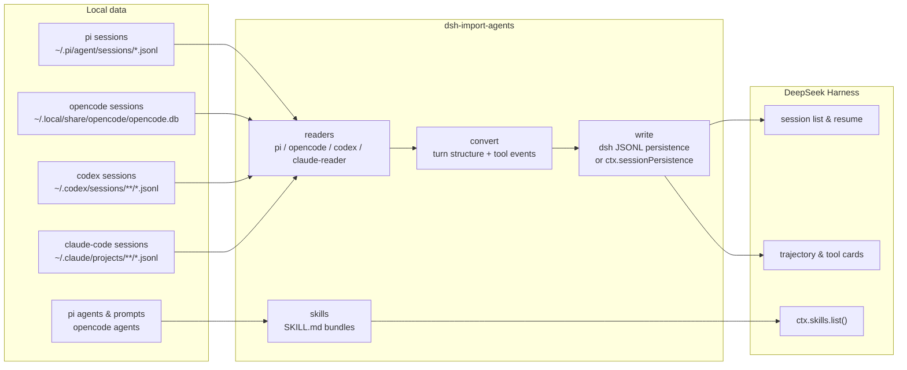

<!--
dsh-import-agents — released under the MIT License.
-->
# dsh-import-agents

[](LICENSE)
[](https://www.npmjs.com/package/dsh-import-agents)
[](https://github.com/Chang-Tong/dsh-import-agents/actions/workflows/ci.yml)
[](https://nodejs.org/)

**dsh-import-agents** imports sessions, chat history, and agents from **pi**, **opencode**, **codex**, and **claude-code** into [DeepSeek Harness](https://github.com/deepseek-ai/deepseek-harness) (dsh). Imported sessions appear in the session list and can be resumed with the full conversation history as context; custom agents and mode prompts become discoverable dsh skills; a one-click **Sync** button in the composer runs the whole import.

| Resource | Link |
| --- | --- |
| 中文文档 | [README.zh.md](README.zh.md) |
| npm package | [dsh-import-agents](https://www.npmjs.com/package/dsh-import-agents) |
| Source code | [github.com/Chang-Tong/dsh-import-agents](https://github.com/Chang-Tong/dsh-import-agents) |

## Table of Contents

- [Features](#features)
- [Screenshots](#screenshots)
- [Installation](#installation)
- [Usage](#usage)
- [How it works](#how-it-works)
- [Configuration](#configuration)
- [Testing](#testing)
- [FAQ](#faq)
- [License](#license)

## Features

- **Four sources, one command.** Import sessions from pi (JSONL), opencode (SQLite), codex (JSONL), and claude-code (JSONL) — as real, resumable dsh sessions.
- **Truly resumable.** Browse the full original history (text, reasoning, tool calls) and continue the conversation — the model gets the complete context.
- **Agents become skills.** pi agents / mode prompts and opencode agents are converted into dsh skill bundles under `$DSH_AGENTS_HOME/skills`, with provenance recorded in frontmatter (`metadata.source` / `metadata.kind`).
- **One-click Sync button.** A small control in the composer tool row runs `/import-all` and shows the result inline.
- **Migration prompt on session start.** When a new top-level session starts and unimported history exists, the plugin asks whether to migrate — per-project decisions are remembered, so it never nags twice.
- **Workspace placement.** Imported sessions attach to a workspace matching their original `cwd` (created on demand); `/attach-workspaces` retro-fits existing imports.
- **Idempotent.** Stable ids (`pi-<uuid>` / `oc-<id>` / `codex-<id>` / `claude-<id>`); re-imports skip what already exists.
- **Zero runtime dependencies.** Node built-ins (`node:zlib` zstd, `node:sqlite`) plus dsh platform modules.

## Screenshots

> Taken from a clean Docker demo environment (English UI) with sample pi / codex sessions.

The dsh web UI with the **Sync** button in the composer tool row:


Clicking **Sync** runs the full import and shows the result inline:


Imported sessions land in a workspace matching their original project folder, with source-tagged titles (`[pi]`, `[opencode]`, `[codex]`, …):


An imported session opens like a native dsh session — text, reasoning, and tool calls are preserved, and you can keep talking:


Tool calls survive the import as real trajectory entries — the **Trajectory** tab renders a card per call (here a `bash` call from the imported codex session):


## Installation

The plugin is published on **npm** as `dsh-import-agents` (latest `0.2.2`). Add it to your dsh profile — shown here for the `web` profile — in three steps: install, configure, restart.

### Step 1 · Install the package

```sh
cd ~/.dsh/profiles/web

# from npm (recommended)
pnpm add dsh-import-agents
# ...or with npm
# npm install dsh-import-agents
```

Other sources:

```sh
# from git
pnpm add git+https://github.com/Chang-Tong/dsh-import-agents.git
# from a local checkout (development)
pnpm add file:/path/to/dsh-import-agents
```

### Step 2 · Enable it in the profile config

Append an entry to `~/.dsh/profiles/web/cordis.patch.yml`:

```yaml
- insert:
    - id: import-pi-opencode
      name: dsh-import-agents
```

- `name` — the npm package name you just installed.
- `id` — the plugin's registered id (keep it as `import-pi-opencode`; the slash commands and the Sync button bind to it).

### Step 3 · Restart and verify

1. Restart `dsh web` — the host plugin registers its slash commands at startup; the client bundle (the Sync button) is served automatically.
2. **Refresh the page** — the old page's RPC connection is gone after a restart.
3. Verify: the composer tool row shows the **Sync** button, and `/import-all` answers in the input.

```sh
# optional sanity checks
npm view dsh-import-agents version     # latest published version
pnpm list dsh-import-agents            # installed in the profile
```

> Disable the session-start migration prompt with `config: { offerOnStart: false }` on the inserted row. Source paths and defaults are overridable the same way — see [Configuration](#configuration).

## Usage

### Quick start

1. **Refresh the page** after a restart.
2. Click **Sync** in the composer tool row — or type `/import-all` in the input.
3. Imported sessions appear in the session list (grouped by workspace); imported agents appear as skills.

Everything is **idempotent** — run it as often as you like; already-imported sessions are skipped.

### Slash commands

| Command | What it does |
| --- | --- |
| `/import-pi [options]` | Import pi sessions |
| `/import-opencode [options]` | Import opencode sessions |
| `/import-codex [options]` | Import codex sessions |
| `/import-claude-code [options]` | Import claude-code sessions |
| `/import-agents` | Convert pi/opencode agents & prompts into dsh skills |
| `/import-all [options]` | All of the above (4 sources + agents) |
| `/attach-workspaces` | Attach imported sessions to cwd-matched workspaces (retro-fit) |

Options: `--limit N` · `--project <substr>` · `--since <iso|ms>` · `--no-tools` · `--tools-as-text` · `--tool-truncate N`

### CLI (no dsh needed)

```sh
node import.mjs all                # dry-run preview (writes nothing)
node import.mjs all --apply        # write sessions + skills
node import.mjs sessions codex --apply --limit 20   # one source at a time
node import.mjs agents --apply     # agents/prompts → skills only
node export.mjs                    # export sessions as Markdown for any agent to read
```

- `import.mjs` defaults to **dry-run**; pass `--apply` to write.
- `all` = pi + opencode + agents; add codex/claude-code explicitly (e.g. `sessions codex`, `sessions claude-code`).
- `export.mjs` writes `$DSH_HOME/exports/<source>/<session-id>.md` (`--source`, `--project`, `--limit`, `--since`, `--out`, `--no-reasoning`, `--no-tools`).

## How it works



The importer is a pure converter: `lib/` parses each source format into a normalized message stream, then emits the exact dsh JSONL event layout (checksummed zstd frames, project-dir encoding) — byte-for-byte the format the dsh persistence backend reads back with its own `list` / `load` / `prepare`.

**Sessions.** Each user message opens a turn (`turn/start` + `user/message`); following assistant messages join it with increasing step numbers; every turn closes with `turn/end`. pi `thinking` → dsh `reasoning` blocks. pi `toolCall`, opencode `tool`, claude `tool_use`, codex `tool_use` → `tool-call` content blocks **plus paired `tool/call` + `tool/result` events**: the trajectory UI renders call cards, and the placeholder `tool/result` answers every `tool_calls` so OpenAI-compatible APIs accept resumed requests. `--tools-as-text` switches to plain text (no trajectory cards); `--no-tools` drops tool calls. Mechanical records (`step-start`, `patch`, `compaction`, …) are skipped.

**Agents & prompts → skills.** Written to `$DSH_AGENTS_HOME/skills/<name>/SKILL.md` (default `~/.agents/skills/`), discoverable via `ctx.skills.list()`. Name conflicts are renamed `<name>-<source>` (e.g. `k3-reviewer-opencode`); existing bundles are only completed, never clobbered; identical content is skipped; frontmatter records `metadata.source` / `metadata.kind`.

## Configuration

| Key | Default | Meaning |
| --- | --- | --- |
| `offerOnStart` | `true` | Ask about migration when a new top-level session starts |
| `piRoot` | `~/.pi/agent/sessions` | pi session root |
| `piAgentRoot` | `~/.pi/agent` | pi agents & prompts root |
| `opencodeDb` | `~/.local/share/opencode/opencode.db` | opencode SQLite path |
| `opencodeConfig` | `~/.config/opencode` | opencode agents root |
| `codexRoot` | `~/.codex/sessions` | codex session root |
| `claudeRoot` | `~/.claude/projects` | claude-code projects root |
| `skillsRoot` | `$DSH_AGENTS_HOME/skills` | skills output root |
| `toolTruncate` | `1000` | tool-call arguments truncation (chars) |

The migration prompt only fires for brand-new **top-level** sessions (startup, not subagents) that have a `cwd` and unimported history. Per-project decisions and the global agents decision are stored in `$DSH_HOME/import-pi-opencode-state.json`; headless environments without a UI provider silently skip the prompt.

## Testing

- `verify.mts` — mounts the **real** dsh JSONL backend + skill provider on staged output (`node --import tsx/esm ../dsh-import-agents/verify.mts <sessions-root> <skills-root>` from the dsh checkout) → expects `SESSIONS ALL PASS / SKILLS ALL PASS`.
- `plugin/plugin-test.mts` — end-to-end: loads the plugin on a real cordis context, runs the commands and the session-start migration offer, asserts idempotency and state persistence.
- `tests/` — Vitest component tests for the Sync button (`sync-button.spec.tsx`, `sync-button-hide.spec.tsx`), plus `opencode-reader.spec.ts` and `attach-workspaces.spec.ts`.
- CI (GitHub Actions, `macos-latest`, Node 22): `pnpm install` → `pnpm run build` → `npx vitest run`.

```sh
pnpm install          # devDependencies (esbuild, vitest)
pnpm run build        # rebuild lib/client.js (Sync button bundle)
npx vitest run        # component tests
```

## FAQ

**Why does Sync say "new imports 0, skipped N"?**
Idempotency working as intended: those sessions were imported before, so they are skipped. Nothing is duplicated.

**Tool call results are missing — why?**
The source formats do not store tool results, only the calls. Imports keep the calls as `tool-call` blocks with placeholder `tool/result` events, so the trajectory renders cards and resumed requests stay API-legal.

**Will it keep asking me to migrate?**
Only while unimported sessions exist, and only per project. Once you decline or an import completes, the decision is remembered in `$DSH_HOME/import-pi-opencode-state.json`.

**Why do I need to refresh after a dsh restart?**
The old page's RPC connection is gone after a restart; commands (and the Sync button) fail until you refresh.

**Node version requirement?**
Node ≥ 22.19 — same baseline as dsh (`node:sqlite`, zstd via `node:zlib`).

## License

MIT — see [LICENSE](LICENSE).
