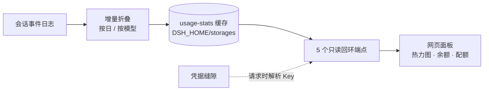

<p align="center">
  <b>中文</b> · <a href="./README_EN.md">English</a>
</p>

<p align="center">
  
</p>

<p align="center">
  <a href="./LICENSE"></a>
  
  
  
</p>

**dsh-token-data** 是 [DeepSeek Harness](https://github.com/deepseek-ai/deepseek-harness)（DSH）的插件，把实时 Token 用量仪表盘带进 `dsh web` 图形界面。点击侧边栏底部的徽章即可打开浮动面板，查看每日 Token 消耗、各供应商余额与订阅配额窗口——不必在多个供应商后台之间来回切换，也无需手工记账。

## 你能看到什么

| 你想知道什么 | 面板会告诉你 |
| --- | --- |
| 今天 / 这个月烧了多少 Token？ | Hero 汇总卡片 + Codex 风格**每日热力图** |
| Token 都花到哪去了？ | **按日、按模型**的明细 + 7 日堆叠趋势图 |
| DeepSeek 余额是不是快用完了？ | **供应商余额**（DeepSeek、OpenRouter、Moonshot/Kimi、Z.ai 等） |
| 订阅窗口还剩多少？ | OpenCode Go、Z.ai、Kimi、MiniMax 的**配额窗口** |
| 提示词缓存真的有用吗？ | 每日**缓存命中率**，就在总数旁边 |

## 它有什么不同

- **零构建步骤**——浏览器端是手写的 `__ModuleLoader__` 模块（无打包器、使用者无需 npm install）；服务端是纯 ESM。clone、添加、重启即可。
- **只读、仅回环的 API**——5 个 `GET` 端点，位于 peer-socket 回环防护之后；绝不会写入你的会话。
- **密钥留在凭据缝隙里**——供应商 API Key 在请求时通过 DSH 凭据服务解析。插件自身不存储任何密钥。
- **增量聚合**——每个会话的折叠状态被缓存（`<DSH_HOME>/storages/usage-stats-cache.json`）；无论日志多大，稳态成本始终是 O(新增事件)。
- **面板抗故障**——网络 / 超时 / HTTP 错误会归类为友好的本地化消息，瞬时失败带退避重试，并保留最后一次成功数据，网络抖动也不会让面板空白。
- **本地化数字格式**——zh/ja 用 亿/万，en 用 K/M/B。

## 支持的供应商

| 供应商 | 余额 | 订阅 / 配额 |
| --- | --- | --- |
| DeepSeek | `GET /user/balance`（CNY） | - |
| OpenRouter | `GET /api/v1/credits`（需 Management Key） | - |
| Moonshot / Kimi | `GET /v1/users/me/balance` | Kimi coding 用量 |
| Z.ai（GLM） | `GET /api/paas/v4/balance` | Coding Plan 配额窗口 |
| OpenCode Go | - | 未公开的用量端点 + 工作区面板兜底 |
| MiniMax | - | Token 套餐余量（global / CN） |
| 其他 | 通用 `new-api` / `sub2api` / `general` 适配器，以及声明式 JSON Pointer 配置 | |

没有公开余额 API 的供应商会明确显示**无公开余额接口**状态，而不是猜测一个数字。

## 安装

**前置条件：** 可正常运行的 DSH（`dsh web` 能启动）、Node.js ≥ 20。

### 方式一：clone 后安装（推荐）

```bash
git clone https://github.com/dawsondx/dsh-token-data.git
cd dsh-token-data
dsh plugin --profile web add \
  --ignore-scripts --config.auto-install-peers=false \
  .
```

### 方式二：直接从 GitHub 添加

```bash
dsh plugin --profile web add \
  --ignore-scripts --config.auto-install-peers=false \
  github:dawsondx/dsh-token-data
```

### 方式三：本地开发

```bash
dsh plugin --profile web add link:C:/path/to/dsh-token-data
```

安装完成后重启 `dsh web`。面板从侧边栏底部徽章打开；用 profile 的 `cordis.patch.yml` 配置监视器（示例见下）。

## 配置

本插件是一个 [DSH profile bundle](https://github.com/deepseek-ai/deepseek-harness)（`dsh.bundle.patch`），内部插件 id 为 `usage-stats`。在 web profile 的 `cordis.patch.yml` 中挂载监视器并配置各供应商选项：

```yaml
- id: usage-stats
  config:
    monitors:
      deepseek-official:
        adapter: deepseek-balance
        allowPrivateNetwork: true   # 放行本地代理（TUN/fake-ip）解析
      minimax-cn:
        adapter: minimax-token-plan
        region: cn                   # MiniMax 中国区账号
```

## 工作原理



服务端在 `/api` 下注册了 5 条精确路由，优先于连接插件的 `/api` 前缀处理器。活动会话只折叠内存中的增量；持久化会话在后端不透明修订号变化时才重新处理新事件（并做连续性检查，日志被截断时会精确重折叠）。

| 端点 | 用途 |
| --- | --- |
| `GET /api/usage-stats/usage` | 所有会话的按日 Token 用量 |
| `GET /api/usage-stats/providers` | 已配置的供应商 + 余额方案 |
| `GET /api/usage-stats/balance?provider=<id>` | 单个供应商的余额 |
| `GET /api/usage-stats/subscriptions` | OpenCode Go + Z.ai 配额窗口 |
| `GET /api/usage-stats/account` | 单个供应商的统一账户快照 |

## 安全性

- **只读**——每个端点都是 `GET`；不会写入你的会话或日志。
- **仅回环**——必须是回环接口的 peer-socket 地址（而非客户端可控的 `Host` 头）；`Host` 头只是二次校验。
- **不存密钥**——凭据在请求时经 DSH 凭据缝隙解析；账户快照会脱敏敏感头（`authorization`、`cookie`、`api-key` 等）。
- **上游调用有界**——供应商请求带 15 秒超时与 1 MB 响应上限。

## 开发

```bash
npm run check   # 对每个 lib 文件执行 node --check
```

`lib/usage.js` 与 `lib/balance.js` 是纯模块（无 cordis 依赖）——折叠与余额解析可以在 DSH 之外对真实日志做单元测试与验证。

## 许可证

[MIT](./LICENSE) © dawsondx
