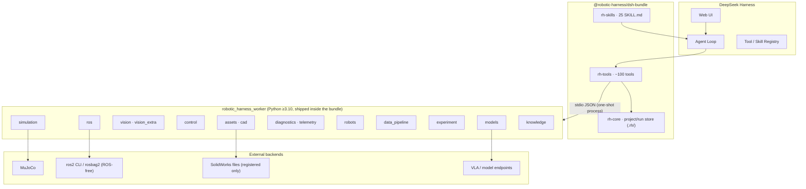

<div align="center">

# 🤖 Robotic Harness

**An embodied-intelligence research plugin suite for [DeepSeek Harness](https://github.com/deepseek-ai/deepseek-harness)**

Put robot assets, simulation, capability orchestration and failure evidence into **one Agent workflow** —
from CAD/URDF inspection to MuJoCo pick-and-place, fault injection, evidence-based diagnostics and reproducible experiment bundles.

[](LICENSE)
[](https://github.com/deepseek-ai/deepseek-harness)
[](https://www.python.org/)
[](docs/tool-inventory.md)
[](packages/dsh-bundle/skills)
[](python/tests)
[](#)

</div>

> 🧪 **Testers & contributors**: this project is at an early **Demo** stage. It has been validated only in a limited local environment (Windows + Anaconda Python 3.10 + DSH 0.1.0-rc.6). ROS 2, CAD, real-robot and other OS/hardware setups have **not been fully tested** — please forgive rough edges and report any issues you hit.
> Everyone is **welcome to test, modify and extend** this plugin suite, and to combine your own robot-related plugins (ROS 2 / CAD / vision / control / VLA / ...) with this suite to **build one bigger, complete robot plugin bundle together** — every independent module can be published and contributed separately. See [CONTRIBUTING.md](CONTRIBUTING.md).

---

## 📑 Table of contents

- [✨ Features](#-features)
- [📸 Screenshots](#-screenshots)
- [🚀 Quick start (30 seconds)](#-quick-start-30-seconds)
- [🏗️ Architecture](#️-architecture)
- [📦 Install as a DSH plugin](#-install-as-a-dsh-plugin)
- [🧩 Tool & skill surface](#-tool--skill-surface)
- [🎯 The demo (MuJoCo pick-and-place)](#-the-demo-mujoco-pick-and-place)
- [⚠️ Known limitations](#️-known-limitations)
- [🌊 Future vision](#-future-vision)
- [📂 Repository layout](#-repository-layout)
- [📚 Documentation](#-documentation)
- [🤝 Contributing](#-contributing)
- [📄 License](#-license)

---

## ✨ Features

| | |
|---|---|
| 🔍 **Assets & CAD** | URDF / MJCF / SDF inspection, inertia & topology validation, mesh stats, SVG preview, URDF→MJCF conversion, SDF-compat export, CAD inventory & version compare |
| 🎮 **Simulation** | MuJoCo pick-and-place with 6 fault-injection modes, batch benchmarks, read-only replay, sim-vs-real gap reports |
| 🧮 **Control** | Tracking metrics (rise/settle/overshoot/SSE), trajectory validation, planned-vs-actual compare, PID templates & config compare, system identification |
| 👁️ **Vision** | Color/generic perception routing, camera health, calibration inspection, pose checks, perception comparison, failure-frame annotation |
| 🧠 **Embodied models** | Model registry, builtin demo adapters (run for real), honest backend probes, rule-based capability routing, policy rollout compare |
| 📡 **Telemetry & diagnostics** | Deterministic rule engine (facts / rules / hypotheses), anomaly scan, failure-evidence collection, run compare |
| 🧬 **Data pipeline** | Inventory, schema, time-sync, alignment, non-destructive transforms, episodes, leakage-safe splits, de-identification, rosbag conversion, LeRobot export, dataset versions & cards |
| 🔬 **Experiments** | Spec → matrix → benchmark → metrics → ablation → report |
| 🤖 **Real-robot flow** | Preflight checklist + experiment state machine (hardware items skipped honestly without an adapter) |
| 📚 **Knowledge** | Docs index/search, error-code lookup, diagnostic-case search, project memory (retrieve/ingest) |
| 📖 **Research** | Literature search (arXiv / Semantic Scholar) + problem→solution proposals with evidence for any stage |
| 🚀 **Autonomous training** | Server check → training plan → supplementary dataset discovery → job prepare (dry-run default) → confirmed remote submit → status → report |
| 📊 **Reports** | Evidence bundles (hash manifests), Markdown reports, standalone timeline & dashboard viewers |

## 📸 Screenshots

A real demo run (left to right): scene render · joint tracking · trajectory with target zone · tracking error.

<table>
  <tr>
    <td align="center"><br/><sub>MuJoCo scene (offscreen render)</sub></td>
    <td align="center"><br/><sub>Joint positions: target vs actual</sub></td>
  </tr>
  <tr>
    <td align="center"><br/><sub>Trajectory & target zone</sub></td>
    <td align="center"><br/><sub>Tracking error over time</sub></td>
  </tr>
</table>

## 🚀 Quick start (30 seconds)

> No DSH needed — pure Python. Requirements: Python ≥ 3.10 with `mujoco`, `numpy`, `opencv-python`, `matplotlib`, `pytest` (the Anaconda `python3.10` env is recommended).

```sh
git clone https://github.com/dingkaihu63/dsh-robotic-harness.git
cd dsh-robotic-harness

# 1) run the test suite (per-file process isolation avoids native DLL
#    collisions between mujoco/cv2/pyarrow — matches the one-shot worker)
cd python && python run_tests.py && cd ..

# 2) run the end-to-end demo: happy run + fault run + diagnostics +
#    evidence bundle + Markdown report + timeline + dashboard
PYTHON=<your python3.10> node scripts/demo.mjs
```

Output lands in `examples/demo-output/`:

| Artifact | What it is |
|---|---|
| `report-run-*.md` | experiment report with evidence and hypotheses |
| `timeline-run-*.html` | standalone timeline viewer (open in any browser, no server) |
| `bundle-run-*/` | self-contained evidence bundle (manifest + sha256 hashes + telemetry + charts) |
| `dashboard.html` | single-file dashboard over the run store |
| `.rh/runs/*/artifacts/*.png` | the charts shown above |

## 🏗️ Architecture



Every tool in the bundle delegates to the Python worker over stdio (`python -m robotic_harness_worker <command> --input -`). Runs, telemetry, charts and reports are written to the workspace's `.rh/` directory by default. One-shot processes give crash isolation: a worker failure never takes down DSH.

## 📦 Install as a DSH plugin

Requirements: DSH CLI (`@deepseek-ai/dsh` ≥ 0.1.0-rc.6), pnpm, a Python 3.10 environment.

```sh
# 0) environment (example: keep everything on the F: drive)
export DSH_HOME=/f/dsh/.dsh-home
export PATH="/f/dsh/.tools:$PATH"            # directory containing pnpm

# 1) create a profile and install the bundle
dsh plugin --profile rh-demo add ./packages/dsh-bundle

# 2) enable the Web UI
#    Note: the upstream npm release of @deepseek-ai/dsh-web-app depends on the
#    private package @deepseek-ai/dsh-frontend (registry 404), so `pnpm add`
#    fails. Built-in bundles resolve from the dsh install directory, so edit
#    $DSH_HOME/profiles/rh-demo/package.json instead:
#      dsh.profile.bundles = ["@deepseek-ai/dsh-base", "@deepseek-ai/dsh-web-app",
#                             "@robotic-harness/dsh-bundle"]
#    (save as UTF-8 without BOM)

# 3) point rh-tools.pythonPath at your Python 3.10 interpreter in the
#    profile's cordis.patch.yml (a patch replaces the whole row config,
#    so restate every key)

# 4) start the Web UI (pick any free port; 3090 is used here so it never
#    clashes with the default DSH web port 3080 or with other apps)
dsh --profile rh-demo --port 3090
```

**Alternatives**: the bundle can also be installed from a **tarball** (`dsh plugin add ./robotic-harness-dsh-bundle-0.1.0.tgz`), from **git** (`dsh plugin add github:dingkaihu63/dsh-robotic-harness`), or from **npm** once published. Packaging/publishing steps and checks live in [docs/publishing.md](docs/publishing.md).

Then just ask the Agent:

> “Run the Robotic Harness pick-place demo: inspect the demo arm, run one clean simulation and one fault-injected simulation, diagnose the failure, export the evidence bundle and generate the report.”

The Agent will drive the `rh_*` tools step by step and keep every result as evidence.

## 🧩 Tool & skill surface

**~110 `rh_*` tools and 27 Skills across fourteen domains.** The complete table (tool → worker command → risk level) lives in [docs/tool-inventory.md](docs/tool-inventory.md). A quick tour:

| Domain | Example tools |
|---|---|
| Assets & CAD | `rh_robot_asset_inspect` · `rh_urdf_validate` · `rh_urdf_to_mjcf` · `rh_sdf_validate` · `rh_cad_inventory` · `rh_mesh_inspect` · `rh_inertia_validate` · `rh_robot_topology_validate` · `rh_urdf_preview` · `rh_export_sim_asset` |
| ROS 2 | `rh_ros_graph_snapshot` · `rh_ros_topic_profile` · `rh_ros_qos_check` · `rh_ros_tf_audit` · `rh_rosbag_inspect` *(ROS-free)* · `rh_rosbag_start/stop` · `rh_ros_call_whitelisted_action` |
| Control | `rh_control_trace_analyze` · `rh_trajectory_validate` · `rh_planned_actual_compare` · `rh_pid_experiment_prepare` · `rh_controller_config_compare` · `rh_system_identification_job` |
| Vision | `rh_camera_health_check` · `rh_calibration_inspect` · `rh_perception_run` · `rh_perception_compare` · `rh_pose_transform_validate` · `rh_annotate_failure_frame` |
| Models | `rh_model_inventory` · `rh_model_health` · `rh_model_infer_job` · `rh_model_benchmark` · `rh_capability_route_explain` · `rh_policy_rollout_compare` |
| Simulation | `rh_sim_run` · `rh_sim_fault_inject` · `rh_sim_batch_benchmark` · `rh_sim_replay` · `rh_sim_real_gap_report` · `rh_sim_validate_scenario` |
| Robots | `rh_robot_preflight` · `rh_experiment_prepare` · `rh_experiment_request_approval` · `rh_experiment_start` · `rh_experiment_pause` · `rh_experiment_safe_cancel` · `rh_experiment_status` · `rh_experiment_finalize` |
| Telemetry | `rh_telemetry_channels` · `rh_telemetry_window` · `rh_anomaly_scan` · `rh_failure_evidence_collect` · `rh_run_compare` · `rh_diagnose_run` · `rh_timeline_export` |
| Data | `rh_data_inventory` · `rh_data_time_sync_estimate` · `rh_data_align_streams` · `rh_data_transform_apply` · `rh_data_split_create` · `rh_data_leakage_check` · `rh_data_deidentify` · `rh_data_convert_rosbag` · `rh_data_export_lerobot` · `rh_dataset_version_create` · `rh_dataset_card_generate` |
| Experiment | `rh_experiment_spec_create` · `rh_experiment_matrix_expand` · `rh_benchmark_start` · `rh_metrics_compute` · `rh_ablation_compare` · `rh_benchmark_report` |
| Knowledge & memory | `rh_docs_index` · `rh_manual_search` · `rh_error_code_lookup` · `rh_case_search` · `rh_memory_retrieve` · `rh_memory_ingest` |
| Research & literature | `rh_literature_search` · `rh_problem_solutions` — search public literature for the problem you're facing (any stage), get evidence-backed options to choose from |
| Autonomous training | `rh_train_server_check` · `rh_train_plan_create` · `rh_train_data_discovery` · `rh_train_job_prepare` · `rh_train_job_status` · `rh_train_report` — plan a training run, find supplementary datasets, prepare the job locally, and only with your explicit confirmation submit it to a configured server |
| Reports | `rh_evidence_export` · `rh_report_generate` · `rh_dashboard_generate` |

### Implementation status

The full plan's tool/skill surface is implemented as **demo-grade adapters**:

- ✅ **Pure-software modules** — complete and tested (assets, CAD, simulation, control, vision, models, diagnostics, telemetry, data, experiment, knowledge, memory, research, training).
- 🔌 **Backend-dependent modules** — ROS 2 live probes, SolidWorks parsing, real-robot adapters, heavy VLA models exist as honest adapters: when the backend is missing they return a structured `backend: "unavailable"` diagnostic with install instructions, **never a fake pass**. rosbag2 inspection/conversion works without ROS.

## 🎯 The demo (MuJoCo pick-and-place)

- **Scenario**: planar 3-DOF arm with a suction cup picks a red box from the table and places it into a target zone (MuJoCo, built from primitives, no external meshes).
- **Perception routing**: color segmentation (low latency) → generic saliency segmentation on failure/occlusion; the routing reason is recorded.
- **Fault injection** (deterministic, seed-controlled): `perception_offset_px`, `gripper_slip`, `tf_offset`, `sensor_noise`, `model_timeout_s`, `occlusion`.
- **Telemetry**: joint target/actual/error, suction state, object pose, perception estimate vs ground truth; charts and a scene render.
- **Diagnostics**: the rule engine produces layered evidence — facts (timestamps and values), rule findings (thresholds/state machine), candidate root causes (grouped by perception/calibration/mechanical/control/system layer, with likelihood and missing evidence). **The final conclusion is left to a human.**
- **Evidence**: self-contained evidence bundle (hash manifest + all records) + Markdown report + timeline.html.

## ⚠️ Known limitations

> Stated honestly, so testers are never surprised.

- The suction grasp is a **kinematic implementation** (the object follows the cup while attached) — noted in run configs and reports.
- Perception uses real offscreen rendering when the renderer is available; otherwise it degrades to ground-truth + noise simulation (recorded in telemetry). If OpenCV crashes natively (e.g., DLL conflicts in exotic environments), perception degrades to the same fallback instead of failing the run. Headless Linux needs a software GL (`sudo apt install libosmesa6 libgl1` + `MUJOCO_GL=osmesa`) for offscreen rendering; the CI runs this way.
- Live ROS 2 tools require the `ros2` CLI; without it they return a structured `backend: "unavailable"` diagnostic. rosbag2 inspection/conversion works without ROS.
- Real-robot tools are a state machine + preflight only: hardware items are reported as `skip` (never faked) until a hardware adapter exists. Simulation results are not real-robot evidence; there is no arbitrary topic-publish, real-robot write, or e-stop-release capability.
- SolidWorks files are registered in inventories but not parsed (commercial software); FreeCAD deep integration is optional.
- RLDS export produces a manifest skeleton (full TFDS export requires tensorflow); LeRobot export uses parquet when pyarrow is present, CSV otherwise.
- Literature search and dataset discovery are best-effort network calls: when the API is unreachable they return a structured `backend: "unavailable"` result instead of fabricating papers or datasets.
- Training tools are workflow scaffolding: the generated training script is a deterministic template placeholder (not real model code), remote submission requires an explicitly configured server plus your confirmation, and only allowlisted commands run remotely.

## 🌊 Future vision

Robotic Harness is, for now, an attempt built with one person's limited time and resources. It is rough around the edges, many modules still await validation in real environments, and it surely hides bugs. That is exactly why **community participation matters more than anything else**:

- **Use it** — real usage is the best testing and the most convincing evidence for what to build next;
- **Fix it** — report bugs, tighten edge cases, correct the docs; every fix makes the path smoother for the next person;
- **Extend it** — new Skills, scenarios, failure cases, data adapters, ROS 2 live validation, new domains;

The destination we hope for is not "one person's plugin", but an **open platform raised on the open-source DeepSeek Harness foundation, shaped by generations of community contribution, that fits robotics and embodied-intelligence development better** — where the model orchestrates, specialized capabilities each do their own job, every experiment keeps full evidence, and every contribution is recorded and reused.

> *正因有涓涓细流，才铸就了大江大河。* — every great river begins as trickling streams; open source is how those streams find each other.

**Every contribution is welcome.** 🌊

## 📂 Repository layout

```text
packages/dsh-bundle/   the installable DSH bundle (TS plugins, skills/, worker copy, fixtures, scenarios)
python/                the robotic_harness_worker Python package + tests (run_tests.py)
fixtures/              URDF/SDF test assets + a demo rosbag2 (no ROS needed)
scenarios/             MuJoCo scenario definitions (JSON)
scripts/               sync-worker / demo / smoke-worker
docs/                  architecture, safety boundary, roadmap, demo guide, tool inventory, worker contract
examples/demo-output/  sample one-command demo output
```

## 📚 Documentation

- [Architecture & domain model](docs/architecture.md)
- [Safety boundary](docs/safety-boundary.md)
- [Roadmap](docs/roadmap.md)
- [Demo guide](docs/demo.md)
- [Tool inventory](docs/tool-inventory.md)
- [Worker module contract](docs/worker-module-contract.md) — for contributors adding new domains
- [Contributing](CONTRIBUTING.md) · [Security policy](SECURITY.md) · [Third-party notices](THIRD_PARTY_NOTICES.md)
- 中文文档：[README.zh.md](README.zh.md)

## 🤝 Contributing

We welcome testers, bug reports, and contributors — see [CONTRIBUTING.md](CONTRIBUTING.md) for the module contract, testing workflow and contribution guidelines. Good first contributions: a new Skill, a new scenario, a new failure case, a data importer/exporter, or ROS 2 live-backend validation on real hardware.

## 📄 License

[MIT](LICENSE). Third-party components and assets carry their own licenses (see [THIRD_PARTY_NOTICES.md](THIRD_PARTY_NOTICES.md)).
This repository is not affiliated with DeepSeek; DSH is a separate project (MIT, [deepseek-harness](https://github.com/deepseek-ai/deepseek-harness)).
