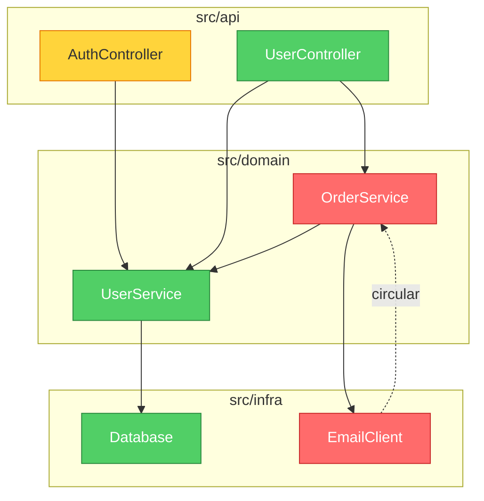

<p align="center">
  
</p>

<h1 align="center">brooks-lint</h1>

<p align="center">
  <strong>AI code reviews grounded in twelve classic engineering books.<br>
  Consistent. Traceable. Actionable.</strong>
</p>

<p align="center">
  <strong>English</strong> ·
  <a href="README.zh-CN.md">简体中文</a> ·
  <a href="README.zh-TW.md">繁體中文</a> ·
  <a href="README.ja.md">日本語</a> ·
  <a href="README.ko.md">한국어</a> ·
  <a href="README.es.md">Español</a>
</p>

<p align="center">
  <a href="#quick-start">Quick Start</a> •
  <a href="#the-six-decay-risks">The Six Decay Risks</a> •
  <a href="#what-it-looks-like">What It Looks Like</a> •
  <a href="#benchmark">Benchmark</a> •
  <a href="#installation">Installation</a>
</p>

<p align="center">
  
  
  
  
  
</p>

<p align="center">
  <a href="https://trendshift.io/repositories/47738" target="_blank"></a>
</p>

<p align="center">
  
</p>

<p align="center">
  <a href="https://hyhmrright.github.io/brooks-lint/"></a>
</p>

<p align="center">
  <strong><a href="https://hyhmrright.github.io/brooks-lint/">→ Visit the website</a></strong>
</p>

---

> *"The bearing of a child takes nine months, no matter how many women are assigned."*
> — Frederick Brooks, *The Mythical Man-Month* (1975)

**50 years later, Brooks was still right — and so were McConnell, Fowler, Martin, Hunt & Thomas, Evans, Ousterhout, Winters, Meszaros, Osherove, Feathers, and the Google Testing team.**

Most code quality tools count lines and cyclomatic complexity. **brooks-lint** goes deeper — it diagnoses your code against six decay risk dimensions synthesized from twelve classic engineering books, producing structured findings with book citations, severity labels, and concrete remedies every time.

For the full source-to-skill mapping, including exceptions and false-positive guards, see
[`skills/_shared/source-coverage.md`](skills/_shared/source-coverage.md).

## Quick Start

```bash
# Claude Code
/plugin marketplace add hyhmrright/brooks-lint
/plugin install brooks-lint@brooks-lint-marketplace

# Any other Agent Skills platform — Cursor · Codex · Gemini · Copilot · Windsurf · OpenCode · Kiro · …
curl -fsSL https://raw.githubusercontent.com/hyhmrright/brooks-lint/main/scripts/install.sh | bash -s -- <platform>
```

Then just ask ("review this PR", "audit the architecture"), or run one of the six commands —
`/brooks-review`, `/brooks-audit`, `/brooks-debt`, `/brooks-test`, `/brooks-health`, `/brooks-sweep`
([what each one does](#slash-commands)).

Every finding comes back as **Symptom → Source → Consequence → Remedy** with a book citation and a
0–100 Health Score. Full install options (9 more platforms) and CI/CD setup are [below](#installation).

## The Twelve Books

| Book | Author | Contributes to |
|------|--------|----------------|
| *The Mythical Man-Month* (1975) | Frederick P. Brooks Jr. | R2, R4, R5 |
| *Code Complete* (1993, 2nd ed. 2004) | Steve McConnell | R1, R4 |
| *Refactoring* (1999, 2nd ed. 2018) | Martin Fowler | R1, R2, R3, R4, R6 |
| *Clean Architecture* (2017) | Robert C. Martin | R2, R5 |
| *The Pragmatic Programmer* (1999, 20th Anniv. 2019) | Andrew Hunt & David Thomas | R2, R3, R4, R5, T2, T3 |
| *Domain-Driven Design* (2003) | Eric Evans | R1, R3, R6 |
| *A Philosophy of Software Design* (2018) | John Ousterhout | R1, R4 |
| *Software Engineering at Google* (2020) | Winters, Manshreck & Wright | R2, R5 |
| *The Art of Unit Testing* (2009, 3rd ed. 2023) | Roy Osherove | T1, T2, T4, T5 |
| *How Google Tests Software* (2012) | Whittaker, Arbon & Carollo | T5, T6 |
| *Working Effectively with Legacy Code* (2004) | Michael Feathers | T4, T5, T6 |
| *xUnit Test Patterns* (2007) | Gerard Meszaros | T1, T2, T3, T4 |

## The Six Decay Risks

brooks-lint evaluates your code across **six production-code decay risks** and **six test-suite decay risks** synthesized from twelve classic engineering books:

| Decay Risk | Diagnostic Question | Sources |
|------------|---------------------|---------|
| 🧠 Cognitive Overload | How much mental effort to understand this? | Code Complete, Refactoring, DDD, Philosophy of SD |
| 🔗 Change Propagation | How many unrelated things break on one change? | Refactoring, Clean Architecture, Pragmatic, SE@Google |
| 📋 Knowledge Duplication | Is the same decision expressed in multiple places? | Pragmatic, Refactoring, DDD |
| 🌀 Accidental Complexity | Is the code more complex than the problem? | Refactoring, Code Complete, Brooks, Philosophy of SD |
| 🏗️ Dependency Disorder | Do dependencies flow in a consistent direction? | Clean Architecture, Brooks, Pragmatic, SE@Google |
| 🗺️ Domain Model Distortion | Does the code faithfully represent the domain? | DDD, Refactoring |

> Philosophy of SD = *A Philosophy of Software Design* (Ousterhout) · SE@Google = *Software Engineering at Google* (Winters et al.)

## What It Looks Like

Given this code:

```python
class UserService:
    def update_profile(self, user_id, name, email, avatar_url):
        user = self.db.query(f"SELECT * FROM users WHERE id = {user_id}")
        user['email'] = email
        ...
        if user['email'] != email:   # always False — silent bug
            self.smtp.send(...)
        points = user['login_count'] * 10 + 500
        self.db.execute(f"UPDATE loyalty SET points={points} WHERE user_id={user_id}")
```

brooks-lint produces:

---

**Health Score: 28/100**

*This method concentrates four unrelated business responsibilities into a single function, contains a logic bug that silently suppresses email change notifications, and is wide open to SQL injection.*

### 🔴 Change Propagation — Single Method Changes for Four Unrelated Business Reasons
**Symptom:** `update_profile` performs profile field updates, email change notifications, loyalty points recalculation, and cache invalidation all in one method body.
**Source:** Fowler — *Refactoring* — Divergent Change; Hunt & Thomas — *The Pragmatic Programmer* — Orthogonality
**Consequence:** Any change to the loyalty formula risks breaking email notifications and vice versa. Every edit carries regression risk across four unrelated domains simultaneously.
**Remedy:** Extract `NotificationService`, `LoyaltyService`, and `UserCacheInvalidator`. `UserService.update_profile` should orchestrate by calling each — it should hold no implementation logic itself.

### 🔴 Domain Model Distortion — Silent Logic Bug: Email Notification Never Fires
**Symptom:** `user['email'] = email` overwrites the old value before `if user['email'] != email` — the condition is always `False`. The notification is dead code.
**Source:** McConnell — *Code Complete* — Ch. 17: Unusual Control Structures
**Consequence:** Users are never notified when their email address changes. Silent data integrity failure — the system appears functional while violating a business rule.
**Remedy:** Capture `old_email = user['email']` before any mutation. Compare against `old_email`, not `user['email']`.

*(+ 6 more findings including SQL injection, dependency disorder, magic numbers)*

### Architecture Audit with Dependency Graph

In Mode 2 (Architecture Audit), brooks-lint generates a **Mermaid dependency graph** at the top of the report. Modules are color-coded by severity: red = Critical findings, yellow = Warning, green = clean.



The graph renders natively in GitHub, Notion, and other Markdown environments — no extra tools needed.

## See More Examples

The [Full Gallery](docs/gallery.md) has real brooks-lint output across Python, TypeScript, Go, and Java — including PR reviews, architecture audits with Mermaid dependency graphs, tech debt assessments, and test quality reviews.

New to the decay risks? The [**Decay Risk Field Guide**](https://hyhmrright.github.io/brooks-lint/guide.html) explains all six — diagnostic question, signature symptoms, source books, and remedy for each.

---

## Benchmark

Tested across 3 real-world scenarios (PR review, architecture audit, tech debt assessment):

| Criterion | brooks-lint | Claude alone |
|-----------|:-----------:|:------------:|
| Structured findings (Symptom → Source → Consequence → Remedy) | ✅ 100% | ❌ 0% |
| Book citations per finding | ✅ 100% | ❌ 0% |
| Severity labels (🔴/🟡/🟢) | ✅ 100% | ❌ 0% |
| Health Score (0–100) | ✅ 100% | ❌ 0% |
| Detects Change Propagation | ✅ 100% | ✅ 100% |
| **Overall pass rate** | **94%** | **16%** |

The gap isn't what Claude *can* find — it's what it *consistently* finds, with traceable evidence and actionable remedies every time.

### Reproducible benchmarks

The table above is illustrative. These numbers are **deterministic and you can reproduce them locally**:

**Parser fidelity** — SARIF export and the CI gates depend on parsing the model's Markdown report correctly. Against a **frozen corpus of 30 real, model-generated reports** spanning all six modes (`evals/benchmark-corpus.json`), each paired with an **independently graded** finding inventory (a separate model pass, spot-checked by hand), the shipped parser scores — run `npm run benchmark`:

| Metric (n = 30, frozen corpus) | Result |
|---|:---:|
| Exact severity-count match (parser vs. graded truth) | 30 / 30 |
| Risk-code precision / recall | 100% / 100% (56 finding-level codes, 0 FP / 0 FN) |
| Valid SARIF 2.1.0 emitted | 30 / 30 |

Because the parser is deterministic and the corpus is frozen, `npm run benchmark` gives everyone the same result, and `npm test` guards it as a regression. The corpus deliberately includes 9 false-positive / tradeoff reports (e.g. a ports-and-adapters design that *looks* like a dependency cycle) that must stay clean.

**Scoring determinism** — for a fixed finding set (2 Critical / 3 Warning / 1 Suggestion), the strictness presets produce exactly the scores their `common.md` table predicts: strict **34**, balanced **54**, legacy-friendly **74** — and only `legacy-friendly` leads with the top-three fixes.

**Model quality** — whether the model finds the *right* risks on real code is measured by the **57-scenario eval suite** (`evals/evals.json`): `npm run evals` (structural) and `npm run evals:live` (live, needs `ANTHROPIC_API_KEY`).

> Scope & honesty: the parser numbers are deterministic and exactly reproducible. The strictness and eval-suite figures are single-run live measurements against the model and vary slightly run to run. The parser benchmark measures report-parsing fidelity (does the tooling read every finding the report states?), not whether a given finding is "correct." The severity-count match is the fully independent signal; risk-code agreement also reflects the shared canonical name→code legend.

## How It Compares

| | brooks-lint | ESLint / Pylint | GitHub Copilot Review | Plain Claude |
|---|:---:|:---:|:---:|:---:|
| Detects syntax & style issues | — | ✅ | ✅ | ~ |
| Structured diagnosis chain | ✅ | ❌ | ❌ | ❌ |
| Traces findings to classic books | ✅ | ❌ | ❌ | ❌ |
| Consistent severity labels | ✅ | ✅ | ~ | ❌ |
| Architecture-level insights | ✅ | ❌ | ~ | ~ |
| Domain model analysis | ✅ | ❌ | ❌ | ~ |
| Zero config, no plugins to install | ✅ | ❌ | ✅ | ✅ |
| Works with any language | ✅ | ❌ | ✅ | ✅ |

> `~` = occasionally / inconsistently

**brooks-lint doesn't replace your linter.** It catches what linters can't: architectural drift, knowledge silos, and domain model distortion — the problems that slow teams down for months before anyone notices.

## Installation

### Claude Code (recommended)

```bash
/plugin marketplace add hyhmrright/brooks-lint
/plugin install brooks-lint@brooks-lint-marketplace
```

Short-form commands (`/brooks-review`) are auto-installed on first session start — or run
`bash hooks/session-start` yourself. To skip the marketplace:
`mkdir -p ~/.claude/skills/brooks-lint && cp -r skills/* ~/.claude/skills/brooks-lint/`.

### Gemini CLI · Codex CLI

```bash
/extensions install https://github.com/hyhmrright/brooks-lint   # Gemini CLI
```
```
Install the brooks-lint skill from hyhmrright/brooks-lint       # ask inside a Codex session
```

Or use the installer below: `./scripts/install.sh gemini` / `./scripts/install.sh codex`.

### Every other platform — OpenCode · Cursor · Windsurf · Antigravity · pi · Copilot · Kiro · Factory Droid · DeepSeek Harness

brooks-lint ships as standard [Agent Skills](https://agentskills.io). **Any agent that loads Agent
Skills runs all six modes with no conversion** — one command installs them:

```bash
# pick your platform; --project installs into the current repo instead of your global config
curl -fsSL https://raw.githubusercontent.com/hyhmrright/brooks-lint/main/scripts/install.sh | bash -s -- <platform>
#   <platform> = opencode · cursor · windsurf · antigravity · pi · kiro · copilot · droid · dsh · gemini · codex · agents
```

The installer copies the skills **flat** into the right folder, so the shared framework
(`../_shared/`) always resolves — you can't get the layout wrong. Then just ask ("review this PR",
"audit the architecture") and the matching skill auto-triggers from its `description`.

| Platform | Installs into | Also reads | Guide |
|---|---|---|---|
| OpenCode | `~/.config/opencode/skills` | `~/.claude/skills`, `AGENTS.md` | [setup](docs/opencode-setup.md) |
| Cursor (2.4+) | `~/.cursor/skills` | `.agents/skills`, `AGENTS.md` | [setup](docs/cursor-setup.md) |
| Windsurf (Cascade) | `~/.codeium/windsurf/skills` | `AGENTS.md` | [setup](docs/windsurf-setup.md) |
| Antigravity (Google) | `.agent/skills` (`--project`) | `AGENTS.md`, `GEMINI.md` | [setup](docs/antigravity-setup.md) |
| pi (earendil-works) | `~/.pi/agent/skills` | — | [setup](docs/pi-setup.md) |
| GitHub Copilot | `.github/skills` (`--project`) | `.claude/skills`, `AGENTS.md` | [setup](docs/copilot-setup.md) |
| Kiro (AWS) | `~/.kiro/skills` | `AGENTS.md` | [setup](docs/kiro-setup.md) |
| Factory Droid | `~/.factory/skills` | `AGENTS.md` | [setup](docs/factory-droid-setup.md) |
| DeepSeek Harness (`dsh`) | `~/.dsh/skills` | `~/.agents/skills`, `AGENTS.md` | [setup](docs/dsh-setup.md) |

Kiro, Factory Droid, and DeepSeek Harness also auto-register `/brooks-review`. New to skills, or
using an agent not listed? See **[docs/getting-started.md](docs/getting-started.md)**.

> **🧪 Verification status.** Claude Code, Gemini CLI, and Codex CLI are maintainer-verified. The
> nine platforms above are documented from each tool's official skill spec and verified at the
> file-layout level (the installer is tested), but not yet run end-to-end by the maintainer on every
> platform. Tried one — working **or** broken?
> [Open an issue](https://github.com/hyhmrright/brooks-lint/issues/new) with the platform, version,
> and what you saw. Another Agent-Skills agent? It almost certainly works the same way — tell us and
> we'll add it.

## Slash Commands

| Command | What it does |
|---------|--------------|
| `/brooks-review` | Paste a diff or point the AI at changed files. Diagnoses each of the six decay risks in Symptom → Source → Consequence → Remedy format. |
| `/brooks-audit` | Maps module dependencies (with a Mermaid graph), identifies circular dependencies, and checks Conway's Law alignment. |
| `/brooks-debt` | Classifies debt across the six decay risks, scores each finding by Pain × Spread, and produces a repayment roadmap with Critical / Scheduled / Monitored tiers. |
| `/brooks-test` | Audits the suite against six test-space decay risks — Test Obscurity, Test Brittleness, Test Duplication, Mock Abuse, Coverage Illusion, Architecture Mismatch. |
| `/brooks-health` | Abbreviated scans across all four quality dimensions → one weighted composite Health Score. Use it before a release or when onboarding a team. |
| `/brooks-sweep` | Unified scan across R1–R6, T1–T6, and architecture, then applies fixes: safe changes auto-applied, multi-file changes confirmed, architectural decisions flagged as manual. Outputs a Fix Log and score delta. |

**Syntax by platform.** Claude Code also accepts the namespaced form
`/brooks-lint:brooks-review` — short forms are auto-installed on first session start by the
session-start hook. Codex CLI uses `$brooks-review`. Gemini CLI uses the table as written.
OpenCode, Cursor, Antigravity, pi, and DeepSeek Harness invoke Agent Skills from each skill's
`description`, so just ask ("review this PR", "where's our worst tech debt?"); for explicit
invocation use the platform's own syntax (pi registers each skill as `/skill:brooks-review`; dsh
takes the table as written, from its `/` menu or typed inline). On every platform the
skills also trigger automatically when you discuss code quality, architecture, or test health.

> PR reviews include a lightweight Step 7 Quick Test Check automatically (skipped for docs-only
> diffs). For a full test audit, run `/brooks-test`; for a deep dive on any single dimension,
> use that dimension's own skill rather than `/brooks-health`.

## Configuration

Place a `.brooks-lint.yaml` in your project root to customize review behavior:

```yaml
version: 1

strictness: balanced   # strict | balanced (default) | legacy-friendly — softer scoring for legacy code

disable:
  - T5   # skip coverage metrics check — we don't enforce coverage

severity:
  R1: suggestion   # downgrade Cognitive Overload findings for this domain

ignore:
  - "**/*.generated.*"
  - "**/vendor/**"

# custom_risks:   # define project-specific Cx codes — see skills/_shared/custom-risks-guide.md
# suppress:       # downgrade specific findings by risk + path (e.g. accepted legacy debt)
```

Copy [`.brooks-lint.example.yaml`](.brooks-lint.example.yaml) as a starting point.
All settings are optional — omit the file entirely for default behavior.

| Setting | Description |
|---------|-------------|
| `strictness` | Scoring preset: `strict`, `balanced` (default), or `legacy-friendly` (lighter deductions, leads with top fixes) |
| `disable` | Risk codes to skip (`R1`–`R6`, `T1`–`T6`) |
| `severity` | Override severity tier (`critical` / `warning` / `suggestion`) |
| `ignore` | Glob patterns for files to exclude |
| `focus` | Evaluate only these risk codes (cannot combine with `disable`) |
| `custom_risks` | Define project-specific risk codes (`C1`, `C2`, …) — see [`custom-risks-guide.md`](skills/_shared/custom-risks-guide.md) |
| `suppress` | Downgrade specific findings by risk + path (optional `expires:` date) |

---

## Why These Books, Why Now?

> *"The complexity of software is an essential property, not an accidental one."*
> — Frederick Brooks

AI can help you write code faster, but it can't tell you whether you're building a cathedral or a
tar pit — and the decay risks these authors identified only get sharper as generation gets cheaper.
Adding an AI assistant doesn't fix cognitive overload or domain model distortion; generating more
code increases change propagation and knowledge duplication; moving faster makes accidental
complexity and dependency disorder more dangerous.

## Project Structure

Every skill is one `SKILL.md` (trigger + process skeleton) plus its own guide:

```
brooks-lint/
├── .claude-plugin/ · .codex-plugin/  # plugin metadata per platform
├── skills/
│   ├── _shared/          # common.md (Iron Law, config, report template, Health Score)
│   │                     # source-coverage.md · decay-risks.md (R1–R6)
│   │                     # test-decay-risks.md (T1–T6) · remedy-guide.md · custom-risks-guide.md
│   ├── brooks-review/    # Mode 1: PR Review          → pr-review-guide.md
│   ├── brooks-audit/     # Mode 2: Architecture Audit → architecture-guide.md, onboarding-guide.md
│   ├── brooks-debt/      # Mode 3: Tech Debt          → debt-guide.md
│   ├── brooks-test/      # Mode 4: Test Quality       → test-guide.md
│   ├── brooks-health/    # Mode 5: Health Dashboard   → health-guide.md
│   └── brooks-sweep/     # Mode 6: Full Sweep         → sweep-guide.md
├── hooks/                # SessionStart hook
├── commands/             # short-form command wrappers (auto-installed by the hook)
├── evals/                # 57-scenario eval suite + frozen parser-fidelity corpus
└── assets/               # logo, banner, demo
```

## CI/CD Integration

Automate brooks-lint on every PR using the GitHub Action:

```yaml
# .github/workflows/brooks-lint.yml
name: Brooks-Lint PR Review
on:
  pull_request:
    types: [opened, synchronize, reopened]

jobs:
  brooks-lint:
    runs-on: ubuntu-latest
    permissions:
      pull-requests: write
    steps:
      - uses: actions/checkout@v4
        with:
          fetch-depth: 0
      - uses: hyhmrright/brooks-lint/.github/actions/brooks-lint@v1.4.3
        with:
          mode: review
          anthropic-api-key: ${{ secrets.ANTHROPIC_API_KEY }}
          fail-below: 70
```

See [`docs/github-action-example.yml`](docs/github-action-example.yml) for the full template.

The action posts the review as a PR comment and optionally fails the check if the Health Score drops below a threshold. If `.brooks-lint-history.json` is committed to your repo, the comment also includes a trend delta (e.g., "85 → 82 (−3) over last 3 runs").

**Quality gates and Code Scanning.** Beyond `fail-below`, the action exposes:

```yaml
        with:
          mode: review
          anthropic-api-key: ${{ secrets.ANTHROPIC_API_KEY }}
          fail-on: critical            # fail on any Critical finding (none | warning | critical)
          fail-on-regression: true     # fail if the Health Score dropped vs the last run
          sarif-file: brooks-lint.sarif  # also upload findings to GitHub Code Scanning
```

`fail-on-regression` reads `.brooks-lint-history.json`, so commit that file to enforce "no new regressions". Setting `sarif-file` makes findings appear inline on the PR's **Files changed** tab and requires `security-events: write` permission on the job.

**Cost:** ~$0.05–0.15 per PR run depending on diff size and model. Recommend running on `pull_request` events only.

## Roadmap

**Current state (v1.4):** 12-book foundation, 6 production decay risks (R1–R6) + 6 test decay
risks (T1–T6), 6 skills, CI quality gates, SARIF output for GitHub Code Scanning, strictness
presets, and a reproducible parser-fidelity benchmark.

<details><summary>Milestones v0.2 → v1.4</summary>

- **v0.2–v0.4**: Plugin infrastructure, six-book framework, decay risk dimensions, benchmark suite
- **v0.5–v0.7**: Test Quality Review, Mermaid dependency graph, `.brooks-lint.yaml`, 10-book expansion
- **v0.8–v0.9**: Independent skill architecture; step validation, auto-diff scope, `/brooks-health`, trend tracking, triage mode, `--fix` remedies, GitHub Action
- **v1.0–v1.2**: Eval automation, custom `Cx` risk codes, Full Sweep skill, `npm run bump` version propagation
- **v1.3**: Codex marketplace metadata, one-command multi-platform installer, localized READMEs + landing site
- **v1.4**: SARIF output, CI severity + regression gates, strictness presets, 57-scenario eval suite, `npm run benchmark`
</details>

## Contributing

See [CONTRIBUTING.md](CONTRIBUTING.md). The most valuable contributions right now are new eval
test cases and improved decay-risk symptom patterns. Run `/brooks-review` on your own PR — we
review contributions with the tool we're building.

## License

MIT License — see [LICENSE](LICENSE) for details.

## Acknowledgments

This project stands on the shoulders of twelve giants — see [The Twelve Books](#the-twelve-books)
above for the full list with editions. The decay risks encoded in this tool are our synthesis of
their ideas, applied to modern code quality assessment.

---

## Star History

[](https://star-history.com/#hyhmrright/brooks-lint&Date)

---

<p align="center">
  <strong>⭐ If this tool helped you see your codebase differently, give it a star!</strong>
</p>
