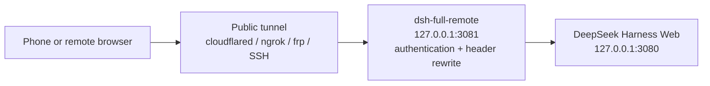

# dsh-full-remote

[](https://github.com/awesome-dsh-plugin/awesome-dsh-plugin)
[](https://www.npmjs.com/package/dsh-full-remote)
[](https://github.com/JUANWANG-BUAA/dsh-full-remote/actions)
[](./LICENSE)
[](https://github.com/JUANWANG-BUAA/dsh-full-remote/stargazers)
[](https://github.com/JUANWANG-BUAA/dsh-full-remote/commits/main)
[](./package.json)
[](https://github.com/deepseek-ai/deepseek-harness)
[](https://github.com/JUANWANG-BUAA/dsh-full-remote/pulls)

**Listed in [awesome-dsh-plugin](https://github.com/awesome-dsh-plugin/awesome-dsh-plugin)** · DeepSeek Harness plugin

**English** | [中文](./README.zh.md)

`dsh-full-remote` is a plugin for
[DeepSeek Harness](https://github.com/deepseek-ai/deepseek-harness). It
places an authenticated reverse proxy in front of the Harness Web server,
so the Web UI can be used through a public tunnel or from a device on the
local network while privileged APIs such as settings, credentials, and
directory browsing remain available.

## Problem

DeepSeek Harness binds its Web server to a loopback address and only
accepts privileged requests when the `Host` and `Origin` headers refer to
a loopback address. When the UI is reached through a generic tunnel, these
headers carry the public hostname and the trust check fails. The page
loads, but the following methods return 403:

- `settings.*`
- `credentials.*`
- `host.listDirectory`

| Approach | Result |
|---|---|
| Generic tunnel (SSH port forward, Caddy, binding `0.0.0.0`) | Page loads; `settings.*` / `credentials.*` / `host.listDirectory` return 403 |
| LAN-only plugin without authentication | Usable on the local network; not suitable for public exposure |
| Password prompt without header rewriting | Requests are authenticated, but the privileged APIs remain blocked |

## Solution

The plugin inserts a reverse proxy between the tunnel and the Harness Web
server. The proxy:

- rewrites `Host` and `Origin` to `127.0.0.1` before forwarding, so the
  privileged APIs pass Harness's trust check;
- requires an access token or a valid device session before any request is
  forwarded;
- forwards HTTP, SSE, and WebSocket traffic;
- provides a settings page (**Settings → Reverse proxy**) for starting and
  stopping the proxy, changing the listen address, rotating the token, and
  managing device sessions.

Because the rewrite disables Harness's original trust check for remote
clients, the plugin provides its own access-control layer in its place.
This layer is described under [Security model](#security-model).

The plugin does not manage tunnels. Any tunnel (cloudflared, ngrok, frp,
SSH, Tailscale) can be pointed at the local endpoint the plugin publishes.

## How it works



1. The remote browser connects to the public tunnel, which forwards to the
   plugin's listener (`127.0.0.1:3081` by default).
2. A request is accepted only with an access token, a valid one-time
   invite, or an existing device session. Requests that fail
   authentication do not reach the backend.
3. The proxy rewrites `Host`/`Origin` to loopback, removes untrusted
   headers, and forwards the request to the Harness Web server at
   `127.0.0.1:3080`.

## Features

### Privileged APIs

- `settings.describe` / `update` / `replace` / `mutate`
- `credentials.describe` / `set` / `unset`
- `host.listDirectory` / `pickDirectory` / `openPath`
- `agentPreset.*`, `llm.discoverModels`

### Access control

- 192-bit access token, stored in a state file with mode `0600`; reveal and
  rotation are performed from the local panel
- Per-device sessions: each login creates an independent device
  credential, and only a hash is persisted. Devices can be renamed or
  revoked from the panel.
- Optional first-visit approval: a new device waits on a page until it is
  approved from the local panel
- Phone invite: a QR code or a one-time link (single use, 15-minute
  expiry). The link does not contain the standing token.
- Fixed delay and per-IP lockout on failed logins
- Optional CIDR allowlist for remote IPs

### Operation

- Fence self-check: probes `settings.describe` with the same Host/Origin
  rewrite the proxy uses
- Structured JSONL audit log (login, approval, revocation, token rotation,
  start, stop)
- Runtime listen-address changes with automatic rollback when a bind fails
- Optional local TLS (`tlsCertFile` / `tlsKeyFile`)
- Health endpoint at `/_dsh_reverse_proxy/healthz`
- Stream-level request body limit; hop-by-hop and spoofable headers are
  stripped; upstream `set-cookie` is removed

### Mobile use

- Settings edits persist when the page is opened through a tunnel hostname
- Add workspace uses the in-app directory browser; no native dialog
  appears on the host display

## Requirements

- Node.js `^22.19.0 || >=24`
- A DeepSeek Harness **web** profile. The plugin depends on `webServer`
  and is not intended for headless profiles.

## Installation

```sh
dsh plugin --profile web add dsh-full-remote
dsh --profile web
```

1. Open `http://127.0.0.1:3080`.
2. Open **Settings → Reverse proxy** (last entry in the left navigation).
3. Press **Start proxy** and copy the local target.
4. Point the tunnel at the target:

```sh
# Examples only. The plugin does not execute these commands.
cloudflared tunnel --url http://127.0.0.1:3081
ngrok http 3081
```

For devices on the same network, set the listen address to a LAN IP
instead of using a tunnel.

The package was previously published as `dsh-reverse-proxy`.

## Usage

### Starting and stopping

On the settings page, press **Start proxy** to start the listener and
**Stop proxy** to stop it.

### Listen address

| Bind | Purpose |
|---|---|
| `127.0.0.1` (default) | The tunnel runs on the same machine |
| `192.168.x.x` | A device on the same network, without a tunnel |
| `0.0.0.0` / `::` | Bind every interface. This is not an address to open; the panel reports a separate reachable address. |

The listen address can be changed at runtime and persists across restarts.
If a new address fails to bind, the proxy rolls back to the previous
working address.

`backendHost` is the address the proxy connects to, not the address it
listens on. Keep it at `127.0.0.1`.

### Phone invite

In the **Phone invite** section, enter the public Origin (leave empty for
LAN use), then press **Generate invite**. The panel shows a QR code and a
one-time link; the login page submits automatically after a scan. The link
expires after 15 minutes, works once, and does not contain the standing
token.

### Upgrade

```sh
dsh plugin --profile web update dsh-full-remote
```

Restart `dsh web` afterwards. Running `add` again does not reliably update
a pinned version.

## Screenshots

| | |
|---|---|
| Control panel |  |
| Listen address |  |
| Access token |  |
| Login page (desktop) |  |
| Login page (phone) |  |
| Add workspace on phone |  |

## Configuration

Common options:

```yaml
- id: reverse-proxy
  name: dsh-full-remote
  config:
    listenHost: 127.0.0.1
    listenPort: 3081
    approvalMode: false          # true: approve each new device locally
    allowedCidrs: []             # e.g. ["192.168.1.0/24"]; empty: any IP after login
    sessionIdleSeconds: 0        # 0: off; otherwise idle timeout in seconds
    auditLog: true
    allowTokenRead: true         # false: token only returned on rotation
    tlsCertFile: ""              # optional local HTTPS
    tlsKeyFile: ""
```

The complete option list, with defaults and validation, is defined in the
package `Config` schema (`src/index.ts`).

Two points to note:

- Installing the plugin pins the in-app directory picker so that a phone
  can add workspaces. Do not re-enable the stock `directory-picker` row in
  the same profile.
- `backendHost` must remain a loopback address. A wildcard or non-loopback
  value is rejected at load time.

## Security model

The Host/Origin rewrite restores the privileged APIs and, at the same
time, disables Harness's original protection for remote clients. The
access-control layer provided by this plugin consists of:

- a 192-bit access token, stored locally with file mode `0600`;
- an `HttpOnly`, `SameSite=Strict` session cookie per device, carrying a
  per-device secret of which only a hash is stored;
- a fixed delay plus a per-IP `429` lockout on failed logins;
- loopback-only control routes (`/dsh-reverse-proxy/*`), which require a
  control header and are never forwarded through the public proxy;
- removal of spoofable forwarding and hop-by-hop headers, so the proxy's
  own cookie never reaches the backend.

The access token must be treated as a secret. Terminate TLS on the public
side of the tunnel. For LAN use without a tunnel, set
`tlsCertFile` / `tlsKeyFile` (for example with
[mkcert](https://github.com/FiloSottile/mkcert)).

## Limitations

- Control actions (start, stop, reveal token, change listen address) can
  only be performed from the local Harness window, not from the tunnel
  URL.
- Settings persistence on a remote page relies on a temporary trust pin
  until Harness provides a proper deployment trust field. "Open on host"
  from a phone acts on the machine running Harness.
- With `allowTokenRead: true` (the default), `GET /token` is served over
  loopback HTTP, so any local process that sends the control header can
  read the token. Set `allowTokenRead: false` to receive the token only
  when rotating.
- The plugin replaces Harness's remote trust check with its own
  access-control layer. A defect in this layer has serious consequences.
  If Harness provides official remote access in the future, the role of
  this plugin should be reassessed.

## Development

### Build from source

```sh
pnpm pack
dsh plugin --profile web add ./dsh-full-remote-0.2.3.tgz
```

Git installs run the `prepare` build. On pnpm ≥ 10 allow it:

```yaml
allowBuilds:
  dsh-full-remote: true
```

### Checks and CI

```sh
pnpm install
pnpm run check:ci
```

`check:ci` runs lint, typecheck, unit and client tests, and a build. CI
adds a real `dsh plugin add` smoke test against a live Harness
composition. `.github/workflows/canary.yml` runs a weekly smoke test
against the harness default-branch tip.

The loopback control API lives at `/dsh-reverse-proxy/*` and is never
forwarded through the public proxy. The settings page is the intended
interface; the raw routes are rarely needed.

## Contributing · Security · License

- [CONTRIBUTING.md](./CONTRIBUTING.md)
- [SECURITY.md](./SECURITY.md)
- [MIT](./LICENSE) © 2026 [JUANWANG-BUAA](https://github.com/JUANWANG-BUAA)
