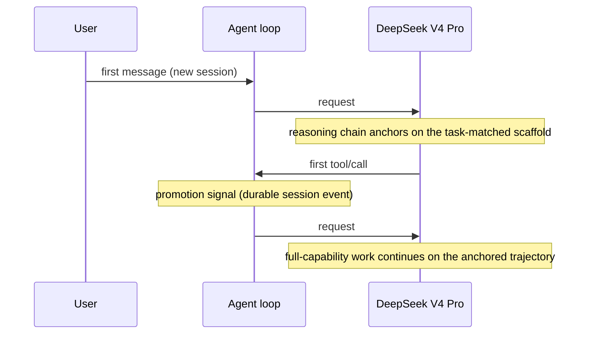

# dsh-anchored-standard

<div align="center">

**Anchor the first request. Unlock the full stack.**

A two-phase agent preset for [DeepSeek Harness](https://github.com/deepseek-ai/deepseek-harness): bootstrap DeepSeek V4 Pro with the Minimal-aligned prompt and two tools, then expose the complete Standard catalog after the first durable tool call or reply.


[](./LICENSE)
[](https://github.com/Jungod1121/dsh-anchored-standard/stargazers)
[](https://github.com/topics/dsh-plugin)

[中文说明](./README.zh-CN.md) · [Landing page](https://jungod1121.github.io/dsh-anchored-standard/) · [Design origin](https://github.com/xiaobright/dsh-anchored-standard)

</div>

---

## The one-line idea

V4 Pro's ability ceiling is high — but which reasoning strategy it uses is
decided by what the **first API request** shows it. The community evaluation
at [`xiaobright/modeltest`](https://github.com/xiaobright/modeltest) measured:

| Preset | First request sees | Full task sees | Project2 V4.1b (max) |
|---|---:|---:|---:|
| Standard | 25 tools + long prompt | 25 tools | **91 / 92** |
| Minimal | 1-line prompt + 2 tools | 2 tools only | **99 / 96** — but too narrow for real work |
| **Anchored Standard** | 1-line prompt + 2 tools | **all 25 tools** | **98 / 99** |

The gain comes from anchoring the **first-turn trajectory** — not from keeping
the tool surface small forever. This preset keeps Minimal's brain and gives it
Standard's hands.

## How it works



1. The session's **first user message** picks the anchor:

   | Task | Persona | First-request tools |
   |---|---|---|
   | **spec** — fix / maintain / debug | Minimal's exact prompt | `bash` + `read` + `edit` |
   | **react** — build / create from zero | hands-on doer prompt | `bash` + `read` + `write` |
   | **weak** — ambiguous | model self-picks (Pro: classify instruction) | `bash` + `read` |

   `glob`/`grep` stay out of every bootstrap catalog — measured trajectory
   boundary for V4 Pro; `edit`/`write` are anchor-safe.
2. On request #1 the persona is the ONLY prompt section and runtime contexts
   are cleared — the cleanest possible opening.
3. After the session records its first durable `tool/call`, every later
   request sees the full Standard catalog; the chosen persona stays constant
   and the remaining sections (plan-mode etc.) return. Nothing is injected
   after turn one (measured: post-anchor guidance hurts Pro).

Mode and promotion state live in durable session events, so refresh and
resume preserve them.

## Install

### Option A — installer bundle (recommended)

```sh
dsh plugin --profile web add github:Jungod1121/dsh-anchored-standard
```

Restart DeepSeek Harness. The bundle copies the preset into
`$DSH_HOME/.agent-presets/anchored-standard/` (idempotent — local edits are
never overwritten), then create a blank session and select
**Anchored Standard (experimental)**. To make it the default preset for new
sessions:

```yaml
# $DSH_HOME/settings.yaml
agent-presets:
  default: anchored-standard
```

### Option B — manual preset directory

```sh
dsh_home="${DSH_HOME:-$HOME/.dsh}"
mkdir -p "$dsh_home/.agent-presets"
cp -R preset "$dsh_home/.agent-presets/anchored-standard"
```

## Verify

Export the session JSONL and inspect `request/header` events — the first
header contains only `bash/read`, every later header the full catalog:

```
seq 18  -> 2 tools  ['bash', 'read']                       # request #1
seq 137 -> 25 tools ['ask_user_question', 'bash', ...]     # request #2 (promoted)
```

## What you get vs what you give up

| | You get | Trade-off |
|---|---|---|
| vs Minimal | 23 more tools: glob/grep/edit/write/web_search/subagents/workflows/skills/goals/todo… | one extra reasoning round for the bootstrap |
| vs Standard | task-matched trajectory anchors (98/99 vs 91/92 in the reference eval) + a first turn that is cleaner than Standard's | the first-request catalog is decided by keyword classification — ambiguous tasks fall back to the weak anchor and let the model pick |

## Evidence & honest boundaries

- Mechanism (task-matched bootstrap catalog → full catalog) is verified on
  harness `0.1.0-rc.6` at the wire level; the classifier and anchor tables are
  unit-tested.
- The 98/99 ability scores are `xiaobright/modeltest` Project2 V4.1b — **n=2
  on one frozen task**. They are reproducible evidence for that task, not a
  universal guarantee across models or workloads. The spec/react/weak anchor
  design incorporates measured findings from
  `yjh051108/dsh-router-standard` (P1-P24) and xiaobright's trajectory
  boundary probes.
- V4 Flash does not need this: it generalizes across harnesses (style changes,
  scores don't). This preset targets **Pro** with `reasoningEffort: max`.

## Uninstall

```sh
dsh plugin --profile web remove dsh-anchored-standard
rm -rf "${DSH_HOME:-$HOME/.dsh}/.agent-presets/anchored-standard"
```

## Compatibility

Developed and verified against DeepSeek Harness `0.1.0-rc.6`. The harness is a
developer preview with breaking changes — review upstream changes before
upgrading.

## Community & license

This is a community project: not an official DeepSeek preset, not affiliated
with or endorsed by DeepSeek. Design inspired by
[`xiaobright/dsh-anchored-standard`](https://github.com/xiaobright/dsh-anchored-standard)
(see [NOTICE](./NOTICE)). MIT — [LICENSE](./LICENSE).
