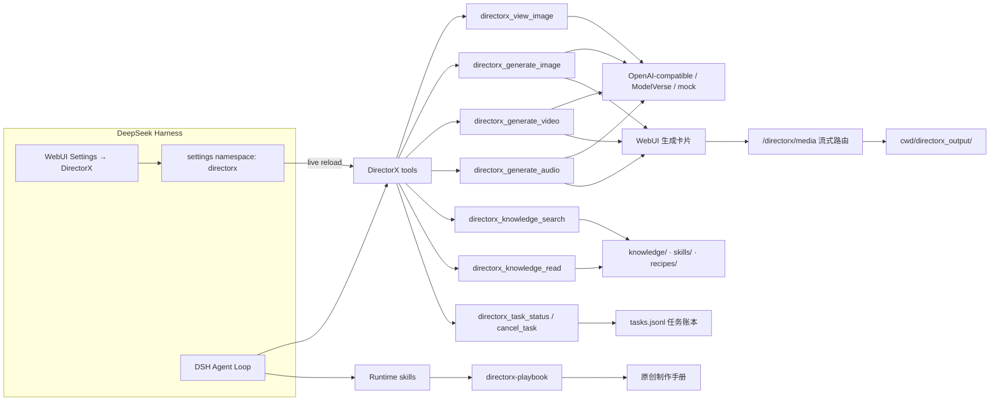

<p align="center">
  <h1>🎬 dsh-directorx</h1>
  <p>
    把 DeepSeek Harness 从「会写代码的同事」升级成「会拍片的导演」。
    <br/>
    视觉、图像、视频、音频模型，一插件全都有；片场知识库、原创制作手册与提示词弹药，开箱即用。
  </p>
</p>

<p align="center">
  <strong>dsh-plugin</strong> · <strong>deepseek-harness</strong> · <strong>ai-video</strong> · <strong>ai-image</strong> · <strong>text-to-video</strong> · <strong>directorx</strong>
</p>

---

## 🤔 这到底是个啥

一句话：**给 DSH 装上影视制作的四肢，而大脑还是 DSH 自己的。**

`dsh-directorx` 是 DeepSeek Harness（DSH）插件。它不抢 agent loop，不塞第二套
runtime；它只做四件事：

- 👁️ **让 DSH 看得见** —— 调用视觉模型，读图、识图、看图说话。
- 🎨 **让 DSH 画得出** —— 调用文生图模型，把分镜变成关键帧。
- 🎥 **让 DSH 拍得了** —— 调用视频模型，支持首尾帧、参考图和异步任务。
- 🔊 **让 DSH 说得出** —— 调用 TTS/音频模型，生成旁白、对白和音效底子。

再附赠一个片场包：**350+ 篇影视知识库、37 个可直接调用的技能、11 套制作 recipe，
以及一套插件自研的原创制作手册。**

---

## ✨ 为什么你可能会喜欢它

| 痛点 | 装上之后 |
|---|---|
| 模型只会说「我无法生成视频」 | DSH 会先查知识库，再直接调用视频工具，产出文件路径 |
| Base URL / API Key 藏在 YAML 深处 | 打开 DSH WebUI 设置页，像填外卖地址一样填完即用 |
| 分镜写得像散文 | 内置技能会把提示词收紧成可生成、可复用的导演指令 |
| 生图、生视频、配音要装三四个插件 | 一个插件，四类模型，按需开关 |
| 想做专业项目却没有流程约束 | 原创制作手册提供闸门、检查点和降级顺序 |

---

## 🧠 架构一图流



插件只负责「眼睛、画笔、摄影机、麦克风和片场百科」，调度、审批、会话、subagent 全由 DSH 自己管。

---

## 🚀 安装：三十秒上桌

在插件源码目录中执行：

```bash
dsh plugin --profile web add .
dsh web
```

没有构建仪式：`lib/` 已经提交进仓库，安装后直接加载。

---

## 🎛️ WebUI 设置：把模型当成家电来配

打开 DSH WebUI，左下角 **Settings → DirectorX**。四个能力各自独立：

| 能力 | 工具 | 配置方式 | 模型示例 |
|---|---|---|---|
| 👁️ 视觉 | `directorx_view_image` | `openai-chat` / `mock` | `gpt-4o-mini`、任意兼容 VLM |
| 🎨 图像 | `directorx_generate_image` | `openai-images` / `modelverse-tasks` / `mock` | `gpt-image-1`、`doubao-seedream-*` |
| 🎥 视频 | `directorx_generate_video` | `openai-videos` / `modelverse-tasks` / `kling` / `runway` / `mock` | `sora-2`、`MiniMax-H3`、`kling-v2`、`gen4.5`/`gen4_turbo`/`hailuo3` |
| 🔊 音频 | `directorx_generate_audio` | `openai-tts` / `mock` | `gpt-4o-mini-tts`、任意兼容 TTS |

每张卡片都能填：

- **Base URL** —— 官方网关、聚合网关、本地 `http://localhost:11434/v1`，都可以；
- **API Key** —— 以 secret 存进 DSH settings，不显示、不打印、不进入聊天记录；
- **配置方式 / Mode** —— 决定走哪套协议，不用背文档；
- **Resolution** —— 视频能力可填 `2K / 720p / 1080p` 等输出档位；
- **能力开关** —— 关掉某个能力，对应工具直接不注册。

保存即热更新，不用重启。没有 Key 也不要紧：切到 `mock` 模式，先跑通整个链路再上真模型。

---

## 🖼️ WebUI 生成卡片：看得见，才叫拍片

生成工具在对话流里有专属卡片，跑完就能直接在聊天里看结果：

- 🎨 **图像** —— 卡片内直接预览，点击可在新标签页打开原图；
- 🎥 **视频** —— 内嵌播放器，支持进度拖拽（HTTP Range）；
- 🔊 **音频** —— 内嵌播放器直接试听；
- 👁️ **看图** —— 卡片显示问题、回答文本与可预览的源图；
- 运行中显示提示词与「进行中…」，完成后显示模型 / 协议 / 文件数，失败显示错误摘要。

本地文件由插件注册的 **`/directorx/media`** 路由以流式方式供给浏览器（仅限
`directorx_output` 目录内、同源访问、带 Range 支持），不经过模型上下文；
`https` URL 结果（如 `openai-images` 返回的图片链接）直接引用原地址。

异步任务会写入 **`tasks.jsonl` 任务账本**：超时或会话中断后，DSH 可用
`directorx_task_status` 找回任务与结果文件，用 `directorx_cancel_task` 中止。

---

## ✂️ 右侧编辑面板与无限画布：生成之后，随手再修、随手编排

对话流右侧是 **DirectorX 工作台**（悬浮把手随时可开，生成卡片上也有
「编辑」按钮）：

- 🖼️ **图片** → PS 式编辑器（tui.image-editor，MIT）：裁剪、旋转、翻转、
  滤镜、画笔、文字、形状、缩放、撤销重做，一键导出 PNG；
- 🎞️ **视频** → 时间线编辑器（WebAV，MIT，活跃维护）：播放头分割、片段
  删除与重排、时长刻度、**音频轨（wavesurfer.js 波形 + 音量 + 混音导出）**，
  浏览器内 WebCodecs 导出 MP4；
- 🎨 **画布** → 无限画布（react-flow，libtv/tapnow 设计语言）：节点分组、
  连线、框选、右键菜单、双击重命名/加节点、拖拽素材上画布、吸附对齐线、
  撤销重做、导出 PNG 分镜板、画布标题；DSH 用 `directorx_canvas_*` 9 个工具
  **完全掌控画布**——工作流编排的每个阶段都会镜像到画布，你在 WebUI 看到
  与 agent 一致的生产视图；
- 保存后写入 `directorx_output/edited/`，面板显示历史，DSH 可用
  `directorx_edits` 工具引用这些二次编辑产物。

---

## 🧰 工具速查

| 工具 | 一句话说明 | 典型用法 |
|---|---|---|
| `directorx_view_image` | 给 DSH 装上眼睛 | 读截图、读剧照、检查生成图有没有崩脸 |
| `directorx_generate_image` | 生成关键帧/参考图 | 角色定妆照、场景概念图、首尾帧 |
| `directorx_generate_video` | 生成视频片段 | 图生视频、首尾帧转场、动作镜头 |
| `directorx_generate_audio` | 生成旁白/音频 | 广告口播、短剧对白、音效底子 |
| `directorx_knowledge_search` | 搜片场百科 | 查运镜术语、模型参数、平台规格 |
| `directorx_video_process` | 确定性剪辑：裁剪/变速/规格/音量 | 统一素材规格、抠节奏片段 |
| `directorx_video_concat` | 多片段拼接（硬切/交叉淡化） | 多镜头成片、蒙太奇 |
| `directorx_audio_mix` | 多轨混音 + 旁白闪避 | BGM + 旁白 + 音效合成 |
| `directorx_video_subtitle` | 软字幕轨 / 硬烧字幕 | 成片加字幕（转写 srt 直用） |
| `directorx_video_zoom` / `_pip` | Ken Burns 运镜 / 画中画 | 推拉镜头、贴纸角标 |
| `directorx_audio_beat` | 节拍检测（ebur128） | 卡点混剪的切点依据 |
| `directorx_style` | 风格/镜头语言注入（知识库实文） | 锁定黑色电影/赛博朋克等质感 |
| `directorx_preflight` | 生成前四道闸门审计 | 批量生成前把关 |
| `directorx_propose` / `_proposals` / `_proposal_update` | 占位提案状态机 | 先方案后生成，批准才花钱 |
| `directorx_canvas_*`（14 个） | 画布完全掌控 | 分镜板上画布、连线、分组、布局 |

| `directorx_knowledge_read` | 读完整词条 | 把搜索结果展开成可执行方法论 |
| `directorx_task_status` | 查生成任务状态 | 超时/中断后找回 provider 任务、拿回结果文件 |
| `directorx_cancel_task` | 取消进行中任务 | 停止卡住或不再需要的异步生成 |
| `directorx_edits` | 列出 WebUI 编辑产物 | 引用用户在右侧面板里二次编辑保存的文件 |
| `directorx_transcribe_audio` | 音频/视频转写 | 生成旁白字幕 SRT、素材整理，打通字幕链路 |
| `directorx_probe_media` | 媒体元数据探测 | 校验生成物规格（时长/编码/分辨率/音轨） |
| `directorx_extract_frames` | 视频抽帧 | 抽帧 PNG 配合 view_image 做 frame-qa 质检 |

支持的协议：

- `openai-chat` → `POST {baseURL}/chat/completions`
- `openai-images` → `POST {baseURL}/images/generations`
- `openai-videos` → `POST {baseURL}/videos` → 轮询 `GET /videos/{id}`
- `modelverse-tasks` → `POST {baseURL}/tasks/submit` → 轮询 `GET /tasks/status`
- `openai-tts` → `POST {baseURL}/audio/speech`
- `mock` → 本地 SVG 图 / WAV 音 / ffmpeg 测试视频，零密钥联调

---

## 📚 片场知识包

- **350+ 篇影视/AI 生成知识库**：镜头语言、灯光色彩、视频提示词工程、模型矩阵、首尾帧控制、短剧工业化、平台交付规格……模型不知道的，它先查了再动手。
- **37 个 runtime skills**：分镜、脚本、角色设定、视频提示词构建器、Seedance/Kling/GPT Image 提示词助手，以及 `directorx-playbook` 原创制作手册。
- **8 大中文影像工坊**：导演风格致敬、动画与二次元、短剧与叙事、音乐 MV、广告与电商、纪录片、POV 与运动、特效与视觉实验。
- **11 套 recipe**：广告片、短剧、教程片、纪录片、小说改编……DSH 读完流程就能开工。

`directorx-playbook` 把插件自研的制作经验整合成四份清单：

- 视频提示词通用原则；
- 一致性与控制清单；
- 制作闸门与检查点；
- 模型能力路由。

这些内容随插件加载为 DSH skill，模型可以在生成任务前直接调用。

---

## 🧪 开发与测试

```bash
npm install
npm run typecheck
npm run build
npm test
```

测试覆盖知识库检索、四个模型适配器的 mock 链路、媒体路由（路径逃逸拦截、
Range、同源校验）、任务账本（追加/取消/轮询中止）、modelverse-tasks 往返，
以及本地 HTTP 假服务的 OpenAI-compatible 端到端 round-trip。
当前：**18/18 全绿**。

想连 DSH 一起冒烟？

```bash
scripts/dsh-smoke.sh
```

它会创建临时 profile，让 DSH 真的调用 `directorx_knowledge_search/read`，
跑完自动清理。完整验证记录见 [`docs/verification.md`](docs/verification.md)。

---

## 🙋 FAQ

**Q：没有 API Key 能用吗？**
能。四个能力都切 `mock`，先让 DSH 把工具链跑起来；拿到 Key 后回设置页填上即可。

**Q：支持哪些供应商？**
凡是 OpenAI-compatible 的视觉、图像、视频、TTS 端点都行；视频还支持 ModelVerse tasks 协议。

**Q：API Key 会泄漏给模型吗？**
不会。Key 以 secret role 存储，工具只把它放进 HTTP Authorization 头，不会写进返回内容。

**Q：为什么我的模型不听话？**
先让 DSH 调用 `directorx_knowledge_search` 查一下该模型的提示词规格，再检查 Settings → DirectorX 里的 mode 是否选对。模型不是不听，是嫌提示词不够导演。

**Q：可以只启用一部分能力吗？**
当然。设置页里每个能力都有独立开关，关掉即卸载对应工具。

---

## 📄 License

Apache-2.0（见 [`LICENSE`](LICENSE)）。

---

## 🌟 最后

如果这个插件让你的 DSH 第一次说出「导演，这条过了」，请点个 **Star**；
如果它生成了六个手指的超级英雄，也别慌——那是模型在提醒你：先读知识库，再锁提示词。

**Keep prompting. Keep shooting.**
