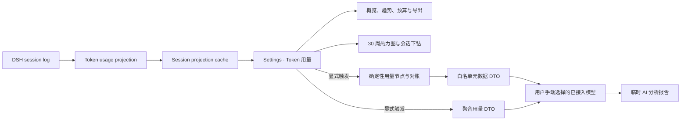

# dsh-token-usage

<p align="center">
  <a href="https://awesome.re"></a>
  <a href="https://awesome-dsh-plugin.com"></a>
  <a href="LICENSE"></a>
  <a href="https://github.com/LeemanCheung/dsh-token-usage"></a>
</p>

<p align="center">
  面向 <a href="https://github.com/deepseek-ai/deepseek-harness">DeepSeek Harness</a> 的 Token 可观测性插件：持久统计模型用量，并让用户手动选择已接入模型按需生成用量和会话轨迹分析。
</p>

<p align="center">
  
</p>

> 真实 DSH 设置页截图。截图仅展示聚合 Token 统计与模型路由，不包含会话标题、提示词或回复正文。

## 🗺️ 功能概览

<p align="center">
  
</p>

## ✨ 亮点

| 能力 | 说明 |
| --- | --- |
| **完整 Token bucket** | 分别记录未缓存输入、输出、缓存读取与缓存写入；`reasoningTokens` 已包含在输出中，不重复计算。 |
| **多维统计** | 以 provider / model、会话与 UTC 日期聚合普通对话、每次重试和上下文压缩用量。 |
| **30 周热力图与下钻** | GitHub commit graph 风格的 Token 活跃度图；颜色越深代表当天总用量越高，悬停查看四类 bucket，点击下钻到当天贡献会话。 |
| **可靠逐日数据保护** | 热力图和常规趋势保留全部历史总量；运行率、预算预测、异常和 AI 日趋势仅在所有会话均具有真实逐日 bucket 时启用，避免旧版合成日期造成低估。 |
| **预算、预测、异常与导出** | 比较 7/30/90 日趋势，设置本地持久化的滚动 30 日预算，按最近 7 个完整 UTC 日预测 30 日运行率，并以稳健基线识别近期突增；导出聚合 JSON v2、每日 CSV 或模型 CSV。 |
| **Agent 效率与归因** | 量化每次模型尝试 Token、每百次尝试压缩次数、精确上下文压缩 Token 占比、缓存结构、Top 路由集中度与未归因比例。 |
| **AI 用量优化** | 手动选择任一已接入的 provider/model，对总量、压缩税、输入/输出/缓存、路由贡献、趋势和波动生成证据化分析与 P0/P1/P2 Token 优化建议。 |
| **轨迹 Token 分析** | 手动选择会话后，使用同一模型以白名单元数据分析调用链、重试、异常恢复、速率、压缩和 Token 效率；不发送会话正文或工具载荷。 |
| **用量节点与对账** | 按模型调用尝试和上下文压缩生成稳定用量节点，标注 actual/provisional/authoritative，识别最大节点、重试 Token，并对账 provider 事件总量。 |
| **紧凑布局** | 使用 `K` / `M` / `B` 展示大数字，悬停显示完整数值；热力图自适应设置页宽度，默认无需横向拖动。 |
| **历史预热** | 启动后顺序回放可读取的历史会话并写入 projection cache，不阻塞插件启动。 |
| **隐私优先** | 持久层只保存统计数据；轨迹分析从结构上省略提示词、回复、工具名称/参数/结果、会话标题以及个人或组织字段，报告仅在当前页面内存中展示。 |

## 🚀 安装

```powershell
dsh plugin --profile web add github:LeemanCheung/dsh-token-usage
```

安装后重启当前 `dsh web` 进程并刷新 [http://127.0.0.1:3080](http://127.0.0.1:3080)，再打开 **设置 → Token 用量**。

<details>
<summary>本地源码开发安装</summary>

在本目录的上一级运行：

```powershell
dsh plugin --profile web add ./dsh-token-usage
```

</details>

## 📊 仪表盘内容

- **概览卡片**：总 Token、输入 Token、输出 Token、缓存读取占输入、有用量会话数，以及已覆盖路由的公开 USD 估算、缓存读取避免费用和 Token 费率覆盖率。
- **Token 活跃度与下钻**：最近 30 周按 UTC 日汇总的热力图；悬停方格查看四类 bucket，点击查看当天总量和贡献会话。旧版内置 projection 缺少逐日数据时，仍会以会话最后活动日保留历史总量，但该日期会从运行率/异常口径排除。
- **周期趋势**：切换 7/30/90 日窗口，查看当前周期总量、环比、活跃天数与峰值日。
- **用量信号**：仅在全部纳入统计的会话都有真实逐日 bucket 时，按最近 7 个完整 UTC 日计算日均和预计 30 日运行率；昨天的完整日会与此前 28 日至少 5 个活跃日的中位数/MAD 稳健基线比较，异常日可直接下钻会话。覆盖不完整时会明确显示不可用，而不是低估。
- **30 日预算**：预算写入本机 DSH settings；逐日覆盖完整时显示滚动消耗比例、当前运行率的 30 日预测和可能的预测超额，填 0 或清空可关闭。
- **Agent 效率与归因**：显示模型尝试数、每次尝试 Token、每 100 次尝试压缩数、精确压缩 Token 占比、缓存读取占输入、Top 1/Top 3 路由集中度及未归因比例。
- **价格统计**：显示已覆盖路由的估算 USD 成本、缓存读取避免费用、按 Token 计算的费率覆盖率，以及每条模型路由的估算成本；未覆盖路由明确显示 `—`。
- **AI Token 用量分析**：从已接入模型中手动选择一个模型，按需生成总量、精确压缩开销、输入/输出/缓存、路由集中度、可靠日趋势、峰值、波动和 Token 优化建议报告。模型目录可手动刷新；某个提供方暂时无法列出模型时，其他可用模型不受影响。
- **模型用量**：按 provider / model 汇总普通模型尝试、上下文压缩次数、总量、输入与输出；可按总 Token、已覆盖的估算费用、每次记录调用 Token 或缓存读取占输入排序。
- **聚合导出**：导出不含会话标题和正文的 JSON v2（含压缩 bucket、公开费率覆盖和路由估算）、每日 CSV 或模型 CSV；模型 CSV 含已覆盖路由的费用/缓存避免费用，CSV 单元格防公式注入。
- **会话记录**：搜索会话标题、会话 ID 或模型路由；初始最多显示 50 条，可渐进展开，并可直接打开会话或启动轨迹智能分析。

### 统计口径

| 指标 | 计算方式 |
| --- | --- |
| 输入 Token | `uncachedInputTokens + cacheReadTokens + cacheWriteTokens` |
| 总 Token | 输入 Token + `outputTokens` |
| 缓存读取占输入 | `cacheReadTokens / 输入 Token`；这是 Token 结构比例，不是请求级缓存命中率 |
| 输出 Token | 使用 provider 上报的 `outputTokens`；不另加 `reasoningTokens` |
| 压缩 Token | 所有 `compaction/summary` provider usage 的四个 bucket 之和；与普通模型尝试分别计数 |
| 每次模型尝试 Token | `(总 Token - 压缩 Token) / assistantRequests`；重试是独立尝试。若存在未归因旧用量，因缺少对应尝试次数而不显示该比率。 |

同一请求步骤若先后出现流式 usage 与最终消息 usage，最终值会替换该步骤的临时值，避免重复记账；发生 `llm/retry` 后，每个重试尝试仍会被独立统计。每条 `compaction/summary` 都计为一次压缩；provider 未附 usage 时只增加次数，不虚构 Token。带 `surfaceOp: replace` 的消息只改写可见会话表面，不代表新的模型或工具执行，因此不会重复计数。

## 📈 运行率、异常与 Agent 效率

- **运行率**：仅在逐日覆盖完整时，使用真实逐日 bucket，并取最近 7 个完整 UTC 日（不包含尚未结束的今天）计算日均，再乘以 30 得到滚动 30 日预测；它是 Token 运行率，不是账单预测。
- **预算预测**：仅在已开启 Token 预算时比较预测值和预算。当前已超额与“按当前运行率将超额”会分别提示，不会自动阻止模型调用。
- **异常检测**：将昨天这个完整 UTC 日与此前 28 日内的活跃完整日比较。至少需要 5 个活跃基线日；使用活跃日中位数和 MAD，MAD 为 0 时采用 3×中位数阈值。异常提示会显示绝对超量和倍数，并可下钻现有的按日会话贡献。
- **效率/集中度**：Top 1/Top 3 是全部 Token 的路由份额；未归因用量会单独披露。每次模型尝试 Token 从可归因总量扣除精确压缩 Token 后计算，重试属于独立尝试。
- **会话工作流**：会话名称可直接打开当前仍在列表内的会话；若会话在点击前消失，保持设置页面并显示失败原因。初始列表只渲染 50 行，聚合统计仍覆盖全部会话。

## 💵 公开价格统计

成本是**静态公开费率估算，不是 provider 账单**。内置表以 USD / 1M Token 计价，当前按精确 `provider: 'openai'` 与 model 标签匹配：`gpt-5`、`gpt-5-mini`、`gpt-5-nano`、`gpt-4.1`、`gpt-4.1-mini`、`gpt-4.1-nano`、`gpt-4o` 和 `gpt-4o-mini`（及列出的 API 版本别名）。费率依据 [OpenAI 官方 API Pricing](https://developers.openai.com/api/docs/pricing)，表内最近基准日为 **2025-08-07**，不会联网实时刷新；标签匹配不能验证实际端点、转售关系、合同或账单。

```text
估算 USD = 未缓存输入 × inputRate
         + 输出 × outputRate
         + 缓存读取 × cacheReadRate
         + 缓存写入 × cacheWriteRate
         ÷ 1,000,000
```

- 仅当 provider 和 model 标签均精确匹配内置表时才计价，不借用相似模型价格；匹配结果仍可能对应代理或自定义端点，因此必须结合实际账单核验。
- 费率覆盖率按已匹配路由的四类 Token / 全部四类 Token 计算；未覆盖 Token 不进入估算总额，页面会同时显示覆盖 Token 和有用量路由数，部分覆盖不会四舍五入为 100%。它不是实际消费金额覆盖率，不能据此外推未知价格。
- 缓存读取避免费用仅对已匹配路由计算：`cacheReadTokens × max(inputRate - cacheReadRate, 0) / 1M`；它比较同一静态公开表中的未缓存输入价，不是账单返还。
- OpenAI 路由没有单独公开的 cache-write 费率时，cache-write 按普通输入费率估算；每条路由的悬停说明会显示所用四项费率与基准日。
- 历史聚合会按当前内置静态表重估，不按事件发生日的历史价格还原；因此暂不提供 USD 预算。
- 价格计算、页面展示和 JSON v2/模型 CSV 只在本地浏览器中使用已持久化的聚合 bucket；价格匹配、覆盖率、估算 USD 和缓存读取避免费用都不会作为外部分析模型的证据，也不会新增会话正文、提示词或响应数据的收集。

## 🤖 AI Token 用量分析

在仪表盘的 **AI Token 用量分析** 卡片中，从当前已接入且可列出模型的 provider/model 路由里手动选择一个模型，再点击 **生成用量分析**；可使用 **刷新模型目录** 重新读取实时路由。选择会同时用于下面的会话轨迹分析，但每次分析仍需单独手动触发。目录仅负责选择和展示，真正生成时仍由 Host LLM adapter 校验路由。

报告固定覆盖：

| 分析面 | 依据与输出 |
| --- | --- |
| 总量与结构 | 未缓存输入、输出、缓存读取和缓存写入的占比与变化，以及精确上下文压缩 Token 总量。 |
| 路由贡献 | 按报告内 `route-N` 别名的 Token、对话次数和压缩次数识别集中度与高消耗路由；不向模型暴露原始路由名。 |
| 时间趋势 | 仅在逐日覆盖完整时，用真实逐日 bucket 分析 UTC 日粒度的活跃度、峰值与波动；长历史最多取最新 366 天进入模型证据。 |
| 风险与不确定性 | 明确数据覆盖边界，不虚构价格、延迟、质量或因果。 |
| 优化建议 | 3–7 条带 P0/P1/P2、证据、预期 Token 效率收益、置信度和实施工作量的建议。 |

### 聚合数据、隐私与费用

- 用量分析只发送总 Token bucket、精确压缩 Token bucket、报告内 `route-N` 别名、对话/压缩次数和可靠的 UTC 每日 bucket；本地价格匹配、覆盖率、估算 USD、缓存读取避免费用和路由成本均不发送。原始 provider/model、会话 ID、标题、提示词、回复、工具参数或其他会话正文同样不会发送。
- 模型证据最多保留 Token 最大的 48 条路由记录与最新 366 条日期记录；总量仍来自完整仪表盘聚合。
- 报告和辅助调用用量仅驻留当前页面内存，刷新后消失，不进入会话日志、projection cache 或任何导出文件。
- 用户选择的 provider/model 会实际产生一次辅助模型调用；报告卡会显示该调用的 provider/model 与 Token 用量。用量分析最多生成 2,600 Token。
- 目录只显示已接入且当前可列出模型的路由。单个提供方的目录失败不会隐藏其他可用路由，页面会披露受影响的提供方但不暴露适配器错误细节；调用失败时不会悄悄改用默认模型。
- 目录用于用户选择和展示；实际调用以 Host LLM adapter 的 `prepareCall` 为准，因此目录刷新与调用之间消失的路由会得到适配器的明确失败，而不是先被过期目录拒绝。

## 🧠 会话 Token 轨迹分析

在 **会话记录** 中点击 **分析轨迹**。Host 会读取 live 会话的完整事件日志，或通过 `sessionPersistence.inspect()` 读取冷会话；浏览器分页不会影响结果。分析器先做确定性、内容无关的 fold，再使用 AI Token 用量分析卡片中手动选择的已接入 provider/model 生成临时报告。

### 确定性证据

| 证据 | 口径 |
| --- | --- |
| 模型调用节点 | ID 为 `model:<turn>:<step>:<attempt>`；usage chunk 是 provider 上报的 `actual/provisional`，最终消息在同一 attempt 内替换为 `actual/authoritative`。 |
| 重试 Token | 收到 `llm/retry` 时封存当前 attempt；其 provider usage 单独汇总，后续 attempt 不覆盖前次消耗。 |
| 压缩节点 | 每个带 usage 的 `compaction/summary` 独立归因，ID 为 `compaction:<seq>`。 |
| 最大用量节点 | 在模型 attempt 与压缩节点中按四个 Token bucket 之和确定。 |
| Token 对账 | canonical 持久 projection 与独立节点归因账本按四个 bucket 分别比较；差异原样显示，不自动归零。 |
| 速率和运行指标 | 基于事件相对时间计算全程与活跃回合 Token/分钟，并统计未结束回合/步骤、工具调用/结果/错误、孤立工具、工具延迟、模型切换、重试、压缩与审批结果。 |

当前 provider 只提供未缓存输入、缓存读取、缓存写入和输出四类实际值。系统指令、用户输入、历史、检索、工具结果和子代理结果的细分归因标为不可用；插件不会读取正文进行估算，也不会把估算值伪装成实际值。

### 输入、隐私与费用

- 分析由用户显式触发；会话列表在“分析轨迹”按钮之前显示模型证据范围。报告不写入会话日志、projection cache 或导出文件，刷新页面后不会保留。
- 发送给模型的事件只允许：内置事件类别与序号、相对时间、turn/step、报告内 `route-N` 别名、重试序号/上限/等待、通用成功或错误状态、表面改写标记以及 Token bucket；未知扩展事件会省略。
- 提示词、回复、system prompt、会话标题、原始 provider/model、工具名称/参数/结果/meta、故障代码与错误消息、路径、URL、邮箱、姓名、会话 ID、个人字段和组织字段不会进入模型证据；这是 allowlist 省略，不依赖正则脱敏。
- 完整模型证据最多 96,000 字符；完整节点表留在本地，模型只接收最大节点、最多 16 个高消耗重试节点和有界首尾时间线，超限时插入截断标记。模型最多生成 3,000 Token。
- 辅助调用的 provider/model 和 Token 用量显示在报告卡片中，但不会计入持久化用量 projection。
- 私有 RPC 只允许本机 loopback Web 页面调用；必须先从已接入模型目录中手动选择 provider/model，不会隐藏地回退到默认模型。目录枚举与生成调用都绑定当前 LLM service 生命周期，服务移除或替换时会立即停止等待。Client 会在渲染前验证 provider 总量、节点归因、signed delta、状态和最大节点引用的一致性。

## 🧭 数据流



- Host 侧监听普通模型请求、重试和上下文压缩事件，构建会话级持久 projection。
- 历史会话在后台按顺序预热；冷会话在恢复期间重新附着时，会重新写入最新 live checkpoint，避免回退缓存水位。
- Web 侧将所有会话 projection 聚合为仪表盘数据。较旧的内置 projection 会显示为“未归因用量”，以保持总量守恒。
- 两类 AI 分析都走 loopback 私有 RPC，并只接受用户从已接入模型目录中选择的路由：用量分析只传聚合 DTO；轨迹分析由 Host 读取权威事件日志、构造内容无关的实际用量节点和有界白名单 DTO。Web 只接收 JSON 指标和 Markdown 报告。

## 🔎 设计参考与取舍

本插件吸收了主流 Agent 可观测性产品对 Token、成本、缓存和聚合趋势的做法，例如 [LangSmith cost tracking](https://docs.langchain.com/langsmith/cost-tracking)、[OpenAI Agents SDK usage](https://openai.github.io/openai-agents-python/usage/)、[Langfuse token/cost tracking](https://python-sdk-v2.docs-snapshot.langfuse.com/docs/observability/features/token-and-cost-tracking/) 和 [Phoenix LLM metrics](https://arize.com/docs/phoenix/tracing/llm-traces/metrics)。预算和异常部分参考 [FinOps Budgeting](https://www.finops.org/framework/capabilities/budgeting/)、[Anomaly Management](https://www.finops.org/framework/capabilities/anomaly-management/) 与 [MAD 的稳健统计定义](https://itl.nist.gov/div898//software/dataplot/refman2/auxillar/mad.htm)。

取舍是有意的：本地插件只持久化聚合 bucket、日期、匿名化 AI 分析证据和用户显式启动的会话轨迹元数据；不保存请求正文、逐请求日志、日期×模型交叉明细或人员/组织归因。现有投影没有日期×模型维度，因此异常日只支持会话贡献下钻，不声称模型级日归因。

## 🔄 更新与热加载

| 改动类型 | 如何生效 |
| --- | --- |
| Host 逻辑（projection、事件、统计） | 重启 `dsh web`，使 Node Host 重新加载插件。 |
| Client/UI（React、CSS） | 仅当同一 DSH checkout 正运行 `pnpm run dev:web` 监听器时，重建 bundle 后可通过 HMR 更新；否则重启并刷新。 |
| GitHub 源码更新 | 新安装会取得仓库当前默认分支的预构建 bundle；已运行的实例仍按上两行规则更新。 |

## 🛠️ 开发

本项目当前以 GitHub 源码插件形式分发，不发布到 npm。源码与 DSH checkout 并排放置，`tsdown.config.ts` 复用 DSH 的官方 Client bundle preset。

```powershell
npm test
npm run typecheck
npm run build
```

构建产物为 `lib/index.js` 与 `lib/client.js`，已提交到仓库，确保可直接通过 GitHub 安装。

## ⚠️ 已知限制

- 历史预热依赖 DSH session projection cache。预热完成前，仅有内置 projection 的旧会话会被显示为“未归因用量”；刷新后可读取新的模型明细。
- 单个损坏或不可读取的历史会话只会记录警告，不会阻止插件启动。
- 热力图按持久事件的 UTC 日期统计；旧版内置 projection 缺少逐日数据时，会暂按会话最后活动日归档。
- 运行率和异常检测会排除上述旧版合成日期，只使用真实逐日 bucket；覆盖缺失或仅部分可靠时都会显示不可用，而不是以不完整数据给出偏低结果。异常检测需要昨天有记录且此前 28 日至少 5 个活跃日，不足基线时不报告“正常”。预测和异常不会做模型级逐日归因。
- 轨迹报告是模型辅助的资源效率解释，不是策略执行器或合规证明；确定性节点、provider bucket 和对账结果优先于模型推断。
- provider 当前不提供系统、用户、历史、检索、工具和子代理输入的独立 Token bucket，因此这些细分不会估算；超长元数据轨迹的中段会明确标为不可用。
- 插件不建设人员、团队、部门、组织、成本中心或行为画像维度；AI 用量报告和轨迹报告当前不持久化、不支持历史对比。
- 分析调用的 Token 只显示在当次报告中，不计入持久化仪表盘。
- AI 用量分析只可选择当前能由已接入 provider 列出的模型；每日趋势证据最多传递最新 366 天。内置 USD 费率表不是实时账单或汇率服务，仅按文档列出的 OpenAI 路由标签本地匹配；模型建议不接收价格证据，也不替代账单、延迟或质量观测。

## 📄 License

[MIT](LICENSE) © LeemanCheung
