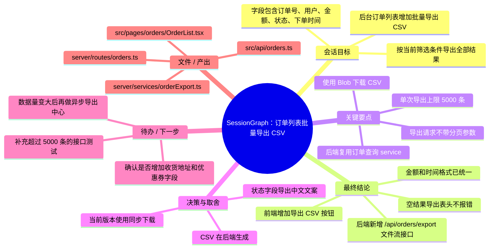
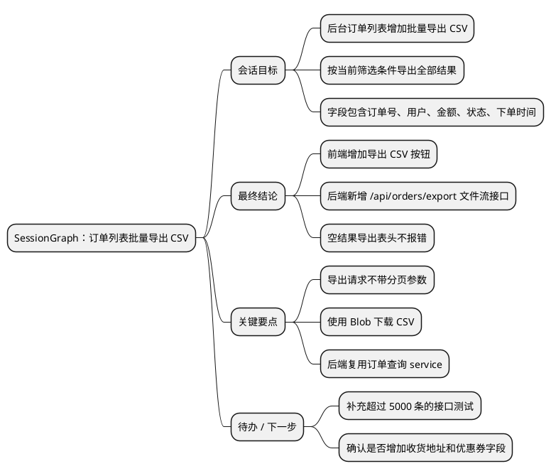

# DSH SessionGraph

SessionGraph 是一个给 DSH 用的小插件，用来把当前会话整理成导图。长会话里经常有很多调试、报错、反复修改的过程，最后真正有用的其实是结论、做了什么、还剩什么。所以这个插件会尽量过滤过程噪声，把会话压成一个可编辑、可复制的结构化大纲与导图。


## 能做什么

- 在会话输入框上方右侧增加一个 `SessionGraph ▾` 按钮。
- 读取当前会话内容，提取目标、结论、关键点、决策、待办和文件产出。
- 过滤一些明显没必要进导图的内容，比如 stack trace、终端日志、debug 输出、重复试错过程等。
- 支持在弹窗里手动改节点、加子节点、删掉不想要的节点。
- 支持一键复制导出结果。

## 三种模式

| 模式 | 内容 | 适合场景 |
| --- | --- | --- |
| 默认导图 | 会话目标、最终结论、关键要点、决策与取舍、待办、文件/产出 | 平时整理一段会话 |
| 精简导图 | 只保留最终结论和待办 | 快速复盘、交接、写 commit 前看一眼 |
| 详细导图 | 默认导图 + 压缩后的时间线 | 会话比较长，想回头看过程时使用 |

## 导出格式

目前支持这些格式：

- Markdown 大纲
- Mermaid `mindmap`
- PlantUML mindmap
- XMind 缩进文本
- 待办清单简介

### Markdown 大纲

下面用一个常见的开发场景举例：一次会话里完成了“订单列表批量导出 CSV”功能，中间可能经历了接口参数调整、字段映射修正、空状态处理和测试失败重跑。SessionGraph 会尽量把这些过程整理成最终可读的大纲。

```markdown
# SessionGraph：订单列表批量导出 CSV

- 会话目标
  - 在后台订单列表增加批量导出 CSV 功能
  - 支持按当前筛选条件导出，而不是只导出当前页
  - 导出字段需要包含订单号、用户、金额、状态、下单时间
- 最终结论
  - 前端已增加“导出 CSV”按钮，并复用订单列表当前筛选条件
  - 后端新增 `GET /api/orders/export` 接口，返回 `text/csv` 文件流
  - CSV 字段顺序已固定，金额统一按元展示，时间统一格式化为本地时间
  - 空结果会导出只有表头的 CSV，不再直接报错
- 关键要点
  - 导出请求不走分页参数，只传筛选条件和排序字段
  - 前端使用 Blob 下载，文件名格式为 `orders-yyyyMMdd-HHmm.csv`
  - 后端复用订单查询 service，避免复制一套筛选逻辑
  - 大批量导出先限制为 5000 条，超过时返回明确提示
- 决策与取舍
  - 暂时不做异步导出任务，当前版本先使用同步 CSV 下载
  - 不在前端拼 CSV，避免字段权限和金额格式与后端不一致
  - 状态字段导出中文文案，方便运营直接查看
- 待办 / 下一步
  - 补一条超过 5000 条时的接口测试
  - 和产品确认是否需要导出收货地址、优惠券字段
  - 后续如果数据量继续变大，再改成异步导出中心
- 文件 / 产出
  - `src/pages/orders/OrderList.tsx`
  - `src/api/orders.ts`
  - `server/routes/orders.ts`
  - `server/services/orderExport.ts`
```

### Mermaid



### PlantUML



### XMind 文本

XMind 文本是 tab 缩进的大纲，复制后可以粘到支持缩进导入的工具里：

```text
SessionGraph：订单列表批量导出 CSV
	会话目标
		后台订单列表增加批量导出 CSV
		按当前筛选条件导出全部结果
		字段包含订单号、用户、金额、状态、下单时间
	最终结论
		前端增加导出 CSV 按钮
		后端新增 /api/orders/export 文件流接口
		空结果导出表头不报错
	关键要点
		导出请求不带分页参数
		使用 Blob 下载 CSV
		后端复用订单查询 service
	决策与取舍
		当前版本使用同步下载
		CSV 在后端生成
	待办 / 下一步
		补充超过 5000 条的接口测试
		确认是否增加收货地址和优惠券字段
```

### 待办清单简介

```markdown
# 待办清单简介

## 结论摘要
- 前端已增加“导出 CSV”按钮，并复用订单列表当前筛选条件。
- 后端已新增 `GET /api/orders/export` 接口，返回 CSV 文件流。
- 空结果会导出只有表头的 CSV，不再直接报错。

## 待办
- [ ] 补一条超过 5000 条时的接口测试。
- [ ] 和产品确认是否需要导出收货地址、优惠券字段。
- [ ] 后续如果数据量继续变大，再改成异步导出中心。
```
## 提取规则

`lib/extractor.js` 里是主要的解析逻辑。现在是本地规则，不依赖额外模型。大致会做这些事：

1. 从当前 `ConversationSnapshot` 里读取用户消息和助手消息。
2. 默认跳过 reasoning/thinking 内容。
3. 对每一行做清理，过滤：
   - stack trace / traceback；
   - `stdout`、`stderr`、`exit code`；
   - `npm err`、`pnpm err`、warning/debug/verbose 日志；
   - 终端提示符和大段命令输出；
   - 明显重复的内容。
4. 优先保留最后几条助手回复里的结论。
5. 额外识别 `结论`、`总结`、`完成`、`结果`、`决定`、`待办`、`下一步`、`TODO`、`Decision`、`Summary` 这些关键词。
6. 从文本里抓取疑似文件路径，放到“文件 / 产出”节点里。

这个规则不是为了完整记录所有过程，而是为了快速得到一份“现在还能用的信息”。

## 安装

在插件目录里执行：

```powershell
dsh plugin --profile web add .
```

如果是在本地 DSH 源码树里安装：

```powershell
dsh -- plugin --profile web add D:\desktop\plugins-test\DSH-SessionGraph
```

安装后重启或刷新 DSH，打开一个已有内容的会话，就能看到 `SessionGraph ▾` 按钮。


项目结构：

```text
DSH-SessionGraph/
├─ cordis.patch.yml
├─ lib/
│  ├─ index.js        # host 侧入口，目前保持 no-op
│  ├─ client.js       # 浏览器 UI 和 slot 注册
│  └─ extractor.js    # 会话解析、导图生成、格式导出
├─ test/
│  └─ extractor.test.mjs
├─ docs/
│  └─ sessiongraph-showcase.png
├─ package.json
├─ LICENSE
└─ README.md
```

## DSH 接入方式

插件通过 `conversation.input.dock` slot 加入一个按钮，不接管原来的输入框，也不修改会话持久化文件。

`lib/index.js` 是 host 侧入口，目前只是空实现；真正的功能都在浏览器侧完成。这样做的好处是安装风险比较低，SessionGraph 只读当前页面已经有的会话快照。

核心函数在 `lib/extractor.js`：

- `extractMessages(snapshot)`：从会话快照提取可用消息。
- `summarizeSession(snapshot, mode)`：按模式生成导图树。
- `exportGraph(tree, format)`：把导图树导出为 Markdown / Mermaid / PlantUML / XMind / TODO brief。

## License

MIT © 2026 lwklbb

