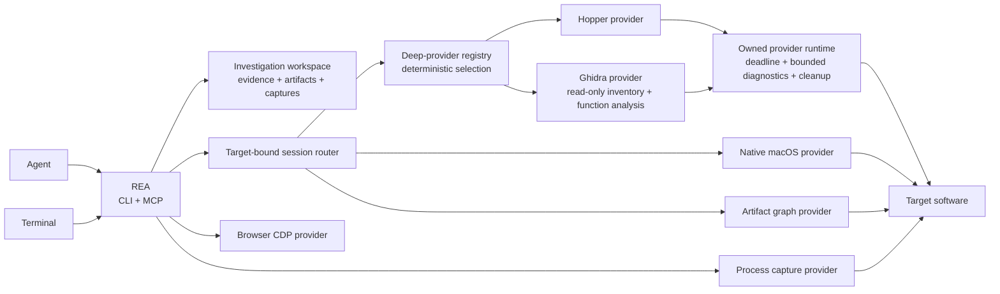

<div align="center">

**English** · [简体中文](README_zh.md) · [日本語](README_ja.md) · [한국어](README_ko.md) · [العربية](README_ar.md)

# REA: Reverse Engineer Anything

### Reverse engineer anything with agents, from app behavior down to native binaries.

**See a feature you like. Understand how it works, down to the binary level.**

[](https://www.npmjs.com/package/rea-agents)
[](https://github.com/morluto/rea/actions/workflows/ci.yml)
[](#tool-catalog-for-investigation)
[](https://nodejs.org/)
[](LICENSE)

[Quick start](#quick-start) · [Current status](#current-status) · [Investigation model](#the-investigation-model) · [Tool catalog](#tool-catalog-for-investigation) · [Roadmap](#roadmap) · [How it works](#how-it-works)

<br />

<code>npm install --global rea-agents && rea setup</code>

<br />


</div>

---

See a feature in an app that you want in your own product? Give the app to your agent—even without its source code. With REA, the agent can investigate the feature, explain how it works, show its evidence, and build a version adapted to your stack and requirements.

REA gives agents one consistent way to investigate software. Today that includes deep native analysis and function dossiers through Hopper or bring-your-own Ghidra on Linux, plus an experimental Windows x64 Ghidra P0 for approved native PE applications; execution-free managed PE/CLI triage; reproducible Evidence v2 records; controlled process capture; passive website, Electron page, and Node/Electron V8 Inspector observation; bounded JavaScript/source-map reconstruction; and a versioned domain graph for connecting JavaScript application layers without confusing static inference with runtime observation. The longer-term toolkit extends the same agent workflow to APIs, protocols, mobile artifacts, firmware, richer runtime behavior, and differences between versions.

Reverse engineering normally makes the operator choose a tool, learn its API, move evidence between programs, and decide what to inspect next. REA gives that work to the agent through commands, skills, structured results, and repeatable investigation workflows.

## Just ask your agent

Run setup once. Agent integration installs an aligned MCP registration and the
bundled routing skill together:

```bash
npx rea-agents setup
```

Then ask:

```text
Understand how search works in the Notes app, show me the evidence, and build a
similar feature for my project.
```

Notes is only an example. Name any app you want to understand, or ask the agent to start with an overview.

## The investigation model

<table>
<tr>
<td width="33%" valign="top">
<strong>Decompile</strong><br /><br />
Open an app and recover readable code, strings, names, and other clues about how it works.
</td>
<td width="33%" valign="top">
<strong>Understand</strong><br /><br />
Follow the code from one part of the app to another until the agent can explain how a feature actually works.
</td>
<td width="33%" valign="top">
<strong>Recreate</strong><br /><br />
Turn what the agent learned into a feature for your own product, adapted to your stack, interface, and requirements.
</td>
</tr>
</table>

REA shows how it reached its conclusions. It does not claim to recover original source code or automatically clone an application.

## Why REA

|                          |                                                                                                       |
| ------------------------ | ----------------------------------------------------------------------------------------------------- |
| **Built for agents**     | Ask what an app does and let your agent inspect it instead of guessing.                               |
| **CLI and MCP**          | Run the same reverse-engineering capabilities from your terminal or agent.                            |
| **Complexity handled**   | REA installs and manages the reverse-engineering tools behind the scenes.                             |
| **From insight to code** | Understand a feature, then build your own version in the same coding session.                         |
| **Local by design**      | Analysis runs on your supported local host. REA does not upload the app to a hosted analysis service. |
| **Keeps context**        | Investigate several apps without starting over for every question.                                    |

## Quick start

### Run setup — recommended

```bash
npx --yes rea-agents@latest setup
```

The npm package-runner prompt, when shown, approves downloading REA for this
invocation; it does not approve any setup changes. The REA wizard separately
shows its complete plan and asks before applying it. Setup does not update
Homebrew, Node.js, or npm. The setup command opens with the work it
enables: investigate local apps from an agent, recover evidence through a
deep-analysis provider, and reuse REA's guided workflow. It summarizes the
detected agents, then asks which capabilities to set up: agent integration
(MCP plus the matching guided workflow) and—when needed—the Hopper provider.
Nothing is preselected. Choosing agent integration opens a second empty
checklist for the specific detected agents that should receive a registration.

`@latest` makes the requested release explicit and asks npm for the release
currently published under that tag. REA does not silently replace the package
version npm selected. Intentional rollbacks therefore remain available through
an exact package request.

REA keeps the journey inline so its history remains in the terminal. Selecting
a capability does not select every detected target or authorize a change.
Before anything changes, REA validates existing configuration, prints exact
paths and external effects, and asks for final approval with **No** as the
default. The screen keeps the available keys visible while you choose; Ctrl-C
and declining leave the system unchanged.

REA detects Claude Code, Claude Desktop, Codex, Cursor, Gemini CLI, Windsurf, and Devin. It configures the first six when detected; Devin is reported but left unchanged because it has no documented local MCP configuration boundary. Registrations are additive, backup-first, and read back after writing. You can safely rerun setup.

Use `rea setup --dry-run` to inspect the plan, repeat `--client` to select exact
agents, and `--accessible` for sequential vertical prompts. Machine output
remains available through `--json`; prompt UI and progress go to stderr.

After a successful setup, REA reports the capabilities now ready to use and a
concrete next step, such as restarting a configured agent before asking it to
investigate an application. It does not claim an integration or provider is
ready unless setup and its final diagnostic check verified it.

An optional curl wrapper installs the same CLI package and starts setup only when a terminal is available:

```bash
curl -fsSL https://raw.githubusercontent.com/morluto/rea/main/install.sh | bash
```

Pass installer options after `bash -s --`, for example `--dry-run`, `--no-setup`, or `--version 1.0.0`. The curl wrapper never installs prerequisites or configures integrations itself. See [Installation and setup](docs/installation.md) for its exact mutation boundary.

### With an agent — recommended

```bash
npx --yes rea-agents@latest setup
```

Choose Agent Integration in the reviewed setup plan. REA installs the pinned MCP
registration and its matching routing skill as one transaction. After setup,
restart the configured agent so it loads the aligned integration.

Review the setup plan, approve it if appropriate, then describe the app or feature you want to understand. Hopper can run in its free demo mode; if it shows a first-run prompt, choose the demo or enter an existing license.

### From Terminal — no installation

```bash
npx --yes rea-agents@latest setup
npx -y rea-agents@latest doctor
npx -y rea-agents@latest analyze /Applications/Notes.app
```

Review the setup plan before confirming it. Restart a configured agent so it loads REA.

### From Terminal — install the `rea` command

```bash
npm install --global rea-agents
rea setup
rea doctor
rea analyze /Applications/Notes.app
```

Update that global installation in place:

```bash
rea upgrade
```

REA checks npm for the latest release and verifies that the running package is
the global installation it will replace. Source, local, and `npx` copies report
the manual `npm install --global rea-agents@latest` command instead of updating
an unrelated global package.

Choose either the no-install commands or the global installation. You do not need both.

`npm install rea-agents` without `--global` installs `rea` only into the
current project's `node_modules/.bin`; it does not add `rea` to your shell
`PATH`. Use the `npx` commands above for one-off runs or `--global` when you
want a shell-visible `rea` command.

### Requirements

- macOS 12 or newer
- Ubuntu 24.04+, Fedora 41+, or 64-bit Arch Linux
- Windows x64 for the experimental, Ghidra-only native PE P0 boundary
- Node.js 22.19+ or 24.11+ (including newer releases)
- npm; REA does not require or install a particular npm version

Deep binary operations use [Hopper](https://www.hopperapp.com/), a separate desktop application with its own license, or a caller-selected Ghidra provider. Ghidra supplies read-only inventory, function metadata, decompilation, assembly, resolved calls, typed references, xrefs, CFG, and function dossiers; GUI state and mutations remain unavailable through that provider. Setup reuses an existing Hopper installation or an operator-supplied Ghidra installation. It never downloads Ghidra or installs Java. If neither provider is ready, interactive setup proposes Hopper; unattended Hopper installation requires `rea setup --yes --install-hopper`.

If something is not working, run:

```bash
npx -y rea-agents@latest doctor
```

`rea doctor --json` is read-only and distinguishes unsupported hosts, missing dependencies, a missing local analysis engine, configuration drift, and healthy checks. Paid-license activation is optional: on Linux, REA runs the supported Hopper demo build on a private Xvfb display and selects Hopper's offered demo mode for each analysis session.

### Linux installation and troubleshooting

On macOS, approved setup downloads Hopper's official DMG, verifies it, and installs the app into `~/Applications` without Homebrew or administrator privileges. Hopper may show its demo or license prompt when first opened; no manual drag-and-drop is required.

On Ubuntu 24.04+, Fedora 41+, and 64-bit Arch Linux, approved setup downloads the pinned official Hopper 6.4.2 package, restricts downloads to Hopper's public origin, verifies the published size and checksum, and invokes `apt-get`, `dnf`, or `pacman` to install Hopper and the Xvfb, Python, X11, and XTEST packages used by demo sessions. When REA is not already running as root, `pkexec` presents the system authorization prompt. REA never invokes `sudo`. Demo sessions run on an isolated 1280×1024 Xvfb display. REA verifies the exact supported Hopper binary, its owned process ancestry, the expected dialog geometry, and bridge state before selecting `Try the Demo`; any mismatch fails closed.

The normal Linux launcher is `/opt/hopper/bin/Hopper`. If Hopper was installed elsewhere:

```bash
export HOPPER_LAUNCHER_PATH=/absolute/path/to/Hopper
rea doctor --json
```

If doctor reports a missing analysis engine even though the file exists, inspect shared-library resolution with:

```bash
ldd /opt/hopper/bin/Hopper | grep 'not found'
```

Install the missing distribution packages and rerun `rea setup`. Linux demo automation requires `Xvfb`, Python 3, `libX11.so.6`, and `libXtst.so.6`; approved setup installs those direct runtime dependencies and does not interact with the user's desktop display. Hopper's free demo supports analysis with vendor-defined limits, and a paid license is optional. The curl installer places the `rea` command in `~/.local/bin` on Linux; add that directory to future shell `PATH` values if it is not already present.

REA defaults `HOPPER_LAUNCHER_PATH` to `/Applications/Hopper Disassembler.app/Contents/MacOS/hopper` on macOS and `/opt/hopper/bin/Hopper` on Linux. Explicit configuration always takes precedence.

### Ghidra read-only analysis provider

The Ghidra adapter supports the exact official Ghidra 12.1.2 release with a 64-bit full JDK 21 on Linux x64. It also provides an experimental Windows x64 P0 limited to approved native x86-64 PE applications. Download and extract those projects yourself, then configure absolute paths:

```bash
export GHIDRA_INSTALL_DIR=/absolute/path/to/ghidra_12.1.2_PUBLIC
export JAVA_HOME=/absolute/path/to/jdk-21 # optional when java and javac resolve from PATH
rea doctor --json
rea setup
rea providers --json
```

Doctor distinguishes missing configuration, a bad installation root, the wrong Ghidra or Java version, a JRE without `javac`, a missing `support/analyzeHeadless`, and an unsupported platform or architecture. Approved setup only copies the verified non-secret paths into detected MCP registrations; it does not modify the Ghidra installation or install/download Ghidra or Java.

On Windows, set the same variables in PowerShell and run `rea doctor --json`; automated `rea setup` and Hopper installation remain unavailable. The P0 target boundary rejects DLLs, managed PE files, non-x86-64 images, mutable/hostile inputs, and non-PE formats. See the [Windows Ghidra P0 operations guide](docs/windows-ghidra-p0.md) for registration, exact limitations, CI evidence, and acceptance gates.

REA loads its packaged Java `HeadlessScript` with `-scriptPath`, copies and digest-verifies the target in an ephemeral runtime, enables `-readOnly` and `-deleteProject`, caps auto-analysis at 300 seconds with two CPUs and a 2 GiB Java heap, and authenticates every request. Linux uses a mode-0600 Unix socket. Windows P0 uses token-authenticated IPv4 loopback and a token-free endpoint record because Node path-based IPC does not connect to Java AF_UNIX sockets on Windows. The bridge verifies Ghidra's imported-byte SHA-256 before serving any operation.

The Ghidra adapter declares 19 direct and enhanced operations. Its ten inventory operations are `list_documents`, `list_procedures`, `list_strings`, `list_names`, `list_segments`, `address_name`, `procedure_address`, `resolve_containing_procedure`, `search_procedures`, and `search_strings`. It also admits `procedure_info`, `procedure_pseudo_code`, `procedure_assembly`, `read_function_instructions`, `procedure_callers`, `procedure_callees`, `procedure_references`, `xrefs`, and `analyze_function`. `read_function_instructions` is the offset-paginated fast path for raw instruction windows: it does not invoke the decompiler or whole-program name/string inventories, and is also exposed as `rea instructions`. These capabilities enable the shared Swift/Objective-C inventory workflows, `binary_overview`, `batch_decompile`, `get_call_graph`, `find_xrefs_to_name`, `trace_feature`, and complete function dossiers. Default-space addresses are lowercase `0x` hexadecimal. Other spaces, including `EXTERNAL`, use `<percent-encoded-space>:0x<hex>`. Symbol results identify primary, dynamic, external, type, and source facts; procedures distinguish external functions and thunks; strings identify charset, missing-terminator state, byte length, and value truncation; memory-block ends are exclusive and permissions come directly from Ghidra.

The bridge serves operations only after auto-analysis completes. Each Program owns one persistent `DecompInterface`; a bounded 32-request FIFO serializes Ghidra API access, and every decompile has a 30-second native deadline. Reference results preserve Ghidra's call/jump/data/read/write/indirect/computed/external facts, while unresolved targetless flows remain explicitly unknown. Synthetic entry-point references without actionable memory sources are omitted. Pseudocode and assembly are provider-specific observations, not original source or Hopper-equivalent text. An analysis timeout, scan or inventory safety limit, request timeout, or oversized response fails explicitly instead of returning a partial result labeled complete.

`npm run verify:ghidra` compiles source-owned x86-64 debug and stripped ELF, AArch64 ELF, x86-64 PE, and x86-64 Mach-O fixtures. Against real Ghidra 12.1.2 it validates every admitted operation, direct and indirect calls, imports/exports/thunks, typed references, strings/xrefs, multi-block CFG, cancellation, deadlines, concurrency, malformed inputs, and complete process/project cleanup. Set `REA_CC`, `REA_CLANG`, or `REA_LLD_LINK` only when the corresponding compiler command is not on `PATH`.

`npm run verify:ghidra:windows` uses a deterministic source-owned native x86-64 PE application and requires all 19 operations, target/snapshot/import digest linkage, authenticated loopback transport, and cleanup on a controlled Windows x64 Ghidra 12.1.2 runner. This proof does not establish Job Object ownership, private DACLs, or reparse-point-safe authority.

To remove only REA-owned MCP registrations and the managed skill:

```bash
rea uninstall
rea uninstall --purge-data # also removes only ~/.rea/cache and ~/.rea/state
```

Uninstall preserves Hopper, Node.js, evidence, captures, external evidence roots, unrelated skills, and other MCP servers. It refuses malformed client configuration and never follows purge-data symlinks.

### CLI or agent?

| If you want to…                                                  | Use                                                                       |
| ---------------------------------------------------------------- | ------------------------------------------------------------------------- |
| Ask an agent to investigate an app and build a feature           | Install the skill, then talk to your agent                                |
| Inspect or decompile one part of an app from the Terminal        | `rea analyze` or `rea decompile`                                          |
| Validate, canonicalize, or compare Evidence v2 bundles           | `rea evidence-import`, `rea evidence-export`, or `rea compare`            |
| Run or resume a persistent two-version artifact analysis         | `rea investigate-versions`                                                |
| Map a local JavaScript/Electron application without executing it | `rea analyze PATH --approved` or `rea analyze-javascript-application`     |
| Reuse immutable analysis results without relaunching a provider  | Pass `--snapshot /approved/path/analysis.json` to a deep-analysis command |
| Import source as historical reference                            | `rea import-reference-source`                                             |
| Capture or compare controlled process behavior                   | `rea capture-process` or `rea compare-process-captures`                   |

Filesystem evidence commands and MCP file tools are disabled until the operator approves absolute roots:

```bash
export REA_EVIDENCE_ROOTS_JSON='["/absolute/path/to/evidence"]'
export REA_INVESTIGATION_INPUT_ROOTS_JSON='["/absolute/path/to/releases"]'
rea evidence-import /absolute/path/to/evidence/bundle.json
rea evidence-export /absolute/path/to/evidence/bundle.json /absolute/path/to/evidence/canonical.json
rea compare /absolute/path/to/evidence/left.json /absolute/path/to/evidence/right.json
rea investigate-versions /absolute/path/to/releases/v1 /absolute/path/to/releases/v2 /absolute/path/to/evidence/releases.json --yes --workspace-name releases
rea analyze /absolute/path/to/releases/app.asar --approved --json
rea analyze-javascript-application /absolute/path/to/releases/app.asar --approved --json
```

For a directory or `.asar`, generic `rea analyze` automatically selects the
static JavaScript application provider when neither `--provider` nor
`--snapshot` is supplied. The dedicated command remains available for explicit
format and resource-limit controls. Both routes require `--approved` and an
administrator-approved investigation input root.

If REA is registered with an MCP client, run approved `rea setup` while the
explicit investigation-root variable is set, then restart that client. Setup
copies this non-secret policy into the managed registration; changing the shell
environment alone cannot update an already-running MCP process.

`investigate-versions` inventories both versions, checkpoints their observed
Evidence, derives an artifact comparison, and records a changed-behavior report.
Both input paths must resolve beneath `REA_INVESTIGATION_INPUT_ROOTS_JSON`;
workspace files remain independently restricted by `REA_EVIDENCE_ROOTS_JSON`.
The workspace uses deterministic content identities and monotonic CAS-linked
revisions, so the same request resumes an interrupted run or reuses a completed
run without replacing earlier investigations. It currently compares static
artifact structure only; it does not execute either version, and its report
keeps every difference labeled as a behavior candidate. See
[Persistent investigation workspaces](docs/investigation-workspaces.md).

Historical source import requires a separate allowlist and never treats source as current behavioral authority:

```bash
export REA_REFERENCE_ROOTS_JSON='["/absolute/path/to/source"]'
rea import-reference-source /absolute/path/to/source
```

Exports never replace an existing file unless `--overwrite` is explicit. Imports are size/depth bounded, validate every Evidence v2 ID and manifest, and never execute bundle content.

Provider-neutral analysis snapshots persist successful, immutable REA calls and
their Evidence v2 records. They are exact caches rather than Hopper databases:
REA reuses a v2 entry only when the binary digest, kind, format, architecture,
operation parameters, concrete provider build, and canonical analysis-profile
digest match. Hopper loader defaults and configured overrides are normalized by
the Hopper adapter and committed to that profile, so overrides occupy a distinct
safe cache partition instead of disabling snapshots. Snapshot v1 cannot prove
those semantics and is rejected with recapture guidance. Cursor-dependent and
mutating calls are never cached. Snapshot files can contain proprietary analysis
results and local paths, so REA keeps them local, writes them with owner-only
permissions, and requires a separate approved root:

```bash
export REA_ANALYSIS_SNAPSHOT_ROOTS_JSON='["/absolute/path/to/analysis"]'
rea analyze /absolute/path/to/app --snapshot /absolute/path/to/analysis/app.json
# The same exact query can now be answered from the snapshot.
rea analyze /absolute/path/to/app --snapshot /absolute/path/to/analysis/app.json
```

Exact CLI evidence replays happen before any provider process starts. In MCP sessions,
pass `snapshot_path` to `open_binary` to import a snapshot atomically while
opening its matching target; MCP providers may still start before a cached call
is replayed. Pass `snapshot_path` and, when required, `overwrite: true` to
`close_binary` to save atomically before Hopper resources are released. If the
save fails, REA deliberately leaves the session open.

## One prompt, a full investigation

```text
Reverse engineer the Notes app. Find how offline search works, explain it,
and build a version for my project using TypeScript and SQLite.
```

REA gives the agent a clear path from that request to working code:

| Step | What the agent does                     | REA tools                                                        |
| ---: | --------------------------------------- | ---------------------------------------------------------------- |
|    1 | Opens and identifies the binary         | `open_binary`, `binary_overview`                                 |
|    2 | Finds likely offline-search clues       | `search_strings`, `search_procedures`, `list_names`              |
|    3 | Connects those clues to executable code | `find_xrefs_to_name`, `xrefs`, `procedure_callers`               |
|    4 | Reconstructs the relevant control flow  | `get_call_graph`, `procedure_callees`, `procedure_info`          |
|    5 | Decompiles the relevant routines        | `procedure_pseudo_code`, `procedure_assembly`, `batch_decompile` |
|    6 | Builds the feature in your project      | code adapted to your stack, product, and requirements            |

REA handles the app analysis in steps 1–5. The agent performs step 6 with its normal file-editing and test tools, using what it learned about the app.

## What agents can do

- Investigate a feature you like and build a version tailored to your own product.
- Explain how a feature works when its source code is unavailable.
- Reconstruct an app's authentication, storage, update, or networking flow.
- Recover enough structure to document an undocumented format or interface.
- Trace a suspicious behavior from a string or symbol to the code that implements it.
- Run, checkpoint, resume, and reuse a content-addressed artifact investigation across two versions.
- Turn recovered behavior into product features, tests, migration notes, ports, or interoperable replacements.
- Analyze Swift and Objective-C metadata without manually untangling every mangled symbol.
- Leave names, comments, and bookmarks in Hopper so human and agent analysis reinforce each other.

## Tool catalog for investigation

| Tool family               | Count | Examples                                                                                                                                                                                                                                                                                                                         |
| ------------------------- | ----: | -------------------------------------------------------------------------------------------------------------------------------------------------------------------------------------------------------------------------------------------------------------------------------------------------------------------------------- |
| Native inspection         |    36 | procedures, pseudocode, assembly, strings, names, segments, callers, callees, xrefs, annotations, bounded byte reads, file-offset translation                                                                                                                                                                                    |
| Investigation workflows   |    13 | `binary_overview`, `analyze_function`, `inspect_native_api`, `batch_decompile`, `trace_feature`, exact string-to-code lookup, bounded call paths, call graphs, Swift and Objective-C discovery                                                                                                                                   |
| Native macOS utilities    |     5 | Mach-O metadata, code signatures, plists, architectures, Swift demangling; Hopper-free and provenance-bearing                                                                                                                                                                                                                    |
| Artifact graph            |     3 | bounded provider-neutral inspection, deterministic directory/ZIP/APK/IPA/MSIX/AppX/ASAR inventory, and explicitly selected extraction into an absent owned tree                                                                                                                                                                  |
| Managed PE/CLI            |     8 | PE/CLI identity, metadata members, CIL hashes, P/Invoke/native-boundary declarations and verification, application-graph projection, decompiler reconstruction import, token remapping, runtime-correlation plans, and version comparison                                                                                        |
| Browser observation       |     9 | exact-origin passive CDP capture, bundle and source-map analysis, WebMCP discovery, session timelines, capture diff, visual evidence, and bounded Playwright scenarios                                                                                                                                                           |
| Electron analysis         |     5 | passive root-confined observation, bounded static application mapping, evidence-backed static/runtime reconciliation, and separately approved provider-owned click/wait scenarios                                                                                                                                                |
| JavaScript runtime        |     2 | approved attach-only Node/Electron Inspector target discovery plus bounded script and execution-context observation without evaluation or instrumentation                                                                                                                                                                        |
| Application workflows     |    12 | bounded cross-layer traces, unique-only version matching, historical-source to bundle mapping, static export return-shape comparison, approved Linux-isolated extracted-module replay, managed-runtime characterization, reconstruction coverage closure, deterministic obligation ledgers, and end-to-end readiness conformance |
| Workspace and observation |    23 | target lifecycle, Evidence v2 bundle snapshots, retained-bundle release, aggregate navigation/address context, direct finite replay-machine evaluation, process/artifact/function comparison, evidence-linked residual-unknown lifecycle                                                                                         |

The public interface describes what the agent is trying to learn. Providers decide how to answer. macOS utilities handle common semantic inspection without launching Hopper; Hopper handles deeper native analysis; the process harness implements controlled behavioral capture.

## Current status

REA is already useful for native application, browser, and Electron investigation on supported macOS and Linux hosts, plus the bounded Windows Ghidra P0 described above:

- Open Mach-O, ELF, PE, `.app`, ZIP, APK, IPA, ASAR, plist, JavaScript, source-map, and generic analysis-database targets; Hopper remains the only adapter that accepts legacy `.hop` databases.
- Discover deep-analysis candidates without starting them, choose deterministically, and retain one immutable provider/profile binding until an explicit switch or close; provider failures never trigger transparent fallback.
- Attach to a user-owned Chrome-family browser over a configured loopback CDP endpoint; capture exact-origin web structure, safe metadata, approved value-free payload shapes, bundle/source-map evidence, WebMCP declarations, user-action timelines, capture diffs, and explicitly approved screenshots without navigation or JavaScript evaluation.
- Inspect Electron `file://` renderer pages through a separate canonical-root permission boundary without invoking Electron APIs; script contents remain separately approved and byte bounded.
- Attach to one exact approved Node or Electron V8 Inspector target and retain bounded `scriptParsed` plus execution-context lifecycle metadata without evaluation, breakpoints, resume, source reads, or instrumentation. require/import edges, EventEmitter activity, Electron IPC, PID identity, and role identity remain unknown. See [passive Node and Electron runtime observation](docs/javascript-runtime-observation.md).
- Validate and canonically serialize a provider-neutral [JavaScript Application Graph v1](docs/javascript-application-graph.md) spanning packages, ASAR entries, Electron roles, JavaScript/source-map entities, browser/runtime instances, IPC, endpoints, storage, and native add-ons. This shipped domain contract performs no extraction or I/O by itself.
- Reconstruct bounded static package, entrypoint, Webpack/Rspack module, import, worker, endpoint, storage, source-map, BrowserWindow, preload, contextBridge, IPC, utility-process, and native-add-on structure from an approved local directory or ASAR through `analyze_javascript_application` or `rea analyze-javascript-application`. The AST-only [application service](docs/javascript-artifact-reconstruction.md) never executes bootstrap code, pairs only unique exact literal IPC channels, and reports dynamic or ambiguous channels as unresolved.
- Reconcile that static graph with existing passive web or Electron Evidence through `reconcile_javascript_runtime` or `rea reconcile-javascript-runtime`. Exact captured bytes outrank caller-declared file/URL mappings; target, frame, script, worker, cache, and asset ambiguity stays explicit, source-map authority stays separate, and a module resident in an observed bundle is never reported as executed. See [JavaScript static/runtime reconciliation](docs/javascript-runtime-reconciliation.md).
- Trace a literal route, string, API, IPC channel, module, or native export through authenticated application Evidence with explicit traversal bounds, then hand exact native artifact digests and requested exports to retained Ghidra or Hopper Evidence without automatic provider switching. Compare application versions using unique-only digest, source-map, structural, and semantic tiers; map a committed historical source inventory to bundle nodes with explicit digest and path scores; compare one exact JavaScript export's static return shapes through unique literal discriminants and bounded JSON Pointer changes. Duplicate, dynamic, incomplete, ambiguous, and truncated facts stay unknown. See [cross-layer JavaScript application workflows](docs/javascript-application-workflows.md).
- Classify PE/CLI managed artifacts with `inspect_managed_artifact` / `rea inspect-managed-artifact`, inspect bounded metadata members, signatures, raw CIL hashes, limited decoded-instruction-tuple v1 hashes, separately reported exception regions, call edges, and field-access anchors with `inspect_managed_members` / `rea inspect-managed-members`, inventory declared ModuleRef/ImplMap/PInvoke and non-IL method boundary indicators with `inspect_managed_native_boundaries` / `rea inspect-managed-native-boundaries`, then compare two authenticated member observations with `compare_managed_members` / `rea compare-managed-members`. `verify_managed_native_boundaries` / `rea verify-managed-native-boundaries` checks managed P/Invoke declarations against authenticated native export or function Evidence while keeping verified, inferred, contradicted, and unresolved states distinct. The comparison treats build-local tokens as build-local and uses unique decoded-CIL/signature and structural method-shape tiers, never names alone; the v1 tuple hash does not itself resolve tokens or fully commit control flow. `project_managed_application_graph` / `rea project-managed-application-graph` projects authenticated managed artifact/member/native-boundary Evidence into the existing application graph for cross-layer feature tracing. `import_managed_reconstruction` / `rea import-managed-reconstruction` admits user-supplied decompiler C#/IL/pseudocode as analyst inference only after exact artifact SHA-256, MVID, signature, and the shipped v1 decoded-IL commitment match. Separately, `plan_managed_runtime_correlation` / `rea plan-managed-runtime-correlation` can admit a default-disabled, permission-gated runtime-correlation plan locked to the same build evidence. These paths never load the assembly, resolve CLR dependencies, execute target code, run a decompiler, or translate managed tokens into native addresses; full normalized-CIL v2 semantics, native-body bridge mapping, and an actual runtime executor remain future managed-code contracts.
- Configure `REA_ILSPY_CMD_PATH=/absolute/path/to/ilspycmd` only when you want
  doctor and `verify:managed` to inspect a bring-your-own ILSpy command as a
  real reconstruction oracle. REA does not install ILSpy and does not treat
  decompiler text as canonical metadata or CIL observation.
- Traverse content-addressed artifact graphs without extraction; on macOS, read-only DMG traversal additionally requires `native_mount_approved: true` and `REA_ARTIFACT_NATIVE_MOUNT_ENABLED=true`. Materialize only approved occurrences into absent output roots.
- Build bounded function dossiers with pseudocode, assembly, CFG edges, comments, calls, references, strings, and names.
- Search and trace features across symbols, strings, metadata, references, and call paths.
- Record every successful result as deterministic Evidence v2 with artifact and provider identity, confidence, authority, limitations, and locations.
- Export and import evidence bundles across sessions.
- Persist automatic cross-version artifact runs as canonical, lock-protected workspaces with tamper-evident revision commitments.
- Capture approved PTY scenarios as Process Capture v4 Evidence, including committed run manifests, raw and rendered terminal frames, scripted interactions, descendant settlement, named filesystem checkpoints, deterministic command shims, and loopback HTTP/WebSocket exchanges.
- Validate finite replay machines without launching a target through `run_replay_machine` or `rea run-replay-machine`; ordered events return typed decisions, actions, captured aliases, transition journals, final state, and exact limit use without echoing request or captured values.
- Compare complete artifact inventories by stable path, content, metadata, and relations; incomplete evidence never implies equivalence.
- Compare explicit function dossiers across text, calls, references, strings, and address-normalized CFG topology with per-facet unknowns.
- Compare canonical Evidence bundles by exact membership, explicit observation pairs, and residual-unknown histories without turning omissions into behavioral absence.
- Aggregate runtime comparisons into observed behavior changes while keeping static artifact/function differences labeled as candidates.
- Build bounded, Evidence-cited direct call paths by exact address without treating missing dossiers as graph leaves.
- Correlate exact static/runtime findings through explicit hypotheses without claiming causality from cochange.
- Verify finite behavioral and structural reconstruction specifications with pass, fail, and unknown kept distinct.
- Track residual unknowns through immutable CAS revisions, evidence-qualified resolution, contradictions, probes, and validated dependency relationships.
- With explicit `unknown_registry_approved: true`, record bounded trace/capture residuals, typed provider unavailability, and capture disagreements automatically.
- Start six [guided MCP workflows](docs/mcp-prompts.md) with live, session-aware completion for documents, procedures, providers, evidence, captures, artifact IDs, and active unknowns.

Hopper is the first provider, not the boundary of the project. Some current workflows still require Hopper and macOS; every evidence record identifies the provider and limitations behind its result.

### Website observation with CDP

REA can inspect an already-running Chrome-family browser that you own. Browser observation is disabled by default and requires a literal loopback CDP endpoint plus exact approved page origins:

```bash
export REA_BROWSER_OBSERVE_ENABLED=true
export REA_BROWSER_CDP_ENDPOINTS_JSON='["http://127.0.0.1:9222"]'
export REA_BROWSER_ALLOWED_ORIGINS_JSON='["http://127.0.0.1:3000"]'

rea list-browser-targets http://127.0.0.1:9222 --approved --json
rea inspect-web-page http://127.0.0.1:9222 TARGET_ID --approved --json
```

All eight browser tools expose the same Evidence v2 contracts over CLI and MCP. Inspection is passive: REA does not evaluate page JavaScript, navigate, click, close the page, or close the browser. Query values, credentials, cookies, authorization headers, storage values, and raw JSON or WebSocket values are never retained. Separately approved captures can retain bounded redacted console primitives, value-free JSON/WebSocket shapes, script sources, accessibility text, or screenshot pixels. Existing activity before attach is explicitly unavailable. See [Website observation with CDP](docs/browser-observation.md) for browser startup, schemas, limits, and the threat model.

### Controlled browser scenarios

`capture_browser_scenario` is a separate, explicitly mutating browser boundary.
It runs only the fixed, versioned scenario vocabulary through Playwright and
returns step-indexed Evidence for screenshots, DOM, accessibility, URL/history,
storage, console/errors, network, WebSockets, frames, workers, popups, and
cancelled downloads. Missing or truncated sections can never support equality
claims.

```bash
export REA_BROWSER_SCENARIO_ENABLED=true
export REA_BROWSER_SCENARIO_EXECUTABLE_ROOTS_JSON='["/usr/bin"]'
export REA_BROWSER_SCENARIO_CDP_ENDPOINTS_JSON='["http://127.0.0.1:9222"]'
export REA_BROWSER_SCENARIO_ALLOWED_ORIGINS_JSON='["http://127.0.0.1:3000"]'
export REA_BROWSER_SCENARIO_ALLOWED_ENV_JSON='["REA_TEST_PASSWORD"]'

rea capture-browser-scenario ./scenario.json --json
```

Launch mode owns a temporary browser profile and removes it after terminating
the launched browser. Connect mode accepts one exact loopback CDP target and
disconnects without closing the external browser. Automation has no default
grant: use the shared project/session policy, or set
`REA_BROWSER_SCENARIO_AUTO_GRANT=true` only for a trusted unattended
environment. Scenario JSON contains secret references and environment-variable
names, never secret values. See the
[browser scenario contract](docs/browser-scenario-contract.md).

### Node and Electron V8 Inspector observation

Attach-only JavaScript runtime observation is separately disabled by default:

```bash
export REA_V8_INSPECTOR_OBSERVE_ENABLED=true
export REA_V8_INSPECTOR_ENDPOINTS_JSON='["http://127.0.0.1:9229"]'
export REA_V8_INSPECTOR_FILE_ROOTS_JSON='["/absolute/path/to/app"]'
export REA_V8_INSPECTOR_ALLOWED_ORIGINS_JSON='[]'

rea list-javascript-runtime-targets http://127.0.0.1:9229 --approved --json
rea observe-javascript-runtime http://127.0.0.1:9229 TARGET_ID \
  --runtime-kind node --approved --json
```

REA sends only `Runtime.enable` and `Debugger.enable`. It retains bounded,
scope-authorized script locations and execution-context lifecycle events;
require/import edges, EventEmitter activity, Electron IPC, PID identity, and
Electron role identity stay explicit unknowns. See
[passive Node and Electron runtime observation](docs/javascript-runtime-observation.md).

Exact package, tool-family, provider, setup-client, public schema-version, and CLI facts are generated from source in [`docs/product-catalog.json`](docs/product-catalog.json). PR CI verifies this catalog, narrative documentation, generated schemas, and a clean TypeDoc render.

## Roadmap

REA is growing into a toolkit for understanding software across static artifacts and observed behavior. The [current status](#current-status) above is the shipped baseline; the items below are planned work.

### Now

1. **Maintain truthful product metadata** — extend the shipped canonical catalog and drift checks whenever versions, tools, providers, schemas, setup clients, or CLI capabilities change.
2. **Cross-provider conformance growth** — add source-owned architectures and difficult indirect/thunk cases while preserving semantic comparison and provider-specific text boundaries.

### Next

1. **Controlled replay conformance growth** — extend the shipped Linux extracted-module sandbox with more source-owned hostile fixtures and cross-kernel conformance; browser and Electron scenarios remain separately permissioned authorities.
2. **Broader application graph evidence** — extend authenticated cross-layer traces with additional static extractors and separately approved runtime authorities.
3. **Professional managed-code analysis** — extend shipped PE/CLI triage, CIL evidence, managed/native declaration inventory, source-owned conformance, and obfuscation-resistant comparisons toward verified native-provider composition under the accepted [managed-code boundary](docs/managed-code-analysis.md).
4. **Deterministic behavior harnesses** — extend process ownership, protocol fixtures, filesystem observation, reconnects, and cross-version behavioral comparison.

### Later

1. **Broader controlled application interaction** — extend the separately authorized browser and Electron scenario surfaces beyond the current bounded click/wait actions without widening passive observation or extracted-module replay authority.
2. **Native runtime observation** — approval-gated LLDB, Frida, system logs, process/filesystem observers, and native API tracing.
3. **Additional providers and targets** — evaluate IDA/Hex-Rays, Binary Ninja, Rizin, LIEF, Windows-native providers, mobile artifacts, firmware, document formats, and other software-defined systems.

New providers must produce the same evidence and safety metadata as existing capabilities before they become part of the public workflow. Once REA has multiple optional toolchains, setup can become capability-selective; the consent rules for that future work are recorded in the [installation roadmap](docs/roadmap.md).

See the [static-analysis provider evaluation](docs/provider-evaluation.md) for the shipped Ghidra function-analysis boundary, remaining admission gates, and provider comparison matrix; [ADR-0001](docs/adr/0001-provider-selection-and-analysis-profiles.md) for binding, selection, profile, snapshot, and compatibility decisions; the [controlled replay guide](docs/controlled-javascript-replay.md) plus [ADR-0002](docs/adr/0002-controlled-replay-authority-and-sandbox.md) for the shipped JavaScript replay boundary; and [ADR-0003](docs/adr/0003-managed-code-evidence-and-provider-boundary.md) for the managed-code evidence and provider design.

## Using REA with other agents

Setup detects Claude Code, Claude Desktop, Codex, Cursor, Gemini CLI, Windsurf, and Devin. It automatically configures the first six when present; detected Devin installations are reported but left unchanged. Any agent that supports local MCP servers can use REA with the configuration below.

### Manual MCP configuration

<!-- x-release-please-start-version -->

```json
{
  "mcpServers": {
    "rea": {
      "command": "npx",
      "args": ["-y", "rea-agents@3.1.0", "mcp"]
    }
  }
}
```

<!-- x-release-please-end -->

Persistent registrations should use one exact package version. `rea setup`
maintains that pin, upgrades the bundled skill at the same time, and gives Codex
a 30-second startup allowance for a cold package-runner start. An interactive
`rea upgrade` opens the updated setup plan after installing the new executable;
structured or non-interactive upgrades tell you to run that sync explicitly.
Restart clients whose approved registration changed.

MCP clients that support prompts can also discover six ordered investigation
workflows through `prompts/list`. Their optional identifier arguments use the
current session for bounded `completion/complete` suggestions; see
[Guided MCP prompts and completion](docs/mcp-prompts.md).

## How it works



The CLI and MCP server use the same application workflows and evidence contracts. A provider declares which capabilities it supports and the side effects those capabilities may have. Terminal commands are short-lived; an MCP session can retain an active target and evidence ledger across an investigation. Approved persistent workspaces keep canonical Evidence and resumable run checkpoints across both process and session lifetimes.

## CLI

The agent workflow above is the easiest way to use REA. For a one-off overview from the Terminal:

```bash
npx -y rea-agents@latest analyze /Applications/Notes.app
npx -y rea-agents@latest inspect /Applications/Notes.app
npx -y rea-agents@latest inspect /Applications/Notes.app --detail detailed --limit 20
npx -y rea-agents@latest search /Applications/Notes.app "offline"
npx -y rea-agents@latest function /Applications/Notes.app 0x1000
npx -y rea-agents@latest xrefs /Applications/Notes.app 0x1000
npx -y rea-agents@latest trace /Applications/Notes.app "offline"
npx -y rea-agents@latest compare /absolute/path/to/left-evidence.json /absolute/path/to/right-evidence.json
npx -y rea-agents@latest investigate-versions /path/to/v1 /path/to/v2 /absolute/path/to/evidence/releases.json --yes
npx -y rea-agents@latest capabilities
npx -y rea-agents@latest providers
```

Run `npx -y rea-agents@latest --help` for direct decompilation, bounded search and
other options. `analyze` and `inspect` share the same overview workflow;
`function`, `xrefs`, and `trace` return the same Evidence v2 envelopes as MCP.

Or install the `rea` command globally:

```bash
npm install --global rea-agents
rea --help
rea upgrade
rea mcp
```

REA accepts a Mac `.app` folder directly. If an agent cannot find an app by name, tell it where the app is installed.

### Choosing a deep-analysis provider

Every deep-analysis open resolves a provider before creating its client. The
same selector and precedence apply to the CLI, MCP, and startup configuration:

```bash
rea providers --json
rea analyze /absolute/path/to/program --provider hopper
REA_ANALYSIS_PROVIDER=hopper rea decompile /absolute/path/to/program 0x1000
```

For MCP, pass the optional selector on `open_binary`:

```json
{
  "path": "/absolute/path/to/program",
  "provider_id": "hopper"
}
```

The request-level `provider_id` or `--provider` wins over
`REA_ANALYSIS_PROVIDER`; all accept a provider ID or `auto`. Automatic selection
binds the sole usable deep candidate, reports `ambiguous` when several are
usable, and can leave an artifact-only target unbound so its disjoint artifact
operations still work. An explicit unknown, unavailable, or unsupported
provider fails with candidate IDs, stable rejection codes, and actionable local
diagnostics. `binary_session`, `rea providers`, and `rea capabilities` expose
the authoritative `analysis_provider_candidates` and
`analysis_provider_binding` fields. Each open target also has an
`analysis_run.run_id` allocated before provider startup. When dynamic providers
start, `analysis_run.process_lineage` changes from `not_observed` to `snapshots`
and retains one provider-attributed, token-verified observation per started
provider. Each observation carries `observed_at` and remains `unavailable` or
`verified`; a verified empty descendant list is distinct from both. Snapshots
describe bounded observations, not current live state or historical absence.
For providers with serial work, `analysis_activity` distinguishes `idle`,
`busy`, and `timed_out_busy`, and reports the active operation, elapsed time,
caller state, timeout, and queued-request count. A caller timeout therefore
does not falsely imply that Hopper's Python thread is available. `close_binary`
clears the REA session but returns `cleanup_incomplete` when authenticated
document shutdown, owned process cleanup, or private runtime removal cannot be
verified.
Reopening same target without a selector keeps its binding; runtime failure
never selects another provider silently.
Ghidra can appear as an available, target-compatible candidate after doctor
validates its exact installation. Its capability list contains the 19 admitted
read-only inventory and function-analysis operations; selecting it still does
not make Hopper-only GUI or mutation operations available and never triggers a
silent fallback.

### CLI exit status

| Status    | Meaning                                                                                                                                                                                                                                                                  |
| --------- | ------------------------------------------------------------------------------------------------------------------------------------------------------------------------------------------------------------------------------------------------------------------------ |
| `0`       | The requested operation completed. Truthful unknowns, warnings, and bounded or truncated evidence remain successful results.                                                                                                                                             |
| `1`       | Arguments, policy, permission, provider analysis, integrity checking, cancellation, timeout, setup, diagnostics, update, uninstall, output encoding, or output writing prevented completion. Structured output identifies the failure category when REA could encode it. |
| `128 + N` | The process ended from signal `N`, where the shell or runtime preserves the conventional signal-derived status.                                                                                                                                                          |

`setup` returns `1` for `planned`, `needs_confirmation`, or `needs_human`
because configuration is not ready; rerun it after approval or remediation.
`doctor` returns `1` when any check is unhealthy. Output format, full envelopes,
filters, and token controls never change the operation status.

When REA feeds a shell pipeline, enable `pipefail` so a downstream formatter
cannot hide its failure:

```bash
set -o pipefail
rea inventory-artifact ./app.asar --json | jq . > inventory.json
```

## Current Hopper provider

REA starts Hopper when needed; Hopper does not need to be running first. Hopper's launcher internally activates the application, so opening a target may bring Hopper to the foreground. REA asks macOS to start Hopper hidden and in the background when possible, but cannot guarantee that it will remain behind the current application.

REA derives explicit format and architecture arguments to prevent common FAT and ARM selection dialogs. Other Hopper or macOS dialogs may still require a person. REA reports timeouts and remediation through CLI or MCP results instead of attempting to answer UI prompts.

Hopper bridge calls pass through a bounded serial FIFO because Hopper's Python API runs on one dedicated thread. Queue wait counts against the caller deadline; a timeout settles the caller but does not release the wire slot until Hopper actually replies. `binary_session.analysis_activity` exposes that detached work and MCP progress reports elapsed time. Successful decompilation text is cached per document and procedure, shared by pseudocode and dossier requests, and invalidated after rename or comment mutation.

Hopper's synchronous public Python calls cannot stream a partial response after the caller deadline. Use `read_function_instructions` or `rea instructions` when raw instruction orientation is enough: this path does not decompile or scan whole-program name/string inventories. If a dossier has already timed out, inspect `analysis_activity`; do not assume a raw request can enter the serial bridge until that detached Hopper call actually returns.

Closing a REA session shuts down its bridge and removes its private socket directory. It does not quit a Hopper application the user may be using. If shutdown or cleanup cannot be verified, `close_binary` returns `cleanup_incomplete` with the affected local resources.

## Advanced process-capture setup

Process capture is disabled by default. Enabling it requires
`REA_PROCESS_CAPTURE_ENABLED=true`, approved executable and working roots in
`REA_PROCESS_EXECUTABLE_ROOTS_JSON` and `REA_PROCESS_WORKING_ROOTS_JSON`, and an
environment allowlist in `REA_PROCESS_ALLOWED_ENV_JSON`. Because the current PTY
adapter uses host networking, it also requires
`REA_PROCESS_ALLOW_EXTERNAL_NETWORK=true`.

Set `REA_PROCESS_CAPTURE_AUTO_GRANT=false` to configure those process-capture
limits as a ceiling without implicitly granting them. This mode remains
fail-closed until a narrower grant is established.

Capture a scenario or compare two saved Process Capture v4 Evidence records:

```bash
rea capture-process ./scenario.json > authority.json
rea capture-process ./reconstruction.json > reconstruction.json
rea compare-process-captures authority.json reconstruction.json
```

The comparison reports each observed dimension separately and identifies the
first terminal, interaction, exit, filesystem, protocol, process, or shim
divergence. See [Process Capture v4](docs/process-capture.md) for scenario
fields, command-shim replay, checkpoint triggers, limits, and safety behavior.

REA installs a prebuilt PTY backend for supported macOS, Linux, and Windows
architectures. If the capability check reports that the backend is unavailable,
reinstall REA for the current platform and architecture.

ASAR inventory verifies Electron integrity metadata for both archive entries
and `.asar.unpacked` companion files. Integrity failures identify the logical
path, declared and calculated SHA-256 values, and whether the entry was
unpacked; REA does not silently accept the mismatched artifact. If a supplied
ASAR declares unpacked companion bytes that are absent from the local artifact
set, REA keeps that occurrence as `unavailable` and continues analyzing the
embedded JavaScript instead of treating the missing native/resource bytes as
verified or absent.

## Security model

REA does not provide a hosted analysis service. Hopper and Linux Ghidra bridge communication uses authenticated private local sockets. Windows Ghidra P0 uses authenticated IPv4 loopback but does not claim named-pipe DACL or hostile-local-user isolation. Dynamic capabilities are disabled by default and require both operator policy and explicit per-call approval. Shipped providers, passive observers, and Process Capture are not security sandboxes: providers and launched targets run with the current user's permissions. Extracted JavaScript replay is a distinct Linux-only capability that fails closed unless Bubblewrap namespaces, architecture-checked seccomp, private runtime mounts, and delegated cgroup limits are available; it never inherits browser, Electron, or Process Capture authority. See [ADR-0002](docs/adr/0002-controlled-replay-authority-and-sandbox.md). Report vulnerabilities through the private process in [SECURITY.md](SECURITY.md).

## FAQ

<details>
<summary><strong>Does Hopper need to be running before I start REA?</strong></summary>

No. REA starts Hopper when an operation needs it. An already-running Hopper application is also supported.

</details>

<details>
<summary><strong>Why did Hopper appear in front of my other windows?</strong></summary>

Hopper's launcher internally activates the application. REA requests background startup, but macOS and Hopper may still bring a window or dialog forward. See [Hopper application behavior](#hopper-application-behavior).

</details>

<details>
<summary><strong>Does REA include Hopper?</strong></summary>

No. Setup can install Hopper for you, but Hopper remains separate software with its own license. REA supplies the CLI, MCP server, and workflows that make it usable by agents.

</details>

<details>
<summary><strong>Does REA install or include Ghidra or Java?</strong></summary>

No. Ghidra support is bring-your-own. REA packages only its Java bridge source, validates the exact supported Ghidra 12.1.2 and 64-bit JDK 21 installation, and loads that bridge through Ghidra's external script path after setup approval records the paths.

</details>

<details>
<summary><strong>Does REA upload the app?</strong></summary>

REA has no hosted analysis service. Current providers analyze artifacts and capture behavior locally. Your agent or model provider may have its own data policy, so review that separately.

</details>

<details>
<summary><strong>Can REA recover the original source code?</strong></summary>

No decompiler can guarantee the original source. REA gives an agent pseudocode, assembly, symbols, strings, metadata, and relationships that it can use to explain or compatibly recreate observed behavior.

</details>

<details>
<summary><strong>Which agents can use REA?</strong></summary>

Any agent that can run a local MCP server can use the manual configuration. Setup detects Claude Code, Claude Desktop, Codex, Cursor, Gemini CLI, Windsurf, and Devin; it automatically configures the first six when present and reports Devin without modifying it.

</details>

## Development

See [CONTRIBUTING.md](CONTRIBUTING.md) for setup, architecture, and release
instructions, and [docs/testing.md](docs/testing.md) for the behavioral test
depths, focused developer commands, coverage floors, and CI evidence. PR CI
publishes generated API documentation as the `api-docs` workflow artifact.

`npm run verify:agent` runs brandless native, JavaScript-application, managed,
and browser prompts through a real local Codex CLI. Its JSON report measures
natural MCP use, first-tool routing, repeated calls, actual Codex token usage,
completion quality, and explicit treatment of authority and unknowns.

`npm run evidence:generate` regenerates the managed conformance manifest and
Evidence v2 completion ledger from live verifier output. `npm run
evidence:check` reruns the verifier and fails when artifacts, scenarios,
providers, schemas, claim counts, Evidence IDs, or the bundled skill have
drifted. Unsupported claims remain explicit and never count as passes.
Verifier JSON reports include an ephemeral `verifier_run` UUID allocated before
the verifier performs work and inherited by its child processes through
`REA_PROCESS_RUN_ID`. The final report includes the verifier and parent PIDs
plus `process_lineage` and its ISO `observed_at` timestamp: POSIX verifiers
report a token-verified, point-in-time launcher process group and live
descendants, while platforms without an owned
lineage primitive report `status: "unavailable"` and a reason. An empty verified
descendant list means no child was live during the final observation; it does
not claim the verifier launched no children earlier. Nested verifier entrypoints
in the same process reuse its UUID; each new verifier process replaces any
inherited parent token with a fresh run identity.
Generated completion commitments deliberately exclude this per-execution
identity, so check mode remains deterministic while live reports remain
attributable.

Owned Hopper shutdown logs retain the launcher PID, process-group ID, cleanup
status, and whether a verified group signal was required. They omit the run
token and unexpected exception text. The real-Hopper verifier also starts an
unrelated `Hopper`-named sentinel in a distinct process group and fails unless
that process survives every session close; the sentinel is removed only by the
verifier after the survival check.

## Project links

[npm](https://www.npmjs.com/package/rea-agents) · [Issues](https://github.com/morluto/rea/issues) · [Security](SECURITY.md) · [Contributing](CONTRIBUTING.md) · [Hopper](https://www.hopperapp.com/) · [Ghidra](https://github.com/NationalSecurityAgency/ghidra)

## License

[MIT](LICENSE)
