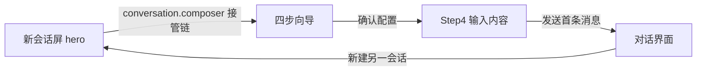

# dsh-new-session-cards

中文 | [English](README.en.md)

把 DSH（DeepSeek Harness）Web GUI 的新会话屏，改造成**四步卡片向导**的独立插件——防止"用默认配置却忘了配置任务模式、模型"。

对 DSH 本体**零修改**：独立 bundle 分发，`dsh plugin add` 一条命令装上，`remove` 一条命令卸掉。

---

## 为什么 DSH 很好玩

DSH 整个产品都是 Cordis 插件树——**没有需要"手术"的核心**，所有东西都可以从外面替换：

- **composer 接管链**：新会话屏的输入区是一个 selector 路由链，任何插件都可以"接管"它，把自己变成全屏界面（本插件就是这么干的），用完让位，原输入框自动回归
- **槽系统（Slots）**：侧边栏、设置页、会话头部、消息行……全有可注入的槽位，插件像乐高一样挂上去
- **主题 token**：`--dsw-alias-*` 语义色板，插件写样式零字面色值，明暗主题自动适配
- **bundle 分发**：`dsh.bundle` + `dsh.client` 两个 manifest，本地目录 / tarball / GitHub 直装都行
- **插件即代码**：client 插件是普通 JS/TSX，打包成浏览器 bundle，与内置插件同一套加载契约

你不需要 fork DSH 就能深度改造它的界面。本插件就是一条完整的例子：**接管 → 配置 → 让位**。

## 这个插件做什么

新会话屏原本的配置入口（工作区芯片、agent preset 芯片、输入卡角落的小模型选择器）都**默认落在部署默认值上**，用户极易跳过配置直接发送。本插件把新会话屏替换为：

1. **Step1 任务模式**：agent preset 卡片网格单选，默认预置带「默认」徽标
2. **Step2 模型**：模型卡片网格单选（provider 标签区分），默认模型带「默认」徽标
3. **Step3 其余配置**：工作区（全宽）+ 访问模式 / 计划模式（并排）
4. **Step4 输入内容**：点击「确认配置并开始」后进入——向导内的消息输入区（输入框 + 发送按钮 + "/" 命令菜单，与标准输入框同一套输入机器与命令管道），发送首条消息后向导自然让位，进入对话

**确认本身不发送任何消息**。任何配置都不会在用户不知情时使用默认值。

也可以随时回到原版 hero：向导底部「使用标准输入框」，或 设置 → 通用设置 → 新会话配置向导 开关（偏好存于浏览器 localStorage）。

## 安装

```sh
# 前置：DSH CLI 已安装并初始化过 profile（如 web）
dsh plugin --profile web add github:supergameboy/dsh-new-session-cards
```

GitHub 安装拉取的是源码，pnpm ≥10 需要显式允许构建脚本（**只允许你信任的源码**）：

```yaml
# <profile 目录>/pnpm-workspace.yaml
allowBuilds:
  dsh-new-session-cards: true
```

然后重新执行 `add`（`prepare` 脚本自动构建 `lib/`）。本地目录或 tarball 安装不需要允许构建：

```sh
dsh plugin --profile web add ./dsh-new-session-cards     # 本地目录（需先 pnpm build）
dsh plugin --profile web add ./dsh-new-session-cards-0.1.0.tgz
```

验证与启用：

```sh
dsh --profile web --dump-config   # 应看到 "# == dsh-new-session-cards" 层
dsh --profile web                 # 打开新会话屏，即见向导
```

> 如果插件已装过且改了代码：profile 是 link 安装，**浏览器刷新即生效**，无需重启服务（服务端每次请求都读最新 bundle 文件）。

卸载：

```sh
dsh plugin --profile web remove dsh-new-session-cards
```

## 从源码构建

```sh
pnpm install
pnpm build          # tsdown：lib/index.js（node half）+ lib/client.js（浏览器 bundle）
pnpm typecheck      # 需要 DSH 源码树在 ../deepseek-harness（见踩坑 #1）
```

---

## 踩坑记录（写给 DSH 插件作者）

以下是开发本插件时真实踩过的坑，按"坑 → 现象 → 解法"记录。**想快速上手 DSH 客户端插件，先读这份。**

### 1. npm 上 `@deepseek-ai/*` 依赖链不完整

- **坑**：npm registry 上的 `@deepseek-ai/*` 包（rc 版）的传递依赖有缺失（如 `dsh-user-interaction` 未发布），`pnpm install` 直接 404。
- **解法**：`package.json` **不声明任何 `@deepseek-ai` 依赖**。运行时不需要——client bundle 的 externals（react、`dsh-client-runtime/client` 等平台模块）由 shell 的模块表提供，其余依赖全部内联；构建也不需要——`import type` 会被擦除。类型检查用 tsconfig `paths` 指向 DSH 源码树的构建产物（`../deepseek-harness/packages/*/*/lib/types`）。

### 2. `--dsw-alias-brand-primary` 是墨色，不是品牌蓝

- **坑**：主题里 `brand-primary` 解析为 `neutral-bluish-1000`（接近黑的墨色）。用它做按钮底 + `label-primary`（同墨色）做文字 → **深字深底，按钮文字完全看不见**。
- **解法**：强调/选中用 `--dsw-alias-state-business-primary`（DeepSeek 品牌蓝，`input-bar` 内部注释原话："Business blue, not brand-primary: that token resolves to ink"）；主按钮用 `--dsw-alias-button-primary-fill` 底 + `--dsw-alias-label-primary-foreground`（白）字——**优先直接复用 `ui-primitives` 的 `Button` 组件**。

### 3. 数据加载不会自动触发

- **坑**：注入的 `load` 回调只在组件里定义了，没有任何人调用 → 卡片永远渲染骨架屏（无文字）、下一步按钮永远 disabled（依赖 `status === 'ready'`）→ 用户卡死在向导里。
- **解法**：组件挂载时 `useEffect(() => { load() }, [load])`（照抄 shipped `ModelSelect` 的模式）。

### 4. composer 接管时，fallback 输入框"隐藏而不卸载"

- **坑**：`conversation.composer.bar` 被接管时 DOM 保留、CSS 隐藏（textarea 一直"在"DOM 里）。依赖它的东西会跟着隐藏：`conversation.input.overlay` 槽（命令菜单 MenuView、popupSelect shell）的锚点在隐藏的 InputBar 内，**非 portal**。
- **解法**：接管界面的 "/" 命令菜单要**自绘**——但管道可以复用：`sessions.scope(sessionId)` 拿到 session 作用域，`inputTriggers.sessionOf(actx)` 拿到会话控制器（menu store / track / arbitrate / pick），菜单 UI 读 menu store 自己渲染。

### 5. chain 重路由需要"变化"来触发

- **坑**：chain 的 selector 是纯函数（只收 owner props），确认后状态变了但 owner props 没变 → 不重路由 → 向导退不出去。
- **解法**：让 ConversationRoot 重渲染。两个可行触发：(a) `conversation.blocks.set(sessionId, undefined)`（root 订阅 block 变化）；(b) 发送首条消息后 `composerPhase` 从 blank 变 active（本插件最终采用：Step4 发送即自然让位，无需手动翻转）。

### 6. locale 命名空间要声明合并

- **坑**：`ctx.locale.register(NS, ...)` 的类型签名是 `N extends keyof LocaleNamespaceMap`，自定义 NS 直接编译报错。
- **解法**：在插件里 `declare module '@deepseek-ai/dsh-client-ui-slots' { interface LocaleNamespaceMap { myNs: MyKeyUnion } }`。组件里 `PropsLocale<typeof NS>`（NS 是值，要用 `typeof`）。

### 7. immer 回调里 RpcResult 判别联合窄化失效

- **坑**：`response.result.ok` 收窄在 `store.update((draft) => { ... response.result.error.message })` 回调里失效（TS 不把窄化传播进 mutator 回调）→ "Property 'error' does not exist"。
- **解法**：先提取局部变量：`const message = response.result.error.message`，回调里用 `message`。

### 8. client-only 插件无法注册 host settings 命名空间

- **坑**：设置持久化走 `settingsScope.bind()`，但 namespace 是 host 侧注册的（需要 host 插件代码）；client-only 插件的 namespace 永远是 `unavailable`。
- **解法**：偏好存浏览器 localStorage（`dsh-new-session-cards:useWizard`），用 `createSnapshotStore` 包一层做响应式镜像；设置行（`settings.general.item`）读写它——UI 与内置设置行完全一致。

### 9. 构建配置的细碎坑（tsdown / tsc）

- CSS Modules 虚拟 id 必须基于 **importer** 解析绝对路径（`resolve(dirname(importer), source)`），否则 `ENOENT`。
- node half 要 `fixedExtension: false`，否则输出 `index.mjs` 而 package.json exports 指向 `.js`。
- tsconfig `paths` 通配每 pattern 只能有一个 `*`（`packages/*/*/lib/types` 不行，要按组展开）。
- 类型检查走 DSH 源码树需要：`allowImportingTsExtensions`、`lib: ["ES2023"]`（源码用 `findLast`）、`types: ["node"]`、CSS Modules 声明文件（`src/css-modules.d.ts`）。
- 安装 `@deepseek-ai/cordis`（npm 有 4.x）不是必需的：cordis 类型同样由 paths 从 `vendor/cordis` 解析。

### 10. 分发链路的坑

- GitHub 安装 = 源码安装：必须 `prepare` 脚本（pnpm ≥10 跑在 allowBuilds 之后）自包含构建，不能假设有 monorepo 上下文。
- `dsh.client` manifest 的 `exports["./client"]` 必须指向真实 bundle 文件（`clientModules` 启动扫描会校验，缺失直接 FAILED）。
- profile 的 bundle 顺序 = 配置层顺序：装多个插件时，后装的层覆盖先装的同名行。

---

## 工作原理（30 秒版）



- **接管**：注册 `conversation.composer` 链 entry，selector 只在"空白会话 + 偏好开启 + 未确认"时命中；发送后 blank → active，链自动让位
- **数据**：预置走 `agentPresets.list/select` RPC；模型走 `modelDirectories` 服务；工作区/会话走标准 store；命令菜单复用 `inputTriggers` 管道
- **样式**：全部 `--dsw-alias-*` token，CSS Modules，WCAG 2.1 AA，`prefers-reduced-motion` 降级，zh/en 双语文案
- **偏好**：localStorage（`useWizard` 开关），设置页 General 区一行切换

## 设计文档

[docs/design/](docs/design/) 下有完整的分形 UI 设计文档（L0 决策链 → 页面 → 组件库 → 样式规范，两轮独立验证通过）。

## License

MIT
