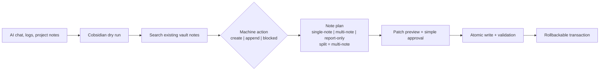
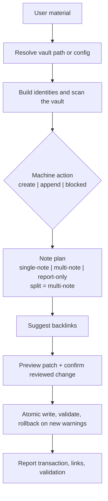

# Cobsidian

English · [简体中文](docs/README.zh-CN.md)

<p align="center">
  
</p>

<p align="center">
  <a href="https://github.com/Totoro-qaq/Cobsidian/releases/latest"></a>
  <a href="https://github.com/Totoro-qaq/Cobsidian/actions/workflows/validate.yml"></a>
  <a href="https://github.com/Totoro-qaq/Cobsidian/actions/workflows/codeql.yml"></a>
  <a href="skills/cobsidian/SKILL.md"></a>
  <a href="integrations/dsh/README.md"></a>
  <a href="LICENSE"></a>
</p>

> Turn AI conversations into linked Obsidian knowledge, safely.

Cobsidian is an agent-agnostic workflow skill for maintaining an Obsidian or Markdown vault. It searches before creating, previews the proposed change, asks for one plain-language confirmation, writes atomically, and validates the result. Integrity hashes stay in the execution layer; users do not copy confirmation codes.

It is not a hosted service or an Obsidian plugin. Your coding agent runs the workflow against a local folder of Markdown files.

[Quick Start](#quick-start) · [How It Works](#how-it-works) · [Install](#install) · [DeepSeek Harness](#deepseek-harness-cordis-bundle) · [MCP Server](docs/mcp-server.md) · [Compatibility](docs/agent-compatibility.md) · [Latest Release](https://github.com/Totoro-qaq/Cobsidian/releases/latest)

Use the agent you already know: [Claude Code](skills/cobsidian/references/hosts/claude-code.md) · [Codex CLI](skills/cobsidian/references/hosts/codex.md) · [GitHub Copilot CLI](skills/cobsidian/references/hosts/github-copilot-cli.md) · [Kimi Code](skills/cobsidian/references/hosts/kimi-code.md) · [OpenCode](skills/cobsidian/references/hosts/opencode.md) · [Pi](skills/cobsidian/references/hosts/pi.md) · [Antigravity](skills/cobsidian/references/hosts/antigravity.md)

<p align="center">
  
</p>

<p align="center"><sub>Synthetic demo vault. No private notes, paths, or credentials.</sub></p>

## Quick Start

Run a read-only dry run against the bundled demo vault:

```bash
git clone https://github.com/Totoro-qaq/Cobsidian.git
cd Cobsidian
python skills/cobsidian/scripts/dry_run.py examples/demo-vault --topic "AI Conversations" --mode learning --text "agent workflow notes" --json
```

Then point your agent at `skills/cobsidian/SKILL.md`:

```text
Use Cobsidian to organize this material into my Obsidian vault.
Vault: /absolute/path/to/obsidian-vault
Run a dry run first, check duplicates, suggest backlinks, and wait for confirmation before writing.
```

## What Cobsidian Does

| Stage | What Cobsidian makes visible |
| --- | --- |
| Read | Resolves the vault and builds identities from filenames, H1s, titles, and aliases. |
| Decide | Reports `create | append | blocked` separately from note shape. |
| Review | Returns duplicate risk, backlink suggestions, and an exact patch plan. |
| Approve | Asks `Apply this reviewed change?`; the selected plan ID stays internal. |
| Write | Verifies the internal plan and file hashes, writes atomically, validates, and keeps rollback available. |

The result is durable Markdown with useful `[[wiki links]]`, not a second copy of a note that already exists.

## Before / After



| Before | After |
| --- | --- |
| Useful answers disappear in chat history | Reusable notes stay in the vault |
| Repeated prompts create near-duplicates | Existing identities are checked first |
| Links are guessed while writing | Backlinks come from actual vault notes |
| Agent edits are hard to audit | A reviewed, integrity-bound plan precedes every write |

## How It Works

```text
search → dry run → review the diff → confirm write → atomic apply → validate
```

The confirmation is intentionally human: **Apply this reviewed change?** On approval, the host passes the exact plan ID associated with that preview to the deterministic writer. The ID, target fingerprint, and before/after SHA-256 values remain internal integrity checks.

- You never need to read, copy, or type a hash.
- Approval applies only to the single change just displayed.
- If the target note or proposed content changes, the old approval becomes invalid and Cobsidian asks again.
- If several previews are pending, Cobsidian identifies them by target and summary instead of guessing which hash you meant.

## Dry-run Preview

Dry run is the default safe path. It reports the decision and leaves `writes` empty.

```json
{
  "dry_run": true,
  "mode": "learning",
  "decision": {
    "action": "append",
    "target_note": "AI Conversations.md"
  },
  "suggested_backlinks": [
    {
      "title": "Agent Workflows",
      "path": "Agent Workflows.md"
    }
  ],
  "writes": []
}
```

## Not Just Markdown Generation

| Ordinary Markdown generation | Cobsidian |
| --- | --- |
| Produces a standalone file | Maintains a linked knowledge system |
| Ignores existing notes | Scans the vault before writing |
| Mixes action and document shape | Separates machine action from note plan |
| Writes immediately | Plans, confirms, writes, validates, and can roll back |

## Knowledge Read / 整理判读

Before writing, Cobsidian computes a Knowledge Read: mode, depth, granularity, evidence, and display choice. `auto | always | off` controls conversational presentation only. With `off`, `display_style` is hidden while the complete JSON remains available in dry-run output.

Capability-based degradation keeps the result honest. A local host can become ready after checks, MCP remains read-only, and a chat-only host returns a draft or requests a usable path instead of claiming work it could not perform. Detailed rules live in the [mode and host references](skills/cobsidian/references/) and the shared [preflight contract](skills/cobsidian/references/preflight.md).

### Compact Knowledge Read

```json
{
  "mode": "learning",
  "mode_explicit": true,
  "recommended_modes": [],
  "depth": "standard",
  "granularity": "single-note",
  "evidence": "conversation",
  "display_policy": "auto",
  "display_style": "compact"
}
```

### Expanded Knowledge Read

```json
{
  "mode": "dissection",
  "mode_explicit": false,
  "recommended_modes": [],
  "depth": "deep",
  "granularity": "multi-note",
  "evidence": "source-grounded",
  "display_policy": "auto",
  "display_style": "expanded"
}
```

## Obsidian Vault Workflow



## Install

Requirements: Git, Python 3.10+, a Markdown vault, and a coding agent that can read local instructions and run commands.

Preview the destinations, then install the skill for supported CLIs:

```bash
python install_cobsidian.py --host all --scope user --dry-run --json
python install_cobsidian.py --host all --scope user
```

Or copy the shared skill manually:

```bash
mkdir -p ~/.agents/skills
cp -r skills/cobsidian ~/.agents/skills/cobsidian
```

See [INSTALL.md](INSTALL.md) for Windows, project-scoped, symlink, update, and uninstall instructions. See [Integrations](docs/integrations.md) for host discovery paths.

### DeepSeek Harness Cordis Bundle

Cobsidian remains an Agent Skill. The optional [DSH Cordis Bundle](integrations/dsh/README.md) packages that same canonical skill and Python backend as a native DeepSeek Harness extension, adding typed tools and one-shot approval without changing the existing Skill, CLI, or MCP paths.

```bash
cd integrations/dsh
npm install
npm run build
dsh plugin --profile web add .

export COBSIDIAN_VAULT="/absolute/path/to/obsidian-vault"
dsh web
```

The native workflow exposes scan, dry-run, prepare, apply, and rollback as separate tools. DSH presents a one-shot approval while carrying the exact plan/transaction ID in the background; users do not paste hashes. Private note material is passed through permission-restricted temporary files rather than process arguments; the bundle stores plans under `~/.dsh/cobsidian` by default and does not store API keys or tokens.

The bundle currently targets the DSH `0.1.0-rc.6` API family because DeepSeek Harness is still a developer preview. See the [bundle guide](integrations/dsh/README.md) for configuration, use, and verification.

### MCP Server

Hosts with Model Context Protocol support can run Cobsidian as a local, read-only `stdio` server:

```bash
python -m pip install -r requirements-mcp.txt
python skills/cobsidian/mcp_server.py
```

Configure `COBSIDIAN_CONFIG` or `COBSIDIAN_VAULT`; see [MCP Server](docs/mcp-server.md).

## Agent Usage

Give the agent the workflow, the vault, and the safety boundary:

```text
Use Cobsidian to turn this conversation into an Obsidian learning note.
Check whether it should create a new note or append to an existing one.
Add useful wiki links, report possible duplicates, and wait before writing.
```

Copy-ready variants live in [Prompt Examples](examples/prompts.md).

## Modes

Cobsidian accepts an explicit mode or routes from natural language. Clear requests use one inferred mode; ambiguous requests recommend at most two relevant modes. See [Modes](docs/modes.md) and the detailed [mode references](skills/cobsidian/references/modes/).

## CLI Utilities

Deterministic helpers cover vault scanning, duplicate detection, backlink suggestions, validation, dry runs, transaction preparation, exact-plan application, and quality evaluation:

```bash
python skills/cobsidian/scripts/scan_vault.py /path/to/vault --json
python skills/cobsidian/scripts/find_duplicates.py /path/to/vault
python skills/cobsidian/scripts/suggest_backlinks.py /path/to/vault --file draft.md
python skills/cobsidian/scripts/validate_notes.py /path/to/vault
python skills/cobsidian/scripts/write_executor.py prepare /path/to/vault --action append --target-note "RAG.md" --content-file draft.md --plan-out /tmp/cobsidian-plan.json
python skills/cobsidian/scripts/write_executor.py apply /path/to/vault --plan /tmp/cobsidian-plan.json --confirm PLAN_ID --json
```

## Optional Config

`cobsidian.config.example.yml` is the current supported config surface. It covers the vault path, mode directories, Knowledge Read presentation, backlink limit, duplicate threshold, append preference, and validation behavior.

```yaml
interaction:
  knowledge_read: auto
```

Copy it to `cobsidian.config.yml`; helper scripts accept `--config cobsidian.config.yml`.

## Features

- Deterministic title and alias identity matching, including prefix-free core titles.
- CJK bigrams and trigrams for related-phrase matching.
- Missing wiki-link and similar-title validation.
- Paginated local MCP tools for inspection and dry-run planning.
- Integrity-hashed patches with human confirmation, internal exact-plan binding, atomic writes, and rollback.
- Public quality evaluation for duplicate, backlink, append-target, and mode accuracy.

## Roadmap

- Semantic duplicate detection beyond title identity.
- Larger labeled-vault benchmarks for backlink ranking.
- Optional note templates and configurable naming rules.
- Optional Obsidian plugin integration after the workflow stabilizes.

## Contributing

Contributions are welcome. Read [CONTRIBUTING.md](CONTRIBUTING.md), and never include private vault content, local profile paths, API keys, unpublished notes, or personal screenshots.

## Trademark And Affiliation Notice

Cobsidian is an independent open-source project. OpenAI, Codex, Obsidian, Claude, Cursor, Hermes, and other names are trademarks of their respective owners. This project is not affiliated with, endorsed by, or sponsored by those owners.

## License

[MIT](LICENSE) © 2026 Totoro.
