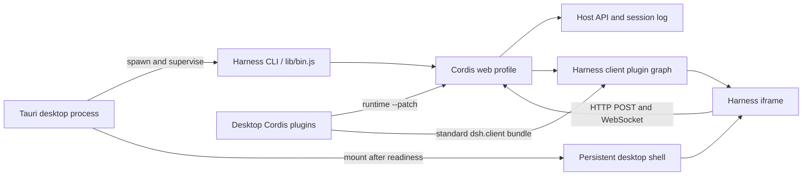

<p align="center">
  
</p>

<h1 align="center">🐋 DeepSeek Harness Desktop</h1>

<p align="center">
  <strong>把完整 DeepSeek Harness 装进轻巧的 Tauri 桌面壳。</strong><br />
  不捆绑 Chromium，不另造业务内核，解压即可使用 ฅ( ̳• ·̫ • ̳ฅ)
</p>

<p align="center">
  <a href="https://github.com/WJZ-P/deepseek-harness-desktop/releases">
    
  </a>
  <a href="https://github.com/WJZ-P/deepseek-harness-desktop/actions/workflows/release.yml">
    
  </a>
  <a href="https://v2.tauri.app/">
    
  </a>
  <a href="LICENSE">
    
  </a>
</p>

<p align="center">
  <a href="https://github.com/WJZ-P/deepseek-harness-desktop/releases/latest"><strong>下载最新版本</strong></a>
  · <a href="ARCHITECTURE.md">架构说明</a>
  · <a href="HARNESS_UPSTREAM.md">Harness 上游记录</a>
</p>

---

## 📦 下载与使用

前往 **[GitHub Releases](https://github.com/WJZ-P/deepseek-harness-desktop/releases/latest)**，选择与你的平台对应的文件：

| 平台 | 发行格式 | 使用方式 |
| --- | --- | --- |
| Windows x64 | Portable ZIP | 解压后双击 `DeepSeek Harness.exe` |
| Linux x64 | AppImage | 添加执行权限后直接运行 |
| Debian / Ubuntu x64 | DEB | 使用系统包管理器安装 |
| macOS Apple Silicon | DMG | 适用于 M 系列芯片 |
| macOS Intel | DMG | 适用于 Intel 芯片 |

> [!TIP]
> **资源就在身边啦 (｡•̀ᴗ-)✧** Windows portable ZIP 内已经放入展开后的 `runtime/harness/`。把整个 ZIP 解压一次后，应用会直接读取 EXE 旁边的运行时，不再二次解压，也不会复制一份到 AppData；源码入口、前端资源与生产依赖都能在当前文件夹中直接找到。

Windows 便携版无需另外安装 Node.js，也无需准备 Harness 源码目录。请保持 `DeepSeek Harness.exe` 与 `runtime/` 在同一个目录中。

> [!NOTE]
> 当前发行包没有商业代码签名或 Apple notarization。Windows SmartScreen 或 macOS“隐私与安全”可能要求用户额外确认。

## ✨ 为什么是这个桌面端

| 特性 | 实现 |
| --- | --- |
| 🪶 **轻量** | 使用系统 WebView；Windows 是 WebView2，macOS 是 WKWebView，Linux 是 WebKitGTK，不随应用捆绑 Chromium。 |
| 🧩 **能力完整** | 继续使用 Harness 的 Agent、会话、工具、插件、Typert RPC 与 Cordis profile，没有第二套业务内核。 |
| 📦 **真正便携** | 各平台发行包内置匹配平台的 Node.js 与完整生产运行时，用户不需要手动配置开发环境。 |
| 🐋 **启动有反馈** | 启动页按“读取便携运行时 → 启动本地服务 → 载入工作区”展示真实阶段，不用再等待 AppData 解压。 |
| 🎨 **原生体验** | 32px 自绘标题栏、深浅主题同步、优雅的鲸鱼加载动画，并抑制后台控制台闪窗。 |
| 🖼️ **拖入附件** | 图片继续走 Harness 原生预览与历史画廊；其他文件由独立、可安装的 DSH 插件提供拖放、输入卡片、历史卡片与下载。 |
| 🔍 **源码完整** | `harness/` 由本仓库直接跟踪，不是 Git 子模块；普通 clone 就能获得完整源码。 |

一句话概括：**Tauri 负责把窗口做得轻巧漂亮，Harness 继续负责真正的工作。** ₍^. .^₎⟆

## 🚀 快速开始

### 环境要求

- Node.js `^22.19.0 || >=24.0.0`
- pnpm
- Rust stable toolchain
- Windows：Microsoft C++ Build Tools 与 WebView2
- macOS：Xcode Command Line Tools
- Linux：WebKitGTK 4.1、Ayatana AppIndicator、RSVG 与 XDO 开发包

### 克隆并运行

```powershell
git clone https://github.com/WJZ-P/deepseek-harness-desktop.git
cd deepseek-harness-desktop
pnpm install
pnpm tauri dev
```

`harness/` 已直接包含在仓库中，无需初始化 Git submodule。两个通用插件是独立仓库，桌面项目通过 [`external-plugins.json`](external-plugins.json) 锁定其提交，并在首次开发运行时自动准备到已忽略的 `plugins/` 工作区。Tauri 的 `beforeDevCommand` 会依次：

1. 校验 Harness 关键源码；
2. 根据 `harness/pnpm-lock.yaml` 准备依赖；
3. 在产物缺失或落后时构建 Harness CLI 与 Web UI；
4. 获取、安装并构建锁定版本的外部插件；
5. 启动 Vite，再由 Tauri 启动 Harness Host。

也可以提前执行：

```powershell
pnpm run harness:prepare
pnpm run plugin:sync
```

Vite 开发地址固定为 `http://localhost:821`，HMR 使用端口 `822`。Harness Host 使用操作系统分配的随机回环端口，避免与其他开发软件冲突。

如果 Node.js 不在 GUI 进程可见的 `PATH` 中，可以用 `DSH_DESKTOP_NODE` 指定绝对路径；`DEEPSEEK_HARNESS_ROOT` 可临时指向其他 Harness checkout。

## 🗂️ 仓库结构

```text
deepseek-harness-desktop/
├─ desktop-plugins/ # 仅由桌面封装携带的 Cordis 集成
├─ docs/assets/     # README Banner 等项目图片
├─ external-plugins.json # 外部插件仓库与提交锁
├─ harness/         # 本仓库直接跟踪的完整 DeepSeek Harness 源码
├─ plugins/         # 本地外部插件 checkout；整个目录由父仓库忽略
├─ scripts/         # Harness 准备、发行构建与验证脚本
├─ src/             # 桌面外壳、自绘标题栏与启动/错误页
├─ src-tauri/       # Rust 窗口、便携运行时定位与进程监督器
├─ app-icon.svg     # 应用图标源文件
└─ package.json
```

上游地址、导入提交与许可证记录见 [`HARNESS_UPSTREAM.md`](HARNESS_UPSTREAM.md)。

### 🧩 低侵入插件边界

桌面专属桥与桌面预装的通用插件都没有继续散落进 `harness/` 业务包，而是通过启动时的 Cordis `--patch` 覆盖层装入。可复用插件各自拥有独立仓库、锁文件、CI 与发布边界；桌面仓库只记录来源和精确提交：

- `desktop-bridge`：在 Host 返回 HTML 时注入深浅主题同步桥，并把 Desktop 以 `file://` 挂载的标准插件映射回同一份 `dsh.client` 启动图；公开插件无需携带 Tauri 分支，也不再改写生成后的 `index.html`；
- [`dsh-attachments`](https://github.com/WJZ-P/dsh-attachments)：标准 DSH bundle，同时声明 `dsh.bundle` 与 Web `dsh.client`，既可由桌面封装携带，也可通过 `dsh plugin --profile web add` 安装到原生 DSH；它沿用 Harness 已有的图片拖放/粘贴链路，只接管普通文件与文件夹。拖入一个文件夹只生成一个附件卡片，并以完整目录树的形式复制到工作区；同时提供流式上传/下载、输入区附件卡片与持久历史卡片。插件本身不设置文件数量或单文件字节上限，也不额外占用输入栏按钮；
- [`dsh-model-capabilities`](https://github.com/WJZ-P/dsh-model-capabilities)：标准 DSH bundle；在新增或编辑 pi-ai 模型时提供 Input Modalities 选择，可明确声明继承默认值、文本、图片或文本加图片，并可独立安装到原生 DSH；
- 普通文件会保存到 Harness 数据目录，并在消息真正进入模型步骤前复制到工作区 `.deepseek-harness/attachments/`，模型拿到的是可直接读取的工作区路径；
- `harness/` 内只保留通用的 **输入附件栏 slot** 与 **模型行字段 slot**；浏览器 bundle 直接使用 Harness 官方 `dsh.client` 发现链路，具体 UI、存储和消息关联逻辑留在独立插件仓库与 `desktop-plugins/`。以后同步上游时，冲突面依旧很小喵～

## 🧭 架构



- 开发模式直接从 `harness/apps/cli/lib/bin.js` 启动。
- 发行模式直接从应用资源目录的 `runtime/harness/` 执行 `lib/bin.js web --patch <desktop-overlay> --host 127.0.0.1 --port 0`，不创建 AppData 运行时副本。
- Rust 进程读取 `dsh web:` 就绪行，仅接受 `127.0.0.1` 随机端口，再交给桌面 WebView 加载。
- WebView 继续复用现有 Host fence、`/api` 传输和两条 WebSocket 下行流。
- 关闭窗口或应用时，桌面层会回收整个 Node 子进程树。
- 启动页跟随系统深浅主题；Harness 载入后，通过受控主题桥实时跟随应用内 Appearance 设置。

更完整的设计说明见 [`ARCHITECTURE.md`](ARCHITECTURE.md)。

## 🛠️ 常用命令

| 命令 | 用途 |
| --- | --- |
| `pnpm tauri dev` | 启动 Harness 与 Tauri 开发环境 |
| `pnpm run harness:prepare` | 校验、安装并按需构建 Harness |
| `pnpm run plugin:sync` | 按 `external-plugins.json` 准备外部插件 checkout 与依赖 |
| `pnpm run plugin:test` | 构建并测试桌面桥及锁定版本的外部插件 |
| `pnpm run check` | 校验 Harness 源码完整性、TypeScript 与 Rust |
| `pnpm run build:frontend` | 只构建桌面启动外壳，不生成原生发行包 |
| `pnpm run build` | 构建当前平台的完整自包含发行包 |
| `pnpm run test:release` | 在 Windows 上真实启动并冒烟测试 portable ZIP |
| `pnpm run verify:release-artifacts` | 校验平台产物及 SHA-256 |

## 🏗️ 构建发行包

请在目标操作系统的原生环境中运行：

```bash
pnpm install
pnpm run build
pnpm run verify:release-artifacts
```

构建流程会依次准备 Harness、同步并构建锁定提交的外部插件、生成并校验生产依赖闭包、内置当前平台 Node.js、执行随机回环端口 HTTP 冒烟，再把展开后的生产运行时作为 Tauri resource 编译并打包。Windows portable ZIP 中会保留可直接浏览的 `runtime/harness/` 原始目录结构。

| 平台 | Release 资产命名 |
| --- | --- |
| Windows x64 | `DeepSeek-Harness-Desktop-<version>-windows-x64-portable.zip` |
| Linux x64 | `DeepSeek-Harness-Desktop-<version>-linux-x64.AppImage`、`.deb` |
| macOS Apple Silicon | `DeepSeek-Harness-Desktop-<version>-macos-arm64.dmg` |
| macOS Intel | `DeepSeek-Harness-Desktop-<version>-macos-x64.dmg` |

每个资产都会附带独立的 `.sha256` 文件。Linux 与 macOS 的 Node/Harness 目录作为 Tauri resource 放入原生包；Windows 则使用无需安装的 portable ZIP，并从 EXE 相邻目录直接启动运行时。

Windows 的完整便携版冒烟测试会确认展开目录直启、没有新增 AppData 运行时副本、内置 Node、主题桥、附件浏览器插件、随机回环 HTTP、WebView 连接与进程树回收：

```powershell
pnpm run test:release
```

## 🤖 GitHub Actions 发布

`.github/workflows/release.yml` 会在推送 `v*` tag 时并行使用 Windows x64、Ubuntu 22.04 x64、macOS arm64 与 macOS Intel runner。

流水线会先验证 tag、`package.json`、Tauri 配置和 Cargo 版本一致，再构建并验证所有平台产物；只有矩阵任务全部成功后，publish job 才会一次性更新 GitHub Release。

- Release 显示名称直接使用 tag，例如 `v1.0.1`；
- 已存在的同名 Release 会覆盖旧资产；
- 构建不需要额外密钥，发布权限来自仓库的 `GITHUB_TOKEN`；
- 单个平台构建最长运行 90 分钟。

正式版本确认可用后，再创建与应用版本一致的 `v*` tag。稳稳发布，一次成功 (๑•̀ㅂ•́)و✧

## 🌱 更新 Harness

`harness/` 是从明确上游提交导入的源码快照。更新时应整体导入一个确认过的上游提交，并在同一改动中更新 [`HARNESS_UPSTREAM.md`](HARNESS_UPSTREAM.md) 的提交号。

`harness/` 保持普通 Git 文件；`node_modules/`、Harness 的 `lib/` / `dist/`、`desktop-plugins/*/lib/` 以及整个本地 `plugins/` 工作区都在忽略范围内。公共插件的变更应提交到各自仓库，再同步更新 [`external-plugins.json`](external-plugins.json) 的提交锁。

更新后至少运行：

```powershell
pnpm run harness:prepare
pnpm run build:frontend
cargo test --manifest-path src-tauri/Cargo.toml
cargo check --manifest-path src-tauri/Cargo.toml
pnpm run build
pnpm run test:release
```

提交或推送前，还可以单独确认关键 Harness 文件确实由 desktop 仓库跟踪：

```powershell
pnpm run harness:verify-source
```

该检查会拒绝 `160000` gitlink、缺失的关键源文件或明显不完整的源码树；`pnpm run check` 也会自动执行它。

## 🎨 主题与图标

- 图标源文件：[`app-icon.svg`](app-icon.svg)
- Tauri 平台图标：`src-tauri/icons/`
- 浅色鲸鱼：[`src/assets/whale-icon-light.svg`](src/assets/whale-icon-light.svg)
- 深色鲸鱼：[`src/assets/whale-icon-dark.svg`](src/assets/whale-icon-dark.svg)

深色鲸鱼使用 `--dsw-alias-label-primary`，回退值为 `#F9FAFB` / `rgb(249, 250, 251)`。更新图标源文件后可以重新生成平台图标：

```powershell
pnpm tauri icon app-icon.svg
```

## 📄 源码与分发边界

- 源码仓库保留完整 `harness/`，供审计、本地开发与二次构建；
- Release 资产携带从仓库源码生成的展开式生产运行时，而不是开发依赖树；Windows 用户可以直接浏览 EXE 旁边的 `runtime/harness/`；
- Windows 使用 portable ZIP，Linux 提供 AppImage 与 DEB，macOS 提供 ad-hoc 签名的 DMG；
- 桌面层与 Harness 上游的许可信息分别见 [`LICENSE`](LICENSE) 和 [`HARNESS_UPSTREAM.md`](HARNESS_UPSTREAM.md)。

## 🤝 社区支持

本项目支持 **[Linux Do 社区](https://linux.do/)**。欢迎大家前往社区交流技术、分享经验，一起友善地探索更多有趣的可能～ (｡•̀ᴗ-)✧

<p align="center">
  <strong>愿这只小鲸鱼轻轻巧巧，也能把事情认真做好～</strong><br />
  ʚ(｡˃ ᵕ ˂ )ɞ
</p>
